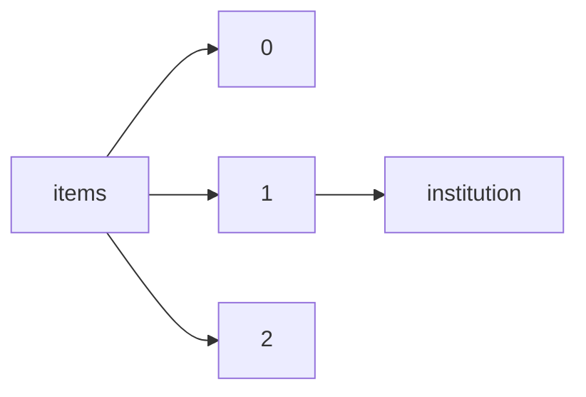

!!! warning "This document is not official Crossref documentation"
# Institution
PATH = items/array/institution(1)  
Occurs 3 848 827 times  
{ .annotate }

1. A route to an element, for example:  
   The route "items/array/institution" corresponds to navigating through the JSON indices as  
   ["items"][0]["institution"]  

## Properties of Array
See information about elements: [items/array/institution/array](array/index.md)  
Distribution of lengths:  

| **Row** | **Length** `Any` | **Count** `Int64` |
|--------:|--------------------:|---------------------:|
| **1**   | 1                   | 3 420 790            |
| **2**   | 2                   | 284 865              |
| **3**   | 3                   | 131 470              |
| **4**   | 4                   | 9 335                |
| **5**   | 5                   | 2 366                |
| **6**   | 6                   | 1                    |

