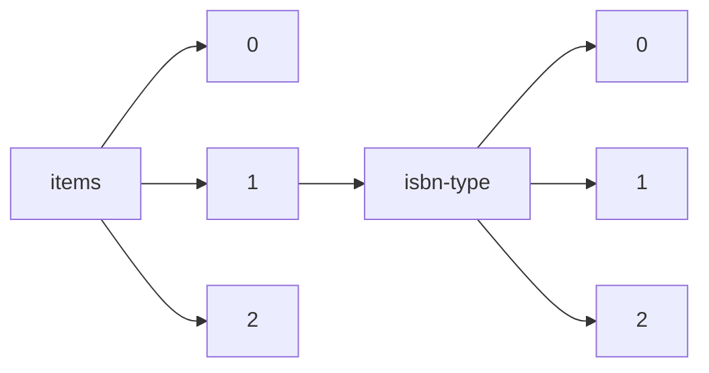

!!! warning "This document is not official Crossref documentation"
# Elements
PATH = items/array/isbn-type/array(1)  
Occurs 17 369 652 times  
{ .annotate }

1. A route to an element, for example:  
   The route "items/array/isbn-type/array" corresponds to navigating through the JSON indices as  
   ["items"][0]["isbn-type"][0]  

## Type
See more information: [items/array/isbn-type/array/type](type/index.md)  
Occurs 17 369 652 timess  
Unique values: 2  

| **Row** | **Value** `String` | **Count** `Int64` |
|--------:|----------------------:|---------------------:|
| **1**   | electronic            | 9 456 101            |
| **2**   | print                 | 7 913 551            |

## Value
See more information: [items/array/isbn-type/array/value](value/index.md)  
Occurs 17 369 652 timess  
Unique values: > 999  

!!! note "Due to current limitations, only the first 1,000 unique values are counted."

| **Row** | **Value** `String` | **Count** `Int64` |
|--------:|----------------------:|---------------------:|
| **1**   | 9783476057280         | 46 386               |
| **2**   | 9783540710950         | 11 343               |
| **3**   | 9783540710943         | 11 343               |
| **4**   | 9783540938231         | 10 081               |
| **5**   | 9783540938248         | 10 081               |
| **6**   | 9783540706083         | 7 757                |
| **7**   | 9783540706090         | 7 757                |
| **8**   | 9783662490549         | 7 124                |
| **9**   | 9781405179355         | 4 779                |
| **10**  | 9781444338386         | 4 779                |
| ... | ... | ... |

