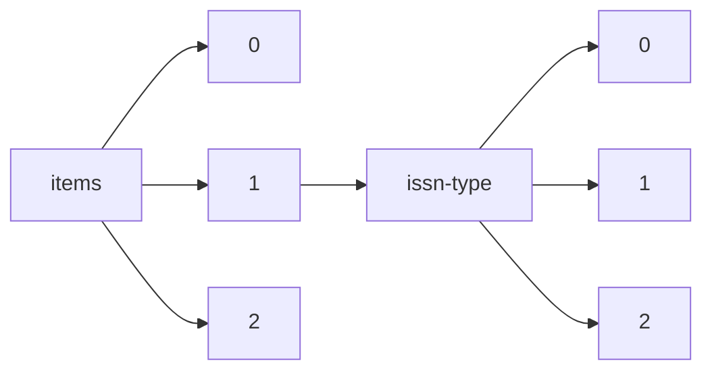

!!! warning "This document is not official Crossref documentation"
# Elements
PATH = items/array/issn-type/array(1)  
Occurs 156 611 684 times  
{ .annotate }

1. A route to an element, for example:  
   The route "items/array/issn-type/array" corresponds to navigating through the JSON indices as  
   ["items"][0]["issn-type"][0]  

## Type
See more information: [items/array/issn-type/array/type](type/index.md)  
Occurs 156 611 684 timess  
Unique values: 2  

| **Row** | **Value** `String` | **Count** `Int64` |
|--------:|----------------------:|---------------------:|
| **1**   | print                 | 92 685 785           |
| **2**   | electronic            | 63 925 899           |

## Value
See more information: [items/array/issn-type/array/value](value/index.md)  
Occurs 156 611 684 timess  
Unique values: > 999  

!!! note "Due to current limitations, only the first 1,000 unique values are counted."

| **Row** | **Value** `String` | **Count** `Int64` |
|--------:|----------------------:|---------------------:|
| **1**   | 1556-5068             | 651 367              |
| **2**   | 0302-9743             | 486 093              |
| **3**   | 0931-7597             | 481 092              |
| **4**   | 0140-6736             | 457 532              |
| **5**   | 1611-3349             | 448 657              |
| **6**   | 0277-786X             | 429 214              |
| **7**   | 1476-4687             | 419 722              |
| **8**   | 0028-0836             | 419 690              |
| **9**   | 0959-8138             | 398 893              |
| **10**  | 1468-5833             | 381 803              |
| ... | ... | ... |

