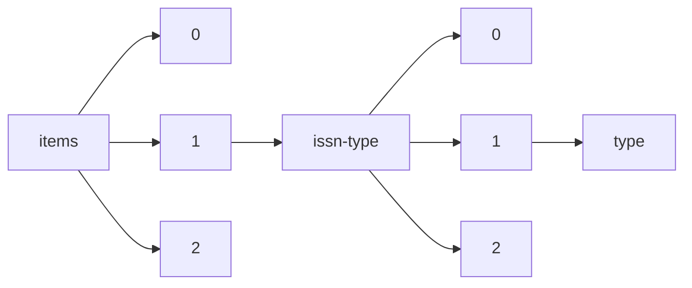

!!! warning "This document is not official Crossref documentation"
# Type
PATH = items/array/issn-type/array/type(1)  
Occurs 156 611 684 times  
Unique values: 2  
{ .annotate }

1. A route to an element, for example:  
   The route "items/array/issn-type/array/type" corresponds to navigating through the JSON indices as  
   ["items"][0]["issn-type"][0]["type"]  

| **Row** | **Value** `String` | **Count** `Int64` |
|--------:|----------------------:|---------------------:|
| **1**   | print                 | 92 685 785           |
| **2**   | electronic            | 63 925 899           |

