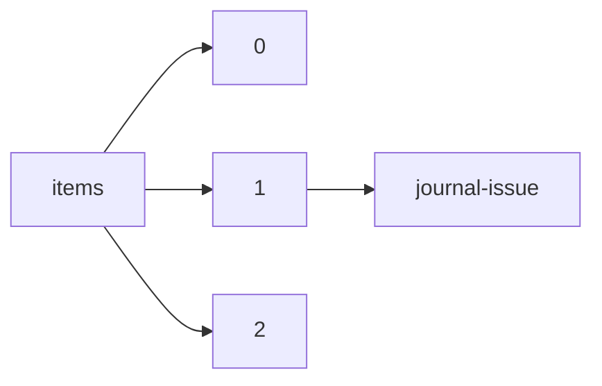

!!! warning "This document is not official Crossref documentation"
# Journal-issue
PATH = items/array/journal-issue(1)  
Occurs 88 365 903 times  
{ .annotate }

1. A route to an element, for example:  
   The route "items/array/journal-issue" corresponds to navigating through the JSON indices as  
   ["items"][0]["journal-issue"]  

## Issue
See more information: [items/array/journal-issue/issue](issue/index.md)  
Occurs 88 364 048 timess  
Unique values: > 999  

!!! note "Due to current limitations, only the first 1,000 unique values are counted."

| **Row** | **Value** `String` | **Count** `Int64` |
|--------:|----------------------:|---------------------:|
| **1**   | 1                     | 16 038 887           |
| **2**   | 2                     | 12 413 839           |
| **3**   | 3                     | 10 279 904           |
| **4**   | 4                     | 8 944 139            |
| **5**   | 5                     | 4 972 999            |
| **6**   | 6                     | 4 704 960            |
| **7**   | 7                     | 2 263 818            |
| **8**   | 8                     | 2 191 073            |
| **9**   | 10                    | 2 082 139            |
| **10**  | 9                     | 2 054 599            |
| ... | ... | ... |

## Published-online
See more information: [items/array/journal-issue/published-online](published-online/index.md)  
Occurs 19 792 919 timess  

## Published-print
See more information: [items/array/journal-issue/published-print](published-print/index.md)  
Occurs 72 488 438 timess  

