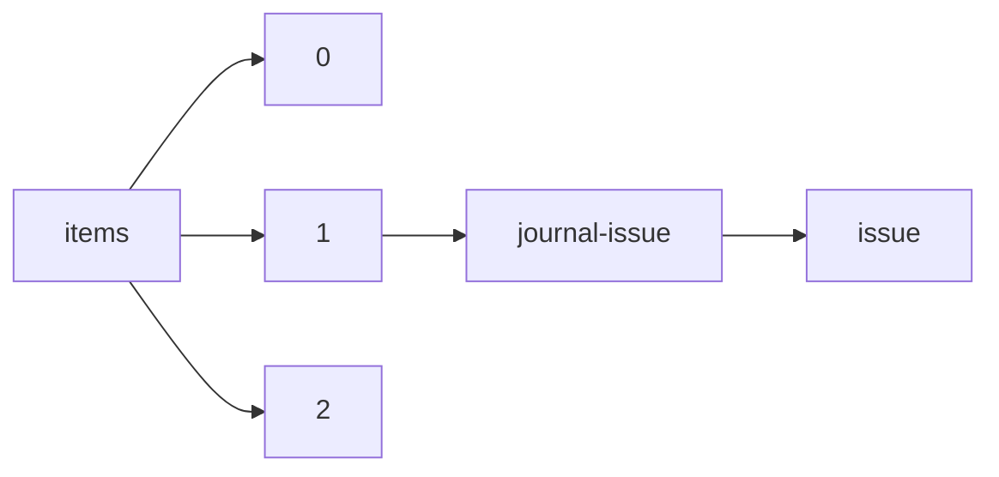

!!! warning "This document is not official Crossref documentation"
# Issue
PATH = items/array/journal-issue/issue(1)  
Occurs 88 364 048 times  
Unique values: > 999  
{ .annotate }

1. A route to an element, for example:  
   The route "items/array/journal-issue/issue" corresponds to navigating through the JSON indices as  
   ["items"][0]["journal-issue"]["issue"]  

!!! note "Due to current limitations, only the first 1,000 unique values are counted."

| **Row** | **Value** `String` | **Count** `Int64` |
|--------:|----------------------:|---------------------:|
| **1**   | 1                     | 16 038 887           |
| **2**   | 2                     | 12 413 839           |
| **3**   | 3                     | 10 279 904           |
| **4**   | 4                     | 8 944 139            |
| **5**   | 5                     | 4 972 999            |
| **6**   | 6                     | 4 704 960            |
| **7**   | 7                     | 2 263 818            |
| **8**   | 8                     | 2 191 073            |
| **9**   | 10                    | 2 082 139            |
| **10**  | 9                     | 2 054 599            |
| **11**  | 11                    | 1 958 774            |
| **12**  | 12                    | 1 934 344            |
| **13**  | 1-2                   | 900 679              |
| **14**  | 3-4                   | 458 861              |
| **15**  | 0                     | 431 262              |
| **16**  | 13                    | 402 121              |
| **17**  | 14                    | 360 175              |
| **18**  | 15                    | 350 350              |
| **19**  | 16                    | 341 738              |
| **20**  | 17                    | 328 376              |
| **21**  | 18                    | 326 210              |
| **22**  | 21                    | 324 832              |
| **23**  | 19                    | 305 903              |
| **24**  | 22                    | 299 921              |
| **25**  | S1                    | 297 764              |
| **26**  | 20                    | 294 801              |
| **27**  | 23                    | 293 445              |
| **28**  | 24                    | 283 614              |
| **29**  | 01                    | 281 948              |
| **30**  | 2-3                   | 263 306              |
| **31**  | 1-3                   | 262 084              |
| **32**  | 02                    | 249 274              |
| **33**  | 03                    | 223 087              |
| **34**  | 04                    | 206 038              |
| **35**  | 1-4                   | 189 489              |
| **36**  | 5-6                   | 160 103              |
| **37**  | 25                    | 156 954              |
| **38**  | 26                    | 147 084              |
| **39**  | 05                    | 130 040              |
| **40**  | 06                    | 117 446              |
| **41**  | 27                    | 102 862              |
| **42**  | Supplement\_1         | 98 116               |
| **43**  | 28                    | 96 520               |
| **44**  | 30                    | 96 281               |
| **45**  | 7-8                   | 95 959               |
| **46**  | 29                    | 94 653               |
| **47**  | 31                    | 93 735               |
| **48**  | 32                    | 92 831               |
| **49**  | 34                    | 92 770               |
| **50**  | 36                    | 92 501               |
| **51**  | 33                    | 92 342               |
| **52**  | 35                    | 91 934               |
| **53**  | Supplement            | 91 838               |
| **54**  | 37                    | 86 229               |
| **55**  | 40                    | 85 807               |
| **56**  | 38                    | 85 739               |
| **57**  | 39                    | 84 929               |
| **58**  | 41                    | 82 502               |
| **59**  | 42                    | 82 378               |
| **60**  | 43                    | 82 150               |
| **61**  | 44                    | 81 576               |
| **62**  | 45                    | 81 266               |
| **63**  | 46                    | 79 637               |
| **64**  | 08                    | 78 515               |
| **65**  | 48                    | 77 721               |
| **66**  | 47                    | 77 673               |
| **67**  | 07                    | 74 025               |
| **68**  | 09                    | 73 696               |
| **69**  | suppl\_1              | 73 290               |
| **70**  | S2                    | 70 747               |
| **71**  | 49                    | 70 282               |
| **72**  | 50                    | 69 640               |
| **73**  | 4-5                   | 67 284               |
| **74**  | 15\_suppl             | 65 273               |
| **75**  | 11-12                 | 64 439               |
| **76**  | 51                    | 64 393               |
| **77**  | 9-10                  | 55 219               |
| **78**  | 52                    | 54 533               |
| **79**  | Supplement 1          | 50 942               |
| **80**  | Suppl 1               | 50 691               |
| **81**  | 1/2                   | 50 363               |
| **82**  | 1-6                   | 45 275               |
| **83**  | 4S                    | 38 993               |
| **84**  | 3/4                   | 37 355               |
| **85**  | s1                    | 36 614               |
| **86**  | S 01                  | 36 454               |
| **87**  | 6-7                   | 32 172               |
| **88**  | 4-6                   | 31 143               |
| **89**  | S3                    | 31 116               |
| **90**  | 8-9                   | 29 870               |
| **91**  | Suppl 2               | 29 076               |
| **92**  | 1\_Supplement         | 28 471               |
| **93**  | 2-4                   | 28 451               |
| **94**  | sup1                  | 28 115               |
| **95**  | Supplement\_2         | 26 127               |
| **96**  | Suppl\_1              | 24 968               |
| **97**  | 8\_Supplement         | 24 281               |
| **98**  | 13\_Supplement        | 22 148               |
| **99**  | a1                    | 21 814               |
| **100** | 53                    | 19 975               |
| **101** | S 1                   | 18 606               |
| **102** | suppl 1               | 18 286               |
| **103** | 54                    | 18 264               |
| **104** | 10-11                 | 18 253               |
| **105** | 55                    | 18 108               |
| **106** | 56                    | 17 659               |
| **107** | 1\_suppl              | 17 611               |
| **108** | 57                    | 16 539               |
| **109** | 58                    | 16 129               |
| **110** | Supplement\_3         | 15 806               |
| **111** | 59                    | 15 722               |
| **112** | 2/3                   | 15 616               |
| **113** | 60                    | 15 180               |
| **114** | 62                    | 15 096               |
| **115** | 61                    | 14 878               |
| **116** | 63                    | 14 459               |
| **117** | supplement            | 14 448               |
| **118** | 65                    | 14 327               |
| **119** | 64                    | 14 301               |
| **120** | suppl\_3              | 14 109               |
| **121** | JG                    | 13 835               |
| **122** | S4                    | 13 764               |
| **123** | 66                    | 13 742               |
| **124** | 68                    | 13 489               |
| **125** | 67                    | 13 426               |
| **126** | Suppl 3               | 13 132               |
| **127** | 69                    | 13 014               |
| **128** | 70                    | 12 371               |
| **129** | 71                    | 12 095               |
| **130** | null                  | 11 925               |
| **131** | 5S                    | 11 852               |
| **132** | 13-14                 | 11 838               |
| **133** | 72                    | 11 818               |
| **134** | 73                    | 11 751               |
| **135** | jg                    | 10 833               |
| **136** | 74                    | 10 809               |
| **137** | 3\_suppl              | 10 803               |
| **138** | 4\_Supplement         | 10 494               |
| **139** | 75                    | 10 465               |
| **140** | 77                    | 10 337               |
| **141** | 76                    | 10 245               |
| **142** | 1-5                   | 10 193               |
| **143** | 80                    | 10 158               |
| **144** | 78                    | 10 114               |
| **145** | 79                    | 10 045               |
| **146** | 81                    | 9 923                |
| **147** | 82                    | 9 642                |
| **148** | suppl\_2              | 9 622                |
| **149** | 87                    | 9 493                |
| **150** | 17-18                 | 9 443                |
| **151** | 5/6                   | 9 433                |
| **152** | Suppl. 1              | 9 425                |
| **153** | 83                    | 9 372                |
| **154** | 85                    | 9 314                |
| **155** | 84                    | 9 137                |
| **156** | 91                    | 9 100                |
| **157** | 89                    | 8 873                |
| **158** | 4\_suppl              | 8 851                |
| **159** | 3-5                   | 8 700                |
| **160** | 86                    | 8 699                |
| **161** | 90                    | 8 664                |
| **162** | 16\_suppl             | 8 612                |
| **163** | 15-16                 | 8 557                |
| **164** | 92                    | 8 516                |
| **165** | 94                    | 8 457                |
| **166** | 88                    | 8 379                |
| **167** | 93                    | 8 290                |
| **168** | S5                    | 8 283                |
| **169** | Supplement 4          | 8 161                |
| **170** | 1/4                   | 8 155                |
| **171** | 18\_suppl             | 8 076                |
| **172** | 95                    | 8 049                |
| **173** | 96                    | 7 961                |
| **174** | 100                   | 7 913                |
| **175** | 99                    | 7 882                |
| **176** | s2                    | 7 807                |
| **177** | Supplement 2          | 7 798                |
| **178** | 97                    | 7 728                |
| **179** | 98                    | 7 699                |
| **180** | 12\_Supplement        | 7 556                |
| **181** | 1A                    | 7 483                |
| **182** | 19-20                 | 7 338                |
| **183** | 23-24                 | 7 307                |
| **184** | 21-22                 | 7 253                |
| **185** | 1-12                  | 7 245                |
| **186** | Issue 1               | 7 206                |
| **187** | 101                   | 7 157                |
| **188** | Suppl\_3              | 7 096                |
| **189** | 10S                   | 7 019                |
| **190** | 5-8                   | 6 916                |
| **191** | 102                   | 6 908                |
| **192** | 103                   | 6 831                |
| **193** | 108                   | 6 812                |
| **194** | suppl 2               | 6 793                |
| **195** | Issue 2               | 6 782                |
| **196** | 104                   | 6 676                |
| **197** | S6                    | 6 656                |
| **198** | 107                   | 6 655                |
| **199** | 9S                    | 6 628                |
| **200** | 109                   | 6 621                |
| **201** | 105                   | 6 614                |
| **202** | 112                   | 6 607                |
| **203** | 116                   | 6 539                |
| **204** | Issue 3               | 6 513                |
| **205** | 106                   | 6 486                |
| **206** | 19\_Supplement        | 6 481                |
| **207** | 2S                    | 6 445                |
| **208** | 113                   | 6 438                |
| **209** | 117                   | 6 402                |
| **210** | 114                   | 6 352                |
| **211** | Issue 4               | 6 341                |
| **212** | 110                   | 6 305                |
| **213** | 118                   | 6 287                |
| **214** | 115                   | 6 268                |
| **215** | sup2                  | 6 192                |
| **216** | 1/3                   | 6 162                |
| **217** | 111                   | 6 116                |
| **218** | 24\_Supplement        | 6 097                |
| **219** | 15\_Supplement        | 6 069                |
| **220** | suppl                 | 6 024                |
| **221** | 14\_Supplement        | 5 995                |
| **222** | Jahresband            | 5 986                |
| **223** | 3A                    | 5 964                |
| **224** | 120                   | 5 944                |
| **225** | 10-12                 | 5 886                |
| **226** | 119                   | 5 863                |
| **227** | 9-12                  | 5 841                |
| **228** | 124                   | 5 789                |
| **229** | 122                   | 5 728                |
| **230** | 121                   | 5 713                |
| **231** | 125                   | 5 696                |
| **232** | 2\_suppl              | 5 670                |
| **233** | Suppl                 | 5 611                |
| **234** | 7-9                   | 5 604                |
| **235** | 126                   | 5 556                |
| **236** | 6S                    | 5 543                |
| **237** | 123                   | 5 475                |
| **238** | Special               | 5 463                |
| **239** | 127                   | 5 453                |
| **240** | S 02                  | 5 401                |
| **241** | &NA;                  | 5 378                |
| **242** | S02                   | 5 365                |
| **243** | 128                   | 5 316                |
| **244** | 130                   | 5 247                |
| **245** | 3-6                   | 5 210                |
| **246** | 135                   | 5 184                |
| **247** | Suppl\_2              | 5 176                |
| **248** | 133                   | 5 110                |
| **249** | Appendix              | 5 005                |
| **250** | 14-15                 | 4 972                |
| **251** | 140                   | 4 923                |
| **252** | 141                   | 4 918                |
| **253** | Supplement 3          | 4 909                |
| **254** | 134                   | 4 907                |
| **255** | 143                   | 4 868                |
| **256** | 137                   | 4 863                |
| **257** | 136                   | 4 862                |
| **258** | 6\_suppl              | 4 845                |
| **259** | 7S                    | 4 802                |
| **260** | 12-13                 | 4 799                |
| **261** | 7/8                   | 4 790                |
| **262** | a2                    | 4 788                |
| **263** | 148                   | 4 779                |
| **264** | 139                   | 4 777                |
| **265** | 144                   | 4 776                |
| **266** | 129                   | 4 757                |
| **267** | 132                   | 4 743                |
| **268** | 131                   | 4 727                |
| **269** | 138                   | 4 689                |
| **270** | 149                   | 4 647                |
| **271** | 146                   | 4 632                |
| **272** | 16\_Supplement        | 4 632                |
| **273** | 152                   | 4 555                |
| **274** | 147                   | 4 544                |
| **275** | 142                   | 4 465                |
| **276** | 145                   | 4 458                |
| **277** | -1                    | 4 410                |
| **278** | 160                   | 4 397                |
| **279** | 151                   | 4 380                |
| **280** | 157                   | 4 362                |
| **281** | 150                   | 4 347                |
| **282** | S7                    | 4 271                |
| **283** | 162                   | 4 269                |
| **284** | 154                   | 4 266                |
| **285** | 11/12                 | 4 243                |
| **286** | Supplement\_4         | 4 225                |
| **287** | 153                   | 4 197                |
| **288** | 165                   | 4 175                |
| **289** | sp1                   | 4 170                |
| **290** | spe                   | 4 105                |
| **291** | 159                   | 4 096                |
| **292** | Supplement\_6         | 4 057                |
| **293** | 156                   | 4 051                |
| **294** | 158                   | 4 045                |
| **295** | 155                   | 4 022                |
| **296** | 164                   | 4 021                |
| **297** | none                  | 4 008                |
| **298** | 173                   | 3 969                |
| **299** | 169                   | 3 923                |
| **300** | 163                   | 3 919                |
| **301** | 168                   | 3 899                |
| **302** | 6-8                   | 3 896                |
| **303** | 1S                    | 3 891                |
| **304** | 166                   | 3 861                |
| **305** | 172                   | 3 855                |
| **306** | 5-7                   | 3 816                |
| **307** | Supplement\_5         | 3 794                |
| **308** | 174                   | 3 792                |
| **309** | 9-11                  | 3 783                |
| **310** | 180                   | 3 699                |
| **311** | supplement2           | 3 698                |
| **312** | 161                   | 3 669                |
| **313** | 170                   | 3 651                |
| **314** | 178                   | 3 641                |
| **315** | 167                   | 3 600                |
| **316** | C1                    | 3 595                |
| **317** | 177                   | 3 579                |
| **318** | 171                   | 3 577                |
| **319** | suppl\_4              | 3 570                |
| **320** | S 2                   | 3 566                |
| **321** | 175                   | 3 564                |
| **322** | 176                   | 3 535                |
| **323** | 14\_suppl             | 3 520                |
| **324** | 181                   | 3 503                |
| **325** | 4/5                   | 3 436                |
| **326** | I                     | 3 424                |
| **327** | 179                   | 3 401                |
| **328** | suppl\_6              | 3 365                |
| **329** | 182                   | 3 319                |
| **330** | 184                   | 3 275                |
| **331** | C2                    | 3 261                |
| **332** | 183                   | 3 254                |
| **333** | 11\_Supplement        | 3 243                |
| **334** | 08/09                 | 3 181                |
| **335** | 185                   | 3 167                |
| **336** | C6                    | 3 158                |
| **337** | C8                    | 3 141                |
| **338** | s3                    | 3 138                |
| **339** | Especial              | 3 134                |
| **340** | 188                   | 3 070                |
| **341** | SUPPLEMENT            | 3 065                |
| **342** | 192                   | 3 033                |
| **343** | 190                   | 3 002                |
| **344** | Issue 6               | 2 989                |
| **345** | 196                   | 2 972                |
| **346** | C5                    | 2 972                |
| **347** | 186                   | 2 944                |
| **348** | II                    | 2 943                |
| **349** | 1-10                  | 2 927                |
| **350** | C7                    | 2 894                |
| **351** | 200                   | 2 871                |
| **352** | 191                   | 2 860                |
| **353** | 3S                    | 2 859                |
| **354** | 193                   | 2 847                |
| **355** | Issue 5               | 2 841                |
| **356** | 9/10                  | 2 755                |
| **357** | Suppl. 2              | 2 753                |
| **358** | Special Issue         | 2 741                |
| **359** | C3                    | 2 722                |
| **360** | suppl 3               | 2 722                |
| **361** | C4                    | 2 711                |
| **362** | 189                   | 2 695                |
| **363** | 25-26                 | 2 688                |
| **364** | 16-17                 | 2 673                |
| **365** | 197                   | 2 636                |
| **366** | In Press              | 2 597                |
| **367** | 187                   | 2 584                |
| **368** | Of                    | 2 553                |
| **369** | 204                   | 2 545                |
| **370** | 195                   | 2 534                |
| **371** | 2\_Supplement         | 2 525                |
| **372** | 199                   | 2 524                |
| **373** | 194                   | 2 502                |
| **374** | Meeting Abstracts 1   | 2 488                |
| **375** | 1\_MeetingAbstract    | 2 473                |
| **376** | 2A                    | 2 438                |
| **377** | 201                   | 2 416                |
| **378** | D1                    | 2 394                |
| **379** | 228                   | 2 344                |
| **380** | 232                   | 2 341                |
| **381** | Supplement1           | 2 322                |
| **382** | 223                   | 2 321                |
| **383** | 2/3/4                 | 2 320                |
| **384** | Supplement\_7         | 2 311                |
| **385** | S10                   | 2 309                |
| **386** | Supplement 5          | 2 305                |
| **387** | supplement1-2         | 2 289                |
| **388** | 312                   | 2 271                |
| **389** | 225                   | 2 243                |
| **390** | 235                   | 2 242                |
| **391** | 247                   | 2 237                |
| **392** | 230                   | 2 232                |
| **393** | S8                    | 2 229                |
| **394** | C                     | 2 214                |
| **395** | suppl\_5              | 2 212                |
| **396** | 233                   | 2 206                |
| **397** | 210                   | 2 194                |
| **398** | suppl 5               | 2 191                |
| **399** | Supplement2           | 2 179                |
| **400** | 7\_suppl              | 2 173                |
| **401** | 219                   | 2 170                |
| **402** | 234                   | 2 169                |
| **403** | 198                   | 2 166                |
| **404** | 293                   | 2 163                |
| **405** | 07/08                 | 2 158                |
| **406** | 288                   | 2 155                |
| **407** | 4A                    | 2 138                |
| **408** | 202                   | 2 138                |
| **409** | 4, Part 2 of 2        | 2 130                |
| **410** | 238                   | 2 112                |
| **411** | 206                   | 2 111                |
| **412** | 203                   | 2 105                |
| **413** | S                     | 2 101                |
| **414** | 215                   | 2 091                |
| **415** | 220                   | 2 088                |
| **416** | 273                   | 2 084                |
| **417** | 207                   | 2 080                |
| **418** | 218                   | 2 077                |
| **419** | 243                   | 2 057                |
| **420** | 1/2/3                 | 2 057                |
| **421** | 297                   | 2 056                |
| **422** | 5\_Supplement         | 2 056                |
| **423** | 10\_Supplement        | 2 055                |
| **424** | 265                   | 2 050                |
| **425** | 227                   | 2 045                |
| **426** | 231                   | 2 038                |
| **427** | 239                   | 2 037                |
| **428** | 286                   | 2 036                |
| **429** | 237                   | 2 035                |
| **430** | 214                   | 2 033                |
| **431** | 250                   | 2 026                |
| **432** | 241                   | 2 021                |
| **433** | 255                   | 2 019                |
| **434** | 211                   | 2 018                |
| **435** | 217                   | 2 009                |
| **436** | 212                   | 2 008                |
| **437** | 8-10                  | 2 004                |
| **438** | 226                   | 2 001                |
| **439** | 213                   | 1 997                |
| **440** | 289                   | 1 989                |
| **441** | Laryngol\_Sect        | 1 988                |
| **442** | 221                   | 1 988                |
| **443** | 229                   | 1 983                |
| **444** | 208                   | 1 978                |
| **445** | 251                   | 1 964                |
| **446** | 256                   | 1 962                |
| **447** | 275                   | 1 961                |
| **448** | S9                    | 1 958                |
| **449** | 295                   | 1 949                |
| **450** | 253                   | 1 948                |
| **451** | 287                   | 1 943                |
| **452** | 216                   | 1 939                |
| **453** | 240                   | 1 918                |
| **454** | 242                   | 1 913                |
| **455** | 4\_Supplement\_1      | 1 903                |
| **456** | 205                   | 1 903                |
| **457** | suppl\_18             | 1 894                |
| **458** | 224                   | 1 894                |
| **459** | 222                   | 1 884                |
| **460** | 245                   | 1 875                |
| **461** | Dermatol\_Sect        | 1 872                |
| **462** | 244                   | 1 867                |
| **463** | 209                   | 1 867                |
| **464** | 254                   | 1 866                |
| **465** | 270                   | 1 864                |
| **466** | 4B                    | 1 856                |
| **467** | 292                   | 1 854                |
| **468** | 8S                    | 1 849                |
| **469** | 266                   | 1 842                |
| **470** | 257                   | 1 839                |
| **471** | 281                   | 1 834                |
| **472** | suppl\_16             | 1 813                |
| **473** | 252                   | 1 810                |
| **474** | 248                   | 1 801                |
| **475** | 261                   | 1 786                |
| **476** | 303                   | 1 768                |
| **477** | 283                   | 1 765                |
| **478** | 246                   | 1 763                |
| **479** | 236                   | 1 759                |
| **480** | 276                   | 1 756                |
| **481** | 264                   | 1 753                |
| **482** | 268                   | 1 752                |
| **483** | 7-12                  | 1 747                |
| **484** | 313                   | 1 740                |
| **485** | 304                   | 1 740                |
| **486** | 03n04                 | 1 737                |
| **487** | 258                   | 1 736                |
| **488** | 280                   | 1 729                |
| **489** | 310                   | 1 704                |
| **490** | 271                   | 1 703                |
| **491** | 299                   | 1 685                |
| **492** | 262                   | 1 682                |
| **493** | 279                   | 1 675                |
| **494** | 294                   | 1 675                |
| **495** | 311                   | 1 672                |
| **496** | 282                   | 1 669                |
| **497** | 1.2                   | 1 664                |
| **498** | 285                   | 1 656                |
| **499** | 272                   | 1 654                |
| **500** | 278                   | 1 652                |
| **501** | 00                    | 1 649                |
| **502** | 305                   | 1 644                |
| **503** | 10R                   | 1 635                |
| **504** | 5\_suppl              | 1 627                |
| **505** | 249                   | 1 625                |
| **506** | Sup 2                 | 1 614                |
| **507** | 300                   | 1 611                |
| **508** | 2-6                   | 1 610                |
| **509** | S 03                  | 1 607                |
| **510** | 11R                   | 1 591                |
| **511** | 296                   | 1 587                |
| **512** | 01/02                 | 1 584                |
| **513** | 22-23                 | 1 582                |
| **514** | 306                   | 1 579                |
| **515** | 301                   | 1 571                |
| **516** | 277                   | 1 568                |
| **517** | 290                   | 1 559                |
| **518** | 307                   | 1 557                |
| **519** | 8R                    | 1 554                |
| **520** | 10sokai               | 1 554                |
| **521** | 309                   | 1 546                |
| **522** | 7R                    | 1 543                |
| **523** | 259                   | 1 540                |
| **524** | Suppl 4               | 1 540                |
| **525** | ahead                 | 1 536                |
| **526** | 267                   | 1 534                |
| **527** | 298                   | 1 528                |
| **528** | 263                   | 1 508                |
| **529** | 3\_Suppl              | 1 506                |
| **530** | 5A                    | 1 504                |
| **531** | 291                   | 1 499                |
| **532** | Supplement 7          | 1 498                |
| **533** | 308                   | 1 495                |
| **534** | 4R                    | 1 483                |
| **535** | 6R                    | 1 481                |
| **536** | 3R                    | 1 479                |
| **537** | 9R                    | 1 477                |
| **538** | 9\_Supplement         | 1 451                |
| **539** | C9                    | 1 451                |
| **540** | A12                   | 1 445                |
| **541** | 3B                    | 1 436                |
| **542** | 1build                | 1 429                |
| **543** | 12R                   | 1 407                |
| **544** | 2-5                   | 1 403                |
| **545** | 302                   | 1 401                |
| **546** | 260                   | 1 396                |
| **547** | 269                   | 1 392                |
| **548** | 335                   | 1 384                |
| **549** | 284                   | 1 367                |
| **550** | 5build                | 1 346                |
| **551** | 18-19                 | 1 343                |
| **552** | S11                   | 1 330                |
| **553** | sup3                  | 1 327                |
| **554** | 2B                    | 1 324                |
| **555** | III                   | 1 322                |
| **556** | 2build                | 1 314                |
| **557** | 4build                | 1 307                |
| **558** | 01n02                 | 1 304                |
| **559** | 3build                | 1 299                |
| **560** | 274                   | 1 299                |
| **561** | Supl.5                | 1 279                |
| **562** | 5R                    | 1 278                |
| **563** | 1R                    | 1 267                |
| **564** | 6build                | 1 262                |
| **565** | A                     | 1 251                |
| **566** | A4                    | 1 234                |
| **567** | 2R                    | 1 232                |
| **568** | SI                    | 1 201                |
| **569** | 315                   | 1 200                |
| **570** | A6                    | 1 193                |
| **571** | Fall                  | 1 185                |
| **572** | 1B                    | 1 174                |
| **573** | 3\_Supplement         | 1 164                |
| **574** | A3                    | 1 158                |
| **575** | 1&2                   | 1 153                |
| **576** | A5                    | 1 153                |
| **577** | B3                    | 1 150                |
| **578** | 6A                    | 1 149                |
| **579** | 337                   | 1 145                |
| **580** | OCE2                  | 1 142                |
| **581** | A11                   | 1 140                |
| **582** | A2                    | 1 132                |
| **583** | 2020                  | 1 130                |
| **584** | A1                    | 1 128                |
| **585** | B11                   | 1 128                |
| **586** | IV                    | 1 126                |
| **587** | 1\_2                  | 1 113                |
| **588** | Sup 1                 | 1 110                |
| **589** | 323                   | 1 108                |
| **590** | Study\_Dis\_Child     | 1 108                |
| **591** | 324                   | 1 094                |
| **592** | 11S                   | 1 094                |
| **593** | 3 Part 1              | 1 082                |
| **594** | 12S                   | 1 081                |
| **595** | 326                   | 1 073                |
| **596** | A7                    | 1 063                |
| **597** | B4                    | 1 059                |
| **598** | 8/9                   | 1 057                |
| **599** | of                    | 1 040                |
| **600** | 342                   | 1 037                |
| **601** | 330                   | 1 035                |
| **602** | 1\_Suppl              | 1 017                |
| **603** | Proceedings           | 1 017                |
| **604** | suppl\_11             | 1 012                |
| **605** | B12                   | 1 005                |
| **606** | suppl A               | 1 002                |
| **607** | 1Supplement           | 1 000                |
| **608** | suppl 4               | 995                  |
| **609** | 3\_MeetingAbstract    | 994                  |
| **610** | 6/7                   | 985                  |
| **611** | supplement\_1         | 975                  |
| **612** | A8                    | 975                  |
| **613** | Supplement 37         | 973                  |
| **614** | VI                    | 964                  |
| **615** | 334                   | 961                  |
| **616** | Clin\_Sect            | 957                  |
| **617** | 322                   | 938                  |
| **618** | 325                   | 932                  |
| **619** | B6                    | 930                  |
| **620** | 4II                   | 918                  |
| **621** | 8A                    | 892                  |
| **622** | B5                    | 892                  |
| **623** | Spring                | 885                  |
| **624** | 1/6                   | 879                  |
| **625** | 3.4                   | 877                  |
| **626** | A10                   | 875                  |
| **627** | A9                    | 872                  |
| **628** | s4                    | 872                  |
| **629** | 2\_MeetingAbstract    | 868                  |
| **630** | 28\_suppl             | 867                  |
| **631** | 5\_6                  | 865                  |
| **632** | B8                    | 851                  |
| **633** | Obstet\_Gynaecol      | 837                  |
| **634** | Sup 44                | 834                  |
| **635** | 1s                    | 833                  |
| **636** | B10                   | 821                  |
| **637** | 464                   | 818                  |
| **638** | Issue-3               | 815                  |
| **639** | 7A                    | 811                  |
| **640** | 7\_Supplement         | 810                  |
| **641** | 491                   | 809                  |
| **642** | 4-7                   | 806                  |
| **643** | B                     | 800                  |
| **644** | Issue 10              | 798                  |
| **645** | B7                    | 794                  |
| **646** | suppl B               | 789                  |
| **647** | 369                   | 785                  |
| **648** | 510                   | 783                  |
| **649** | 506                   | 781                  |
| **650** | 31\_suppl             | 779                  |
| **651** | 321                   | 778                  |
| **652** | 20210331              | 777                  |
| **653** | 462                   | 774                  |
| **654** | 13-15                 | 774                  |
| **655** | C10                   | 771                  |
| **656** | OF                    | 769                  |
| **657** | 10A                   | 769                  |
| **658** | 7-10                  | 766                  |
| **659** | Supplement\_K         | 766                  |
| **660** | Supplement 39         | 764                  |
| **661** | 9A                    | 762                  |
| **662** | 3\_4                  | 761                  |
| **663** | 27\_suppl             | 759                  |
| **664** | 496                   | 757                  |
| **665** | 372                   | 752                  |
| **666** | 1-1                   | 752                  |
| **667** | 338                   | 750                  |
| **668** | 489                   | 749                  |
| **669** | S 5                   | 749                  |
| **670** | B2                    | 745                  |
| **671** | 487                   | 745                  |
| **672** | 2018                  | 744                  |
| **673** | 339                   | 743                  |
| **674** | Supplement 32         | 743                  |
| **675** | 1/2/3/4               | 740                  |
| **676** | 474                   | 738                  |
| **677** | Supplement 1 3S       | 736                  |
| **678** | 314                   | 734                  |
| **679** | 332                   | 730                  |
| **680** | Monográfico           | 729                  |
| **681** | 341                   | 728                  |
| **682** | Surg\_Sect            | 726                  |
| **683** | 331                   | 725                  |
| **684** | Issue-4               | 724                  |
| **685** | 495                   | 722                  |
| **686** | S275                  | 721                  |
| **687** | Supplement 34         | 721                  |
| **688** | 376                   | 720                  |
| **689** | 2017                  | 720                  |
| **690** | S12                   | 718                  |
| **691** | C12                   | 718                  |
| **692** | unico                 | 714                  |
| **693** | 374                   | 710                  |
| **694** | 27-28                 | 701                  |
| **695** | 507                   | 700                  |
| **696** | 2019                  | 697                  |
| **697** | 343                   | 696                  |
| **698** | 5B                    | 693                  |
| **699** | 327                   | 688                  |
| **700** | 328                   | 687                  |
| **701** | Supplement\_9         | 686                  |
| **702** | 0102                  | 682                  |
| **703** | 401                   | 679                  |
| **704** | 488                   | 678                  |
| **705** | 4S\_Part\_10          | 676                  |
| **706** | B9                    | 676                  |
| **707** | 4\_Suppl              | 674                  |
| **708** | 12A                   | 673                  |
| **709** | 8B                    | 672                  |
| **710** | icesd                 | 669                  |
| **711** | sup001                | 669                  |
| **712** | 504                   | 668                  |
| **713** | 442                   | 668                  |
| **714** | 4S\_Part\_4           | 668                  |
| **715** | Otol\_Sect            | 668                  |
| **716** | 4S\_Part\_8           | 664                  |
| **717** | 472                   | 663                  |
| **718** | 4S\_Part\_9           | 657                  |
| **719** | 07-08                 | 657                  |
| **720** | 4S\_Part\_13          | 656                  |
| **721** | 4S\_Part\_3           | 653                  |
| **722** | 4S\_Part\_15          | 653                  |
| **723** | 30\_suppl             | 651                  |
| **724** | 329                   | 651                  |
| **725** | 316                   | 650                  |
| **726** | 499                   | 648                  |
| **727** | 336                   | 648                  |
| **728** | 4S\_Part\_5           | 645                  |
| **729** | 319                   | 644                  |
| **730** | 439                   | 643                  |
| **731** | 346                   | 642                  |
| **732** | 4S\_Part\_1           | 642                  |
| **733** | 490                   | 641                  |
| **734** | 4S\_Part\_2           | 640                  |
| **735** | 4S\_Part\_7           | 640                  |
| **736** | 4S\_Part\_6           | 639                  |
| **737** | 4S\_Part\_14          | 638                  |
| **738** | (1-3)                 | 636                  |
| **739** | 4/6                   | 629                  |
| **740** | 4S\_Part\_11          | 627                  |
| **741** | 01-02                 | 625                  |
| **742** | 344                   | 623                  |
| **743** | 4S\_Part\_12          | 619                  |
| **744** | s248                  | 617                  |
| **745** | 485                   | 614                  |
| **746** | 29-30                 | 614                  |
| **747** | 1 Enzyme Engine       | 613                  |
| **748** | 318                   | 609                  |
| **749** | 512                   | 609                  |
| **750** | 436                   | 608                  |
| **751** | 348                   | 608                  |
| **752** | 2007                  | 607                  |
| **753** | 461                   | 606                  |
| **754** | 505                   | 603                  |
| **755** | ASAT CONFERENCE       | 602                  |
| **756** | 467                   | 597                  |
| **757** | 511                   | 595                  |
| **758** | 10/11                 | 592                  |
| **759** | B1                    | 588                  |
| **760** | Special Issue 1       | 586                  |
| **761** | 354                   | 585                  |
| **762** | sp2                   | 585                  |
| **763** | 2011                  | 584                  |
| **764** | 544                   | 580                  |
| **765** | 340                   | 575                  |
| **766** | 9S1                   | 573                  |
| **767** | 2s                    | 568                  |
| **768** | 5 Supplement 1        | 567                  |
| **769** | 494                   | 566                  |
| **770** | 537                   | 561                  |
| **771** | D6                    | 559                  |
| **772** | 4S\_Part\_17          | 557                  |
| **773** | S 4                   | 543                  |
| **774** | Supplement\_G         | 540                  |
| **775** | 586                   | 538                  |
| **776** | 5Supplement 1         | 536                  |
| **777** | 484                   | 535                  |
| **778** | Supplement 19         | 529                  |
| **779** | 567                   | 529                  |
| **780** | 553                   | 529                  |
| **781** | 6B                    | 528                  |
| **782** | Supplement 1 11S      | 527                  |
| **783** | 366                   | 527                  |
| **784** | 525                   | 527                  |
| **785** | s5                    | 526                  |
| **786** | 503                   | 522                  |
| **787** | 11A                   | 521                  |
| **788** | 317                   | 521                  |
| **789** | suppl C               | 521                  |
| **790** | Volume 22             | 517                  |
| **791** | S03                   | 517                  |
| **792** | 5152                  | 515                  |
| **793** | sup5                  | 512                  |
| **794** | 26\_suppl             | 509                  |
| **795** | suppl\_9              | 508                  |
| **796** | 3P2                   | 508                  |
| **797** | 349                   | 506                  |
| **798** | 353                   | 504                  |
| **799** | 514                   | 503                  |
| **800** | 468                   | 500                  |
| **801** | 508                   | 499                  |
| **802** | 2S11                  | 499                  |
| **803** | Web Server            | 494                  |
| **804** | 3zokan                | 493                  |
| **805** | 486                   | 489                  |
| **806** | 12\_Supplement\_2     | 488                  |
| **807** | 2022                  | 482                  |
| **808** | D12                   | 480                  |
| **809** | 6\_Supplement\_2      | 480                  |
| **810** | Suppl.A               | 479                  |
| **811** | Issue-5               | 479                  |
| **812** | 465                   | 478                  |
| **813** | 001                   | 478                  |
| **814** | 380                   | 476                  |
| **815** | 516                   | 472                  |
| **816** | Suppl.1               | 471                  |
| **817** | 538                   | 471                  |
| **818** | Supplement 3A         | 470                  |
| **819** | S16                   | 469                  |
| **820** | Supplement\_4b        | 469                  |
| **821** | Issue 8/9             | 469                  |
| **822** | D10                   | 468                  |
| **823** | DPC                   | 467                  |
| **824** | 528                   | 464                  |
| **825** | 4−2                   | 464                  |
| **826** | AEROSPACE SCIENCES    | 461                  |
| **827** | 34\_suppl             | 458                  |
| **828** | 4S\_Part\_20          | 457                  |
| **829** | 2 Part 1              | 456                  |
| **830** | March                 | 456                  |
| **831** | Issue 12              | 454                  |
| **832** | June                  | 454                  |
| **833** | 519                   | 452                  |
| **834** | 350                   | 452                  |
| **835** | 566                   | 452                  |
| **836** | D2                    | 452                  |
| **837** | 357                   | 451                  |
| **838** | 599                   | 450                  |
| **839** | 4S\_Part\_19          | 450                  |
| **840** | S261                  | 450                  |
| **841** | 4S\_Part\_16          | 450                  |
| **842** | 558                   | 442                  |
| **843** | 455                   | 440                  |
| **844** | D4                    | 440                  |
| **845** | 431                   | 440                  |
| **846** | 356                   | 439                  |
| **847** | 492                   | 439                  |
| **848** | 437                   | 436                  |
| **849** | 435                   | 432                  |
| **850** | 2021                  | 431                  |
| **851** | Supplement 21         | 427                  |
| **852** | Suppl S3              | 425                  |
| **853** | 559                   | 423                  |
| **854** | sup4                  | 421                  |
| **855** | 443                   | 421                  |
| **856** | D7                    | 419                  |
| **857** | 551                   | 418                  |
| **858** | 405                   | 417                  |
| **859** | OCE3                  | 417                  |
| **860** | 434                   | 417                  |
| **861** | Volume 28             | 414                  |
| **862** | D11                   | 414                  |
| **863** | Suppl S6              | 414                  |
| **864** | Suppl S5              | 413                  |
| **865** | 2/4                   | 413                  |
| **866** | 373                   | 413                  |
| **867** | 3 Suppl               | 412                  |
| **868** | 4S\_Part\_21          | 410                  |
| **869** | 550                   | 409                  |
| **870** | 364                   | 408                  |
| **871** | S3-1                  | 408                  |
| **872** | 4 Part 1              | 407                  |
| **873** | Issue 11              | 407                  |
| **874** | 502                   | 405                  |
| **875** | 5 Part 1              | 403                  |
| **876** | 527                   | 403                  |
| **877** | 378                   | 402                  |
| **878** | 1 Series II           | 402                  |
| **879** | S3-2                  | 400                  |
| **880** | 423                   | 397                  |
| **881** | 1-9                   | 393                  |
| **882** | 476                   | 392                  |
| **883** | D5                    | 392                  |
| **884** | D24                   | 391                  |
| **885** | 523                   | 391                  |
| **886** | 509                   | 389                  |
| **887** | Volume 26             | 387                  |
| **888** | H15                   | 387                  |
| **889** | 448                   | 386                  |
| **890** | 543                   | 382                  |
| **891** | 3 Part 2              | 379                  |
| **892** | Volume 32-33          | 377                  |
| **893** | 466                   | 375                  |
| **894** | Volume 40-41          | 374                  |
| **895** | Neurol\_Sect          | 373                  |
| **896** | 371                   | 369                  |
| **897** | Volume 29             | 368                  |
| **898** | 6 Part 1              | 368                  |
| **899** | 428                   | 367                  |
| **900** | Suppl S4              | 367                  |
| **901** | 557                   | 365                  |
| **902** | 585                   | 363                  |
| **903** | 320                   | 362                  |
| **904** | Supple                | 360                  |
| **905** | D3                    | 359                  |
| **906** | 513                   | 358                  |
| **907** | 90001                 | 352                  |
| **908** | Supplement\_12        | 352                  |
| **909** | 33-34                 | 348                  |
| **910** | CSCW2                 | 348                  |
| **911** | 458                   | 347                  |
| **912** | 463                   | 346                  |
| **913** | 333                   | 341                  |
| **914** | OCE1                  | 340                  |
| **915** | 4\_2                  | 340                  |
| **916** | 540                   | 339                  |
| **917** | 403                   | 338                  |
| **918** | 2 Part 2              | 328                  |
| **919** | 4-1                   | 318                  |
| **920** | 3 Series II           | 316                  |
| **921** | Volume 37-38-39       | 312                  |
| **922** | 367                   | 311                  |
| **923** | icaem                 | 310                  |
| **924** | 459                   | 309                  |
| **925** | CSCW                  | 301                  |
| **926** | 552                   | 301                  |
| **927** | suppl D               | 301                  |
| **928** | 365                   | 300                  |
| **929** | 7S\_Part\_4           | 299                  |
| **930** | 539                   | 299                  |
| **931** | Suppl1                | 298                  |
| **932** | 2016                  | 298                  |
| **933** | 4S\_Part\_22          | 293                  |
| **934** | 36v                   | 288                  |
| **935** | 7 Series II           | 287                  |
| **936** | 4 Series II           | 286                  |
| **937** | 560                   | 284                  |
| **938** | 7S\_Part\_3           | 283                  |
| **939** | 3b                    | 279                  |
| **940** | 8 Series II           | 276                  |
| **941** | 1 Myasthenia Gr       | 275                  |
| **942** | 456                   | 274                  |
| **943** | 561                   | 272                  |
| **944** | 5 Series II           | 270                  |
| **945** | 4S\_Part\_18          | 267                  |
| **946** | Volume 27             | 266                  |
| **947** | 2b                    | 266                  |
| **948** | 6 Series II           | 265                  |
| **949** | 22\_Supplement        | 265                  |
| **950** | 583                   | 264                  |
| **951** | 2-2                   | 264                  |
| **952** | 554                   | 260                  |
| **953** | 562                   | 260                  |
| **954** | Volume 25             | 259                  |
| **955** | Suppl S2              | 259                  |
| **956** | 1suppl                | 257                  |
| **957** | 1T                    | 256                  |
| **958** | OCE4                  | 254                  |
| **959** | 8\_suppl              | 253                  |
| **960** | Sect\_Ophthalmol      | 253                  |
| **961** | s9                    | 251                  |
| **962** | Volume 23             | 250                  |
| **963** | Volume 24             | 243                  |
| **964** | 556                   | 242                  |
| **965** | 635                   | 238                  |
| **966** | May                   | 238                  |
| **967** | 6Part7                | 236                  |
| **968** | 004                   | 234                  |
| **969** | April                 | 232                  |
| **970** | 433                   | 229                  |
| **971** | 1429                  | 227                  |
| **972** | 4.38                  | 226                  |
| **973** | 29\_suppl             | 224                  |
| **974** | Supplement\_F         | 220                  |
| **975** | 23\_Supplement        | 219                  |
| **976** | 381                   | 214                  |
| **977** | 352                   | 213                  |
| **978** | January               | 210                  |
| **979** | 6-12                  | 200                  |
| **980** | 418                   | 200                  |
| **981** | mess                  | 191                  |
| **982** | 6S3                   | 191                  |
| **983** | December              | 189                  |
| **984** | Volume 34-35-36       | 188                  |
| **985** | July                  | 184                  |
| **986** | Volume 31             | 183                  |
| **987** | S235                  | 182                  |
| **988** | 45-46                 | 180                  |
| **989** | August                | 179                  |
| **990** | 6Part12               | 168                  |
| **991** | 1412                  | 165                  |
| **992** | 399                   | 164                  |
| **993** | 15-20                 | 163                  |
| **994** | 2.3                   | 162                  |
| **995** | Volume 8 Issue 9      | 160                  |
| **996** | 473                   | 157                  |
| **997** | February              | 155                  |
| **998** | 1283                  | 155                  |
| **999** | 2.7                   | 153                  |
| ... | ... | ... |

