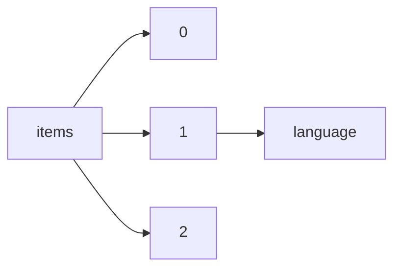

!!! warning "This document is not official Crossref documentation"
# Language
PATH = items/array/language(1)  
Occurs 79 579 221 times  
Unique values: 74  
{ .annotate }

1. A route to an element, for example:  
   The route "items/array/language" corresponds to navigating through the JSON indices as  
   ["items"][0]["language"]  

| **Row** | **Value** `String` | **Count** `Int64` |
|--------:|----------------------:|---------------------:|
| **1**   | en                    | 74 655 291           |
| **2**   | de                    | 2 302 938            |
| **3**   | fr                    | 1 196 268            |
| **4**   | ja                    | 262 990              |
| **5**   | es                    | 255 269              |
| **6**   | ru                    | 235 876              |
| **7**   | ar                    | 154 706              |
| **8**   | nl                    | 99 237               |
| **9**   | ko                    | 68 658               |
| **10**  | no                    | 57 101               |
| **11**  | tr                    | 54 196               |
| **12**  | pt                    | 43 099               |
| **13**  | ng                    | 36 287               |
| **14**  | it                    | 34 665               |
| **15**  | uk                    | 28 414               |
| **16**  | fa                    | 24 499               |
| **17**  | pl                    | 13 372               |
| **18**  | cs                    | 12 405               |
| **19**  | nb                    | 9 648                |
| **20**  | hu                    | 6 162                |
| **21**  | vi                    | 3 691                |
| **22**  | id                    | 2 330                |
| **23**  | sr                    | 2 179                |
| **24**  | zh                    | 2 159                |
| **25**  | la                    | 2 091                |
| **26**  | af                    | 1 448                |
| **27**  | da                    | 1 192                |
| **28**  | sl                    | 1 135                |
| **29**  | et                    | 1 098                |
| **30**  | lt                    | 1 065                |
| **31**  | bg                    | 1 058                |
| **32**  | sv                    | 915                  |
| **33**  | hr                    | 914                  |
| **34**  | ro                    | 895                  |
| **35**  | uz                    | 891                  |
| **36**  | eo                    | 661                  |
| **37**  | is                    | 575                  |
| **38**  | ca                    | 426                  |
| **39**  | nr                    | 393                  |
| **40**  | hy                    | 362                  |
| **41**  | lv                    | 362                  |
| **42**  | ka                    | 307                  |
| **43**  | fi                    | 226                  |
| **44**  | nn                    | 214                  |
| **45**  | kk                    | 183                  |
| **46**  | az                    | 178                  |
| **47**  | ur                    | 162                  |
| **48**  | el                    | 134                  |
| **49**  | sk                    | 110                  |
| **50**  | br                    | 103                  |
| **51**  | eu                    | 88                   |
| **52**  | fo                    | 77                   |
| **53**  | km                    | 58                   |
| **54**  | kr                    | 54                   |
| **55**  | ta                    | 51                   |
| **56**  | ga                    | 37                   |
| **57**  | th                    | 34                   |
| **58**  | sw                    | 34                   |
| **59**  | bn                    | 33                   |
| **60**  | si                    | 32                   |
| **61**  | gl                    | 30                   |
| **62**  | ps                    | 28                   |
| **63**  | he                    | 27                   |
| **64**  | ne                    | 24                   |
| **65**  | rw                    | 14                   |
| **66**  | st                    | 14                   |
| **67**  | se                    | 12                   |
| **68**  | xh                    | 10                   |
| **69**  | aa                    | 7                    |
| **70**  | to                    | 7                    |
| **71**  | ch                    | 6                    |
| **72**  | kn                    | 4                    |
| **73**  | qu                    | 1                    |
| **74**  | ab                    | 1                    |

