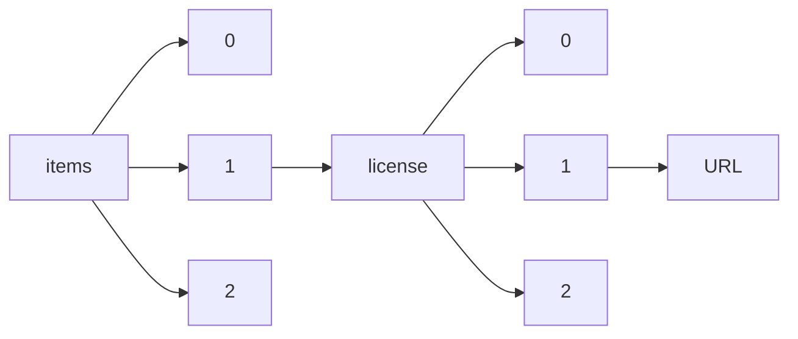

!!! warning "This document is not official Crossref documentation"
# URL
PATH = items/array/license/array/URL(1)  
Occurs 81 984 207 times  
Unique values: > 999  
{ .annotate }

1. A route to an element, for example:  
   The route "items/array/license/array/URL" corresponds to navigating through the JSON indices as  
   ["items"][0]["license"][0]["URL"]  

!!! note "Due to current limitations, only the first 1,000 unique values are counted."

| **Row** | **Value** `String`                                                                                    | **Count** `Int64` |
|--------:|---------------------------------------------------------------------------------------------------------:|---------------------:|
| **1**   | https://www.elsevier.com/tdm/userlicense/1.0/                                                            | 19 487 105           |
| **2**   | http://www.springer.com/tdm                                                                              | 10 085 735           |
| **3**   | http://doi.wiley.com/10.1002/tdm\_license\_1.1                                                           | 9 348 298            |
| **4**   | https://www.springer.com/tdm                                                                             | 3 223 662            |
| **5**   | https://www.cambridge.org/core/terms                                                                     | 2 869 842            |
| **6**   | http://onlinelibrary.wiley.com/termsAndConditions#vor                                                    | 2 645 754            |
| **7**   | http://journals.sagepub.com/page/policies/text-and-data-mining-license                                   | 2 492 735            |
| **8**   | https://creativecommons.org/licenses/by/4.0/                                                             | 2 299 054            |
| **9**   | https://doi.org/10.15223/policy-029                                                                      | 2 098 365            |
| **10**  | https://doi.org/10.15223/policy-037                                                                      | 2 098 365            |
| **11**  | http://creativecommons.org/licenses/by/4.0/                                                              | 1 961 867            |
| **12**  | https://ieeexplore.ieee.org/Xplorehelp/downloads/license-information/IEEE.html                           | 1 761 734            |
| **13**  | https://www.springernature.com/gp/researchers/text-and-data-mining                                       | 1 759 332            |
| **14**  | https://creativecommons.org/licenses/by/4.0                                                              | 1 720 927            |
| **15**  | http://creativecommons.org/licenses/by-nc-nd/4.0/                                                        | 1 118 185            |
| **16**  | https://doi.org/10.15223/policy-017                                                                      | 935 310              |
| **17**  | https://doi.org/10.15223/policy-004                                                                      | 928 466              |
| **18**  | https://doi.org/10.15223/policy-012                                                                      | 928 466              |
| **19**  | http://www.elsevier.com/open-access/userlicense/1.0/                                                     | 808 698              |
| **20**  | http://doi.wiley.com/10.1002/tdm\_license\_1                                                             | 746 203              |
| **21**  | https://www.karger.com/Services/SiteLicenses                                                             | 680 337              |
| **22**  | https://www.elsevier.com/open-access/userlicense/1.0/                                                    | 653 568              |
| **23**  | http://link.aps.org/licenses/aps-default-license                                                         | 598 386              |
| **24**  | http://creativecommons.org/licenses/by/3.0/                                                              | 583 229              |
| **25**  | http://creativecommons.org/licenses/by/4.0                                                               | 564 786              |
| **26**  | https://iopscience.iop.org/info/page/text-and-data-mining                                                | 503 806              |
| **27**  | https://academic.oup.com/journals/pages/open\_access/funder\_policies/chorus/standard\_publication\_mode | 452 484              |
| **28**  | https://www.emerald.com/insight/site-policies                                                            | 443 615              |
| **29**  | https://www.scientific.net/license/TDM\_Licenser.pdf                                                     | 385 581              |
| **30**  | https://www.scientific.net/PolicyAndEthics/PublishingPolicies                                            | 382 619              |
| **31**  | http://creativecommons.org/licenses/by-nc-nd/4.0                                                         | 325 369              |
| **32**  | http://iopscience.iop.org/info/page/text-and-data-mining                                                 | 308 239              |
| **33**  | https://journals.asm.org/non-commercial-tdm-license                                                      | 300 666              |
| **34**  | https://creativecommons.org/licenses/by-nc-nd/4.0/                                                       | 261 730              |
| **35**  | https://iopscience.iop.org/page/copyright                                                                | 244 060              |
| **36**  | http://creativecommons.org/licenses/by-nc/4.0/                                                           | 243 447              |
| **37**  | http://creativecommons.org/licenses/by-nc/4.0                                                            | 216 760              |
| **38**  | http://creativecommons.org/licenses/by-nc/3.0/                                                           | 211 588              |
| **39**  | https://doi.org/10.15223/policy-045                                                                      | 208 390              |
| **40**  | http://onlinelibrary.wiley.com/termsAndConditions                                                        | 205 811              |
| **41**  | http://creativecommons.org/licenses/by-nc-nd/3.0/                                                        | 200 348              |
| **42**  | https://creativecommons.org/licenses/by-nc/4.0                                                           | 200 212              |
| **43**  | http://www.nrcresearchpress.com/page/about/CorporateTextAndDataMining                                    | 187 367              |
| **44**  | https://creativecommons.org/licenses/by-nc/4.0/                                                          | 185 702              |
| **45**  | http://iopscience.iop.org/page/copyright                                                                 | 182 969              |
| **46**  | https://creativecommons.org/licenses/by/4.0/legalcode                                                    | 171 396              |
| **47**  | http://creativecommons.org/licenses/by-nc-sa/4.0                                                         | 169 562              |
| **48**  | https://creativecommons.org/licenses/by-nc-nd/4.0                                                        | 152 259              |
| **49**  | http://www.acm.org/publications/policies/copyright\_policy#Background                                    | 150 926              |
| **50**  | http://creativecommons.org/licenses/by-sa/4.0                                                            | 143 920              |
| **51**  | http://www.elsevier.com/tdm/userlicense/1.0/                                                             | 141 785              |
| **52**  | http://rsc.li/journals-terms-of-use                                                                      | 135 546              |
| **53**  | https://creativecommons.org/licenses/by-nc-sa/4.0                                                        | 119 958              |
| **54**  | https://creativecommons.org/licenses/by-sa/4.0                                                           | 119 267              |
| **55**  | http://journals.iucr.org/services/copyrightpolicy.html#TDM                                               | 118 118              |
| **56**  | http://journals.iucr.org/services/copyrightpolicy.html                                                   | 118 118              |
| **57**  | http://creativecommons.org/licenses/by/2.0                                                               | 95 433               |
| **58**  | https://link.aps.org/licenses/aps-default-license                                                        | 94 982               |
| **59**  | https://royalsociety.org/journals/ethics-policies/data-sharing-mining/                                   | 92 792               |
| **60**  | https://doi.org/10.15223/policy-001                                                                      | 92 409               |
| **61**  | https://doi.org/10.15223/policy-009                                                                      | 91 412               |
| **62**  | https://creativecommons.org/licenses/by/3.0/                                                             | 83 795               |
| **63**  | http://www.liebertpub.com/nv/resources-tools/text-and-data-mining-policy/121/                            | 81 838               |
| **64**  | https://www.liebertpub.com/nv/resources-tools/text-and-data-mining-policy/121/                           | 78 593               |
| **65**  | http://www.emeraldinsight.com/page/tdm                                                                   | 68 741               |
| **66**  | http://creativecommons.org/licenses/by/2.0/uk/legalcode                                                  | 62 144               |
| **67**  | https://academic.oup.com/pages/standard-publication-reuse-rights                                         | 59 656               |
| **68**  | http://onlinelibrary.wiley.com/termsAndConditions#am                                                     | 59 122               |
| **69**  | https://www.asme.org/publications-submissions/publishing-information/legal-policies                      | 56 401               |
| **70**  | http://creativecommons.org/licenses/by-nc-nd/3.0                                                         | 53 295               |
| **71**  | https://www.euppublishing.com/customer-services/librarians/text-and-data-mining-tdm                      | 40 432               |
| **72**  | https://open.canada.ca/en/open-government-licence-canada                                                 | 36 497               |
| **73**  | https://creativecommons.org/licenses/by/3.0/legalcode                                                    | 34 106               |
| **74**  | https://doi.org/10.15223/policy-002                                                                      | 33 397               |
| **75**  | http://www.bmj.org/licenses/tdm/1.0/terms-and-conditions.html                                            | 33 302               |
| **76**  | http://aspb.org/publications/aspb-journals/open-articles                                                 | 26 973               |
| **77**  | http://creativecommons.org/licenses/by-nc/3.0                                                            | 26 548               |
| **78**  | https://creativecommons.org/licenses/by-nc-sa/4.0/                                                       | 26 325               |
| **79**  | http://pubs.acs.org/page/policy/authorchoice\_termsofuse.html                                            | 26 105               |
| **80**  | http://link.aps.org/licenses/aps-default-accepted-manuscript-license                                     | 25 222               |
| **81**  | https://ieeexplore.ieee.org/Xplorehelp/downloads/license-information/OAPA.html                           | 25 031               |
| **82**  | https://creativecommons.org/licenses/by-sa/4.0/                                                          | 22 331               |
| **83**  | http://rightsstatements.org/vocab/InC/1.0/                                                               | 20 590               |
| **84**  | https://academic.oup.com/journals/pages/about\_us/legal/notices                                          | 20 569               |
| **85**  | https://creativecommons.org/publicdomain/zero/1.0/                                                       | 20 254               |
| **86**  | https://creativecommons.org/publicdomain/zero/1.0/legalcode                                              | 20 147               |
| **87**  | http://www.biologists.com/user-licence-1-1/                                                              | 19 909               |
| **88**  | http://www.bmj.com/company/legal-information/terms-conditions/legal-information/tdm-licencepolicy        | 19 678               |
| **89**  | https://creativecommons.org/licenses/by-nc/3.0/                                                          | 19 011               |
| **90**  | https://online.boneandjoint.org.uk/TDM                                                                   | 18 803               |
| **91**  | https://creativecommons.org/licenses/by-nc/2.0                                                           | 17 257               |
| **92**  | https://publishing.aip.org/authors/rights-and-permissions                                                | 17 107               |
| **93**  | https://creativecommons.org/licenses/by-nd/4.0                                                           | 16 798               |
| **94**  | http://creativecommons.org/licenses/by/3.0                                                               | 16 485               |
| **95**  | https://www.edpsciences.org/en/authors/copyright-and-licensing                                           | 16 264               |
| **96**  | https://creativecommons.org/licenses/by-nc-nd/3.0/                                                       | 15 384               |
| **97**  | http://creativecommons.org/licenses/by/3.0/deed.en\_US                                                   | 15 171               |
| **98**  | http://www.bioone.org/page/resources/researchers/rights\_and\_permissions                                | 14 983               |
| **99**  | https://creativecommons.org/licenses/by/2.0                                                              | 14 105               |
| **100** | https://www.wgtn.ac.nz/library/about-us/policies-and-strategies/copyright-for-the-researcharchive        | 13 870               |
| **101** | http://www.diabetesjournals.org/content/license                                                          | 13 578               |
| **102** | https://www.ams.org/publications/copyright-and-permissions                                               | 13 497               |
| **103** | http://creativecommons.org/licenses/by-nc-sa/4.0/                                                        | 12 374               |
| **104** | https://link.aps.org/licenses/aps-default-accepted-manuscript-license                                    | 11 875               |
| **105** | http://www.apa.org/pubs/journals/resources/open-access.aspx                                              | 11 550               |
| **106** | http://creativecommons.org/licenses/by-nd/4.0                                                            | 11 386               |
| **107** | http://rsc.li/journals-terms-of-use#chorus                                                               | 10 687               |
| **108** | https://doi.org/10.1364/OA\_License\_v1#VOR-OA                                                           | 9 367                |
| **109** | http://creativecommons.org/licenses/by-sa/4.0/                                                           | 8 820                |
| **110** | https://doi.org/10.32604/TSP-CROSSMARKPOLICY                                                             | 8 510                |
| **111** | http://www.usa.gov/publicdomain/label/1.0/                                                               | 8 374                |
| **112** | https://www.pnas.org/site/aboutpnas/licenses.xhtml                                                       | 8 195                |
| **113** | http://edis.ifas.ufl.edu/copyright.html                                                                  | 8 148                |
| **114** | http://pubs.acs.org/page/policy/authorchoice\_ccby\_termsofuse.html                                      | 8 087                |
| **115** | http://creativecommons.org/publicdomain/zero/1.0/                                                        | 7 475                |
| **116** | https://doi.org/10.1364/OA\_License\_v1#VOR                                                              | 7 219                |
| **117** | http://www.sciencemag.org/about/science-licenses-journal-article-reuse                                   | 7 112                |
| **118** | https://creativecommons.org/licenses/by-nd/4.0/                                                          | 6 944                |
| **119** | https://creativecommons.org/licenses/by-nc-nd/3.0/us/                                                    | 6 778                |
| **120** | https://creativecommons.org/licenses/by-nc-sa/3.0/                                                       | 6 732                |
| **121** | https://creativecommons.org/licenses/by-nc-sa/2.5/                                                       | 6 633                |
| **122** | http://creativecommons.org/licenses/by/4.0/legalcode                                                     | 6 516                |
| **123** | https://www.degruyter.com/dg/page/free-access-policy                                                     | 6 374                |
| **124** | https://doi.org/10.1364/OA\_License\_v2#VOR-OA                                                           | 6 357                |
| **125** | http://www.pnas.org/site/misc/userlicense.xhtml                                                          | 6 352                |
| **126** | http://www.ametsoc.org/PUBSReuseLicenses                                                                 | 6 265                |
| **127** | http://creativecommons.org/licenses/by-nc/2.5                                                            | 6 244                |
| **128** | http://creativecommons.org/licenses/BY/4.0                                                               | 5 839                |
| **129** | http://academic.oup.com/journals/pages/about\_us/legal/notices                                           | 5 761                |
| **130** | http://creativecommons.org/licenses/by-nc-sa/3.0/                                                        | 5 627                |
| **131** | https://benjamins.com/content/customers/rights                                                           | 5 448                |
| **132** | http://iieta.org/sites/default/files/TEXT%20AND%20DATA%20MINING%20SERVICE%20AGREEMENT.pdf                | 5 392                |
| **133** | https://www.libnauka.ru/biblioteka/polzovatelskoe-soglashenie/                                           | 5 376                |
| **134** | https://www.intellectbooks.com/self-archiving#accepted-manuscript-during-embargo                         | 5 085                |
| **135** | https://www.intellectbooks.com/self-archiving#final-published-version                                    | 5 084                |
| **136** | https://www.intellectbooks.com/self-archiving#accepted-manuscript-post-embargo                           | 5 084                |
| **137** | https://ieeexplore.ieee.org/Xplorehelp/downloads/license-information/USG.html                            | 4 925                |
| **138** | https://doi.org/10.1128/ASMCopyrightv2                                                                   | 4 846                |
| **139** | https://creativecommons.org/licenses/by/4.0/deed.pt\_BR                                                  | 4 519                |
| **140** | https://doi.org/10.1364/OA\_License\_v2#VOR                                                              | 4 493                |
| **141** | https://bmj.com/coronavirus/usage                                                                        | 4 491                |
| **142** | http://www.sagepub.com/licence-information-for-chorus                                                    | 4 416                |
| **143** | http://creativecommons.org/licenses/by-nc/2.0                                                            | 4 397                |
| **144** | http://pubs.acs.org/page/policy/authorchoice\_ccbyncnd\_termsofuse.html                                  | 3 972                |
| **145** | http://www.biologists.com/user-licence-1-1                                                               | 3 912                |
| **146** | http://www.rupress.org/terms/                                                                            | 3 551                |
| **147** | https://creativecommons.org/licenses/by/NC-ND 4.0/                                                       | 3 390                |
| **148** | http://creativecommons.org/licenses/by-nc/2.0/uk/                                                        | 3 245                |
| **149** | https://www.aaai.org                                                                                     | 3 230                |
| **150** | http://creativecommons.org/licenses/by-nc-nd/3.0/es/                                                     | 3 226                |
| **151** | http://creativecommons.org/licenses/BY-SA/4.0                                                            | 3 166                |
| **152** | http://www.pnas.org/site/aboutpnas/licenses.xhtml                                                        | 3 112                |
| **153** | http://creativecommons.org/licenses/by-nd/4.0/                                                           | 2 924                |
| **154** | https://creativecommons.org/licenses/by-nc/3.0/pl/deed.en                                                | 2 829                |
| **155** | http://politica.dk/                                                                                      | 2 677                |
| **156** | https://creativecommons.org/licenses/by-nc-nd/4.0/legalcode                                              | 2 569                |
| **157** | https://ieeexplore.ieee.org/Xplorehelp/downloads/license-information/Crown.html                          | 2 478                |
| **158** | https://creativecommons.org/licenses/by/4.0/deed.de                                                      | 2 478                |
| **159** | https://creativecommons.org/licenses/by-nc-nd/4.0/deed.en                                                | 2 446                |
| **160** | https://creativecommons.org/licenses/by-nc/4.0/legalcode                                                 | 2 384                |
| **161** | https://creativecommons.org/licenses/by-nc-sa/4.0/deed.es                                                | 2 359                |
| **162** | https://www.med-sovet.pro/jour/about/editorialPolicies#openAccessPolicy                                  | 2 355                |
| **163** | https://bulletin.tomsk.ru/jour/about/editorialPolicies#openAccessPolicy                                  | 2 256                |
| **164** | https://www.diabetesjournals.org/content/license                                                         | 2 221                |
| **165** | http://www.nationalarchives.gov.uk/doc/non-commercial-government-licence/non-commercial-government-l     | 2 195                |
| **166** | https://phsreda.com/about/policy                                                                         | 2 126                |
| **167** | https://www.emeraldinsight.com/page/tdm                                                                  | 2 047                |
| **168** | http://www.scopemed.org/?page=license                                                                    | 1 997                |
| **169** | https://creativecommons.org/licenses/authors                                                             | 1 976                |
| **170** | https://tiedejaedistys.journal.fi/lisenssit                                                              | 1 974                |
| **171** | https://vestnik.mgimo.ru/jour/about/editorialPolicies#openAccessPolicy                                   | 1 919                |
| **172** | http://creativecommons.org/licenses/by/3.0/pl/                                                           | 1 894                |
| **173** | http://www.pnas.org/preview\_site/misc/userlicense.xhtml                                                 | 1 881                |
| **174** | http://creativecommons.org/                                                                              | 1 851                |
| **175** | https://www.academicoa.com/license/TDM\_Licenser.pdf                                                     | 1 746                |
| **176** | https://www.osapublishing.org/submit/licenses/license\_v1.cfm#am                                         | 1 693                |
| **177** | https://www.ersjournals.com/user-licence                                                                 | 1 649                |
| **178** | https://journal.gsmu.by/jour/about/editorialPolicies#openAccessPolicy                                    | 1 630                |
| **179** | https://ajis.org/index.php/ajiss/about                                                                   | 1 625                |
| **180** | https://revistas.cef.udima.es/index.php/rtss/derechos                                                    | 1 605                |
| **181** | http://www.njppp.com/?sec=licenseinfo                                                                    | 1 589                |
| **182** | https://www.mjil.ru/jour/about/editorialPolicies#openAccessPolicy                                        | 1 539                |
| **183** | https://journals.iucr.org/services/copyrightpolicy.html                                                  | 1 527                |
| **184** | https://journals.iucr.org/services/copyrightpolicy.html#TDM                                              | 1 524                |
| **185** | https://ieeexplore.ieee.org/Xplorehelp/downloads/license-information/EU.html                             | 1 504                |
| **186** | https://creativecommons.org/licenses/by-nc-nd/4.0/deed.es                                                | 1 495                |
| **187** | https://doi.org/10.1364/OA\_License\_v1                                                                  | 1 495                |
| **188** | https://royalsociety.org/-/media/journals/author/Licence-to-Publish-20062019-final.pdf                   | 1 493                |
| **189** | http://creativecommons.org/licenses/by-nc-nd/3.0/pl/                                                     | 1 443                |
| **190** | https://creativecommons.org/licenses/by-nc-sa/4.0/legalcode                                              | 1 425                |
| **191** | https://creativecommons.org/licenses/by/4.0/deed.es                                                      | 1 414                |
| **192** | https://vestnik.guu.ru/jour/about/editorialPolicies#openAccessPolicy                                     | 1 350                |
| **193** | https://creativecommons.org/licenses/by-sa/4.0/legalcode                                                 | 1 275                |
| **194** | http://creativecommons.org/licenses/by-sa/3.0                                                            | 1 264                |
| **195** | https://rightsstatements.org/page/InC/1.0/                                                               | 1 235                |
| **196** | https://russjcardiol.elpub.ru/jour/about/editorialPolicies#openAccessPolicy                              | 1 157                |
| **197** | http://www.nejmgroup.org/legal/terms-of-use.htm                                                          | 1 152                |
| **198** | http://opensource.org/licenses/AFL-3.0                                                                   | 1 135                |
| **199** | http://creativecommons.org/licenses/by-nc-sa/3.0                                                         | 1 134                |
| **200** | https://creativecommons.org/licenses/by-nc-sa/3.0/br/                                                    | 1 122                |
| **201** | http://creativecommons.org/licenses/by-nc-nd/2.5/in                                                      | 1 102                |
| **202** | https://cardiovascular.elpub.ru/jour/about/editorialPolicies#openAccessPolicy                            | 1 091                |
| **203** | http://www.egu.eu                                                                                        | 1 091                |
| **204** | http://iiit.org/en/home/                                                                                 | 1 072                |
| **205** | https://journal.pulmonology.ru/pulm/about/editorialPolicies#openAccessPolicy                             | 1 061                |
| **206** | http://creativecommons.org/licenses/by-nc-nd/3.0/cr/deed.es\_ES                                          | 1 033                |
| **207** | https://revistas.cef.udima.es/index.php/RCyT/derechos                                                    | 1 029                |
| **208** | http://creativecommons.org/licenses/by-nc-nd/4.0/legalcode                                               | 1 026                |
| **209** | https://creativecommons.org/licenses/by/4.0/deed.pt                                                      | 1 024                |
| **210** | http://jkorl.org/                                                                                        | 1 020                |
| **211** | https://bibliotekovedenie.rsl.ru/jour/about/editorialPolicies#openAccessPolicy                           | 1 010                |
| **212** | http://www.mdpub.net/?sec=licenseinfo                                                                    | 1 005                |
| **213** | https://www.nauka-dialog.ru/jour/about/editorialPolicies#openAccessPolicy                                | 985                  |
| **214** | https://www.osapublishing.org/submit/licenses/license\_v1.cfm#vor                                        | 980                  |
| **215** | https://mirtr.elpub.ru/jour/about/editorialPolicies#openAccessPolicy                                     | 958                  |
| **216** | https://aprp.msal.ru/jour/about/editorialPolicies#openAccessPolicy                                       | 955                  |
| **217** | https://creativecommons.org/licenses/by/4.0/deed.fr                                                      | 940                  |
| **218** | https://creativecommons.org/licenses/by-nc/4.0/deed.es                                                   | 935                  |
| **219** | https://creativecommons.org/licenses/by-sa/4.0/deed.de                                                   | 909                  |
| **220** | http://creativecommons.org/licenses/by/2.5/za/                                                           | 899                  |
| **221** | https://www.int-res.com/journals/terms-of-use/                                                           | 891                  |
| **222** | https://www.aiaa.org/userlicenses/1.0/#CompEndUserLicense                                                | 888                  |
| **223** | http://creativecommons.org/licenses/BY-NC/4.0                                                            | 887                  |
| **224** | https://htn.almazovcentre.ru/jour/about/editorialPolicies#openAccessPolicy                               | 877                  |
| **225** | https://www.imaios.com/en/terms-of-use                                                                   | 877                  |
| **226** | https://doi.org/10.1128/AuthorWarrantyLicense.v1                                                         | 853                  |
| **227** | https://www.vestnik-vsuet.ru/vguit/about/editorialPolicies#openAccessPolicy                              | 852                  |
| **228** | https://creativecommons.org/licenses/by-nc-sa/4.0/deed.pt\_BR                                            | 845                  |
| **229** | http://www.scopemed.org/?jid=68/?sec=licenseinfo                                                         | 844                  |
| **230** | http://https://www.ijmdc.com/?sec=licenseinfo                                                            | 824                  |
| **231** | http://www.diabetesjournals.org/site/license                                                             | 820                  |
| **232** | http://radio.kpi.ua/about/subscriptionsLicence                                                           | 807                  |
| **233** | https://ntb.gpntb.ru/jour/about/editorialPolicies#openAccessPolicy                                       | 792                  |
| **234** | http://creativecommons.org/licenses/by-sa/4.0/deed.de                                                    | 791                  |
| **235** | https://creativecommons.org/licenses/by-sa/4.0/legalcode.de                                              | 790                  |
| **236** | https://vestnik.kemsu.ru/jour/about/editorialPolicies#openAccessPolicy                                   | 785                  |
| **237** | http://creativecommons.org/licenses/by-nc-nd/2.5/ar/                                                     | 774                  |
| **238** | http://creativecommons.org/licenses/by/2.0/                                                              | 767                  |
| **239** | https://doi.org/10.1364/OA\_License\_v1#AM                                                               | 763                  |
| **240** | https://lib.ossn.ru/jour/about/editorialPolicies#openAccessPolicy                                        | 758                  |
| **241** | https://creativecommons.org/licenses/by-nd/4.0/legalcode                                                 | 758                  |
| **242** | http://rightsstatements.org/vocab/NoC-NC/1.0/                                                            | 756                  |
| **243** | https://www.vestnik-grekova.ru/jour/about/editorialPolicies#openAccessPolicy                             | 751                  |
| **244** | https://interactive-plus.ru/about/policy                                                                 | 749                  |
| **245** | https://www.diabetesjournals.org/journals/pages/license                                                  | 738                  |
| **246** | http://creativecommons.org/licenses/by-nc-nd/3.0/de                                                      | 724                  |
| **247** | https://www.vegetables.su/jour/about/editorialPolicies#openAccessPolicy                                  | 711                  |
| **248** | https://creativecommons.org/licenses/by/4.0/deed.en                                                      | 707                  |
| **249** | https://journal.microbe.ru/jour/about/editorialPolicies#openAccessPolicy                                 | 694                  |
| **250** | https://vestnik.msal.ru/jour/about/editorialPolicies#openAccessPolicy                                    | 686                  |
| **251** | https://creativecommons.org/licenses/by                                                                  | 682                  |
| **252** | https://www.actabiomedica.ru/jour/about/editorialPolicies#openAccessPolicy                               | 680                  |
| **253** | http://www.eurjchem.com/index.php/eurjchem/pages/view/terms                                              | 674                  |
| **254** | https://www.vetpress.ru/jour/about/editorialPolicies#openAccessPolicy                                    | 672                  |
| **255** | https://lexrussica.msal.ru/jour/about/editorialPolicies#openAccessPolicy                                 | 670                  |
| **256** | https://creativecommons.org/licenses/by/3.0                                                              | 661                  |
| **257** | https://vovr.elpub.ru/jour/about/editorialPolicies#openAccessPolicy                                      | 642                  |
| **258** | https://creativecommons.org/licenses/by-nc-nd/3.0/cr/                                                    | 635                  |
| **259** | http://www.jpp.org                                                                                       | 624                  |
| **260** | http://www.nationalarchives.gov.uk/doc/open-government-licence/version/3/                                | 623                  |
| **261** | https://preprints.apsanet.org/engage/apsa/legal-information?show=terms-of-use                            | 623                  |
| **262** | https://www.nogr.org/jour/about/editorialPolicies#openAccessPolicy                                       | 622                  |
| **263** | http://creativecommons.org/licenses/CC/by-nc-nd/4.0/                                                     | 622                  |
| **264** | https://interactive-science.media/journal/policy                                                         | 618                  |
| **265** | http://www.gnu.org/licenses/lgpl-2.1.txt                                                                 | 603                  |
| **266** | https://creativecommons.org/licenses/by/2.0/                                                             | 583                  |
| **267** | https://creativecommons.org/share-your-work/public-domain/cc0/                                           | 581                  |
| **268** | https://izvestiya.tinro-center.ru/jour/about/editorialPolicies#openAccessPolicy                          | 560                  |
| **269** | https://journal.transpl.ru/vtio/about/editorialPolicies#openAccessPolicy                                 | 558                  |
| **270** | https://nnp.ima-press.net/nnp/about/editorialPolicies#openAccessPolicy                                   | 550                  |
| **271** | https://creativecommons.org/licenses/by-nc/2.5/                                                          | 546                  |
| **272** | https://creativecommons.org/publicdomain/mark/1.0/                                                       | 537                  |
| **273** | https://creativecommons.org/licenses/by-nc/3.0/deed.en                                                   | 537                  |
| **274** | https://fermet.misis.ru/jour/about/editorialPolicies#openAccessPolicy                                    | 534                  |
| **275** | https://inference-review.com/terms-of-use                                                                | 533                  |
| **276** | https://www.ped-perinatology.ru/jour/about/editorialPolicies#openAccessPolicy                            | 521                  |
| **277** | http://www.jrd.or.kr/for/subscription.html                                                               | 520                  |
| **278** | https://www.tibl-journal.com/jour/about/editorialPolicies#openAccessPolicy                               | 515                  |
| **279** | https://iasj.net/iasj/journal/114/issues                                                                 | 515                  |
| **280** | https://www.journal-irioh.ru/jour/about/editorialPolicies#openAccessPolicy                               | 513                  |
| **281** | https://www.mimmun.ru/mimmun/about/editorialPolicies#openAccessPolicy                                    | 513                  |
| **282** | https://vavilov.elpub.ru/jour/about/editorialPolicies#openAccessPolicy                                   | 510                  |
| **283** | https://creativecommons.org/licenses/by-nc-nd/3.0/es/                                                    | 507                  |
| **284** | https://www.ophthalmojournal.com/opht/about/editorialPolicies#openAccessPolicy                           | 502                  |
| **285** | https://observatoria.rsl.ru/jour/about/editorialPolicies#openAccessPolicy                                | 501                  |
| **286** | https://www.rpcardio.com/jour/about/editorialPolicies#openAccessPolicy                                   | 500                  |
| **287** | http://creativecommons.org/licenses/by-nc-nd/2.5/ca/                                                     | 500                  |
| **288** | https://www.cambridge.org/engage/coe/legal-information?show=terms-of-use                                 | 498                  |
| **289** | https://iiit.org/en/home/                                                                                | 491                  |
| **290** | http://www.ijmdc.com/?sec=licenseinfo                                                                    | 490                  |
| **291** | https://creativecommons.org/licenses/by/3.0/igo/                                                         | 486                  |
| **292** | https://creativecommons.org/licenses/by/2.5/ar/                                                          | 481                  |
| **293** | https://doi.org/10.1364/OA\_License\_v1#CCBY                                                             | 477                  |
| **294** | https://creativecommons.org/licenses/by-nc-nd/2.0/                                                       | 477                  |
| **295** | http://www.alexjvs.com/?sec=licenseinfo                                                                  | 469                  |
| **296** | https://creativecommons.org/licenses/by/4.0/deed.pl                                                      | 468                  |
| **297** | https://www.siboncoj.ru/jour/about/editorialPolicies#openAccessPolicy                                    | 466                  |
| **298** | http://creativecommons.org/licenses/by-nc-nd/3.0/cr/deed.en\_US                                          | 465                  |
| **299** | https://creativecommons.org/licenses/by-nc/2.0/                                                          | 462                  |
| **300** | http://www.jocmr.com/?sec=licenseinfo                                                                    | 458                  |
| **301** | https://www.acjournal.ru/jour/about/editorialPolicies#openAccessPolicy                                   | 453                  |
| **302** | http://creativecommons.org/licenses/by/3.0/igo/                                                          | 453                  |
| **303** | http://www.ijmsph.com/?sec=licenseinfo                                                                   | 451                  |
| **304** | https://creativecommons.org/licenses/by-nc-nd/3.0/pl/                                                    | 449                  |
| **305** | http://creativecommons.org/Licenses/by/4.0/                                                              | 447                  |
| **306** | https://creativecommons.org/licenses/by/4.0/legalcode.ru                                                 | 446                  |
| **307** | https://science.swsu.ru/jour/about/editorialPolicies#openAccessPolicy                                    | 443                  |
| **308** | http://creativecommons.org/licenses/by-nc-nd/3.0/us/                                                     | 441                  |
| **309** | http://creativecommons.org/licenses/by-nc-cd/4.0/                                                        | 436                  |
| **310** | http://creativecommons.org/licenses/by-nc/2.5/                                                           | 435                  |
| **311** | https://creativecommons.org/licenses/by-nc-nd/4.0/deed.es\_AR                                            | 434                  |
| **312** | http://journal.almaz-antey.ru/jour/about/editorialPolicies#openAccessPolicy                              | 432                  |
| **313** | https://humanities.fa.ru/jour/about/editorialPolicies#openAccessPolicy                                   | 427                  |
| **314** | http://creativecommons.org/licenses/by-nc-nd/3.0/igo/                                                    | 426                  |
| **315** | http://opensource.org/licenses/MIT                                                                       | 425                  |
| **316** | https://www.jsdrm.ru/jour/about/editorialPolicies#openAccessPolicy                                       | 418                  |
| **317** | http://creativecommons.org/licenses/by/3.0/us/                                                           | 418                  |
| **318** | http://press.anu.edu.au/about/conditions-use                                                             | 417                  |
| **319** | https://mrj.ima-press.net/mrj/about/editorialPolicies#openAccessPolicy                                   | 416                  |
| **320** | https://doi.org/10.37349/Open\_Exploration\_Crossmark\_Policy                                            | 413                  |
| **321** | https://creativecommons.org/licenses/by/2.5/                                                             | 411                  |
| **322** | https://lim.bntu.by/jour/about/editorialPolicies#openAccessPolicy                                        | 401                  |
| **323** | https://vestnik.tsuab.ru/jour/about/editorialPolicies#openAccessPolicy                                   | 401                  |
| **324** | https://chermetinfo.elpub.ru/jour/about/editorialPolicies#openAccessPolicy                               | 396                  |
| **325** | http://bdvets.org/JAVAR/?sec=licenseinfo                                                                 | 391                  |
| **326** | https://doklady.belnauka.by/jour/about/editorialPolicies#openAccessPolicy                                | 388                  |
| **327** | http://creativecommons.org/licenses/by-nd/3.0/es/deed.es                                                 | 386                  |
| **328** | http://creativecommons.org/licenses/BY-NC-ND/4.0                                                         | 385                  |
| **329** | https://medvis.vidar.ru/jour/about/editorialPolicies#openAccessPolicy                                    | 384                  |
| **330** | https://doi.org/10.1364/OA\_License\_v2#CCBY                                                             | 384                  |
| **331** | https://doklady.bsuir.by/jour/about/editorialPolicies#openAccessPolicy                                   | 383                  |
| **332** | https://creativecommons.org/licenses/by/3.0/igo                                                          | 382                  |
| **333** | http://www.ijlr.org/?sec=licenseinfo                                                                     | 380                  |
| **334** | http://www.crossref.org/license                                                                          | 373                  |
| **335** | http://www.medarch.org//?sec=licenseinfo                                                                 | 373                  |
| **336** | https://www.iberpapers.org/jour/about/editorialPolicies#openAccessPolicy                                 | 372                  |
| **337** | http://www.gnu.org/licenses/lgpl-3.0.txt                                                                 | 370                  |
| **338** | https://oapen.org/content/about-rights                                                                   | 369                  |
| **339** | https://www.ogt-journal.com/jour/about/editorialPolicies#openAccessPolicy                                | 364                  |
| **340** | https://www.finechem-mirea.ru/jour/about/editorialPolicies#openAccessPolicy                              | 364                  |
| **341** | https://roj.igb.ru/jour/about/editorialPolicies#openAccessPolicy                                         | 363                  |
| **342** | https://www.bibliosphere.ru/jour/about/editorialPolicies#openAccessPolicy                                | 360                  |
| **343** | https://creativecommons.org/licenses/by-nc-sa/3.0/igo/                                                   | 359                  |
| **344** | https://www.microcirc.ru/jour/about/editorialPolicies#openAccessPolicy                                   | 356                  |
| **345** | http://creativecommons.org/licenses/by-nc-nd/2.5/es/                                                     | 356                  |
| **346** | http://creativecommons.org/licenses/7by-nc-sa/4.0/deed.es                                                | 356                  |
| **347** | https://creativecommons.org/                                                                             | 355                  |
| **348** | https://www.interanalytics.org/jour/about/editorialPolicies#openAccessPolicy                             | 354                  |
| **349** | https://www.epidemvac.ru/jour/about/editorialPolicies#openAccessPolicy                                   | 353                  |
| **350** | https://www.ruproctology.com/jour/about/editorialPolicies#openAccessPolicy                               | 353                  |
| **351** | https://ksma.elpub.ru/jour/about/editorialPolicies#openAccessPolicy                                      | 353                  |
| **352** | http://creativecommons.org/licenses/by-nc-nd/2.5/co/                                                     | 352                  |
| **353** | http://creativecommons.org/licenses/by-nc-sa/4.0/deed.es                                                 | 352                  |
| **354** | https://www.tipse.ru/jour/about/editorialPolicies#openAccessPolicy                                       | 352                  |
| **355** | https://sibvest.elpub.ru/jour/about/editorialPolicies#openAccessPolicy                                   | 350                  |
| **356** | https://www.sci-notes.ru/jour/about/editorialPolicies#openAccessPolicy                                   | 346                  |
| **357** | https://oncourology.abvpress.ru/oncur/about/editorialPolicies#openAccessPolicy                           | 346                  |
| **358** | https://www.hemoncim.com/jour/about/editorialPolicies#openAccessPolicy                                   | 345                  |
| **359** | https://www.plastics-news.ru/jour/about/editorialPolicies#openAccessPolicy                               | 345                  |
| **360** | https://cardiotomsk.elpub.ru/jour/about/editorialPolicies#openAccessPolicy                               | 344                  |
| **361** | https://creativecommons.org/licenses/by-nc-nd/2.5/                                                       | 343                  |
| **362** | https://creativecommons.org/licenses/by-sa/4.0/deed.hu                                                   | 343                  |
| **363** | https://creativecommons.org/licenses/by-nc-nd-license/                                                   | 341                  |
| **364** | https://www.edscience.ru/jour/about/editorialPolicies#openAccessPolicy                                   | 341                  |
| **365** | https://financetp.fa.ru/jour/about/editorialPolicies#openAccessPolicy                                    | 339                  |
| **366** | https://boneandjoint.org.uk/TDM                                                                          | 338                  |
| **367** | https://www.nii-kpssz.com/jour/about/editorialPolicies#openAccessPolicy                                  | 337                  |
| **368** | https://enforcement.omsu.ru/jour/about/editorialPolicies#openAccessPolicy                                | 337                  |
| **369** | https://www.pharmjournal.ru/jour/about/editorialPolicies#openAccessPolicy                                | 337                  |
| **370** | https://bioterapevt.elpub.ru/jour/about/editorialPolicies#openAccessPolicy                               | 336                  |
| **371** | https://journal.niidi.ru/jofin/about/editorialPolicies#openAccessPolicy                                  | 335                  |
| **372** | https://creativecommons.org/licenses/by-nc/3.0/br/                                                       | 330                  |
| **373** | https://vestnik.turan-edu.kz/jour/about/editorialPolicies#openAccessPolicy                               | 330                  |
| **374** | http://creativecommons.org/licenses/by-nc/2.5/mx/                                                        | 329                  |
| **375** | https://www.jnmp.ru/jour/about/editorialPolicies#openAccessPolicy                                        | 328                  |
| **376** | http://creativecommons.org/licenses/by-nd/2.0/de                                                         | 327                  |
| **377** | https://elpub.vir.nw.ru/jour/about/editorialPolicies#openAccessPolicy                                    | 325                  |
| **378** | https://www.agronauka-sv.ru/jour/about/editorialPolicies#openAccessPolicy                                | 323                  |
| **379** | https://aijr.org/about/policies/licensing-policy/                                                        | 323                  |
| **380** | https://www.gt-crust.ru/jour/about/editorialPolicies#openAccessPolicy                                    | 322                  |
| **381** | https://creativecommons.org/licenses/by-nc-sa/2.5/hu/                                                    | 321                  |
| **382** | https://creativecommons.org/licenses/by/4.0/deed.en\_GB                                                  | 321                  |
| **383** | https://www.vestnik-donstu.ru/jour/about/editorialPolicies#openAccessPolicy                              | 320                  |
| **384** | https://vestnik.dgtu.ru/jour/about/editorialPolicies#openAccessPolicy                                    | 320                  |
| **385** | https://creativecommons.org/licenses/by/4.0/deed.ru                                                      | 319                  |
| **386** | http://creativecommons.org/licenses/by-nd/3.0/de                                                         | 318                  |
| **387** | https://www.energyret.ru/jour/about/editorialPolicies#openAccessPolicy                                   | 316                  |
| **388** | https://ecodag.elpub.ru/ugro/about/editorialPolicies#openAccessPolicy                                    | 315                  |
| **389** | https://vsp.spr-journal.ru/jour/about/editorialPolicies#openAccessPolicy                                 | 313                  |
| **390** | https://journal.nephrolog.ru/jour/about/editorialPolicies#openAccessPolicy                               | 312                  |
| **391** | https://school.infojournal.ru/jour/about/editorialPolicies#openAccessPolicy                              | 312                  |
| **392** | https://doi.org/10.1364/OA\_License\_v2#AM                                                               | 311                  |
| **393** | https://www.clinmedjournal.com/jour/about/editorialPolicies#openAccessPolicy                             | 309                  |
| **394** | https://creativecommons.org/licenses/by-sa/4.0/deed.gl                                                   | 308                  |
| **395** | https://ges.rgo.ru/jour/about/editorialPolicies#openAccessPolicy                                         | 306                  |
| **396** | https://doi.org/10.1364/OA\_License\_v2#OPG-OO                                                           | 306                  |
| **397** | https://radiag.bmoc-spb.ru/jour/about/editorialPolicies#openAccessPolicy                                 | 302                  |
| **398** | https://www.vair-journal.com/jour/about/editorialPolicies#openAccessPolicy                               | 299                  |
| **399** | https://www.gynecology.su/jour/about/editorialPolicies#openAccessPolicy                                  | 297                  |
| **400** | https://www.malignanttumors.org/jour/about/editorialPolicies#openAccessPolicy                            | 295                  |
| **401** | https://creativecommons.org/licenses/by-sa/3.0/                                                          | 292                  |
| **402** | http://revistas.um.es/analesps/about/submissions#copyrightNotice                                         | 290                  |
| **403** | http://creativecommons.org/licenses/by/3.0/es/deed.ca                                                    | 290                  |
| **404** | http://creativecommons.org/licenses/by-nc-sa/4.0/legalcode                                               | 287                  |
| **405** | https://sat.bntu.by/jour/about/editorialPolicies#openAccessPolicy                                        | 285                  |
| **406** | https://creativecommons.org/licenses/by/3.0/ec/                                                          | 285                  |
| **407** | https://rojournal.elpub.ru/jour/about/editorialPolicies#openAccessPolicy                                 | 283                  |
| **408** | https://www.almclinmed.ru/jour/about/editorialPolicies#openAccessPolicy                                  | 281                  |
| **409** | https://nsuem.elpub.ru/jour/about/editorialPolicies#openAccessPolicy                                     | 281                  |
| **410** | https://vestngau.elpub.ru/jour/about/editorialPolicies#openAccessPolicy                                  | 280                  |
| **411** | https://bulletin.esoil.ru/jour/about/editorialPolicies#openAccessPolicy                                  | 280                  |
| **412** | https://www.spinesurgery.ru/jour/about/editorialPolicies#openAccessPolicy                                | 280                  |
| **413** | https://creativecommons.org/licenses/by-nc-sa/4.0/deed.es\_ES                                            | 279                  |
| **414** | https://creativecommons.org/licenses/by/4.0/deed                                                         | 278                  |
| **415** | http://creativecommons.org/licenses/by/3.0/rs/legalcode.sr-Latn                                          | 278                  |
| **416** | https://creativecommons.org/licenses/by/3.0/br/                                                          | 276                  |
| **417** | https://vestnik.ksu.edu.ru/                                                                              | 271                  |
| **418** | http://creativecommons.org/licenses/by-nd/3.0/                                                           | 268                  |
| **419** | https://creativecommons.org/licenses/by-nc-nd/3.0/legalcode                                              | 268                  |
| **420** | https://www.mais-journal.ru/jour/about/editorialPolicies#openAccessPolicy                                | 267                  |
| **421** | https://vestnik.sibadi.org/jour/about/editorialPolicies#openAccessPolicy                                 | 267                  |
| **422** | http://www.ejos.org/?sec=licenseinfo                                                                     | 264                  |
| **423** | https://monthlyreview.org/contact/reprint-permissions/                                                   | 264                  |
| **424** | https://hepato.elpub.ru/jour/about/editorialPolicies#openAccessPolicy                                    | 264                  |
| **425** | https://innfoodsecr.elpub.ru/jour/about/editorialPolicies#openAccessPolicy                               | 262                  |
| **426** | https://copyrights.bg/%D0%B7%D0%B0%D0%BA%D0%BE%D0%BD-%D0%B7%D0%B0-%D0%B0%D0%B2%D1%82%D0%BE%D1%80%D1%     | 262                  |
| **427** | https://www.medarhive.ru/jour/about/editorialPolicies#openAccessPolicy                                   | 260                  |
| **428** | https://www.chebsbornik.ru/jour/about/editorialPolicies#openAccessPolicy                                 | 259                  |
| **429** | https://journaledu.com/journal/policy                                                                    | 258                  |
| **430** | https://ajie.atsis.uq.edu.au/ajie/freeaccess                                                             | 258                  |
| **431** | https://re.eltech.ru/jour/about/editorialPolicies#openAccessPolicy                                       | 257                  |
| **432** | https://discourse.elpub.ru/jour/about/editorialPolicies#openAccessPolicy                                 | 257                  |
| **433** | https://www.rpmj.ru/rpmj/about/editorialPolicies#openAccessPolicy                                        | 256                  |
| **434** | http://https://www.ejmcr.com/?sec=licenseinfo                                                            | 256                  |
| **435** | https://www.minbar.su/jour/about/editorialPolicies#openAccessPolicy                                      | 256                  |
| **436** | https://www.medicalherald.ru/jour/about/editorialPolicies#openAccessPolicy                               | 255                  |
| **437** | https://vestnik.reaviz.ru/jour/about/editorialPolicies#openAccessPolicy                                  | 255                  |
| **438** | http://mdpub.net/?sec=licenseinfo                                                                        | 255                  |
| **439** | https://www.posna.org                                                                                    | 254                  |
| **440** | https://creativecommons.org/licenses/by-nc/3.0/au/                                                       | 253                  |
| **441** | https://anatomy.elpub.ru/jour/about/editorialPolicies#openAccessPolicy                                   | 253                  |
| **442** | https://www.strategybusiness.ru/jour/about/editorialPolicies#openAccessPolicy                            | 252                  |
| **443** | https://www.toxreview.ru/jour/about/editorialPolicies#openAccessPolicy                                   | 252                  |
| **444** | https://info.infojournal.ru/jour/about/editorialPolicies#openAccessPolicy                                | 251                  |
| **445** | https://rkpie.elpub.ru/jour/about/editorialPolicies#openAccessPolicy                                     | 251                  |
| **446** | https://journal.archaeology.nsc.ru/jour/about/editorialPolicies#openAccessPolicy                         | 248                  |
| **447** | https://rsp.mediar-press.net/rsp/about/editorialPolicies#openAccessPolicy                                | 245                  |
| **448** | https://www.medsim.ru/jour/about/editorialPolicies#openAccessPolicy                                      | 245                  |
| **449** | https://creativecommons.org/licenses/by-sa/4.0/deed.es                                                   | 243                  |
| **450** | https://www.urovest.ru/jour/about/editorialPolicies#openAccessPolicy                                     | 242                  |
| **451** | http://creativecommons.org/licenses/by/4.0/8                                                             | 240                  |
| **452** | https://philnauki.mgimo.ru/jour/about/editorialPolicies#openAccessPolicy                                 | 239                  |
| **453** | https://www.uimjournal.com/jour/about/editorialPolicies#openAccessPolicy                                 | 239                  |
| **454** | https://tv.us.es                                                                                         | 238                  |
| **455** | https://revistasulsap.lasallep.edu.mx/index.php/xihmai/condiciones                                       | 238                  |
| **456** | https://www.bekhterevreview.com/jour/about/editorialPolicies#openAccessPolicy                            | 238                  |
| **457** | https://doi.org/10.15223/policy-033                                                                      | 236                  |
| **458** | http://creativecommons.org/licenses/by-nc-sa/2.5/ar/                                                     | 236                  |
| **459** | https://vestnik-pip.ksu.edu.ru/                                                                          | 235                  |
| **460** | https://www.cito-vestnik.ru/jour/about/editorialPolicies#openAccessPolicy                                | 235                  |
| **461** | http://www.anadolupsikiyatri.net/?sec=licenseinfo                                                        | 233                  |
| **462** | https://doi.org/10.1128/ASMCopyrightv1                                                                   | 233                  |
| **463** | https://creativecommons.org/licenses/by-nd/4.0/deed.pl                                                   | 232                  |
| **464** | http://creativecommons.org/licenses/by-nc-sa/3.0/.                                                       | 231                  |
| **465** | https://creativecommons.org/licenses/by-nc-nd/2.5/co/                                                    | 231                  |
| **466** | http://www.matersociomed.org//?sec=licenseinfo                                                           | 231                  |
| **467** | https://seamed.bmoc-spb.ru/jour/about/editorialPolicies#openAccessPolicy                                 | 230                  |
| **468** | http://creativecommons.org/licenses/by-nc/2.5/uk/                                                        | 230                  |
| **469** | http://www.bioscmed.com/                                                                                 | 230                  |
| **470** | http://www.actainformmed.org//?sec=licenseinfo                                                           | 230                  |
| **471** | https://journal.nodgo.org/jour/about/editorialPolicies#openAccessPolicy                                  | 229                  |
| **472** | https://www.pp-mag.ru/jour/about/editorialPolicies#openAccessPolicy                                      | 229                  |
| **473** | https://detinf.elpub.ru/jour/about/editorialPolicies#openAccessPolicy                                    | 228                  |
| **474** | https://vestnik.mininuniver.ru/jour/about/editorialPolicies#openAccessPolicy                             | 227                  |
| **475** | https://www.surgonco.ru/jour/about/editorialPolicies#openAccessPolicy                                    | 227                  |
| **476** | https://creativecommons.org/licenses/by-nc-nd/3.0/nl/deed.en                                             | 226                  |
| **477** | https://voprstat.elpub.ru/jour/about/editorialPolicies#openAccessPolicy                                  | 226                  |
| **478** | http://creativecommons.org/licenses/by-nc-nd/4.0/deed.es                                                 | 224                  |
| **479** | https://pubs.acs.org/page/policy/authorchoice\_termsofuse.html                                           | 223                  |
| **480** | https://cfpd.elpub.ru/jour/about/editorialPolicies#openAccessPolicy                                      | 223                  |
| **481** | https://ecoprom.misis.ru/jour/about/editorialPolicies#openAccessPolicy                                   | 222                  |
| **482** | https://upravlenie.guu.ru/jour/about/editorialPolicies#openAccessPolicy                                  | 222                  |
| **483** | https://vetjournal.spbguvm.ru/jour/about/editorialPolicies#openAccessPolicy                              | 221                  |
| **484** | https://www.rtj-mirea.ru/jour/about/editorialPolicies#openAccessPolicy                                   | 219                  |
| **485** | https://geology.mgri-rggru.ru/jour/about/editorialPolicies#openAccessPolicy                              | 219                  |
| **486** | https://vestichem.belnauka.by/jour/about/editorialPolicies#openAccessPolicy                              | 219                  |
| **487** | https://vestift.belnauka.by/jour/about/editorialPolicies#openAccessPolicy                                | 218                  |
| **488** | https://accounting.fa.ru/jour/about/editorialPolicies#openAccessPolicy                                   | 218                  |
| **489** | https://vestihum.belnauka.by/jour/about/editorialPolicies#openAccessPolicy                               | 218                  |
| **490** | http://www.mjhs-mu.org/?sec=licenseinfo                                                                  | 217                  |
| **491** | http://creativecommons.org/licenses/by-nc-sa/3.0/br/legalcode                                            | 216                  |
| **492** | https://www.reanimatology.com/rmt/about/editorialPolicies#openAccessPolicy                               | 216                  |
| **493** | http://creativecommons.org/licenses/cc-by-nc/3.0                                                         | 216                  |
| **494** | https://vestibio.belnauka.by/jour/about/editorialPolicies#openAccessPolicy                               | 216                  |
| **495** | http://www.jurnal.unsyiah.ac.id/agripet/about/submissions#copyrightNotice                                | 216                  |
| **496** | http://creativecommons.org/licenses/by-nc-nd/3.0/at/deed.en                                              | 215                  |
| **497** | https://www.zhros.online/jour/about/editorialPolicies#openAccessPolicy                                   | 214                  |
| **498** | http://creativecommons.org/licenses/by/3.0/deed.en\_GB                                                   | 214                  |
| **499** | https://vestnik.socio.msu.ru/jour/about/editorialPolicies#openAccessPolicy                               | 213                  |
| **500** | https://avia.mstuca.ru/jour/about/editorialPolicies#openAccessPolicy                                     | 211                  |
| **501** | https://creativecommons.org/licenses/by-nc-nd/4.0/deed.es\_ES                                            | 210                  |
| **502** | http://www.f2ffoundation.org/faa/?sec=licenseinfo                                                        | 210                  |
| **503** | https://www.radhyg.ru/jour/about/editorialPolicies#openAccessPolicy                                      | 209                  |
| **504** | https://creativecommons.org/licenses/by/4.0/deed.es\_ES                                                  | 208                  |
| **505** | https://journal.rniito.org/jour/about/editorialPolicies#openAccessPolicy                                 | 208                  |
| **506** | https://www.vulkan-verlag.de                                                                             | 207                  |
| **507** | https://creativecommons.org/licenses/by-nc-nd/2.5/pe/                                                    | 207                  |
| **508** | https://ogsh.abvpress.ru/jour/about/editorialPolicies#openAccessPolicy                                   | 207                  |
| **509** | https://www.tmj-vgmu.ru/jour/about/editorialPolicies#openAccessPolicy                                    | 207                  |
| **510** | https://hiv.bmoc-spb.ru/jour/about/editorialPolicies#openAccessPolicy                                    | 206                  |
| **511** | https://www.lithosphere.ru/jour/about/editorialPolicies#openAccessPolicy                                 | 206                  |
| **512** | https://oncohematology.abvpress.ru/ongm/about/editorialPolicies#openAccessPolicy                         | 205                  |
| **513** | https://www.pedpharma.ru/jour/about/editorialPolicies#openAccessPolicy                                   | 205                  |
| **514** | https://vuzbiochemi.elpub.ru/jour/about/editorialPolicies#openAccessPolicy                               | 205                  |
| **515** | https://creativecommons.org/licenses/by-nc/3.0                                                           | 204                  |
| **516** | https://www.gastro-j.ru/jour/about/editorialPolicies#openAccessPolicy                                    | 204                  |
| **517** | https://vestimed.belnauka.by/jour/about/editorialPolicies#openAccessPolicy                               | 204                  |
| **518** | https://doi.org/10.15223/policy-010                                                                      | 204                  |
| **519** | https://energy.bntu.by/jour/about/editorialPolicies#openAccessPolicy                                     | 204                  |
| **520** | https://concept.mgimo.ru/jour/about/editorialPolicies#openAccessPolicy                                   | 204                  |
| **521** | https://www.orientalistica.com/jour/about/editorialPolicies#openAccessPolicy                             | 202                  |
| **522** | https://vest.rea.ru/jour/about/editorialPolicies#openAccessPolicy                                        | 201                  |
| **523** | https://www.morpholetter.com/jour/about/editorialPolicies#openAccessPolicy                               | 200                  |
| **524** | https://agx.abvpress.ru/jour/about/editorialPolicies#openAccessPolicy                                    | 200                  |
| **525** | http://www.nationalarchives.gov.uk/doc/open-government-licence/version/2/                                | 199                  |
| **526** | https://islamjournal.idmedina.ru/jour/about/editorialPolicies#openAccessPolicy                           | 199                  |
| **527** | https://submit.elifesciences.org/html/elife\_author\_instructions.html#policies                          | 198                  |
| **528** | https://creativecommons.org/licenses/by-sa/3.0/legalcode                                                 | 198                  |
| **529** | http://www.atbuscienceforum.com/?sec=licenseinfo                                                         | 198                  |
| **530** | http://creativecommons.org/licenses/by-nc/2.0/                                                           | 197                  |
| **531** | https://www.vimsmit.com/jour/about/editorialPolicies#openAccessPolicy                                    | 197                  |
| **532** | https://ojs.unud.ac.id/index.php/sastra                                                                  | 197                  |
| **533** | https://jahc.eu/policies/                                                                                | 197                  |
| **534** | https://creativecommons.org/licenses/by-sa/3.0                                                           | 196                  |
| **535** | https://creativecommons.org/licenses/by-nc-sa/2.5/co/                                                    | 194                  |
| **536** | https://www.ijcrsee.com/index.php/ijcrsee/Licensing                                                      | 194                  |
| **537** | https://mchsros.elpub.ru/jour/about/editorialPolicies#openAccessPolicy                                   | 194                  |
| **538** | https://vestifm.belnauka.by/jour/about/editorialPolicies#openAccessPolicy                                | 194                  |
| **539** | https://creativecommons.org/licenses/by-nc-sa/4.0/deed.uk                                                | 193                  |
| **540** | http://creativecommons.org/license/by-nc/4.0.                                                            | 193                  |
| **541** | http://www.annualreviews.org/licenses/tdm                                                                | 193                  |
| **542** | https://www.risk-journal.com/jour/about/editorialPolicies#openAccessPolicy                               | 193                  |
| **543** | https://statecon.rea.ru/jour/about/editorialPolicies#openAccessPolicy                                    | 192                  |
| **544** | http://ub.uu.se/publish/diva-en/divas-publishing-conditions/                                             | 192                  |
| **545** | https://newtechology.mkgtu.ru/jour/about/editorialPolicies#openAccessPolicy                              | 191                  |
| **546** | http://www.bsmiab.org/jabet/?sec=licenseinfo                                                             | 191                  |
| **547** | https://www.heartj.asia/jour/about/editorialPolicies#openAccessPolicy                                    | 191                  |
| **548** | https://www.zhros.ru/jour/about/editorialPolicies#openAccessPolicy                                       | 191                  |
| **549** | https://www.probl-endojournals.ru/jour/about/editorialPolicies#openAccessPolicy                          | 190                  |
| **550** | https://creativecommons.org/licenses/by-nc/3.0/igo                                                       | 189                  |
| **551** | https://federalizm.rea.ru/jour/about/editorialPolicies#openAccessPolicy                                  | 189                  |
| **552** | http://publicaciones.eafit.edu.co/index.php/co-herencia/about/submissions                                | 187                  |
| **553** | http://www.sajournalofeducation.co.za/index.php/saje/about/editorialPolicies#sectionPolicies             | 187                  |
| **554** | http://www.ieee.org/publications\_standards/publications/rights/ieeecopyrightform.pdf                    | 186                  |
| **555** | http://sciencepress.mnhn.fr/fr/mentions-legales                                                          | 185                  |
| **556** | http://www.diabetes.or.kr/pro/search/sub01.php                                                           | 185                  |
| **557** | http://vdu-nuczu.net/ua/polityka-vydannia                                                                | 184                  |
| **558** | https://nguhist.elpub.ru/jour/about/editorialPolicies#openAccessPolicy                                   | 183                  |
| **559** | https://www.osteo-endojournals.ru/jour/about/editorialPolicies#openAccessPolicy                          | 182                  |
| **560** | https://transmed.almazovcentre.ru/jour/about/editorialPolicies#openAccessPolicy                          | 182                  |
| **561** | https://www.mozilla.org/MPL/2.0/                                                                         | 181                  |
| **562** | https://proceedings.gpntbsib.ru/jour/about/editorialPolicies#openAccessPolicy                            | 181                  |
| **563** | http://vjsel.com/                                                                                        | 180                  |
| **564** | https://creativecommons.org/licenses/by-nc-sa/4.0/deed.fi                                                | 180                  |
| **565** | https://wne.fa.ru/jour/about/editorialPolicies#openAccessPolicy                                          | 180                  |
| **566** | https://openedu.rea.ru/jour/about/editorialPolicies#openAccessPolicy                                     | 179                  |
| **567** | https://creativecommons.org                                                                              | 179                  |
| **568** | https://rsp.ima-press.net/rsp/about/editorialPolicies#openAccessPolicy                                   | 179                  |
| **569** | https://journal.scbmt.ru/jour/about/editorialPolicies#openAccessPolicy                                   | 179                  |
| **570** | http://creativecommons.org/licenses/by/2.5/                                                              | 179                  |
| **571** | https://creativecommons.or.id/lisensi-cc-bahasa-indonesia/                                               | 179                  |
| **572** | https://ilvm.elpub.ru/jour/about/editorialPolicies#openAccessPolicy                                      | 178                  |
| **573** | https://www.pharmpharm.ru/jour/about/editorialPolicies#openAccessPolicy                                  | 177                  |
| **574** | https://creativecommons.org/licenses/by-nc/3.0/es/                                                       | 176                  |
| **575** | https://www.pharmacoeconomics.ru/jour/about/editorialPolicies#openAccessPolicy                           | 176                  |
| **576** | https://creativecommons.org/licenses/by-nc-nd/2.5/ar/                                                    | 176                  |
| **577** | http://www.theinternationalmedicine.com/?sec=licenseinfo                                                 | 176                  |
| **578** | https://creativecommons.org/licenses/by-nd-nc/4.0/                                                       | 175                  |
| **579** | http://veterinaryworld.org/                                                                              | 174                  |
| **580** | http://creativecommons.org/licenses/by-nc-nd/3.0/deed.pt\_BR                                             | 174                  |
| **581** | http://www.mykst.org/book/sub01.html                                                                     | 173                  |
| **582** | https://www.r-n-j.com/jour/about/editorialPolicies#openAccessPolicy                                      | 172                  |
| **583** | https://aipublisher.org/privacy-policy/                                                                  | 171                  |
| **584** | https://creativecommons.org/licenses/by-nc/4.0/deed.pt                                                   | 171                  |
| **585** | https://emjume.elpub.ru/jour/about/editorialPolicies#openAccessPolicy                                    | 171                  |
| **586** | https://www.plodovodstvo.com/jour/about/editorialPolicies#openAccessPolicy                               | 170                  |
| **587** | https://www.antibiotics-chemotherapy.ru/jour/about/editorialPolicies#openAccessPolicy                    | 170                  |
| **588** | https://vestiagr.belnauka.by/jour/about/editorialPolicies#openAccessPolicy                               | 169                  |
| **589** | https://ateroskleroz.elpub.ru/jour/about/editorialPolicies#openAccessPolicy                              | 169                  |
| **590** | https://boolt.elpub.ru/jour/about/editorialPolicies#openAccessPolicy                                     | 169                  |
| **591** | https://ojrs.abvpress.ru/ojrs/about/editorialPolicies#openAccessPolicy                                   | 169                  |
| **592** | https://vestar.elpub.ru/jour/about/editorialPolicies#openAccessPolicy                                    | 169                  |
| **593** | https://www.rivista-trust.it/                                                                            | 169                  |
| **594** | https://www.hist-edu.ru/hist/about/editorialPolicies#openAccessPolicy                                    | 167                  |
| **595** | https://www.vedomostincesmp.ru/jour/about/editorialPolicies#openAccessPolicy                             | 165                  |
| **596** | http://creativecommons.org/licenses/by-nc/2.5/ar/                                                        | 163                  |
| **597** | https://fcm.kemsmu.ru/jour/about/editorialPolicies#openAccessPolicy                                      | 161                  |
| **598** | https://www.a-surgeon.ru/jour/about/editorialPolicies#openAccessPolicy                                   | 161                  |
| **599** | https://www.eijournal.ru/jour/about/editorialPolicies#openAccessPolicy                                   | 160                  |
| **600** | https://scbook.elpub.ru/jour/about/editorialPolicies#openAccessPolicy                                    | 159                  |
| **601** | http://www.usc.es/revistas/index.php/agora/about/submissions#copyrightNotice                             | 158                  |
| **602** | https://www.peertechzpublications.com/journals/archives-of-community-medicine-and-public-health/copy     | 158                  |
| **603** | https://creativecommons.org/licenses/by-sa/4.0/legalcode.cs                                              | 158                  |
| **604** | http://creativecommons.org/licenses/bync/4.0/                                                            | 158                  |
| **605** | https://www.epilepsia.su/jour/about/editorialPolicies#openAccessPolicy                                   | 158                  |
| **606** | https://www.vestnik-atu.kz/jour/about/editorialPolicies#openAccessPolicy                                 | 157                  |
| **607** | https://www.therapeutic-j.ru/jour/about/editorialPolicies#openAccessPolicy                               | 157                  |
| **608** | https://www.sciencemag.org/about/science-licenses-journal-article-reuse                                  | 157                  |
| **609** | https://economy.fa.ru/jour/about/editorialPolicies#openAccessPolicy                                      | 156                  |
| **610** | https://arxiv.org/licenses/nonexclusive-distrib/1.0                                                      | 155                  |
| **611** | https://www.ttspo.ru/jour/about/editorialPolicies#openAccessPolicy                                       | 154                  |
| **612** | https://upjournals.co.za/index.php/AJNM/Copyright                                                        | 154                  |
| **613** | https://www.dia-endojournals.ru/jour/about/editorialPolicies#openAccessPolicy                            | 154                  |
| **614** | https://www.peertechzpublications.com/journals/journal-of-cardiovascular-medicine-and-cardiology/cop     | 154                  |
| **615** | http://www.sudanjp.com/?sec=licenseinfo                                                                  | 153                  |
| **616** | https://sibmed.elpub.ru/jour/about/editorialPolicies#openAccessPolicy                                    | 153                  |
| **617** | http://www.sciencemag.org/site/feature/contribinfo/prep/license.xhtml                                    | 153                  |
| **618** | https://e-management.guu.ru/jour/about/editorialPolicies#openAccessPolicy                                | 152                  |
| **619** | https://www.fire-smi.ru/jour/about/editorialPolicies#openAccessPolicy                                    | 152                  |
| **620** | https://medicine.nus.edu.sg/taps/for-authors/policies/                                                   | 151                  |
| **621** | http://jknpa.org/                                                                                        | 151                  |
| **622** | https://www.postsovietarea.com/jour/about/editorialPolicies#openAccessPolicy                             | 150                  |
| **623** | https://www.htjournal.ru/jour/about/editorialPolicies#openAccessPolicy                                   | 150                  |
| **624** | https://pimi.bntu.by/jour/about/editorialPolicies#openAccessPolicy                                       | 149                  |
| **625** | https://journalec.com/journal/policy                                                                     | 148                  |
| **626** | https://creativecommons.org/licences/by-nc-nd/4.0                                                        | 148                  |
| **627** | https://mgimopravo.elpub.ru/jour/about/editorialPolicies#openAccessPolicy                                | 147                  |
| **628** | https://creativecommons.org/licenses/by-sa/4.0/deed.es\_ES                                               | 147                  |
| **629** | http://www.openveterinaryjournal.com/?sec=licenseinfo                                                    | 147                  |
| **630** | https://www.sechenovmedj.com/jour/about/editorialPolicies#openAccessPolicy                               | 145                  |
| **631** | https://pubs.acs.org/page/policy/authorchoice\_ccbyncnd\_termsofuse.html                                 | 145                  |
| **632** | http://publicacoesacademicas.fcrs.edu.br/index.php/revistaexpressaocatolica/about/submissions#copyri     | 145                  |
| **633** | https://revistas.cef.udima.es/index.php/ceflegal/derechos                                                | 144                  |
| **634** | https://managementscience.fa.ru/jour/about/editorialPolicies#openAccessPolicy                            | 144                  |
| **635** | https://sapi.bntu.by/jour/about/editorialPolicies#openAccessPolicy                                       | 143                  |
| **636** | https://www.fsjour.com/jour/about/editorialPolicies#openAccessPolicy                                     | 143                  |
| **637** | https://www.endodont.ru/jour/about/editorialPolicies#openAccessPolicy                                    | 142                  |
| **638** | https://evrimagaci.org/icerik-kullanim-izinleri-6955                                                     | 142                  |
| **639** | https://spbume.elpub.ru/jour/about/editorialPolicies#openAccessPolicy                                    | 142                  |
| **640** | https://vniigis.elpub.ru/jour/about/editorialPolicies#openAccessPolicy                                   | 141                  |
| **641** | http://handmicrosurgeryjournal.com/?sec=licenseinfo                                                      | 141                  |
| **642** | https://mst.misis.ru/jour/about/editorialPolicies#openAccessPolicy                                       | 139                  |
| **643** | https://www.peertechzpublications.com/journals/journal-of-surgery-and-surgical-research/copyright-po     | 139                  |
| **644** | https://creativecommons.org/licenses/by-nc-nd/3.0                                                        | 139                  |
| **645** | https://profed.nsau.edu.ru/jour/about/editorialPolicies#openAccessPolicy                                 | 138                  |
| **646** | http://jiss.publikasiindonesia.id/index.php/jiss/copyright-notice                                        | 137                  |
| **647** | https://veterinary.arriah.ru/jour/about/editorialPolicies#openAccessPolicy                               | 137                  |
| **648** | https://www.jtransplantologiya.ru/jour/about/editorialPolicies#openAccessPolicy                          | 136                  |
| **649** | https://www.mir-nayka.com/jour/about/editorialPolicies#openAccessPolicy                                  | 135                  |
| **650** | http://jed.neu.edu.vn                                                                                    | 134                  |
| **651** | https://smp.spb.ru/jour/about/editorialPolicies#openAccessPolicy                                         | 134                  |
| **652** | https://nogr.elpub.ru/jour/about/editorialPolicies#openAccessPolicy                                      | 134                  |
| **653** | https://revistasulsap.lasallep.edu.mx/index.php/huella/condiciones                                       | 134                  |
| **654** | https://creativecommons.org/licenses/by/2.0/uk/legalcode                                                 | 134                  |
| **655** | http://creativecommons.org/licenses/by-nc-nd/4.0/deed.pt\_BR                                             | 134                  |
| **656** | https://creativecommons.org/licenses/by-nc-nd/3.0/pl/deed.en                                             | 133                  |
| **657** | https://www.risksafety.ru/jour/about/editorialPolicies#openAccessPolicy                                  | 133                  |
| **658** | https://www.dependability.ru/jour/about/editorialPolicies#openAccessPolicy                               | 132                  |
| **659** | https://sevin.elpub.ru/jour/about/editorialPolicies#openAccessPolicy                                     | 132                  |
| **660** | https://met.misis.ru/jour/about/editorialPolicies#openAccessPolicy                                       | 132                  |
| **661** | https://biomedicapk.com/page/license\_information                                                        | 130                  |
| **662** | https://sfs.elpub.ru/jour/about/editorialPolicies#openAccessPolicy                                       | 130                  |
| **663** | https://www.pdc-journal.com/jour/about/editorialPolicies#openAccessPolicy                                | 129                  |
| **664** | http://www.ulutasmedicaljournal.com/?sec=licenseinfo                                                     | 128                  |
| **665** | https://www.di-verlag.de                                                                                 | 128                  |
| **666** | https://creativecommons.org/licenses/by/4.0/deed.ast                                                     | 128                  |
| **667** | https://www.journalpsychiatry.com/jour/about/editorialPolicies#openAccessPolicy                          | 127                  |
| **668** | https://www.geolsoc.org.uk/publications/lyell-collection/user-license-1-1                                | 127                  |
| **669** | http://publicaciones.eafit.edu.co/index.php/ingciencia/about/submissions                                 | 127                  |
| **670** | http://publication.ida.org.in/IndexMain.htm#/currentissues?Config=1                                      | 126                  |
| **671** | https://rightsstatements.org/vocab/InC/1.0/                                                              | 126                  |
| **672** | https://www.biopreparations.ru/jour/about/editorialPolicies#openAccessPolicy                             | 126                  |
| **673** | https://www.meatjournal.ru/jour/about/editorialPolicies#openAccessPolicy                                 | 126                  |
| **674** | https://www.bricslawjournal.com/jour/about/editorialPolicies#openAccessPolicy                            | 125                  |
| **675** | https://creativecommons.org/licenses/by-nc-nd/4.0/legalcode.cs                                           | 125                  |
| **676** | https://creativecommons.org/licenses/by-sa/2.0/                                                          | 125                  |
| **677** | https://www.geolsoc.org.uk/publications/lyell-collection/user-license-1-2                                | 125                  |
| **678** | https://www.peertechzpublications.com/journals/global-journal-of-medical-and-clinical-case-reports/c     | 125                  |
| **679** | https://www.peertechzpublications.com/journals/archives-of-otolaryngology-and-rhinology/copyright-po     | 124                  |
| **680** | https://www.tiltanym.kz/jour/about/editorialPolicies#openAccessPolicy                                    | 123                  |
| **681** | https://scires.elpub.ru/jour/about/editorialPolicies#openAccessPolicy                                    | 122                  |
| **682** | http://dom-hors.ru/licenzia/                                                                             | 122                  |
| **683** | https://jrssem.publikasiindonesia.id/index.php/jrssem/license-and-copyright                              | 122                  |
| **684** | http://www.jjcit.org/?sec=licenseinfo                                                                    | 119                  |
| **685** | https://scholar.google.co.id/citations?user=wxzwHfAAAAAJ&hl=id&authuser=3                                | 118                  |
| **686** | http://www.jcbpr.org/?sec=licenseinfo                                                                    | 116                  |
| **687** | https://vestnik.nku.edu.kz/jour/about/editorialPolicies#openAccessPolicy                                 | 116                  |
| **688** | https://digitalsociology.guu.ru/jour/about/editorialPolicies#openAccessPolicy                            | 115                  |
| **689** | https://esp.ieconom.kz/jour/about/editorialPolicies#openAccessPolicy                                     | 115                  |
| **690** | https://www.regionaleconomics.ru.com/jour/about/editorialPolicies#openAccessPolicy                       | 115                  |
| **691** | https://umj.usma.ru/jour/about/editorialPolicies#openAccessPolicy                                        | 115                  |
| **692** | https://www.clinvest.ru/jour/about/editorialPolicies#openAccessPolicy                                    | 114                  |
| **693** | https://creativecommons.org/licenses/?lang=pt\_BR                                                        | 114                  |
| **694** | https://nmb.abvpress.ru/jour/about/editorialPolicies#openAccessPolicy                                    | 114                  |
| **695** | https://www.omet-endojournals.ru/jour/about/editorialPolicies#openAccessPolicy                           | 113                  |
| **696** | https://www.cardiologymedjournal.com/licensing-policy                                                    | 113                  |
| **697** | http://jist.publikasiindonesia.id/index.php/jist/copyright-notice                                        | 113                  |
| **698** | https://creativecommons.org/licenses/by-nd/3.0/legalcode                                                 | 113                  |
| **699** | http://www.creativecommons.org/licenses/by/2.0                                                           | 111                  |
| **700** | http://www.comparativepopulationstudies.de/index.php/CPoS/about/submissions#copyrightNotice              | 111                  |
| **701** | https://creativecommons.org/licenses/by/3.0/us/                                                          | 110                  |
| **702** | https://www.peertechzpublications.com/journals/international-journal-of-agricultural-science-and-foo     | 110                  |
| **703** | https://creativecommons.org/licenses/by-nc-sa/3.0/deed.es                                                | 108                  |
| **704** | http://www.aamjournal.in/?sec=licenseinfo                                                                | 107                  |
| **705** | https://inovmed.elpub.ru/jour/about/editorialPolicies#openAccessPolicy                                   | 107                  |
| **706** | https://umo.abvpress.ru/jour/about/editorialPolicies#openAccessPolicy                                    | 107                  |
| **707** | https://ecna.elpub.ru/jour/about/editorialPolicies#openAccessPolicy                                      | 106                  |
| **708** | http://www.lungca.or.kr/journal/main.html                                                                | 106                  |
| **709** | http://creativecommons.org/licenses/by-nc-sa/2.5/                                                        | 106                  |
| **710** | http://creativecommons.org/licenses/by-sa/2.0/                                                           | 105                  |
| **711** | https://creativecommons.org/licenses/by-sa/4.0/deed.en                                                   | 105                  |
| **712** | https://www.jpp.org                                                                                      | 105                  |
| **713** | https://creativecommons.org/licenses/by-nc-nd/4.0/deed.pt\_BR                                            | 104                  |
| **714** | https://www.peertechzpublications.com/journals/journal-of-dental-problems-and-solutions/copyright-po     | 103                  |
| **715** | https://www.sadivin.com/jour/about/editorialPolicies#openAccessPolicy                                    | 103                  |
| **716** | http://creativecommons.org/licences/by-nc/4.0                                                            | 102                  |
| **717** | http://www.perlfoundation.org/attachment/legal/artistic-2\_0.txt                                         | 102                  |
| **718** | https://creativecommons.org/licenses/by-nc-sa/3.0                                                        | 102                  |
| **719** | https://www.zdrav.tj/jour/about/editorialPolicies#openAccessPolicy                                       | 102                  |
| **720** | https://publishingsupport.iopscience.iop.org/open\_access/                                               | 101                  |
| **721** | Http://creativecommons.org/license/by-nc/4.0.                                                            | 100                  |
| **722** | http://jurnaliainpontianak.or.id/index.php/alhikmah                                                      | 100                  |
| **723** | https://www.pdt-journal.com/jour/about/editorialPolicies#openAccessPolicy                                | 100                  |
| **724** | http://creativecommons.org/licenses/                                                                     | 99                   |
| **725** | https://upjournals.co.za/index.php/JSEM/Copyright                                                        | 98                   |
| **726** | https://www.usa.gov/government-works                                                                     | 98                   |
| **727** | http://yujm.yu.ac.kr/                                                                                    | 98                   |
| **728** | http://creativecommons.org/licenses/by/2.5/ar/                                                           | 98                   |
| **729** | https://ice-snow.igras.ru/jour/about/editorialPolicies#openAccessPolicy                                  | 96                   |
| **730** | https://www.radioprom.org/jour/about/editorialPolicies#openAccessPolicy                                  | 96                   |
| **731** | http://creativecommons.org/licenses/by-nc/3.0/us/                                                        | 96                   |
| **732** | https://www.russianradiology.ru/jour/about/editorialPolicies#openAccessPolicy                            | 96                   |
| **733** | https://rjdn.abvpress.ru/jour/about/editorialPolicies#openAccessPolicy                                   | 95                   |
| **734** | https://www.aterotromboz.ru/jour/about/editorialPolicies#openAccessPolicy                                | 95                   |
| **735** | https://www.peertechzpublications.com/journals/journal-of-gynecological-research-and-obstetrics/copy     | 94                   |
| **736** | https://www.geriatr-news.com/jour/about/editorialPolicies#openAccessPolicy                               | 94                   |
| **737** | http://klinikpsikoloji.org/?sec=licenseinfo                                                              | 93                   |
| **738** | http://creativecommons.org/licenses/by-nc-nd/3.0/deed.en\_GB                                             | 93                   |
| **739** | https://www.smjournal.ru/jour/about/editorialPolicies#openAccessPolicy                                   | 93                   |
| **740** | https://glonucsec.elpub.ru/jour/about/editorialPolicies#openAccessPolicy                                 | 92                   |
| **741** | https://creativecommons.org/licenses/by-nc/4.0/deed.pt\_BR                                               | 92                   |
| **742** | https://creativecommons.org/licenses/by-nc-nd/4.0/deed.pl                                                | 92                   |
| **743** | http://creativecommons.org/licenses/CC-BY-NC/4.0                                                         | 92                   |
| **744** | https://www.acadlore.com/about/data\_mining                                                              | 92                   |
| **745** | https://creativecommons.org/licenses/by/4.0/deed.uk                                                      | 91                   |
| **746** | http://https://www.jbcgenetics.com//?sec=licenseinfo                                                     | 91                   |
| **747** | https://ojs.unsiq.ac.id/index.php/syariati/                                                              | 90                   |
| **748** | https://creativecommons.org/licenses/by-nc-nd/4.0/.                                                      | 90                   |
| **749** | https://inf.grid.by/jour/about/editorialPolicies#openAccessPolicy                                        | 90                   |
| **750** | https://rbes.fa.ru/jour/about/editorialPolicies#openAccessPolicy                                         | 90                   |
| **751** | https://www.vestnik.mgimo.ru/jour/about/editorialPolicies#openAccessPolicy                               | 89                   |
| **752** | https://vre.instel.ru/jour/about/editorialPolicies#openAccessPolicy                                      | 89                   |
| **753** | https://caer.narxoz.kz/jour/about/editorialPolicies#openAccessPolicy                                     | 89                   |
| **754** | https://www.spractice.ru/jour/about/editorialPolicies#openAccessPolicy                                   | 89                   |
| **755** | https://www.infomedicintl.com/index.php/politicas-editoriales/                                           | 88                   |
| **756** | https://thesociologicalreview.org/support/the-sociological-review-free-access-licence/                   | 87                   |
| **757** | https://cerdika.publikasiindonesia.id/index.php/cerdika/copyright-notice                                 | 87                   |
| **758** | https://creativecommons.org/licenses/by-sa/4.0/deed.id                                                   | 87                   |
| **759** | https://creativecommons.org/licenses/by-nc-nd/4.0/legalcode.pl                                           | 87                   |
| **760** | http://www.kapard.or.kr/journal/journal02.html                                                           | 87                   |
| **761** | https://www.obstetricgynecoljournal.com/licensing-policy                                                 | 87                   |
| **762** | https://creativecommons.org/licenses/by-nc-sa/2.5/ar/                                                    | 86                   |
| **763** | https://www.aaresearch.science/jour/about/editorialPolicies#openAccessPolicy                             | 86                   |
| **764** | http://creativecommons.org/licences/by-sa/4.0                                                            | 86                   |
| **765** | https://www.pharmacokinetica.ru/jour/about/editorialPolicies#openAccessPolicy                            | 86                   |
| **766** | https://www.spfp-mgupp.ru/jour/about/editorialPolicies#openAccessPolicy                                  | 85                   |
| **767** | http://creativecommons.org/licenses/CC-BY-NC-ND/4.0                                                      | 85                   |
| **768** | https://www.rjgt.ru/jour/about/editorialPolicies#openAccessPolicy                                        | 85                   |
| **769** | https://pkp.sfu.ca/contributor-license-agreement/                                                        | 84                   |
| **770** | https://www.rmjournal.ru/jour/about/editorialPolicies#openAccessPolicy                                   | 84                   |
| **771** | http://www.j-npcs.org/                                                                                   | 84                   |
| **772** | https://saebipcas.elpub.ru/jour/about/editorialPolicies#openAccessPolicy                                 | 83                   |
| **773** | http://www.pnas.org/page/authors/licenses                                                                | 83                   |
| **774** | https://creativecommons.org/licenses/by-nc/4.0/deed.fr                                                   | 82                   |
| **775** | http://creativecommons.org/licenses/bync/4.0                                                             | 81                   |
| **776** | http://creativecommons.org/licenses/by/3.0/rs/deed.sr\_LATN                                              | 81                   |
| **777** | https://jurnal.albidayah.id/index.php/home/index                                                         | 81                   |
| **778** | https://ok.abvpress.ru/jour/about/editorialPolicies#openAccessPolicy                                     | 81                   |
| **779** | https://vestnik-d.psu.by/jour/about/editorialPolicies#openAccessPolicy                                   | 80                   |
| **780** | http://creativecommons.org/licenses/by-sa/3.0/                                                           | 80                   |
| **781** | https://creativecommons.org/licenses/by-nc/3.0/at/deed.en                                                | 80                   |
| **782** | https://www.scinotes.ru/jour/about/editorialPolicies#openAccessPolicy                                    | 80                   |
| **783** | https://www.oncoradjournal.ru/jour/about/editorialPolicies#openAccessPolicy                              | 79                   |
| **784** | https://www.anahuac.mx/mexico/                                                                           | 79                   |
| **785** | https://www.russianlawjournal.org/jour/about/editorialPolicies#openAccessPolicy                          | 79                   |
| **786** | https://www.peertechzpublications.com/journals/archives-of-clinical-gastroenterology/copyright-polic     | 79                   |
| **787** | https://www.nznj.ru/jour/about/editorialPolicies#openAccessPolicy                                        | 78                   |
| **788** | https://pubs.acs.org/page/policy/authorchoice\_ccby\_termsofuse.html                                     | 78                   |
| **789** | http://www.ftb.com.hr/info-for-authors/copyright-and-archiving                                           | 78                   |
| **790** | https://creativecommons.org/licenses/by-nc-sa/4.0/deed.pl                                                | 77                   |
| **791** | http://creativecommons.org/licenses/by-nc-nd/3.0/br/                                                     | 77                   |
| **792** | https://churchhistory.elpub.ru/jour/about/editorialPolicies#openAccessPolicy                             | 77                   |
| **793** | https://creativecommons.org/licenses/by-nc/4.0/legalcode.uk                                              | 77                   |
| **794** | https://hisfas.elpub.ru/jour/about/editorialPolicies#openAccessPolicy                                    | 76                   |
| **795** | https://www.peertechzpublications.com/journals/journal-of-novel-physiotherapy-and-physical-rehabilit     | 76                   |
| **796** | https://creativecommons.org/licenses/by/3.0/igo/legalcode                                                | 76                   |
| **797** | https://www.ateneum.edu.pl/o-uczelni/forum-filologiczne-ateneum/                                         | 76                   |
| **798** | https://creativecommons.org/licenses/by-nd/3.0/deed.pl                                                   | 76                   |
| **799** | https://adsh.al                                                                                          | 76                   |
| **800** | https://creativecommons.org/licenses/by-sa/2.0/deed.fr                                                   | 76                   |
| **801** | https://intarch.ac.uk/includes/licence.txt                                                               | 75                   |
| **802** | https://www.clinnephrologyjournal.com/licensing-policy                                                   | 75                   |
| **803** | https://www.anahuac.mx/                                                                                  | 74                   |
| **804** | http://www.egyseb.net/ejebz/?sec=licenseinfo                                                             | 73                   |
| **805** | https://creativecommons.org/licenses/by/3.0/deed.es\_ES                                                  | 73                   |
| **806** | https://www.acapublishing.com/                                                                           | 73                   |
| **807** | https://agreconom.belnauka.by/jour/about/editorialPolicies#openAccessPolicy                              | 73                   |
| **808** | http://diabetesjournals.org/site/license                                                                 | 72                   |
| **809** | https://klinitsist.abvpress.ru/Klin/about/editorialPolicies#openAccessPolicy                             | 72                   |
| **810** | http://https://www.sjemed.com/?sec=licenseinfo                                                           | 72                   |
| **811** | https://www.peertechzpublications.com/journals/international-journal-of-veterinary-science-and-resea     | 71                   |
| **812** | https://www.vsavm.by/uchenye-zapiski-uo-vgavm/licenzirovanie/                                            | 71                   |
| **813** | https://doi.org/10.1364/OA\_License\_v1#GOV                                                              | 71                   |
| **814** | https://vestnik.donstu.ru/jour/about/editorialPolicies#openAccessPolicy                                  | 71                   |
| **815** | https://www.technomagelpub.ru/jour/about/editorialPolicies#openAccessPolicy                              | 71                   |
| **816** | https://creativecommons.org/licenses/by-nc/2.5/deed.de                                                   | 71                   |
| **817** | https://www.njppp.com/?sec=licenseinfo                                                                   | 70                   |
| **818** | http://www.usc.es/revistas/index.php/verba/about/submissions#copyrightNotice                             | 70                   |
| **819** | https://plasur.elpub.ru/jour/about/editorialPolicies#openAccessPolicy                                    | 70                   |
| **820** | https://www.peertechzpublications.com/journals/journal-of-clinical-research-and-ophthalmology/copyri     | 70                   |
| **821** | https://journals.nnc.kz/jour/about/editorialPolicies#openAccessPolicy                                    | 70                   |
| **822** | https://www.radp.ru/jour/about/editorialPolicies#openAccessPolicy                                        | 70                   |
| **823** | https://www.orientalistica.su/jour/about/editorialPolicies#openAccessPolicy                              | 69                   |
| **824** | https://ws168.juntadeandalucia.es/revistaselectronicas/raap/                                             | 69                   |
| **825** | http://www.usc.es/revistas/index.php/quintana/about/submissions#copyrightNotice                          | 69                   |
| **826** | http://journal.stainkudus.ac.id/index.php/jbe                                                            | 69                   |
| **827** | http://www.sajem.org/?sec=licenseinfo                                                                    | 68                   |
| **828** | https://web.archive.org/web/20160719003937/http://creativecommons.org/licenses/by-nc-nd/2.5/br/          | 68                   |
| **829** | http://www.ksnr.or.kr/journal/main.html                                                                  | 68                   |
| **830** | https://www.nationalarchives.gov.uk/doc/open-government-licence/version/3/                               | 67                   |
| **831** | https://mttp.rea.ru/jour/about/editorialPolicies#openAccessPolicy                                        | 66                   |
| **832** | https://creativecommons.org/licenses/by-sa/3.0/igo                                                       | 66                   |
| **833** | https://vestirgtu.elpub.ru/jour/about/editorialPolicies#openAccessPolicy                                 | 66                   |
| **834** | https://creativecommons.org/licences/by/4.0/                                                             | 66                   |
| **835** | https://creativecommons.org/licenses/by/4.0/deed.fi                                                      | 66                   |
| **836** | https://revistas.uasb.edu.ec/index.php/procesos/about/editorialpolicies                                  | 66                   |
| **837** | https://tik.ksu.edu.ru/                                                                                  | 66                   |
| **838** | https://kulawr.msal.ru/jour/about/editorialPolicies#openAccessPolicy                                     | 65                   |
| **839** | http://www.theworldwidemedicine.com/?sec=licenseinfo                                                     | 65                   |
| **840** | http://creativecommons.org/licenses/by-nd/2.5/ar/                                                        | 65                   |
| **841** | https://ra.sav.us.es                                                                                     | 65                   |
| **842** | https://www.rps-journal.ru/jour/about/editorialPolicies#openAccessPolicy                                 | 65                   |
| **843** | https://www.zldm.ru/jour/about/editorialPolicies#openAccessPolicy                                        | 64                   |
| **844** | https://creativecommons.org/licenses/by-nc-sa/4.0/deed.de                                                | 64                   |
| **845** | https://www.cancersp.com/jour/about/editorialPolicies#openAccessPolicy                                   | 64                   |
| **846** | https://creativecommons.org/licenses/by/3.0/at/                                                          | 62                   |
| **847** | https://www.peertechzpublications.com/journals/imaging-journal-of-clinical-and-medical-sciences/copy     | 62                   |
| **848** | http://ceur-ws.org/HOWTOSUBMIT.html#POLICY                                                               | 61                   |
| **849** | https://www.geology-mgri.ru/jour/about/editorialPolicies#openAccessPolicy                                | 61                   |
| **850** | http://creativecommons.org/Licenses/by-nc-nd/4.0/                                                        | 60                   |
| **851** | https://pf.spr-journal.ru/jour/about/editorialPolicies#openAccessPolicy                                  | 60                   |
| **852** | https://www.rusjel.ru/jour/about/editorialPolicies#openAccessPolicy                                      | 60                   |
| **853** | https://vestnik.kazmkpu.kz/jour/about/editorialPolicies#openAccessPolicy                                 | 60                   |
| **854** | https://creativecommons.org/licenses/by-nc-nd/4.0/deed.fi                                                | 59                   |
| **855** | https://www.riri.su/jour/about/editorialPolicies#openAccessPolicy                                        | 59                   |
| **856** | https://creativecommons.org/licenses/by-nd/3.0/                                                          | 59                   |
| **857** | http://terioshkola.org.ua/en/novitates.htm                                                               | 59                   |
| **858** | http://www.usc.es/revistas/index.php/ricd/about/submissions#copyrightNotice                              | 58                   |
| **859** | http://cerdika.publikasiindonesia.id/index.php/cerdika/copyright-notice                                  | 58                   |
| **860** | https://creativecommons.org/licenses/by/3.0/pl/legalcode                                                 | 58                   |
| **861** | https://scholar.google.co.id/citations?hl=en&authuser=1&user=RfVQAYoAAAAJ                                | 58                   |
| **862** | https://www.hfb-mgupp.com/jour/about/editorialPolicies#openAccessPolicy                                  | 58                   |
| **863** | https://tuzs.sut.ru/jour/about/editorialPolicies#openAccessPolicy                                        | 58                   |
| **864** | https://journal.gumrf.ru/jour/about/editorialPolicies#openAccessPolicy                                   | 57                   |
| **865** | https://creativecommons.org/licenses/by-nd/3.0/de/                                                       | 57                   |
| **866** | https://www.sigma08.ru/jour/about/editorialPolicies#openAccessPolicy                                     | 57                   |
| **867** | http://www.gssrjournal.com/guidelines/content-license                                                    | 57                   |
| **868** | https://www.ijsmsjournal.org                                                                             | 57                   |
| **869** | http://www.jnbs.org/?sec=licenseinfo                                                                     | 56                   |
| **870** | https://sibphil.elpub.ru/jour/about/editorialPolicies#openAccessPolicy                                   | 56                   |
| **871** | https://www.journalofbabylon.com/index.php/JUBES/CopyrightandLicensing                                   | 55                   |
| **872** | http://journal.uinjkt.ac.id/index.php/jlr/index                                                          | 55                   |
| **873** | https://periodicos.ufsm.br/educacaoespecial                                                              | 54                   |
| **874** | http://pes.nuczu.edu.ua/uk/polityka-vydannia-ua/zapobihannia-manipuliatsiiam                             | 53                   |
| **875** | https://www.glaucomajournal.ru/jour/about/editorialPolicies#openAccessPolicy                             | 53                   |
| **876** | https://ijetms.in                                                                                        | 53                   |
| **877** | https://www.technologicalvestnik.com/jour/about/editorialPolicies#openAccessPolicy                       | 53                   |
| **878** | https://lingngu.elpub.ru/jour/about/editorialPolicies#openAccessPolicy                                   | 53                   |
| **879** | https://www.journalofbabylon.com/index.php/JUBPAS/CopyrightandLicensing                                  | 53                   |
| **880** | https://www.therjn.com/jour/about/editorialPolicies#openAccessPolicy                                     | 52                   |
| **881** | http://www.gnu.org/licenses/gpl-3.0.txt                                                                  | 52                   |
| **882** | https://scholar.google.co.id/citations?user=RJRfBN0AAAAJ&hl=id&authuser=2                                | 51                   |
| **883** | http://www.egyseb.net//?sec=licenseinfo                                                                  | 51                   |
| **884** | https://www.gesetze-im-internet.de/englisch\_urhg/                                                       | 51                   |
| **885** | https://alwasl.ac.ae                                                                                     | 51                   |
| **886** | https://www.umj.ru/jour/about/editorialPolicies#openAccessPolicy                                         | 50                   |
| **887** | https://scholarworks.iu.edu/journals/index.php/hindsight/about/submissions                               | 50                   |
| **888** | https://urmj.elpub.ru/jour/about/editorialPolicies#openAccessPolicy                                      | 49                   |
| **889** | https://persmed.elpub.ru/jour/about/editorialPolicies#openAccessPolicy                                   | 49                   |
| **890** | https://www.neuroscijournal.com/licensing-policy                                                         | 48                   |
| **891** | https://acapublishing.com/                                                                               | 48                   |
| **892** | https://creativecommons.org/licenses/by/4.0/deed.en?fbclid=IwAR0YIajSIzH3i-oEyiAFUzVVUPfG8STVMu9sRtj     | 48                   |
| **893** | https://vniigis.ru/izdaniya/rossiyskiy-parazitologicheskiy-zhurnal/politika-zhurnala/politika-svobod     | 48                   |
| **894** | https://www.budapestopenaccessinitiative.org/boai10/                                                     | 48                   |
| **895** | http://ejournal.upbatam.ac.id                                                                            | 48                   |
| **896** | https://rivierapublishing.id/JII/index.php/jii/license-and-copyright                                     | 47                   |
| **897** | http://creative-commons.org/licenses/by-nc/3.0                                                           | 46                   |
| **898** | http://humanistudies.com/ijhi                                                                            | 46                   |
| **899** | https://creativecommons.org/licenses/by-sa/4.0/deed.pl                                                   | 46                   |
| **900** | http://www.creativecommons.org                                                                           | 46                   |
| **901** | https://trudy.vniro.ru/jour/about/editorialPolicies#openAccessPolicy                                     | 46                   |
| **902** | http://passa.nuczu.edu.ua/publication-policy                                                             | 45                   |
| **903** | http://creativecommons.org/licenses/by-nc/3.0/at/deed.en                                                 | 45                   |
| **904** | https://fkip.unmas.ac.id/                                                                                | 45                   |
| **905** | https://dt.giac.by/jour/about/editorialPolicies#openAccessPolicy                                         | 45                   |
| **906** | https://www.mathmelpub.ru/jour/about/editorialPolicies#openAccessPolicy                                  | 45                   |
| **907** | https://www.clinsurgeryjournal.com/licensing-policy                                                      | 45                   |
| **908** | https://www.russia-world.ru/jour/about/editorialPolicies#openAccessPolicy                                | 45                   |
| **909** | https://creativecommons.org/licenses/by/4.0/deed.ca                                                      | 44                   |
| **910** | https://www.rospedj.ru/jour/about/editorialPolicies#openAccessPolicy                                     | 43                   |
| **911** | https://jurnal.unej.ac.id/index.php/JRSL/index                                                           | 43                   |
| **912** | https://creativecommons.org/licenses/by-nc-sa/4.0/legalcode.it                                           | 43                   |
| **913** | https://creativecommons.org/licenses/by-nc-nd/2.5/legalcode                                              | 43                   |
| **914** | https://www.peertechzpublications.com/journals/archives-of-pulmonology-and-respiratory-care/copyrigh     | 43                   |
| **915** | http://ojs3.unpatti.ac.id/index.php/agrinimal                                                            | 42                   |
| **916** | https://www.clinmedcasereportsjournal.com/licensing-policy                                               | 42                   |
| **917** | http://website.uob.edu.pk/uob/Journals/Alburz/Alburzsops.php                                             | 42                   |
| **918** | https://journals.ssau.ru/index.php/vestnik/about/editorialPolicies#custom-2                              | 42                   |
| **919** | https://www.siberianlawreview.ru/jour/about/editorialPolicies#openAccessPolicy                           | 42                   |
| **920** | https://creativecommons.org/licenses/by-nc/2.0/br/                                                       | 42                   |
| **921** | http://creativecommons.org/licenses/by-nc/3.0/es/                                                        | 42                   |
| **922** | https://www.voplit.com/jour/about/editorialPolicies#openAccessPolicy                                     | 41                   |
| **923** | https://revues.droz.org/index.php/RHP/licence                                                            | 41                   |
| **924** | https://kubusinessreview.com/license/                                                                    | 40                   |
| **925** | https://kamniro.elpub.ru/jour/about/editorialPolicies#openAccessPolicy                                   | 40                   |
| **926** | https://www.pharmacogenetics-pharmacogenomics.ru/jour/about/editorialPolicies#openAccessPolicy           | 40                   |
| **927** | http://ejournal.arraayah.ac.id/index.php/rais/                                                           | 40                   |
| **928** | http://jjeci.net/open-access/                                                                            | 39                   |
| **929** | https://creativecommons.org/licenses/by/3.0/es/deed.es                                                   | 39                   |
| **930** | https://www.pediatricadepanama.org/index.php/rspp/copyright                                              | 39                   |
| **931** | https://www.vsavm.by/uchenye-zapiski-uo-vgavm/                                                           | 39                   |
| **932** | http://www.usc.es/revistas/index.php/ohm/about/submissions#copyrightNotice                               | 38                   |
| **933** | https://biosel.elpub.ru/jour/about/editorialPolicies#openAccessPolicy                                    | 38                   |
| **934** | https://japendi.publikasiindonesia.id/index.php/japendi                                                  | 38                   |
| **935** | https://creativecommons.org/licenses/by/4.0/deed.cs                                                      | 37                   |
| **936** | https://www.scienceopen.com                                                                              | 37                   |
| **937** | https://www.vestnikdv.ru/jour/about/editorialPolicies#openAccessPolicy                                   | 37                   |
| **938** | http://https://creativecommons.org/licenses/by/4.0/                                                      | 37                   |
| **939** | https://psu.ejournal.by/jour/about/editorialPolicies#openAccessPolicy                                    | 37                   |
| **940** | https://revues.droz.org/index.php/RThPh/licence                                                          | 37                   |
| **941** | https://www.produccioncientificaluz.org/index.php/rluz/about/editorialPolicies#openAccessPolicy          | 36                   |
| **942** | http://japendi.publikasiindonesia.id/index.php/japendi/licensed                                          | 36                   |
| **943** | http://eurjchem.com/index.php/eurjchem/pages/view/terms                                                  | 36                   |
| **944** | https://www.impactjournal.ru/jour/about/editorialPolicies#openAccessPolicy                               | 36                   |
| **945** | http://www.j-npcs.org/index.html                                                                         | 35                   |
| **946** | https://communicology.elpub.ru/jour/about/editorialPolicies#openAccessPolicy                             | 35                   |
| **947** | http://www.weentechpublishers.com/journal.aspx                                                           | 35                   |
| **948** | https://agritrop.cirad.fr/mention\_legale.html                                                           | 34                   |
| **949** | https://creativecommons.org/licenses/by-nc-nd/2.0                                                        | 34                   |
| **950** | http://www.creativecommons.org/licenses/by/4.0                                                           | 34                   |
| **951** | http://japendi.publikasiindonesia.id/index.php/japendi/license-and-copyright-notice                      | 33                   |
| **952** | http://creativecommons.org/licenses/by/4.0/deed.en                                                       | 33                   |
| **953** | https://www.peertechzpublications.com/journals/archives-of-depression-and-anxiety/copyright-policy       | 33                   |
| **954** | https://hmpublisher.com/index.php/OAIJMR/index                                                           | 33                   |
| **955** | http://iqjfmme.com/index.php/journala/License                                                            | 33                   |
| **956** | https://www.plantsciencejournal.com/licensing-policy                                                     | 33                   |
| **957** | http://creativecommons.org/licenses/by-nc/1.0/                                                           | 32                   |
| **958** | https://creativecommons.org/licenses/by-sa/3.0/es/                                                       | 32                   |
| **959** | https://revistaiberc.responsabilidadecivil.org/iberc/acesso-livre                                        | 32                   |
| **960** | http://creativecommons.org/licenses/by/3.0/pl/legalcode                                                  | 30                   |
| **961** | http://creativecommons.org/license/by-nc-nd/4.0                                                          | 30                   |
| **962** | https://www.peertechzpublications.com/journals/annals-of-environmental-science-and-toxicology/copyri     | 30                   |
| **963** | https://www.peertechzpublications.com/journals/international-journal-of-oral-and-craniofacial-scienc     | 30                   |
| **964** | https://egap.xunta.gal/revistas/REGAP/copyright                                                          | 30                   |
| **965** | https://www.peertechzpublications.com/journals/journal-of-clinical-microbiology-and-biochemical-tech     | 30                   |
| **966** | http://www.periodico.ebras.bio.br/cc\_licence.aspx                                                       | 29                   |
| **967** | https://creativecommons.org/licenses/                                                                    | 29                   |
| **968** | http://nv.pdpu.edu.ua/Info/Index/be91efc0-7518-4106-b1df-7c0b3b9da77b                                    | 29                   |
| **969** | http://www.usc.es/revistas/index.php/bgl/about/submissions#copyrightNotice                               | 28                   |
| **970** | https://www.remedium-journal.ru/jour/about/editorialPolicies#openAccessPolicy                            | 28                   |
| **971** | https://gssrjournal.com/guidelines/content-license                                                       | 28                   |
| **972** | https://www.surg-endojournals.ru/jour/about/editorialPolicies#openAccessPolicy                           | 28                   |
| **973** | https://www.peertechzpublications.com/journals/global-journal-of-ecology/copyright-policy                | 28                   |
| **974** | http://https://creativecommons.org/licenses/by-nc-nd/4.0/deed.es                                         | 28                   |
| **975** | https://nguphys.elpub.ru/jour/about/editorialPolicies#openAccessPolicy                                   | 28                   |
| **976** | https://ijsmsjournal.org/volume6-issue1.html                                                             | 26                   |
| **977** | https://revues.droz.org/index.php/RFHL/licence                                                           | 26                   |
| **978** | http://publications.muet.edu.pk/index.php/muetrj/about/license                                           | 26                   |
| **979** | https://creativecommons.org/licenses/by-nc-sa/2.0/                                                       | 26                   |
| **980** | https://www.scieditor.ru/jour/about/editorialPolicies#openAccessPolicy                                   | 25                   |
| **981** | http://creativecommons.org/licenses/by-sa/3.0/de/deed.de                                                 | 24                   |
| **982** | http://e-jurnal.stikesalirsyadclp.ac.id/index.php/jp                                                     | 24                   |
| **983** | https://goslasmed.elpub.ru/jour/about/editorialPolicies#openAccessPolicy                                 | 24                   |
| **984** | https://www.peertechzpublications.com/journals/archives-of-nursing-practice-and-care/copyright-polic     | 24                   |
| **985** | https://www.scopus.com/authid/detail.uri?authorId=57192938493                                            | 24                   |
| **986** | https://creativecommons.org/licenses/by-nc-sa/2.0/deed.es                                                | 23                   |
| **987** | https://atu.elpub.ru/jour/about/editorialPolicies#openAccessPolicy                                       | 23                   |
| **988** | https://www.engineeringsurvey.ru/jour/about/editorialPolicies#openAccessPolicy                           | 23                   |
| **989** | http://journal.uinjkt.ac.id/index.php/citahukum/index                                                    | 23                   |
| **990** | https://creativecommons.org/licenses/by-nc-nd/3.0/igo                                                    | 22                   |
| **991** | http://www.ams.org/publications/copyright-and-permissions                                                | 22                   |
| **992** | https://judpract.elpub.ru/jour/about/editorialPolicies#openAccessPolicy                                  | 21                   |
| **993** | https://periodicos.fclar.unesp.br/cadernos/about/editorialPolicies#openAccessPolicy                      | 20                   |
| **994** | https://www.peertechzpublications.com/journals/global-journal-of-anesthesiology/copyright-policy         | 20                   |
| **995** | http://creativecommons.org/licenses/by-nc-nd/4.0//                                                       | 20                   |
| **996** | https://www.pulmonolrespirjournal.com/licensing-policy                                                   | 19                   |
| **997** | https://ijsmsjournal.org/volume5-issue6.html                                                             | 18                   |
| **998** | http://jrssem.publikasiindonesia.id/index.php/jrssem/license-and-copyright                               | 18                   |
| **999** | http://journal.archaeology.nsc.ru/jour/about/editorialPolicies#openAccessPolicy                          | 17                   |
| ... | ... | ... |

