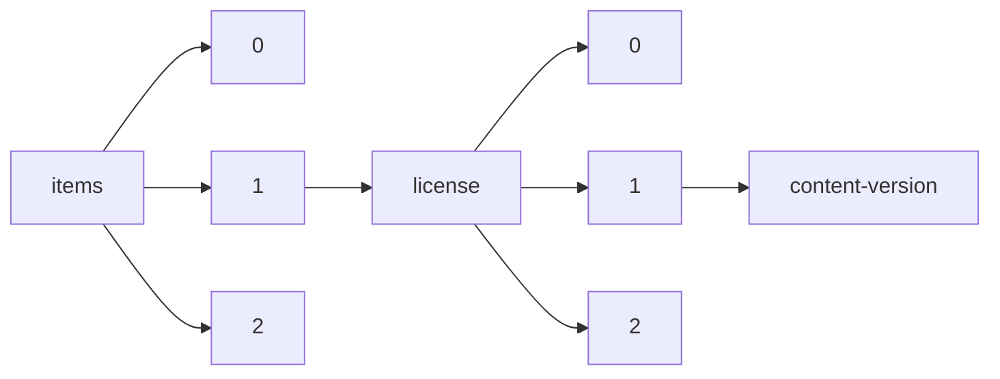

!!! warning "This document is not official Crossref documentation"
# Content-version
PATH = items/array/license/array/content-version(1)  
Occurs 81 984 207 times  
Unique values: 5  
{ .annotate }

1. A route to an element, for example:  
   The route "items/array/license/array/content-version" corresponds to navigating through the JSON indices as  
   ["items"][0]["license"][0]["content-version"]  

| **Row** | **Value** `String` | **Count** `Int64` |
|--------:|----------------------:|---------------------:|
| **1**   | tdm                   | 46 661 628           |
| **2**   | vor                   | 17 731 848           |
| **3**   | unspecified           | 9 416 173            |
| **4**   | stm-asf               | 7 415 085            |
| **5**   | am                    | 759 473              |

