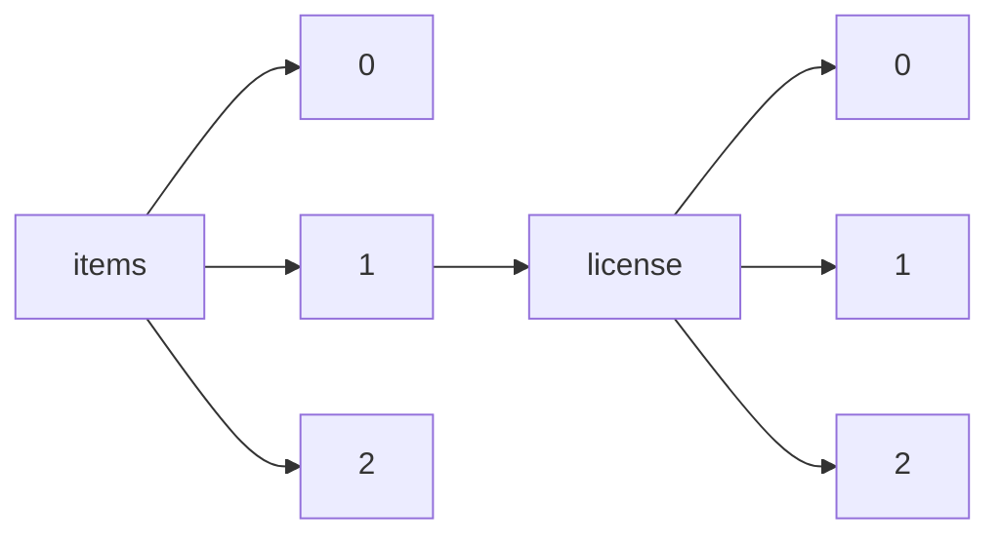

!!! warning "This document is not official Crossref documentation"
# Elements
PATH = items/array/license/array(1)  
Occurs 81 984 207 times  
{ .annotate }

1. A route to an element, for example:  
   The route "items/array/license/array" corresponds to navigating through the JSON indices as  
   ["items"][0]["license"][0]  

## URL
See more information: [items/array/license/array/URL](URL/index.md)  
Occurs 81 984 207 timess  
Unique values: > 999  

!!! note "Due to current limitations, only the first 1,000 unique values are counted."

| **Row** | **Value** `String`                                                  | **Count** `Int64` |
|--------:|-----------------------------------------------------------------------:|---------------------:|
| **1**   | https://www.elsevier.com/tdm/userlicense/1.0/                          | 19 487 105           |
| **2**   | http://www.springer.com/tdm                                            | 10 085 735           |
| **3**   | http://doi.wiley.com/10.1002/tdm\_license\_1.1                         | 9 348 298            |
| **4**   | https://www.springer.com/tdm                                           | 3 223 662            |
| **5**   | https://www.cambridge.org/core/terms                                   | 2 869 842            |
| **6**   | http://onlinelibrary.wiley.com/termsAndConditions#vor                  | 2 645 754            |
| **7**   | http://journals.sagepub.com/page/policies/text-and-data-mining-license | 2 492 735            |
| **8**   | https://creativecommons.org/licenses/by/4.0/                           | 2 299 054            |
| **9**   | https://doi.org/10.15223/policy-029                                    | 2 098 365            |
| **10**  | https://doi.org/10.15223/policy-037                                    | 2 098 365            |
| ... | ... | ... |

## Content-version
See more information: [items/array/license/array/content-version](content-version/index.md)  
Occurs 81 984 207 timess  
Unique values: 5  

| **Row** | **Value** `String` | **Count** `Int64` |
|--------:|----------------------:|---------------------:|
| **1**   | tdm                   | 46 661 628           |
| **2**   | vor                   | 17 731 848           |
| **3**   | unspecified           | 9 416 173            |
| **4**   | stm-asf               | 7 415 085            |
| **5**   | am                    | 759 473              |

## Delay-in-days
See more information: [items/array/license/array/delay-in-days](delay-in-days/index.md)  
Occurs 81 984 207 timess  
Unique values: > 999  

!!! note "Due to current limitations, only the first 1,000 unique values are counted."

| **Row** | **Value** `Int64` | **Count** `Int64` |
|--------:|---------------------:|---------------------:|
| **1**   | 0                    | 68 151 230           |
| **2**   | 365                  | 254 058              |
| **3**   | 14                   | 117 693              |
| **4**   | 1                    | 91 194               |
| **5**   | 366                  | 81 026               |
| **6**   | 26                   | 78 421               |
| **7**   | 12                   | 78 083               |
| **8**   | 5                    | 72 898               |
| **9**   | 3                    | 71 151               |
| **10**  | 9                    | 70 054               |
| ... | ... | ... |

## Start
See more information: [items/array/license/array/start](start/index.md)  
Occurs 81 861 544 timess  

