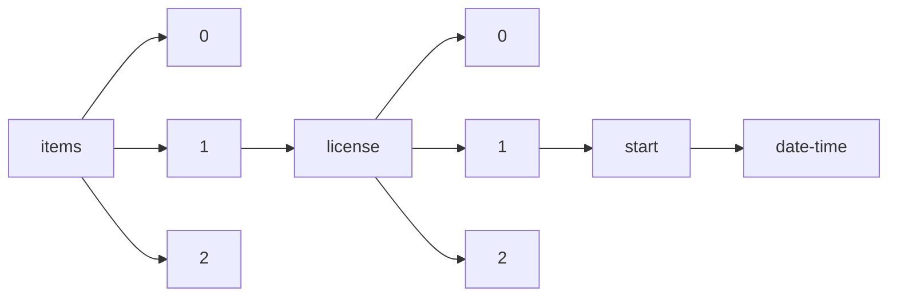

!!! warning "This document is not official Crossref documentation"
# Date-time
PATH = items/array/license/array/start/date-time(1)  
Occurs 81 861 544 times  
Unique values: > 999  
{ .annotate }

1. A route to an element, for example:  
   The route "items/array/license/array/start/date-time" corresponds to navigating through the JSON indices as  
   ["items"][0]["license"][0]["start"]["date-time"]  

!!! note "Due to current limitations, only the first 1,000 unique values are counted."

| **Row** | **Value** `String` | **Count** `Int64` |
|--------:|----------------------:|---------------------:|
| **1**   | 2015-09-01T00:00:00Z  | 6 497 305            |
| **2**   | 2022-01-01T00:00:00Z  | 1 264 672            |
| **3**   | 2021-01-01T00:00:00Z  | 1 018 181            |
| **4**   | 2020-01-01T00:00:00Z  | 879 127              |
| **5**   | 2023-01-01T00:00:00Z  | 639 533              |
| **6**   | 2019-01-01T00:00:00Z  | 604 746              |
| **7**   | 2016-01-01T00:00:00Z  | 520 944              |
| **8**   | 2018-01-01T00:00:00Z  | 508 570              |
| **9**   | 2015-01-01T00:00:00Z  | 506 908              |
| **10**  | 2017-01-01T00:00:00Z  | 494 471              |
| **11**  | 2014-01-01T00:00:00Z  | 418 333              |
| **12**  | 2022-12-01T00:00:00Z  | 378 614              |
| **13**  | 2013-01-01T00:00:00Z  | 378 405              |
| **14**  | 2021-12-01T00:00:00Z  | 326 075              |
| **15**  | 2023-03-01T00:00:00Z  | 320 468              |
| **16**  | 2012-01-01T00:00:00Z  | 306 919              |
| **17**  | 2011-01-01T00:00:00Z  | 304 826              |
| **18**  | 2021-10-01T00:00:00Z  | 300 461              |
| **19**  | 2022-11-01T00:00:00Z  | 294 046              |
| **20**  | 2021-11-01T00:00:00Z  | 293 633              |
| **21**  | 2022-09-01T00:00:00Z  | 289 297              |
| **22**  | 2021-09-01T00:00:00Z  | 286 790              |
| **23**  | 2022-10-01T00:00:00Z  | 284 570              |
| **24**  | 2023-02-01T00:00:00Z  | 280 758              |
| **25**  | 2022-06-01T00:00:00Z  | 261 515              |
| **26**  | 2022-03-01T00:00:00Z  | 256 871              |
| **27**  | 2021-06-01T00:00:00Z  | 253 913              |
| **28**  | 2022-02-01T00:00:00Z  | 253 415              |
| **29**  | 2022-08-01T00:00:00Z  | 242 832              |
| **30**  | 2021-07-01T00:00:00Z  | 240 594              |
| **31**  | 2022-04-01T00:00:00Z  | 234 942              |
| **32**  | 2021-05-01T00:00:00Z  | 233 094              |
| **33**  | 2022-05-01T00:00:00Z  | 232 597              |
| **34**  | 2022-07-01T00:00:00Z  | 228 491              |
| **35**  | 2021-08-01T00:00:00Z  | 224 220              |
| **36**  | 2019-10-01T00:00:00Z  | 217 416              |
| **37**  | 2009-01-01T00:00:00Z  | 212 451              |
| **38**  | 2021-04-01T00:00:00Z  | 208 725              |
| **39**  | 2010-01-01T00:00:00Z  | 205 005              |
| **40**  | 2013-07-17T00:00:00Z  | 204 153              |
| **41**  | 2008-01-01T00:00:00Z  | 203 555              |
| **42**  | 2007-01-01T00:00:00Z  | 201 269              |
| **43**  | 2021-03-01T00:00:00Z  | 197 942              |
| **44**  | 2019-07-01T00:00:00Z  | 193 843              |
| **45**  | 2019-12-01T00:00:00Z  | 192 952              |
| **46**  | 2019-11-01T00:00:00Z  | 189 000              |
| **47**  | 2020-12-01T00:00:00Z  | 186 158              |
| **48**  | 2019-09-01T00:00:00Z  | 180 370              |
| **49**  | 2019-06-01T00:00:00Z  | 177 752              |
| **50**  | 2023-04-01T00:00:00Z  | 176 759              |
| **51**  | 2020-06-01T00:00:00Z  | 167 169              |
| **52**  | 2006-01-01T00:00:00Z  | 167 056              |
| **53**  | 2019-05-01T00:00:00Z  | 165 849              |
| **54**  | 2020-10-01T00:00:00Z  | 163 373              |
| **55**  | 2020-09-01T00:00:00Z  | 161 758              |
| **56**  | 2020-11-01T00:00:00Z  | 158 072              |
| **57**  | 2019-04-01T00:00:00Z  | 156 059              |
| **58**  | 2019-03-01T00:00:00Z  | 153 386              |
| **59**  | 2020-07-01T00:00:00Z  | 151 426              |
| **60**  | 2020-03-01T00:00:00Z  | 147 020              |
| **61**  | 2020-05-01T00:00:00Z  | 144 929              |
| **62**  | 2020-04-01T00:00:00Z  | 144 703              |
| **63**  | 2013-07-16T00:00:00Z  | 143 836              |
| **64**  | 2021-02-01T00:00:00Z  | 141 894              |
| **65**  | 2005-01-01T00:00:00Z  | 137 489              |
| **66**  | 2019-08-01T00:00:00Z  | 134 956              |
| **67**  | 2000-01-01T00:00:00Z  | 130 356              |
| **68**  | 2001-01-01T00:00:00Z  | 127 527              |
| **69**  | 1991-01-01T00:00:00Z  | 126 412              |
| **70**  | 2004-01-01T00:00:00Z  | 124 191              |
| **71**  | 2020-02-01T00:00:00Z  | 124 124              |
| **72**  | 2020-08-01T00:00:00Z  | 123 431              |
| **73**  | 2023-05-01T00:00:00Z  | 120 415              |
| **74**  | 1990-01-01T00:00:00Z  | 119 350              |
| **75**  | 2003-01-01T00:00:00Z  | 117 392              |
| **76**  | 2002-01-01T00:00:00Z  | 116 473              |
| **77**  | 1996-01-01T00:00:00Z  | 115 781              |
| **78**  | 1989-01-01T00:00:00Z  | 113 358              |
| **79**  | 2019-02-01T00:00:00Z  | 113 203              |
| **80**  | 1995-01-01T00:00:00Z  | 112 432              |
| **81**  | 1987-01-01T00:00:00Z  | 112 046              |
| **82**  | 1993-01-01T00:00:00Z  | 111 792              |
| **83**  | 1998-01-01T00:00:00Z  | 110 180              |
| **84**  | 1992-01-01T00:00:00Z  | 109 287              |
| **85**  | 1988-01-01T00:00:00Z  | 108 491              |
| **86**  | 2018-10-01T00:00:00Z  | 107 975              |
| **87**  | 1997-01-01T00:00:00Z  | 107 520              |
| **88**  | 1994-01-01T00:00:00Z  | 107 370              |
| **89**  | 1999-01-01T00:00:00Z  | 105 494              |
| **90**  | 2018-04-01T00:00:00Z  | 105 181              |
| **91**  | 2018-12-01T00:00:00Z  | 105 020              |
| **92**  | 2018-09-01T00:00:00Z  | 101 360              |
| **93**  | 2017-09-01T00:00:00Z  | 100 084              |
| **94**  | 2016-09-01T00:00:00Z  | 100 011              |
| **95**  | 2017-10-01T00:00:00Z  | 99 631               |
| **96**  | 2017-12-01T00:00:00Z  | 97 035               |
| **97**  | 2018-03-01T00:00:00Z  | 96 896               |
| **98**  | 1986-01-01T00:00:00Z  | 96 759               |
| **99**  | 2018-06-01T00:00:00Z  | 96 071               |
| **100** | 2018-11-01T00:00:00Z  | 94 368               |
| **101** | 1985-01-01T00:00:00Z  | 94 129               |
| **102** | 2015-04-01T00:00:00Z  | 93 210               |
| **103** | 2018-07-01T00:00:00Z  | 91 841               |
| **104** | 2016-10-01T00:00:00Z  | 90 064               |
| **105** | 2015-12-01T00:00:00Z  | 89 531               |
| **106** | 2017-11-01T00:00:00Z  | 89 440               |
| **107** | 2017-03-01T00:00:00Z  | 88 795               |
| **108** | 1984-01-01T00:00:00Z  | 88 500               |
| **109** | 2012-06-05T00:00:00Z  | 88 452               |
| **110** | 2016-04-01T00:00:00Z  | 87 465               |
| **111** | 2016-11-01T00:00:00Z  | 87 396               |
| **112** | 2016-12-01T00:00:00Z  | 86 048               |
| **113** | 2017-06-01T00:00:00Z  | 85 409               |
| **114** | 1983-01-01T00:00:00Z  | 85 029               |
| **115** | 2017-07-01T00:00:00Z  | 84 908               |
| **116** | 2017-04-01T00:00:00Z  | 84 732               |
| **117** | 2023-06-01T00:00:00Z  | 83 551               |
| **118** | 2013-04-01T00:00:00Z  | 82 309               |
| **119** | 2012-04-01T00:00:00Z  | 81 971               |
| **120** | 2018-02-01T00:00:00Z  | 81 903               |
| **121** | 2018-05-01T00:00:00Z  | 81 835               |
| **122** | 2009-05-01T00:00:00Z  | 81 769               |
| **123** | 2017-05-01T00:00:00Z  | 80 467               |
| **124** | 2015-11-01T00:00:00Z  | 80 319               |
| **125** | 2014-04-01T00:00:00Z  | 80 030               |
| **126** | 2014-09-01T00:00:00Z  | 79 977               |
| **127** | 1982-01-01T00:00:00Z  | 78 702               |
| **128** | 2016-06-01T00:00:00Z  | 78 627               |
| **129** | 2015-10-01T00:00:00Z  | 78 593               |
| **130** | 2018-08-01T00:00:00Z  | 77 972               |
| **131** | 2017-02-01T00:00:00Z  | 77 938               |
| **132** | 2016-03-01T00:00:00Z  | 77 693               |
| **133** | 2014-10-01T00:00:00Z  | 76 043               |
| **134** | 2010-04-01T00:00:00Z  | 76 025               |
| **135** | 2009-04-01T00:00:00Z  | 75 735               |
| **136** | 2014-11-01T00:00:00Z  | 74 643               |
| **137** | 2011-09-01T00:00:00Z  | 74 316               |
| **138** | 2014-12-01T00:00:00Z  | 73 609               |
| **139** | 2008-03-01T00:00:00Z  | 72 855               |
| **140** | 2016-07-01T00:00:00Z  | 72 257               |
| **141** | 2013-03-01T00:00:00Z  | 71 642               |
| **142** | 2012-09-01T00:00:00Z  | 71 427               |
| **143** | 2015-06-01T00:00:00Z  | 71 382               |
| **144** | 2015-05-01T00:00:00Z  | 71 323               |
| **145** | 2017-08-01T00:00:00Z  | 71 229               |
| **146** | 2015-03-01T00:00:00Z  | 70 940               |
| **147** | 2011-06-01T00:00:00Z  | 70 385               |
| **148** | 2016-02-01T00:00:00Z  | 69 620               |
| **149** | 1981-01-01T00:00:00Z  | 69 512               |
| **150** | 2012-10-01T00:00:00Z  | 69 320               |
| **151** | 2012-11-01T00:00:00Z  | 69 303               |
| **152** | 2016-05-01T00:00:00Z  | 68 712               |
| **153** | 2009-09-01T00:00:00Z  | 68 689               |
| **154** | 1980-01-01T00:00:00Z  | 68 610               |
| **155** | 2013-10-01T00:00:00Z  | 68 578               |
| **156** | 2015-07-01T00:00:00Z  | 68 526               |
| **157** | 2011-10-01T00:00:00Z  | 68 476               |
| **158** | 2012-03-01T00:00:00Z  | 68 344               |
| **159** | 2011-02-01T00:00:00Z  | 68 069               |
| **160** | 2011-12-01T00:00:00Z  | 67 983               |
| **161** | 2016-08-01T00:00:00Z  | 67 278               |
| **162** | 2014-08-01T00:00:00Z  | 67 226               |
| **163** | 2012-12-01T00:00:00Z  | 66 779               |
| **164** | 2010-09-01T00:00:00Z  | 66 611               |
| **165** | 2009-10-01T00:00:00Z  | 66 414               |
| **166** | 2013-05-01T00:00:00Z  | 66 239               |
| **167** | 2011-04-01T00:00:00Z  | 65 981               |
| **168** | 2012-06-01T00:00:00Z  | 65 457               |
| **169** | 2011-03-01T00:00:00Z  | 65 342               |
| **170** | 2007-04-01T00:00:00Z  | 65 169               |
| **171** | 2011-05-01T00:00:00Z  | 64 691               |
| **172** | 2012-05-01T00:00:00Z  | 64 668               |
| **173** | 1979-01-01T00:00:00Z  | 64 664               |
| **174** | 2009-06-01T00:00:00Z  | 64 607               |
| **175** | 2022-05-27T00:00:00Z  | 64 451               |
| **176** | 2010-10-01T00:00:00Z  | 64 176               |
| **177** | 2012-07-01T00:00:00Z  | 64 091               |
| **178** | 2013-02-01T00:00:00Z  | 63 968               |
| **179** | 2008-09-01T00:00:00Z  | 63 411               |
| **180** | 2010-12-01T00:00:00Z  | 63 170               |
| **181** | 2011-07-01T00:00:00Z  | 63 067               |
| **182** | 2010-06-01T00:00:00Z  | 62 812               |
| **183** | 2010-11-01T00:00:00Z  | 62 365               |
| **184** | 2010-03-01T00:00:00Z  | 62 268               |
| **185** | 2013-09-01T00:00:00Z  | 61 975               |
| **186** | 2008-10-01T00:00:00Z  | 61 877               |
| **187** | 2013-06-01T00:00:00Z  | 61 801               |
| **188** | 2012-02-01T00:00:00Z  | 60 628               |
| **189** | 1978-01-01T00:00:00Z  | 60 190               |
| **190** | 2008-04-01T00:00:00Z  | 59 924               |
| **191** | 2011-11-01T00:00:00Z  | 59 864               |
| **192** | 2009-12-01T00:00:00Z  | 59 825               |
| **193** | 2013-11-01T00:00:00Z  | 59 649               |
| **194** | 2006-03-01T00:00:00Z  | 59 628               |
| **195** | 2007-09-01T00:00:00Z  | 59 030               |
| **196** | 2008-07-01T00:00:00Z  | 58 804               |
| **197** | 2014-05-01T00:00:00Z  | 58 752               |
| **198** | 2007-03-01T00:00:00Z  | 58 695               |
| **199** | 2008-06-01T00:00:00Z  | 58 372               |
| **200** | 1977-01-01T00:00:00Z  | 58 335               |
| **201** | 2009-07-01T00:00:00Z  | 58 285               |
| **202** | 2006-12-01T00:00:00Z  | 58 272               |
| **203** | 2013-07-01T00:00:00Z  | 57 896               |
| **204** | 2010-05-01T00:00:00Z  | 57 717               |
| **205** | 2009-03-01T00:00:00Z  | 57 481               |
| **206** | 2014-07-01T00:00:00Z  | 57 387               |
| **207** | 2015-02-01T00:00:00Z  | 57 194               |
| **208** | 2007-06-01T00:00:00Z  | 56 816               |
| **209** | 2006-09-01T00:00:00Z  | 56 779               |
| **210** | 2010-07-01T00:00:00Z  | 56 299               |
| **211** | 2013-12-01T00:00:00Z  | 56 123               |
| **212** | 2015-08-01T00:00:00Z  | 55 133               |
| **213** | 2011-08-01T00:00:00Z  | 54 880               |
| **214** | 2010-02-01T00:00:00Z  | 54 773               |
| **215** | 2014-03-01T00:00:00Z  | 54 560               |
| **216** | 2012-08-01T00:00:00Z  | 54 282               |
| **217** | 2005-09-01T00:00:00Z  | 53 892               |
| **218** | 1976-01-01T00:00:00Z  | 53 728               |
| **219** | 2008-05-01T00:00:00Z  | 53 447               |
| **220** | 2009-11-01T00:00:00Z  | 53 251               |
| **221** | 2010-08-01T00:00:00Z  | 53 212               |
| **222** | 2013-08-22T00:00:00Z  | 53 150               |
| **223** | 2009-02-01T00:00:00Z  | 53 004               |
| **224** | 2006-11-01T00:00:00Z  | 52 628               |
| **225** | 2008-12-01T00:00:00Z  | 52 589               |
| **226** | 2008-11-01T00:00:00Z  | 52 219               |
| **227** | 2005-03-01T00:00:00Z  | 52 091               |
| **228** | 2006-10-01T00:00:00Z  | 51 914               |
| **229** | 2004-09-01T00:00:00Z  | 51 874               |
| **230** | 2006-06-01T00:00:00Z  | 51 805               |
| **231** | 2007-10-01T00:00:00Z  | 51 626               |
| **232** | 2006-04-01T00:00:00Z  | 51 494               |
| **233** | 2008-08-01T00:00:00Z  | 50 902               |
| **234** | 2014-06-01T00:00:00Z  | 50 594               |
| **235** | 2007-12-01T00:00:00Z  | 50 576               |
| **236** | 2009-08-01T00:00:00Z  | 50 361               |
| **237** | 2005-06-01T00:00:00Z  | 50 305               |
| **238** | 2007-05-01T00:00:00Z  | 50 233               |
| **239** | 2006-07-01T00:00:00Z  | 50 103               |
| **240** | 2006-05-01T00:00:00Z  | 50 050               |
| **241** | 2008-02-01T00:00:00Z  | 49 672               |
| **242** | 2005-12-01T00:00:00Z  | 49 455               |
| **243** | 2005-10-01T00:00:00Z  | 48 828               |
| **244** | 2007-02-01T00:00:00Z  | 48 789               |
| **245** | 2005-04-01T00:00:00Z  | 48 433               |
| **246** | 2001-04-01T00:00:00Z  | 48 398               |
| **247** | 2014-02-01T00:00:00Z  | 48 039               |
| **248** | 2007-11-01T00:00:00Z  | 47 539               |
| **249** | 2013-08-01T00:00:00Z  | 47 432               |
| **250** | 2004-03-01T00:00:00Z  | 47 392               |
| **251** | 2002-03-01T00:00:00Z  | 46 525               |
| **252** | 2007-07-01T00:00:00Z  | 46 515               |
| **253** | 2004-05-01T00:00:00Z  | 46 065               |
| **254** | 2006-02-01T00:00:00Z  | 46 002               |
| **255** | 2000-04-01T00:00:00Z  | 45 673               |
| **256** | 2005-05-01T00:00:00Z  | 45 664               |
| **257** | 2004-04-01T00:00:00Z  | 45 555               |
| **258** | 2003-09-01T00:00:00Z  | 45 532               |
| **259** | 2004-12-01T00:00:00Z  | 45 444               |
| **260** | 2003-03-01T00:00:00Z  | 45 164               |
| **261** | 2006-08-01T00:00:00Z  | 45 128               |
| **262** | 2005-07-01T00:00:00Z  | 44 620               |
| **263** | 2001-12-01T00:00:00Z  | 44 251               |
| **264** | 2023-03-30T00:00:00Z  | 44 250               |
| **265** | 2000-09-01T00:00:00Z  | 44 163               |
| **266** | 2001-03-01T00:00:00Z  | 44 157               |
| **267** | 2001-06-01T00:00:00Z  | 44 074               |
| **268** | 2000-03-01T00:00:00Z  | 43 986               |
| **269** | 2007-08-01T00:00:00Z  | 43 840               |
| **270** | 2003-12-01T00:00:00Z  | 43 815               |
| **271** | 1975-01-01T00:00:00Z  | 43 758               |
| **272** | 1997-09-01T00:00:00Z  | 43 477               |
| **273** | 1970-01-01T00:00:00Z  | 43 142               |
| **274** | 2000-07-01T00:00:00Z  | 42 748               |
| **275** | 2004-10-01T00:00:00Z  | 42 732               |
| **276** | 2005-11-01T00:00:00Z  | 42 677               |
| **277** | 2004-06-01T00:00:00Z  | 42 677               |
| **278** | 1998-03-01T00:00:00Z  | 42 676               |
| **279** | 1999-09-01T00:00:00Z  | 42 662               |
| **280** | 1996-06-01T00:00:00Z  | 42 501               |
| **281** | 2001-09-01T00:00:00Z  | 42 498               |
| **282** | 2000-06-01T00:00:00Z  | 42 476               |
| **283** | 1999-03-01T00:00:00Z  | 42 464               |
| **284** | 1998-09-01T00:00:00Z  | 42 309               |
| **285** | 1973-01-01T00:00:00Z  | 42 056               |
| **286** | 2005-02-01T00:00:00Z  | 42 025               |
| **287** | 2000-12-01T00:00:00Z  | 41 341               |
| **288** | 1999-06-01T00:00:00Z  | 41 323               |
| **289** | 1998-04-01T00:00:00Z  | 41 247               |
| **290** | 2005-08-01T00:00:00Z  | 41 229               |
| **291** | 1974-01-01T00:00:00Z  | 41 090               |
| **292** | 2002-12-01T00:00:00Z  | 41 048               |
| **293** | 1997-12-01T00:00:00Z  | 40 858               |
| **294** | 2004-11-01T00:00:00Z  | 40 760               |
| **295** | 1997-03-01T00:00:00Z  | 40 744               |
| **296** | 1998-06-01T00:00:00Z  | 40 558               |
| **297** | 2004-08-01T00:00:00Z  | 40 503               |
| **298** | 2004-07-01T00:00:00Z  | 40 329               |
| **299** | 2002-04-01T00:00:00Z  | 40 313               |
| **300** | 2003-10-01T00:00:00Z  | 40 185               |
| **301** | 1999-12-01T00:00:00Z  | 40 148               |
| **302** | 2003-04-01T00:00:00Z  | 40 053               |
| **303** | 1996-09-01T00:00:00Z  | 39 995               |
| **304** | 1972-01-01T00:00:00Z  | 39 937               |
| **305** | 2003-05-01T00:00:00Z  | 39 851               |
| **306** | 2000-05-01T00:00:00Z  | 39 806               |
| **307** | 2004-02-01T00:00:00Z  | 39 517               |
| **308** | 2002-05-01T00:00:00Z  | 39 476               |
| **309** | 1996-03-01T00:00:00Z  | 39 393               |
| **310** | 2003-06-01T00:00:00Z  | 39 342               |
| **311** | 1997-06-01T00:00:00Z  | 39 290               |
| **312** | 1995-09-01T00:00:00Z  | 39 278               |
| **313** | 1997-05-01T00:00:00Z  | 39 235               |
| **314** | 1998-12-01T00:00:00Z  | 39 024               |
| **315** | 2002-06-01T00:00:00Z  | 38 596               |
| **316** | 1999-04-01T00:00:00Z  | 38 552               |
| **317** | 1996-12-01T00:00:00Z  | 38 544               |
| **318** | 1995-03-01T00:00:00Z  | 38 542               |
| **319** | 2002-09-01T00:00:00Z  | 38 503               |
| **320** | 1997-07-01T00:00:00Z  | 38 264               |
| **321** | 1999-05-01T00:00:00Z  | 38 249               |
| **322** | 2001-11-01T00:00:00Z  | 37 617               |
| **323** | 1995-12-01T00:00:00Z  | 37 454               |
| **324** | 2001-05-01T00:00:00Z  | 37 165               |
| **325** | 2001-07-01T00:00:00Z  | 37 051               |
| **326** | 1971-01-01T00:00:00Z  | 37 002               |
| **327** | 1998-05-01T00:00:00Z  | 36 783               |
| **328** | 1996-07-01T00:00:00Z  | 36 624               |
| **329** | 1999-07-01T00:00:00Z  | 36 443               |
| **330** | 1998-07-01T00:00:00Z  | 36 394               |
| **331** | 2001-10-01T00:00:00Z  | 36 366               |
| **332** | 1995-04-01T00:00:00Z  | 36 326               |
| **333** | 1995-06-01T00:00:00Z  | 36 306               |
| **334** | 2003-08-01T00:00:00Z  | 36 071               |
| **335** | 1996-04-01T00:00:00Z  | 35 790               |
| **336** | 2002-10-01T00:00:00Z  | 35 769               |
| **337** | 1997-04-01T00:00:00Z  | 35 341               |
| **338** | 2003-07-01T00:00:00Z  | 35 221               |
| **339** | 1997-10-01T00:00:00Z  | 34 940               |
| **340** | 2003-02-01T00:00:00Z  | 34 587               |
| **341** | 1998-10-01T00:00:00Z  | 34 526               |
| **342** | 1998-02-01T00:00:00Z  | 34 437               |
| **343** | 1995-10-01T00:00:00Z  | 34 352               |
| **344** | 2000-11-01T00:00:00Z  | 34 056               |
| **345** | 1996-10-01T00:00:00Z  | 33 963               |
| **346** | 2018-11-20T00:00:00Z  | 33 871               |
| **347** | 2000-10-01T00:00:00Z  | 33 704               |
| **348** | 2003-11-01T00:00:00Z  | 33 654               |
| **349** | 1999-10-01T00:00:00Z  | 33 455               |
| **350** | 1994-12-01T00:00:00Z  | 33 434               |
| **351** | 1997-02-01T00:00:00Z  | 33 367               |
| **352** | 2002-11-01T00:00:00Z  | 33 325               |
| **353** | 1995-07-01T00:00:00Z  | 33 230               |
| **354** | 1996-05-01T00:00:00Z  | 33 195               |
| **355** | 1997-08-01T00:00:00Z  | 32 996               |
| **356** | 1998-11-01T00:00:00Z  | 32 781               |
| **357** | 1969-01-01T00:00:00Z  | 32 720               |
| **358** | 1994-09-01T00:00:00Z  | 32 672               |
| **359** | 2018-01-02T00:00:00Z  | 32 459               |
| **360** | 2001-02-01T00:00:00Z  | 32 434               |
| **361** | 1996-11-01T00:00:00Z  | 32 182               |
| **362** | 1994-06-01T00:00:00Z  | 32 052               |
| **363** | 1967-01-01T00:00:00Z  | 31 898               |
| **364** | 2002-02-01T00:00:00Z  | 31 847               |
| **365** | 1994-03-01T00:00:00Z  | 31 669               |
| **366** | 2000-02-01T00:00:00Z  | 31 613               |
| **367** | 1998-08-01T00:00:00Z  | 31 561               |
| **368** | 1968-01-01T00:00:00Z  | 31 448               |
| **369** | 2001-08-01T00:00:00Z  | 31 383               |
| **370** | 1999-11-01T00:00:00Z  | 31 361               |
| **371** | 1993-03-01T00:00:00Z  | 30 933               |
| **372** | 1995-05-01T00:00:00Z  | 30 912               |
| **373** | 1997-11-01T00:00:00Z  | 30 884               |
| **374** | 1999-02-01T00:00:00Z  | 30 724               |
| **375** | 1992-09-01T00:00:00Z  | 30 690               |
| **376** | 2002-07-01T00:00:00Z  | 30 651               |
| **377** | 2002-08-01T00:00:00Z  | 30 348               |
| **378** | 1995-11-01T00:00:00Z  | 30 306               |
| **379** | 2000-08-01T00:00:00Z  | 30 221               |
| **380** | 1966-01-01T00:00:00Z  | 30 205               |
| **381** | 1999-08-01T00:00:00Z  | 29 987               |
| **382** | 1996-08-01T00:00:00Z  | 29 954               |
| **383** | 1992-03-01T00:00:00Z  | 29 588               |
| **384** | 1995-02-01T00:00:00Z  | 29 450               |
| **385** | 1993-12-01T00:00:00Z  | 29 064               |
| **386** | 1996-02-01T00:00:00Z  | 28 243               |
| **387** | 1965-01-01T00:00:00Z  | 27 902               |
| **388** | 1995-08-01T00:00:00Z  | 27 341               |
| **389** | 1993-06-01T00:00:00Z  | 27 233               |
| **390** | 2009-09-22T00:00:00Z  | 27 055               |
| **391** | 1993-07-01T00:00:00Z  | 26 989               |
| **392** | 1991-09-01T00:00:00Z  | 26 567               |
| **393** | 1994-05-01T00:00:00Z  | 26 031               |
| **394** | 1993-04-01T00:00:00Z  | 25 755               |
| **395** | 1993-09-01T00:00:00Z  | 25 627               |
| **396** | 1993-10-01T00:00:00Z  | 25 557               |
| **397** | 2023-07-01T00:00:00Z  | 25 494               |
| **398** | 1994-07-01T00:00:00Z  | 25 377               |
| **399** | 1994-04-01T00:00:00Z  | 25 151               |
| **400** | 1964-01-01T00:00:00Z  | 25 029               |
| **401** | 1992-07-01T00:00:00Z  | 24 889               |
| **402** | 1991-12-01T00:00:00Z  | 24 671               |
| **403** | 1963-01-01T00:00:00Z  | 24 533               |
| **404** | 1992-12-01T00:00:00Z  | 24 448               |
| **405** | 2017-12-04T00:00:00Z  | 24 140               |
| **406** | 2014-10-05T00:00:00Z  | 23 937               |
| **407** | 2020-10-23T00:00:00Z  | 23 669               |
| **408** | 1994-10-01T00:00:00Z  | 23 415               |
| **409** | 1991-07-01T00:00:00Z  | 23 064               |
| **410** | 2009-10-27T00:00:00Z  | 22 899               |
| **411** | 1992-10-01T00:00:00Z  | 22 887               |
| **412** | 1991-03-01T00:00:00Z  | 22 801               |
| **413** | 2010-03-17T00:00:00Z  | 22 792               |
| **414** | 2023-03-31T00:00:00Z  | 22 384               |
| **415** | 1990-09-01T00:00:00Z  | 22 364               |
| **416** | 1988-12-01T00:00:00Z  | 22 348               |
| **417** | 1992-04-01T00:00:00Z  | 22 240               |
| **418** | 1992-06-01T00:00:00Z  | 22 123               |
| **419** | 2022-06-30T00:00:00Z  | 22 038               |
| **420** | 2020-10-28T00:00:00Z  | 21 998               |
| **421** | 2015-12-02T00:00:00Z  | 21 931               |
| **422** | 2017-01-20T00:00:00Z  | 21 738               |
| **423** | 1989-12-01T00:00:00Z  | 21 732               |
| **424** | 2020-06-18T00:00:00Z  | 21 710               |
| **425** | 2020-10-27T00:00:00Z  | 21 698               |
| **426** | 1990-12-01T00:00:00Z  | 21 629               |
| **427** | 1994-02-01T00:00:00Z  | 21 554               |
| **428** | 1992-05-01T00:00:00Z  | 21 440               |
| **429** | 2021-12-31T00:00:00Z  | 21 289               |
| **430** | 1987-09-01T00:00:00Z  | 21 279               |
| **431** | 2020-11-23T00:00:00Z  | 21 200               |
| **432** | 1993-05-01T00:00:00Z  | 21 074               |
| **433** | 1989-03-01T00:00:00Z  | 20 979               |
| **434** | 2020-10-30T00:00:00Z  | 20 790               |
| **435** | 2020-04-16T00:00:00Z  | 20 710               |
| **436** | 1993-08-01T00:00:00Z  | 20 702               |
| **437** | 2019-12-07T00:00:00Z  | 20 682               |
| **438** | 1986-12-01T00:00:00Z  | 20 674               |
| **439** | 1994-11-01T00:00:00Z  | 20 543               |
| **440** | 1994-08-01T00:00:00Z  | 20 526               |
| **441** | 1991-06-01T00:00:00Z  | 20 410               |
| **442** | 2021-06-30T00:00:00Z  | 20 241               |
| **443** | 1989-09-01T00:00:00Z  | 20 236               |
| **444** | 1993-02-01T00:00:00Z  | 20 111               |
| **445** | 1990-03-01T00:00:00Z  | 20 033               |
| **446** | 1987-06-01T00:00:00Z  | 19 972               |
| **447** | 2020-09-30T00:00:00Z  | 19 936               |
| **448** | 1991-05-01T00:00:00Z  | 19 787               |
| **449** | 1987-12-01T00:00:00Z  | 19 765               |
| **450** | 2020-12-16T00:00:00Z  | 19 725               |
| **451** | 1990-07-01T00:00:00Z  | 19 685               |
| **452** | 2020-10-20T00:00:00Z  | 19 640               |
| **453** | 1989-06-01T00:00:00Z  | 19 386               |
| **454** | 2022-12-31T00:00:00Z  | 19 186               |
| **455** | 2020-12-31T00:00:00Z  | 19 055               |
| **456** | 1992-11-01T00:00:00Z  | 18 885               |
| **457** | 1993-11-01T00:00:00Z  | 18 880               |
| **458** | 1991-10-01T00:00:00Z  | 18 759               |
| **459** | 1988-03-01T00:00:00Z  | 18 747               |
| **460** | 1987-03-01T00:00:00Z  | 18 653               |
| **461** | 1988-09-01T00:00:00Z  | 18 640               |
| **462** | 1992-02-01T00:00:00Z  | 18 537               |
| **463** | 1991-04-01T00:00:00Z  | 18 448               |
| **464** | 2019-12-31T00:00:00Z  | 18 432               |
| **465** | 1990-06-01T00:00:00Z  | 18 285               |
| **466** | 2018-02-19T00:00:00Z  | 18 275               |
| **467** | 1988-06-01T00:00:00Z  | 17 881               |
| **468** | 1990-05-01T00:00:00Z  | 17 866               |
| **469** | 1989-07-01T00:00:00Z  | 17 757               |
| **470** | 2021-10-22T00:00:00Z  | 17 708               |
| **471** | 1985-12-01T00:00:00Z  | 17 702               |
| **472** | 1990-10-01T00:00:00Z  | 17 648               |
| **473** | 1991-02-01T00:00:00Z  | 17 624               |
| **474** | 1989-04-01T00:00:00Z  | 17 448               |
| **475** | 2021-10-13T00:00:00Z  | 17 294               |
| **476** | 1991-11-01T00:00:00Z  | 17 263               |
| **477** | 1986-03-01T00:00:00Z  | 17 210               |
| **478** | 1990-04-01T00:00:00Z  | 17 184               |
| **479** | 2013-07-18T00:00:00Z  | 17 140               |
| **480** | 1989-10-01T00:00:00Z  | 17 132               |
| **481** | 2020-10-21T00:00:00Z  | 16 848               |
| **482** | 2021-09-27T00:00:00Z  | 16 838               |
| **483** | 2021-12-15T00:00:00Z  | 16 810               |
| **484** | 1983-12-01T00:00:00Z  | 16 761               |
| **485** | 2020-11-06T00:00:00Z  | 16 513               |
| **486** | 1985-09-01T00:00:00Z  | 16 470               |
| **487** | 1988-10-01T00:00:00Z  | 16 454               |
| **488** | 1984-12-01T00:00:00Z  | 16 373               |
| **489** | 2020-12-10T00:00:00Z  | 16 317               |
| **490** | 1987-07-01T00:00:00Z  | 16 260               |
| **491** | 1986-09-01T00:00:00Z  | 16 188               |
| **492** | 1982-12-01T00:00:00Z  | 16 163               |
| **493** | 2022-09-30T00:00:00Z  | 16 154               |
| **494** | 2020-10-16T00:00:00Z  | 16 152               |
| **495** | 1992-08-01T00:00:00Z  | 16 115               |
| **496** | 1989-11-01T00:00:00Z  | 16 084               |
| **497** | 2020-11-04T00:00:00Z  | 16 071               |
| **498** | 2006-01-28T00:00:00Z  | 16 052               |
| **499** | 2020-10-14T00:00:00Z  | 15 949               |
| **500** | 2021-12-17T00:00:00Z  | 15 949               |
| **501** | 2020-12-02T00:00:00Z  | 15 873               |
| **502** | 1985-03-01T00:00:00Z  | 15 852               |
| **503** | 1990-08-01T00:00:00Z  | 15 790               |
| **504** | 1989-05-01T00:00:00Z  | 15 774               |
| **505** | 1990-11-01T00:00:00Z  | 15 747               |
| **506** | 2016-12-23T00:00:00Z  | 15 680               |
| **507** | 1986-06-01T00:00:00Z  | 15 596               |
| **508** | 1984-06-01T00:00:00Z  | 15 536               |
| **509** | 2020-10-05T00:00:00Z  | 15 484               |
| **510** | 2019-09-30T00:00:00Z  | 15 356               |
| **511** | 1983-03-01T00:00:00Z  | 15 290               |
| **512** | 1984-09-01T00:00:00Z  | 15 262               |
| **513** | 1990-02-01T00:00:00Z  | 15 241               |
| **514** | 1986-04-01T00:00:00Z  | 15 187               |
| **515** | 1981-12-01T00:00:00Z  | 15 136               |
| **516** | 2011-03-15T00:00:00Z  | 15 120               |
| **517** | 1984-03-01T00:00:00Z  | 15 061               |
| **518** | 2022-05-24T00:00:00Z  | 15 058               |
| **519** | 1983-09-01T00:00:00Z  | 15 037               |
| **520** | 1985-06-01T00:00:00Z  | 15 003               |
| **521** | 2013-10-03T00:00:00Z  | 14 981               |
| **522** | 1988-07-01T00:00:00Z  | 14 817               |
| **523** | 2014-06-05T00:00:00Z  | 14 788               |
| **524** | 1987-04-01T00:00:00Z  | 14 764               |
| **525** | 1982-03-01T00:00:00Z  | 14 752               |
| **526** | 1988-04-01T00:00:00Z  | 14 647               |
| **527** | 1988-05-01T00:00:00Z  | 14 602               |
| **528** | 1980-12-01T00:00:00Z  | 14 584               |
| **529** | 1962-01-01T00:00:00Z  | 14 495               |
| **530** | 1979-12-01T00:00:00Z  | 14 426               |
| **531** | 1987-10-01T00:00:00Z  | 14 405               |
| **532** | 2021-10-19T00:00:00Z  | 14 314               |
| **533** | 1986-02-01T00:00:00Z  | 14 234               |
| **534** | 1985-10-01T00:00:00Z  | 14 199               |
| **535** | 2020-06-30T00:00:00Z  | 14 191               |
| **536** | 1982-09-01T00:00:00Z  | 14 185               |
| **537** | 1988-02-01T00:00:00Z  | 14 178               |
| **538** | 2020-04-17T00:00:00Z  | 14 143               |
| **539** | 1991-08-01T00:00:00Z  | 14 102               |
| **540** | 2020-04-18T00:00:00Z  | 14 062               |
| **541** | 1989-02-01T00:00:00Z  | 14 059               |
| **542** | 1987-02-01T00:00:00Z  | 13 983               |
| **543** | 2020-12-11T00:00:00Z  | 13 972               |
| **544** | 2012-05-31T00:00:00Z  | 13 893               |
| **545** | 1986-10-01T00:00:00Z  | 13 616               |
| **546** | 2020-11-17T00:00:00Z  | 13 571               |
| **547** | 2020-10-09T00:00:00Z  | 13 548               |
| **548** | 2021-10-20T00:00:00Z  | 13 513               |
| **549** | 2021-09-30T00:00:00Z  | 13 470               |
| **550** | 2021-05-24T00:00:00Z  | 13 447               |
| **551** | 1986-07-01T00:00:00Z  | 13 375               |
| **552** | 2020-12-15T00:00:00Z  | 13 367               |
| **553** | 2022-05-23T00:00:00Z  | 13 341               |
| **554** | 2021-05-28T00:00:00Z  | 13 299               |
| **555** | 2022-12-15T00:00:00Z  | 13 281               |
| **556** | 2021-09-15T00:00:00Z  | 13 257               |
| **557** | 2012-12-13T00:00:00Z  | 13 212               |
| **558** | 2012-10-26T00:00:00Z  | 13 184               |
| **559** | 2021-10-29T00:00:00Z  | 13 151               |
| **560** | 2022-11-30T00:00:00Z  | 13 121               |
| **561** | 2020-10-15T00:00:00Z  | 13 022               |
| **562** | 2021-06-18T00:00:00Z  | 13 015               |
| **563** | 2015-06-05T00:00:00Z  | 12 987               |
| **564** | 2020-12-14T00:00:00Z  | 12 941               |
| **565** | 2022-12-20T00:00:00Z  | 12 899               |
| **566** | 2021-06-29T00:00:00Z  | 12 766               |
| **567** | 2021-06-28T00:00:00Z  | 12 693               |
| **568** | 2022-10-17T00:00:00Z  | 12 658               |
| **569** | 2010-07-06T00:00:00Z  | 12 595               |
| **570** | 1985-07-01T00:00:00Z  | 12 529               |
| **571** | 1988-11-01T00:00:00Z  | 12 411               |
| **572** | 2013-07-22T00:00:00Z  | 12 407               |
| **573** | 2009-07-28T00:00:00Z  | 12 342               |
| **574** | 2022-04-25T00:00:00Z  | 12 340               |
| **575** | 2022-05-31T00:00:00Z  | 12 240               |
| **576** | 1986-11-01T00:00:00Z  | 12 135               |
| **577** | 2011-10-07T00:00:00Z  | 12 124               |
| **578** | 1981-09-01T00:00:00Z  | 12 073               |
| **579** | 2020-09-21T00:00:00Z  | 12 060               |
| **580** | 2020-09-29T00:00:00Z  | 12 021               |
| **581** | 2020-12-18T00:00:00Z  | 12 011               |
| **582** | 2011-02-21T00:00:00Z  | 11 991               |
| **583** | 2012-03-05T00:00:00Z  | 11 978               |
| **584** | 1988-08-01T00:00:00Z  | 11 976               |
| **585** | 2021-04-30T00:00:00Z  | 11 960               |
| **586** | 2022-05-13T00:00:00Z  | 11 956               |
| **587** | 2021-06-21T00:00:00Z  | 11 921               |
| **588** | 1989-08-01T00:00:00Z  | 11 875               |
| **589** | 2021-05-21T00:00:00Z  | 11 874               |
| **590** | 2011-09-07T00:00:00Z  | 11 866               |
| **591** | 2022-09-15T00:00:00Z  | 11 855               |
| **592** | 2020-11-09T00:00:00Z  | 11 793               |
| **593** | 2021-11-30T00:00:00Z  | 11 716               |
| **594** | 2009-12-24T00:00:00Z  | 11 673               |
| **595** | 2014-09-29T00:00:00Z  | 11 619               |
| **596** | 2020-09-28T00:00:00Z  | 11 608               |
| **597** | 1987-11-01T00:00:00Z  | 11 595               |
| **598** | 2020-11-16T00:00:00Z  | 11 590               |
| **599** | 2021-12-02T00:00:00Z  | 11 535               |
| **600** | 2020-04-20T00:00:00Z  | 11 535               |
| **601** | 2020-10-13T00:00:00Z  | 11 486               |
| **602** | 2020-11-10T00:00:00Z  | 11 477               |
| **603** | 2021-11-19T00:00:00Z  | 11 391               |
| **604** | 2022-07-07T00:00:00Z  | 11 377               |
| **605** | 2021-03-24T00:00:00Z  | 11 343               |
| **606** | 2013-05-05T00:00:00Z  | 11 213               |
| **607** | 2022-12-05T00:00:00Z  | 11 199               |
| **608** | 2022-11-29T00:00:00Z  | 11 149               |
| **609** | 2022-07-29T00:00:00Z  | 11 121               |
| **610** | 2022-09-29T00:00:00Z  | 11 099               |
| **611** | 2021-11-17T00:00:00Z  | 10 989               |
| **612** | 2021-10-28T00:00:00Z  | 10 975               |
| **613** | 2022-03-31T00:00:00Z  | 10 941               |
| **614** | 2022-10-20T00:00:00Z  | 10 878               |
| **615** | 2015-01-02T00:00:00Z  | 10 851               |
| **616** | 2019-12-20T00:00:00Z  | 10 845               |
| **617** | 2020-09-25T00:00:00Z  | 10 843               |
| **618** | 2020-11-24T00:00:00Z  | 10 811               |
| **619** | 2021-06-25T00:00:00Z  | 10 804               |
| **620** | 2021-11-16T00:00:00Z  | 10 749               |
| **621** | 1983-06-01T00:00:00Z  | 10 733               |
| **622** | 2022-07-18T00:00:00Z  | 10 712               |
| **623** | 1986-05-01T00:00:00Z  | 10 662               |
| **624** | 2022-11-10T00:00:00Z  | 10 653               |
| **625** | 2019-11-11T00:00:00Z  | 10 625               |
| **626** | 1982-06-01T00:00:00Z  | 10 538               |
| **627** | 2021-07-06T00:00:00Z  | 10 538               |
| **628** | 2022-02-28T00:00:00Z  | 10 529               |
| **629** | 2022-01-31T00:00:00Z  | 10 513               |
| **630** | 2019-12-06T00:00:00Z  | 10 475               |
| **631** | 2023-01-31T00:00:00Z  | 10 473               |
| **632** | 2020-10-07T00:00:00Z  | 10 473               |
| **633** | 2010-08-04T00:00:00Z  | 10 467               |
| **634** | 1985-05-01T00:00:00Z  | 10 375               |
| **635** | 2021-10-25T00:00:00Z  | 10 223               |
| **636** | 2013-09-04T00:00:00Z  | 10 215               |
| **637** | 2021-01-07T00:00:00Z  | 10 184               |
| **638** | 2022-03-14T00:00:00Z  | 10 061               |
| **639** | 2022-06-22T00:00:00Z  | 10 044               |
| **640** | 2021-05-14T00:00:00Z  | 9 994                |
| **641** | 2022-12-08T00:00:00Z  | 9 985                |
| **642** | 2023-02-16T00:00:00Z  | 9 969                |
| **643** | 2021-07-30T00:00:00Z  | 9 927                |
| **644** | 2022-11-28T00:00:00Z  | 9 898                |
| **645** | 2021-11-18T00:00:00Z  | 9 849                |
| **646** | 2011-03-23T00:00:00Z  | 9 832                |
| **647** | 2012-05-14T00:00:00Z  | 9 822                |
| **648** | 2022-09-23T00:00:00Z  | 9 816                |
| **649** | 2022-04-28T00:00:00Z  | 9 814                |
| **650** | 2021-06-22T00:00:00Z  | 9 789                |
| **651** | 2021-10-26T00:00:00Z  | 9 755                |
| **652** | 2022-06-28T00:00:00Z  | 9 722                |
| **653** | 2019-10-21T00:00:00Z  | 9 647                |
| **654** | 2022-11-02T00:00:00Z  | 9 593                |
| **655** | 2023-01-11T00:00:00Z  | 9 592                |
| **656** | 2022-10-10T00:00:00Z  | 9 574                |
| **657** | 2021-08-13T00:00:00Z  | 9 556                |
| **658** | 2021-06-14T00:00:00Z  | 9 541                |
| **659** | 2022-01-13T00:00:00Z  | 9 520                |
| **660** | 2022-01-27T00:00:00Z  | 9 519                |
| **661** | 1984-07-01T00:00:00Z  | 9 457                |
| **662** | 2022-07-22T00:00:00Z  | 9 447                |
| **663** | 2021-03-10T00:00:00Z  | 9 429                |
| **664** | 2021-05-20T00:00:00Z  | 9 428                |
| **665** | 2021-09-24T00:00:00Z  | 9 410                |
| **666** | 2022-05-11T00:00:00Z  | 9 399                |
| **667** | 2021-09-20T00:00:00Z  | 9 397                |
| **668** | 1985-11-01T00:00:00Z  | 9 395                |
| **669** | 2021-07-08T00:00:00Z  | 9 372                |
| **670** | 2021-07-26T00:00:00Z  | 9 334                |
| **671** | 1985-02-01T00:00:00Z  | 9 327                |
| **672** | 1985-04-01T00:00:00Z  | 9 292                |
| **673** | 2020-10-06T00:00:00Z  | 9 283                |
| **674** | 2021-03-18T00:00:00Z  | 9 254                |
| **675** | 2009-01-16T00:00:00Z  | 9 241                |
| **676** | 2020-08-28T00:00:00Z  | 9 215                |
| **677** | 2022-10-31T00:00:00Z  | 9 210                |
| **678** | 2020-10-26T00:00:00Z  | 9 185                |
| **679** | 2022-08-23T00:00:00Z  | 9 167                |
| **680** | 2013-02-05T00:00:00Z  | 9 149                |
| **681** | 2021-07-29T00:00:00Z  | 9 121                |
| **682** | 2021-06-15T00:00:00Z  | 9 093                |
| **683** | 2022-08-05T00:00:00Z  | 9 049                |
| **684** | 2021-03-30T00:00:00Z  | 9 040                |
| **685** | 2021-08-03T00:00:00Z  | 9 038                |
| **686** | 2021-06-04T00:00:00Z  | 9 024                |
| **687** | 2021-10-07T00:00:00Z  | 9 009                |
| **688** | 2021-04-19T00:00:00Z  | 8 997                |
| **689** | 2018-01-29T00:00:00Z  | 8 954                |
| **690** | 2021-05-19T00:00:00Z  | 8 931                |
| **691** | 2011-08-05T00:00:00Z  | 8 911                |
| **692** | 2022-10-12T00:00:00Z  | 8 907                |
| **693** | 2022-12-22T00:00:00Z  | 8 907                |
| **694** | 2023-02-13T00:00:00Z  | 8 869                |
| **695** | 2020-11-25T00:00:00Z  | 8 865                |
| **696** | 2021-06-17T00:00:00Z  | 8 859                |
| **697** | 2021-06-09T00:00:00Z  | 8 849                |
| **698** | 2020-10-12T00:00:00Z  | 8 831                |
| **699** | 2020-09-24T00:00:00Z  | 8 826                |
| **700** | 2020-08-31T00:00:00Z  | 8 804                |
| **701** | 2021-08-20T00:00:00Z  | 8 786                |
| **702** | 2023-03-17T00:00:00Z  | 8 781                |
| **703** | 2019-11-26T00:00:00Z  | 8 769                |
| **704** | 2023-01-19T00:00:00Z  | 8 753                |
| **705** | 2023-02-06T00:00:00Z  | 8 724                |
| **706** | 2022-03-03T00:00:00Z  | 8 716                |
| **707** | 2013-08-30T00:00:00Z  | 8 706                |
| **708** | 2023-01-30T00:00:00Z  | 8 700                |
| **709** | 2014-03-12T00:00:00Z  | 8 625                |
| **710** | 2021-07-19T00:00:00Z  | 8 625                |
| **711** | 2022-09-09T00:00:00Z  | 8 598                |
| **712** | 2021-09-14T00:00:00Z  | 8 591                |
| **713** | 2021-12-30T00:00:00Z  | 8 589                |
| **714** | 2022-09-26T00:00:00Z  | 8 580                |
| **715** | 2021-08-17T00:00:00Z  | 8 573                |
| **716** | 2022-01-19T00:00:00Z  | 8 550                |
| **717** | 2022-08-29T00:00:00Z  | 8 509                |
| **718** | 2021-08-27T00:00:00Z  | 8 487                |
| **719** | 2020-11-05T00:00:00Z  | 8 483                |
| **720** | 2020-09-11T00:00:00Z  | 8 462                |
| **721** | 2020-06-10T00:00:00Z  | 8 461                |
| **722** | 2022-02-22T00:00:00Z  | 8 402                |
| **723** | 2021-08-04T00:00:00Z  | 8 395                |
| **724** | 2020-05-08T00:00:00Z  | 8 391                |
| **725** | 2022-09-14T00:00:00Z  | 8 387                |
| **726** | 2021-04-07T00:00:00Z  | 8 372                |
| **727** | 2019-06-13T00:00:00Z  | 8 334                |
| **728** | 2022-07-15T00:00:00Z  | 8 333                |
| **729** | 2022-03-07T00:00:00Z  | 8 316                |
| **730** | 2021-01-27T00:00:00Z  | 8 313                |
| **731** | 2021-05-18T00:00:00Z  | 8 311                |
| **732** | 2021-09-29T00:00:00Z  | 8 300                |
| **733** | 2019-09-03T00:00:00Z  | 8 286                |
| **734** | 2011-07-04T00:00:00Z  | 8 275                |
| **735** | 2020-11-27T00:00:00Z  | 8 263                |
| **736** | 2020-08-03T00:00:00Z  | 8 239                |
| **737** | 2021-05-03T00:00:00Z  | 8 222                |
| **738** | 2021-01-15T00:00:00Z  | 8 208                |
| **739** | 2022-02-21T00:00:00Z  | 8 159                |
| **740** | 2022-07-25T00:00:00Z  | 8 156                |
| **741** | 2021-01-20T00:00:00Z  | 8 155                |
| **742** | 2022-01-10T00:00:00Z  | 8 125                |
| **743** | 2020-12-30T00:00:00Z  | 8 122                |
| **744** | 2020-07-20T00:00:00Z  | 8 119                |
| **745** | 2021-12-09T00:00:00Z  | 8 070                |
| **746** | 2021-08-18T00:00:00Z  | 8 044                |
| **747** | 2019-12-10T00:00:00Z  | 8 008                |
| **748** | 2020-11-11T00:00:00Z  | 8 008                |
| **749** | 2021-03-29T00:00:00Z  | 7 966                |
| **750** | 2022-06-20T00:00:00Z  | 7 916                |
| **751** | 1961-01-01T00:00:00Z  | 7 892                |
| **752** | 2022-11-04T00:00:00Z  | 7 881                |
| **753** | 2021-03-15T00:00:00Z  | 7 877                |
| **754** | 2015-02-05T00:00:00Z  | 7 873                |
| **755** | 2022-11-09T00:00:00Z  | 7 854                |
| **756** | 2020-07-06T00:00:00Z  | 7 840                |
| **757** | 2022-05-04T00:00:00Z  | 7 819                |
| **758** | 2021-09-07T00:00:00Z  | 7 803                |
| **759** | 2021-06-08T00:00:00Z  | 7 766                |
| **760** | 2015-11-05T00:00:00Z  | 7 765                |
| **761** | 2016-01-27T00:00:00Z  | 7 726                |
| **762** | 2021-01-22T00:00:00Z  | 7 696                |
| **763** | 2022-12-19T00:00:00Z  | 7 688                |
| **764** | 2023-02-23T00:00:00Z  | 7 681                |
| **765** | 2014-11-05T00:00:00Z  | 7 677                |
| **766** | 2021-10-12T00:00:00Z  | 7 676                |
| **767** | 2021-11-29T00:00:00Z  | 7 664                |
| **768** | 2021-09-08T00:00:00Z  | 7 663                |
| **769** | 2022-11-16T00:00:00Z  | 7 661                |
| **770** | 2021-11-25T00:00:00Z  | 7 658                |
| **771** | 2022-08-19T00:00:00Z  | 7 645                |
| **772** | 2022-08-08T00:00:00Z  | 7 631                |
| **773** | 2022-03-25T00:00:00Z  | 7 626                |
| **774** | 2016-04-12T00:00:00Z  | 7 615                |
| **775** | 2019-12-13T00:00:00Z  | 7 600                |
| **776** | 2022-11-21T00:00:00Z  | 7 591                |
| **777** | 2019-12-04T00:00:00Z  | 7 588                |
| **778** | 2021-05-06T00:00:00Z  | 7 569                |
| **779** | 2021-11-12T00:00:00Z  | 7 522                |
| **780** | 2023-01-06T00:00:00Z  | 7 515                |
| **781** | 1987-08-01T00:00:00Z  | 7 493                |
| **782** | 2022-02-03T00:00:00Z  | 7 482                |
| **783** | 2022-08-31T00:00:00Z  | 7 479                |
| **784** | 2022-02-15T00:00:00Z  | 7 479                |
| **785** | 2022-12-27T00:00:00Z  | 7 471                |
| **786** | 2022-10-27T00:00:00Z  | 7 449                |
| **787** | 2022-09-21T00:00:00Z  | 7 414                |
| **788** | 2022-12-13T00:00:00Z  | 7 381                |
| **789** | 2021-05-05T00:00:00Z  | 7 377                |
| **790** | 2021-08-30T00:00:00Z  | 7 355                |
| **791** | 2021-09-02T00:00:00Z  | 7 348                |
| **792** | 2021-02-09T00:00:00Z  | 7 312                |
| **793** | 2020-11-02T00:00:00Z  | 7 306                |
| **794** | 2021-08-06T00:00:00Z  | 7 273                |
| **795** | 2020-08-26T00:00:00Z  | 7 259                |
| **796** | 2022-06-27T00:00:00Z  | 7 258                |
| **797** | 2019-12-09T00:00:00Z  | 7 243                |
| **798** | 2015-12-07T00:00:00Z  | 7 236                |
| **799** | 2021-06-11T00:00:00Z  | 7 236                |
| **800** | 2021-07-20T00:00:00Z  | 7 229                |
| **801** | 2021-03-16T00:00:00Z  | 7 225                |
| **802** | 2020-04-30T00:00:00Z  | 7 223                |
| **803** | 2022-03-21T00:00:00Z  | 7 199                |
| **804** | 2023-01-17T00:00:00Z  | 7 180                |
| **805** | 2021-03-09T00:00:00Z  | 7 176                |
| **806** | 2022-12-16T00:00:00Z  | 7 142                |
| **807** | 2012-02-27T00:00:00Z  | 7 118                |
| **808** | 2021-06-03T00:00:00Z  | 7 102                |
| **809** | 2023-03-02T00:00:00Z  | 7 042                |
| **810** | 2022-09-06T00:00:00Z  | 7 038                |
| **811** | 2019-05-29T00:00:00Z  | 7 013                |
| **812** | 1984-10-01T00:00:00Z  | 6 991                |
| **813** | 2022-03-30T00:00:00Z  | 6 952                |
| **814** | 2021-03-31T00:00:00Z  | 6 946                |
| **815** | 2022-02-07T00:00:00Z  | 6 945                |
| **816** | 2012-12-27T00:00:00Z  | 6 930                |
| **817** | 2020-07-28T00:00:00Z  | 6 918                |
| **818** | 2021-06-24T00:00:00Z  | 6 898                |
| **819** | 2022-05-12T00:00:00Z  | 6 884                |
| **820** | 2020-06-26T00:00:00Z  | 6 874                |
| **821** | 2020-03-30T00:00:00Z  | 6 872                |
| **822** | 2022-10-26T00:00:00Z  | 6 869                |
| **823** | 2022-04-21T00:00:00Z  | 6 860                |
| **824** | 2021-07-14T00:00:00Z  | 6 856                |
| **825** | 2020-08-17T00:00:00Z  | 6 818                |
| **826** | 2021-11-22T00:00:00Z  | 6 816                |
| **827** | 2021-09-03T00:00:00Z  | 6 739                |
| **828** | 2022-09-05T00:00:00Z  | 6 726                |
| **829** | 2022-06-24T00:00:00Z  | 6 713                |
| **830** | 2009-07-10T00:00:00Z  | 6 708                |
| **831** | 2021-04-13T00:00:00Z  | 6 700                |
| **832** | 2018-11-26T00:00:00Z  | 6 688                |
| **833** | 2019-11-13T00:00:00Z  | 6 687                |
| **834** | 2021-05-22T00:00:00Z  | 6 663                |
| **835** | 2021-01-08T00:00:00Z  | 6 645                |
| **836** | 2022-10-19T00:00:00Z  | 6 612                |
| **837** | 2020-01-13T00:00:00Z  | 6 594                |
| **838** | 2022-03-04T00:00:00Z  | 6 590                |
| **839** | 2023-01-27T00:00:00Z  | 6 573                |
| **840** | 2020-01-02T00:00:00Z  | 6 559                |
| **841** | 2020-07-14T00:00:00Z  | 6 550                |
| **842** | 2020-08-20T00:00:00Z  | 6 549                |
| **843** | 2021-02-15T00:00:00Z  | 6 508                |
| **844** | 2020-08-12T00:00:00Z  | 6 425                |
| **845** | 2021-04-23T00:00:00Z  | 6 410                |
| **846** | 2018-11-05T00:00:00Z  | 6 371                |
| **847** | 2020-08-13T00:00:00Z  | 6 363                |
| **848** | 2022-07-08T00:00:00Z  | 6 331                |
| **849** | 2022-09-28T00:00:00Z  | 6 283                |
| **850** | 2021-12-07T00:00:00Z  | 6 264                |
| **851** | 2021-08-12T00:00:00Z  | 6 260                |
| **852** | 2022-04-12T00:00:00Z  | 6 243                |
| **853** | 2016-07-06T00:00:00Z  | 6 241                |
| **854** | 2019-11-18T00:00:00Z  | 6 210                |
| **855** | 2021-02-25T00:00:00Z  | 6 186                |
| **856** | 2020-06-19T00:00:00Z  | 6 151                |
| **857** | 2021-01-12T00:00:00Z  | 6 151                |
| **858** | 2020-01-14T00:00:00Z  | 6 139                |
| **859** | 2022-04-22T00:00:00Z  | 6 131                |
| **860** | 2022-08-26T00:00:00Z  | 6 117                |
| **861** | 2020-06-08T00:00:00Z  | 6 107                |
| **862** | 2021-03-11T00:00:00Z  | 6 087                |
| **863** | 2020-09-17T00:00:00Z  | 5 987                |
| **864** | 2020-01-09T00:00:00Z  | 5 966                |
| **865** | 2020-10-11T00:00:00Z  | 5 960                |
| **866** | 2014-08-11T00:00:00Z  | 5 939                |
| **867** | 2019-04-15T00:00:00Z  | 5 921                |
| **868** | 2022-07-21T00:00:00Z  | 5 885                |
| **869** | 2022-06-02T00:00:00Z  | 5 878                |
| **870** | 2020-03-23T00:00:00Z  | 5 873                |
| **871** | 2021-03-23T00:00:00Z  | 5 864                |
| **872** | 2016-11-03T00:00:00Z  | 5 863                |
| **873** | 2023-02-11T00:00:00Z  | 5 852                |
| **874** | 1960-01-01T00:00:00Z  | 5 848                |
| **875** | 2022-02-10T00:00:00Z  | 5 841                |
| **876** | 2020-09-03T00:00:00Z  | 5 832                |
| **877** | 2006-10-23T00:00:00Z  | 5 828                |
| **878** | 2023-01-16T00:00:00Z  | 5 821                |
| **879** | 2021-11-05T00:00:00Z  | 5 799                |
| **880** | 2022-06-23T00:00:00Z  | 5 790                |
| **881** | 2021-09-28T00:00:00Z  | 5 789                |
| **882** | 2020-07-24T00:00:00Z  | 5 744                |
| **883** | 2022-01-05T00:00:00Z  | 5 736                |
| **884** | 2021-05-13T00:00:00Z  | 5 704                |
| **885** | 2021-12-20T00:00:00Z  | 5 700                |
| **886** | 2012-08-05T00:00:00Z  | 5 696                |
| **887** | 2013-08-08T00:00:00Z  | 5 676                |
| **888** | 2011-01-31T00:00:00Z  | 5 674                |
| **889** | 2022-10-05T00:00:00Z  | 5 665                |
| **890** | 2021-12-08T00:00:00Z  | 5 648                |
| **891** | 2021-02-02T00:00:00Z  | 5 635                |
| **892** | 2020-07-22T00:00:00Z  | 5 624                |
| **893** | 2022-10-18T00:00:00Z  | 5 605                |
| **894** | 2010-01-12T00:00:00Z  | 5 596                |
| **895** | 2022-12-28T00:00:00Z  | 5 593                |
| **896** | 2021-05-26T00:00:00Z  | 5 580                |
| **897** | 2021-04-06T00:00:00Z  | 5 577                |
| **898** | 2022-05-10T00:00:00Z  | 5 567                |
| **899** | 2022-05-05T00:00:00Z  | 5 566                |
| **900** | 2011-03-25T00:00:00Z  | 5 555                |
| **901** | 2021-08-16T00:00:00Z  | 5 544                |
| **902** | 2020-07-29T00:00:00Z  | 5 544                |
| **903** | 2023-02-07T00:00:00Z  | 5 449                |
| **904** | 2021-01-11T00:00:00Z  | 5 428                |
| **905** | 2019-10-31T00:00:00Z  | 5 424                |
| **906** | 2021-02-10T00:00:00Z  | 5 394                |
| **907** | 2021-07-16T00:00:00Z  | 5 392                |
| **908** | 2019-05-10T00:00:00Z  | 5 361                |
| **909** | 2022-05-17T00:00:00Z  | 5 332                |
| **910** | 2022-07-14T00:00:00Z  | 5 331                |
| **911** | 2022-01-06T00:00:00Z  | 5 297                |
| **912** | 2019-09-16T00:00:00Z  | 5 275                |
| **913** | 2019-11-08T00:00:00Z  | 5 253                |
| **914** | 2019-11-14T00:00:00Z  | 5 242                |
| **915** | 1985-08-01T00:00:00Z  | 5 225                |
| **916** | 2014-09-05T00:00:00Z  | 5 206                |
| **917** | 2020-06-17T00:00:00Z  | 5 205                |
| **918** | 2022-06-07T00:00:00Z  | 5 204                |
| **919** | 2012-05-05T00:00:00Z  | 5 174                |
| **920** | 2021-02-18T00:00:00Z  | 5 169                |
| **921** | 2016-06-05T00:00:00Z  | 5 118                |
| **922** | 2020-06-03T00:00:00Z  | 5 107                |
| **923** | 2013-10-05T00:00:00Z  | 5 031                |
| **924** | 2022-04-07T00:00:00Z  | 5 004                |
| **925** | 2022-01-25T00:00:00Z  | 4 980                |
| **926** | 2014-06-18T00:00:00Z  | 4 968                |
| **927** | 2014-01-16T00:00:00Z  | 4 959                |
| **928** | 2021-03-05T00:00:00Z  | 4 922                |
| **929** | 2022-11-15T00:00:00Z  | 4 911                |
| **930** | 2021-01-03T00:00:00Z  | 4 866                |
| **931** | 2022-04-26T00:00:00Z  | 4 851                |
| **932** | 2012-10-05T00:00:00Z  | 4 845                |
| **933** | 2013-08-05T00:00:00Z  | 4 828                |
| **934** | 2021-04-29T00:00:00Z  | 4 782                |
| **935** | 2023-03-08T00:00:00Z  | 4 741                |
| **936** | 2020-10-17T00:00:00Z  | 4 698                |
| **937** | 2013-12-13T00:00:00Z  | 4 677                |
| **938** | 2022-06-14T00:00:00Z  | 4 664                |
| **939** | 2021-01-02T00:00:00Z  | 4 658                |
| **940** | 2020-01-21T00:00:00Z  | 4 611                |
| **941** | 2019-12-27T00:00:00Z  | 4 448                |
| **942** | 2022-11-24T00:00:00Z  | 4 441                |
| **943** | 2019-04-30T00:00:00Z  | 4 429                |
| **944** | 2020-04-22T00:00:00Z  | 4 417                |
| **945** | 2022-08-24T00:00:00Z  | 4 406                |
| **946** | 2020-02-03T00:00:00Z  | 4 396                |
| **947** | 2019-10-18T00:00:00Z  | 4 368                |
| **948** | 2012-11-12T00:00:00Z  | 4 359                |
| **949** | 2019-06-18T00:00:00Z  | 4 351                |
| **950** | 2023-03-03T00:00:00Z  | 4 348                |
| **951** | 2022-07-04T00:00:00Z  | 4 326                |
| **952** | 2023-03-16T00:00:00Z  | 4 279                |
| **953** | 2014-10-08T00:00:00Z  | 4 275                |
| **954** | 2020-03-13T00:00:00Z  | 4 257                |
| **955** | 2018-08-28T00:00:00Z  | 4 231                |
| **956** | 2011-07-27T00:00:00Z  | 4 206                |
| **957** | 2021-04-16T00:00:00Z  | 4 166                |
| **958** | 2019-10-28T00:00:00Z  | 4 161                |
| **959** | 2020-08-21T00:00:00Z  | 4 142                |
| **960** | 2021-02-19T00:00:00Z  | 4 121                |
| **961** | 1978-12-01T00:00:00Z  | 4 061                |
| **962** | 2013-09-18T00:00:00Z  | 4 010                |
| **963** | 1984-11-01T00:00:00Z  | 3 999                |
| **964** | 2021-07-11T00:00:00Z  | 3 892                |
| **965** | 2021-12-04T00:00:00Z  | 3 885                |
| **966** | 2015-07-05T00:00:00Z  | 3 832                |
| **967** | 2014-12-05T00:00:00Z  | 3 684                |
| **968** | 2020-10-10T00:00:00Z  | 3 661                |
| **969** | 2020-05-15T00:00:00Z  | 3 628                |
| **970** | 2015-04-18T00:00:00Z  | 3 613                |
| **971** | 2020-06-24T00:00:00Z  | 3 581                |
| **972** | 2021-08-14T00:00:00Z  | 3 562                |
| **973** | 2021-11-26T00:00:00Z  | 3 539                |
| **974** | 2022-06-08T00:00:00Z  | 3 534                |
| **975** | 2010-10-05T00:00:00Z  | 3 519                |
| **976** | 2009-08-20T00:00:00Z  | 3 517                |
| **977** | 2018-11-10T00:00:00Z  | 3 485                |
| **978** | 2019-06-17T00:00:00Z  | 3 474                |
| **979** | 2020-08-19T00:00:00Z  | 3 384                |
| **980** | 2015-12-11T00:00:00Z  | 3 367                |
| **981** | 2022-04-30T00:00:00Z  | 3 322                |
| **982** | 2011-07-05T00:00:00Z  | 3 262                |
| **983** | 2020-08-05T00:00:00Z  | 3 249                |
| **984** | 2019-11-07T00:00:00Z  | 3 153                |
| **985** | 2019-11-09T00:00:00Z  | 3 088                |
| **986** | 2020-01-20T00:00:00Z  | 2 990                |
| **987** | 2021-10-18T00:00:00Z  | 2 969                |
| **988** | 2022-02-08T00:00:00Z  | 2 967                |
| **989** | 2019-06-26T00:00:00Z  | 2 900                |
| **990** | 2021-01-09T00:00:00Z  | 2 865                |
| **991** | 2019-09-10T00:00:00Z  | 2 864                |
| **992** | 2019-04-08T00:00:00Z  | 2 830                |
| **993** | 2019-02-11T00:00:00Z  | 2 809                |
| **994** | 2019-09-23T00:00:00Z  | 2 781                |
| **995** | 2020-02-19T00:00:00Z  | 2 771                |
| **996** | 2020-03-19T00:00:00Z  | 2 765                |
| **997** | 2014-09-19T00:00:00Z  | 2 732                |
| **998** | 2023-03-25T00:00:00Z  | 2 723                |
| **999** | 2022-08-27T00:00:00Z  | 2 704                |
| ... | ... | ... |

