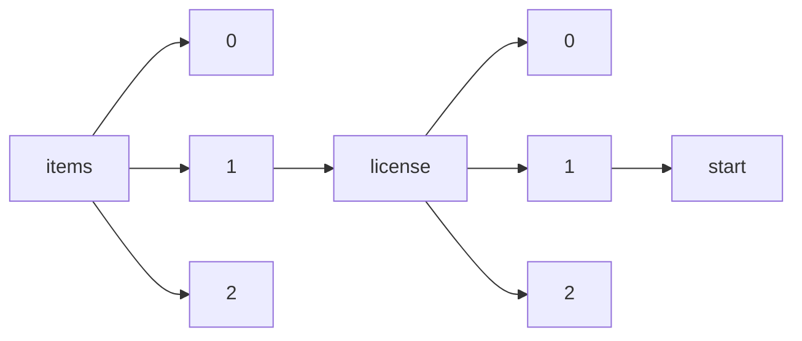

!!! warning "This document is not official Crossref documentation"
# Start
PATH = items/array/license/array/start(1)  
Occurs 81 861 544 times  
{ .annotate }

1. A route to an element, for example:  
   The route "items/array/license/array/start" corresponds to navigating through the JSON indices as  
   ["items"][0]["license"][0]["start"]  

## Date-parts
See more information: [items/array/license/array/start/date-parts](date-parts/index.md)  
Occurs 81 861 544 timess  

| **Row** | **Length** `Any` | **Count** `Int64` |
|--------:|--------------------:|---------------------:|
| **1**   | 1                   | 81 861 544           |

## Date-time
See more information: [items/array/license/array/start/date-time](date-time/index.md)  
Occurs 81 861 544 timess  
Unique values: > 999  

!!! note "Due to current limitations, only the first 1,000 unique values are counted."

| **Row** | **Value** `String` | **Count** `Int64` |
|--------:|----------------------:|---------------------:|
| **1**   | 2015-09-01T00:00:00Z  | 6 497 305            |
| **2**   | 2022-01-01T00:00:00Z  | 1 264 672            |
| **3**   | 2021-01-01T00:00:00Z  | 1 018 181            |
| **4**   | 2020-01-01T00:00:00Z  | 879 127              |
| **5**   | 2023-01-01T00:00:00Z  | 639 533              |
| **6**   | 2019-01-01T00:00:00Z  | 604 746              |
| **7**   | 2016-01-01T00:00:00Z  | 520 944              |
| **8**   | 2018-01-01T00:00:00Z  | 508 570              |
| **9**   | 2015-01-01T00:00:00Z  | 506 908              |
| **10**  | 2017-01-01T00:00:00Z  | 494 471              |
| ... | ... | ... |

## Timestamp
See more information: [items/array/license/array/start/timestamp](timestamp/index.md)  
Occurs 81 861 544 timess  
Unique values: > 999  

!!! note "Due to current limitations, only the first 1,000 unique values are counted."

| **Row** | **Value** `Int64` | **Count** `Int64` |
|--------:|---------------------:|---------------------:|
| **1**   | 1 441 065 600 000    | 6 497 344            |
| **2**   | 1 640 995 200 000    | 1 264 621            |
| **3**   | 1 609 459 200 000    | 1 018 688            |
| **4**   | 1 577 836 800 000    | 879 091              |
| **5**   | 1 672 531 200 000    | 639 710              |
| **6**   | 1 546 300 800 000    | 604 810              |
| **7**   | 1 451 606 400 000    | 520 988              |
| **8**   | 1 514 764 800 000    | 508 469              |
| **9**   | 1 420 070 400 000    | 506 798              |
| **10**  | 1 483 228 800 000    | 494 553              |
| ... | ... | ... |

