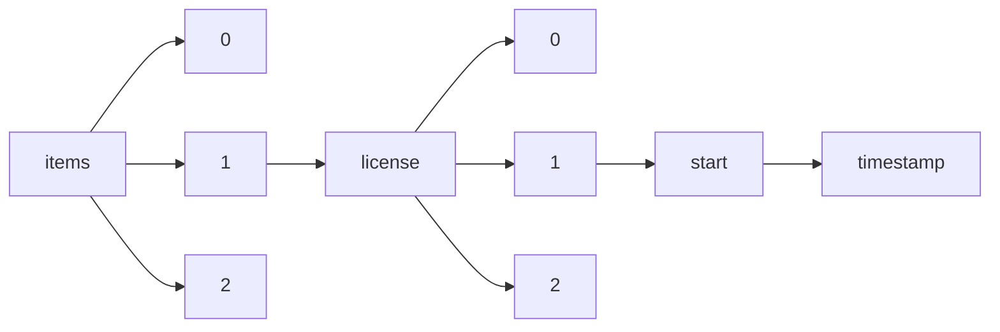

!!! warning "This document is not official Crossref documentation"
# Timestamp
PATH = items/array/license/array/start/timestamp(1)  
Occurs 81 861 544 times  
Unique values: > 999  
{ .annotate }

1. A route to an element, for example:  
   The route "items/array/license/array/start/timestamp" corresponds to navigating through the JSON indices as  
   ["items"][0]["license"][0]["start"]["timestamp"]  

!!! note "Due to current limitations, only the first 1,000 unique values are counted."

| **Row** | **Value** `Int64` | **Count** `Int64` |
|--------:|---------------------:|---------------------:|
| **1**   | 1 441 065 600 000    | 6 497 344            |
| **2**   | 1 640 995 200 000    | 1 264 621            |
| **3**   | 1 609 459 200 000    | 1 018 688            |
| **4**   | 1 577 836 800 000    | 879 091              |
| **5**   | 1 672 531 200 000    | 639 710              |
| **6**   | 1 546 300 800 000    | 604 810              |
| **7**   | 1 451 606 400 000    | 520 988              |
| **8**   | 1 514 764 800 000    | 508 469              |
| **9**   | 1 420 070 400 000    | 506 798              |
| **10**  | 1 483 228 800 000    | 494 553              |
| **11**  | 1 388 534 400 000    | 418 228              |
| **12**  | 1 669 852 800 000    | 378 546              |
| **13**  | 1 356 998 400 000    | 378 470              |
| **14**  | 1 638 316 800 000    | 326 099              |
| **15**  | 1 677 628 800 000    | 320 473              |
| **16**  | 1 325 376 000 000    | 306 868              |
| **17**  | 1 293 840 000 000    | 304 806              |
| **18**  | 1 633 046 400 000    | 300 415              |
| **19**  | 1 667 260 800 000    | 294 032              |
| **20**  | 1 635 724 800 000    | 293 773              |
| **21**  | 1 661 990 400 000    | 289 253              |
| **22**  | 1 630 454 400 000    | 286 929              |
| **23**  | 1 664 582 400 000    | 284 747              |
| **24**  | 1 675 209 600 000    | 280 826              |
| **25**  | 1 654 041 600 000    | 261 534              |
| **26**  | 1 646 092 800 000    | 256 822              |
| **27**  | 1 622 505 600 000    | 253 848              |
| **28**  | 1 643 673 600 000    | 253 293              |
| **29**  | 1 659 312 000 000    | 242 813              |
| **30**  | 1 625 097 600 000    | 240 596              |
| **31**  | 1 648 771 200 000    | 234 937              |
| **32**  | 1 619 827 200 000    | 233 031              |
| **33**  | 1 651 363 200 000    | 232 628              |
| **34**  | 1 656 633 600 000    | 228 156              |
| **35**  | 1 627 776 000 000    | 224 354              |
| **36**  | 1 569 888 000 000    | 217 453              |
| **37**  | 1 230 768 000 000    | 212 456              |
| **38**  | 1 617 235 200 000    | 208 705              |
| **39**  | 1 262 304 000 000    | 204 962              |
| **40**  | 1 374 019 200 000    | 204 171              |
| **41**  | 1 199 145 600 000    | 203 600              |
| **42**  | 1 167 609 600 000    | 200 784              |
| **43**  | 1 614 556 800 000    | 197 882              |
| **44**  | 1 561 939 200 000    | 193 829              |
| **45**  | 1 575 158 400 000    | 192 913              |
| **46**  | 1 572 566 400 000    | 189 001              |
| **47**  | 1 606 780 800 000    | 186 164              |
| **48**  | 1 567 296 000 000    | 180 370              |
| **49**  | 1 559 347 200 000    | 177 792              |
| **50**  | 1 680 307 200 000    | 176 778              |
| **51**  | 1 590 969 600 000    | 167 158              |
| **52**  | 1 136 073 600 000    | 167 092              |
| **53**  | 1 556 668 800 000    | 165 853              |
| **54**  | 1 601 510 400 000    | 163 348              |
| **55**  | 1 598 918 400 000    | 161 769              |
| **56**  | 1 604 188 800 000    | 158 057              |
| **57**  | 1 554 076 800 000    | 156 142              |
| **58**  | 1 551 398 400 000    | 153 307              |
| **59**  | 1 593 561 600 000    | 151 378              |
| **60**  | 1 583 020 800 000    | 147 061              |
| **61**  | 1 588 291 200 000    | 144 896              |
| **62**  | 1 585 699 200 000    | 144 770              |
| **63**  | 1 373 932 800 000    | 144 144              |
| **64**  | 1 612 137 600 000    | 141 893              |
| **65**  | 1 104 537 600 000    | 137 477              |
| **66**  | 1 564 617 600 000    | 134 956              |
| **67**  | 946 684 800 000      | 130 337              |
| **68**  | 978 307 200 000      | 127 526              |
| **69**  | 662 688 000 000      | 126 411              |
| **70**  | 1 072 915 200 000    | 124 224              |
| **71**  | 1 580 515 200 000    | 124 121              |
| **72**  | 1 596 240 000 000    | 123 482              |
| **73**  | 1 682 899 200 000    | 120 418              |
| **74**  | 631 152 000 000      | 119 375              |
| **75**  | 1 041 379 200 000    | 117 365              |
| **76**  | 1 009 843 200 000    | 116 404              |
| **77**  | 820 454 400 000      | 115 775              |
| **78**  | 599 616 000 000      | 113 318              |
| **79**  | 1 548 979 200 000    | 113 161              |
| **80**  | 788 918 400 000      | 112 484              |
| **81**  | 536 457 600 000      | 112 078              |
| **82**  | 725 846 400 000      | 111 850              |
| **83**  | 883 612 800 000      | 110 102              |
| **84**  | 694 224 000 000      | 109 351              |
| **85**  | 567 993 600 000      | 108 483              |
| **86**  | 1 538 352 000 000    | 107 954              |
| **87**  | 852 076 800 000      | 107 486              |
| **88**  | 757 382 400 000      | 107 462              |
| **89**  | 915 148 800 000      | 105 485              |
| **90**  | 1 522 540 800 000    | 105 198              |
| **91**  | 1 543 622 400 000    | 105 095              |
| **92**  | 1 535 760 000 000    | 101 374              |
| **93**  | 1 472 688 000 000    | 100 057              |
| **94**  | 1 504 224 000 000    | 100 038              |
| **95**  | 1 506 816 000 000    | 99 632               |
| **96**  | 1 512 086 400 000    | 97 035               |
| **97**  | 1 519 862 400 000    | 96 875               |
| **98**  | 504 921 600 000      | 96 679               |
| **99**  | 1 527 811 200 000    | 96 070               |
| **100** | 1 541 030 400 000    | 94 286               |
| **101** | 473 385 600 000      | 94 193               |
| **102** | 1 427 846 400 000    | 93 206               |
| **103** | 1 530 403 200 000    | 91 800               |
| **104** | 1 475 280 000 000    | 90 107               |
| **105** | 1 448 928 000 000    | 89 546               |
| **106** | 1 509 494 400 000    | 89 443               |
| **107** | 1 488 326 400 000    | 88 788               |
| **108** | 441 763 200 000      | 88 574               |
| **109** | 1 338 854 400 000    | 88 435               |
| **110** | 1 477 958 400 000    | 87 420               |
| **111** | 1 459 468 800 000    | 87 366               |
| **112** | 1 480 550 400 000    | 86 007               |
| **113** | 1 496 275 200 000    | 85 317               |
| **114** | 410 227 200 000      | 84 967               |
| **115** | 1 498 867 200 000    | 84 909               |
| **116** | 1 491 004 800 000    | 84 747               |
| **117** | 1 685 577 600 000    | 83 406               |
| **118** | 1 364 774 400 000    | 82 284               |
| **119** | 1 333 238 400 000    | 82 026               |
| **120** | 1 517 443 200 000    | 81 907               |
| **121** | 1 525 132 800 000    | 81 859               |
| **122** | 1 241 136 000 000    | 81 773               |
| **123** | 1 493 596 800 000    | 80 481               |
| **124** | 1 446 336 000 000    | 80 322               |
| **125** | 1 396 310 400 000    | 80 096               |
| **126** | 1 409 529 600 000    | 79 996               |
| **127** | 1 464 739 200 000    | 78 710               |
| **128** | 378 691 200 000      | 78 608               |
| **129** | 1 443 657 600 000    | 78 592               |
| **130** | 1 533 081 600 000    | 77 891               |
| **131** | 1 485 907 200 000    | 77 845               |
| **132** | 1 456 790 400 000    | 77 624               |
| **133** | 1 270 080 000 000    | 76 025               |
| **134** | 1 412 121 600 000    | 76 008               |
| **135** | 1 238 544 000 000    | 75 811               |
| **136** | 1 414 800 000 000    | 74 600               |
| **137** | 1 314 835 200 000    | 74 316               |
| **138** | 1 417 392 000 000    | 73 609               |
| **139** | 1 204 329 600 000    | 72 959               |
| **140** | 1 467 331 200 000    | 72 417               |
| **141** | 1 362 096 000 000    | 71 634               |
| **142** | 1 346 457 600 000    | 71 436               |
| **143** | 1 433 116 800 000    | 71 379               |
| **144** | 1 430 438 400 000    | 71 323               |
| **145** | 1 501 545 600 000    | 71 196               |
| **146** | 1 425 168 000 000    | 70 940               |
| **147** | 1 306 886 400 000    | 70 399               |
| **148** | 1 454 284 800 000    | 69 623               |
| **149** | 1 349 049 600 000    | 69 313               |
| **150** | 1 351 728 000 000    | 69 310               |
| **151** | 347 155 200 000      | 69 052               |
| **152** | 1 462 060 800 000    | 68 778               |
| **153** | 1 251 763 200 000    | 68 714               |
| **154** | 315 532 800 000      | 68 556               |
| **155** | 1 435 708 800 000    | 68 519               |
| **156** | 1 317 427 200 000    | 68 469               |
| **157** | 1 380 585 600 000    | 68 278               |
| **158** | 1 330 560 000 000    | 68 253               |
| **159** | 1 296 518 400 000    | 68 109               |
| **160** | 1 322 697 600 000    | 67 984               |
| **161** | 1 470 009 600 000    | 67 277               |
| **162** | 1 406 851 200 000    | 67 246               |
| **163** | 1 354 320 000 000    | 66 775               |
| **164** | 1 283 299 200 000    | 66 602               |
| **165** | 1 254 355 200 000    | 66 422               |
| **166** | 1 367 366 400 000    | 66 243               |
| **167** | 1 301 616 000 000    | 65 979               |
| **168** | 1 338 508 800 000    | 65 483               |
| **169** | 1 653 609 600 000    | 65 383               |
| **170** | 1 298 937 600 000    | 65 367               |
| **171** | 1 175 385 600 000    | 65 203               |
| **172** | 1 304 208 000 000    | 64 707               |
| **173** | 1 335 830 400 000    | 64 674               |
| **174** | 283 996 800 000      | 64 613               |
| **175** | 1 243 814 400 000    | 64 597               |
| **176** | 1 285 891 200 000    | 64 185               |
| **177** | 1 341 100 800 000    | 64 091               |
| **178** | 1 359 676 800 000    | 63 965               |
| **179** | 1 220 227 200 000    | 63 507               |
| **180** | 1 291 161 600 000    | 63 190               |
| **181** | 1 309 478 400 000    | 63 021               |
| **182** | 1 275 350 400 000    | 62 845               |
| **183** | 1 288 569 600 000    | 62 639               |
| **184** | 1 267 401 600 000    | 62 238               |
| **185** | 1 377 993 600 000    | 61 980               |
| **186** | 1 370 044 800 000    | 61 795               |
| **187** | 1 222 819 200 000    | 61 777               |
| **188** | 1 328 054 400 000    | 60 648               |
| **189** | 252 460 800 000      | 60 199               |
| **190** | 1 207 008 000 000    | 59 933               |
| **191** | 1 320 105 600 000    | 59 879               |
| **192** | 1 259 625 600 000    | 59 816               |
| **193** | 1 383 264 000 000    | 59 649               |
| **194** | 1 141 171 200 000    | 59 611               |
| **195** | 1 398 902 400 000    | 58 992               |
| **196** | 1 214 870 400 000    | 58 801               |
| **197** | 1 172 707 200 000    | 58 695               |
| **198** | 1 188 604 800 000    | 58 561               |
| **199** | 1 212 278 400 000    | 58 363               |
| **200** | 1 164 931 200 000    | 58 299               |
| **201** | 1 246 406 400 000    | 58 255               |
| **202** | 220 924 800 000      | 58 244               |
| **203** | 1 372 636 800 000    | 57 866               |
| **204** | 1 272 672 000 000    | 57 709               |
| **205** | 1 235 865 600 000    | 57 474               |
| **206** | 1 404 172 800 000    | 57 204               |
| **207** | 1 422 748 800 000    | 57 166               |
| **208** | 1 180 656 000 000    | 56 816               |
| **209** | 1 157 068 800 000    | 56 781               |
| **210** | 1 277 942 400 000    | 56 327               |
| **211** | 1 385 856 000 000    | 56 143               |
| **212** | 1 438 387 200 000    | 55 145               |
| **213** | 1 312 156 800 000    | 54 880               |
| **214** | 1 264 982 400 000    | 54 807               |
| **215** | 1 393 632 000 000    | 54 547               |
| **216** | 1 343 779 200 000    | 54 319               |
| **217** | 1 125 532 800 000    | 53 872               |
| **218** | 189 302 400 000      | 53 610               |
| **219** | 1 257 033 600 000    | 53 242               |
| **220** | 1 280 620 800 000    | 53 212               |
| **221** | 1 377 129 600 000    | 53 144               |
| **222** | 1 233 446 400 000    | 52 995               |
| **223** | 1 209 600 000 000    | 52 906               |
| **224** | 1 162 339 200 000    | 52 623               |
| **225** | 1 228 089 600 000    | 52 546               |
| **226** | 1 159 660 800 000    | 52 397               |
| **227** | 1 225 497 600 000    | 52 246               |
| **228** | 1 109 635 200 000    | 52 122               |
| **229** | 1 149 120 000 000    | 51 796               |
| **230** | 1 191 196 800 000    | 51 634               |
| **231** | 1 143 849 600 000    | 51 511               |
| **232** | 1 217 548 800 000    | 50 929               |
| **233** | 1 177 977 600 000    | 50 925               |
| **234** | 1 133 395 200 000    | 50 555               |
| **235** | 1 401 580 800 000    | 50 555               |
| **236** | 1 093 996 800 000    | 50 499               |
| **237** | 1 196 467 200 000    | 50 483               |
| **238** | 1 249 084 800 000    | 50 365               |
| **239** | 1 117 584 000 000    | 50 336               |
| **240** | 1 151 712 000 000    | 50 089               |
| **241** | 1 146 441 600 000    | 50 048               |
| **242** | 1 201 824 000 000    | 49 670               |
| **243** | 1 128 124 800 000    | 48 839               |
| **244** | 1 170 288 000 000    | 48 792               |
| **245** | 1 112 313 600 000    | 48 443               |
| **246** | 986 083 200 000      | 48 105               |
| **247** | 1 391 212 800 000    | 48 077               |
| **248** | 1 193 875 200 000    | 47 539               |
| **249** | 1 375 315 200 000    | 47 427               |
| **250** | 1 078 099 200 000    | 47 399               |
| **251** | 1 183 248 000 000    | 46 515               |
| **252** | 1 014 940 800 000    | 46 396               |
| **253** | 1 083 369 600 000    | 46 059               |
| **254** | 1 101 859 200 000    | 46 059               |
| **255** | 1 138 752 000 000    | 46 010               |
| **256** | 954 547 200 000      | 45 701               |
| **257** | 1 114 905 600 000    | 45 670               |
| **258** | 1 080 777 600 000    | 45 548               |
| **259** | 1 062 374 400 000    | 45 508               |
| **260** | 1 154 390 400 000    | 45 122               |
| **261** | 1 120 176 000 000    | 44 652               |
| **262** | 1 046 476 800 000    | 44 486               |
| **263** | 983 404 800 000      | 44 383               |
| **264** | 1 680 134 400 000    | 44 250               |
| **265** | 1 007 164 800 000    | 44 224               |
| **266** | 967 766 400 000      | 44 176               |
| **267** | 951 868 800 000      | 44 026               |
| **268** | 991 353 600 000      | 43 913               |
| **269** | 157 766 400 000      | 43 875               |
| **270** | 1 185 926 400 000    | 43 830               |
| **271** | 873 072 000 000      | 43 697               |
| **272** | 0                    | 43 438               |
| **273** | 1 070 236 800 000    | 42 988               |
| **274** | 962 409 600 000      | 42 937               |
| **275** | 1 096 588 800 000    | 42 751               |
| **276** | 1 130 803 200 000    | 42 693               |
| **277** | 1 086 048 000 000    | 42 691               |
| **278** | 936 144 000 000      | 42 608               |
| **279** | 959 817 600 000      | 42 605               |
| **280** | 888 710 400 000      | 42 582               |
| **281** | 999 302 400 000      | 42 563               |
| **282** | 920 246 400 000      | 42 472               |
| **283** | 904 608 000 000      | 42 380               |
| **284** | 833 587 200 000      | 42 109               |
| **285** | 1 107 216 000 000    | 42 029               |
| **286** | 94 694 400 000       | 41 910               |
| **287** | 975 628 800 000      | 41 425               |
| **288** | 1 122 854 400 000    | 41 226               |
| **289** | 891 388 800 000      | 41 221               |
| **290** | 928 195 200 000      | 41 074               |
| **291** | 880 934 400 000      | 41 045               |
| **292** | 1 038 700 800 000    | 41 002               |
| **293** | 126 230 400 000      | 40 991               |
| **294** | 857 174 400 000      | 40 923               |
| **295** | 1 099 267 200 000    | 40 760               |
| **296** | 896 659 200 000      | 40 512               |
| **297** | 1 091 318 400 000    | 40 408               |
| **298** | 1 088 640 000 000    | 40 331               |
| **299** | 1 017 619 200 000    | 40 298               |
| **300** | 1 064 966 400 000    | 40 220               |
| **301** | 944 006 400 000      | 40 195               |
| **302** | 1 049 155 200 000    | 40 134               |
| **303** | 841 536 000 000      | 40 029               |
| **304** | 1 051 747 200 000    | 39 975               |
| **305** | 63 072 000 000       | 39 955               |
| **306** | 957 139 200 000      | 39 845               |
| **307** | 1 020 211 200 000    | 39 571               |
| **308** | 1 075 593 600 000    | 39 535               |
| **309** | 825 638 400 000      | 39 366               |
| **310** | 1 054 425 600 000    | 39 344               |
| **311** | 862 444 800 000      | 39 324               |
| **312** | 809 913 600 000      | 39 267               |
| **313** | 865 123 200 000      | 39 261               |
| **314** | 912 470 400 000      | 38 841               |
| **315** | 922 924 800 000      | 38 578               |
| **316** | 1 030 838 400 000    | 38 568               |
| **317** | 794 016 000 000      | 38 539               |
| **318** | 1 022 889 600 000    | 38 339               |
| **319** | 925 516 800 000      | 38 245               |
| **320** | 849 398 400 000      | 38 219               |
| **321** | 817 776 000 000      | 37 748               |
| **322** | 867 715 200 000      | 37 453               |
| **323** | 1 004 572 800 000    | 37 343               |
| **324** | 993 945 600 000      | 37 215               |
| **325** | 31 536 000 000       | 37 102               |
| **326** | 988 675 200 000      | 36 948               |
| **327** | 930 787 200 000      | 36 829               |
| **328** | 893 980 800 000      | 36 693               |
| **329** | 796 694 400 000      | 36 673               |
| **330** | 836 179 200 000      | 36 668               |
| **331** | 801 964 800 000      | 36 342               |
| **332** | 899 251 200 000      | 36 333               |
| **333** | 828 316 800 000      | 36 132               |
| **334** | 1 059 696 000 000    | 35 805               |
| **335** | 1 033 430 400 000    | 35 675               |
| **336** | 1 001 894 400 000    | 35 653               |
| **337** | 1 057 017 600 000    | 35 221               |
| **338** | 859 852 800 000      | 35 167               |
| **339** | 875 664 000 000      | 35 042               |
| **340** | 1 044 057 600 000    | 34 609               |
| **341** | 907 200 000 000      | 34 381               |
| **342** | 886 291 200 000      | 34 284               |
| **343** | 970 358 400 000      | 34 218               |
| **344** | 973 036 800 000      | 34 053               |
| **345** | 1 542 672 000 000    | 33 983               |
| **346** | 812 505 600 000      | 33 975               |
| **347** | 844 128 000 000      | 33 948               |
| **348** | 938 736 000 000      | 33 624               |
| **349** | 804 556 800 000      | 33 621               |
| **350** | 1 067 644 800 000    | 33 593               |
| **351** | 854 755 200 000      | 33 405               |
| **352** | 786 240 000 000      | 33 378               |
| **353** | 1 036 108 800 000    | 33 362               |
| **354** | 830 908 800 000      | 33 183               |
| **355** | 870 393 600 000      | 32 956               |
| **356** | 778 377 600 000      | 32 862               |
| **357** | 909 878 400 000      | 32 784               |
| **358** | -31 536 000 000      | 32 685               |
| **359** | 1 514 851 200 000    | 32 509               |
| **360** | 980 985 600 000      | 32 333               |
| **361** | 770 428 800 000      | 32 181               |
| **362** | 846 806 400 000      | 32 146               |
| **363** | 949 363 200 000      | 31 822               |
| **364** | -94 694 400 000      | 31 772               |
| **365** | 878 342 400 000      | 31 657               |
| **366** | 762 480 000 000      | 31 651               |
| **367** | 1 012 521 600 000    | 31 646               |
| **368** | 901 929 600 000      | 31 610               |
| **369** | -63 158 400 000      | 31 536               |
| **370** | 941 414 400 000      | 31 397               |
| **371** | 1 025 481 600 000    | 31 178               |
| **372** | 996 624 000 000      | 30 821               |
| **373** | 715 305 600 000      | 30 785               |
| **374** | 917 827 200 000      | 30 703               |
| **375** | 799 286 400 000      | 30 565               |
| **376** | 1 028 160 000 000    | 30 358               |
| **377** | 815 184 000 000      | 30 344               |
| **378** | 933 465 600 000      | 30 328               |
| **379** | -126 230 400 000     | 30 087               |
| **380** | 965 088 000 000      | 29 887               |
| **381** | 838 857 600 000      | 29 614               |
| **382** | 699 408 000 000      | 29 515               |
| **383** | 791 596 800 000      | 29 264               |
| **384** | 730 944 000 000      | 29 237               |
| **385** | 754 704 000 000      | 29 070               |
| **386** | 738 892 800 000      | 28 847               |
| **387** | 823 132 800 000      | 28 840               |
| **388** | -157 766 400 000     | 27 571               |
| **389** | 807 235 200 000      | 27 308               |
| **390** | 1 253 577 600 000    | 27 055               |
| **391** | 741 484 800 000      | 26 918               |
| **392** | 767 750 400 000      | 26 686               |
| **393** | 683 683 200 000      | 26 524               |
| **394** | 746 841 600 000      | 26 354               |
| **395** | 733 622 400 000      | 25 919               |
| **396** | 1 688 169 600 000    | 25 527               |
| **397** | 765 158 400 000      | 25 385               |
| **398** | 773 020 800 000      | 25 329               |
| **399** | -189 388 800 000     | 25 080               |
| **400** | 749 433 600 000      | 24 864               |
| **401** | 780 969 600 000      | 24 654               |
| **402** | 723 168 000 000      | 24 410               |
| **403** | -220 924 800 000     | 24 404               |
| **404** | 1 512 345 600 000    | 24 191               |
| **405** | 709 948 800 000      | 24 189               |
| **406** | 691 545 600 000      | 23 945               |
| **407** | 1 412 467 200 000    | 23 937               |
| **408** | 1 603 411 200 000    | 23 669               |
| **409** | 667 785 600 000      | 23 437               |
| **410** | 678 326 400 000      | 23 169               |
| **411** | 1 256 601 600 000    | 22 899               |
| **412** | 1 268 784 000 000    | 22 786               |
| **413** | 1 680 220 800 000    | 22 384               |
| **414** | 652 147 200 000      | 22 382               |
| **415** | 596 937 600 000      | 22 355               |
| **416** | 717 897 600 000      | 22 232               |
| **417** | 707 356 800 000      | 22 123               |
| **418** | 702 086 400 000      | 22 100               |
| **419** | 1 603 843 200 000    | 22 042               |
| **420** | 1 656 547 200 000    | 22 041               |
| **421** | 1 449 014 400 000    | 21 908               |
| **422** | 628 473 600 000      | 21 766               |
| **423** | 1 484 870 400 000    | 21 732               |
| **424** | 1 592 438 400 000    | 21 731               |
| **425** | 1 603 756 800 000    | 21 694               |
| **426** | 760 060 800 000      | 21 653               |
| **427** | 660 009 600 000      | 21 628               |
| **428** | 704 678 400 000      | 21 436               |
| **429** | 1 640 908 800 000    | 21 289               |
| **430** | 557 452 800 000      | 21 284               |
| **431** | 1 606 089 600 000    | 21 214               |
| **432** | 604 713 600 000      | 20 985               |
| **433** | 1 604 016 000 000    | 20 821               |
| **434** | 1 586 995 200 000    | 20 740               |
| **435** | 744 163 200 000      | 20 699               |
| **436** | 1 575 676 800 000    | 20 682               |
| **437** | 533 779 200 000      | 20 640               |
| **438** | 783 648 000 000      | 20 597               |
| **439** | 589 075 200 000      | 20 582               |
| **440** | 775 699 200 000      | 20 514               |
| **441** | 736 214 400 000      | 20 441               |
| **442** | 675 734 400 000      | 20 396               |
| **443** | 620 611 200 000      | 20 213               |
| **444** | 728 524 800 000      | 20 116               |
| **445** | 1 625 011 200 000    | 20 034               |
| **446** | 636 249 600 000      | 20 017               |
| **447** | 1 601 424 000 000    | 19 942               |
| **448** | 549 504 000 000      | 19 928               |
| **449** | 565 315 200 000      | 19 765               |
| **450** | 673 056 000 000      | 19 760               |
| **451** | 1 608 076 800 000    | 19 722               |
| **452** | 1 603 152 000 000    | 19 639               |
| **453** | 646 790 400 000      | 19 636               |
| **454** | 612 662 400 000      | 19 391               |
| **455** | 1 672 444 800 000    | 19 193               |
| **456** | 1 609 372 800 000    | 19 055               |
| **457** | 720 576 000 000      | 18 909               |
| **458** | 752 112 000 000      | 18 854               |
| **459** | 573 177 600 000      | 18 709               |
| **460** | 541 555 200 000      | 18 640               |
| **461** | 696 902 400 000      | 18 548               |
| **462** | 1 577 750 400 000    | 18 484               |
| **463** | 670 464 000 000      | 18 449               |
| **464** | 644 198 400 000      | 18 281               |
| **465** | 1 518 998 400 000    | 18 277               |
| **466** | 581 126 400 000      | 17 896               |
| **467** | 641 520 000 000      | 17 867               |
| **468** | 615 254 400 000      | 17 752               |
| **469** | 665 366 400 000      | 17 739               |
| **470** | 1 634 860 800 000    | 17 726               |
| **471** | 502 243 200 000      | 17 702               |
| **472** | 686 275 200 000      | 17 575               |
| **473** | 607 392 000 000      | 17 448               |
| **474** | 1 634 083 200 000    | 17 302               |
| **475** | 688 953 600 000      | 17 222               |
| **476** | 510 019 200 000      | 17 212               |
| **477** | 638 928 000 000      | 17 195               |
| **478** | 623 203 200 000      | 17 151               |
| **479** | 1 374 105 600 000    | 17 140               |
| **480** | 654 739 200 000      | 16 930               |
| **481** | 1 603 238 400 000    | 16 874               |
| **482** | 1 632 700 800 000    | 16 838               |
| **483** | 1 639 526 400 000    | 16 794               |
| **484** | 439 084 800 000      | 16 717               |
| **485** | 494 380 800 000      | 16 563               |
| **486** | 1 604 620 800 000    | 16 522               |
| **487** | 470 707 200 000      | 16 380               |
| **488** | 1 607 558 400 000    | 16 354               |
| **489** | 649 468 800 000      | 16 325               |
| **490** | 552 096 000 000      | 16 278               |
| **491** | 525 916 800 000      | 16 202               |
| **492** | 407 548 800 000      | 16 158               |
| **493** | 1 664 496 000 000    | 16 155               |
| **494** | 1 602 806 400 000    | 16 153               |
| **495** | 712 627 200 000      | 16 139               |
| **496** | 625 881 600 000      | 16 085               |
| **497** | 1 604 448 000 000    | 16 079               |
| **498** | 1 138 406 400 000    | 16 052               |
| **499** | 1 602 633 600 000    | 15 957               |
| **500** | 1 639 699 200 000    | 15 950               |
| **501** | 1 606 867 200 000    | 15 903               |
| **502** | 609 984 000 000      | 15 799               |
| **503** | 478 483 200 000      | 15 793               |
| **504** | 657 417 600 000      | 15 766               |
| **505** | 591 667 200 000      | 15 762               |
| **506** | 1 482 451 200 000    | 15 679               |
| **507** | 517 968 000 000      | 15 610               |
| **508** | 454 896 000 000      | 15 555               |
| **509** | 1 601 856 000 000    | 15 489               |
| **510** | 462 844 800 000      | 15 293               |
| **511** | 1 569 801 600 000    | 15 287               |
| **512** | 415 324 800 000      | 15 270               |
| **513** | 633 830 400 000      | 15 241               |
| **514** | 512 697 600 000      | 15 228               |
| **515** | 376 012 800 000      | 15 185               |
| **516** | 486 432 000 000      | 15 178               |
| **517** | 1 300 147 200 000    | 15 120               |
| **518** | 446 947 200 000      | 15 102               |
| **519** | 1 653 350 400 000    | 15 062               |
| **520** | 431 222 400 000      | 15 031               |
| **521** | 1 380 758 400 000    | 14 994               |
| **522** | 583 718 400 000      | 14 847               |
| **523** | 544 233 600 000      | 14 805               |
| **524** | 1 401 926 400 000    | 14 791               |
| **525** | 383 788 800 000      | 14 752               |
| **526** | 575 856 000 000      | 14 638               |
| **527** | 578 448 000 000      | 14 602               |
| **528** | 344 476 800 000      | 14 504               |
| **529** | 312 854 400 000      | 14 419               |
| **530** | 560 044 800 000      | 14 395               |
| **531** | 1 634 601 600 000    | 14 357               |
| **532** | 507 600 000 000      | 14 229               |
| **533** | 1 587 081 600 000    | 14 226               |
| **534** | 399 686 400 000      | 14 202               |
| **535** | 1 593 475 200 000    | 14 201               |
| **536** | 570 672 000 000      | 14 176               |
| **537** | -252 460 800 000     | 14 137               |
| **538** | 496 972 800 000      | 14 120               |
| **539** | 602 294 400 000      | 14 083               |
| **540** | 1 587 168 000 000    | 14 068               |
| **541** | 681 004 800 000      | 14 053               |
| **542** | 539 136 000 000      | 13 978               |
| **543** | 1 607 644 800 000    | 13 976               |
| **544** | 1 338 422 400 000    | 13 896               |
| **545** | 528 508 800 000      | 13 645               |
| **546** | 1 605 571 200 000    | 13 570               |
| **547** | 1 602 201 600 000    | 13 548               |
| **548** | 1 634 688 000 000    | 13 502               |
| **549** | 1 632 960 000 000    | 13 475               |
| **550** | 1 621 814 400 000    | 13 454               |
| **551** | 520 560 000 000      | 13 393               |
| **552** | 1 607 990 400 000    | 13 371               |
| **553** | 1 653 264 000 000    | 13 331               |
| **554** | 1 622 160 000 000    | 13 294               |
| **555** | 1 631 664 000 000    | 13 289               |
| **556** | 617 932 800 000      | 13 256               |
| **557** | 1 671 062 400 000    | 13 240               |
| **558** | 1 355 356 800 000    | 13 212               |
| **559** | 546 825 600 000      | 13 198               |
| **560** | 1 351 209 600 000    | 13 184               |
| **561** | 1 635 465 600 000    | 13 156               |
| **562** | 1 669 766 400 000    | 13 120               |
| **563** | 1 623 974 400 000    | 13 023               |
| **564** | 1 602 720 000 000    | 13 014               |
| **565** | 1 433 462 400 000    | 12 987               |
| **566** | 1 671 494 400 000    | 12 904               |
| **567** | 1 607 904 000 000    | 12 898               |
| **568** | 1 624 924 800 000    | 12 778               |
| **569** | 1 602 547 200 000    | 12 774               |
| **570** | 1 624 838 400 000    | 12 668               |
| **571** | 1 665 964 800 000    | 12 643               |
| **572** | 489 024 000 000      | 12 620               |
| **573** | 1 278 374 400 000    | 12 595               |
| **574** | 1 374 451 200 000    | 12 505               |
| **575** | 1 248 739 200 000    | 12 343               |
| **576** | 1 650 844 800 000    | 12 340               |
| **577** | 1 653 955 200 000    | 12 246               |
| **578** | 531 187 200 000      | 12 139               |
| **579** | 1 317 945 600 000    | 12 124               |
| **580** | 1 600 646 400 000    | 12 069               |
| **581** | 1 608 249 600 000    | 12 004               |
| **582** | 1 298 246 400 000    | 11 991               |
| **583** | 586 396 800 000      | 11 986               |
| **584** | 1 601 337 600 000    | 11 979               |
| **585** | 1 330 905 600 000    | 11 971               |
| **586** | 1 619 740 800 000    | 11 958               |
| **587** | 1 652 400 000 000    | 11 946               |
| **588** | 1 624 233 600 000    | 11 915               |
| **589** | 1 621 555 200 000    | 11 876               |
| **590** | 1 315 353 600 000    | 11 866               |
| **591** | 1 663 200 000 000    | 11 855               |
| **592** | 1 604 880 000 000    | 11 790               |
| **593** | 1 638 230 400 000    | 11 716               |
| **594** | 1 261 612 800 000    | 11 673               |
| **595** | 1 411 948 800 000    | 11 619               |
| **596** | 1 601 251 200 000    | 11 617               |
| **597** | 1 605 484 800 000    | 11 603               |
| **598** | 562 723 200 000      | 11 603               |
| **599** | 1 587 340 800 000    | 11 538               |
| **600** | 1 638 403 200 000    | 11 535               |
| **601** | 1 604 966 400 000    | 11 469               |
| **602** | 1 637 280 000 000    | 11 391               |
| **603** | 1 657 152 000 000    | 11 372               |
| **604** | 1 616 544 000 000    | 11 324               |
| **605** | 1 367 712 000 000    | 11 216               |
| **606** | 1 670 198 400 000    | 11 198               |
| **607** | 1 669 593 600 000    | 11 161               |
| **608** | 1 669 680 000 000    | 11 149               |
| **609** | 1 664 409 600 000    | 11 101               |
| **610** | 1 659 052 800 000    | 11 098               |
| **611** | 1 637 107 200 000    | 10 989               |
| **612** | 1 648 684 800 000    | 10 987               |
| **613** | 1 635 379 200 000    | 10 980               |
| **614** | 1 666 224 000 000    | 10 878               |
| **615** | 1 600 992 000 000    | 10 861               |
| **616** | 1 576 800 000 000    | 10 853               |
| **617** | 1 420 156 800 000    | 10 837               |
| **618** | 1 624 579 200 000    | 10 800               |
| **619** | 1 606 176 000 000    | 10 798               |
| **620** | 368 150 400 000      | 10 798               |
| **621** | 423 273 600 000      | 10 767               |
| **622** | 1 637 020 800 000    | 10 749               |
| **623** | 1 658 102 400 000    | 10 699               |
| **624** | 515 289 600 000      | 10 664               |
| **625** | 1 668 038 400 000    | 10 643               |
| **626** | 1 573 430 400 000    | 10 617               |
| **627** | 1 625 529 600 000    | 10 533               |
| **628** | 1 646 006 400 000    | 10 529               |
| **629** | 1 643 587 200 000    | 10 512               |
| **630** | 1 602 028 800 000    | 10 478               |
| **631** | 1 575 590 400 000    | 10 475               |
| **632** | 1 280 880 000 000    | 10 467               |
| **633** | 1 675 123 200 000    | 10 463               |
| **634** | 483 753 600 000      | 10 380               |
| **635** | 1 635 120 000 000    | 10 223               |
| **636** | 1 378 252 800 000    | 10 215               |
| **637** | 1 609 977 600 000    | 10 184               |
| **638** | 1 647 216 000 000    | 10 066               |
| **639** | 1 655 856 000 000    | 10 032               |
| **640** | 1 676 505 600 000    | 10 017               |
| **641** | 1 620 950 400 000    | 9 989                |
| **642** | 1 670 457 600 000    | 9 988                |
| **643** | 1 627 603 200 000    | 9 897                |
| **644** | 1 651 104 000 000    | 9 838                |
| **645** | 1 637 193 600 000    | 9 836                |
| **646** | 1 300 838 400 000    | 9 832                |
| **647** | 1 336 953 600 000    | 9 822                |
| **648** | 1 663 891 200 000    | 9 821                |
| **649** | 1 624 320 000 000    | 9 785                |
| **650** | 1 635 206 400 000    | 9 761                |
| **651** | 1 656 374 400 000    | 9 740                |
| **652** | 1 571 616 000 000    | 9 667                |
| **653** | 1 667 347 200 000    | 9 571                |
| **654** | 1 665 360 000 000    | 9 559                |
| **655** | 1 628 812 800 000    | 9 556                |
| **656** | 1 623 628 800 000    | 9 535                |
| **657** | 1 642 032 000 000    | 9 520                |
| **658** | 1 643 241 600 000    | 9 517                |
| **659** | 1 658 448 000 000    | 9 450                |
| **660** | 457 488 000 000      | 9 445                |
| **661** | 1 673 395 200 000    | 9 442                |
| **662** | 1 615 334 400 000    | 9 429                |
| **663** | 1 621 468 800 000    | 9 427                |
| **664** | 1 632 441 600 000    | 9 412                |
| **665** | 1 632 096 000 000    | 9 407                |
| **666** | 1 625 702 400 000    | 9 398                |
| **667** | 1 652 227 200 000    | 9 390                |
| **668** | 499 651 200 000      | 9 378                |
| **669** | 1 627 257 600 000    | 9 348                |
| **670** | 476 064 000 000      | 9 330                |
| **671** | 1 616 025 600 000    | 9 296                |
| **672** | 1 601 942 400 000    | 9 283                |
| **673** | 1 605 052 800 000    | 9 255                |
| **674** | 481 161 600 000      | 9 246                |
| **675** | 1 232 064 000 000    | 9 241                |
| **676** | 1 598 572 800 000    | 9 218                |
| **677** | 1 667 174 400 000    | 9 197                |
| **678** | 1 603 670 400 000    | 9 187                |
| **679** | 391 737 600 000      | 9 169                |
| **680** | 1 661 212 800 000    | 9 168                |
| **681** | 1 360 022 400 000    | 9 149                |
| **682** | 1 627 516 800 000    | 9 120                |
| **683** | 1 623 715 200 000    | 9 063                |
| **684** | 1 659 657 600 000    | 9 045                |
| **685** | 1 617 062 400 000    | 9 040                |
| **686** | 1 627 948 800 000    | 9 029                |
| **687** | 1 622 764 800 000    | 9 024                |
| **688** | 1 633 564 800 000    | 9 023                |
| **689** | 1 618 790 400 000    | 8 998                |
| **690** | 1 517 184 000 000    | 8 953                |
| **691** | 1 621 382 400 000    | 8 938                |
| **692** | 1 671 667 200 000    | 8 918                |
| **693** | 1 665 532 800 000    | 8 913                |
| **694** | 1 312 502 400 000    | 8 911                |
| **695** | 1 676 246 400 000    | 8 869                |
| **696** | 1 623 888 000 000    | 8 869                |
| **697** | 1 606 262 400 000    | 8 865                |
| **698** | 1 623 196 800 000    | 8 850                |
| **699** | 1 600 905 600 000    | 8 826                |
| **700** | 1 602 460 800 000    | 8 826                |
| **701** | 1 629 417 600 000    | 8 786                |
| **702** | 1 679 011 200 000    | 8 781                |
| **703** | 1 574 726 400 000    | 8 779                |
| **704** | 1 598 832 000 000    | 8 777                |
| **705** | 1 675 641 600 000    | 8 727                |
| **706** | 1 646 265 600 000    | 8 707                |
| **707** | 1 675 036 800 000    | 8 700                |
| **708** | 1 377 820 800 000    | 8 696                |
| **709** | 1 674 086 400 000    | 8 681                |
| **710** | 1 626 652 800 000    | 8 627                |
| **711** | 1 394 582 400 000    | 8 614                |
| **712** | 1 631 577 600 000    | 8 591                |
| **713** | 1 640 822 400 000    | 8 588                |
| **714** | 1 662 681 600 000    | 8 586                |
| **715** | 1 664 150 400 000    | 8 578                |
| **716** | 1 629 158 400 000    | 8 573                |
| **717** | 1 642 550 400 000    | 8 550                |
| **718** | 1 661 731 200 000    | 8 503                |
| **719** | 1 591 747 200 000    | 8 497                |
| **720** | 1 630 022 400 000    | 8 495                |
| **721** | 1 604 534 400 000    | 8 492                |
| **722** | 1 645 488 000 000    | 8 402                |
| **723** | 1 663 113 600 000    | 8 388                |
| **724** | 1 628 035 200 000    | 8 387                |
| **725** | 1 617 753 600 000    | 8 373                |
| **726** | 1 621 296 000 000    | 8 332                |
| **727** | 1 567 468 800 000    | 8 322                |
| **728** | 1 646 611 200 000    | 8 320                |
| **729** | 1 560 384 000 000    | 8 316                |
| **730** | 1 611 705 600 000    | 8 281                |
| **731** | 1 309 737 600 000    | 8 277                |
| **732** | 1 632 873 600 000    | 8 264                |
| **733** | 1 606 435 200 000    | 8 260                |
| **734** | 1 596 412 800 000    | 8 240                |
| **735** | 1 657 843 200 000    | 8 234                |
| **736** | 1 620 000 000 000    | 8 226                |
| **737** | 1 610 668 800 000    | 8 206                |
| **738** | -283 996 800 000     | 8 180                |
| **739** | 1 611 100 800 000    | 8 173                |
| **740** | 1 658 707 200 000    | 8 164                |
| **741** | 1 645 401 600 000    | 8 159                |
| **742** | 1 641 772 800 000    | 8 125                |
| **743** | 1 609 286 400 000    | 8 120                |
| **744** | 1 595 203 200 000    | 8 108                |
| **745** | 1 629 244 800 000    | 8 074                |
| **746** | 1 639 008 000 000    | 8 070                |
| **747** | 1 575 936 000 000    | 7 991                |
| **748** | 1 655 683 200 000    | 7 954                |
| **749** | 1 616 976 000 000    | 7 952                |
| **750** | 1 667 520 000 000    | 7 894                |
| **751** | 1 615 766 400 000    | 7 887                |
| **752** | 1 423 094 400 000    | 7 873                |
| **753** | 1 666 137 600 000    | 7 856                |
| **754** | 1 667 952 000 000    | 7 845                |
| **755** | 1 593 993 600 000    | 7 840                |
| **756** | 1 651 622 400 000    | 7 821                |
| **757** | 1 630 972 800 000    | 7 792                |
| **758** | 1 446 681 600 000    | 7 765                |
| **759** | 1 623 110 400 000    | 7 751                |
| **760** | 1 611 273 600 000    | 7 726                |
| **761** | 1 453 852 800 000    | 7 726                |
| **762** | 1 671 408 000 000    | 7 689                |
| **763** | 1 415 145 600 000    | 7 677                |
| **764** | 1 633 996 800 000    | 7 676                |
| **765** | 1 677 110 400 000    | 7 676                |
| **766** | 1 638 144 000 000    | 7 665                |
| **767** | 1 631 059 200 000    | 7 663                |
| **768** | 1 668 556 800 000    | 7 661                |
| **769** | 1 637 798 400 000    | 7 658                |
| **770** | 1 659 916 800 000    | 7 637                |
| **771** | 1 660 867 200 000    | 7 635                |
| **772** | 1 460 419 200 000    | 7 621                |
| **773** | 1 575 417 600 000    | 7 593                |
| **774** | 1 576 195 200 000    | 7 579                |
| **775** | 1 648 166 400 000    | 7 576                |
| **776** | 1 668 988 800 000    | 7 564                |
| **777** | 1 620 259 200 000    | 7 550                |
| **778** | 1 636 675 200 000    | 7 522                |
| **779** | 1 672 963 200 000    | 7 515                |
| **780** | 554 774 400 000      | 7 490                |
| **781** | 1 661 904 000 000    | 7 488                |
| **782** | 1 644 883 200 000    | 7 486                |
| **783** | 1 643 846 400 000    | 7 485                |
| **784** | 1 666 828 800 000    | 7 471                |
| **785** | 1 672 099 200 000    | 7 471                |
| **786** | 1 610 409 600 000    | 7 424                |
| **787** | 1 663 718 400 000    | 7 414                |
| **788** | 1 670 889 600 000    | 7 381                |
| **789** | 1 620 172 800 000    | 7 377                |
| **790** | 1 630 281 600 000    | 7 342                |
| **791** | 1 630 540 800 000    | 7 339                |
| **792** | 1 612 828 800 000    | 7 324                |
| **793** | 1 604 275 200 000    | 7 306                |
| **794** | 1 598 400 000 000    | 7 276                |
| **795** | 1 628 208 000 000    | 7 273                |
| **796** | 1 656 288 000 000    | 7 265                |
| **797** | 1 575 849 600 000    | 7 242                |
| **798** | 1 623 369 600 000    | 7 241                |
| **799** | 1 599 782 400 000    | 7 233                |
| **800** | 1 626 739 200 000    | 7 229                |
| **801** | 1 588 204 800 000    | 7 221                |
| **802** | 1 615 852 800 000    | 7 221                |
| **803** | 1 647 820 800 000    | 7 193                |
| **804** | 1 673 913 600 000    | 7 180                |
| **805** | 1 615 248 000 000    | 7 148                |
| **806** | 1 671 148 800 000    | 7 146                |
| **807** | 1 588 896 000 000    | 7 133                |
| **808** | 1 330 300 800 000    | 7 118                |
| **809** | 1 449 446 400 000    | 7 084                |
| **810** | 1 622 678 400 000    | 7 064                |
| **811** | 1 662 422 400 000    | 7 038                |
| **812** | 1 677 715 200 000    | 7 038                |
| **813** | 1 559 088 000 000    | 7 013                |
| **814** | 465 436 800 000      | 7 003                |
| **815** | 1 648 598 400 000    | 6 952                |
| **816** | 1 644 192 000 000    | 6 945                |
| **817** | 1 617 148 800 000    | 6 944                |
| **818** | 1 356 566 400 000    | 6 930                |
| **819** | 1 595 894 400 000    | 6 922                |
| **820** | 1 624 492 800 000    | 6 895                |
| **821** | 1 652 313 600 000    | 6 884                |
| **822** | 1 593 129 600 000    | 6 868                |
| **823** | 1 666 742 400 000    | 6 868                |
| **824** | 1 650 499 200 000    | 6 858                |
| **825** | 1 585 526 400 000    | 6 857                |
| **826** | 1 626 220 800 000    | 6 855                |
| **827** | 1 597 622 400 000    | 6 818                |
| **828** | 1 637 539 200 000    | 6 816                |
| **829** | 1 630 627 200 000    | 6 766                |
| **830** | 1 662 336 000 000    | 6 731                |
| **831** | 1 656 028 800 000    | 6 713                |
| **832** | 1 573 603 200 000    | 6 710                |
| **833** | 1 247 184 000 000    | 6 708                |
| **834** | 1 618 272 000 000    | 6 700                |
| **835** | 1 543 190 400 000    | 6 691                |
| **836** | 1 621 641 600 000    | 6 663                |
| **837** | 1 610 064 000 000    | 6 645                |
| **838** | 1 646 352 000 000    | 6 594                |
| **839** | 1 578 873 600 000    | 6 594                |
| **840** | 1 577 923 200 000    | 6 559                |
| **841** | 1 594 684 800 000    | 6 550                |
| **842** | 1 597 881 600 000    | 6 549                |
| **843** | 1 613 347 200 000    | 6 508                |
| **844** | 1 597 190 400 000    | 6 425                |
| **845** | 1 619 136 000 000    | 6 410                |
| **846** | 1 541 376 000 000    | 6 376                |
| **847** | 1 597 276 800 000    | 6 361                |
| **848** | 1 664 323 200 000    | 6 332                |
| **849** | 1 657 238 400 000    | 6 302                |
| **850** | 1 638 835 200 000    | 6 264                |
| **851** | 1 628 726 400 000    | 6 260                |
| **852** | 1 467 763 200 000    | 6 257                |
| **853** | 1 649 721 600 000    | 6 243                |
| **854** | 1 574 035 200 000    | 6 210                |
| **855** | 1 614 211 200 000    | 6 188                |
| **856** | 1 650 585 600 000    | 6 156                |
| **857** | 1 578 960 000 000    | 6 151                |
| **858** | 1 592 524 800 000    | 6 137                |
| **859** | 1 661 472 000 000    | 6 114                |
| **860** | 1 591 574 400 000    | 6 110                |
| **861** | 1 615 420 800 000    | 6 057                |
| **862** | 1 600 300 800 000    | 5 996                |
| **863** | 1 602 374 400 000    | 5 964                |
| **864** | 1 578 528 000 000    | 5 940                |
| **865** | 1 407 715 200 000    | 5 926                |
| **866** | 1 555 286 400 000    | 5 906                |
| **867** | 1 658 361 600 000    | 5 885                |
| **868** | 1 654 128 000 000    | 5 878                |
| **869** | 1 584 921 600 000    | 5 873                |
| **870** | 1 478 131 200 000    | 5 862                |
| **871** | 1 676 073 600 000    | 5 856                |
| **872** | 1 616 457 600 000    | 5 856                |
| **873** | -315 619 200 000     | 5 854                |
| **874** | 1 644 451 200 000    | 5 841                |
| **875** | 1 673 827 200 000    | 5 814                |
| **876** | 1 636 070 400 000    | 5 798                |
| **877** | 1 655 942 400 000    | 5 790                |
| **878** | 1 595 548 800 000    | 5 747                |
| **879** | 1 641 340 800 000    | 5 736                |
| **880** | 1 620 864 000 000    | 5 704                |
| **881** | 1 344 124 800 000    | 5 699                |
| **882** | 1 639 958 400 000    | 5 699                |
| **883** | 1 375 920 000 000    | 5 677                |
| **884** | 1 296 432 000 000    | 5 674                |
| **885** | 1 664 928 000 000    | 5 669                |
| **886** | 1 638 921 600 000    | 5 647                |
| **887** | 1 612 224 000 000    | 5 631                |
| **888** | 1 595 376 000 000    | 5 614                |
| **889** | 1 672 185 600 000    | 5 607                |
| **890** | 1 666 051 200 000    | 5 603                |
| **891** | 1 263 254 400 000    | 5 596                |
| **892** | 1 651 708 800 000    | 5 579                |
| **893** | 1 621 987 200 000    | 5 579                |
| **894** | 1 617 667 200 000    | 5 577                |
| **895** | 1 652 140 800 000    | 5 567                |
| **896** | 1 301 011 200 000    | 5 555                |
| **897** | 1 629 072 000 000    | 5 547                |
| **898** | 1 595 980 800 000    | 5 543                |
| **899** | 1 675 728 000 000    | 5 449                |
| **900** | 1 626 393 600 000    | 5 433                |
| **901** | 1 610 323 200 000    | 5 423                |
| **902** | 1 572 480 000 000    | 5 422                |
| **903** | 1 612 915 200 000    | 5 391                |
| **904** | 1 557 446 400 000    | 5 361                |
| **905** | 1 652 745 600 000    | 5 336                |
| **906** | 1 657 756 800 000    | 5 336                |
| **907** | 1 641 427 200 000    | 5 297                |
| **908** | 1 573 689 600 000    | 5 292                |
| **909** | 1 568 592 000 000    | 5 275                |
| **910** | 1 573 171 200 000    | 5 253                |
| **911** | 491 702 400 000      | 5 225                |
| **912** | 1 409 875 200 000    | 5 206                |
| **913** | 1 654 560 000 000    | 5 202                |
| **914** | 1 592 352 000 000    | 5 202                |
| **915** | 1 336 176 000 000    | 5 181                |
| **916** | 1 613 606 400 000    | 5 177                |
| **917** | 1 465 084 800 000    | 5 118                |
| **918** | 1 591 142 400 000    | 5 107                |
| **919** | 1 380 931 200 000    | 5 031                |
| **920** | 1 649 289 600 000    | 5 001                |
| **921** | 1 643 068 800 000    | 4 981                |
| **922** | 1 403 049 600 000    | 4 968                |
| **923** | 1 389 830 400 000    | 4 959                |
| **924** | 1 614 902 400 000    | 4 914                |
| **925** | 1 668 470 400 000    | 4 913                |
| **926** | 1 609 632 000 000    | 4 866                |
| **927** | 1 650 931 200 000    | 4 848                |
| **928** | 1 349 395 200 000    | 4 845                |
| **929** | 1 375 660 800 000    | 4 828                |
| **930** | 1 619 654 400 000    | 4 780                |
| **931** | 1 678 233 600 000    | 4 741                |
| **932** | 1 602 892 800 000    | 4 718                |
| **933** | 1 609 545 600 000    | 4 704                |
| **934** | 1 386 892 800 000    | 4 677                |
| **935** | 1 655 164 800 000    | 4 664                |
| **936** | 1 579 564 800 000    | 4 608                |
| **937** | 1 649 808 000 000    | 4 554                |
| **938** | 1 632 787 200 000    | 4 508                |
| **939** | 1 577 404 800 000    | 4 449                |
| **940** | 1 669 248 000 000    | 4 436                |
| **941** | 1 556 582 400 000    | 4 429                |
| **942** | 1 587 513 600 000    | 4 409                |
| **943** | 1 661 299 200 000    | 4 406                |
| **944** | 1 599 091 200 000    | 4 405                |
| **945** | 1 580 688 000 000    | 4 396                |
| **946** | 1 571 356 800 000    | 4 363                |
| **947** | 1 352 678 400 000    | 4 359                |
| **948** | 1 677 801 600 000    | 4 348                |
| **949** | 1 560 816 000 000    | 4 344                |
| **950** | 1 656 892 800 000    | 4 343                |
| **951** | 1 678 924 800 000    | 4 279                |
| **952** | 1 412 726 400 000    | 4 275                |
| **953** | 1 584 057 600 000    | 4 257                |
| **954** | 1 535 414 400 000    | 4 232                |
| **955** | 1 311 724 800 000    | 4 206                |
| **956** | 1 572 220 800 000    | 4 161                |
| **957** | 1 618 531 200 000    | 4 155                |
| **958** | 1 597 968 000 000    | 4 149                |
| **959** | 1 613 692 800 000    | 4 115                |
| **960** | 281 318 400 000      | 4 107                |
| **961** | 468 115 200 000      | 4 013                |
| **962** | 1 379 462 400 000    | 4 010                |
| **963** | 1 161 561 600 000    | 3 999                |
| **964** | 1 625 961 600 000    | 3 892                |
| **965** | 1 638 576 000 000    | 3 885                |
| **966** | 1 436 054 400 000    | 3 830                |
| **967** | 1 417 737 600 000    | 3 684                |
| **968** | 1 602 288 000 000    | 3 666                |
| **969** | 1 589 500 800 000    | 3 631                |
| **970** | 1 429 315 200 000    | 3 613                |
| **971** | 1 592 956 800 000    | 3 581                |
| **972** | 1 628 899 200 000    | 3 562                |
| **973** | 1 637 884 800 000    | 3 543                |
| **974** | 1 654 646 400 000    | 3 525                |
| **975** | 1 250 726 400 000    | 3 517                |
| **976** | 1 286 236 800 000    | 3 517                |
| **977** | 1 541 808 000 000    | 3 487                |
| **978** | 1 560 729 600 000    | 3 474                |
| **979** | 1 597 795 200 000    | 3 386                |
| **980** | 1 449 792 000 000    | 3 366                |
| **981** | 1 651 276 800 000    | 3 322                |
| **982** | 1 309 824 000 000    | 3 262                |
| **983** | 1 596 585 600 000    | 3 249                |
| **984** | 1 573 084 800 000    | 3 153                |
| **985** | 1 573 257 600 000    | 3 088                |
| **986** | 1 579 478 400 000    | 2 992                |
| **987** | 1 634 515 200 000    | 2 969                |
| **988** | 1 644 278 400 000    | 2 967                |
| **989** | 1 561 507 200 000    | 2 900                |
| **990** | 1 568 073 600 000    | 2 864                |
| **991** | 1 610 150 400 000    | 2 860                |
| **992** | 1 554 681 600 000    | 2 830                |
| **993** | 1 549 843 200 000    | 2 807                |
| **994** | 1 569 196 800 000    | 2 781                |
| **995** | 1 582 070 400 000    | 2 771                |
| **996** | 1 584 576 000 000    | 2 765                |
| **997** | 1 411 084 800 000    | 2 732                |
| **998** | 1 679 702 400 000    | 2 723                |
| **999** | 1 661 558 400 000    | 2 700                |
| ... | ... | ... |

