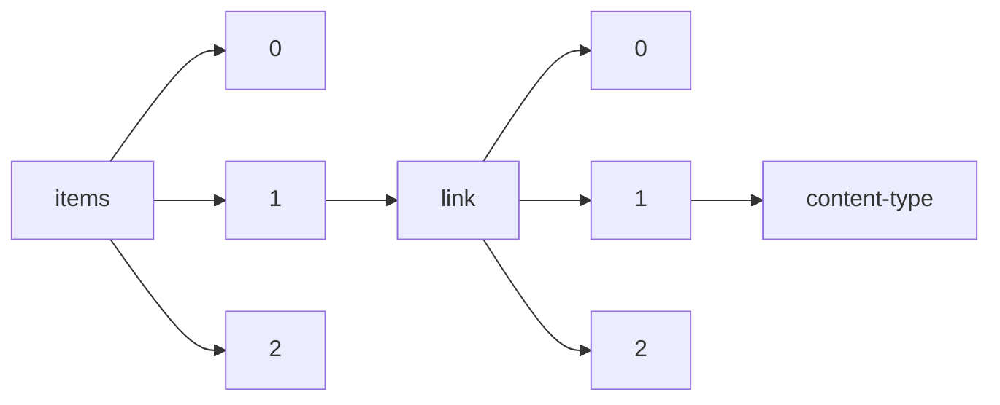

!!! warning "This document is not official Crossref documentation"
# Content-type
PATH = items/array/link/array/content-type(1)  
Occurs 180 130 264 times  
Unique values: 36  
{ .annotate }

1. A route to an element, for example:  
   The route "items/array/link/array/content-type" corresponds to navigating through the JSON indices as  
   ["items"][0]["link"][0]["content-type"]  

| **Row** | **Value** `String`                                                     | **Count** `Int64` |
|--------:|--------------------------------------------------------------------------:|---------------------:|
| **1**   | unspecified                                                               | 87 315 769           |
| **2**   | application/pdf                                                           | 32 562 320           |
| **3**   | text/xml                                                                  | 19 899 858           |
| **4**   | text/plain                                                                | 19 861 502           |
| **5**   | text/html                                                                 | 14 253 728           |
| **6**   | application/xml                                                           | 6 096 146            |
| **7**   | application/octet-stream                                                  | 64 601               |
| **8**   | application/epub+zip                                                      | 43 647               |
| **9**   | application/vnd.openxmlformats-officedocument.wordprocessingml.document   | 9 429                |
| **10**  | application/zip                                                           | 8 411                |
| **11**  | audio/mpeg                                                                | 6 260                |
| **12**  | application/msword                                                        | 3 991                |
| **13**  | application/postscript                                                    | 1 203                |
| **14**  | image/jpeg                                                                | 910                  |
| **15**  | video/mp4                                                                 | 600                  |
| **16**  | text/rtf                                                                  | 340                  |
| **17**  | application/vnd.oasis.opendocument.text                                   | 335                  |
| **18**  | image/png                                                                 | 281                  |
| **19**  | application/vnd.openxmlformats-officedocument.spreadsheetml.sheet         | 231                  |
| **20**  | application/x-gzip                                                        | 202                  |
| **21**  | audio/x-wav                                                               | 140                  |
| **22**  | application/vnd.openxmlformats-officedocument.presentationml.presentation | 79                   |
| **23**  | application/vnd.ms-excel                                                  | 75                   |
| **24**  | image/tiff                                                                | 46                   |
| **25**  | multipart/form-data                                                       | 37                   |
| **26**  | video/quicktime                                                           | 35                   |
| **27**  | text/css                                                                  | 28                   |
| **28**  | application/vnd.ms-powerpoint                                             | 12                   |
| **29**  | video/mpeg                                                                | 12                   |
| **30**  | video/avi                                                                 | 12                   |
| **31**  | image/gif                                                                 | 7                    |
| **32**  | application/rtf                                                           | 6                    |
| **33**  | video/x-ms-wmv                                                            | 5                    |
| **34**  | video/x-flv                                                               | 3                    |
| **35**  | application/vnd.oasis.opendocument.spreadsheet                            | 2                    |
| **36**  | audio/MP4A-LATM                                                           | 1                    |

