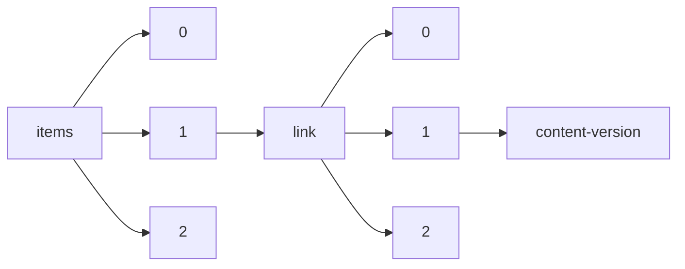

!!! warning "This document is not official Crossref documentation"
# Content-version
PATH = items/array/link/array/content-version(1)  
Occurs 180 130 264 times  
Unique values: 3  
{ .annotate }

1. A route to an element, for example:  
   The route "items/array/link/array/content-version" corresponds to navigating through the JSON indices as  
   ["items"][0]["link"][0]["content-version"]  

| **Row** | **Value** `String` | **Count** `Int64` |
|--------:|----------------------:|---------------------:|
| **1**   | vor                   | 179 374 572          |
| **2**   | am                    | 730 998              |
| **3**   | tdm                   | 24 694               |

