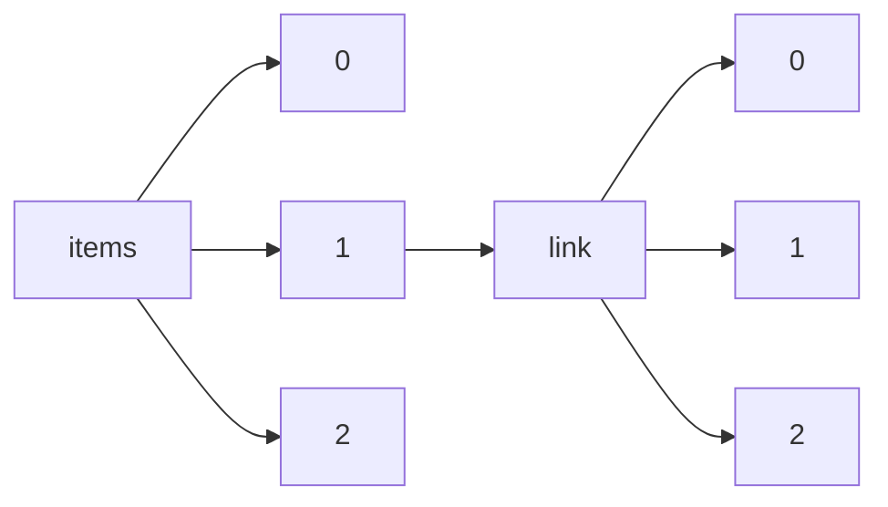

!!! warning "This document is not official Crossref documentation"
# Elements
PATH = items/array/link/array(1)  
Occurs 180 130 264 times  
{ .annotate }

1. A route to an element, for example:  
   The route "items/array/link/array" corresponds to navigating through the JSON indices as  
   ["items"][0]["link"][0]  

## URL
See more information: [items/array/link/array/URL](URL/index.md)  
Occurs 180 130 264 timess  
Unique values: > 999  

!!! note "Due to current limitations, only the first 1,000 unique values are counted."

| **Row** | **Value** `String`                                                           | **Count** `Int64` |
|--------:|--------------------------------------------------------------------------------:|---------------------:|
| **1**   | http://www.tandfonline.com/doi/pdf/10.1080/10256018808623883                    | 114 877              |
| **2**   | https://www.elgaronline.com/downloadpdf/book/9781788974912/9781788974912.xml    | 1 229                |
| **3**   | https://www.ithenticate.com/                                                    | 1 172                |
| **4**   | https://www.nucleodoconhecimento.com.br/                                        | 1 016                |
| **5**   | http://www.scielo.br/scielo.php?script=sci\_issues&pid=0004-2749&lng=en&nrm=iso | 719                  |
| **6**   | https://www.taylorfrancis.com/books/e/9780203757635                             | 556                  |
| **7**   | https://www.publish.csiro.au/RD/pdf/RDv22n1Abs                                  | 449                  |
| **8**   | https://www.publish.csiro.au/RD/pdf/RDv27n1Abs                                  | 336                  |
| **9**   | https://www.publish.csiro.au/RD/pdf/RDv18n2Abs                                  | 307                  |
| **10**  | https://ijip.in/wp-content/uploads/2019/01/18.01.001.20170402.pdf               | 306                  |
| ... | ... | ... |

## Content-type
See more information: [items/array/link/array/content-type](content-type/index.md)  
Occurs 180 130 264 timess  
Unique values: 36  

| **Row** | **Value** `String`                                                   | **Count** `Int64` |
|--------:|------------------------------------------------------------------------:|---------------------:|
| **1**   | unspecified                                                             | 87 315 769           |
| **2**   | application/pdf                                                         | 32 562 320           |
| **3**   | text/xml                                                                | 19 899 858           |
| **4**   | text/plain                                                              | 19 861 502           |
| **5**   | text/html                                                               | 14 253 728           |
| **6**   | application/xml                                                         | 6 096 146            |
| **7**   | application/octet-stream                                                | 64 601               |
| **8**   | application/epub+zip                                                    | 43 647               |
| **9**   | application/vnd.openxmlformats-officedocument.wordprocessingml.document | 9 429                |
| **10**  | application/zip                                                         | 8 411                |
| ... | ... | ... |

## Content-version
See more information: [items/array/link/array/content-version](content-version/index.md)  
Occurs 180 130 264 timess  
Unique values: 3  

| **Row** | **Value** `String` | **Count** `Int64` |
|--------:|----------------------:|---------------------:|
| **1**   | vor                   | 179 374 572          |
| **2**   | am                    | 730 998              |
| **3**   | tdm                   | 24 694               |

## Intended-application
See more information: [items/array/link/array/intended-application](intended-application/index.md)  
Occurs 180 130 264 timess  
Unique values: 4  

| **Row** | **Value** `String` | **Count** `Int64` |
|--------:|----------------------:|---------------------:|
| **1**   | text-mining           | 91 243 280           |
| **2**   | similarity-checking   | 84 119 143           |
| **3**   | syndication           | 4 612 207            |
| **4**   | unspecified           | 155 634              |

