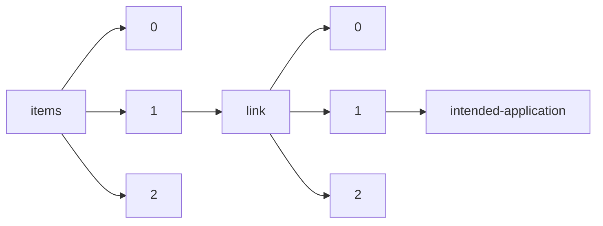

!!! warning "This document is not official Crossref documentation"
# Intended-application
PATH = items/array/link/array/intended-application(1)  
Occurs 180 130 264 times  
Unique values: 4  
{ .annotate }

1. A route to an element, for example:  
   The route "items/array/link/array/intended-application" corresponds to navigating through the JSON indices as  
   ["items"][0]["link"][0]["intended-application"]  

| **Row** | **Value** `String` | **Count** `Int64` |
|--------:|----------------------:|---------------------:|
| **1**   | text-mining           | 91 243 280           |
| **2**   | similarity-checking   | 84 119 143           |
| **3**   | syndication           | 4 612 207            |
| **4**   | unspecified           | 155 634              |

