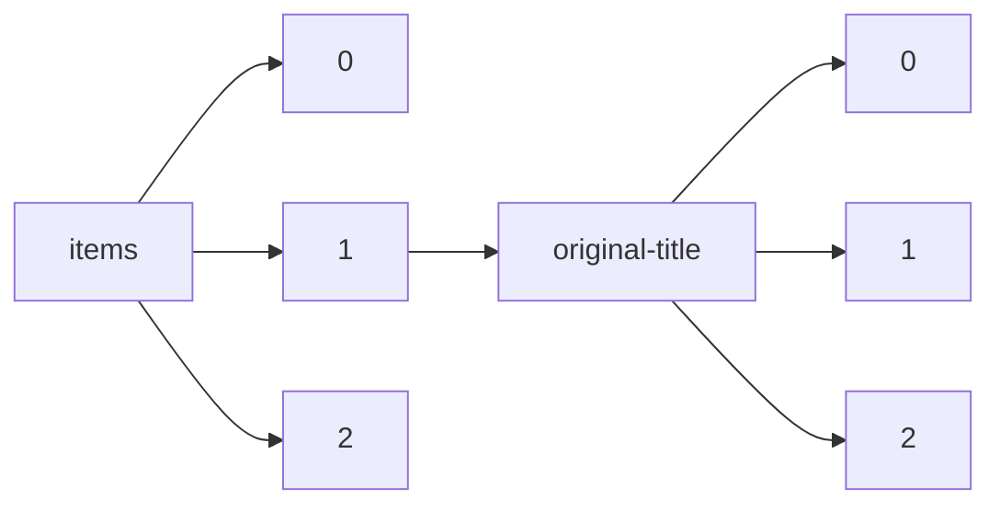

!!! warning "This document is not official Crossref documentation"
# Elements
PATH = items/array/original-title/array(1)  
Occurs 4 169 153 times  
Unique values: > 999  
{ .annotate }

1. A route to an element, for example:  
   The route "items/array/original-title/array" corresponds to navigating through the JSON indices as  
   ["items"][0]["original-title"][0]  

!!! note "Due to current limitations, only the first 1,000 unique values are counted."

| **Row** | **Value** `String`                                                                                | **Count** `Int64` |
|--------:|-----------------------------------------------------------------------------------------------------:|---------------------:|
| **1**   |                                                                                                      | 171 411              |
| **2**   | English                                                                                              | 93 241               |
| **3**   | english                                                                                              | 22 501               |
| **4**   | Introduction                                                                                         | 8 283                |
| **5**   | 正誤表                                                                                               | 5 047                |
| **6**   | 目次                                                                                                 | 4 978                |
| **7**   | 表紙                                                                                                 | 4 118                |
| **8**   | Conclusion                                                                                           | 3 655                |
| **9**   | [OTHERS]                                                                                             | 3 170                |
| **10**  | 訂正                                                                                                 | 2 852                |
| **11**  | 裏表紙                                                                                               | 2 743                |
| **12**  | CONTENTS                                                                                             | 2 730                |
| **13**  | 抄録                                                                                                 | 2 227                |
| **14**  | 奥付                                                                                                 | 2 099                |
| **15**  | Español                                                                                              | 1 729                |
| **16**  | 編集後記                                                                                             | 1 332                |
| **17**  | Portuguese                                                                                           | 1 291                |
| **18**  | 正誤                                                                                                 | 1 198                |
| **19**  | 会告                                                                                                 | 1 105                |
| **20**  | Epilogue                                                                                             | 1 005                |
| **21**  | Spanish                                                                                              | 906                  |
| **22**  | 雜録                                                                                                 | 846                  |
| **23**  | Russian                                                                                              | 841                  |
| **24**  | ENGLISH                                                                                              | 830                  |
| **25**  | 文献抄録                                                                                             | 749                  |
| **26**  | 雑録                                                                                                 | 740                  |
| **27**  | 雜報                                                                                                 | 738                  |
| **28**  | 会報                                                                                                 | 654                  |
| **29**  | 大会講演要旨                                                                                         | 636                  |
| **30**  | [Untitled]                                                                                           | 614                  |
| **31**  | 今日の話題                                                                                           | 523                  |
| **32**  | エラータ                                                                                             | 518                  |
| **33**  | ГЕОДИНАМІКА                                                                                          | 502                  |
| **34**  | ニュース                                                                                             | 499                  |
| **35**  | IJARCCE - Computer and Communication Engineering                                                     | 475                  |
| **36**  | 書評                                                                                                 | 459                  |
| **37**  | Portugues                                                                                            | 442                  |
| **38**  | Português                                                                                            | 442                  |
| **39**  | EN                                                                                                   | 431                  |
| **40**  | 統計                                                                                                 | 419                  |
| **41**  | Indonesian                                                                                           | 416                  |
| **42**  | 一般演題                                                                                             | 410                  |
| **43**  | お詫びと訂正                                                                                         | 379                  |
| **44**  | 雑報                                                                                                 | 371                  |
| **45**  | 文献紹介                                                                                             | 370                  |
| **46**  | 海外文献紹介                                                                                         | 370                  |
| **47**  | 文献                                                                                                 | 347                  |
| **48**  | 資料                                                                                                 | 339                  |
| **49**  | Ukrainian                                                                                            | 339                  |
| **50**  | 図書紹介                                                                                             | 336                  |
| **51**  | パピルス                                                                                             | 319                  |
| **52**  | 摘録                                                                                                 | 314                  |
| **53**  | 正誤訂正                                                                                             | 295                  |
| **54**  | Notes                                                                                                | 294                  |
| **55**  | Dedication                                                                                           | 279                  |
| **56**  | French                                                                                               | 265                  |
| **57**  | Recense                                                                                              | 257                  |
| **58**  | Ind                                                                                                  | 254                  |
| **59**  | ind                                                                                                  | 254                  |
| **60**  | 十字路                                                                                               | 249                  |
| **61**  | Conclusions                                                                                          | 248                  |
| **62**  | portuguese                                                                                           | 245                  |
| **63**  | 岡山醫學會彙報                                                                                       | 242                  |
| **64**  | シンポジウム                                                                                         | 242                  |
| **65**  | Věstník literární                                                                                    | 227                  |
| **66**  | Afterword                                                                                            | 227                  |
| **67**  | 商況                                                                                                 | 226                  |
| **68**  | 特別演題                                                                                             | 213                  |
| **69**  | 複写される方へ                                                                                       | 211                  |
| **70**  | 論文抄録                                                                                             | 209                  |
| **71**  | 書評・紹介等                                                                                         | 209                  |
| **72**  | 訂正とお詫び                                                                                         | 209                  |
| **73**  | Úlohy                                                                                                | 209                  |
| **74**  | 日本建築学会構造系論文集ならびに日本建築学会計画系論文集応募原稿募集                                 | 205                  |
| **75**  | español                                                                                              | 204                  |
| **76**  | 本部報告                                                                                             | 202                  |
| **77**  | 九州歯科学会雑誌投稿規定                                                                             | 202                  |
| **78**  | お答えします                                                                                         | 197                  |
| **79**  | 製品紹介                                                                                             | 195                  |
| **80**  | コメント                                                                                             | 194                  |
| **81**  | 特許紹介                                                                                             | 193                  |
| **82**  | SI単位の換算率表                                                                                     | 192                  |
| **83**  | Inglês                                                                                               | 191                  |
| **84**  | 書評等                                                                                               | 189                  |
| **85**  | グローイングポリマー                                                                                 | 188                  |
| **86**  | 一般講演                                                                                             | 186                  |
| **87**  | 紹介及批評等                                                                                         | 181                  |
| **88**  | in English                                                                                           | 179                  |
| **89**  | 目次 / CONTENTS                                                                                      | 174                  |
| **90**  | お知らせ                                                                                             | 174                  |
| **91**  | 学会通信                                                                                             | 173                  |
| **92**  | 論文集委員会                                                                                         | 173                  |
| **93**  | 一般演題(口演)                                                                                       | 169                  |
| **94**  | 一般演題演説要旨                                                                                     | 169                  |
| **95**  | Editorial                                                                                            | 162                  |
| **96**  | 抄録及文献                                                                                           | 162                  |
| **97**  | 複写をされる方に                                                                                     | 162                  |
| **98**  | COVER                                                                                                | 160                  |
| **99**  | Indonesia                                                                                            | 160                  |
| **100** | 次号予告                                                                                             | 160                  |
| **101** | 燃料事情                                                                                             | 158                  |
| **102** | spanish                                                                                              | 154                  |
| **103** | 日本建築学会構造系,計画系ならびに環境系論文集応募原稿募集                                            | 150                  |
| **104** | PINUP                                                                                                | 149                  |
| **105** | 應問                                                                                                 | 147                  |
| **106** | 支部活動                                                                                             | 144                  |
| **107** | 書評・紹介                                                                                           | 143                  |
| **108** | 地方会・研究会記録                                                                                   | 141                  |
| **109** | in Ukrainian                                                                                         | 141                  |
| **110** | IJIREEICE - Electrical, Electronics, Instrumentation and Control                                     | 140                  |
| **111** | 紹介                                                                                                 | 139                  |
| **112** | 生物コーナー                                                                                         | 138                  |
| **113** | 一般演題(示説)                                                                                       | 136                  |
| **114** | 經濟報                                                                                               | 135                  |
| **115** | 入会のご案内                                                                                         | 134                  |
| **116** | Chapter II                                                                                           | 134                  |
| **117** | 支部所在地                                                                                           | 132                  |
| **118** | 学会から                                                                                             | 132                  |
| **119** | en                                                                                                   | 129                  |
| **120** | 海外燃料事情                                                                                         | 128                  |
| **121** | 表紙の説明                                                                                           | 127                  |
| **122** | Zprávy                                                                                               | 125                  |
| **123** | Chapter III                                                                                          | 125                  |
| **124** | Preface                                                                                              | 125                  |
| **125** | Chapter IV                                                                                           | 123                  |
| **126** | Chapter I                                                                                            | 123                  |
| **127** | 講演要旨                                                                                             | 120                  |
| **128** | Bahasa Indonesia                                                                                     | 118                  |
| **129** | 海外技術ニュース                                                                                     | 118                  |
| **130** | Testimonia                                                                                           | 117                  |
| **131** | Chapter VI                                                                                           | 116                  |
| **132** | Chapter V                                                                                            | 116                  |
| **133** | Chapter VII                                                                                          | 115                  |
| **134** | Malay                                                                                                | 114                  |
| **135** | pl                                                                                                   | 114                  |
| **136** | 特許                                                                                                 | 114                  |
| **137** | Summaries of Papers Appearing in this Issue                                                          | 114                  |
| **138** | 1                                                                                                    | 113                  |
| **139** | es                                                                                                   | 113                  |
| **140** | Chapter VIII                                                                                         | 113                  |
| **141** | 編集委員会                                                                                           | 113                  |
| **142** | 東京地學協會記事                                                                                     | 112                  |
| **143** | 総会講演抄録集                                                                                       | 110                  |
| **144** | 8                                                                                                    | 109                  |
| **145** | 液體燃料                                                                                             | 109                  |
| **146** | 5                                                                                                    | 108                  |
| **147** | gl                                                                                                   | 108                  |
| **148** | BACKCOVER                                                                                            | 108                  |
| **149** | 2                                                                                                    | 107                  |
| **150** | 10                                                                                                   | 107                  |
| **151** | 4                                                                                                    | 107                  |
| **152** | 3                                                                                                    | 105                  |
| **153** | Chapter IX                                                                                           | 105                  |
| **154** | 前號正誤                                                                                             | 104                  |
| **155** | [CATALOG]                                                                                            | 104                  |
| **156** | JICST通信                                                                                            | 104                  |
| **157** | はじめに                                                                                             | 103                  |
| **158** | Book Reviews                                                                                         | 102                  |
| **159** | 7                                                                                                    | 102                  |
| **160** | Chapter X                                                                                            | 102                  |
| **161** | 9                                                                                                    | 101                  |
| **162** | 11                                                                                                   | 101                  |
| **163** | Novosti fiziki v seti Internet (po materialam elektronnykh preprintov)                               | 101                  |
| **164** | 二、固體燃料                                                                                         | 100                  |
| **165** | 一般演説記事                                                                                         | 100                  |
| **166** | 委員会報告                                                                                           | 99                   |
| **167** | 集会報告                                                                                             | 99                   |
| **168** | 6                                                                                                    | 98                   |
| **169** | 水素添加及合成                                                                                       | 98                   |
| **170** | 分析及測定                                                                                           | 97                   |
| **171** | 巻頭言                                                                                               | 95                   |
| **172** | 12                                                                                                   | 95                   |
| **173** | 三、液體燃料                                                                                         | 95                   |
| **174** | 固體燃料                                                                                             | 94                   |
| **175** | 用語解説                                                                                             | 94                   |
| **176** | F1                                                                                                   | 94                   |
| **177** | 国内トピックス                                                                                       | 94                   |
| **178** | T1                                                                                                   | 94                   |
| **179** | 14                                                                                                   | 93                   |
| **180** | Chapter XI                                                                                           | 92                   |
| **181** | 投稿ならびに執筆規定                                                                                 | 92                   |
| **182** | 雜録彙報                                                                                             | 91                   |
| **183** | 13                                                                                                   | 91                   |
| **184** | クリスタリット                                                                                       | 91                   |
| **185** | 編集委員                                                                                             | 90                   |
| **186** | 報告                                                                                                 | 89                   |
| **187** | 主要国内学会・研究会一覧                                                                             | 89                   |
| **188** | Coda                                                                                                 | 87                   |
| **189** | Chapter XII                                                                                          | 87                   |
| **190** | 16                                                                                                   | 86                   |
| **191** | お詫び                                                                                               | 85                   |
| **192** | 学生欄                                                                                               | 84                   |
| **193** | 會報                                                                                                 | 84                   |
| **194** | ご案内(学会・研究会)                                                                                 | 84                   |
| **195** | 15                                                                                                   | 82                   |
| **196** | 特別講演                                                                                             | 82                   |
| **197** | 四、瓦斯體燃料                                                                                       | 82                   |
| **198** | 学術集談会演説要旨                                                                                   | 82                   |
| **199** | 18                                                                                                   | 81                   |
| **200** | 五、乾餾及瓦斯化                                                                                     | 81                   |
| **201** | 17                                                                                                   | 80                   |
| **202** | 新著紹介                                                                                             | 80                   |
| **203** | 支部報告                                                                                             | 80                   |
| **204** | 化学の窓                                                                                             | 79                   |
| **205** | Další zprávy                                                                                         | 78                   |
| **206** | ina                                                                                                  | 78                   |
| **207** | 鉄鋼ニューズ                                                                                         | 78                   |
| **208** | Inglés                                                                                               | 78                   |
| **209** | 原子力関係特許解説                                                                                   | 78                   |
| **210** | Recenze                                                                                              | 77                   |
| **211** | RESUME                                                                                               | 77                   |
| **212** | Chapter XIII                                                                                         | 76                   |
| **213** | 新刊科学技術雑誌紹介                                                                                 | 76                   |
| **214** | Author                                                                                               | 75                   |
| **215** | 海外文献抄録                                                                                         | 75                   |
| **216** | Ina                                                                                                  | 75                   |
| **217** | 『脳神経外科ジャーナル』(Japanese Journal of Neurosurgery)投稿ならびに執筆規定                       | 74                   |
| **218** | お知らせ 会員の皆様へ                                                                                | 74                   |
| **219** | 主要国際学会                                                                                         | 74                   |
| **220** | I                                                                                                    | 74                   |
| **221** | 1. Introduction                                                                                      | 74                   |
| **222** | II                                                                                                   | 73                   |
| **223** | 「日本建築学会構造系論文報告集ならびに日本建築学会計画系論文報告集」論文募集                         | 73                   |
| **224** | Prologue                                                                                             | 73                   |
| **225** | 資料紹介                                                                                             | 72                   |
| **226** | Fragments                                                                                            | 72                   |
| **227** | 日本老年医学会地方会記録                                                                             | 72                   |
| **228** | 特集の趣旨                                                                                           | 71                   |
| **229** | SI 単位の換算率表                                                                                    | 71                   |
| **230** | T2                                                                                                   | 71                   |
| **231** | ガス體燃料                                                                                           | 70                   |
| **232** | Summaries of articles published in this issue                                                        | 70                   |
| **233** | 海外の部                                                                                             | 70                   |
| **234** | Referate                                                                                             | 70                   |
| **235** | 「主要国内学会・研究会一覧」掲載希望受付要項                                                         | 70                   |
| **236** | 会員の皆様へ                                                                                         | 70                   |
| **237** | Chapter XIV                                                                                          | 69                   |
| **238** | 20                                                                                                   | 69                   |
| **239** | 19                                                                                                   | 68                   |
| **240** | 訂正のお知らせ                                                                                       | 68                   |
| **241** | gallego                                                                                              | 68                   |
| **242** | 業界情勢                                                                                             | 68                   |
| **243** | F2                                                                                                   | 68                   |
| **244** | 日本放射線技術学会雑誌投稿規定                                                                       | 68                   |
| **245** | 問答                                                                                                 | 68                   |
| **246** | ニュース目次                                                                                         | 68                   |
| **247** | Making a copy of this publication                                                                    | 67                   |
| **248** | 日本脳神経外科コングレス(役員等)                                                                     | 67                   |
| **249** | 既刊のご案内                                                                                         | 67                   |
| **250** | Novye knigi po fizike i smezhnym naukam                                                              | 66                   |
| **251** | 寄書                                                                                                 | 66                   |
| **252** | 講演會                                                                                               | 66                   |
| **253** | パネルディスカッション                                                                               | 65                   |
| **254** | 海外情報                                                                                             | 65                   |
| **255** | 21                                                                                                   | 64                   |
| **256** | 目次/CONTENTS                                                                                        | 64                   |
| **257** | 特集によせて                                                                                         | 63                   |
| **258** | About the Author                                                                                     | 63                   |
| **259** | SYNOPSIS                                                                                             | 62                   |
| **260** | 研究のスポット                                                                                       | 62                   |
| **261** | 22                                                                                                   | 60                   |
| **262** | 質疑                                                                                                 | 60                   |
| **263** | 24                                                                                                   | 59                   |
| **264** | 日本藥局方植物篇 (前號ノ續キ)                                                                        | 59                   |
| **265** | 日本鉄鋼協会第98回講演大会講演概要                                                                   | 59                   |
| **266** | 研究会に行こう！                                                                                     | 59                   |
| **267** | 総目次                                                                                               | 59                   |
| **268** | 年間スケジュール                                                                                     | 59                   |
| **269** | 石油化学                                                                                             | 59                   |
| **270** | ????                                                                                                 | 59                   |
| **271** | Chapter XV                                                                                           | 58                   |
| **272** | Chapter XVI                                                                                          | 57                   |
| **273** | 示説                                                                                                 | 57                   |
| **274** | Abbreviations                                                                                        | 57                   |
| **275** | III                                                                                                  | 57                   |
| **276** | 提言                                                                                                 | 57                   |
| **277** | Foreword                                                                                             | 57                   |
| **278** | シリーズ「発想のたまご」                                                                             | 57                   |
| **279** | Commentary                                                                                           | 56                   |
| **280** | 【書評】                                                                                             | 56                   |
| **281** | 学会情報                                                                                             | 56                   |
| **282** | Ab Urbe Condita                                                                                      | 55                   |
| **283** | 座談会                                                                                               | 55                   |
| **284** | 23                                                                                                   | 54                   |
| **285** | Fragmenta                                                                                            | 54                   |
| **286** | 理事会議事                                                                                           | 54                   |
| **287** | 日本鉄鋼協会第97回講演大会講演概要                                                                   | 54                   |
| **288** | 口絵                                                                                                 | 54                   |
| **289** | SOCIETY OF MECHANICAL ENGINEERS                                                                      | 54                   |
| **290** | 日本鉄鋼協会第96回講演大会講演概要                                                                   | 53                   |
| **291** | ГЕОДЕЗІЯ, КАРТОГРАФІЯ І АЕРОФОТОЗНІМАННЯ                                                             | 53                   |
| **292** | 日本鉄鋼協会第94回講演大会講演概要                                                                   | 53                   |
| **293** | Ballade:                                                                                             | 53                   |
| **294** | 七、分析及測定                                                                                       | 53                   |
| **295** | 海外紹介                                                                                             | 53                   |
| **296** | 支部だより                                                                                           | 52                   |
| **297** | Chapter XVII                                                                                         | 52                   |
| **298** | 日本学術会議だより                                                                                   | 52                   |
| **299** | Figures                                                                                              | 52                   |
| **300** | 25                                                                                                   | 52                   |
| **301** | 部門だより                                                                                           | 51                   |
| **302** | 研究所だより                                                                                         | 51                   |
| **303** | 死亡會員                                                                                             | 51                   |
| **304** | 日本鉄鋼協会第95回講演大会講演概要                                                                   | 51                   |
| **305** | ГЕОДЕЗІЯ, КАРТОГРАФІЯ  І АЕРОФОТОЗНІМАННЯ                                                            | 51                   |
| **306** | T3                                                                                                   | 51                   |
| **307** | 六、設計装置及諸材料                                                                                 | 51                   |
| **308** | MMWR                                                                                                 | 50                   |
| **309** | 「VIDEO JOURNAL of Japan Neurosurgery」新年度会員募集のお知らせ                                      | 50                   |
| **310** | F3                                                                                                   | 50                   |
| **311** | 若手会員の会                                                                                         | 49                   |
| **312** | 日本脳神経外科ビデオジャーナル投稿規定                                                               | 49                   |
| **313** | 技術用語解説                                                                                         | 49                   |
| **314** | Literatura                                                                                           | 49                   |
| **315** | 化學ニ關スル特許明細書摘要                                                                           | 49                   |
| **316** | IV                                                                                                   | 48                   |
| **317** | German                                                                                               | 48                   |
| **318** | 九州歯科学会会則                                                                                     | 48                   |
| **319** | 入退會者                                                                                             | 48                   |
| **320** | ニュース・JICST通信                                                                                  | 48                   |
| **321** | 随想                                                                                                 | 48                   |
| **322** | 読者の意見(Letters to the Editor)原稿募集                                                            | 48                   |
| **323** | BAHASA INDONESIA                                                                                     | 48                   |
| **324** | 《光学学报》创刊三十周年                                                                             | 47                   |
| **325** | 商况                                                                                                 | 47                   |
| **326** | 年間スケジュール表                                                                                   | 47                   |
| **327** | Rezensionen                                                                                          | 47                   |
| **328** | Epigraph                                                                                             | 46                   |
| **329** | 分析                                                                                                 | 46                   |
| **330** | 八、雜                                                                                               | 46                   |
| **331** | 環境行政情報                                                                                         | 46                   |
| **332** | Drobné zprávy                                                                                        | 46                   |
| **333** | 臨床                                                                                                 | 45                   |
| **334** | 29                                                                                                   | 45                   |
| **335** | 日本鉄鋼協会第93回講演大会講演概要                                                                   | 45                   |
| **336** | 紹介及批評・抄録等                                                                                   | 45                   |
| **337** | 投稿規定                                                                                             | 45                   |
| **338** | ingles                                                                                               | 45                   |
| **339** | pt                                                                                                   | 45                   |
| **340** | Chapter XIX                                                                                          | 44                   |
| **341** | 内國産石炭分析表                                                                                     | 44                   |
| **342** | Original                                                                                             | 44                   |
| **343** | 新入会員名簿                                                                                         | 44                   |
| **344** | Chapter XVIII                                                                                        | 44                   |
| **345** | 28                                                                                                   | 44                   |
| **346** | 32                                                                                                   | 43                   |
| **347** | T4                                                                                                   | 43                   |
| **348** | 26                                                                                                   | 43                   |
| **349** | 潤滑油                                                                                               | 42                   |
| **350** | 鐵道新線路開通                                                                                       | 42                   |
| **351** | References                                                                                           | 42                   |
| **352** | 関連学会だより                                                                                       | 42                   |
| **353** | inglês                                                                                               | 42                   |
| **354** | 実行委員会                                                                                           | 41                   |
| **355** | F4                                                                                                   | 41                   |
| **356** | 日本鉄鋼協会第66回講演大会講演大要                                                                   | 41                   |
| **357** | 各種委員會會合                                                                                       | 41                   |
| **358** | ABOUT THE AUTHORS                                                                                    | 41                   |
| **359** | Why I became an occupational physician …                                                             | 41                   |
| **360** | 九州歯科学会々則                                                                                     | 41                   |
| **361** | 研究から生産まで                                                                                     | 41                   |
| **362** | VI                                                                                                   | 41                   |
| **363** | 図書注文表                                                                                           | 41                   |
| **364** | Úlohy a problémy                                                                                     | 41                   |
| **365** | 演説要旨                                                                                             | 40                   |
| **366** | 一般演題抄録                                                                                         | 40                   |
| **367** | -                                                                                                    | 40                   |
| **368** | V                                                                                                    | 40                   |
| **369** | VII                                                                                                  | 40                   |
| **370** | 新年のご挨拶                                                                                         | 40                   |
| **371** | Book 1                                                                                               | 39                   |
| **372** | 35                                                                                                   | 39                   |
| **373** | 27                                                                                                   | 39                   |
| **374** | Новости физики в сети Internet (по материалам электронных препринтов)                                | 39                   |
| **375** | 日本鉄鋼協会第60回講演大会講演大要                                                                   | 39                   |
| **376** | その他の関連学会・研究会                                                                             | 38                   |
| **377** | 33                                                                                                   | 38                   |
| **378** | 大会委員会                                                                                           | 38                   |
| **379** | 答                                                                                                   | 38                   |
| **380** | 性質                                                                                                 | 38                   |
| **381** | 海外通信                                                                                             | 38                   |
| **382** | 30                                                                                                   | 38                   |
| **383** | 寄贈雑誌                                                                                             | 38                   |
| **384** | 内外雜誌主要題目                                                                                     | 37                   |
| **385** | 九、文献                                                                                             | 37                   |
| **386** | 學會                                                                                                 | 37                   |
| **387** | 本會役員                                                                                             | 37                   |
| **388** | Questions and Answers                                                                                | 37                   |
| **389** | 採鑛及選炭                                                                                           | 37                   |
| **390** | F5                                                                                                   | 37                   |
| **391** | 36                                                                                                   | 36                   |
| **392** | THE MEMBERS OF THE INTERNATIONAL RICHARD STRAUSS SOCIETY                                             | 36                   |
| **393** | Spolkový věstník                                                                                     | 36                   |
| **394** | ファジィ関連外国雑誌目次                                                                             | 36                   |
| **395** | 新航空機                                                                                             | 36                   |
| **396** | 訂正表                                                                                               | 36                   |
| **397** | PORTUGUES                                                                                            | 36                   |
| **398** | 乾餾及ガス化                                                                                         | 36                   |
| **399** | F6                                                                                                   | 36                   |
| **400** | 討論                                                                                                 | 36                   |
| **401** | 日本鉄鋼協会第63回講演大会講演大要                                                                   | 36                   |
| **402** | 第1室(中扉)                                                                                          | 36                   |
| **403** | 34                                                                                                   | 35                   |
| **404** | Postscript                                                                                           | 35                   |
| **405** | 液体燃料                                                                                             | 35                   |
| **406** | 日本放射線技術学会雑誌投稿規程                                                                       | 35                   |
| **407** | 投稿申請書                                                                                           | 35                   |
| **408** | 連絡票                                                                                               | 35                   |
| **409** | 座長集約(中国・四国部会)                                                                             | 34                   |
| **410** | 時評                                                                                                 | 34                   |
| **411** | Obrázky                                                                                              | 34                   |
| **412** | Q&amp;amp;A                                                                                          | 34                   |
| **413** | 特集にあたって                                                                                       | 34                   |
| **414** | 37                                                                                                   | 34                   |
| **415** | News and Notices                                                                                     | 34                   |
| **416** | Reflection                                                                                           | 34                   |
| **417** | 工業品規格統一調査會近況                                                                             | 34                   |
| **418** | 燃焼と熱管理                                                                                         | 34                   |
| **419** | Bücherbesprechungen                                                                                  | 34                   |
| **420** | 第3室(中扉)                                                                                          | 34                   |
| **421** | 関東支部研究会記録                                                                                   | 34                   |
| **422** | Chapter XX                                                                                           | 33                   |
| **423** | Illustrations                                                                                        | 33                   |
| **424** | 質疑應答                                                                                             | 33                   |
| **425** | 日本鉄鋼協会第65回講演大会講演大要                                                                   | 33                   |
| **426** | 日本機械学会論文集の年間購読のご案内                                                                 | 33                   |
| **427** | 日本鉄鋼協会第64回講演大会講演大要                                                                   | 33                   |
| **428** | 「日本放射線技術学会雑誌」投稿原稿チェックリスト                                                     | 33                   |
| **429** | 新刊紹介                                                                                             | 33                   |
| **430** | Book I                                                                                               | 32                   |
| **431** | 書評・抄録等                                                                                         | 32                   |
| **432** | in Russian                                                                                           | 32                   |
| **433** | 表紙の画                                                                                             | 32                   |
| **434** | I 論文提出申し合わせ(抄)                                                                             | 32                   |
| **435** | 案内板                                                                                               | 32                   |
| **436** | 最近の注目特許                                                                                       | 32                   |
| **437** | 日本教育心理学会第6回総会部門別研究発表要旨・討論の概要                                              | 32                   |
| **438** | 地質調査所の出版物                                                                                   | 32                   |
| **439** | F7                                                                                                   | 32                   |
| **440** | português                                                                                            | 32                   |
| **441** | 雜                                                                                                   | 32                   |
| **442** | Editorial Board                                                                                      | 32                   |
| **443** | 一般演題 その1                                                                                       | 32                   |
| **444** | 外国文献                                                                                             | 32                   |
| **445** | الجامعة المستنصرية / كلية الادارة والاقتصاد                                                          | 32                   |
| **446** | 炭素と私                                                                                             | 31                   |
| **447** | 日本鉄鋼協会第90回講演大会                                                                           | 31                   |
| **448** | 日本鉄鋼協会第91回講演大会講演大要                                                                   | 31                   |
| **449** | VIII                                                                                                 | 31                   |
| **450** | 31                                                                                                   | 31                   |
| **451** | tr                                                                                                   | 31                   |
| **452** | 学協会・研究所紹介                                                                                   | 30                   |
| **453** | 無機化學 有機化學                                                                                    | 30                   |
| **454** | 講演分野(中扉)                                                                                       | 30                   |
| **455** | {1,1}                                                                                                | 30                   |
| **456** | ワークショップ                                                                                       | 30                   |
| **457** | 38                                                                                                   | 30                   |
| **458** | Chapter XXIII                                                                                        | 30                   |
| **459** | 特許出願公告及特許拔萃                                                                               | 30                   |
| **460** | 社会学文献目録                                                                                       | 29                   |
| **461** | 書評と紹介                                                                                           | 29                   |
| **462** | 第5室(中扉)                                                                                          | 29                   |
| **463** | 版下原稿執筆の手引き                                                                                 | 29                   |
| **464** | 一般演題 口演                                                                                        | 29                   |
| **465** | Mosaika                                                                                              | 29                   |
| **466** | 1 Introduction                                                                                       | 29                   |
| **467** | 乾留とガス化                                                                                         | 29                   |
| **468** | 特許記事                                                                                             | 29                   |
| **469** | id                                                                                                   | 29                   |
| **470** | Book 2                                                                                               | 29                   |
| **471** | Book II                                                                                              | 29                   |
| **472** | 「日本建築学会構造系論文報告集ならびに日本建築学会計画系論文報告集」原稿募集                         | 29                   |
| **473** | 論文集予約購読申込書                                                                                 | 28                   |
| **474** | 一月號正誤表                                                                                         | 28                   |
| **475** | IARJSET - Science, Engineering and Technology                                                        | 28                   |
| **476** | 製銑                                                                                                 | 28                   |
| **477** | Journal of the Operations Research Society of Japan(JORSJ)                                           | 28                   |
| **478** | 日本建築学会構造系論文集(標題紙)                                                                     | 28                   |
| **479** | 六、分析及測定                                                                                       | 28                   |
| **480** | Introductory Note                                                                                    | 28                   |
| **481** | T5                                                                                                   | 28                   |
| **482** | Turkish                                                                                              | 28                   |
| **483** | 日本鉄鋼協会第59回講演大会講演大要                                                                   | 28                   |
| **484** | Chapter XXV                                                                                          | 28                   |
| **485** | 高分子科学最近の進歩                                                                                 | 28                   |
| **486** | 『欧文誌』抄録                                                                                       | 27                   |
| **487** | 学会活動報告                                                                                         | 27                   |
| **488** | 製鋼基礎                                                                                             | 27                   |
| **489** | 日本建築学会環境系論文集(標題紙)                                                                     | 27                   |
| **490** | 大震災後の学会の取り組み                                                                             | 27                   |
| **491** | 英文要旨                                                                                             | 27                   |
| **492** | Chapter XXI                                                                                          | 27                   |
| **493** | 司会のことば                                                                                         | 27                   |
| **494** | 複写される方に                                                                                       | 27                   |
| **495** | 序                                                                                                   | 26                   |
| **496** | Interlude                                                                                            | 26                   |
| **497** | 会計報告                                                                                             | 26                   |
| **498** | Chapter 3                                                                                            | 26                   |
| **499** | 編修會                                                                                               | 26                   |
| **500** | XIII                                                                                                 | 26                   |
| **501** | 総合討論                                                                                             | 26                   |
| **502** | 第7室(中扉)                                                                                          | 26                   |
| **503** | 国内国外刊行誌参考記事目次                                                                           | 26                   |
| **504** | 抄録、討論                                                                                           | 25                   |
| **505** | IX                                                                                                   | 25                   |
| **506** | Chapter XXII                                                                                         | 25                   |
| **507** | Life and Work                                                                                        | 25                   |
| **508** | Emerging Adult Essay                                                                                 | 25                   |
| **509** | ?????????????????????????????                                                                        | 25                   |
| **510** | 例会・部会要旨                                                                                       | 25                   |
| **511** | 41                                                                                                   | 25                   |
| **512** | 日本機械学会学術誌の電子公開について                                                                 | 25                   |
| **513** | 規格紹介                                                                                             | 25                   |
| **514** | 特別講演(中扉)                                                                                       | 25                   |
| **515** | XI                                                                                                   | 25                   |
| **516** | ビデオクリニック                                                                                     | 25                   |
| **517** | Науковий вісник Одеського національного економічного університету                                    | 25                   |
| **518** | 第6室(中扉)                                                                                          | 25                   |
| **519** | Chapter 1                                                                                            | 24                   |
| **520** | PORTUGUÊS                                                                                            | 24                   |
| **521** | Croatian                                                                                             | 24                   |
| **522** | Acknowledgments                                                                                      | 24                   |
| **523** | 精密工学会誌論文集掲載論文要旨                                                                       | 24                   |
| **524** | F8                                                                                                   | 24                   |
| **525** | 投稿原稿表紙                                                                                         | 24                   |
| **526** | TR                                                                                                   | 24                   |
| **527** | Chapter 4                                                                                            | 24                   |
| **528** | 日本教育心理学会第5回総会部門別研究発表要旨・討論の概要                                              | 24                   |
| **529** | Book reviews                                                                                         | 24                   |
| **530** | Copyright Page                                                                                       | 24                   |
| **531** | 転炉                                                                                                 | 24                   |
| **532** | 日本機械学会論文集の電子出版移行について                                                             | 23                   |
| **533** | Book 4                                                                                               | 23                   |
| **534** | 日本教育心理学会第4回総会部門別研究発表要旨・討論の概要                                              | 23                   |
| **535** | 第8室(中扉)                                                                                          | 23                   |
| **536** | Новые книги по физике и смежным наукам                                                               | 23                   |
| **537** | Overview                                                                                             | 23                   |
| **538** | Book III                                                                                             | 23                   |
| **539** | X                                                                                                    | 23                   |
| **540** | 溶接・接合をめぐる最近の動向                                                                         | 23                   |
| **541** | 工場紹介                                                                                             | 23                   |
| **542** | XV                                                                                                   | 23                   |
| **543** | Book 3                                                                                               | 23                   |
| **544** | 座長のまとめ                                                                                         | 23                   |
| **545** | 40                                                                                                   | 23                   |
| **546** | 加工                                                                                                 | 23                   |
| **547** | 第10室(中扉)                                                                                         | 23                   |
| **548** | Drobnosti                                                                                            | 23                   |
| **549** | 新製品・新技術紹介                                                                                   | 23                   |
| **550** | Book Review                                                                                          | 23                   |
| **551** | Z literatury                                                                                         | 23                   |
| **552** | 随筆                                                                                                 | 23                   |
| **553** | ガスクロデータ                                                                                       | 23                   |
| **554** | 内容区分と表示について                                                                               | 22                   |
| **555** | 集談会記事                                                                                           | 22                   |
| **556** | 第2室(中扉)                                                                                          | 22                   |
| **557** | 1955–1959, Fourteenth sessionThird CommitteeAgenda item 34                                           | 22                   |
| **558** | ?????????                                                                                            | 22                   |
| **559** | Reviewers                                                                                            | 22                   |
| **560** | 論文集,Journalの年間購読のご案内                                                                     | 22                   |
| **561** | シンポジウム I                                                                                       | 22                   |
| **562** | The Japanese Society of Spinal Surgery 1986                                                          | 22                   |
| **563** | 第9室(中扉)                                                                                          | 22                   |
| **564** | 東京地學協會の演説                                                                                   | 22                   |
| **565** | 42                                                                                                   | 22                   |
| **566** | Q&amp;A on I-O                                                                                       | 21                   |
| **567** | 卷頭語                                                                                               | 21                   |
| **568** | Testimonium                                                                                          | 21                   |
| **569** | Chapter 2                                                                                            | 21                   |
| **570** | Chapter XXIV                                                                                         | 21                   |
| **571** | 論文募集                                                                                             | 21                   |
| **572** | 45                                                                                                   | 21                   |
| **573** | Legal Maxims: Summaries and Extracts from Selected Case Law                                          | 21                   |
| **574** | 電子情報通信学会 情報・システムソサイエティ誌編集委員会                                              | 21                   |
| **575** | III 日本航海学会論文集用原稿執筆要領                                                                 | 21                   |
| **576** | 日本建築学会計画系論文集(標題紙)                                                                     | 21                   |
| **577** | 地方部会抄録 その1                                                                                   | 21                   |
| **578** | 参考文献                                                                                             | 21                   |
| **579** | 投稿および執筆規定                                                                                   | 21                   |
| **580** | 集会記事                                                                                             | 21                   |
| **581** | List of Figures and Tables                                                                           | 21                   |
| **582** | 第11室(中扉)                                                                                         | 21                   |
| **583** | ??????                                                                                               | 21                   |
| **584** | 会告・案内                                                                                           | 21                   |
| **585** | 石油精製                                                                                             | 21                   |
| **586** | 最近改正されたコンクリート関係JISの紹介                                                              | 21                   |
| **587** | 第4室(中扉)                                                                                          | 21                   |
| **588** | XII                                                                                                  | 21                   |
| **589** | 経濟報                                                                                               | 21                   |
| **590** | F11                                                                                                  | 20                   |
| **591** | 39                                                                                                   | 20                   |
| **592** | 投稿前チェックリスト                                                                                 | 20                   |
| **593** | ??????????????????????????????                                                                       | 20                   |
| **594** | 閉會の辭                                                                                             | 20                   |
| **595** | 学協会紹介                                                                                           | 20                   |
| **596** | 44                                                                                                   | 20                   |
| **597** | F10                                                                                                  | 20                   |
| **598** | 43                                                                                                   | 20                   |
| **599** | Notice for Photocopying                                                                              | 20                   |
| **600** | Book VIII                                                                                            | 20                   |
| **601** | 弔辞                                                                                                 | 20                   |
| **602** | 日本脳神経外科ビデオジャーナル会員募集                                                               | 20                   |
| **603** | 紹介および批評・抄録等                                                                               | 20                   |
| **604** | 心理学研究正誤訂正                                                                                   | 20                   |
| **605** | Chapter 5                                                                                            | 20                   |
| **606** | 會告                                                                                                 | 20                   |
| **607** | 脊髄外科関連学会・研究会一覧                                                                         | 20                   |
| **608** | 正誤・訂正                                                                                           | 20                   |
| **609** | 話題                                                                                                 | 19                   |
| **610** | XIX                                                                                                  | 19                   |
| **611** | 国際会議案内                                                                                         | 19                   |
| **612** | XVII                                                                                                 | 19                   |
| **613** | Notice about photocopying                                                                            | 19                   |
| **614** | Zprávy z výboru Jednoty českých mathematiků                                                          | 19                   |
| **615** | 著者紹介                                                                                             | 19                   |
| **616** | F9                                                                                                   | 19                   |
| **617** | 〔心理学研究正誤訂正〕                                                                               | 19                   |
| **618** | Presentación                                                                                         | 19                   |
| **619** | ???????????????????????????                                                                          | 19                   |
| **620** | Fragment                                                                                             | 19                   |
| **621** | Chapter XXXI                                                                                         | 19                   |
| **622** | 入退會                                                                                               | 19                   |
| **623** | 化學ニ關スル專賣特許明細書摘要                                                                       | 19                   |
| **624** | Интервью                                                                                             | 19                   |
| **625** | magyar                                                                                               | 19                   |
| **626** | Науково-інформаційний вісник Івано-Франківського університету права імені Короля Данила Галицького   | 19                   |
| **627** | F14                                                                                                  | 19                   |
| **628** | 2001年論文集委員会                                                                                   | 18                   |
| **629** | 高分子教室                                                                                           | 18                   |
| **630** | Chapter XXIX                                                                                         | 18                   |
| **631** | 論文審査内規申し合わせ事項                                                                           | 18                   |
| **632** | Book 7                                                                                               | 18                   |
| **633** | F15                                                                                                  | 18                   |
| **634** | ブタノール醗酵                                                                                       | 18                   |
| **635** | 日本建築学会構造系論文報告集ならびに日本建築学会計画系論文報告集募集規程                             | 18                   |
| **636** | ???????????????????????????????????                                                                  | 18                   |
| **637** | 論文審査内規抜粋                                                                                     | 18                   |
| **638** | 会長講演                                                                                             | 18                   |
| **639** | ?????????????????                                                                                    | 18                   |
| **640** | ????????????????????                                                                                 | 18                   |
| **641** | F12                                                                                                  | 18                   |
| **642** | 討論会要旨                                                                                           | 18                   |
| **643** | タール                                                                                               | 18                   |
| **644** | XIV                                                                                                  | 18                   |
| **645** | 内外雑誌主要題目                                                                                     | 18                   |
| **646** | 文獻                                                                                                 | 18                   |
| **647** | 海外之部                                                                                             | 18                   |
| **648** | 「脊髄外科」連絡表                                                                                   | 18                   |
| **649** | 日本脊髄外科学会                                                                                     | 18                   |
| **650** | Acknowledgements                                                                                     | 18                   |
| **651** | Chapter 9                                                                                            | 17                   |
| **652** | Bahasa                                                                                               | 17                   |
| **653** | 固体燃料                                                                                             | 17                   |
| **654** | 新文獻抄録                                                                                           | 17                   |
| **655** | 開會の辭                                                                                             | 17                   |
| **656** | 地方通信                                                                                             | 17                   |
| **657** | 論文編集委員会                                                                                       | 17                   |
| **658** | 個別報告要旨                                                                                         | 17                   |
| **659** | 外國特許                                                                                             | 17                   |
| **660** | 論文集原稿執筆のしおり                                                                               | 17                   |
| **661** | ??????????????????????????????????                                                                   | 17                   |
| **662** | XVIII                                                                                                | 17                   |
| **663** | 46                                                                                                   | 17                   |
| **664** | 八、雑                                                                                               | 17                   |
| **665** | ??????????????????????????                                                                           | 17                   |
| **666** | ?????????????????????                                                                                | 17                   |
| **667** | II 講演予稿用原稿執筆要領                                                                            | 17                   |
| **668** | Chapter XXXV                                                                                         | 17                   |
| **669** | T6                                                                                                   | 17                   |
| **670** | 通俗物理學談                                                                                         | 17                   |
| **671** | Spinal Surgery                                                                                       | 17                   |
| **672** | 第12室(中扉)                                                                                         | 17                   |
| **673** | Book IV                                                                                              | 17                   |
| **674** | 質疑応答                                                                                             | 16                   |
| **675** | 「脊髄外科」投稿申請書                                                                               | 16                   |
| **676** | 一般演題 (I)                                                                                         | 16                   |
| **677** | 研究論文要旨                                                                                         | 16                   |
| **678** | ABOUT AUTHORS                                                                                        | 16                   |
| **679** | 茶崖閑話                                                                                             | 16                   |
| **680** | 教育講演                                                                                             | 16                   |
| **681** | 50                                                                                                   | 16                   |
| **682** | 48                                                                                                   | 16                   |
| **683** | 評論(中扉)                                                                                           | 16                   |
| **684** | 1999年論文集委員会                                                                                   | 16                   |
| **685** | 研究速報                                                                                             | 16                   |
| **686** | 研究の進歩                                                                                           | 16                   |
| **687** | XVI                                                                                                  | 16                   |
| **688** | Instructions for Authors Submitting English Manuscripts to Spinal Surgery                            | 16                   |
| **689** | 日本科学技術情報センター賞を受賞して                                                                 | 16                   |
| **690** | 内科臨床講義                                                                                         | 16                   |
| **691** | インタビュー                                                                                         | 16                   |
| **692** | català                                                                                               | 16                   |
| **693** | F13                                                                                                  | 16                   |
| **694** | プログラム                                                                                           | 16                   |
| **695** | Chapter XXVII                                                                                        | 16                   |
| **696** | XX                                                                                                   | 15                   |
| **697** | 一般口演II                                                                                           | 15                   |
| **698** | ?????????????????????????????????????????                                                            | 15                   |
| **699** | 論文集掲載審査用論文執筆要領                                                                         | 15                   |
| **700** | Affidavit Affirming Authors' Responsibilities and Manuscript Originality                             | 15                   |
| **701** | マジカルポリマー                                                                                     | 15                   |
| **702** | シンポジウム要旨                                                                                     | 15                   |
| **703** | ukrainian                                                                                            | 15                   |
| **704** | Chapter XXXVIII                                                                                      | 15                   |
| **705** | Communication Form for Spinal Surgery                                                                | 15                   |
| **706** | ??????????????????????????????????????                                                               | 15                   |
| **707** | Català                                                                                               | 15                   |
| **708** | Chapter 6                                                                                            | 15                   |
| **709** | 寄贈雜誌                                                                                             | 15                   |
| **710** | 月例講演会                                                                                           | 15                   |
| **711** | おわびと訂正                                                                                         | 15                   |
| **712** | 腎細胞癌の臨床的検討                                                                                 | 15                   |
| **713** | おわび                                                                                               | 15                   |
| **714** | 本邦の港                                                                                             | 15                   |
| **715** | 油脂および油脂製品試験法部会                                                                         | 15                   |
| **716** | Chapter XXVIII                                                                                       | 15                   |
| **717** | Chapter XXVI                                                                                         | 15                   |
| **718** | 一般口演I                                                                                            | 14                   |
| **719** | Dog - Stifle                                                                                         | 14                   |
| **720** | 最近の不動産関係判例の動き                                                                           | 14                   |
| **721** | 学会抄録                                                                                             | 14                   |
| **722** | Journal of the Operations Research Society of Japan(Editorial Board)                                 | 14                   |
| **723** | 分科会設置のお知らせ                                                                                 | 14                   |
| **724** | ????????????????????????????                                                                         | 14                   |
| **725** | JOURNAL OF RAINWATER CATCHMENT SYSTEMS(Information)                                                  | 14                   |
| **726** | 司会の言葉                                                                                           | 14                   |
| **727** | Apresentação                                                                                         | 14                   |
| **728** | Appendix                                                                                             | 14                   |
| **729** | 日本医科大学医学会特別講演会講演要旨                                                                 | 14                   |
| **730** | 諸報告(中扉)                                                                                         | 14                   |
| **731** | 投稿論文送付用紙                                                                                     | 14                   |
| **732** | 医薬品等安全性情報                                                                                   | 14                   |
| **733** | 47                                                                                                   | 14                   |
| **734** | ????????????????????????????????                                                                     | 14                   |
| **735** | 本邦之部                                                                                             | 14                   |
| **736** | 座長集約                                                                                             | 14                   |
| **737** | 教室 Q&amp;amp;A                                                                                     | 14                   |
| **738** | ?????????????????????????????????                                                                    | 14                   |
| **739** | 計装・自動化ニュース                                                                                 | 14                   |
| **740** | Novosti fiziki v seti Internet                                                                       | 14                   |
| **741** | 一般演題・ビデオ演題、記録                                                                           | 14                   |
| **742** | 鶏の衛生 (つづき)                                                                                    | 13                   |
| **743** | 第39回総会一般演説記事                                                                               | 13                   |
| **744** | Book VI                                                                                              | 13                   |
| **745** | 内規                                                                                                 | 13                   |
| **746** | 地方部会抄録 その2                                                                                   | 13                   |
| **747** | Book VII                                                                                             | 13                   |
| **748** | 研究所TODAY                                                                                          | 13                   |
| **749** | 講演用アブストラクトについて(論文審査内規抜粋)                                                       | 13                   |
| **750** | 論文概要                                                                                             | 13                   |
| **751** | サテライトシンポジウム                                                                               | 13                   |
| **752** | Electoral Systems in Context                                                                         | 13                   |
| **753** | II 講演予稿集執筆要領                                                                                | 13                   |
| **754** | 講演分野                                                                                             | 13                   |
| **755** | 第38回日本医真菌学会総会                                                                             | 13                   |
| **756** | 情報                                                                                                 | 13                   |
| **757** | 2000年論文集委員会                                                                                   | 13                   |
| **758** | 總會記事                                                                                             | 13                   |
| **759** | 日本群島                                                                                             | 13                   |
| **760** | 批評                                                                                                 | 13                   |
| **761** | ことばの泉                                                                                           | 13                   |
| **762** | 文献抄訳                                                                                             | 13                   |
| **763** | 「脳神経外科ジャーナル」(Japanese Journal of Neurosurgery)投稿ならびに執筆規定                       | 13                   |
| **764** | Chapter 7                                                                                            | 13                   |
| **765** | 地下水・土壌汚染                                                                                     | 13                   |
| **766** | 医学細菌の分類・命名の情報                                                                           | 12                   |
| **767** | ABSTRACTS その1                                                                                      | 12                   |
| **768** | 一般演題1                                                                                            | 12                   |
| **769** | 閉会の辞                                                                                             | 12                   |
| **770** | The Collected Works of D. W. Winnicott                                                               | 12                   |
| **771** | 一般口演                                                                                             | 12                   |
| **772** | 大会報告コメント                                                                                     | 12                   |
| **773** | PUBLICATIONS DE LA COLLECTION MERCURE                                                                | 12                   |
| **774** | Chapter XXX                                                                                          | 12                   |
| **775** | 人物評伝                                                                                             | 12                   |
| **776** | リプライ                                                                                             | 12                   |
| **777** | 例會                                                                                                 | 12                   |
| **778** | 海外トピックス                                                                                       | 12                   |
| **779** | 外科臨床講義                                                                                         | 12                   |
| **780** | F25                                                                                                  | 12                   |
| **781** | 特別員の欄                                                                                           | 12                   |
| **782** | Ανθολογια                                                                                            | 12                   |
| **783** | EDITORIAL                                                                                            | 12                   |
| **784** | 司会者のことば                                                                                       | 12                   |
| **785** | 九州歯科大学同窓会会報                                                                               | 12                   |
| **786** | 事務局だより                                                                                         | 12                   |
| **787** | Acknowledgment                                                                                       | 12                   |
| **788** | F16                                                                                                  | 12                   |
| **789** | ヘルシンキ宣言                                                                                       | 12                   |
| **790** | Résumé                                                                                               | 12                   |
| **791** | Response                                                                                             | 12                   |
| **792** | ?????????????????????????????????????????????                                                        | 12                   |
| **793** | 日本教育心理学会第11回総会部門別研究発表題目・討論の概要                                             | 12                   |
| **794** | Chapter XXXII                                                                                        | 12                   |
| **795** | T7                                                                                                   | 12                   |
| **796** | 寄稿に關する注意事項                                                                                 | 11                   |
| **797** | BACK COVER                                                                                           | 11                   |
| **798** | 第18巻 第6号 正誤表                                                                                  | 11                   |
| **799** | 索引                                                                                                 | 11                   |
| **800** | 講演審査用アブストラクト執筆要領                                                                     | 11                   |
| **801** | 氣象學ノ用語(承前)                                                                                   | 11                   |
| **802** | 基調講演(中扉)                                                                                       | 11                   |
| **803** | Chapter 8                                                                                            | 11                   |
| **804** | セミナー                                                                                             | 11                   |
| **805** | あさがほ屬ノ遺傳學的研究                                                                             | 11                   |
| **806** | 非金属介在物                                                                                         | 11                   |
| **807** | Bibliografie                                                                                         | 11                   |
| **808** | 日本脊髄外科学会会員の皆様                                                                           | 11                   |
| **809** | シンポジウムI                                                                                        | 11                   |
| **810** | Řešení úloh                                                                                          | 11                   |
| **811** | Zprávy a drobnosti                                                                                   | 11                   |
| **812** | Referate und Mitteilungen                                                                            | 11                   |
| **813** | Buchbesprechung                                                                                      | 11                   |
| **814** | Instructions to Contributors                                                                         | 11                   |
| **815** | 59                                                                                                   | 11                   |
| **816** | ???????????????????????                                                                              | 11                   |
| **817** | Chapter 11                                                                                           | 11                   |
| **818** | 執筆要領                                                                                             | 11                   |
| **819** | ????????????????????????????????????                                                                 | 11                   |
| **820** | ?????????????????????????                                                                            | 11                   |
| **821** | 日本鉄鋼協会共同研究会鋼材部会帯鉱分科会報告書                                                       | 11                   |
| **822** | コンクリート新技術                                                                                   | 11                   |
| **823** | Актуальные вопросы образования и науки                                                               | 11                   |
| **824** | 三曜會記事                                                                                           | 11                   |
| **825** | 名誉員の紹介                                                                                         | 10                   |
| **826** | F21                                                                                                  | 10                   |
| **827** | 教育セミナー                                                                                         | 10                   |
| **828** | 心電学マイルストーン                                                                                 | 10                   |
| **829** | F19                                                                                                  | 10                   |
| **830** | 照明年報発刊にあたって                                                                               | 10                   |
| **831** | 講演募集                                                                                             | 10                   |
| **832** | 支部・専門分科会郵便振替口座番号一覧                                                                 | 10                   |
| **833** | INFORMATION FOR CONTRIBUTORS                                                                         | 10                   |
| **834** | ?????????????????????????????????????                                                                | 10                   |
| **835** | 58                                                                                                   | 10                   |
| **836** | ??????????????????????????????????????????????????                                                   | 10                   |
| **837** | 地學通論                                                                                             | 10                   |
| **838** | ご案内 (学会・研究会)                                                                                | 10                   |
| **839** | 技術ニュース                                                                                         | 10                   |
| **840** | NEWS &amp; ANNOUNCEMENTS 会告                                                                        | 10                   |
| **841** | 誤植訂正                                                                                             | 10                   |
| **842** | 学会報告                                                                                             | 10                   |
| **843** | コメント2                                                                                            | 10                   |
| **844** | 雨水資源化システム学会会員募集                                                                       | 10                   |
| **845** | 第35回総会会員研究発表抄録                                                                           | 10                   |
| **846** | 乾餾及瓦斯化                                                                                         | 10                   |
| **847** | ??????????????????????                                                                               | 10                   |
| **848** | 学術集会講演抄録集                                                                                   | 10                   |
| **849** | Book 6                                                                                               | 10                   |
| **850** | ???????????????????????????????                                                                      | 10                   |
| **851** | F17                                                                                                  | 10                   |
| **852** | ????????????????                                                                                     | 9                    |
| **853** | 瓦斯體燃料                                                                                           | 9                    |
| **854** | ―分析化学　第3巻　第4.5号　正誤訂正―                                                                 | 9                    |
| **855** | 一般演題2                                                                                            | 9                    |
| **856** | 49                                                                                                   | 9                    |
| **857** | F23                                                                                                  | 9                    |
| **858** | 英文アブストラクト                                                                                   | 9                    |
| **859** | 一般演題 (II)                                                                                        | 9                    |
| **860** | 前號正誤表                                                                                           | 9                    |
| **861** | 一般演題 その3                                                                                       | 9                    |
| **862** | Buchbesprechungen                                                                                    | 9                    |
| **863** | 年頭のご挨拶                                                                                         | 9                    |
| **864** | Opravy                                                                                               | 9                    |
| **865** | 各論                                                                                                 | 9                    |
| **866** | 『欧文誌』和文抄録                                                                                   | 9                    |
| **867** | A Note on the Type                                                                                   | 9                    |
| **868** | 日本建築学会構造系論文集ならびに日本建築学会計画系論文集応募規程                                     | 9                    |
| **869** | 論文投稿用紙                                                                                         | 9                    |
| **870** | 52                                                                                                   | 9                    |
| **871** | Letter to Renata Gaddini                                                                             | 9                    |
| **872** | その他                                                                                               | 9                    |
| **873** | XXI                                                                                                  | 9                    |
| **874** | ???????????????????????????????????????                                                              | 9                    |
| **875** | Illness management and recovery: Personalized skills and strategies for those with mental illness    | 9                    |
| **876** | 一般演題 (IV)                                                                                        | 9                    |
| **877** | Zprávy z výboru Jednoty českých mathematiků a fysiků                                                 | 9                    |
| **878** | 日本産ダニ文献目録                                                                                   | 9                    |
| **879** | 第41回総会一般演説記事                                                                               | 9                    |
| **880** | Insight                                                                                              | 9                    |
| **881** | こんな根どうだ根                                                                                     | 9                    |
| **882** | 日本植物新稱                                                                                         | 9                    |
| **883** | 2, 4-Dinitrophenolに関する研究                                                                       | 9                    |
| **884** | Chapter XXXIII                                                                                       | 9                    |
| **885** | Book 8                                                                                               | 9                    |
| **886** | Summary                                                                                              | 8                    |
| **887** | Possible fragment                                                                                    | 8                    |
| **888** | 内科抄讀會記事                                                                                       | 8                    |
| **889** | 関東部会講演要旨                                                                                     | 8                    |
| **890** | 日本教育心理学会第7回総会部門別研究発表題目・討論の概要                                              | 8                    |
| **891** | 委員会名簿                                                                                           | 8                    |
| **892** | ビデオセッション                                                                                     | 8                    |
| **893** | 特集に寄せて                                                                                         | 8                    |
| **894** | 第27回日本肝臓学会総会                                                                               | 8                    |
| **895** | T8                                                                                                   | 8                    |
| **896** | 世界のがん温熱療法研究と臨床の現状                                                                   | 8                    |
| **897** | Chapter 10                                                                                           | 8                    |
| **898** | Horse - Digit                                                                                        | 8                    |
| **899** | Contents                                                                                             | 8                    |
| **900** | 刀影圭痕録                                                                                           | 8                    |
| **901** | 訂正のお願い                                                                                         | 8                    |
| **902** | キーワード紹介                                                                                       | 8                    |
| **903** | 17. 機械製作法および工作機械                                                                         | 8                    |
| **904** | 新飛行機                                                                                             | 8                    |
| **905** | Arteriography upper extremity                                                                        | 8                    |
| **906** | モノマーシリーズ                                                                                     | 8                    |
| **907** | 鼠らい菌に関する研究                                                                                 | 8                    |
| **908** | 情報界のトピックス                                                                                   | 8                    |
| **909** | To John Gregory Crace                                                                                | 8                    |
| **910** | To John Hardman Ramsgate, January 1851?                                                              | 8                    |
| **911** | 南船北馬                                                                                             | 8                    |
| **912** | Ivan Franko National University of Lviv                                                              | 8                    |
| **913** | Chapter XXXIV                                                                                        | 8                    |
| **914** | コメント1                                                                                            | 8                    |
| **915** | ACKNOWLEDGEMENT TO REFEREES                                                                          | 8                    |
| **916** | 英文論文の和文要旨                                                                                   | 8                    |
| **917** | 謝辞                                                                                                 | 8                    |
| **918** | 執筆要領(II) : 日本語原稿の作成                                                                      | 8                    |
| **919** | Die Johannesgemeinschaft                                                                             | 8                    |
| **920** | 特集「斜面緑化研究部会がめざす法面緑化の新たなルール作り」                                           | 7                    |
| **921** | 投稿者用チェックリスト                                                                               | 7                    |
| **922** | 無細胞液体培地における鼠癩菌の増菌                                                                   | 7                    |
| **923** | 第58回日本医科大学医学会総会                                                                         | 7                    |
| **924** | 隨感隨録                                                                                             | 7                    |
| **925** | 第43回総会シンポジウム                                                                               | 7                    |
| **926** | 実行委員                                                                                             | 7                    |
| **927** | 地方部会講演抄録 その3                                                                               | 7                    |
| **928** | 腸内細菌の薬剤耐性に関する研究                                                                       | 7                    |
| **929** | To John Hardman                                                                                      | 7                    |
| **930** | XXIV                                                                                                 | 7                    |
| **931** | Chapter 12                                                                                           | 7                    |
| **932** | ???????????                                                                                          | 7                    |
| **933** | Nema                                                                                                 | 7                    |
| **934** | 第3章視覚                                                                                            | 7                    |
| **935** | CHAPTER III                                                                                          | 7                    |
| **936** | RO/ENG                                                                                               | 7                    |
| **937** | 硬質材料                                                                                             | 7                    |
| **938** | Carmina                                                                                              | 7                    |
| **939** | Chapter XXXVI                                                                                        | 7                    |
| **940** | コメント3                                                                                            | 7                    |
| **941** | ??????????????????????????????????????????????                                                       | 7                    |
| **942** | 「九州歯科学会雑誌」投稿の手引き                                                                     | 7                    |
| **943** | Letter to the British Medical Journal                                                                | 7                    |
| **944** | To John Rouse Bloxam                                                                                 | 7                    |
| **945** | F31                                                                                                  | 7                    |
| **946** | 實驗小報                                                                                             | 7                    |
| **947** | 演説内容抄録                                                                                         | 7                    |
| **948** | 海外文献表題集                                                                                       | 7                    |
| **949** | XXIII                                                                                                | 7                    |
| **950** | Zinc and Bacillus clausii: a promising combination to improve immunity in children?                  | 7                    |
| **951** | アフィリエイト通信                                                                                   | 7                    |
| **952** | ビデオシンポジウム                                                                                   | 7                    |
| **953** | イブニングフォーラム                                                                                 | 7                    |
| **954** | Recense článků a knih                                                                                | 7                    |
| **955** | 「会員の声」欄投稿募集                                                                               | 7                    |
| **956** | ????????????????????????????????????????????????                                                     | 7                    |
| **957** | 鉱山機械                                                                                             | 7                    |
| **958** | XXVI                                                                                                 | 7                    |
| **959** | 第21回日本心電学会学術集会                                                                           | 7                    |
| **960** | 招請講演                                                                                             | 7                    |
| **961** | ワークショップ(中扉)                                                                                 | 7                    |
| **962** | 4.加工                                                                                               | 7                    |
| **963** | 祝辞                                                                                                 | 6                    |
| **964** | Dog - Gastroscopy and duodenoscopy                                                                   | 6                    |
| **965** | 「Medical Entomology and Zoology(衛生動物)」原稿送り状                                               | 6                    |
| **966** | Q &amp;amp; A                                                                                        | 6                    |
| **967** | 燃料油と潤滑油                                                                                       | 6                    |
| **968** | ??????????????????                                                                                   | 6                    |
| **969** | Author biographies                                                                                   | 6                    |
| **970** | ABSTRACTS その2                                                                                      | 6                    |
| **971** | High compliance and treatment satisfaction with essential phospholipid treatment of patients with no | 6                    |
| **972** | 日本教育心理学会第13回総会部門別研究発表題目・討論の概要                                             | 6                    |
| **973** | Engliish                                                                                             | 6                    |
| **974** | ???????????????????                                                                                  | 6                    |
| **975** | Letter to Joyce Coles                                                                                | 6                    |
| **976** | 会費納入のお願い                                                                                     | 6                    |
| **977** | 生藥學 植物化學                                                                                      | 6                    |
| **978** | 日本機械学会第87期(2009年度)理事・監事                                                               | 6                    |
| **979** | 日本建築学会構造系論文集ならびに日本建築学会計画系論文集執筆要領                                     | 6                    |
| **980** | PORTUGUESE                                                                                           | 6                    |
| **981** | Better understanding of “21st century headache” via real-world data                                  | 6                    |
| **982** | 開会の辞                                                                                             | 6                    |
| **983** | 特許拔萃                                                                                             | 6                    |
| **984** | BASICによる統計プログラム入門                                                                        | 6                    |
| **985** | Chapter XXXIX                                                                                        | 6                    |
| **986** | 我が教室に於ける歯槽膿漏症に関する研究                                                               | 6                    |
| **987** | CT face                                                                                              | 6                    |
| **988** | Real-world data support the use of essential phospholipids in non-alcoholic fatty liver disease      | 6                    |
| **989** | New minerals recently approved by the Commission on New Minerals and Mineral Names International Min | 6                    |
| **990** | 八重山群島風土病研究調査報告 (前號續)                                                                | 6                    |
| **991** | 學界鳥瞰                                                                                             | 6                    |
| **992** | 第10章法規および統計                                                                                 | 6                    |
| **993** | MRI thumb                                                                                            | 6                    |
| **994** | Radiography chest abdomen pelvis                                                                     | 6                    |
| **995** | 地方会・研究会報告                                                                                   | 6                    |
| **996** | 一般演題 示説                                                                                        | 6                    |
| **997** | 機械学會関西支部記録                                                                                 | 6                    |
| **998** | Sánchez, Juan                                                                                        | 5                    |
| **999** | National Education Systems                                                                           | 5                    |
| ... | ... | ... |

