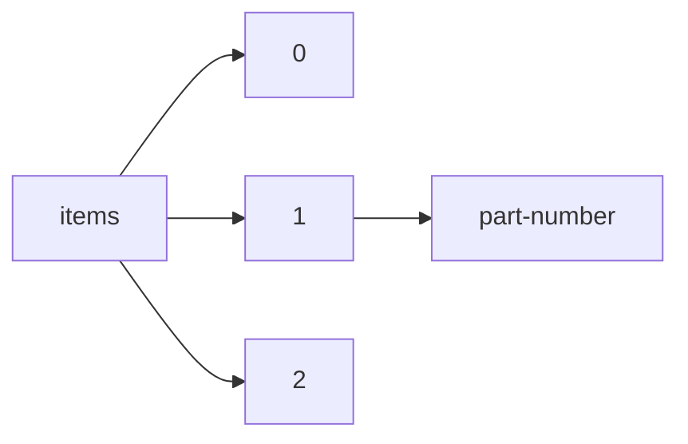

!!! warning "This document is not official Crossref documentation"
# Part-number
PATH = items/array/part-number(1)  
Occurs 1 068 times  
Unique values: 190  
{ .annotate }

1. A route to an element, for example:  
   The route "items/array/part-number" corresponds to navigating through the JSON indices as  
   ["items"][0]["part-number"]  

| **Row** | **Value** `String` | **Count** `Int64` |
|--------:|----------------------:|---------------------:|
| **1**   | 2                     | 256                  |
| **2**   | 1                     | 206                  |
| **3**   | 15                    | 41                   |
| **4**   | 4                     | 34                   |
| **5**   | 3                     | 33                   |
| **6**   | 5                     | 27                   |
| **7**   | 6                     | 20                   |
| **8**   | 11                    | 12                   |
| **9**   | 14                    | 11                   |
| **10**  | 13                    | 11                   |
| **11**  | 01                    | 11                   |
| **12**  | 10                    | 10                   |
| **13**  | 03                    | 9                    |
| **14**  | 07                    | 8                    |
| **15**  | 08                    | 8                    |
| **16**  | 12                    | 8                    |
| **17**  | 19                    | 8                    |
| **18**  | 21                    | 8                    |
| **19**  | 02                    | 8                    |
| **20**  | 06                    | 7                    |
| **21**  | 23                    | 7                    |
| **22**  | 20                    | 7                    |
| **23**  | 09                    | 7                    |
| **24**  | 16                    | 7                    |
| **25**  | 33-6                  | 6                    |
| **26**  | 05                    | 6                    |
| **27**  | 26                    | 6                    |
| **28**  | 24                    | 6                    |
| **29**  | 18                    | 6                    |
| **30**  | 22                    | 6                    |
| **31**  | 39                    | 5                    |
| **32**  | 25                    | 5                    |
| **33**  | 04                    | 5                    |
| **34**  | 44                    | 5                    |
| **35**  | 57                    | 5                    |
| **36**  | 54                    | 4                    |
| **37**  | 41                    | 4                    |
| **38**  | 53                    | 4                    |
| **39**  | 51                    | 4                    |
| **40**  | 49                    | 4                    |
| **41**  | 43                    | 4                    |
| **42**  | 55                    | 4                    |
| **43**  | 17                    | 4                    |
| **44**  | 45                    | 4                    |
| **45**  | 30                    | 4                    |
| **46**  | 29                    | 4                    |
| **47**  | 27                    | 4                    |
| **48**  | 50                    | 4                    |
| **49**  | 52                    | 4                    |
| **50**  | 58                    | 4                    |
| **51**  | 47                    | 4                    |
| **52**  | 46                    | 4                    |
| **53**  | 56                    | 4                    |
| **54**  | 32                    | 3                    |
| **55**  | 34                    | 3                    |
| **56**  | 37                    | 3                    |
| **57**  | 7                     | 3                    |
| **58**  | 38                    | 3                    |
| **59**  | 42                    | 3                    |
| **60**  | 33                    | 3                    |
| **61**  | 28                    | 3                    |
| **62**  | 31                    | 3                    |
| **63**  | 8                     | 3                    |
| **64**  | 36                    | 3                    |
| **65**  | 48                    | 3                    |
| **66**  | 77                    | 2                    |
| **67**  | 59                    | 2                    |
| **68**  | 9                     | 2                    |
| **69**  | 69                    | 2                    |
| **70**  | 35                    | 2                    |
| **71**  | 78                    | 2                    |
| **72**  | 80                    | 2                    |
| **73**  | 60                    | 2                    |
| **74**  | 40                    | 2                    |
| **75**  | 76                    | 2                    |
| **76**  | 264                   | 1                    |
| **77**  | 101                   | 1                    |
| **78**  | 228                   | 1                    |
| **79**  | 270                   | 1                    |
| **80**  | 227                   | 1                    |
| **81**  | 137/2018              | 1                    |
| **82**  | 223                   | 1                    |
| **83**  | 141                   | 1                    |
| **84**  | 287                   | 1                    |
| **85**  | 278                   | 1                    |
| **86**  | 250                   | 1                    |
| **87**  | 265                   | 1                    |
| **88**  | 230                   | 1                    |
| **89**  | 215                   | 1                    |
| **90**  | 258                   | 1                    |
| **91**  | XX                    | 1                    |
| **92**  | 253                   | 1                    |
| **93**  | 234                   | 1                    |
| **94**  | 237                   | 1                    |
| **95**  | 143                   | 1                    |
| **96**  | 243                   | 1                    |
| **97**  | 71                    | 1                    |
| **98**  | 226                   | 1                    |
| **99**  | 245                   | 1                    |
| **100** | 266                   | 1                    |
| **101** | 268                   | 1                    |
| **102** | 252                   | 1                    |
| **103** | 98                    | 1                    |
| **104** | 272                   | 1                    |
| **105** | 135/2016              | 1                    |
| **106** | 96                    | 1                    |
| **107** | 261                   | 1                    |
| **108** | XIX                   | 1                    |
| **109** | 254                   | 1                    |
| **110** | 140                   | 1                    |
| **111** | 257                   | 1                    |
| **112** | 102                   | 1                    |
| **113** | 282                   | 1                    |
| **114** | 97                    | 1                    |
| **115** | 242                   | 1                    |
| **116** | 221                   | 1                    |
| **117** | 235                   | 1                    |
| **118** | 260                   | 1                    |
| **119** | 239                   | 1                    |
| **120** | 133                   | 1                    |
| **121** | 240                   | 1                    |
| **122** | 283                   | 1                    |
| **123** | 276                   | 1                    |
| **124** | 246                   | 1                    |
| **125** | 263                   | 1                    |
| **126** | 132/2013              | 1                    |
| **127** | 244                   | 1                    |
| **128** | 139                   | 1                    |
| **129** | 241                   | 1                    |
| **130** | 81                    | 1                    |
| **131** | XVIII                 | 1                    |
| **132** | 74                    | 1                    |
| **133** | XXVI                  | 1                    |
| **134** | 236                   | 1                    |
| **135** | 75                    | 1                    |
| **136** | 130/2011              | 1                    |
| **137** | 224                   | 1                    |
| **138** | 281                   | 1                    |
| **139** | 255                   | 1                    |
| **140** | XXIII                 | 1                    |
| **141** | 275                   | 1                    |
| **142** | 274                   | 1                    |
| **143** | 279                   | 1                    |
| **144** | 280                   | 1                    |
| **145** | 225                   | 1                    |
| **146** | 286                   | 1                    |
| **147** | 259                   | 1                    |
| **148** | 249                   | 1                    |
| **149** | 99                    | 1                    |
| **150** | 73                    | 1                    |
| **151** | 285                   | 1                    |
| **152** | 79                    | 1                    |
| **153** | 146                   | 1                    |
| **154** | 219                   | 1                    |
| **155** | 256                   | 1                    |
| **156** | 136/2017              | 1                    |
| **157** | 238                   | 1                    |
| **158** | 267                   | 1                    |
| **159** | 70                    | 1                    |
| **160** | 269                   | 1                    |
| **161** | XXV                   | 1                    |
| **162** | 231                   | 1                    |
| **163** | 134/2015              | 1                    |
| **164** | XXIV                  | 1                    |
| **165** | 129/2010              | 1                    |
| **166** | 222                   | 1                    |
| **167** | XXI                   | 1                    |
| **168** | 284                   | 1                    |
| **169** | 133/2014              | 1                    |
| **170** | 233                   | 1                    |
| **171** | 229                   | 1                    |
| **172** | 273                   | 1                    |
| **173** | 144                   | 1                    |
| **174** | 271                   | 1                    |
| **175** | 61                    | 1                    |
| **176** | 277                   | 1                    |
| **177** | 247                   | 1                    |
| **178** | 100                   | 1                    |
| **179** | XXII                  | 1                    |
| **180** | 72                    | 1                    |
| **181** | 251                   | 1                    |
| **182** | 248                   | 1                    |
| **183** | 68                    | 1                    |
| **184** | 131/2012              | 1                    |
| **185** | 145                   | 1                    |
| **186** | 95                    | 1                    |
| **187** | 138                   | 1                    |
| **188** | 262                   | 1                    |
| **189** | 103                   | 1                    |
| **190** | 232                   | 1                    |

