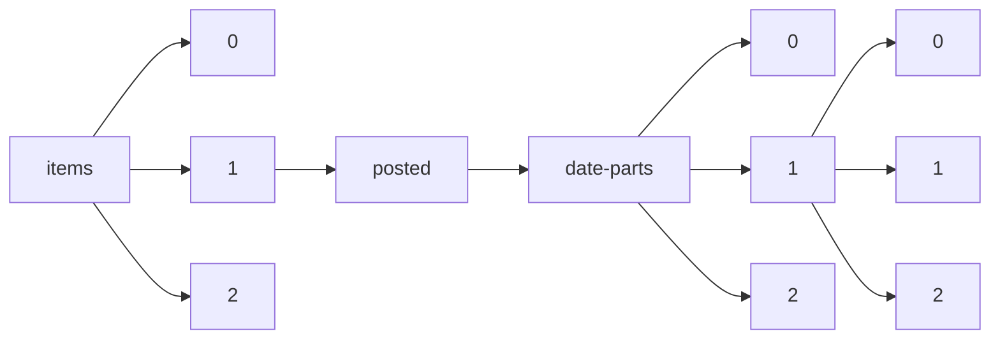

!!! warning "This document is not official Crossref documentation"
# Elements
PATH = items/array/posted/date-parts/array/array(1)  
Occurs 3 548 402 times  
Unique values: 89  
{ .annotate }

1. A route to an element, for example:  
   The route "items/array/posted/date-parts/array/array" corresponds to navigating through the JSON indices as  
   ["items"][0]["posted"]["date-parts"][0][0]  

| **Row** | **Value** `Int64` | **Count** `Int64` |
|--------:|---------------------:|---------------------:|
| **1**   | 2 021                | 251 488              |
| **2**   | 2 020                | 247 228              |
| **3**   | 2 022                | 231 974              |
| **4**   | 3                    | 231 379              |
| **5**   | 5                    | 138 176              |
| **6**   | 2                    | 134 427              |
| **7**   | 9                    | 127 449              |
| **8**   | 10                   | 125 998              |
| **9**   | 6                    | 125 457              |
| **10**  | 2 023                | 125 356              |
| **11**  | 4                    | 124 607              |
| **12**  | 7                    | 122 746              |
| **13**  | 8                    | 121 912              |
| **14**  | 1                    | 119 599              |
| **15**  | 2 019                | 118 886              |
| **16**  | 11                   | 117 715              |
| **17**  | 12                   | 116 247              |
| **18**  | 2 018                | 90 303               |
| **19**  | 30                   | 68 054               |
| **20**  | 2 017                | 59 657               |
| **21**  | 23                   | 58 019               |
| **22**  | 22                   | 44 489               |
| **23**  | 28                   | 42 223               |
| **24**  | 26                   | 40 144               |
| **25**  | 16                   | 40 012               |
| **26**  | 27                   | 38 555               |
| **27**  | 20                   | 37 544               |
| **28**  | 21                   | 37 465               |
| **29**  | 24                   | 36 734               |
| **30**  | 15                   | 36 328               |
| **31**  | 17                   | 35 585               |
| **32**  | 25                   | 35 577               |
| **33**  | 31                   | 35 333               |
| **34**  | 13                   | 34 787               |
| **35**  | 18                   | 34 604               |
| **36**  | 14                   | 34 381               |
| **37**  | 29                   | 33 453               |
| **38**  | 19                   | 33 417               |
| **39**  | 2 016                | 27 598               |
| **40**  | 2 015                | 8 345                |
| **41**  | 2 014                | 5 715                |
| **42**  | 2 013                | 4 103                |
| **43**  | 2 012                | 3 259                |
| **44**  | 2 011                | 2 644                |
| **45**  | 2 010                | 2 171                |
| **46**  | 2 009                | 1 916                |
| **47**  | 2 008                | 1 349                |
| **48**  | 2 007                | 939                  |
| **49**  | 2 006                | 707                  |
| **50**  | 2 005                | 547                  |
| **51**  | 2 004                | 330                  |
| **52**  | 2 003                | 242                  |
| **53**  | 1 998                | 131                  |
| **54**  | 2 002                | 130                  |
| **55**  | 2 001                | 88                   |
| **56**  | 1 991                | 86                   |
| **57**  | 1 995                | 72                   |
| **58**  | 1 997                | 68                   |
| **59**  | 1 992                | 63                   |
| **60**  | 1 994                | 59                   |
| **61**  | 1 999                | 52                   |
| **62**  | 1 996                | 50                   |
| **63**  | 1 987                | 48                   |
| **64**  | 2 000                | 43                   |
| **65**  | 1 989                | 39                   |
| **66**  | 1 988                | 34                   |
| **67**  | 1 993                | 32                   |
| **68**  | 1 986                | 28                   |
| **69**  | 1 985                | 24                   |
| **70**  | 1 990                | 24                   |
| **71**  | 1 984                | 19                   |
| **72**  | 1 983                | 18                   |
| **73**  | 1 977                | 18                   |
| **74**  | 1 981                | 16                   |
| **75**  | 1 980                | 15                   |
| **76**  | 1 979                | 13                   |
| **77**  | 1 976                | 11                   |
| **78**  | 1 982                | 11                   |
| **79**  | 1 978                | 11                   |
| **80**  | 1 975                | 8                    |
| **81**  | 1 971                | 5                    |
| **82**  | 1 970                | 4                    |
| **83**  | 1 974                | 3                    |
| **84**  | 1 967                | 1                    |
| **85**  | 2 055                | 1                    |
| **86**  | 1 972                | 1                    |
| **87**  | 1 954                | 1                    |
| **88**  | 1 973                | 1                    |
| **89**  | 1 968                | 1                    |

