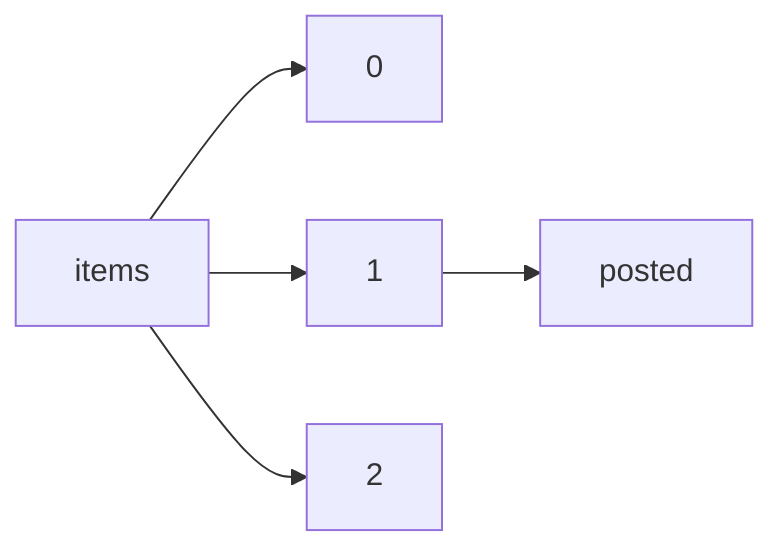

!!! warning "This document is not official Crossref documentation"
# Posted
PATH = items/array/posted(1)  
Occurs 1 185 986 times  
{ .annotate }

1. A route to an element, for example:  
   The route "items/array/posted" corresponds to navigating through the JSON indices as  
   ["items"][0]["posted"]  

## Date-parts
See more information: [items/array/posted/date-parts](date-parts/index.md)  
Occurs 1 185 986 timess  

| **Row** | **Length** `Any` | **Count** `Int64` |
|--------:|--------------------:|---------------------:|
| **1**   | 1                   | 1 185 986            |

