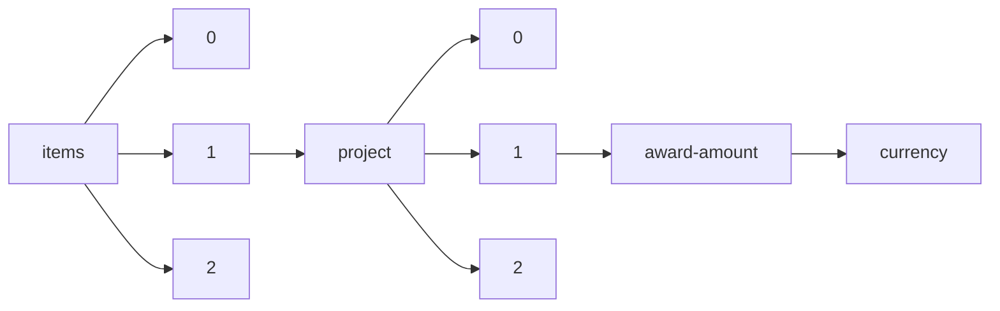

!!! warning "This document is not official Crossref documentation"
# Currency
PATH = items/array/project/array/award-amount/currency(1)  
Occurs 52 198 times  
Unique values: 11  
{ .annotate }

1. A route to an element, for example:  
   The route "items/array/project/array/award-amount/currency" corresponds to navigating through the JSON indices as  
   ["items"][0]["project"][0]["award-amount"]["currency"]  

| **Row** | **Value** `U{Nothing, String}` | **Count** `Int64` |
|--------:|----------------------------------:|---------------------:|
| **1**   | EUR                               | 36 034               |
| **2**   | GBP                               | 12 549               |
| **3**   | nothing                           | 2 351                |
| **4**   | USD                               | 1 170                |
| **5**   | AUD                               | 83                   |
| **6**   | INR                               | 4                    |
| **7**   | CHF                               | 2                    |
| **8**   | ZAR                               | 2                    |
| **9**   | SGD                               | 1                    |
| **10**  | CAD                               | 1                    |
| **11**  | NOK                               | 1                    |

