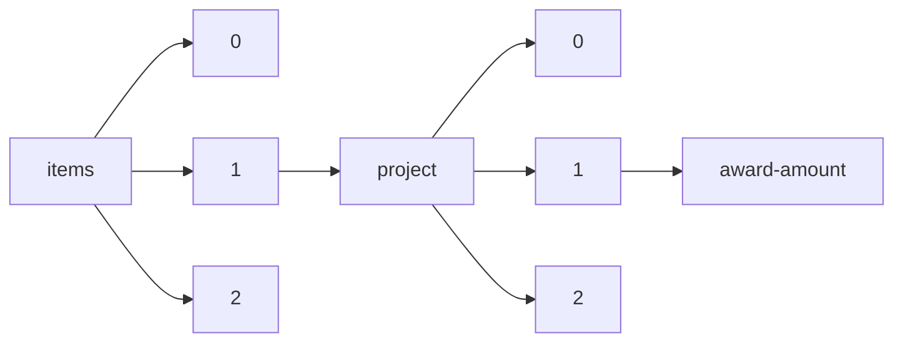

!!! warning "This document is not official Crossref documentation"
# Award-amount
PATH = items/array/project/array/award-amount(1)  
Occurs 52 198 times  
{ .annotate }

1. A route to an element, for example:  
   The route "items/array/project/array/award-amount" corresponds to navigating through the JSON indices as  
   ["items"][0]["project"][0]["award-amount"]  

## Amount
See more information: [items/array/project/array/award-amount/amount](amount/index.md)  
Occurs 52 198 timess  
Unique values: > 999  

!!! note "Due to current limitations, only the first 1,000 unique values are counted."

| **Row** | **Value** `Real` | **Count** `Int64` |
|--------:|--------------------:|---------------------:|
| **1**   | 50 000              | 4 408                |
| **2**   | 150 000             | 875                  |
| **3**   | 1.83455e5           | 778                  |
| **4**   | 1.95455e5           | 684                  |
| **5**   | 1 500 000           | 513                  |
| **6**   | 250 000             | 359                  |
| **7**   | 2 000 000           | 343                  |
| **8**   | 2 500 000           | 307                  |
| **9**   | 2 000               | 304                  |
| **10**  | 100 000             | 296                  |
| ... | ... | ... |

## Currency
See more information: [items/array/project/array/award-amount/currency](currency/index.md)  
Occurs 52 198 timess  
Unique values: 11  

| **Row** | **Value** `U{Nothing, String}` | **Count** `Int64` |
|--------:|----------------------------------:|---------------------:|
| **1**   | EUR                               | 36 034               |
| **2**   | GBP                               | 12 549               |
| **3**   | nothing                           | 2 351                |
| **4**   | USD                               | 1 170                |
| **5**   | AUD                               | 83                   |
| **6**   | INR                               | 4                    |
| **7**   | CHF                               | 2                    |
| **8**   | ZAR                               | 2                    |
| **9**   | SGD                               | 1                    |
| **10**  | CAD                               | 1                    |
| ... | ... | ... |

