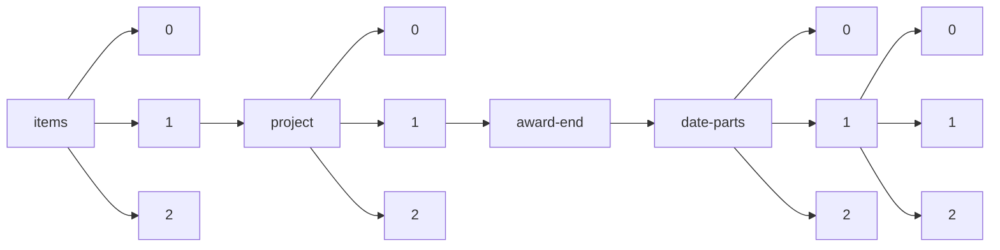

!!! warning "This document is not official Crossref documentation"
# Elements
PATH = items/array/project/array/award-end/date-parts/array/array(1)  
Occurs 182 484 times  
Unique values: 79  
{ .annotate }

1. A route to an element, for example:  
   The route "items/array/project/array/award-end/date-parts/array/array" corresponds to navigating through the JSON indices as  
   ["items"][0]["project"][0]["award-end"]["date-parts"][0][0]  

| **Row** | **Value** `Int64` | **Count** `Int64` |
|--------:|---------------------:|---------------------:|
| **1**   | 31                   | 34 112               |
| **2**   | 30                   | 14 864               |
| **3**   | 3                    | 13 722               |
| **4**   | 9                    | 7 589                |
| **5**   | 12                   | 6 963                |
| **6**   | 8                    | 6 083                |
| **7**   | 1                    | 5 491                |
| **8**   | 2 019                | 5 471                |
| **9**   | 2 021                | 5 262                |
| **10**  | 2 020                | 4 937                |
| **11**  | 2 018                | 4 914                |
| **12**  | 2 022                | 4 824                |
| **13**  | 2 023                | 4 410                |
| **14**  | 6                    | 4 053                |
| **15**  | 10                   | 4 001                |
| **16**  | 2 017                | 3 993                |
| **17**  | 2                    | 3 898                |
| **18**  | 5                    | 3 856                |
| **19**  | 2 024                | 3 789                |
| **20**  | 4                    | 3 552                |
| **21**  | 7                    | 3 338                |
| **22**  | 11                   | 3 323                |
| **23**  | 2 025                | 2 409                |
| **24**  | 28                   | 2 326                |
| **25**  | 2 016                | 2 312                |
| **26**  | 2 015                | 2 091                |
| **27**  | 2 026                | 1 403                |
| **28**  | 2 014                | 1 185                |
| **29**  | 2 005                | 1 151                |
| **30**  | 2 012                | 1 093                |
| **31**  | 2 006                | 1 092                |
| **32**  | 2 013                | 1 085                |
| **33**  | 2 027                | 1 065                |
| **34**  | 2 011                | 1 047                |
| **35**  | 29                   | 1 043                |
| **36**  | 2 010                | 994                  |
| **37**  | 2 007                | 964                  |
| **38**  | 2 008                | 963                  |
| **39**  | 2 009                | 919                  |
| **40**  | 2 004                | 885                  |
| **41**  | 2 003                | 741                  |
| **42**  | 14                   | 739                  |
| **43**  | 2 002                | 563                  |
| **44**  | 2 028                | 403                  |
| **45**  | 15                   | 389                  |
| **46**  | 2 001                | 378                  |
| **47**  | 13                   | 223                  |
| **48**  | 17                   | 216                  |
| **49**  | 16                   | 205                  |
| **50**  | 21                   | 202                  |
| **51**  | 19                   | 200                  |
| **52**  | 20                   | 191                  |
| **53**  | 22                   | 180                  |
| **54**  | 2 000                | 175                  |
| **55**  | 27                   | 171                  |
| **56**  | 18                   | 163                  |
| **57**  | 25                   | 160                  |
| **58**  | 24                   | 142                  |
| **59**  | 23                   | 131                  |
| **60**  | 26                   | 130                  |
| **61**  | 1 999                | 50                   |
| **62**  | 1 998                | 47                   |
| **63**  | 1 995                | 46                   |
| **64**  | 1 997                | 37                   |
| **65**  | 1 996                | 26                   |
| **66**  | 1 989                | 15                   |
| **67**  | 2 029                | 12                   |
| **68**  | 1 994                | 11                   |
| **69**  | 2 030                | 10                   |
| **70**  | 1 987                | 9                    |
| **71**  | 1 990                | 9                    |
| **72**  | 1 992                | 9                    |
| **73**  | 1 991                | 7                    |
| **74**  | 2 031                | 6                    |
| **75**  | 1 993                | 6                    |
| **76**  | 1 988                | 4                    |
| **77**  | 1 986                | 4                    |
| **78**  | 1 985                | 1                    |
| **79**  | 2 033                | 1                    |

