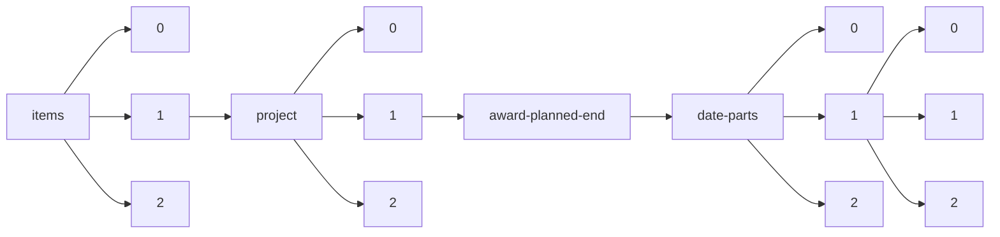

!!! warning "This document is not official Crossref documentation"
# Elements
PATH = items/array/project/array/award-planned-end/date-parts/array/array(1)  
Occurs 91 338 times  
Unique values: 48  
{ .annotate }

1. A route to an element, for example:  
   The route "items/array/project/array/award-planned-end/date-parts/array/array" corresponds to navigating through the JSON indices as  
   ["items"][0]["project"][0]["award-planned-end"]["date-parts"][0][0]  

| **Row** | **Value** `Int64` | **Count** `Int64` |
|--------:|---------------------:|---------------------:|
| **1**   | 31                   | 16 836               |
| **2**   | 30                   | 8 683                |
| **3**   | 12                   | 4 244                |
| **4**   | 2 019                | 4 041                |
| **5**   | 8                    | 3 969                |
| **6**   | 2 021                | 3 646                |
| **7**   | 2 018                | 3 625                |
| **8**   | 2 020                | 3 428                |
| **9**   | 9                    | 3 224                |
| **10**  | 2 023                | 2 822                |
| **11**  | 2 024                | 2 693                |
| **12**  | 3                    | 2 653                |
| **13**  | 2                    | 2 484                |
| **14**  | 5                    | 2 464                |
| **15**  | 2 022                | 2 390                |
| **16**  | 6                    | 2 344                |
| **17**  | 2 017                | 2 217                |
| **18**  | 4                    | 2 210                |
| **19**  | 10                   | 2 187                |
| **20**  | 1                    | 2 133                |
| **21**  | 11                   | 2 112                |
| **22**  | 7                    | 1 668                |
| **23**  | 28                   | 1 603                |
| **24**  | 2 025                | 1 583                |
| **25**  | 2 016                | 1 032                |
| **26**  | 2 026                | 1 027                |
| **27**  | 2 027                | 905                  |
| **28**  | 2 015                | 806                  |
| **29**  | 29                   | 743                  |
| **30**  | 14                   | 377                  |
| **31**  | 15                   | 165                  |
| **32**  | 2 028                | 126                  |
| **33**  | 2 014                | 89                   |
| **34**  | 16                   | 87                   |
| **35**  | 13                   | 79                   |
| **36**  | 17                   | 76                   |
| **37**  | 20                   | 74                   |
| **38**  | 21                   | 72                   |
| **39**  | 19                   | 70                   |
| **40**  | 22                   | 64                   |
| **41**  | 18                   | 58                   |
| **42**  | 24                   | 47                   |
| **43**  | 23                   | 43                   |
| **44**  | 27                   | 43                   |
| **45**  | 25                   | 42                   |
| **46**  | 26                   | 38                   |
| **47**  | 2 029                | 9                    |
| **48**  | 1 999                | 7                    |

