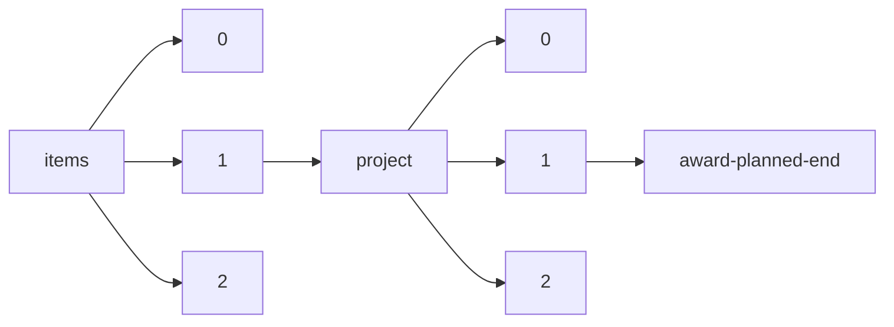

!!! warning "This document is not official Crossref documentation"
# Award-planned-end
PATH = items/array/project/array/award-planned-end(1)  
Occurs 30 446 times  
{ .annotate }

1. A route to an element, for example:  
   The route "items/array/project/array/award-planned-end" corresponds to navigating through the JSON indices as  
   ["items"][0]["project"][0]["award-planned-end"]  

## Date-parts
See more information: [items/array/project/array/award-planned-end/date-parts](date-parts/index.md)  
Occurs 30 446 timess  

| **Row** | **Length** `Any` | **Count** `Int64` |
|--------:|--------------------:|---------------------:|
| **1**   | 1                   | 30 446               |

