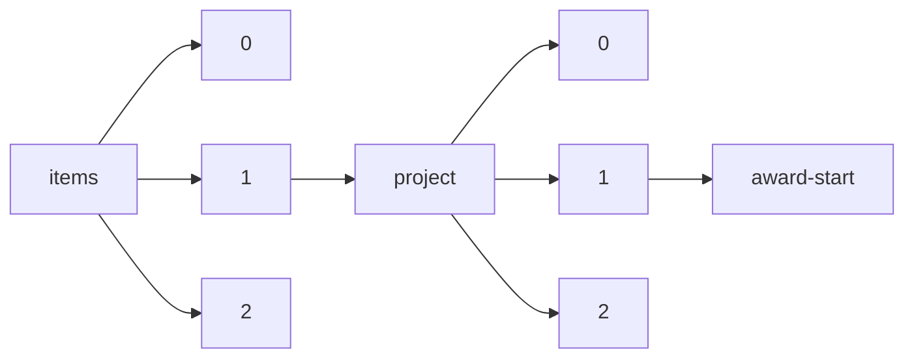

!!! warning "This document is not official Crossref documentation"
# Award-start
PATH = items/array/project/array/award-start(1)  
Occurs 67 427 times  
{ .annotate }

1. A route to an element, for example:  
   The route "items/array/project/array/award-start" corresponds to navigating through the JSON indices as  
   ["items"][0]["project"][0]["award-start"]  

## Date-parts
See more information: [items/array/project/array/award-start/date-parts](date-parts/index.md)  
Occurs 67 427 timess  

| **Row** | **Length** `Any` | **Count** `Int64` |
|--------:|--------------------:|---------------------:|
| **1**   | 1                   | 67 427               |

