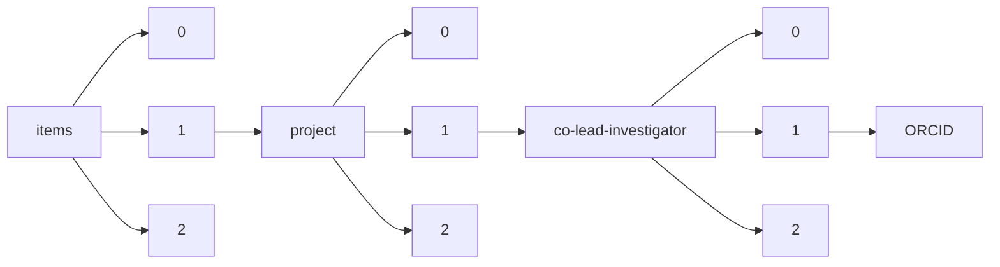

!!! warning "This document is not official Crossref documentation"
# ORCID
PATH = items/array/project/array/co-lead-investigator/array/ORCID(1)  
Occurs 143 times  
Unique values: 126  
{ .annotate }

1. A route to an element, for example:  
   The route "items/array/project/array/co-lead-investigator/array/ORCID" corresponds to navigating through the JSON indices as  
   ["items"][0]["project"][0]["co-lead-investigator"][0]["ORCID"]  

| **Row** | **Value** `String`                | **Count** `Int64` |
|--------:|-------------------------------------:|---------------------:|
| **1**   | http://orcid.org/0000-0003-1586-2167 | 5                    |
| **2**   | http://orcid.org/0000-0001-9118-8480 | 3                    |
| **3**   | http://orcid.org/0000-0003-2046-5270 | 3                    |
| **4**   | http://orcid.org/0000-0003-0178-4225 | 2                    |
| **5**   | http://orcid.org/0000-0001-6107-3666 | 2                    |
| **6**   | http://orcid.org/0000-0001-6437-7809 | 2                    |
| **7**   | http://orcid.org/0000-0003-2502-2671 | 2                    |
| **8**   | http://orcid.org/0000-0002-0462-8132 | 2                    |
| **9**   | http://orcid.org/0000-0002-1873-3929 | 2                    |
| **10**  | http://orcid.org/0000-0002-6905-6841 | 2                    |
| **11**  | http://orcid.org/0000-0003-0557-7338 | 2                    |
| **12**  | http://orcid.org/0000-0002-3420-1332 | 2                    |
| **13**  | http://orcid.org/0000-0002-2561-2914 | 1                    |
| **14**  | http://orcid.org/0000-0002-6774-8043 | 1                    |
| **15**  | http://orcid.org/0000-0002-7229-7072 | 1                    |
| **16**  | http://orcid.org/0000-0002-4028-7996 | 1                    |
| **17**  | http://orcid.org/0000-0003-0307-9343 | 1                    |
| **18**  | http://orcid.org/0000-0001-6979-7909 | 1                    |
| **19**  | http://orcid.org/0000-0003-1161-5687 | 1                    |
| **20**  | http://orcid.org/0000-0001-5293-5287 | 1                    |
| **21**  | http://orcid.org/0000-0002-4439-2398 | 1                    |
| **22**  | http://orcid.org/0000-0001-7790-4807 | 1                    |
| **23**  | http://orcid.org/0000-0002-3719-1889 | 1                    |
| **24**  | http://orcid.org/0000-0002-4946-8988 | 1                    |
| **25**  | http://orcid.org/0000-0002-5503-8319 | 1                    |
| **26**  | http://orcid.org/0000-0002-4623-7076 | 1                    |
| **27**  | http://orcid.org/0000-0003-1093-5478 | 1                    |
| **28**  | http://orcid.org/0000-0002-9103-0007 | 1                    |
| **29**  | http://orcid.org/0000-0001-6022-6050 | 1                    |
| **30**  | http://orcid.org/0000-0002-8682-1453 | 1                    |
| **31**  | http://orcid.org/0000-0002-4483-0116 | 1                    |
| **32**  | http://orcid.org/0000-0003-3523-4408 | 1                    |
| **33**  | http://orcid.org/0000-0002-0666-2019 | 1                    |
| **34**  | http://orcid.org/0000-0002-4281-4630 | 1                    |
| **35**  | http://orcid.org/0000-0001-5173-0626 | 1                    |
| **36**  | http://orcid.org/0000-0002-9540-8070 | 1                    |
| **37**  | http://orcid.org/0000-0002-1486-7591 | 1                    |
| **38**  | http://orcid.org/0000-0003-0239-1976 | 1                    |
| **39**  | http://orcid.org/0000-0003-4943-9455 | 1                    |
| **40**  | http://orcid.org/0000-0002-1708-8315 | 1                    |
| **41**  | http://orcid.org/0000-0001-8965-9319 | 1                    |
| **42**  | http://orcid.org/0000-0001-7934-7987 | 1                    |
| **43**  | http://orcid.org/0000-0002-5592-3588 | 1                    |
| **44**  | http://orcid.org/0000-0003-4317-7263 | 1                    |
| **45**  | http://orcid.org/0000-0002-3901-2039 | 1                    |
| **46**  | http://orcid.org/0000-0002-1583-1291 | 1                    |
| **47**  | http://orcid.org/0000-0002-7347-1247 | 1                    |
| **48**  | http://orcid.org/0000-0002-8864-5772 | 1                    |
| **49**  | http://orcid.org/0000-0001-5916-9693 | 1                    |
| **50**  | http://orcid.org/0000-0002-0429-3627 | 1                    |
| **51**  | http://orcid.org/0000-0002-1609-9004 | 1                    |
| **52**  | http://orcid.org/0000-0002-9704-9788 | 1                    |
| **53**  | http://orcid.org/0000-0001-5503-0213 | 1                    |
| **54**  | http://orcid.org/0000-0003-3575-3224 | 1                    |
| **55**  | http://orcid.org/0000-0002-7487-8014 | 1                    |
| **56**  | http://orcid.org/0000-0003-3098-1615 | 1                    |
| **57**  | http://orcid.org/0000-0001-9738-3412 | 1                    |
| **58**  | http://orcid.org/0000-0001-5008-1476 | 1                    |
| **59**  | http://orcid.org/0000-0003-3535-2076 | 1                    |
| **60**  | http://orcid.org/0000-0001-6342-6461 | 1                    |
| **61**  | http://orcid.org/0000-0001-5193-5488 | 1                    |
| **62**  | http://orcid.org/0000-0002-3416-3401 | 1                    |
| **63**  | http://orcid.org/0000-0001-9033-3623 | 1                    |
| **64**  | http://orcid.org/0000-0001-6117-8601 | 1                    |
| **65**  | http://orcid.org/0000-0003-0165-8202 | 1                    |
| **66**  | http://orcid.org/0000-0002-5284-2897 | 1                    |
| **67**  | http://orcid.org/0000-0002-5416-0566 | 1                    |
| **68**  | http://orcid.org/0000-0002-8962-9897 | 1                    |
| **69**  | http://orcid.org/0000-0003-0573-6917 | 1                    |
| **70**  | http://orcid.org/0000-0002-4180-9397 | 1                    |
| **71**  | http://orcid.org/0000-0001-6565-9584 | 1                    |
| **72**  | http://orcid.org/0000-0001-7070-6541 | 1                    |
| **73**  | http://orcid.org/0000-0002-8114-8300 | 1                    |
| **74**  | http://orcid.org/0000-0002-7721-4782 | 1                    |
| **75**  | http://orcid.org/0000-0002-3612-9346 | 1                    |
| **76**  | http://orcid.org/0000-0003-0279-7191 | 1                    |
| **77**  | http://orcid.org/0000-0002-8453-8435 | 1                    |
| **78**  | http://orcid.org/0000-0002-0986-9015 | 1                    |
| **79**  | http://orcid.org/0000-0001-7046-8408 | 1                    |
| **80**  | http://orcid.org/0000-0003-3983-9009 | 1                    |
| **81**  | http://orcid.org/0000-0001-7060-0915 | 1                    |
| **82**  | http://orcid.org/0000-0001-7229-2071 | 1                    |
| **83**  | http://orcid.org/0000-0002-2170-0773 | 1                    |
| **84**  | http://orcid.org/0000-0002-4407-6205 | 1                    |
| **85**  | http://orcid.org/0000-0001-8610-7551 | 1                    |
| **86**  | http://orcid.org/0000-0003-0813-2211 | 1                    |
| **87**  | http://orcid.org/0000-0003-3781-2566 | 1                    |
| **88**  | http://orcid.org/0000-0003-2966-5527 | 1                    |
| **89**  | http://orcid.org/0000-0002-7013-4026 | 1                    |
| **90**  | http://orcid.org/0000-0002-8384-1926 | 1                    |
| **91**  | http://orcid.org/0000-0003-3477-6424 | 1                    |
| **92**  | http://orcid.org/0000-0002-9194-5493 | 1                    |
| **93**  | http://orcid.org/0000-0003-3915-7040 | 1                    |
| **94**  | http://orcid.org/0000-0002-3258-5379 | 1                    |
| **95**  | http://orcid.org/0000-0002-1986-4357 | 1                    |
| **96**  | http://orcid.org/0000-0001-6713-2129 | 1                    |
| **97**  | http://orcid.org/0000-0003-2692-2890 | 1                    |
| **98**  | http://orcid.org/0000-0002-7376-5923 | 1                    |
| **99**  | http://orcid.org/0000-0003-0266-0697 | 1                    |
| **100** | http://orcid.org/0000-0002-5099-3659 | 1                    |
| **101** | http://orcid.org/0000-0001-7509-2016 | 1                    |
| **102** | http://orcid.org/0000-0002-8866-2126 | 1                    |
| **103** | http://orcid.org/0000-0002-6985-2485 | 1                    |
| **104** | http://orcid.org/0000-0001-7417-0991 | 1                    |
| **105** | http://orcid.org/0000-0002-2351-2362 | 1                    |
| **106** | http://orcid.org/0000-0003-3365-5233 | 1                    |
| **107** | http://orcid.org/0000-0002-5552-2151 | 1                    |
| **108** | http://orcid.org/0000-0002-6570-3837 | 1                    |
| **109** | http://orcid.org/0000-0002-4056-2695 | 1                    |
| **110** | http://orcid.org/0000-0003-3949-3634 | 1                    |
| **111** | http://orcid.org/0000-0002-2574-2225 | 1                    |
| **112** | http://orcid.org/0000-0001-6424-4133 | 1                    |
| **113** | http://orcid.org/0000-0002-0226-7337 | 1                    |
| **114** | http://orcid.org/0000-0001-8692-1326 | 1                    |
| **115** | http://orcid.org/0000-0002-4932-6699 | 1                    |
| **116** | http://orcid.org/0000-0002-4076-1950 | 1                    |
| **117** | http://orcid.org/0000-0002-9822-8251 | 1                    |
| **118** | http://orcid.org/0000-0002-2352-5454 | 1                    |
| **119** | http://orcid.org/0000-0003-2985-8249 | 1                    |
| **120** | http://orcid.org/0000-0002-4501-9587 | 1                    |
| **121** | http://orcid.org/0000-0003-1928-5555 | 1                    |
| **122** | http://orcid.org/0000-0002-6514-6911 | 1                    |
| **123** | http://orcid.org/0000-0001-6141-2015 | 1                    |
| **124** | http://orcid.org/0000-0001-9227-8701 | 1                    |
| **125** | http://orcid.org/0000-0001-8760-0743 | 1                    |
| **126** | http://orcid.org/0000-0001-6156-5310 | 1                    |

