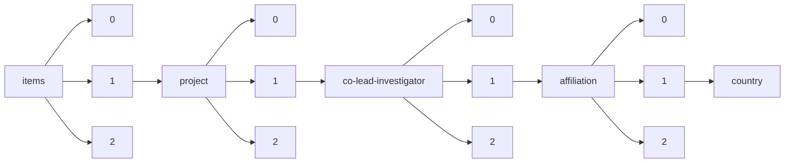

!!! warning "This document is not official Crossref documentation"
# Country
PATH = items/array/project/array/co-lead-investigator/array/affiliation/array/country(1)  
Occurs 192 times  
Unique values: 5  
{ .annotate }

1. A route to an element, for example:  
   The route "items/array/project/array/co-lead-investigator/array/affiliation/array/country" corresponds to navigating through the JSON indices as  
   ["items"][0]["project"][0]["co-lead-investigator"][0]["affiliation"][0]["country"]  

| **Row** | **Value** `String` | **Count** `Int64` |
|--------:|----------------------:|---------------------:|
| **1**   | US                    | 187                  |
| **2**   | ES                    | 2                    |
| **3**   | BR                    | 1                    |
| **4**   | JP                    | 1                    |
| **5**   | GB                    | 1                    |

