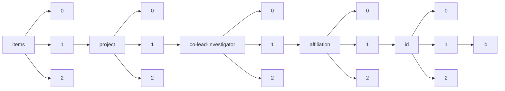

!!! warning "This document is not official Crossref documentation"
# Id
PATH = items/array/project/array/co-lead-investigator/array/affiliation/array/id/array/id(1)  
Occurs 163 times  
Unique values: 46  
{ .annotate }

1. A route to an element, for example:  
   The route "items/array/project/array/co-lead-investigator/array/affiliation/array/id/array/id" corresponds to navigating through the JSON indices as  
   ["items"][0]["project"][0]["co-lead-investigator"][0]["affiliation"][0]["id"][0]["id"]  

| **Row** | **Value** `String`     | **Count** `Int64` |
|--------:|--------------------------:|---------------------:|
| **1**   | https://ror.org/05h992307 | 65                   |
| **2**   | https://ror.org/04rc0xn13 | 16                   |
| **3**   | https://ror.org/041nk4h53 | 6                    |
| **4**   | https://ror.org/05dk0ce17 | 5                    |
| **5**   | https://ror.org/01an7q238 | 5                    |
| **6**   | https://ror.org/02jbv0t02 | 4                    |
| **7**   | https://ror.org/02ex6cf31 | 4                    |
| **8**   | https://ror.org/01fpczx89 | 3                    |
| **9**   | https://ror.org/03k1gpj17 | 3                    |
| **10**  | https://ror.org/02gz6gg07 | 3                    |
| **11**  | https://ror.org/01hgj5t98 | 2                    |
| **12**  | https://ror.org/04nz0wq19 | 2                    |
| **13**  | https://ror.org/0153tk833 | 2                    |
| **14**  | https://ror.org/026h4ma68 | 2                    |
| **15**  | https://ror.org/01qz5mb56 | 2                    |
| **16**  | https://ror.org/0036rpn28 | 2                    |
| **17**  | https://ror.org/02dgjyy92 | 2                    |
| **18**  | https://ror.org/05hs6h993 | 2                    |
| **19**  | https://ror.org/02336z538 | 2                    |
| **20**  | https://ror.org/04xtx5t16 | 2                    |
| **21**  | https://ror.org/01f5ytq51 | 2                    |
| **22**  | https://ror.org/00gz53f50 | 2                    |
| **23**  | https://ror.org/03r0ha626 | 2                    |
| **24**  | https://ror.org/00hj8s172 | 1                    |
| **25**  | https://ror.org/00cvxb145 | 1                    |
| **26**  | https://ror.org/04gnp7x40 | 1                    |
| **27**  | https://ror.org/01yc7t268 | 1                    |
| **28**  | https://ror.org/02d2m2044 | 1                    |
| **29**  | https://ror.org/05gvnxz63 | 1                    |
| **30**  | https://ror.org/025r5qe02 | 1                    |
| **31**  | https://ror.org/02catss52 | 1                    |
| **32**  | https://ror.org/0272j5188 | 1                    |
| **33**  | https://ror.org/03yxnpp24 | 1                    |
| **34**  | https://ror.org/04raf6v53 | 1                    |
| **35**  | https://ror.org/019wvm592 | 1                    |
| **36**  | https://ror.org/02k3smh20 | 1                    |
| **37**  | https://ror.org/01e41cf67 | 1                    |
| **38**  | https://ror.org/02twcfp32 | 1                    |
| **39**  | https://ror.org/049s0rh22 | 1                    |
| **40**  | https://ror.org/01tq9ra93 | 1                    |
| **41**  | https://ror.org/03m2x1q45 | 1                    |
| **42**  | https://ror.org/05h3vs194 | 1                    |
| **43**  | https://ror.org/00khy9f46 | 1                    |
| **44**  | https://ror.org/00wmhkr98 | 1                    |
| **45**  | https://ror.org/05qwgg493 | 1                    |
| **46**  | https://ror.org/02aze4h65 | 1                    |

