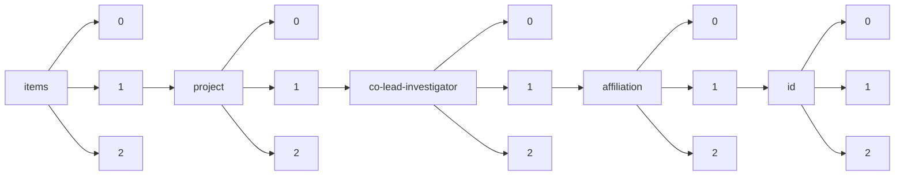

!!! warning "This document is not official Crossref documentation"
# Elements
PATH = items/array/project/array/co-lead-investigator/array/affiliation/array/id/array(1)  
Occurs 163 times  
{ .annotate }

1. A route to an element, for example:  
   The route "items/array/project/array/co-lead-investigator/array/affiliation/array/id/array" corresponds to navigating through the JSON indices as  
   ["items"][0]["project"][0]["co-lead-investigator"][0]["affiliation"][0]["id"][0]  

## Asserted-by
See more information: [items/array/project/array/co-lead-investigator/array/affiliation/array/id/array/asserted-by](asserted-by/index.md)  
Occurs 163 timess  
Unique values: 1  

| **Row** | **Value** `String` | **Count** `Int64` |
|--------:|----------------------:|---------------------:|
| **1**   | publisher             | 163                  |

## Id
See more information: [items/array/project/array/co-lead-investigator/array/affiliation/array/id/array/id](id/index.md)  
Occurs 163 timess  
Unique values: 46  

| **Row** | **Value** `String`     | **Count** `Int64` |
|--------:|--------------------------:|---------------------:|
| **1**   | https://ror.org/05h992307 | 65                   |
| **2**   | https://ror.org/04rc0xn13 | 16                   |
| **3**   | https://ror.org/041nk4h53 | 6                    |
| **4**   | https://ror.org/05dk0ce17 | 5                    |
| **5**   | https://ror.org/01an7q238 | 5                    |
| **6**   | https://ror.org/02jbv0t02 | 4                    |
| **7**   | https://ror.org/02ex6cf31 | 4                    |
| **8**   | https://ror.org/01fpczx89 | 3                    |
| **9**   | https://ror.org/03k1gpj17 | 3                    |
| **10**  | https://ror.org/02gz6gg07 | 3                    |
| ... | ... | ... |

## Id-type
See more information: [items/array/project/array/co-lead-investigator/array/affiliation/array/id/array/id-type](id-type/index.md)  
Occurs 163 timess  
Unique values: 1  

| **Row** | **Value** `String` | **Count** `Int64` |
|--------:|----------------------:|---------------------:|
| **1**   | ROR                   | 163                  |

