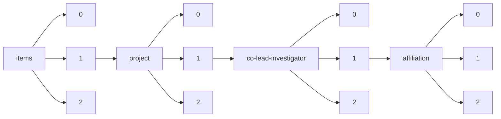

!!! warning "This document is not official Crossref documentation"
# Elements
PATH = items/array/project/array/co-lead-investigator/array/affiliation/array(1)  
Occurs 970 times  
{ .annotate }

1. A route to an element, for example:  
   The route "items/array/project/array/co-lead-investigator/array/affiliation/array" corresponds to navigating through the JSON indices as  
   ["items"][0]["project"][0]["co-lead-investigator"][0]["affiliation"][0]  

## Country
See more information: [items/array/project/array/co-lead-investigator/array/affiliation/array/country](country/index.md)  
Occurs 192 timess  
Unique values: 5  

| **Row** | **Value** `String` | **Count** `Int64` |
|--------:|----------------------:|---------------------:|
| **1**   | US                    | 187                  |
| **2**   | ES                    | 2                    |
| **3**   | BR                    | 1                    |
| **4**   | JP                    | 1                    |
| **5**   | GB                    | 1                    |

## Id
See more information: [items/array/project/array/co-lead-investigator/array/affiliation/array/id](id/index.md)  
Occurs 163 timess  

| **Row** | **Length** `Any` | **Count** `Int64` |
|--------:|--------------------:|---------------------:|
| **1**   | 1                   | 163                  |

## Name
See more information: [items/array/project/array/co-lead-investigator/array/affiliation/array/name](name/index.md)  
Occurs 964 timess  
Unique values: 644  

| **Row** | **Value** `String`                                    | **Count** `Int64` |
|--------:|---------------------------------------------------------:|---------------------:|
| **1**   | Pacific Northwest National Laboratory                    | 65                   |
| **2**   | University of Vienna                                     | 43                   |
| **3**   | Medical University of Vienna                             | 34                   |
| **4**   | Vienna University of Technology                          | 22                   |
| **5**   | Environmental Molecular Sciences Laboratory              | 16                   |
| **6**   | TU Wien                                                  | 13                   |
| **7**   | UNKNOWN                                                  | 11                   |
| **8**   | Lawrence Livermore National Laboratory                   | 8                    |
| **9**   | Lawrence Berkeley National Laboratory                    | 6                    |
| **10**  | BOKU - University of Natural Resources and Life Sciences | 5                    |
| ... | ... | ... |

