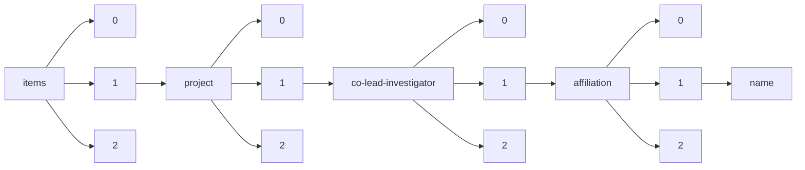

!!! warning "This document is not official Crossref documentation"
# Name
PATH = items/array/project/array/co-lead-investigator/array/affiliation/array/name(1)  
Occurs 964 times  
Unique values: 644  
{ .annotate }

1. A route to an element, for example:  
   The route "items/array/project/array/co-lead-investigator/array/affiliation/array/name" corresponds to navigating through the JSON indices as  
   ["items"][0]["project"][0]["co-lead-investigator"][0]["affiliation"][0]["name"]  

| **Row** | **Value** `String`                                                                                  | **Count** `Int64` |
|--------:|-------------------------------------------------------------------------------------------------------:|---------------------:|
| **1**   | Pacific Northwest National Laboratory                                                                  | 65                   |
| **2**   | University of Vienna                                                                                   | 43                   |
| **3**   | Medical University of Vienna                                                                           | 34                   |
| **4**   | Vienna University of Technology                                                                        | 22                   |
| **5**   | Environmental Molecular Sciences Laboratory                                                            | 16                   |
| **6**   | TU Wien                                                                                                | 13                   |
| **7**   | UNKNOWN                                                                                                | 11                   |
| **8**   | Lawrence Livermore National Laboratory                                                                 | 8                    |
| **9**   | Lawrence Berkeley National Laboratory                                                                  | 6                    |
| **10**  | BOKU - University of Natural Resources and Life Sciences                                               | 5                    |
| **11**  | Washington State University                                                                            | 5                    |
| **12**  | University of California, Berkeley                                                                     | 5                    |
| **13**  | 九州工業大学                                                                                           | 4                    |
| **14**  | CeMM - Research Center for Molecular Medicine of the Austrian Academy of Sciences                      | 4                    |
| **15**  | Brookhaven National Laboratory                                                                         | 4                    |
| **16**  | CeMM Research Center for Molecular Medicine of the Austrian Academy of Sciences                        | 4                    |
| **17**  | University of Veterinary Medicine Vienna                                                               | 4                    |
| **18**  | 名古屋大学, 工学研究科                                                                                 | 4                    |
| **19**  | 東京大学, 生産技術研究所                                                                               | 3                    |
| **20**  | 東京大学, 大学院新領域創成科学研究科                                                                   | 3                    |
| **21**  | 東レ株式会社                                                                                           | 3                    |
| **22**  | 大阪大学, 工学研究科                                                                                   | 3                    |
| **23**  | Colorado State University                                                                              | 3                    |
| **24**  | 東北大学, 金属材料研究所                                                                               | 3                    |
| **25**  | Tennessee State University                                                                             | 3                    |
| **26**  | Florida International University                                                                       | 3                    |
| **27**  | Oak Ridge National Laboratory                                                                          | 3                    |
| **28**  | 大阪大学                                                                                               | 3                    |
| **29**  | Austrian Academy of Sciences                                                                           | 3                    |
| **30**  | 大阪府立大学                                                                                           | 3                    |
| **31**  | 東京大学, 大学院工学系研究科                                                                           | 3                    |
| **32**  | 静岡大学, 電子工学研究所                                                                               | 3                    |
| **33**  | 株式会社富士バイオメディックス                                                                         | 2                    |
| **34**  | 大阪大学, 接合科学研究所                                                                               | 2                    |
| **35**  | 早稲田大学, リサーチイノベーションセンター                                                             | 2                    |
| **36**  | MODUL University Vienna                                                                                | 2                    |
| **37**  | University of Applied Arts Vienna                                                                      | 2                    |
| **38**  | 東京大学, 大学院理学系研究科(理学部)                                                                   | 2                    |
| **39**  | 日本メディカルマテリアル株式会社                                                                       | 2                    |
| **40**  | DePaul University                                                                                      | 2                    |
| **41**  | 早稲田大学, 理工学術院                                                                                 | 2                    |
| **42**  | Academy of Fine Arts Vienna                                                                            | 2                    |
| **43**  | Texas A&M University                                                                                   | 2                    |
| **44**  | Los Alamos National Laboratory                                                                         | 2                    |
| **45**  | 日本電子株式会社                                                                                       | 2                    |
| **46**  | 名古屋工業大学, 工学(系)研究科(研究院)                                                                 | 2                    |
| **47**  | University of Virginia                                                                                 | 2                    |
| **48**  | University of Utah                                                                                     | 2                    |
| **49**  | 鹿児島大学, 大学院理工学研究科                                                                         | 2                    |
| **50**  | 東洋建設株式会社                                                                                       | 2                    |
| **51**  | Michigan State University                                                                              | 2                    |
| **52**  | AIT Austrian Institute of Technology GmbH                                                              | 2                    |
| **53**  | 大阪大学, 大学院医学系研究科                                                                           | 2                    |
| **54**  | 京都大学, 再生医科学研究所                                                                             | 2                    |
| **55**  | University of Miami                                                                                    | 2                    |
| **56**  | Atlanta University Center Robert W. Woodruff Library                                                   | 2                    |
| **57**  | HudsonAlpha Institute for Biotechnology                                                                | 2                    |
| **58**  | 名古屋大学                                                                                             | 2                    |
| **59**  | 岡山大学, 大学院医歯薬学総合研究科                                                                     | 2                    |
| **60**  | IMP - Research Institute of Molecular Pathology                                                        | 2                    |
| **61**  | 東京大学                                                                                               | 2                    |
| **62**  | 株式会社モリタ製作所                                                                                   | 2                    |
| **63**  | Institute of Science and Technology Austria                                                            | 2                    |
| **64**  | 産業技術総合研究所, センシングシステム研究センター                                                     | 2                    |
| **65**  | 大陽日酸株式会社                                                                                       | 2                    |
| **66**  | Saint Mary's College of California                                                                     | 2                    |
| **67**  | 国立研究開発法人産業技術総合研究所, その他部局等                                                       | 2                    |
| **68**  | 東北大学, 大学院工学研究科                                                                             | 2                    |
| **69**  | 関西大学, システム理工学部                                                                             | 2                    |
| **70**  | Boston University                                                                                      | 2                    |
| **71**  | 中部大学, 総合工学研究所                                                                               | 2                    |
| **72**  | 東京農工大学, 工学(系)研究科(研究院)                                                                   | 2                    |
| **73**  | 国立大学法人東京農工大学, 大学院工学研究院                                                             | 2                    |
| **74**  | 京都大学, 産官学連携本部                                                                               | 2                    |
| **75**  | CeMM - Research Center for Molecular Medicine GmbH of the Austrian Academy of Sciences                 | 2                    |
| **76**  | Austrian Institute of Technology GmbH                                                                  | 2                    |
| **77**  | 浜松医科大学                                                                                           | 2                    |
| **78**  | Centre for Public Policy Research                                                                      | 2                    |
| **79**  | アネルバ株式会社                                                                                       | 2                    |
| **80**  | 東北大学                                                                                               | 2                    |
| **81**  | 放射線医学総合研究所                                                                                   | 2                    |
| **82**  | Michigan Technological University                                                                      | 2                    |
| **83**  | 三和澱粉工業株式会社                                                                                   | 2                    |
| **84**  | キッセイ薬品工業株式会社                                                                               | 2                    |
| **85**  | DuQuesne University                                                                                    | 2                    |
| **86**  | 東京工業大学, 生命理工学院                                                                             | 1                    |
| **87**  | 富士ソフト株式会社                                                                                     | 1                    |
| **88**  | 電気通信大学, ｉ－パワードエネルギーシステム研究センター                                               | 1                    |
| **89**  | 三菱化学株式会社, OPV事業推進室著                                                                      | 1                    |
| **90**  | JX日鉱日石エネルギー株式会社, 中央技術研究所 先端領域研究所 高機能素材グループ                         | 1                    |
| **91**  | アルファ・エレクトロニクス株式会社                                                                     | 1                    |
| **92**  | 株式会社エスアールエル                                                                                 | 1                    |
| **93**  | Gregor Mendel Institute of Molecular Plant Biology                                                     | 1                    |
| **94**  | 西海区水産研究所                                                                                       | 1                    |
| **95**  | 北海道大学                                                                                             | 1                    |
| **96**  | ユニパルス株式会社                                                                                     | 1                    |
| **97**  | University of Vienna, Max Perutz Labs                                                                  | 1                    |
| **98**  | 株式会社ニシトモ                                                                                       | 1                    |
| **99**  | 株式会社ナノテコ                                                                                       | 1                    |
| **100** | 株式会社カネカ                                                                                         | 1                    |
| **101** | 国立研究開発法人産業技術総合研究所, 生命工学領域                                                       | 1                    |
| **102** | University of Seville                                                                                  | 1                    |
| **103** | 東京理科大学, 理工学部工業化学科                                                                       | 1                    |
| **104** | 新日鐵住金化学株式会社, 総合研究所 新材料開発センター                                                  | 1                    |
| **105** | 九州大学, 大学院工学研究院材料工学部門                                                                 | 1                    |
| **106** | 星槎大学, 大学院　教育実践研究科                                                                       | 1                    |
| **107** | 農業・食品産業技術総合研究機構, 高度解析センター                                                       | 1                    |
| **108** | 京都大学, 物質-細胞統合システム拠点                                                                    | 1                    |
| **109** | 日本レーザ電子株式会社                                                                                 | 1                    |
| **110** | マツダマイクロニクス株式会社                                                                           | 1                    |
| **111** | Syracuse University                                                                                    | 1                    |
| **112** | 愛知製鋼株式会社                                                                                       | 1                    |
| **113** | Veterinary Medicine University Vienna - VMU                                                            | 1                    |
| **114** | 株式会社帝国臓器製薬メディカル                                                                         | 1                    |
| **115** | Max-Planck-Institute of Psychiatry                                                                     | 1                    |
| **116** | 日本ケミコン株式会社                                                                                   | 1                    |
| **117** | Medical University Vienna                                                                              | 1                    |
| **118** | 京都工芸繊維大学, 材料化学系                                                                           | 1                    |
| **119** | 株式会社石原産業                                                                                       | 1                    |
| **120** | 日油株式会社, ライフサイエンス研究所                                                                   | 1                    |
| **121** | 山梨大学, 大学院総合研究部                                                                             | 1                    |
| **122** | 国立国際医療センター                                                                                   | 1                    |
| **123** | 川本産業株式会社                                                                                       | 1                    |
| **124** | Unviersity of Duisburg-Essen                                                                           | 1                    |
| **125** | 医療電子精工株式会社                                                                                   | 1                    |
| **126** | 株式会社ワコム電創                                                                                     | 1                    |
| **127** | テルモ株式会社, 研究開発本部                                                                           | 1                    |
| **128** | Okinawa Institute of Science and Technology                                                            | 1                    |
| **129** | ゼノー・テック株式会社                                                                                 | 1                    |
| **130** | Dartmouth College                                                                                      | 1                    |
| **131** | マルハ株式会社                                                                                         | 1                    |
| **132** | 大分大学, 工学部                                                                                       | 1                    |
| **133** | IMBA - Institute of Molecular Biotechnology                                                            | 1                    |
| **134** | サンコロナ小田株式会社                                                                                 | 1                    |
| **135** | 東北大学, 大学院医科学研究科                                                                           | 1                    |
| **136** | 東京農工大学, 大学院連合農学研究科                                                                     | 1                    |
| **137** | 名古屋大学, 大学院医学系研究科                                                                         | 1                    |
| **138** | 弘前大学, 大学院医学研究科                                                                             | 1                    |
| **139** | 株式会社エフ・シー・シー                                                                               | 1                    |
| **140** | 大阪大学, 生命機能研究科                                                                               | 1                    |
| **141** | 北里大学                                                                                               | 1                    |
| **142** | The Ohio State University                                                                              | 1                    |
| **143** | 応用電機株式会社                                                                                       | 1                    |
| **144** | 新道繊維工業株式会社                                                                                   | 1                    |
| **145** | 株式会社トランスジェニック                                                                             | 1                    |
| **146** | 株式会社ネットイン京都                                                                                 | 1                    |
| **147** | 株式会社ユニソク                                                                                       | 1                    |
| **148** | University of Vienna, Max F. Perutz Laboratories                                                       | 1                    |
| **149** | 泉工医科工業株式会社                                                                                   | 1                    |
| **150** | 神戸大学, 産官学連携本部                                                                               | 1                    |
| **151** | 株式会社エヌ・ティ・ティ・データ                                                                       | 1                    |
| **152** | セレスター・レキシコ・サイエンシズ株式会社                                                             | 1                    |
| **153** | 芝浦工業大学, 工学部                                                                                   | 1                    |
| **154** | 大阪大学, 大学院薬学研究科                                                                             | 1                    |
| **155** | 上智大学, 理工学部物質生命理工学科                                                                     | 1                    |
| **156** | 国立大学法人東北大学, 大学院工学研究科　電子工学専攻                                                   | 1                    |
| **157** | 産業技術総合研究所, 細胞分子工学研究部門　分子生物マルチオミクス研究グループ                           | 1                    |
| **158** | 木村化工機株式会社                                                                                     | 1                    |
| **159** | IIASA - International Institute for Applied Systems Analysis                                           | 1                    |
| **160** | 株式会社ジーンケア研究所                                                                               | 1                    |
| **161** | 住友化学株式会社, 筑波開発研究所                                                                       | 1                    |
| **162** | Gregor Mendel Institute of Molecular Plant Biology (GMI)                                               | 1                    |
| **163** | 大阪産業技術研究所, 電子・機械システム研究部                                                           | 1                    |
| **164** | 名古屋大学, 副総長                                                                                     | 1                    |
| **165** | 京都大学, 薬学研究科                                                                                   | 1                    |
| **166** | 日本国土開発株式会社                                                                                   | 1                    |
| **167** | 豊橋技術科学大学, 電気・電子情報工学系                                                                 | 1                    |
| **168** | ゼリア新薬工業株式会社                                                                                 | 1                    |
| **169** | マイクロアーク株式会社                                                                                 | 1                    |
| **170** | 久留米工業高等専門学校, 機械工学科                                                                     | 1                    |
| **171** | 株式会社ビヨンド・エルエスアイ                                                                         | 1                    |
| **172** | 中日精工株式会社                                                                                       | 1                    |
| **173** | 宮崎大学, 医学部                                                                                       | 1                    |
| **174** | コニカミノルタ株式会社, 開発統括本部                                                                   | 1                    |
| **175** | 養殖研究所                                                                                             | 1                    |
| **176** | 久留米大学, 先端癌治療研究センター                                                                     | 1                    |
| **177** | 美濃窯業株式会社                                                                                       | 1                    |
| **178** | 井原水産株式会社                                                                                       | 1                    |
| **179** | 株式会社ブイエムシー                                                                                   | 1                    |
| **180** | 大阪府立産業技術総合研究所                                                                             | 1                    |
| **181** | 株式会社小泉                                                                                           | 1                    |
| **182** | 日本工営株式会社                                                                                       | 1                    |
| **183** | Medical University of Vienna, Department of Surgery                                                    | 1                    |
| **184** | 東北大学, 災害科学国際研究所                                                                           | 1                    |
| **185** | Sonoma Technology (United States)                                                                      | 1                    |
| **186** | 産業技術総合研究所, ナノ材料研究部門                                                                   | 1                    |
| **187** | 丸勝産業株式会社                                                                                       | 1                    |
| **188** | 大阪大学, 蛋白質研究所                                                                                 | 1                    |
| **189** | 京都大学                                                                                               | 1                    |
| **190** | 株式会社ASABA                                                                                          | 1                    |
| **191** | Complexity Science Hub                                                                                 | 1                    |
| **192** | 慶應義塾大学, 先端生命科学研究所                                                                       | 1                    |
| **193** | 神戸大学, 工学研究科                                                                                   | 1                    |
| **194** | Stanford University                                                                                    | 1                    |
| **195** | 九州大学                                                                                               | 1                    |
| **196** | 株式会社ジーシー, 研究所                                                                               | 1                    |
| **197** | 高信化学株式会社                                                                                       | 1                    |
| **198** | 株式会社東海メディカルプロダクツ                                                                       | 1                    |
| **199** | 森川産業株式会社                                                                                       | 1                    |
| **200** | 国立研究開発法人海洋研究開発機構, 海洋生命理工学研究開発センター                                       | 1                    |
| **201** | 株式会社メガオプト                                                                                     | 1                    |
| **202** | 大阪大学, 大学院工学研究科                                                                             | 1                    |
| **203** | 大日本印刷株式会社, 研究開発センター ABセンター第1本部                                                 | 1                    |
| **204** | グンゼ株式会社                                                                                         | 1                    |
| **205** | 大阪府立大学, 大学院生命環境科学研究科                                                                 | 1                    |
| **206** | 古河機械金属株式会社                                                                                   | 1                    |
| **207** | サイボックス株式会社                                                                                   | 1                    |
| **208** | 日本建設技術株式会社                                                                                   | 1                    |
| **209** | ニプロ株式会社                                                                                         | 1                    |
| **210** | 九州大学, 稲盛フロンティア研究センター                                                                 | 1                    |
| **211** | War Child                                                                                              | 1                    |
| **212** | 信和化工株式会社                                                                                       | 1                    |
| **213** | 東京工業大学, 環境・社会理工学院                                                                       | 1                    |
| **214** | 独立行政法人森林総合研究所                                                                             | 1                    |
| **215** | University of Georgia                                                                                  | 1                    |
| **216** | ORNL                                                                                                   | 1                    |
| **217** | 神戸大学, 理学研究科                                                                                   | 1                    |
| **218** | FDK株式会社                                                                                            | 1                    |
| **219** | 株式会社ワイエムシィ, 経営戦略室                                                                       | 1                    |
| **220** | 株式会社NHVコーポレーション                                                                            | 1                    |
| **221** | 東邦大学, 医学部 薬理学講座                                                                            | 1                    |
| **222** | 株式会社フジキン                                                                                       | 1                    |
| **223** | 五鈴精工硝子株式会社                                                                                   | 1                    |
| **224** | トーメイダイヤ株式会社                                                                                 | 1                    |
| **225** | 一般社団法人横浜みなとみらい21, 企画調整課                                                             | 1                    |
| **226** | 株式会社ノバスジーン                                                                                   | 1                    |
| **227** | 株式会社常光                                                                                           | 1                    |
| **228** | 日本軽金属株式会社                                                                                     | 1                    |
| **229** | Institute for Advanced Studies                                                                         | 1                    |
| **230** | 九州大学, 生体防御医学研究所                                                                           | 1                    |
| **231** | オンコセラピー・サイエンス株式会社                                                                     | 1                    |
| **232** | Institute for Genome Science                                                                           | 1                    |
| **233** | ハクスイテック株式会社                                                                                 | 1                    |
| **234** | グリーンブルー株式会社                                                                                 | 1                    |
| **235** | 明治大学, 理工学部 情報科学科                                                                          | 1                    |
| **236** | 三和テッキ株式会社                                                                                     | 1                    |
| **237** | アピ株式会社                                                                                           | 1                    |
| **238** | 富山大学, 大学院医学薬学研究部                                                                         | 1                    |
| **239** | North Carolina Agricultural and Technical State University                                             | 1                    |
| **240** | 日立造船株式会社                                                                                       | 1                    |
| **241** | 塩野義製薬株式会社                                                                                     | 1                    |
| **242** | RWTH Aachen                                                                                            | 1                    |
| **243** | University of Natural Resources and Life Science Vienna                                                | 1                    |
| **244** | ナカシマプロペラ株式会社                                                                               | 1                    |
| **245** | Research Institute of Molecular Pathology (IMP)                                                        | 1                    |
| **246** | 揖斐電アセチレン株式会社                                                                               | 1                    |
| **247** | 株式会社シノテスト                                                                                     | 1                    |
| **248** | 長岡技術科学大学, 工学研究科                                                                           | 1                    |
| **249** | Forschungsinstitut für Molekulare Pathologie GmbH                                                      | 1                    |
| **250** | 株式会社巴川製紙所                                                                                     | 1                    |
| **251** | 東京理化器械株式会社                                                                                   | 1                    |
| **252** | 株式会社堀場製作所                                                                                     | 1                    |
| **253** | 財団法人衛星測位利用推進センター                                                                       | 1                    |
| **254** | University of Natural Resources and Life Sciences, Vienna                                              | 1                    |
| **255** | City College of New York                                                                               | 1                    |
| **256** | 株式会社フジクラ                                                                                       | 1                    |
| **257** | 株式会社千代田                                                                                         | 1                    |
| **258** | 大鵬薬品工業株式会社                                                                                   | 1                    |
| **259** | 株式会社エックスレイプレシジョン                                                                       | 1                    |
| **260** | 株式会社ジェイ・エム・エス 中央研究所, 中央研究所 第4研究室                                            | 1                    |
| **261** | 東京工業大学, 環境・社会理工学院　イノベーション科学系・技術経営専門職学位課程                         | 1                    |
| **262** | 株式会社福山臨床検査センター                                                                           | 1                    |
| **263** | 神戸大学, 科学技術イノベーション研究科                                                                 | 1                    |
| **264** | University of Innsbruck                                                                                | 1                    |
| **265** | University of Washington                                                                               | 1                    |
| **266** | 三菱長崎機工株式会社                                                                                   | 1                    |
| **267** | 富士フイルムビジネスイノベーション株式会社, デバイス開発本部　イメージング開発部                       | 1                    |
| **268** | 東京農業大学, 生物産業学部                                                                             | 1                    |
| **269** | 東京大学, 大学院農学生命科学研究科(農学部)                                                             | 1                    |
| **270** | Harvard Medical School                                                                                 | 1                    |
| **271** | 慶應義塾大学, 理工学部                                                                                 | 1                    |
| **272** | Universidade Católica de Brasília                                                                      | 1                    |
| **273** | 田中貴金属工業株式会社                                                                                 | 1                    |
| **274** | Department of Veterinary Medicine, University of Sassari                                               | 1                    |
| **275** | 株式会社アミノ                                                                                         | 1                    |
| **276** | 東海大学, 農学部                                                                                       | 1                    |
| **277** | 株式会社ノベルクリスタルテクノロジー, 製造部                                                           | 1                    |
| **278** | 広島大学, 大学院医系科学研究科                                                                         | 1                    |
| **279** | 関西大学, 化学生命工学部                                                                               | 1                    |
| **280** | HOYA CANDEO OPTRONICS株式会社                                                                          | 1                    |
| **281** | 池上金型工業株式会社                                                                                   | 1                    |
| **282** | 京都大学, 高等研究院　物質ー細胞統合システム拠点                                                       | 1                    |
| **283** | Johannes Kepler Universität Linz                                                                       | 1                    |
| **284** | Ecole Polytechnique Federale de Lausanne                                                               | 1                    |
| **285** | 国立大学法人金沢大学, 理工学域                                                                         | 1                    |
| **286** | 日本分光株式会社                                                                                       | 1                    |
| **287** | 株式会社アイカムス・ラボ                                                                               | 1                    |
| **288** | 三菱電機エンジニアリング株式会社, 鎌倉事業所 電子技術センターシステム課                                | 1                    |
| **289** | YKK AP株式会社                                                                                         | 1                    |
| **290** | 北海道大学, 大学院医学研究科                                                                           | 1                    |
| **291** | 株式会社ライク                                                                                         | 1                    |
| **292** | 株式会社JEOL RESONANCE                                                                                 | 1                    |
| **293** | 長岡技術科学大学, 大学院工学研究科　技術科学イノベーション専攻                                         | 1                    |
| **294** | 三和油化工業株式会社                                                                                   | 1                    |
| **295** | 新潟大学, 医歯学総合病院                                                                               | 1                    |
| **296** | 株式会社日立メディコ                                                                                   | 1                    |
| **297** | 九州大学, 副理事                                                                                       | 1                    |
| **298** | 株式会社東和エレックス                                                                                 | 1                    |
| **299** | 三木理研工業株式会社                                                                                   | 1                    |
| **300** | 富士ネームプレート株式会社                                                                             | 1                    |
| **301** | 高橋金属株式会社                                                                                       | 1                    |
| **302** | 財団法人東京都医学研究機構, 東京都精神医学総合研究所/東京都立松沢病院                                  | 1                    |
| **303** | 株式会社琉球バイオリソース開発                                                                         | 1                    |
| **304** | 旭化成クラレメディカル株式会社                                                                         | 1                    |
| **305** | 石塚電子株式会社                                                                                       | 1                    |
| **306** | 東京大学, 大学院工学系研究科(工学部)                                                                   | 1                    |
| **307** | 京都大学, 工学研究科                                                                                   | 1                    |
| **308** | 国立大学法人東京工業大学, 工学院                                                                       | 1                    |
| **309** | 日本ライフライン株式会社                                                                               | 1                    |
| **310** | 九州工業大学, 副工学研究院長／ IoTシステム基盤研究センター長／大学院工学研究院 電気電子工学研究系      | 1                    |
| **311** | 株式会社ネオス                                                                                         | 1                    |
| **312** | 日新イオン機器株式会社                                                                                 | 1                    |
| **313** | 東京大学, 医学部附属病院                                                                               | 1                    |
| **314** | 名古屋大学, 大学院創薬科学研究科                                                                       | 1                    |
| **315** | 株式会社アツミテック                                                                                   | 1                    |
| **316** | 株式会社日立製作所, 研究開発グループ テクノロジーイノベーション統括本部 ヘルスケアイノベーションセンタ | 1                    |
| **317** | 北海道大学, 大学院情報科学研究科                                                                       | 1                    |
| **318** | University of Birmingham                                                                               | 1                    |
| **319** | 日本アイ・ビー・エム株式会社, 東京基礎研究所 ソフトウエア                                              | 1                    |
| **320** | 千葉大学                                                                                               | 1                    |
| **321** | Medical University of Vienna, Department of Dermatology                                                | 1                    |
| **322** | 国立研究開発法人情報通信研究機構, 未来ICT研究所フロンティア創造総合研究室                              | 1                    |
| **323** | Center for Social Sciences                                                                             | 1                    |
| **324** | 株式会社ジーシー                                                                                       | 1                    |
| **325** | Vienna University of Technology (TU Wien)                                                              | 1                    |
| **326** | 株式会社セイシン企業                                                                                   | 1                    |
| **327** | Argonne National Laboratory                                                                            | 1                    |
| **328** | Colorado School of Mines                                                                               | 1                    |
| **329** | 徳島大学, 大学院社会産業理工学研究部                                                                   | 1                    |
| **330** | 日本化薬株式会社                                                                                       | 1                    |
| **331** | コペル電子株式会社                                                                                     | 1                    |
| **332** | エヌ・ティ・ティ・インフラネット株式会社                                                               | 1                    |
| **333** | ナノフォトン株式会社                                                                                   | 1                    |
| **334** | 東京大学, 産学協創推進本部                                                                             | 1                    |
| **335** | Ludwig Boltzmann Society                                                                               | 1                    |
| **336** | 独立行政法人医薬基盤研究所, アジュバント開発プロジェクト                                               | 1                    |
| **337** | University of Natural Resources and Applied Life Sciences Vienna/BOKU; Department of Applied Genetic   | 1                    |
| **338** | Technical University Munich                                                                            | 1                    |
| **339** | 豊田合成株式会社, 先端材料開発部                                                                       | 1                    |
| **340** | 株式会社ナノコントロール                                                                               | 1                    |
| **341** | 神戸大学, 分子フォトサイエンス研究センター                                                             | 1                    |
| **342** | 国立がん研究センター東病院                                                                             | 1                    |
| **343** | 自然科学研究機構, 生理学研究所                                                                         | 1                    |
| **344** | 情報・システム研究機構　国立遺伝学研究所, 小型魚類開発研究室                                           | 1                    |
| **345** | 洛東化成工業株式会社                                                                                   | 1                    |
| **346** | Columbia University                                                                                    | 1                    |
| **347** | 神奈川県立保健福祉大学, 保健福祉学部                                                                   | 1                    |
| **348** | 株式会社特殊免疫研究所                                                                                 | 1                    |
| **349** | 宮崎みどり製薬株式会社                                                                                 | 1                    |
| **350** | 慶應義塾大学, 医学部                                                                                   | 1                    |
| **351** | 株式会社久保工                                                                                         | 1                    |
| **352** | 日本全薬工業株式会社                                                                                   | 1                    |
| **353** | 東京大学, 大学院情報理工学系研究科                                                                     | 1                    |
| **354** | University of Zuerich                                                                                  | 1                    |
| **355** | アサヒビール株式会社                                                                                   | 1                    |
| **356** | Joint Genome Institute                                                                                 | 1                    |
| **357** | 公益財団法人函館地域産業振興財団(北海道立工業技術センター), 研究開発部                                 | 1                    |
| **358** | 東京医科歯科大学, 大学院疾患生命科学研究部                                                             | 1                    |
| **359** | 株式会社高研                                                                                           | 1                    |
| **360** | 国立大学法人徳島大学, 大学院医歯薬学研究部                                                             | 1                    |
| **361** | 京都大学, 化学研究所                                                                                   | 1                    |
| **362** | 九州大学, オープンイノベーションプラットフォーム（OIP）                                                | 1                    |
| **363** | Battelle Memorial Institute                                                                            | 1                    |
| **364** | 触媒化成工業株式会社                                                                                   | 1                    |
| **365** | 株式会社東芝電力システム社, 新技術応用事業推進統括部                                                   | 1                    |
| **366** | 株式会社光電製作所                                                                                     | 1                    |
| **367** | 福井ファイバーテック株式会社                                                                           | 1                    |
| **368** | 株式会社ポッカコーポレーション                                                                         | 1                    |
| **369** | 日本ビーイーイー株式会社                                                                               | 1                    |
| **370** | 大阪電気通信大学, 工学部                                                                               | 1                    |
| **371** | University of Arizona                                                                                  | 1                    |
| **372** | 湘南工科大学, 工学部                                                                                   | 1                    |
| **373** | 株式会社キノファーマ                                                                                   | 1                    |
| **374** | 信州大学                                                                                               | 1                    |
| **375** | 株式会社第一ラジオアイソトープ研究所                                                                   | 1                    |
| **376** | 意味解析技術応用研究所株式会社                                                                         | 1                    |
| **377** | Australian National University                                                                         | 1                    |
| **378** | 慶應義塾大学, 理工学部(矢上)                                                                           | 1                    |
| **379** | 広島大学, ゲノム編集イノベーションセンター                                                             | 1                    |
| **380** | 株式会社グリーンペプタイド                                                                             | 1                    |
| **381** | 京都工芸繊維大学                                                                                       | 1                    |
| **382** | Agricultural Research Service                                                                          | 1                    |
| **383** | University Hospital Erlangen                                                                           | 1                    |
| **384** | JFEエンジニアリング株式会社                                                                            | 1                    |
| **385** | Desert Research Institute                                                                              | 1                    |
| **386** | Aalto University                                                                                       | 1                    |
| **387** | 株式会社野毛電気工業                                                                                   | 1                    |
| **388** | 九州大学, 大学院 工学研究院 環境社会部門                                                               | 1                    |
| **389** | 京都大学, 大学院薬学研究科                                                                             | 1                    |
| **390** | 石巻専修大学, 理工学部                                                                                 | 1                    |
| **391** | 東京女子医科大学, 先端生命医科学研究所                                                                 | 1                    |
| **392** | トヨタ自動車株式会社, FP部                                                                             | 1                    |
| **393** | ホソカワミクロン株式会社                                                                               | 1                    |
| **394** | 国立研究開発法人理化学研究所, 開拓研究本部                                                             | 1                    |
| **395** | 筑波大学, 図書館情報メディア系                                                                         | 1                    |
| **396** | 筑波大学, 国際産学連携本部                                                                             | 1                    |
| **397** | 群馬大学, 大学院理工学府　電子情報部門                                                                 | 1                    |
| **398** | 旭化成株式会社, その他                                                                                 | 1                    |
| **399** | 扶桑薬品工業株式会社                                                                                   | 1                    |
| **400** | 早稲田大学, 総長室                                                                                     | 1                    |
| **401** | European Bioinformatics Institute                                                                      | 1                    |
| **402** | 九州工業大学, 大学院情報工学研究院                                                                     | 1                    |
| **403** | 独立行政法人農業環境技術研究所, 土壌環境研究領域                                                       | 1                    |
| **404** | 名古屋大学, トランスフォーマティブ生命分子研究所                                                       | 1                    |
| **405** | 独立行政法人森林総合研究所, 樹木抽出成分研究室                                                         | 1                    |
| **406** | 豊橋技術科学大学, 工学(系)研究科(研究院)                                                               | 1                    |
| **407** | 九州工業大学, 情報工学部                                                                               | 1                    |
| **408** | 株式会社サンエス                                                                                       | 1                    |
| **409** | PNNL                                                                                                   | 1                    |
| **410** | ユーハ味覚糖株式会社                                                                                   | 1                    |
| **411** | (株)大創                                                                                               | 1                    |
| **412** | Battelle National Ecological Observatory Network                                                       | 1                    |
| **413** | 株式会社先端力学シミュレーション研究所                                                                 | 1                    |
| **414** | 岐セン株式会社                                                                                         | 1                    |
| **415** | 鹿児島大学, 大学院医歯学総合研究科                                                                     | 1                    |
| **416** | 住友イートンノバ株式会社                                                                               | 1                    |
| **417** | 東北大学, 大学院医学系研究科                                                                           | 1                    |
| **418** | 株式会社カナック                                                                                       | 1                    |
| **419** | 国立研究開発法人理化学研究所, 生命機能科学研究センター                                                 | 1                    |
| **420** | 日本電気株式会社, ビジネスクリエイション本部                                                           | 1                    |
| **421** | Institute of Molecular Biotechnology                                                                   | 1                    |
| **422** | 産業技術総合研究所, 化学プロセス研究部門                                                               | 1                    |
| **423** | 京都大学, 工学研究科社会基盤工学専攻                                                                   | 1                    |
| **424** | ナルックス株式会社                                                                                     | 1                    |
| **425** | 株式会社タムラ製作所                                                                                   | 1                    |
| **426** | St. Anna Kinderspital                                                                                  | 1                    |
| **427** | 元国立がんセンター                                                                                     | 1                    |
| **428** | 株式会社いすゞ中央研究所                                                                               | 1                    |
| **429** | 北九州市立大学, 国際環境工学部                                                                         | 1                    |
| **430** | 中外テクノス株式会社                                                                                   | 1                    |
| **431** | 杏林大学, 医学部薬理学教室                                                                             | 1                    |
| **432** | 北海道大学, 産学・地域協働推進機構                                                                     | 1                    |
| **433** | 株式会社三菱化学ビーシーエル                                                                           | 1                    |
| **434** | 九州大学, 総合理工学研究院                                                                             | 1                    |
| **435** | 株式会社初田製作所                                                                                     | 1                    |
| **436** | Vienna University of Economics and Business                                                            | 1                    |
| **437** | 三木プーリ株式会社                                                                                     | 1                    |
| **438** | 盛和工業株式会社                                                                                       | 1                    |
| **439** | 京都大学, 学術情報メディアセンター                                                                     | 1                    |
| **440** | 大研化学工業株式会社                                                                                   | 1                    |
| **441** | 株式会社積層金型研究所                                                                                 | 1                    |
| **442** | 協和発酵キリン株式会社                                                                                 | 1                    |
| **443** | University of Dundee, School of Life Sciences                                                          | 1                    |
| **444** | 九州大学, 大学院薬学研究院                                                                             | 1                    |
| **445** | 東京農工大学, 大学院共生科学技術研究院                                                                 | 1                    |
| **446** | 東海大学, 医学部                                                                                       | 1                    |
| **447** | 福井大学, 子どものこころの発達研究センター                                                             | 1                    |
| **448** | Alabama A&M University                                                                                 | 1                    |
| **449** | 関西大学, 工学部                                                                                       | 1                    |
| **450** | 東京工業大学, 科学技術創成研究院 先導原子力研究所                                                      | 1                    |
| **451** | 株式会社医学生物学研究所                                                                               | 1                    |
| **452** | 新潟大学, 工学部                                                                                       | 1                    |
| **453** | 国立遺伝学研究所, 大学共同利用機関等の部局等                                                           | 1                    |
| **454** | 株式会社島津製作所, その他部局等                                                                       | 1                    |
| **455** | 独立行政法人産業技術総合研究所, 計測標準研究部門                                                       | 1                    |
| **456** | 株式会社東京測振                                                                                       | 1                    |
| **457** | 甲陽ケミカル株式会社                                                                                   | 1                    |
| **458** | 無機材質研究所                                                                                         | 1                    |
| **459** | 東京工業大学, 精密工学研究所 知能化工学部門                                                            | 1                    |
| **460** | 積水化学工業株式会社                                                                                   | 1                    |
| **461** | 三重大学, 大学院医学系研究科                                                                           | 1                    |
| **462** | 東邦工業株式会社, 品質保証部                                                                           | 1                    |
| **463** | (株)プランド研究所                                                                                     | 1                    |
| **464** | VICESSE Research GmbH                                                                                  | 1                    |
| **465** | 株式会社ホーメット                                                                                     | 1                    |
| **466** | 株式会社リガク                                                                                         | 1                    |
| **467** | The Weizmann Institute of Science                                                                      | 1                    |
| **468** | 大和紡績株式会社                                                                                       | 1                    |
| **469** | 石原産業株式会社                                                                                       | 1                    |
| **470** | 京都薬科大学, 薬物動態学教室                                                                           | 1                    |
| **471** | 東京窯業株式会社                                                                                       | 1                    |
| **472** | Institute of Science and Technology, Austria                                                           | 1                    |
| **473** | 筑波大学, 数理物質系                                                                                   | 1                    |
| **474** | 川崎重工業株式会社, 技術開発本部技術研究所 機械システム研究部                                          | 1                    |
| **475** | 法政大学, 工学部                                                                                       | 1                    |
| **476** | National Ecological Observatory Network                                                                | 1                    |
| **477** | University of Toronto                                                                                  | 1                    |
| **478** | 浜松ホトニクス株式会社                                                                                 | 1                    |
| **479** | 筑波大学, 医学医療系                                                                                   | 1                    |
| **480** | 京都大学, オープンイノベーション機構                                                                   | 1                    |
| **481** | 産業技術総合研究所, 環境化学技術研究部門                                                               | 1                    |
| **482** | 和田精密歯研株式会社                                                                                   | 1                    |
| **483** | University of Applied Sciences St. Pölten                                                              | 1                    |
| **484** | 福井大学, 工学(系)研究科(研究院)                                                                       | 1                    |
| **485** | 住友精密工業株式会社                                                                                   | 1                    |
| **486** | University of Illinois at Urbana-Champaign                                                             | 1                    |
| **487** | 順天堂大学                                                                                             | 1                    |
| **488** | 森六株式会社                                                                                           | 1                    |
| **489** | ナカシマメディカル株式会社, (代表取締役社長)                                                           | 1                    |
| **490** | 株式会社ホットランド, 上天草水産研究所                                                                 | 1                    |
| **491** | 株式会社インテリジェントセンサーテクノロジー                                                           | 1                    |
| **492** | 名古屋市立大学, 大学院医学研究科                                                                       | 1                    |
| **493** | Princeton University                                                                                   | 1                    |
| **494** | 株式会社カオスウェア                                                                                   | 1                    |
| **495** | アロカ株式会社                                                                                         | 1                    |
| **496** | 国立大学法人九州大学, 大学院システム情報科学研究院                                                     | 1                    |
| **497** | 株式会社ファインプロセス                                                                               | 1                    |
| **498** | 獨協医科大学, 医学部                                                                                   | 1                    |
| **499** | Technisches Museum Wien mit Österreichischer Mediathek                                                 | 1                    |
| **500** | 九州大学, 工学研究院                                                                                   | 1                    |
| **501** | 竹内真空被膜株式会社                                                                                   | 1                    |
| **502** | 電気通信大学, 大学院情報理工学研究科                                                                   | 1                    |
| **503** | 株式会社ミクニ                                                                                         | 1                    |
| **504** | 大日本印刷株式会社, 研究開発センター                                                                   | 1                    |
| **505** | 株式会社放電精密加工研究所                                                                             | 1                    |
| **506** | Zentralanstalt für Meterologie und Geodynamik                                                          | 1                    |
| **507** | 株式会社ピーアイ技術研究所                                                                             | 1                    |
| **508** | University of Kentucky                                                                                 | 1                    |
| **509** | 広島大学, 先進理工系科学研究科                                                                         | 1                    |
| **510** | Karl Landsteiner Privatuniversität                                                                     | 1                    |
| **511** | 東北大学, 工学研究科                                                                                   | 1                    |
| **512** | 理化学研究所                                                                                           | 1                    |
| **513** | 国立大学法人東北大学, 大学院工学研究科                                                                 | 1                    |
| **514** | 中部大学, 生命健康科学部　臨床工学科                                                                   | 1                    |
| **515** | 学校法人栴檀学園, 東北福祉大学　感性福祉研究所                                                         | 1                    |
| **516** | 株式会社ピルム                                                                                         | 1                    |
| **517** | University Hospital Regensburg                                                                         | 1                    |
| **518** | ステラファーマ株式会社                                                                                 | 1                    |
| **519** | 国立大学法人九州大学, 応用力学研究所                                                                   | 1                    |
| **520** | 名古屋大学, 大学院工学研究科 化学・生物工学専攻                                                        | 1                    |
| **521** | 信和化工株式会社, R＆Dグループ                                                                         | 1                    |
| **522** | エルシード株式会社                                                                                     | 1                    |
| **523** | 株式会社フジコー, 技術開発センター                                                                     | 1                    |
| **524** | University of Veterinary Medicine                                                                      | 1                    |
| **525** | 国立大学法人広島大学, 大学院先進理工系科学研究科                                                       | 1                    |
| **526** | 永田精機株式会社                                                                                       | 1                    |
| **527** | 株式会社第一機電                                                                                       | 1                    |
| **528** | 千葉大学, 大学院融合科学研究科                                                                         | 1                    |
| **529** | 株式会社ニュークリエイション                                                                           | 1                    |
| **530** | サカイオーベックス株式会社                                                                             | 1                    |
| **531** | ETH Zurich                                                                                             | 1                    |
| **532** | 株式会社シナップス                                                                                     | 1                    |
| **533** | CBC株式会社                                                                                            | 1                    |
| **534** | Danube University Krems                                                                                | 1                    |
| **535** | 東邦工業株式会社                                                                                       | 1                    |
| **536** | スカラ株式会社                                                                                         | 1                    |
| **537** | 独立行政法人理化学研究所, 免疫・アレルギー科学総合研究センター                                         | 1                    |
| **538** | 独立行政法人国立循環器病研究センター, 再生医療部                                                       | 1                    |
| **539** | カンタツ株式会社                                                                                       | 1                    |
| **540** | University of Natural Resources and Life Sciences, Institute of Social Ecology (SEC)                   | 1                    |
| **541** | 大日本コンサルタント株式会社                                                                           | 1                    |
| **542** | 株式会社マイクロフェーズ                                                                               | 1                    |
| **543** | Data Science @ Uni Vienna                                                                              | 1                    |
| **544** | 株式会社エフェクター細胞研究所                                                                         | 1                    |
| **545** | 近畿大学, 生物理工学部                                                                                 | 1                    |
| **546** | 鹿島建設株式会社, 建築管理本部                                                                         | 1                    |
| **547** | 福井大学, 学術研究院工学系部門                                                                         | 1                    |
| **548** | 株式会社エヌエスティー                                                                                 | 1                    |
| **549** | 東京工業大学, 科学技術創成研究院                                                                       | 1                    |
| **550** | 新東工業株式会社                                                                                       | 1                    |
| **551** | University of Bern                                                                                     | 1                    |
| **552** | 株式会社豊田中央研究所, システムエレクトロニクス 2 部                                                  | 1                    |
| **553** | 京都大学, 大学院工学研究科資源工学専攻                                                                 | 1                    |
| **554** | 株式会社ナード研究所                                                                                   | 1                    |
| **555** | National Jewish Center for Learning and Leadership                                                     | 1                    |
| **556** | 株式会社リンフォテック                                                                                 | 1                    |
| **557** | 株式会社オプセル                                                                                       | 1                    |
| **558** | 株式会社GPE                                                                                            | 1                    |
| **559** | 富山化学工業株式会社                                                                                   | 1                    |
| **560** | 大阪大学, 大学院歯学研究科                                                                             | 1                    |
| **561** | University of Budapest                                                                                 | 1                    |
| **562** | 福井県立大学, 海洋生物資源学部                                                                         | 1                    |
| **563** | 八戸工業高等専門学校, その他部局等                                                                     | 1                    |
| **564** | ＡｅｒｏＥｄｇｅ株式会社, 生産本部、技術戦略室                                                         | 1                    |
| **565** | 慶応義塾大学, 理工学部                                                                                 | 1                    |
| **566** | 立命館大学, 総合科学技術研究機構                                                                       | 1                    |
| **567** | 産業技術総合研究所, 計測フロンティア研究部門                                                           | 1                    |
| **568** | ニッタ株式会社                                                                                         | 1                    |
| **569** | University of Vienna, Max F. Perutz Laboratories / Forschungsinstitut für Molekulare Pathologie GmbH   | 1                    |
| **570** | 株式会社国際アパタイト研究所                                                                           | 1                    |
| **571** | Stanford School of Medicine                                                                            | 1                    |
| **572** | 理学電機工業株式会社                                                                                   | 1                    |
| **573** | 共立工業株式会社                                                                                       | 1                    |
| **574** | 株式会社ジャパン・ティッシュ・エンジニアリング                                                         | 1                    |
| **575** | 自然科学研究機構, 分子科学研究所                                                                       | 1                    |
| **576** | 法政大学, 理工学部                                                                                     | 1                    |
| **577** | 株式会社アイメス                                                                                       | 1                    |
| **578** | 川崎三鷹製薬株式会社                                                                                   | 1                    |
| **579** | CSIC                                                                                                   | 1                    |
| **580** | 三協オイルレス工業株式会社                                                                             | 1                    |
| **581** | Medical University of Vienna - Department of Biomedical Imaging and Image-guided Therapy               | 1                    |
| **582** | 株式会社エムテーシー                                                                                   | 1                    |
| **583** | 株式会社神戸製鋼所                                                                                     | 1                    |
| **584** | Northern Arizona University                                                                            | 1                    |
| **585** | 国立研究開発法人産業技術総合研究所, ナノスピントロニクス研究センター                                   | 1                    |
| **586** | 株式会社エスアール開発                                                                                 | 1                    |
| **587** | 光産業創成大学院大学, 光産業創成研究科                                                                 | 1                    |
| **588** | テスト・リサーチ・ラボラトリーズ株式会社                                                               | 1                    |
| **589** | Paris-Lodron Universität Salzburg                                                                      | 1                    |
| **590** | West Texas A&M University                                                                              | 1                    |
| **591** | 大塚化学株式会社                                                                                       | 1                    |
| **592** | 株式会社帝国電機製作所                                                                                 | 1                    |
| **593** | 川崎重工業株式会社                                                                                     | 1                    |
| **594** | 筑波大学, 生命領域学際研究センター                                                                     | 1                    |
| **595** | 日本輸送機株式会社                                                                                     | 1                    |
| **596** | 東京農工大学, 大学院農学研究院                                                                         | 1                    |
| **597** | 特許キャピタル株式会社                                                                                 | 1                    |
| **598** | 古河電気工業株式会社                                                                                   | 1                    |
| **599** | 株式会社アクトリー                                                                                     | 1                    |
| **600** | Washington University in St. Louis                                                                     | 1                    |
| **601** | 東京農工大学                                                                                           | 1                    |
| **602** | 川澄化学工業株式会社                                                                                   | 1                    |
| **603** | Massachusetts General Hospital, Harvard Medical School                                                 | 1                    |
| **604** | 関東鋼線株式会社                                                                                       | 1                    |
| **605** | 帝人株式会社, 近藤研究室                                                                               | 1                    |
| **606** | 名古屋大学, 大学院情報学研究科                                                                         | 1                    |
| **607** | 株式会社サンセイ                                                                                       | 1                    |
| **608** | 株式会社光コム研究所                                                                                   | 1                    |
| **609** | 株式会社ホソカワ粉体技術研究所                                                                         | 1                    |
| **610** | 柳河精機株式会社                                                                                       | 1                    |
| **611** | 千葉大学, 大学院薬学研究院                                                                             | 1                    |
| **612** | 慶應義塾大学, 医学部 整形外科学教室                                                                    | 1                    |
| **613** | 金沢大学, 人間科学系                                                                                   | 1                    |
| **614** | University of Vienna, Faculty of Life Sciences                                                         | 1                    |
| **615** | 国立大学法人大阪大学, レーザー科学研究所                                                               | 1                    |
| **616** | 警察庁 科学警察研究所, 法科学第三部                                                                    | 1                    |
| **617** | Medical University of Vienna, Center for Pathobiochemistry and Genetics                                | 1                    |
| **618** | 同志社大学, 理工学部                                                                                   | 1                    |
| **619** | 金沢大学, 新学術創成研究機構                                                                           | 1                    |
| **620** | 住友林業株式会社, 筑波研究所　材料グループ                                                             | 1                    |
| **621** | 東京工業大学, 原子炉工学研究所                                                                         | 1                    |
| **622** | Geological Survey of Austria                                                                           | 1                    |
| **623** | 宮城大学, 食産業学部                                                                                   | 1                    |
| **624** | ロート製薬株式会社, 研究開発本部                                                                       | 1                    |
| **625** | Austrian Research Institute for Artificial Intelligence (OFAI)                                         | 1                    |
| **626** | Formal Methods in Systems Engineering Group, Institut fuer Informationssysteme, TU Wien                | 1                    |
| **627** | 株式会社グッドマン                                                                                     | 1                    |
| **628** | 早稲田大学, 教育・総合科学学術院                                                                       | 1                    |
| **629** | Crossref                                                                                               | 1                    |
| **630** | 熊本大学, 大学院先導機構                                                                               | 1                    |
| **631** | ディーブイエックス株式会社                                                                             | 1                    |
| **632** | 防災科学技術研究所, マルチハザードリスク評価研究部門                                                   | 1                    |
| **633** | システム工学株式会社                                                                                   | 1                    |
| **634** | 物質・材料研究機構, 技術開発・共用部門材料創製・加工ステーション                                       | 1                    |
| **635** | 藤森工業株式会社                                                                                       | 1                    |
| **636** | 神戸大学, 先端融合研究環                                                                               | 1                    |
| **637** | 日本ライトン株式会社                                                                                   | 1                    |
| **638** | 東京工業大学                                                                                           | 1                    |
| **639** | 積水メディカル株式会社, 薬物動態研究所                                                                 | 1                    |
| **640** | 徳島大学, 放射線総合センター                                                                           | 1                    |
| **641** | 三洋産機資材システム株式会社                                                                           | 1                    |
| **642** | 株式会社ジャパン・ティッシュ・エンジニアリング, 研究開発部                                             | 1                    |
| **643** | ペンタックス株式会社                                                                                   | 1                    |
| **644** | Aalborg University                                                                                     | 1                    |

