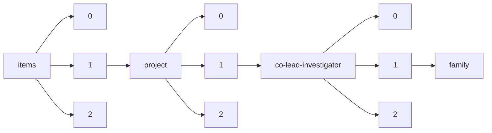

!!! warning "This document is not official Crossref documentation"
# Family
PATH = items/array/project/array/co-lead-investigator/array/family(1)  
Occurs 4 342 times  
Unique values: > 999  
{ .annotate }

1. A route to an element, for example:  
   The route "items/array/project/array/co-lead-investigator/array/family" corresponds to navigating through the JSON indices as  
   ["items"][0]["project"][0]["co-lead-investigator"][0]["family"]  

!!! note "Due to current limitations, only the first 1,000 unique values are counted."

| **Row** | **Value** `String` | **Count** `Int64` |
|--------:|----------------------:|---------------------:|
| **1**   | Woyke                 | 36                   |
| **2**   | Grigoriev             | 31                   |
| **3**   | Tuskan                | 28                   |
| **4**   | Wang                  | 24                   |
| **5**   | Tringe                | 19                   |
| **6**   | Baker                 | 18                   |
| **7**   | Jansson               | 17                   |
| **8**   | Chen                  | 17                   |
| **9**   | Martin                | 16                   |
| **10**  | Taylor                | 14                   |
| **11**  | Hofmockel             | 14                   |
| **12**  | Hugenholtz            | 13                   |
| **13**  | Cullen                | 13                   |
| **14**  | Scheibe               | 12                   |
| **15**  | Brown                 | 12                   |
| **16**  | Li                    | 12                   |
| **17**  | Magnuson              | 12                   |
| **18**  | Vilgalys              | 11                   |
| **19**  | Muchero               | 11                   |
| **20**  | Donohue               | 11                   |
| **21**  | Ward                  | 11                   |
| **22**  | Kyrpides              | 10                   |
| **23**  | Shaw                  | 10                   |
| **24**  | Wright                | 10                   |
| **25**  | Johnson               | 10                   |
| **26**  | Keasling              | 10                   |
| **27**  | Hallam                | 9                    |
| **28**  | Merchant              | 9                    |
| **29**  | Zhao                  | 9                    |
| **30**  | Klenk                 | 9                    |
| **31**  | Kelly                 | 9                    |
| **32**  | Smith                 | 9                    |
| **33**  | Stajich               | 9                    |
| **34**  | Wilkins               | 8                    |
| **35**  | Tsang                 | 8                    |
| **36**  | Yu                    | 8                    |
| **37**  | Malmstrom             | 8                    |
| **38**  | Schreiber             | 8                    |
| **39**  | Miller                | 8                    |
| **40**  | Orr                   | 8                    |
| **41**  | Sullivan              | 8                    |
| **42**  | Bailey                | 8                    |
| **43**  | Niyogi                | 8                    |
| **44**  | Bertilsson            | 8                    |
| **45**  | Zhang                 | 8                    |
| **46**  | Hibbett               | 7                    |
| **47**  | Qafoku                | 7                    |
| **48**  | Zhu                   | 7                    |
| **49**  | Cort                  | 7                    |
| **50**  | Ginovska              | 7                    |
| **51**  | Williams              | 7                    |
| **52**  | Mullet                | 7                    |
| **53**  | Gilles                | 7                    |
| **54**  | Rosso                 | 7                    |
| **55**  | Liao                  | 7                    |
| **56**  | Brodie                | 7                    |
| **57**  | Mockler               | 7                    |
| **58**  | Henry                 | 7                    |
| **59**  | Fredrickson           | 7                    |
| **60**  | Cheng                 | 6                    |
| **61**  | Swaminathan           | 6                    |
| **62**  | Stepanauskas          | 6                    |
| **63**  | Gilbert               | 6                    |
| **64**  | Mortimer              | 6                    |
| **65**  | Arnold                | 6                    |
| **66**  | Wagner                | 6                    |
| **67**  | Graham                | 6                    |
| **68**  | Tfaily                | 6                    |
| **69**  | Weber                 | 6                    |
| **70**  | Pett-Ridge            | 6                    |
| **71**  | Keeling               | 6                    |
| **72**  | Bhatnagar             | 6                    |
| **73**  | Simmons               | 6                    |
| **74**  | Edger                 | 6                    |
| **75**  | Paulsen               | 6                    |
| **76**  | Hoyt                  | 6                    |
| **77**  | Scheller              | 6                    |
| **78**  | Dixon                 | 6                    |
| **79**  | Freitag               | 6                    |
| **80**  | Gladden               | 6                    |
| **81**  | Bartley               | 6                    |
| **82**  | Wrighton              | 6                    |
| **83**  | Kim                   | 6                    |
| **84**  | Thomas                | 6                    |
| **85**  | Hu                    | 6                    |
| **86**  | Pan                   | 6                    |
| **87**  | Anderton              | 6                    |
| **88**  | Amasino               | 6                    |
| **89**  | Knopf                 | 6                    |
| **90**  | Mueller               | 6                    |
| **91**  | Pearce                | 6                    |
| **92**  | Evans                 | 6                    |
| **93**  | Lee                   | 5                    |
| **94**  | Cumming               | 5                    |
| **95**  | Noguera               | 5                    |
| **96**  | Ivanova               | 5                    |
| **97**  | Weston                | 5                    |
| **98**  | Shen                  | 5                    |
| **99**  | Mitchell-Olds         | 5                    |
| **100** | Patel                 | 5                    |
| **101** | Blaby                 | 5                    |
| **102** | Ansong                | 5                    |
| **103** | Howe                  | 5                    |
| **104** | 井上                  | 5                    |
| **105** | Schadt                | 5                    |
| **106** | Dunlap                | 5                    |
| **107** | Raugei                | 5                    |
| **108** | Isern                 | 5                    |
| **109** | Nelson                | 5                    |
| **110** | Strenkert             | 5                    |
| **111** | Schmutz               | 5                    |
| **112** | Juenger               | 5                    |
| **113** | Bowman                | 5                    |
| **114** | Beam                  | 5                    |
| **115** | Perea                 | 5                    |
| **116** | Hixson                | 5                    |
| **117** | Davis                 | 5                    |
| **118** | Fox                   | 5                    |
| **119** | Henrissat             | 5                    |
| **120** | Fendorf               | 5                    |
| **121** | Rodland               | 5                    |
| **122** | Stuart                | 5                    |
| **123** | Thompson              | 5                    |
| **124** | Rich                  | 5                    |
| **125** | de Vries              | 5                    |
| **126** | Yang                  | 5                    |
| **127** | Vogel                 | 5                    |
| **128** | Mei                   | 5                    |
| **129** | Turgeon               | 5                    |
| **130** | Polle                 | 4                    |
| **131** | Wisecaver             | 4                    |
| **132** | Borland               | 4                    |
| **133** | Arkin                 | 4                    |
| **134** | Liu                   | 4                    |
| **135** | Ronald                | 4                    |
| **136** | Jones                 | 4                    |
| **137** | Eudes                 | 4                    |
| **138** | Du                    | 4                    |
| **139** | Bock                  | 4                    |
| **140** | Hittinger             | 4                    |
| **141** | Ault                  | 4                    |
| **142** | DeAngelis             | 4                    |
| **143** | Rousseau              | 4                    |
| **144** | Chern                 | 4                    |
| **145** | Warren                | 4                    |
| **146** | Moffet                | 4                    |
| **147** | Waters                | 4                    |
| **148** | Cannon                | 4                    |
| **149** | Chain                 | 4                    |
| **150** | 金子                  | 4                    |
| **151** | Shi                   | 4                    |
| **152** | Dodsworth             | 4                    |
| **153** | Palmer                | 4                    |
| **154** | Eisen                 | 4                    |
| **155** | Bohutskyi             | 4                    |
| **156** | McKay                 | 4                    |
| **157** | Davin                 | 4                    |
| **158** | Kirkpatrick           | 4                    |
| **159** | 小林                  | 4                    |
| **160** | Yoshikuni             | 4                    |
| **161** | Moon                  | 4                    |
| **162** | Riemer                | 4                    |
| **163** | Landick               | 4                    |
| **164** | Park                  | 4                    |
| **165** | Fields                | 4                    |
| **166** | Pasa-Tolic            | 4                    |
| **167** | Eloe-Fadrosh          | 4                    |
| **168** | Cushman               | 4                    |
| **169** | Stewart               | 4                    |
| **170** | Bristow               | 4                    |
| **171** | O'Malley              | 4                    |
| **172** | Hess                  | 4                    |
| **173** | 渡辺                  | 4                    |
| **174** | Keiluweit             | 4                    |
| **175** | Sushko                | 4                    |
| **176** | De Yoreo              | 4                    |
| **177** | Valiev                | 4                    |
| **178** | Lowry                 | 4                    |
| **179** | Mukhopadhyay          | 4                    |
| **180** | Rensing               | 4                    |
| **181** | Saha                  | 4                    |
| **182** | Jay                   | 4                    |
| **183** | Myers-Pigg            | 4                    |
| **184** | Reddy                 | 4                    |
| **185** | Glass                 | 4                    |
| **186** | Pisabarro             | 4                    |
| **187** | Frey                  | 4                    |
| **188** | 石井                  | 4                    |
| **189** | Kreuzer               | 4                    |
| **190** | Lindemann             | 4                    |
| **191** | Hale                  | 3                    |
| **192** | Ware                  | 3                    |
| **193** | Stolyar               | 3                    |
| **194** | Köpke                 | 3                    |
| **195** | Roberts               | 3                    |
| **196** | Zheng                 | 3                    |
| **197** | Simister              | 3                    |
| **198** | Lau                   | 3                    |
| **199** | Callister             | 3                    |
| **200** | Murray                | 3                    |
| **201** | Nizkorodov            | 3                    |
| **202** | Bluhm                 | 3                    |
| **203** | Grossman              | 3                    |
| **204** | Kay                   | 3                    |
| **205** | Martinez              | 3                    |
| **206** | Han                   | 3                    |
| **207** | Rivers                | 3                    |
| **208** | Klotz                 | 3                    |
| **209** | Moulton               | 3                    |
| **210** | 北川                  | 3                    |
| **211** | Smart                 | 3                    |
| **212** | Kerisit               | 3                    |
| **213** | Metz                  | 3                    |
| **214** | Friesen               | 3                    |
| **215** | Kostka                | 3                    |
| **216** | Bouskill              | 3                    |
| **217** | Konstantinidis        | 3                    |
| **218** | Hatzenpichler         | 3                    |
| **219** | Huang                 | 3                    |
| **220** | Wu                    | 3                    |
| **221** | Buell                 | 3                    |
| **222** | Rooney                | 3                    |
| **223** | Brandizzi             | 3                    |
| **224** | Druzhinina            | 3                    |
| **225** | Gao                   | 3                    |
| **226** | Brady                 | 3                    |
| **227** | White                 | 3                    |
| **228** | McKain                | 3                    |
| **229** | Elkins                | 3                    |
| **230** | Steele                | 3                    |
| **231** | Lam                   | 3                    |
| **232** | Bryant                | 3                    |
| **233** | Kyle                  | 3                    |
| **234** | Willardson            | 3                    |
| **235** | Chin                  | 3                    |
| **236** | Martiny               | 3                    |
| **237** | Makela                | 3                    |
| **238** | Singer                | 3                    |
| **239** | D'haeseleer           | 3                    |
| **240** | Sassi                 | 3                    |
| **241** | Brzostek              | 3                    |
| **242** | Van de Peer           | 3                    |
| **243** | Firestone             | 3                    |
| **244** | 安田                  | 3                    |
| **245** | Hamberger             | 3                    |
| **246** | Hartwell              | 3                    |
| **247** | Pires                 | 3                    |
| **248** | Bohannan              | 3                    |
| **249** | Hubbard               | 3                    |
| **250** | Dunfield              | 3                    |
| **251** | Stacey                | 3                    |
| **252** | 長坂                  | 3                    |
| **253** | Karpen                | 3                    |
| **254** | Schmelz               | 3                    |
| **255** | Crump                 | 3                    |
| **256** | Moran                 | 3                    |
| **257** | Eng                   | 3                    |
| **258** | Huffaker              | 3                    |
| **259** | 松原                  | 3                    |
| **260** | Mazzoleni             | 3                    |
| **261** | Harris                | 3                    |
| **262** | Jacobson              | 3                    |
| **263** | Beck                  | 3                    |
| **264** | Xin                   | 3                    |
| **265** | James                 | 3                    |
| **266** | 近藤                  | 3                    |
| **267** | Olson                 | 3                    |
| **268** | McCue                 | 3                    |
| **269** | Pesavento             | 3                    |
| **270** | Peterson              | 3                    |
| **271** | Andersen              | 3                    |
| **272** | Kieft                 | 3                    |
| **273** | Eckert                | 3                    |
| **274** | Santoro               | 3                    |
| **275** | Stegen                | 3                    |
| **276** | Blanchette            | 3                    |
| **277** | Hillson               | 3                    |
| **278** | Chiu                  | 3                    |
| **279** | Haggblom              | 3                    |
| **280** | McDermott             | 3                    |
| **281** | Conant                | 3                    |
| **282** | Francis               | 3                    |
| **283** | Chan                  | 3                    |
| **284** | Alper                 | 3                    |
| **285** | Plett                 | 3                    |
| **286** | China                 | 3                    |
| **287** | Ankem                 | 3                    |
| **288** | Teske                 | 3                    |
| **289** | Kema                  | 3                    |
| **290** | Gasch                 | 3                    |
| **291** | Sachs                 | 3                    |
| **292** | Udvardi               | 3                    |
| **293** | Rusch                 | 3                    |
| **294** | Göker                 | 3                    |
| **295** | Katz                  | 3                    |
| **296** | Lutzoni               | 3                    |
| **297** | Whitman               | 3                    |
| **298** | 山本                  | 3                    |
| **299** | Welander              | 3                    |
| **300** | Walker                | 3                    |
| **301** | Boyd                  | 3                    |
| **302** | Craven                | 3                    |
| **303** | Bhatia                | 3                    |
| **304** | Saunders              | 3                    |
| **305** | Harrison              | 3                    |
| **306** | Kirchman              | 3                    |
| **307** | Arey                  | 3                    |
| **308** | Nakayasu              | 2                    |
| **309** | Sczyrba               | 2                    |
| **310** | Traxler               | 2                    |
| **311** | Pop                   | 2                    |
| **312** | Concepcion            | 2                    |
| **313** | Mazur                 | 2                    |
| **314** | Bakkeren              | 2                    |
| **315** | Guerra                | 2                    |
| **316** | Ryan                  | 2                    |
| **317** | Cregger               | 2                    |
| **318** | Haygood               | 2                    |
| **319** | Bass                  | 2                    |
| **320** | 隅田                  | 2                    |
| **321** | Jungbluth             | 2                    |
| **322** | Lemaux                | 2                    |
| **323** | Mitchell              | 2                    |
| **324** | Sun                   | 2                    |
| **325** | Blazewicz             | 2                    |
| **326** | Rappe                 | 2                    |
| **327** | Schaefer              | 2                    |
| **328** | Bonneville            | 2                    |
| **329** | Raschke               | 2                    |
| **330** | Vaishampayan          | 2                    |
| **331** | Ragsdale              | 2                    |
| **332** | Möller                | 2                    |
| **333** | Bell-Pedersen         | 2                    |
| **334** | Govind                | 2                    |
| **335** | Brummer               | 2                    |
| **336** | Kerfeld               | 2                    |
| **337** | 室田                  | 2                    |
| **338** | Templer               | 2                    |
| **339** | Bruns                 | 2                    |
| **340** | 長谷川                | 2                    |
| **341** | Sundaresan            | 2                    |
| **342** | Sale                  | 2                    |
| **343** | Kohler                | 2                    |
| **344** | Schmidt-Dannert       | 2                    |
| **345** | kalyuzhnaya           | 2                    |
| **346** | Vertes                | 2                    |
| **347** | Onstott               | 2                    |
| **348** | Kovarik               | 2                    |
| **349** | Jastrow               | 2                    |
| **350** | Pichler               | 2                    |
| **351** | Visel                 | 2                    |
| **352** | Borevitz              | 2                    |
| **353** | Perring               | 2                    |
| **354** | DeLeon-Rodriguez      | 2                    |
| **355** | Tsai                  | 2                    |
| **356** | Fuhrman               | 2                    |
| **357** | Lei                   | 2                    |
| **358** | Doonan                | 2                    |
| **359** | Finley                | 2                    |
| **360** | Dietrich              | 2                    |
| **361** | Himmel                | 2                    |
| **362** | Rayaprolu             | 2                    |
| **363** | Umen                  | 2                    |
| **364** | Megonigal             | 2                    |
| **365** | Pharkya               | 2                    |
| **366** | Salas-Lizana          | 2                    |
| **367** | Veneault-Fourrey      | 2                    |
| **368** | 牧野                  | 2                    |
| **369** | Philippe              | 2                    |
| **370** | 内田                  | 2                    |
| **371** | Dentinger             | 2                    |
| **372** | Dopson                | 2                    |
| **373** | Kent                  | 2                    |
| **374** | Konopka               | 2                    |
| **375** | Zhong                 | 2                    |
| **376** | Currie                | 2                    |
| **377** | Scott                 | 2                    |
| **378** | Lane                  | 2                    |
| **379** | Vaziri                | 2                    |
| **380** | Moyer                 | 2                    |
| **381** | Cross                 | 2                    |
| **382** | Vermerris             | 2                    |
| **383** | Yerramsetty           | 2                    |
| **384** | Guan                  | 2                    |
| **385** | McNear                | 2                    |
| **386** | Kistler               | 2                    |
| **387** | Karaoz                | 2                    |
| **388** | Archibald             | 2                    |
| **389** | Penuelas              | 2                    |
| **390** | O'Neill               | 2                    |
| **391** | 各務                  | 2                    |
| **392** | Adams                 | 2                    |
| **393** | Hori                  | 2                    |
| **394** | Zimmerman             | 2                    |
| **395** | Bertram               | 2                    |
| **396** | Opulente              | 2                    |
| **397** | Kwan                  | 2                    |
| **398** | Chatterjee            | 2                    |
| **399** | Thelen                | 2                    |
| **400** | Nagy                  | 2                    |
| **401** | Nesson                | 2                    |
| **402** | Baaz                  | 2                    |
| **403** | Shin                  | 2                    |
| **404** | Grossart              | 2                    |
| **405** | 佐宗                  | 2                    |
| **406** | Aime                  | 2                    |
| **407** | Shih                  | 2                    |
| **408** | Mason                 | 2                    |
| **409** | DeLong                | 2                    |
| **410** | Mitros                | 2                    |
| **411** | Idnurm                | 2                    |
| **412** | Sadowsky              | 2                    |
| **413** | Olszta                | 2                    |
| **414** | Weigel                | 2                    |
| **415** | 福田                  | 2                    |
| **416** | McMahon               | 2                    |
| **417** | Narrowe               | 2                    |
| **418** | Kujawinski            | 2                    |
| **419** | 公文                  | 2                    |
| **420** | Devos                 | 2                    |
| **421** | Shilling              | 2                    |
| **422** | Halkett               | 2                    |
| **423** | Hansen                | 2                    |
| **424** | Driscoll              | 2                    |
| **425** | Suen                  | 2                    |
| **426** | Polson                | 2                    |
| **427** | Northen               | 2                    |
| **428** | Moronta               | 2                    |
| **429** | Richards              | 2                    |
| **430** | Bowers                | 2                    |
| **431** | Weitz                 | 2                    |
| **432** | Olsen                 | 2                    |
| **433** | Linger                | 2                    |
| **434** | Chang                 | 2                    |
| **435** | Sukno                 | 2                    |
| **436** | Gulder                | 2                    |
| **437** | Badger                | 2                    |
| **438** | Moore                 | 2                    |
| **439** | Ma                    | 2                    |
| **440** | Voegele               | 2                    |
| **441** | Cove                  | 2                    |
| **442** | Vallino               | 2                    |
| **443** | Price                 | 2                    |
| **444** | Stenlid               | 2                    |
| **445** | Schmoll               | 2                    |
| **446** | Mower                 | 2                    |
| **447** | Terashima             | 2                    |
| **448** | Sengupta              | 2                    |
| **449** | 岡田                  | 2                    |
| **450** | Lapidus               | 2                    |
| **451** | Goicoechea            | 2                    |
| **452** | Dexheimer             | 2                    |
| **453** | Wolfe                 | 2                    |
| **454** | Newton                | 2                    |
| **455** | Collins               | 2                    |
| **456** | Dombrowski            | 2                    |
| **457** | Woods                 | 2                    |
| **458** | 野口                  | 2                    |
| **459** | Zuber                 | 2                    |
| **460** | Wakao                 | 2                    |
| **461** | Abergel               | 2                    |
| **462** | Colpaert              | 2                    |
| **463** | Mackie                | 2                    |
| **464** | Tiedje                | 2                    |
| **465** | Pester                | 2                    |
| **466** | Phillips              | 2                    |
| **467** | Lopez-Ruiz            | 2                    |
| **468** | Soo                   | 2                    |
| **469** | Rokhsar               | 2                    |
| **470** | Binder                | 2                    |
| **471** | Swan                  | 2                    |
| **472** | Piao                  | 2                    |
| **473** | Loy                   | 2                    |
| **474** | Rinke                 | 2                    |
| **475** | Mackelprang           | 2                    |
| **476** | 辻本                  | 2                    |
| **477** | Jaffe                 | 2                    |
| **478** | Bedre                 | 2                    |
| **479** | Benz                  | 2                    |
| **480** | Alexandre             | 2                    |
| **481** | 宮田                  | 2                    |
| **482** | 山崎                  | 2                    |
| **483** | Lu                    | 2                    |
| **484** | Granitsiotis          | 2                    |
| **485** | Plant                 | 2                    |
| **486** | Henager               | 2                    |
| **487** | Mouser                | 2                    |
| **488** | Glöckner              | 2                    |
| **489** | Spatafora             | 2                    |
| **490** | Figueroa              | 2                    |
| **491** | Moose                 | 2                    |
| **492** | Stiller               | 2                    |
| **493** | Thomson               | 2                    |
| **494** | Kellogg               | 2                    |
| **495** | Hernandez-Garcia      | 2                    |
| **496** | Afkhami               | 2                    |
| **497** | Varga                 | 2                    |
| **498** | De Mita               | 2                    |
| **499** | Deskins               | 2                    |
| **500** | Hazen                 | 2                    |
| **501** | Decker                | 2                    |
| **502** | 酒井                  | 2                    |
| **503** | Duncan                | 2                    |
| **504** | Bartlett              | 2                    |
| **505** | Stoddard              | 2                    |
| **506** | Hedlund               | 2                    |
| **507** | Bart                  | 2                    |
| **508** | Probst                | 2                    |
| **509** | Schranz               | 2                    |
| **510** | Kling                 | 2                    |
| **511** | Gorbushina            | 2                    |
| **512** | Kaiser                | 2                    |
| **513** | Hudson                | 2                    |
| **514** | Dijkstra              | 2                    |
| **515** | Grunden               | 2                    |
| **516** | Perkins               | 2                    |
| **517** | Hardy                 | 2                    |
| **518** | Schilling             | 2                    |
| **519** | Neurock               | 2                    |
| **520** | Kubicek               | 2                    |
| **521** | Kuske                 | 2                    |
| **522** | Basiliko              | 2                    |
| **523** | Weeks                 | 2                    |
| **524** | Tebo                  | 2                    |
| **525** | Rudgers               | 2                    |
| **526** | Tan                   | 2                    |
| **527** | Jacobs                | 2                    |
| **528** | Xu                    | 2                    |
| **529** | Papke                 | 2                    |
| **530** | Barco                 | 2                    |
| **531** | Balestrini            | 2                    |
| **532** | Bryan                 | 2                    |
| **533** | Pelletier             | 2                    |
| **534** | Morgan-Kiss           | 2                    |
| **535** | Beliaev               | 2                    |
| **536** | Ziels                 | 2                    |
| **537** | Kleiner               | 2                    |
| **538** | Sakamoto              | 2                    |
| **539** | 吉川                  | 2                    |
| **540** | 鈴木                  | 2                    |
| **541** | Larsen                | 2                    |
| **542** | Hartl                 | 2                    |
| **543** | Blumer-Schuette       | 2                    |
| **544** | Peura                 | 2                    |
| **545** | Lilburn               | 2                    |
| **546** | Tagkopoulos           | 2                    |
| **547** | Wosten                | 2                    |
| **548** | Church                | 2                    |
| **549** | Plugge                | 2                    |
| **550** | Song                  | 2                    |
| **551** | Ilton                 | 2                    |
| **552** | Mouncey               | 2                    |
| **553** | Tanguay               | 2                    |
| **554** | Arahal                | 2                    |
| **555** | Dontsova              | 2                    |
| **556** | Long                  | 2                    |
| **557** | 岩田                  | 2                    |
| **558** | Skerker               | 2                    |
| **559** | Casler                | 2                    |
| **560** | 中藤                  | 2                    |
| **561** | Geiser                | 2                    |
| **562** | Pomraning             | 2                    |
| **563** | Christen              | 2                    |
| **564** | Yuk                   | 2                    |
| **565** | Grettenberger         | 2                    |
| **566** | Budak                 | 2                    |
| **567** | Kooistra              | 2                    |
| **568** | 岩井                  | 2                    |
| **569** | Kowalski              | 2                    |
| **570** | Van Mooy              | 2                    |
| **571** | Leebens-Mack          | 2                    |
| **572** | Sims                  | 2                    |
| **573** | D'Hont                | 2                    |
| **574** | 池田                  | 2                    |
| **575** | Garcia                | 2                    |
| **576** | Schroda               | 2                    |
| **577** | Wirth                 | 2                    |
| **578** | Wing                  | 2                    |
| **579** | Baron                 | 2                    |
| **580** | Garrity               | 2                    |
| **581** | Blackwell             | 2                    |
| **582** | Whitehead             | 2                    |
| **583** | 清野                  | 1                    |
| **584** | 中井                  | 1                    |
| **585** | Epstein               | 1                    |
| **586** | Bill                  | 1                    |
| **587** | PiJGIUno              | 1                    |
| **588** | Marks                 | 1                    |
| **589** | Thevuthasan           | 1                    |
| **590** | Scully                | 1                    |
| **591** | Dinneny               | 1                    |
| **592** | 江口                  | 1                    |
| **593** | David                 | 1                    |
| **594** | Zubcevic              | 1                    |
| **595** | 佐々木                | 1                    |
| **596** | Broderick             | 1                    |
| **597** | Mchaourab             | 1                    |
| **598** | Mechtler              | 1                    |
| **599** | Gathman               | 1                    |
| **600** | Chinn                 | 1                    |
| **601** | McCollom              | 1                    |
| **602** | Pantano               | 1                    |
| **603** | Desnues               | 1                    |
| **604** | Tobias                | 1                    |
| **605** | Chauhan               | 1                    |
| **606** | Landry                | 1                    |
| **607** | Alder                 | 1                    |
| **608** | Morrissey             | 1                    |
| **609** | Comai                 | 1                    |
| **610** | Hinck                 | 1                    |
| **611** | 庭野                  | 1                    |
| **612** | Clevenger             | 1                    |
| **613** | Wick                  | 1                    |
| **614** | Tunlid                | 1                    |
| **615** | Hopkinson             | 1                    |
| **616** | Durham                | 1                    |
| **617** | 瀬戸                  | 1                    |
| **618** | Moser                 | 1                    |
| **619** | Bertrand              | 1                    |
| **620** | Strynadka             | 1                    |
| **621** | Bohlmann              | 1                    |
| **622** | 杉山                  | 1                    |
| **623** | Farlik-Födinger       | 1                    |
| **624** | Nusinow               | 1                    |
| **625** | Gihring               | 1                    |
| **626** | Varadharajan          | 1                    |
| **627** | Saski                 | 1                    |
| **628** | Braus                 | 1                    |
| **629** | van Diepen            | 1                    |
| **630** | Thiemann              | 1                    |
| **631** | Redlberger-Fritz      | 1                    |
| **632** | Melis                 | 1                    |
| **633** | Jackson               | 1                    |
| **634** | Piskur                | 1                    |
| **635** | Mutalik               | 1                    |
| **636** | von Laufenberg        | 1                    |
| **637** | 福井                  | 1                    |
| **638** | Pinhasi               | 1                    |
| **639** | Falco                 | 1                    |
| **640** | Woebken               | 1                    |
| **641** | Town                  | 1                    |
| **642** | Waugh                 | 1                    |
| **643** | Nico                  | 1                    |
| **644** | Nobu                  | 1                    |
| **645** | Howard-Varona         | 1                    |
| **646** | Procaccini            | 1                    |
| **647** | Temiakov              | 1                    |
| **648** | Daum                  | 1                    |
| **649** | Kutalek               | 1                    |
| **650** | Townsend              | 1                    |
| **651** | Hartman               | 1                    |
| **652** | Baconguis             | 1                    |
| **653** | Sharon                | 1                    |
| **654** | Kelleher              | 1                    |
| **655** | 釘宮                  | 1                    |
| **656** | Rodrigo               | 1                    |
| **657** | Schweller             | 1                    |
| **658** | 金井                  | 1                    |
| **659** | Fritschi              | 1                    |
| **660** | 中澤                  | 1                    |
| **661** | Seppala               | 1                    |
| **662** | Oxford                | 1                    |
| **663** | Wickland              | 1                    |
| **664** | Wegrzyn               | 1                    |
| **665** | Neoson                | 1                    |
| **666** | Mur                   | 1                    |
| **667** | Bishop                | 1                    |
| **668** | Zillich               | 1                    |
| **669** | Gregory               | 1                    |
| **670** | Donachie              | 1                    |
| **671** | Bernier-Latmani       | 1                    |
| **672** | Gutiérrez             | 1                    |
| **673** | Ertl                  | 1                    |
| **674** | Lorito                | 1                    |
| **675** | Boggs                 | 1                    |
| **676** | 大崎                  | 1                    |
| **677** | Mclean                | 1                    |
| **678** | Schmeiser             | 1                    |
| **679** | Melillo               | 1                    |
| **680** | 村上                  | 1                    |
| **681** | MacLean               | 1                    |
| **682** | Puzey                 | 1                    |
| **683** | Vyverman              | 1                    |
| **684** | 辰巳砂                | 1                    |
| **685** | Swing                 | 1                    |
| **686** | McLachlan             | 1                    |
| **687** | Gundacker             | 1                    |
| **688** | 糸川                  | 1                    |
| **689** | Helliwell             | 1                    |
| **690** | Bidle                 | 1                    |
| **691** | 西浦                  | 1                    |
| **692** | Dhungana              | 1                    |
| **693** | Soreghan              | 1                    |
| **694** | McNichol              | 1                    |
| **695** | Salome                | 1                    |
| **696** | Krause                | 1                    |
| **697** | Sasse                 | 1                    |
| **698** | Konrat                | 1                    |
| **699** | Gruber                | 1                    |
| **700** | Torok                 | 1                    |
| **701** | Gore                  | 1                    |
| **702** | Tyson                 | 1                    |
| **703** | Crowell               | 1                    |
| **704** | Bowen                 | 1                    |
| **705** | Poirier               | 1                    |
| **706** | McAlvay               | 1                    |
| **707** | Apte                  | 1                    |
| **708** | Bryson                | 1                    |
| **709** | Schulze-Makuch        | 1                    |
| **710** | DeHaan                | 1                    |
| **711** | 笠原                  | 1                    |
| **712** | Parasa                | 1                    |
| **713** | Patunru               | 1                    |
| **714** | Arrigo                | 1                    |
| **715** | Engel                 | 1                    |
| **716** | Pfrengle              | 1                    |
| **717** | Ponts                 | 1                    |
| **718** | Khudyakov             | 1                    |
| **719** | Trujillo              | 1                    |
| **720** | Goldeck               | 1                    |
| **721** | Schofield             | 1                    |
| **722** | Haselbach             | 1                    |
| **723** | Okada                 | 1                    |
| **724** | Dierig                | 1                    |
| **725** | Mikucki               | 1                    |
| **726** | Pandey                | 1                    |
| **727** | Barker                | 1                    |
| **728** | Brinkhoff             | 1                    |
| **729** | Claxton               | 1                    |
| **730** | Arnadottir            | 1                    |
| **731** | 珠玖                  | 1                    |
| **732** | Spanbauer             | 1                    |
| **733** | McClendon             | 1                    |
| **734** | Joly                  | 1                    |
| **735** | Schafer               | 1                    |
| **736** | He                    | 1                    |
| **737** | Woltran               | 1                    |
| **738** | 武内                  | 1                    |
| **739** | Thomashow             | 1                    |
| **740** | Tawfik                | 1                    |
| **741** | Van Voorhis           | 1                    |
| **742** | 宇野                  | 1                    |
| **743** | Pombert               | 1                    |
| **744** | 安藤                  | 1                    |
| **745** | Szöllösi              | 1                    |
| **746** | Janssonn              | 1                    |
| **747** | Pellizari             | 1                    |
| **748** | Gloeckner             | 1                    |
| **749** | 韓                    | 1                    |
| **750** | Fakas                 | 1                    |
| **751** | Posert                | 1                    |
| **752** | Schleper              | 1                    |
| **753** | Nusslein              | 1                    |
| **754** | Tauböck               | 1                    |
| **755** | Boulton               | 1                    |
| **756** | Mauzey                | 1                    |
| **757** | Ruytinx               | 1                    |
| **758** | Georgoulis            | 1                    |
| **759** | Lugones               | 1                    |
| **760** | Tiemann               | 1                    |
| **761** | Sowa                  | 1                    |
| **762** | Trettin               | 1                    |
| **763** | 荘村                  | 1                    |
| **764** | 松山                  | 1                    |
| **765** | Freschi               | 1                    |
| **766** | Fones                 | 1                    |
| **767** | Kreidenweis           | 1                    |
| **768** | Fischer               | 1                    |
| **769** | Spitz                 | 1                    |
| **770** | Armache               | 1                    |
| **771** | Klepsch               | 1                    |
| **772** | Su                    | 1                    |
| **773** | Berthiller            | 1                    |
| **774** | Ebright               | 1                    |
| **775** | 川田                  | 1                    |
| **776** | Coleman               | 1                    |
| **777** | Jessen                | 1                    |
| **778** | Ohlrogge              | 1                    |
| **779** | 畑中                  | 1                    |
| **780** | Knoshaug              | 1                    |
| **781** | Barber                | 1                    |
| **782** | Pancera               | 1                    |
| **783** | Exarhos               | 1                    |
| **784** | Debler                | 1                    |
| **785** | Perez Alquicira       | 1                    |
| **786** | 保坂                  | 1                    |
| **787** | Trotsenko             | 1                    |
| **788** | McMahan               | 1                    |
| **789** | 刑部                  | 1                    |
| **790** | Bullerjahn            | 1                    |
| **791** | Sobel                 | 1                    |
| **792** | 瀧                    | 1                    |
| **793** | 張                    | 1                    |
| **794** | Robinson              | 1                    |
| **795** | Brohawn               | 1                    |
| **796** | Tuinstra              | 1                    |
| **797** | Ranjan                | 1                    |
| **798** | Mugnozza              | 1                    |
| **799** | Spring                | 1                    |
| **800** | Shutthanandan         | 1                    |
| **801** | Copp                  | 1                    |
| **802** | Vielle-Calzada        | 1                    |
| **803** | Navid                 | 1                    |
| **804** | Magnabosco            | 1                    |
| **805** | Alalya-del-Rio        | 1                    |
| **806** | Xie                   | 1                    |
| **807** | Cohan                 | 1                    |
| **808** | DiChristina           | 1                    |
| **809** | De Marco              | 1                    |
| **810** | 中込                  | 1                    |
| **811** | Needoba               | 1                    |
| **812** | Bardhan               | 1                    |
| **813** | Orcutt                | 1                    |
| **814** | Bugnyar               | 1                    |
| **815** | Johannesson           | 1                    |
| **816** | Saupe                 | 1                    |
| **817** | 西野                  | 1                    |
| **818** | Leander               | 1                    |
| **819** | Hanley-Bowdoin        | 1                    |
| **820** | Weichhart             | 1                    |
| **821** | Martinez-Garcia       | 1                    |
| **822** | Tobin                 | 1                    |
| **823** | 厨川                  | 1                    |
| **824** | 中武                  | 1                    |
| **825** | Garcia-Pichel         | 1                    |
| **826** | Sattely               | 1                    |
| **827** | Purdom                | 1                    |
| **828** | Throckmorton          | 1                    |
| **829** | Gradinger             | 1                    |
| **830** | Fenical               | 1                    |
| **831** | Taborsky              | 1                    |
| **832** | Andersen-Ranberg      | 1                    |
| **833** | Hinrichs              | 1                    |
| **834** | Lang                  | 1                    |
| **835** | Ren                   | 1                    |
| **836** | Schlüter              | 1                    |
| **837** | Havermans             | 1                    |
| **838** | Deshmane              | 1                    |
| **839** | Gallery               | 1                    |
| **840** | Montresor             | 1                    |
| **841** | McComb                | 1                    |
| **842** | Ponocny               | 1                    |
| **843** | Grosell               | 1                    |
| **844** | 松木                  | 1                    |
| **845** | Flamm                 | 1                    |
| **846** | Yaghi                 | 1                    |
| **847** | Koltai                | 1                    |
| **848** | Woolf                 | 1                    |
| **849** | Huberman              | 1                    |
| **850** | Carey                 | 1                    |
| **851** | Chook                 | 1                    |
| **852** | McAllister            | 1                    |
| **853** | Sumner                | 1                    |
| **854** | Hollibaugh            | 1                    |
| **855** | Newcombe              | 1                    |
| **856** | Vaqué                 | 1                    |
| **857** | Cornell               | 1                    |
| **858** | McLaughlin            | 1                    |
| **859** | Sanderman             | 1                    |
| **860** | Falciatore            | 1                    |
| **861** | Dacks                 | 1                    |
| **862** | Blow                  | 1                    |
| **863** | Reed                  | 1                    |
| **864** | 前田                  | 1                    |
| **865** | 真島                  | 1                    |
| **866** | アンジェイ            | 1                    |
| **867** | Lyons                 | 1                    |
| **868** | Prescott              | 1                    |
| **869** | 松田                  | 1                    |
| **870** | Bennetzen             | 1                    |
| **871** | Zwiers                | 1                    |
| **872** | 角野                  | 1                    |
| **873** | Busby                 | 1                    |
| **874** | Solomon               | 1                    |
| **875** | Vader                 | 1                    |
| **876** | Tomasiak              | 1                    |
| **877** | Krausmann             | 1                    |
| **878** | Pearson               | 1                    |
| **879** | Weare                 | 1                    |
| **880** | Oken                  | 1                    |
| **881** | Vallejo-Marin         | 1                    |
| **882** | Morsy                 | 1                    |
| **883** | Tratnyek              | 1                    |
| **884** | Teeguarden            | 1                    |
| **885** | Heldebrant            | 1                    |
| **886** | Bargar                | 1                    |
| **887** | Lymperopoulou         | 1                    |
| **888** | 舟木                  | 1                    |
| **889** | Lisi                  | 1                    |
| **890** | Mahadevan             | 1                    |
| **891** | Eisenegger            | 1                    |
| **892** | Hughes                | 1                    |
| **893** | Revillini             | 1                    |
| **894** | Vuilleumier           | 1                    |
| **895** | Wotjak                | 1                    |
| **896** | Lunin                 | 1                    |
| **897** | Brazelton             | 1                    |
| **898** | Purkis                | 1                    |
| **899** | Lebrun                | 1                    |
| **900** | Russell               | 1                    |
| **901** | jetten                | 1                    |
| **902** | Free                  | 1                    |
| **903** | Cingolani             | 1                    |
| **904** | Fast                  | 1                    |
| **905** | Posewitz              | 1                    |
| **906** | Leggett               | 1                    |
| **907** | Cavalazzi             | 1                    |
| **908** | Wheeler               | 1                    |
| **909** | Metfies               | 1                    |
| **910** | Hassan                | 1                    |
| **911** | Hooten                | 1                    |
| **912** | Karagoez              | 1                    |
| **913** | Rodriguez Lopez       | 1                    |
| **914** | Karbaschi             | 1                    |
| **915** | Anitori               | 1                    |
| **916** | Ashworth              | 1                    |
| **917** | Stott                 | 1                    |
| **918** | 水田                  | 1                    |
| **919** | Stogios               | 1                    |
| **920** | Godoy-Vitorino        | 1                    |
| **921** | Salmeen               | 1                    |
| **922** | Jäger                 | 1                    |
| **923** | Daniel                | 1                    |
| **924** | 難波                  | 1                    |
| **925** | Ha                    | 1                    |
| **926** | Rajwa                 | 1                    |
| **927** | Mitulovic             | 1                    |
| **928** | Girguis               | 1                    |
| **929** | 大越                  | 1                    |
| **930** | Pignon                | 1                    |
| **931** | McGuire               | 1                    |
| **932** | Carroll               | 1                    |
| **933** | Veach                 | 1                    |
| **934** | Marx                  | 1                    |
| **935** | de Rond               | 1                    |
| **936** | Zhan                  | 1                    |
| **937** | Kenner                | 1                    |
| **938** | Lowe-Power            | 1                    |
| **939** | 畔上                  | 1                    |
| **940** | Kurtzman              | 1                    |
| **941** | Stavila               | 1                    |
| **942** | Schwans               | 1                    |
| **943** | Seifert               | 1                    |
| **944** | Hurlburt              | 1                    |
| **945** | Perotto               | 1                    |
| **946** | Varese                | 1                    |
| **947** | Choi                  | 1                    |
| **948** | Andersson             | 1                    |
| **949** | Lasek-Nesselquist     | 1                    |
| **950** | Weckhuysen            | 1                    |
| **951** | Ayliffe               | 1                    |
| **952** | Gmitter               | 1                    |
| **953** | Volkmann              | 1                    |
| **954** | Yoon                  | 1                    |
| **955** | Halbwirth             | 1                    |
| **956** | Keyhani               | 1                    |
| **957** | Esterbauer            | 1                    |
| **958** | Lumetta               | 1                    |
| **959** | Busch                 | 1                    |
| **960** | Krasevec              | 1                    |
| **961** | de Vos                | 1                    |
| **962** | Johansen              | 1                    |
| **963** | Rorrer                | 1                    |
| **964** | Greenham              | 1                    |
| **965** | Roy                   | 1                    |
| **966** | Fjellheim             | 1                    |
| **967** | Newman                | 1                    |
| **968** | 小宮山                | 1                    |
| **969** | Kayani                | 1                    |
| **970** | Ducklow               | 1                    |
| **971** | 浅原                  | 1                    |
| **972** | Chalhoub              | 1                    |
| **973** | Pierre                | 1                    |
| **974** | 玄                    | 1                    |
| **975** | Kneafsey              | 1                    |
| **976** | Agarwal               | 1                    |
| **977** | Halevi                | 1                    |
| **978** | Bandi                 | 1                    |
| **979** | Steefel               | 1                    |
| **980** | Weiss                 | 1                    |
| **981** | 夏目                  | 1                    |
| **982** | Raymond               | 1                    |
| **983** | Wortman               | 1                    |
| **984** | Napieralski           | 1                    |
| **985** | Silar                 | 1                    |
| **986** | Hector                | 1                    |
| **987** | 金田                  | 1                    |
| **988** | Mizrachi              | 1                    |
| **989** | Habteselassie         | 1                    |
| **990** | Martínez              | 1                    |
| **991** | Workman               | 1                    |
| **992** | Sanguinet             | 1                    |
| **993** | Engelhard             | 1                    |
| **994** | McSweeney             | 1                    |
| **995** | Gifford               | 1                    |
| **996** | Hocher                | 1                    |
| **997** | Peter                 | 1                    |
| **998** | Surratt               | 1                    |
| **999** | Iglesias-Prieto       | 1                    |
| ... | ... | ... |

