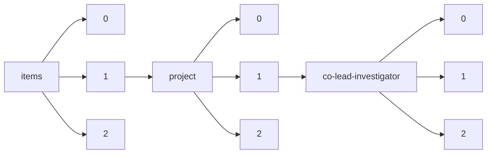

!!! warning "This document is not official Crossref documentation"
# Elements
PATH = items/array/project/array/co-lead-investigator/array(1)  
Occurs 4 579 times  
{ .annotate }

1. A route to an element, for example:  
   The route "items/array/project/array/co-lead-investigator/array" corresponds to navigating through the JSON indices as  
   ["items"][0]["project"][0]["co-lead-investigator"][0]  

## ORCID
See more information: [items/array/project/array/co-lead-investigator/array/ORCID](ORCID/index.md)  
Occurs 143 timess  
Unique values: 126  

| **Row** | **Value** `String`                | **Count** `Int64` |
|--------:|-------------------------------------:|---------------------:|
| **1**   | http://orcid.org/0000-0003-1586-2167 | 5                    |
| **2**   | http://orcid.org/0000-0001-9118-8480 | 3                    |
| **3**   | http://orcid.org/0000-0003-2046-5270 | 3                    |
| **4**   | http://orcid.org/0000-0003-0178-4225 | 2                    |
| **5**   | http://orcid.org/0000-0001-6107-3666 | 2                    |
| **6**   | http://orcid.org/0000-0001-6437-7809 | 2                    |
| **7**   | http://orcid.org/0000-0003-2502-2671 | 2                    |
| **8**   | http://orcid.org/0000-0002-0462-8132 | 2                    |
| **9**   | http://orcid.org/0000-0002-1873-3929 | 2                    |
| **10**  | http://orcid.org/0000-0002-6905-6841 | 2                    |
| ... | ... | ... |

## Affiliation
See more information: [items/array/project/array/co-lead-investigator/array/affiliation](affiliation/index.md)  
Occurs 4 579 timess  

| **Row** | **Length** `Any` | **Count** `Int64` |
|--------:|--------------------:|---------------------:|
| **1**   | 0                   | 3 609                |
| **2**   | 1                   | 970                  |

## Authenticated-orcid
See more information: [items/array/project/array/co-lead-investigator/array/authenticated-orcid](authenticated-orcid/index.md)  
Occurs 143 timess  
Unique values: 1  

| **Row** | **Value** `Bool` | **Count** `Int64` |
|--------:|--------------------:|---------------------:|
| **1**   | false               | 143                  |

## Family
See more information: [items/array/project/array/co-lead-investigator/array/family](family/index.md)  
Occurs 4 342 timess  
Unique values: > 999  

!!! note "Due to current limitations, only the first 1,000 unique values are counted."

| **Row** | **Value** `String` | **Count** `Int64` |
|--------:|----------------------:|---------------------:|
| **1**   | Woyke                 | 36                   |
| **2**   | Grigoriev             | 31                   |
| **3**   | Tuskan                | 28                   |
| **4**   | Wang                  | 24                   |
| **5**   | Tringe                | 19                   |
| **6**   | Baker                 | 18                   |
| **7**   | Jansson               | 17                   |
| **8**   | Chen                  | 17                   |
| **9**   | Martin                | 16                   |
| **10**  | Taylor                | 14                   |
| ... | ... | ... |

## Given
See more information: [items/array/project/array/co-lead-investigator/array/given](given/index.md)  
Occurs 4 341 timess  
Unique values: > 999  

!!! note "Due to current limitations, only the first 1,000 unique values are counted."

| **Row** | **Value** `String` | **Count** `Int64` |
|--------:|----------------------:|---------------------:|
| **1**   | Michael               | 82                   |
| **2**   | John                  | 74                   |
| **3**   | David                 | 72                   |
| **4**   | Daniel                | 63                   |
| **5**   | James                 | 57                   |
| **6**   | Peter                 | 48                   |
| **7**   | Timothy               | 47                   |
| **8**   | Thomas                | 38                   |
| **9**   | Tanja                 | 37                   |
| **10**  | Robert                | 36                   |
| ... | ... | ... |

## Role-end
See more information: [items/array/project/array/co-lead-investigator/array/role-end](role-end/index.md)  
Occurs 25 timess  

## Role-start
See more information: [items/array/project/array/co-lead-investigator/array/role-start](role-start/index.md)  
Occurs 25 timess  

