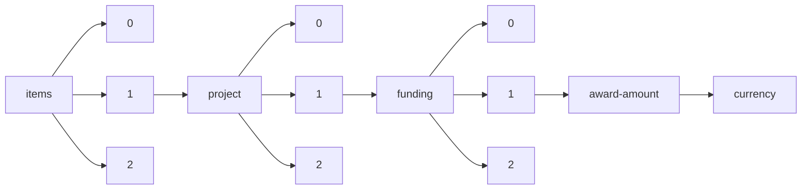

!!! warning "This document is not official Crossref documentation"
# Currency
PATH = items/array/project/array/funding/array/award-amount/currency(1)  
Occurs 41 037 times  
Unique values: 4  
{ .annotate }

1. A route to an element, for example:  
   The route "items/array/project/array/funding/array/award-amount/currency" corresponds to navigating through the JSON indices as  
   ["items"][0]["project"][0]["funding"][0]["award-amount"]["currency"]  

| **Row** | **Value** `String` | **Count** `Int64` |
|--------:|----------------------:|---------------------:|
| **1**   | EUR                   | 36 343               |
| **2**   | GBP                   | 4 008                |
| **3**   | USD                   | 609                  |
| **4**   | AUD                   | 77                   |

