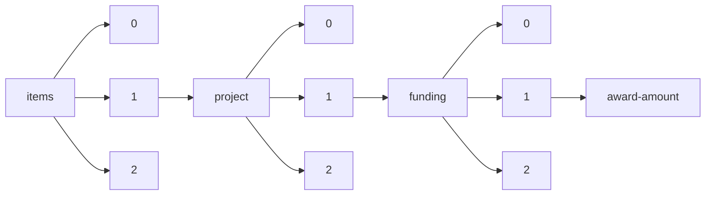

!!! warning "This document is not official Crossref documentation"
# Award-amount
PATH = items/array/project/array/funding/array/award-amount(1)  
Occurs 41 037 times  
{ .annotate }

1. A route to an element, for example:  
   The route "items/array/project/array/funding/array/award-amount" corresponds to navigating through the JSON indices as  
   ["items"][0]["project"][0]["funding"][0]["award-amount"]  

## Amount
See more information: [items/array/project/array/funding/array/award-amount/amount](amount/index.md)  
Occurs 41 037 timess  
Unique values: > 999  

!!! note "Due to current limitations, only the first 1,000 unique values are counted."

| **Row** | **Value** `Real` | **Count** `Int64` |
|--------:|--------------------:|---------------------:|
| **1**   | 50 000              | 4 321                |
| **2**   | 150 000             | 808                  |
| **3**   | 1.83455e5           | 778                  |
| **4**   | 1.95455e5           | 684                  |
| **5**   | 1 500 000           | 497                  |
| **6**   | 2 000 000           | 326                  |
| **7**   | 2 500 000           | 302                  |
| **8**   | 2.12934e5           | 280                  |
| **9**   | 2.24934e5           | 254                  |
| **10**  | 1.58122e5           | 243                  |
| ... | ... | ... |

## Currency
See more information: [items/array/project/array/funding/array/award-amount/currency](currency/index.md)  
Occurs 41 037 timess  
Unique values: 4  

| **Row** | **Value** `String` | **Count** `Int64` |
|--------:|----------------------:|---------------------:|
| **1**   | EUR                   | 36 343               |
| **2**   | GBP                   | 4 008                |
| **3**   | USD                   | 609                  |
| **4**   | AUD                   | 77                   |

## Percentage
See more information: [items/array/project/array/funding/array/award-amount/percentage](percentage/index.md)  
Occurs 41 037 timess  
Unique values: 23  

| **Row** | **Value** `U{Nothing, Int64}` | **Count** `Int64` |
|--------:|---------------------------------:|---------------------:|
| **1**   | 100                              | 40 856               |
| **2**   | nothing                          | 94                   |
| **3**   | 50                               | 58                   |
| **4**   | 49                               | 3                    |
| **5**   | 99                               | 3                    |
| **6**   | 76                               | 3                    |
| **7**   | 1                                | 2                    |
| **8**   | 51                               | 2                    |
| **9**   | 33                               | 2                    |
| **10**  | 58                               | 1                    |
| ... | ... | ... |

