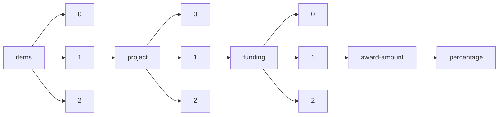

!!! warning "This document is not official Crossref documentation"
# Percentage
PATH = items/array/project/array/funding/array/award-amount/percentage(1)  
Occurs 41 037 times  
Unique values: 23  
{ .annotate }

1. A route to an element, for example:  
   The route "items/array/project/array/funding/array/award-amount/percentage" corresponds to navigating through the JSON indices as  
   ["items"][0]["project"][0]["funding"][0]["award-amount"]["percentage"]  

| **Row** | **Value** `U{Nothing, Int64}` | **Count** `Int64` |
|--------:|---------------------------------:|---------------------:|
| **1**   | 100                              | 40 856               |
| **2**   | nothing                          | 94                   |
| **3**   | 50                               | 58                   |
| **4**   | 49                               | 3                    |
| **5**   | 99                               | 3                    |
| **6**   | 76                               | 3                    |
| **7**   | 1                                | 2                    |
| **8**   | 51                               | 2                    |
| **9**   | 33                               | 2                    |
| **10**  | 58                               | 1                    |
| **11**  | 24                               | 1                    |
| **12**  | 19                               | 1                    |
| **13**  | 92                               | 1                    |
| **14**  | 67                               | 1                    |
| **15**  | 45                               | 1                    |
| **16**  | 44                               | 1                    |
| **17**  | 9                                | 1                    |
| **18**  | 80                               | 1                    |
| **19**  | 39                               | 1                    |
| **20**  | 95                               | 1                    |
| **21**  | 2                                | 1                    |
| **22**  | 97                               | 1                    |
| **23**  | 62                               | 1                    |

