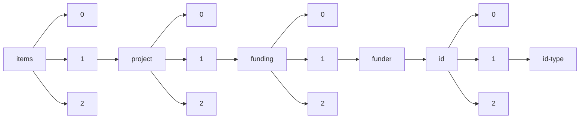

!!! warning "This document is not official Crossref documentation"
# Id-type
PATH = items/array/project/array/funding/array/funder/id/array/id-type(1)  
Occurs 76 637 times  
Unique values: 1  
{ .annotate }

1. A route to an element, for example:  
   The route "items/array/project/array/funding/array/funder/id/array/id-type" corresponds to navigating through the JSON indices as  
   ["items"][0]["project"][0]["funding"][0]["funder"]["id"][0]["id-type"]  

| **Row** | **Value** `String` | **Count** `Int64` |
|--------:|----------------------:|---------------------:|
| **1**   | DOI                   | 76 637               |

