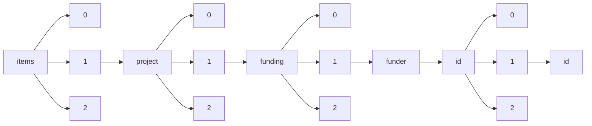

!!! warning "This document is not official Crossref documentation"
# Id
PATH = items/array/project/array/funding/array/funder/id/array/id(1)  
Occurs 76 637 times  
Unique values: 74  
{ .annotate }

1. A route to an element, for example:  
   The route "items/array/project/array/funding/array/funder/id/array/id" corresponds to navigating through the JSON indices as  
   ["items"][0]["project"][0]["funding"][0]["funder"]["id"][0]["id"]  

| **Row** | **Value** `String` | **Count** `Int64` |
|--------:|----------------------:|---------------------:|
| **1**   | 10.13039/100010269    | 17 534               |
| **2**   | 10.13039/100010665    | 9 965                |
| **3**   | 10.13039/501100002241 | 9 924                |
| **4**   | 10.13039/100000015    | 8 781                |
| **5**   | 10.13039/100010663    | 6 668                |
| **6**   | 10.13039/100010675    | 2 862                |
| **7**   | 10.13039/100010669    | 1 719                |
| **8**   | 10.13039/100019180    | 1 547                |
| **9**   | 10.13039/100018694    | 1 530                |
| **10**  | 10.13039/100010680    | 1 513                |
| **11**  | 10.13039/100010679    | 1 288                |
| **12**  | 10.13039/100010677    | 1 127                |
| **13**  | 10.13039/100010678    | 825                  |
| **14**  | 10.13039/100010681    | 691                  |
| **15**  | 10.13039/100001545    | 663                  |
| **16**  | 10.13039/100000913    | 586                  |
| **17**  | 10.13039/100005536    | 560                  |
| **18**  | 10.13039/100018699    | 550                  |
| **19**  | 10.13039/100000971    | 496                  |
| **20**  | 10.13039/100010664    | 489                  |
| **21**  | 10.13039/100018703    | 471                  |
| **22**  | 10.13039/100018700    | 431                  |
| **23**  | 10.13039/100005190    | 425                  |
| **24**  | 10.13039/100010682    | 402                  |
| **25**  | 10.13039/100010673    | 397                  |
| **26**  | 10.13039/100010683    | 380                  |
| **27**  | 10.13039/100010670    | 377                  |
| **28**  | 10.13039/501100001821 | 362                  |
| **29**  | 10.13039/100010684    | 353                  |
| **30**  | 10.13039/100010666    | 311                  |
| **31**  | 10.13039/100018701    | 307                  |
| **32**  | 10.13039/501100011730 | 297                  |
| **33**  | 10.13039/100000048    | 296                  |
| **34**  | 10.13039/100010672    | 246                  |
| **35**  | 10.13039/100010685    | 193                  |
| **36**  | 10.13039/100018696    | 186                  |
| **37**  | 10.13039/100010688    | 185                  |
| **38**  | 10.13039/100005202    | 178                  |
| **39**  | 10.13039/100018707    | 155                  |
| **40**  | 10.13039/100018697    | 139                  |
| **41**  | 10.13039/100010671    | 130                  |
| **42**  | 10.13039/100000936    | 130                  |
| **43**  | 10.13039/100010689    | 122                  |
| **44**  | 10.13039/100013301    | 107                  |
| **45**  | 10.13039/100018704    | 94                   |
| **46**  | 10.13039/100014804    | 90                   |
| **47**  | 10.13039/100010581    | 76                   |
| **48**  | 10.13039/100018695    | 74                   |
| **49**  | 10.13039/100010687    | 67                   |
| **50**  | 10.13039/100018698    | 54                   |
| **51**  | 10.13039/100018717    | 52                   |
| **52**  | 10.13039/501100000223 | 39                   |
| **53**  | 10.13039/100008984    | 34                   |
| **54**  | 10.13039/100018716    | 32                   |
| **55**  | 10.13039/100017086    | 19                   |
| **56**  | 10.13039/100018706    | 17                   |
| **57**  | 10.13039/100000893    | 16                   |
| **58**  | 10.13039/100006309    | 13                   |
| **59**  | 10.13039/100010674    | 12                   |
| **60**  | 10.13039/100018714    | 10                   |
| **61**  | 10.13039/100004440    | 10                   |
| **62**  | 10.13039/100018708    | 9                    |
| **63**  | 10.13039/100000980    | 4                    |
| **64**  | 10.13039/100001771    | 3                    |
| **65**  | 10.13039/100008539    | 2                    |
| **66**  | 10.13039/100010668    | 2                    |
| **67**  | 10.13039/100010676    | 2                    |
| **68**  | 10.13039/100000968    | 2                    |
| **69**  | 10.13039/100018710    | 1                    |
| **70**  | 10.13039/100018720    | 1                    |
| **71**  | 10.13039/100010586    | 1                    |
| **72**  | 10.13039/100018712    | 1                    |
| **73**  | 10.13039/100018711    | 1                    |
| **74**  | 10.13039/100018709    | 1                    |

