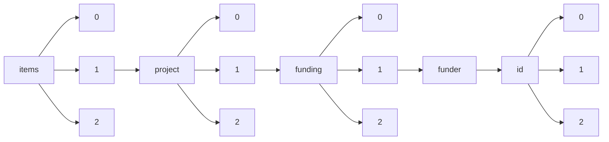

!!! warning "This document is not official Crossref documentation"
# Elements
PATH = items/array/project/array/funding/array/funder/id/array(1)  
Occurs 76 637 times  
{ .annotate }

1. A route to an element, for example:  
   The route "items/array/project/array/funding/array/funder/id/array" corresponds to navigating through the JSON indices as  
   ["items"][0]["project"][0]["funding"][0]["funder"]["id"][0]  

## Asserted-by
See more information: [items/array/project/array/funding/array/funder/id/array/asserted-by](asserted-by/index.md)  
Occurs 76 637 timess  
Unique values: 1  

| **Row** | **Value** `String` | **Count** `Int64` |
|--------:|----------------------:|---------------------:|
| **1**   | publisher             | 76 637               |

## Id
See more information: [items/array/project/array/funding/array/funder/id/array/id](id/index.md)  
Occurs 76 637 timess  
Unique values: 74  

| **Row** | **Value** `String` | **Count** `Int64` |
|--------:|----------------------:|---------------------:|
| **1**   | 10.13039/100010269    | 17 534               |
| **2**   | 10.13039/100010665    | 9 965                |
| **3**   | 10.13039/501100002241 | 9 924                |
| **4**   | 10.13039/100000015    | 8 781                |
| **5**   | 10.13039/100010663    | 6 668                |
| **6**   | 10.13039/100010675    | 2 862                |
| **7**   | 10.13039/100010669    | 1 719                |
| **8**   | 10.13039/100019180    | 1 547                |
| **9**   | 10.13039/100018694    | 1 530                |
| **10**  | 10.13039/100010680    | 1 513                |
| ... | ... | ... |

## Id-type
See more information: [items/array/project/array/funding/array/funder/id/array/id-type](id-type/index.md)  
Occurs 76 637 timess  
Unique values: 1  

| **Row** | **Value** `String` | **Count** `Int64` |
|--------:|----------------------:|---------------------:|
| **1**   | DOI                   | 76 637               |

