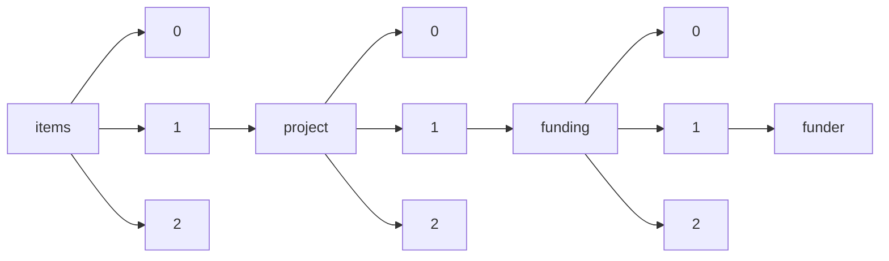

!!! warning "This document is not official Crossref documentation"
# Funder
PATH = items/array/project/array/funding/array/funder(1)  
Occurs 76 637 times  
{ .annotate }

1. A route to an element, for example:  
   The route "items/array/project/array/funding/array/funder" corresponds to navigating through the JSON indices as  
   ["items"][0]["project"][0]["funding"][0]["funder"]  

## Id
See more information: [items/array/project/array/funding/array/funder/id](id/index.md)  
Occurs 76 637 timess  

| **Row** | **Length** `Any` | **Count** `Int64` |
|--------:|--------------------:|---------------------:|
| **1**   | 1                   | 76 637               |

## Name
See more information: [items/array/project/array/funding/array/funder/name](name/index.md)  
Occurs 76 637 timess  
Unique values: 71  

| **Row** | **Value** `String`                                 | **Count** `Int64` |
|--------:|------------------------------------------------------:|---------------------:|
| **1**   | Wellcome Trust                                        | 17 542               |
| **2**   | H2020 Marie Sk?odowska-Curie Actions                  | 9 965                |
| **3**   | Japan Science and Technology Agency                   | 9 923                |
| **4**   | US Department of Energy                               | 8 761                |
| **5**   | H2020 European Research Council                       | 6 668                |
| **6**   | H2020 Innovation In SMEs                              | 2 862                |
| **7**   | H2020 LEIT Information and Communication Technologies | 1 719                |
| **8**   | HORIZON EUROPE European Research Council              | 1 546                |
| **9**   | HORIZON EUROPE Marie Sklodowska-Curie Actions         | 1 530                |
| **10**  | H2020 Transport                                       | 1 513                |
| ... | ... | ... |

