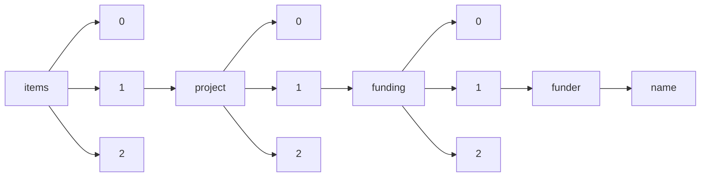

!!! warning "This document is not official Crossref documentation"
# Name
PATH = items/array/project/array/funding/array/funder/name(1)  
Occurs 76 637 times  
Unique values: 71  
{ .annotate }

1. A route to an element, for example:  
   The route "items/array/project/array/funding/array/funder/name" corresponds to navigating through the JSON indices as  
   ["items"][0]["project"][0]["funding"][0]["funder"]["name"]  

| **Row** | **Value** `String`                                                              | **Count** `Int64` |
|--------:|-----------------------------------------------------------------------------------:|---------------------:|
| **1**   | Wellcome Trust                                                                     | 17 542               |
| **2**   | H2020 Marie Sk?odowska-Curie Actions                                               | 9 965                |
| **3**   | Japan Science and Technology Agency                                                | 9 923                |
| **4**   | US Department of Energy                                                            | 8 761                |
| **5**   | H2020 European Research Council                                                    | 6 668                |
| **6**   | H2020 Innovation In SMEs                                                           | 2 862                |
| **7**   | H2020 LEIT Information and Communication Technologies                              | 1 719                |
| **8**   | HORIZON EUROPE European Research Council                                           | 1 546                |
| **9**   | HORIZON EUROPE Marie Sklodowska-Curie Actions                                      | 1 530                |
| **10**  | H2020 Transport                                                                    | 1 513                |
| **11**  | H2020 Energy                                                                       | 1 288                |
| **12**  | H2020 Health                                                                       | 1 127                |
| **13**  | H2020 Food                                                                         | 825                  |
| **14**  | H2020 Environment                                                                  | 691                  |
| **15**  | Children's Tumor Foundation                                                        | 663                  |
| **16**  | James S. McDonnell Foundation                                                      | 586                  |
| **17**  | Asia-Pacific Network for Global Change Research                                    | 560                  |
| **18**  | HORIZON EUROPE Digital, Industry and Space                                         | 550                  |
| **19**  | The ALS Association                                                                | 496                  |
| **20**  | H2020 Future and Emerging Technologies                                             | 489                  |
| **21**  | HORIZON EUROPE European Innovation Council                                         | 471                  |
| **22**  | HORIZON EUROPE Climate, Energy and Mobility                                        | 431                  |
| **23**  | Melanoma Research Alliance                                                         | 425                  |
| **24**  | H2020 Society                                                                      | 402                  |
| **25**  | H2020 LEIT Space                                                                   | 397                  |
| **26**  | H2020 LEIT Nanotechnologies                                                        | 377                  |
| **27**  | WWTF                                                                               | 362                  |
| **28**  | H2020 Spreading Excellence and Widening Participation                              | 353                  |
| **29**  | H2020 Research Infrastructures                                                     | 311                  |
| **30**  | HORIZON EUROPE Food, Bioeconomy, Natural Resources, Agriculture and Environment    | 307                  |
| **31**  | Templeton World Charity Foundation                                                 | 297                  |
| **32**  | American Cancer Society                                                            | 295                  |
| **33**  | H2020 Security                                                                     | 251                  |
| **34**  | H2020 LEIT Advanced Manufacturing and Processing                                   | 246                  |
| **35**  | HORIZON EUROPE Widening participation and spreading excellence                     | 231                  |
| **36**  | H2020 Science with and for Society                                                 | 193                  |
| **37**  | HORIZON EUROPE Health                                                              | 186                  |
| **38**  | H2020 Fast Track to Innovation                                                     | 185                  |
| **39**  | Muscular Dystrophy Association                                                     | 178                  |
| **40**  | HORIZON EUROPE Culture, Creativity and Inclusive society                           | 139                  |
| **41**  | H2020 LEIT Advanced Materials                                                      | 130                  |
| **42**  | Security                                                                           | 129                  |
| **43**  | Gordon and Betty Moore Foundation                                                  | 129                  |
| **44**  | H2020 LEIT Biotechnology                                                           | 122                  |
| **45**  | Parkinson's Foundation                                                             | 107                  |
| **46**  | HORIZON EUROPE European Innovation Ecosystems                                      | 94                   |
| **47**  | JHU-NTAP – Neurofibromatosis Therapeutic Acceleration Program                      | 90                   |
| **48**  | Australian Research Data Commons                                                   | 77                   |
| **49**  | HORIZON EUROPE Research Infrastructures                                            | 74                   |
| **50**  | Euratom                                                                            | 67                   |
| **51**  | HORIZON EUROPE Civil security for society                                          | 54                   |
| **52**  | HORIZON EUROPE Reforming and enhancing the European Research and Innovation system | 49                   |
| **53**  | Muscular Dystrophy Canada                                                          | 39                   |
| **54**  | International Anesthesia Research Society                                          | 34                   |
| **55**  | Environmental Molecular Science Laboratory, EMSL                                   | 20                   |
| **56**  | LYRASIS                                                                            | 18                   |
| **57**  | Simons Foundation                                                                  | 16                   |
| **58**  | American Parkinson Disease Association                                             | 13                   |
| **59**  | H2020 Access to risk finance                                                       | 12                   |
| **60**  | Arthritis Foundation                                                               | 4                    |
| **61**  | Tuberous Sclerosis Alliance                                                        | 3                    |
| **62**  | JST                                                                                | 2                    |
| **63**  | H2020 Societal Challenges                                                          | 2                    |
| **64**  | CurePSP                                                                            | 2                    |
| **65**  | H2020 Leadership in Enabling and Industrial Technologies                           | 2                    |
| **66**  | American Heart Association                                                         | 2                    |
| **67**  | Moore Foundation                                                                   | 1                    |
| **68**  | mEDRA Ediser Simple test                                                           | 1                    |
| **69**  | Wellcome                                                                           | 1                    |
| **70**  | Lyrasis                                                                            | 1                    |
| **71**  | Crossref                                                                           | 1                    |

