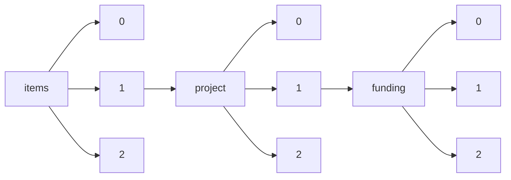

!!! warning "This document is not official Crossref documentation"
# Elements
PATH = items/array/project/array/funding/array(1)  
Occurs 76 637 times  
{ .annotate }

1. A route to an element, for example:  
   The route "items/array/project/array/funding/array" corresponds to navigating through the JSON indices as  
   ["items"][0]["project"][0]["funding"][0]  

## Award-amount
See more information: [items/array/project/array/funding/array/award-amount](award-amount/index.md)  
Occurs 41 037 timess  

## Funder
See more information: [items/array/project/array/funding/array/funder](funder/index.md)  
Occurs 76 637 timess  

## Scheme
See more information: [items/array/project/array/funding/array/scheme](scheme/index.md)  
Occurs 63 543 timess  
Unique values: > 999  

!!! note "Due to current limitations, only the first 1,000 unique values are counted."

| **Row** | **Value** `String`               | **Count** `Int64` |
|--------:|------------------------------------:|---------------------:|
| **1**   | EIC-SMEInst-2018-2020               | 2 283                |
| **2**   | Immune System in Health and Disease | 2 247                |
| **3**   | MSCA-IF-2020                        | 1 657                |
| **4**   | Neuroscience and Mental Health      | 1 618                |
| **5**   | Molecular Basis of Cell Function    | 1 378                |
| **6**   | MSCA-IF-2018                        | 1 375                |
| **7**   | MSCA-IF-2017                        | 1 367                |
| **8**   | Cellular and Molecular Neuroscience | 1 340                |
| **9**   | Population and Public Health        | 1 259                |
| **10**  | MSCA-IF-2016                        | 1 253                |
| ... | ... | ... |

## Type
See more information: [items/array/project/array/funding/array/type](type/index.md)  
Occurs 76 637 timess  
Unique values: 10  

| **Row** | **Value** `String` | **Count** `Int64` |
|--------:|----------------------:|---------------------:|
| **1**   | grant                 | 62 789               |
| **2**   | award                 | 11 660               |
| **3**   | training-grant        | 1 085                |
| **4**   | fellowship            | 868                  |
| **5**   | equipment             | 136                  |
| **6**   | contract              | 92                   |
| **7**   | prize                 | 4                    |
| **8**   | endowment             | 1                    |
| **9**   | salary-award          | 1                    |
| **10**  | other                 | 1                    |

