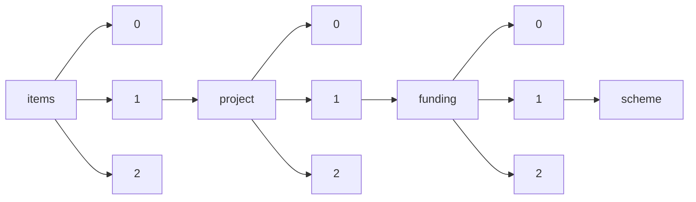

!!! warning "This document is not official Crossref documentation"
# Scheme
PATH = items/array/project/array/funding/array/scheme(1)  
Occurs 63 543 times  
Unique values: > 999  
{ .annotate }

1. A route to an element, for example:  
   The route "items/array/project/array/funding/array/scheme" corresponds to navigating through the JSON indices as  
   ["items"][0]["project"][0]["funding"][0]["scheme"]  

!!! note "Due to current limitations, only the first 1,000 unique values are counted."

| **Row** | **Value** `String`                                                                                                                                                                      | **Count** `Int64` |
|--------:|-------------------------------------------------------------------------------------------------------------------------------------------------------------------------------------------:|---------------------:|
| **1**   | EIC-SMEInst-2018-2020                                                                                                                                                                      | 2 283                |
| **2**   | Immune System in Health and Disease                                                                                                                                                        | 2 247                |
| **3**   | MSCA-IF-2020                                                                                                                                                                               | 1 657                |
| **4**   | Neuroscience and Mental Health                                                                                                                                                             | 1 618                |
| **5**   | Molecular Basis of Cell Function                                                                                                                                                           | 1 378                |
| **6**   | MSCA-IF-2018                                                                                                                                                                               | 1 375                |
| **7**   | MSCA-IF-2017                                                                                                                                                                               | 1 367                |
| **8**   | Cellular and Molecular Neuroscience                                                                                                                                                        | 1 340                |
| **9**   | Population and Public Health                                                                                                                                                               | 1 259                |
| **10**  | MSCA-IF-2016                                                                                                                                                                               | 1 253                |
| **11**  | MSCA-IF-2014-EF                                                                                                                                                                            | 1 217                |
| **12**  | HORIZON-MSCA-2021-PF-01-01                                                                                                                                                                 | 1 210                |
| **13**  | Medical Humanities                                                                                                                                                                         | 1 076                |
| **14**  | MSCA-IF-2015-EF                                                                                                                                                                            | 1 074                |
| **15**  | Cell and Developmental Biology                                                                                                                                                             | 1 056                |
| **16**  | Physiology in Health and Disease                                                                                                                                                           | 1 053                |
| **17**  | Cross-Remit                                                                                                                                                                                | 1 016                |
| **18**  | Innovations                                                                                                                                                                                | 641                  |
| **19**  | Genetics, Genomics and Population Research                                                                                                                                                 | 637                  |
| **20**  | 産学が連携した研究開発成果の展開/研究成果展開事業/マッチングプランナープログラム                                                                                                           | 617                  |
| **21**  | Social Science and Bioethics                                                                                                                                                               | 534                  |
| **22**  | Pathogen Biology and Disease Transmission                                                                                                                                                  | 529                  |
| **23**  | ERC-2021-STG                                                                                                                                                                               | 469                  |
| **24**  | ERC-2017-STG                                                                                                                                                                               | 407                  |
| **25**  | ERC-2018-STG                                                                                                                                                                               | 405                  |
| **26**  | ERC-2016-STG                                                                                                                                                                               | 391                  |
| **27**  | ERC-StG-2014                                                                                                                                                                               | 375                  |
| **28**  | ERC-CoG-2014                                                                                                                                                                               | 371                  |
| **29**  | Cognitive Neuroscience and Mental Health                                                                                                                                                   | 363                  |
| **30**  | 産学が連携した研究開発成果の展開/研究成果展開事業/研究成果最適展開支援プログラム(A-STEP)/機能検証フェーズ/試験研究タイプ                                                                   | 355                  |
| **31**  | ERC-StG-2015                                                                                                                                                                               | 349                  |
| **32**  | ERC-2017-COG                                                                                                                                                                               | 328                  |
| **33**  | SMEInst-01-2016-2017                                                                                                                                                                       | 327                  |
| **34**  | ERC-2019-STG                                                                                                                                                                               | 323                  |
| **35**  | ERC-2021-COG                                                                                                                                                                               | 318                  |
| **36**  | ERC-2016-COG                                                                                                                                                                               | 314                  |
| **37**  | ERC-CoG-2015                                                                                                                                                                               | 303                  |
| **38**  | 産学が連携した研究開発成果の展開/研究成果展開事業/研究成果最適展開支援プログラム(A-STEP)/トライアウト/トライアウトタイプ(標準)                                                             | 300                  |
| **39**  | ERC-2020-COG                                                                                                                                                                               | 297                  |
| **40**  | ERC-2018-COG                                                                                                                                                                               | 292                  |
| **41**  | Collaborative Regional Research Programme                                                                                                                                                  | 282                  |
| **42**  | ERC-ADG-2015                                                                                                                                                                               | 277                  |
| **43**  | SMEInst-10-2016-2017                                                                                                                                                                       | 269                  |
| **44**  | ERC-2017-ADG                                                                                                                                                                               | 268                  |
| **45**  | 産学が連携した研究開発成果の展開/研究成果展開事業/研究成果最適展開支援プログラム(A-STEP)/トライアウト                                                                                      | 259                  |
| **46**  | ERC-2021-ADG                                                                                                                                                                               | 251                  |
| **47**  | SMEInst-09-2016-2017                                                                                                                                                                       | 238                  |
| **48**  | ERC-2022-STG                                                                                                                                                                               | 238                  |
| **49**  | ERC-2016-ADG                                                                                                                                                                               | 231                  |
| **50**  | 産学が連携した研究開発成果の展開/研究成果展開事業/平成20年度までに募集を終了した事業/委託開発                                                                                              | 231                  |
| **51**  | ERC-2018-ADG                                                                                                                                                                               | 219                  |
| **52**  | ERC-2020-ADG                                                                                                                                                                               | 209                  |
| **53**  | Scientific Capacity Development (CAPaBLE)                                                                                                                                                  | 208                  |
| **54**  | ERC-ADG-2014                                                                                                                                                                               | 192                  |
| **55**  | 産学が連携した研究開発成果の展開/研究成果展開事業/地域産学バリュープログラム                                                                                                               | 185                  |
| **56**  | Molecules, Genes and Cells                                                                                                                                                                 | 172                  |
| **57**  | ERC-2017-PoC                                                                                                                                                                               | 160                  |
| **58**  | ERC-PoC-2015                                                                                                                                                                               | 160                  |
| **59**  | ERC-2018-PoC                                                                                                                                                                               | 160                  |
| **60**  | ERC-PoC-2016                                                                                                                                                                               | 159                  |
| **61**  | MSCA-ITN-2018                                                                                                                                                                              | 157                  |
| **62**  | SMEInst-02-2016-2017                                                                                                                                                                       | 156                  |
| **63**  | SMEInst-07-2016-2017                                                                                                                                                                       | 154                  |
| **64**  | SMEInst-11-2016-2017                                                                                                                                                                       | 152                  |
| **65**  | HORIZON-MSCA-2021-DN-01-01                                                                                                                                                                 | 152                  |
| **66**  | MSCA-ITN-2017                                                                                                                                                                              | 149                  |
| **67**  | Infection and Immuno-Biology                                                                                                                                                               | 148                  |
| **68**  | MSCA-IF-2014-GF                                                                                                                                                                            | 144                  |
| **69**  | 戦略的な研究開発の推進/戦略的創造研究推進事業/ERATO                                                                                                                                        | 143                  |
| **70**  | ERC-2022-POC1                                                                                                                                                                              | 142                  |
| **71**  | MSCA-IF-2015-GF                                                                                                                                                                            | 135                  |
| **72**  | FETOPEN-01-2018-2019-2020                                                                                                                                                                  | 134                  |
| **73**  | MSCA-ITN-2016                                                                                                                                                                              | 133                  |
| **74**  | MSCA-ITN-2019                                                                                                                                                                              | 132                  |
| **75**  | 戦略的な研究開発の推進/戦略的創造研究推進事業/ACT-I 情報と未来                                                                                                                             | 124                  |
| **76**  | ICT-37-2014-1                                                                                                                                                                              | 124                  |
| **77**  | 産学が連携した研究開発成果の展開/研究成果展開事業/研究成果最適展開支援プログラム(A-STEP)/産学共同(育成型)                                                                                  | 124                  |
| **78**  | 産学が連携した研究開発成果の展開/研究成果展開事業/先端計測分析技術・機器開発プログラム/一般領域/要素技術タイプ                                                                             | 124                  |
| **79**  | ERC-PoC-2014                                                                                                                                                                               | 121                  |
| **80**  | ERC-2019-POC                                                                                                                                                                               | 109                  |
| **81**  | Physiological Sciences                                                                                                                                                                     | 109                  |
| **82**  | SMEInst-05-2016-2017                                                                                                                                                                       | 107                  |
| **83**  | MSCA-ITN-2014-ETN                                                                                                                                                                          | 107                  |
| **84**  | HORIZON-WIDERA-2021-ACCESS-03-01                                                                                                                                                           | 106                  |
| **85**  | Postdoctoral Fellowship Award                                                                                                                                                              | 104                  |
| **86**  | Public Engagement                                                                                                                                                                          | 102                  |
| **87**  | MSCA-ITN-2015-ETN                                                                                                                                                                          | 100                  |
| **88**  | Vaccines                                                                                                                                                                                   | 100                  |
| **89**  | Symbiosis in Aquatic Systems                                                                                                                                                               | 93                   |
| **90**  | SIE-01-2014-1                                                                                                                                                                              | 93                   |
| **91**  | MSCA-RISE-2015                                                                                                                                                                             | 92                   |
| **92**  | 産学が連携した研究開発成果の展開/研究成果展開事業/先端計測分析技術・機器開発プログラム/一般領域/機器開発タイプ                                                                             | 91                   |
| **93**  | Understanding Human Cognition-Scholar Awards                                                                                                                                               | 91                   |
| **94**  | MSCA-RISE-2014                                                                                                                                                                             | 89                   |
| **95**  | PHC-12-2015-1                                                                                                                                                                              | 87                   |
| **96**  | MSCA-RISE-2016                                                                                                                                                                             | 87                   |
| **97**  | H2020EENSGA3                                                                                                                                                                               | 86                   |
| **98**  | MSCA-RISE-2017                                                                                                                                                                             | 86                   |
| **99**  | ICT-37-2015-1                                                                                                                                                                              | 86                   |
| **100** | 戦略的な研究開発の推進/戦略的創造研究推進事業/ACT-X 数理・情報のフロンティア                                                                                                               | 86                   |
| **101** | EIC-FTI-2018-2020                                                                                                                                                                          | 85                   |
| **102** | Our Planet, Our Health                                                                                                                                                                     | 83                   |
| **103** | ERC-2022-POC2                                                                                                                                                                              | 83                   |
| **104** | INNOSUP-02-2016                                                                                                                                                                            | 81                   |
| **105** | H2020-SGA2-EEN                                                                                                                                                                             | 80                   |
| **106** | MSCA-RISE-2018                                                                                                                                                                             | 80                   |
| **107** | SIE-01-2015-1                                                                                                                                                                              | 79                   |
| **108** | IT-1-2015-1                                                                                                                                                                                | 78                   |
| **109** | HORIZON-MSCA-2021-SE-01-01                                                                                                                                                                 | 77                   |
| **110** | PHC-12-2014-1                                                                                                                                                                              | 77                   |
| **111** | FETOPEN-01-2016-2017                                                                                                                                                                       | 76                   |
| **112** | INNOVATION                                                                                                                                                                                 | 76                   |
| **113** | HORIZON-EIC-2021-ACCELERATOROPEN-01                                                                                                                                                        | 75                   |
| **114** | INNOSUP                                                                                                                                                                                    | 75                   |
| **115** | HORIZON-EIC-2022-ACCELERATOROPEN-01                                                                                                                                                        | 75                   |
| **116** | None                                                                                                                                                                                       | 73                   |
| **117** | SMEInst-06-2016-2017                                                                                                                                                                       | 72                   |
| **118** | Diverse Intelligences                                                                                                                                                                      | 71                   |
| **119** | SMEInst-13-2016-2017                                                                                                                                                                       | 71                   |
| **120** | Researching Brain Cancer-Research Awards                                                                                                                                                   | 70                   |
| **121** | Studying Complex Systems-Research Awards                                                                                                                                                   | 69                   |
| **122** | IT-1-2014-1                                                                                                                                                                                | 68                   |
| **123** | MSCA-RISE-2019                                                                                                                                                                             | 67                   |
| **124** | H2020-TWINN-2015                                                                                                                                                                           | 65                   |
| **125** | ERC-2020-POC                                                                                                                                                                               | 64                   |
| **126** | SMEInst-12-2016-2017                                                                                                                                                                       | 63                   |
| **127** | NMP-25-2014-1                                                                                                                                                                              | 62                   |
| **128** | 戦略的な研究開発の推進/未来社会創造事業/探索加速型 地球規模課題である低炭素社会の実現「「ゲームチェンジングテクノロジー」による低炭素社会の実現」                                          | 61                   |
| **129** | SFS-08-2015-1                                                                                                                                                                              | 61                   |
| **130** | FETOPEN-03-2018-2019-2020                                                                                                                                                                  | 61                   |
| **131** | HORIZON-EIC-2021-PATHFINDEROPEN-01-01                                                                                                                                                      | 60                   |
| **132** | SC5-20-2014-1                                                                                                                                                                              | 60                   |
| **133** | 戦略的な研究開発の推進/戦略的創造研究推進事業/ACT-X 生命と化学                                                                                                                             | 60                   |
| **134** | 産学が連携した研究開発成果の展開/研究成果展開事業/研究成果最適展開支援プログラム(A-STEP)/産学共同フェーズ/シーズ育成タイプ                                                                 | 57                   |
| **135** | ERC-2020-STG                                                                                                                                                                               | 56                   |
| **136** | 戦略的な研究開発の推進/戦略的創造研究推進事業/ACT-C 低エネルギー、低環境負荷で持続可能なものづくりのための先導的な物質変換技術の創出                                                       | 56                   |
| **137** | 産学が連携した研究開発成果の展開/研究成果展開事業/大学発新産業創出プログラム(START)/プロジェクト支援型                                                                                     | 55                   |
| **138** | 戦略的な研究開発の推進/戦略的創造研究推進事業/RISTEX(社会技術研究開発) 研究開発成果実装支援プログラム(公募型)                                                                              | 55                   |
| **139** | 産学が連携した研究開発成果の展開/研究成果展開事業/研究成果最適展開支援プログラム(A-STEP)/産学共同(本格型)                                                                                  | 54                   |
| **140** | MSCA-NIGHT-2018                                                                                                                                                                            | 54                   |
| **141** | Molecular Medicine in Cancer Research                                                                                                                                                      | 53                   |
| **142** | NMP-25-2015-1                                                                                                                                                                              | 51                   |
| **143** | HORIZON-WIDERA-2022-TALENTS-02-01                                                                                                                                                          | 51                   |
| **144** | 産学が連携した研究開発成果の展開/研究成果展開事業/大学発新産業創出プログラム(START)/社会還元加速プログラム(SCORE)                                                                          | 50                   |
| **145** | SMEInst-04-2016-2017                                                                                                                                                                       | 50                   |
| **146** | HORIZON-EIE-2021-SCALEUP-01-03                                                                                                                                                             | 50                   |
| **147** | SMEInst-08-2016-2017                                                                                                                                                                       | 49                   |
| **148** | HORIZON-MSCA-2022-CITIZENS-01-01                                                                                                                                                           | 49                   |
| **149** | 戦略的な研究開発の推進/戦略的創造研究推進事業/RISTEX(社会技術研究開発) 科学技術イノベーション政策のための科学                                                                              | 49                   |
| **150** | WF-03-2020                                                                                                                                                                                 | 48                   |
| **151** | FTIPilot-01-2016                                                                                                                                                                           | 48                   |
| **152** | MSCA-NIGHT-2014                                                                                                                                                                            | 47                   |
| **153** | ERC-2019-COG                                                                                                                                                                               | 47                   |
| **154** | SC5-20-2015-1                                                                                                                                                                              | 47                   |
| **155** | 戦略的な研究開発の推進/戦略的創造研究推進事業/ACT-X AI活用で挑む学問の革新と創成                                                                                                           | 47                   |
| **156** | HORIZON-EIC-2021-ACCELERATORCHALLENGES-01-02                                                                                                                                               | 46                   |
| **157** | FETOPEN-RIA-2014-2015                                                                                                                                                                      | 46                   |
| **158** | FTIPilot-1-2015                                                                                                                                                                            | 46                   |
| **159** | 戦略的な研究開発の推進/戦略的創造研究推進事業/ACT-X 環境とバイオテクノロジー                                                                                                               | 45                   |
| **160** | MSCA-NIGHT-2020bis                                                                                                                                                                         | 44                   |
| **161** | Global Innovations for Character Development                                                                                                                                               | 44                   |
| **162** | 戦略的な研究開発の推進/戦略的創造研究推進事業/さきがけ 情報と知                                                                                                                            | 44                   |
| **163** | 国際的な科学技術共同研究などの推進/SATREPS 生物資源                                                                                                                                        | 44                   |
| **164** | 戦略的な研究開発の推進/戦略的創造研究推進事業/さきがけ 分子技術と新機能創出                                                                                                                | 43                   |
| **165** | 戦略的な研究開発の推進/戦略的創造研究推進事業/さきがけ 脳神経回路の形成・動作と制御                                                                                                        | 43                   |
| **166** | HORIZON-EIC-2022-PATHFINDEROPEN-01-01                                                                                                                                                      | 43                   |
| **167** | 産学が連携した研究開発成果の展開/研究成果展開事業/研究成果最適展開支援プログラム(A-STEP)/機能検証フェーズ/実証研究タイプ                                                                   | 43                   |
| **168** | MSCA-COFUND-2020                                                                                                                                                                           | 43                   |
| **169** | MSCA-NIGHT-2016                                                                                                                                                                            | 42                   |
| **170** | 産学が連携した研究開発成果の展開/研究成果展開事業/研究成果最適展開支援プログラム(A-STEP)/実用化挑戦タイプ/中小・ベンチャー開発                                                             | 41                   |
| **171** | 戦略的な研究開発の推進/戦略的創造研究推進事業/さきがけ 生体における動的恒常性維持・変容機構の解明と制御                                                                                    | 41                   |
| **172** | 戦略的な研究開発の推進/戦略的創造研究推進事業/さきがけ 理論・実験・計算科学とデータ科学が連携・融合した先進的マテリアルズインフォマティクスのための基盤技術の構築                          | 41                   |
| **173** | 戦略的な研究開発の推進/戦略的創造研究推進事業/さきがけ エピジェネティクスの制御と生命機能                                                                                                  | 40                   |
| **174** | 戦略的な研究開発の推進/戦略的創造研究推進事業/さきがけ 構造機能と計測分析                                                                                                                  | 40                   |
| **175** | 戦略的な研究開発の推進/戦略的創造研究推進事業/さきがけ 光の利用と物質材料・生命機能                                                                                                        | 40                   |
| **176** | 戦略的な研究開発の推進/戦略的創造研究推進事業/さきがけ ナノシステムと機能創発                                                                                                              | 40                   |
| **177** | 産学が連携した研究開発成果の展開/研究成果展開事業/先端計測分析技術・機器開発プログラム/一般領域/実証・実用化タイプ                                                                         | 39                   |
| **178** | 戦略的な研究開発の推進/戦略的創造研究推進事業/さきがけ 光エネルギーと物質変換                                                                                                              | 39                   |
| **179** | 戦略的な研究開発の推進/戦略的創造研究推進事業/さきがけ 統合1細胞解析のための革新的技術基盤                                                                                                 | 39                   |
| **180** | 戦略的な研究開発の推進/戦略的創造研究推進事業/さきがけ タイムシグナルと制御                                                                                                                | 39                   |
| **181** | 戦略的な研究開発の推進/戦略的創造研究推進事業/さきがけ 細胞機能の構成的な理解と制御                                                                                                        | 39                   |
| **182** | 戦略的な研究開発の推進/戦略的創造研究推進事業/さきがけ 素過程と連携                                                                                                                        | 38                   |
| **183** | 戦略的な研究開発の推進/戦略的創造研究推進事業/さきがけ 生命システムの動作原理と基盤技術                                                                                                    | 38                   |
| **184** | 戦略的な研究開発の推進/戦略的創造研究推進事業/さきがけ 形とはたらき                                                                                                                        | 38                   |
| **185** | 戦略的な研究開発の推進/戦略的創造研究推進事業/さきがけ 状態と変革                                                                                                                          | 38                   |
| **186** | SMEInst-03-2016-2017                                                                                                                                                                       | 38                   |
| **187** | 戦略的な研究開発の推進/戦略的創造研究推進事業/さきがけ 炎症の慢性化機構の解明と制御                                                                                                        | 37                   |
| **188** | 戦略的な研究開発の推進/戦略的創造研究推進事業/さきがけ 構造制御と機能                                                                                                                      | 37                   |
| **189** | Research Resources                                                                                                                                                                         | 37                   |
| **190** | 戦略的な研究開発の推進/戦略的創造研究推進事業/さきがけ 超空間制御と革新的機能創成                                                                                                          | 37                   |
| **191** | 戦略的な研究開発の推進/戦略的創造研究推進事業/さきがけ 情報環境と人                                                                                                                        | 36                   |
| **192** | 戦略的な研究開発の推進/戦略的創造研究推進事業/さきがけ 太陽光と光電変換機能                                                                                                                | 36                   |
| **193** | 戦略的な研究開発の推進/戦略的創造研究推進事業/さきがけ 生命機能メカニズム解明のための光操作技術                                                                                            | 36                   |
| **194** | 戦略的な研究開発の推進/戦略的創造研究推進事業/さきがけ 光の極限制御・積極利用と新分野開拓                                                                                                  | 36                   |
| **195** | 産学が連携した研究開発成果の展開/研究成果展開事業/研究成果最適展開支援プログラム(A-STEP)/シーズ育成タイプ                                                                                  | 36                   |
| **196** | 戦略的な研究開発の推進/戦略的創造研究推進事業/さきがけ 脳情報の解読と制御                                                                                                                  | 36                   |
| **197** | WIDESPREAD-03-2018                                                                                                                                                                         | 36                   |
| **198** | 戦略的な研究開発の推進/戦略的創造研究推進事業/さきがけ 量子技術を適用した生命科学基盤の創出                                                                                                | 36                   |
| **199** | 国際的な科学技術共同研究などの推進/SATREPS 環境・エネルギー(地球規模の環境課題)                                                                                                            | 36                   |
| **200** | WF-01-2018                                                                                                                                                                                 | 35                   |
| **201** | 戦略的な研究開発の推進/戦略的創造研究推進事業/さきがけ 生命現象の革新モデルと展開                                                                                                          | 35                   |
| **202** | 戦略的な研究開発の推進/未来社会創造事業/探索加速型 共通基盤「革新的な知や製品を創出する共通基盤システム・装置の実現」                                                                      | 35                   |
| **203** | FETOPEN-04-2016-2017                                                                                                                                                                       | 35                   |
| **204** | 戦略的な研究開発の推進/戦略的創造研究推進事業/さきがけ 多細胞システムにおける細胞間相互作用とそのダイナミクス                                                                              | 35                   |
| **205** | 戦略的な研究開発の推進/戦略的創造研究推進事業/さきがけ 認識と形成                                                                                                                          | 35                   |
| **206** | 戦略的な研究開発の推進/戦略的創造研究推進事業/さきがけ 情報と細胞機能                                                                                                                      | 34                   |
| **207** | 戦略的な研究開発の推進/戦略的創造研究推進事業/さきがけ 素材・デバイス・システム融合による革新的ナノエレクトロニクスの創成                                                                  | 34                   |
| **208** | ERC-2022-COG                                                                                                                                                                               | 34                   |
| **209** | 戦略的な研究開発の推進/戦略的創造研究推進事業/さきがけ 生体における微粒子の機能と制御                                                                                                      | 33                   |
| **210** | 戦略的な研究開発の推進/戦略的創造研究推進事業/さきがけ 革新的次世代デバイスを目指す材料とプロセス                                                                                          | 33                   |
| **211** | 戦略的な研究開発の推進/戦略的創造研究推進事業/さきがけ 代謝と機能制御                                                                                                                      | 33                   |
| **212** | 戦略的な研究開発の推進/戦略的創造研究推進事業/さきがけ ライフサイエンスの革新を目指した構造生命科学と先端的基盤技術                                                                        | 33                   |
| **213** | 戦略的な研究開発の推進/戦略的創造研究推進事業/さきがけ 新物質科学と元素戦略                                                                                                                | 33                   |
| **214** | MSCA-COFUND-2016                                                                                                                                                                           | 33                   |
| **215** | Bridging Brain, Mind & Behavior-Research Awards                                                                                                                                            | 33                   |
| **216** | 戦略的な研究開発の推進/戦略的創造研究推進事業/さきがけ 生命現象と計測分析                                                                                                                  | 32                   |
| **217** | 戦略的な研究開発の推進/戦略的創造研究推進事業/さきがけ フィールドにおける植物の生命現象の制御に向けた次世代基盤技術の創出                                                                  | 32                   |
| **218** | 戦略的な研究開発の推進/戦略的創造研究推進事業/さきがけ 新しい社会システムデザインに向けた情報基盤技術の創出                                                                                | 32                   |
| **219** | Studying Complex Systems-Scholar Awards-CS                                                                                                                                                 | 32                   |
| **220** | 戦略的な研究開発の推進/戦略的創造研究推進事業/さきがけ 界面の構造と制御                                                                                                                    | 32                   |
| **221** | 戦略的な研究開発の推進/戦略的創造研究推進事業/さきがけ トポロジカル材料科学と革新的機能創出                                                                                                | 32                   |
| **222** | 戦略的な研究開発の推進/戦略的創造研究推進事業/さきがけ ゲノムスケールのDNA設計・合成による細胞制御技術の創出                                                                               | 32                   |
| **223** | SFS-08-2014-1                                                                                                                                                                              | 32                   |
| **224** | LCE-07-2016-2017                                                                                                                                                                           | 32                   |
| **225** | 戦略的な研究開発の推進/戦略的創造研究推進事業/さきがけ 革新的光科学技術を駆使した最先端科学の創出                                                                                          | 32                   |
| **226** | HORIZON-WIDERA-2022-TALENTS-01-01                                                                                                                                                          | 32                   |
| **227** | Cognitive Rehabilitation-                                                                                                                                                                  | 32                   |
| **228** | 戦略的な研究開発の推進/戦略的創造研究推進事業/さきがけ エネルギー高効率利用と相界面                                                                                                        | 32                   |
| **229** | 戦略的な研究開発の推進/戦略的創造研究推進事業/さきがけ 知と構成                                                                                                                            | 31                   |
| **230** | 戦略的な研究開発の推進/戦略的創造研究推進事業/さきがけ 場と反応                                                                                                                            | 31                   |
| **231** | Education                                                                                                                                                                                  | 31                   |
| **232** | 戦略的な研究開発の推進/戦略的創造研究推進事業/さきがけ 数学と情報科学で解き明かす多様な対象の数理構造と活用                                                                                | 31                   |
| **233** | 戦略的な研究開発の推進/創発的研究支援事業 北川パネル                                                                                                                                       | 31                   |
| **234** | 戦略的な研究開発の推進/戦略的創造研究推進事業/さきがけ 二酸化炭素資源化を目指した植物の物質生産力強化と生産物活用のための基盤技術の創出                                                    | 31                   |
| **235** | 戦略的な研究開発の推進/戦略的創造研究推進事業/さきがけ 遺伝と変化                                                                                                                          | 31                   |
| **236** | 戦略的な研究開発の推進/戦略的創造研究推進事業/さきがけ 数学と諸分野の協働によるブレークスルーの探索                                                                                        | 31                   |
| **237** | 戦略的な研究開発の推進/戦略的創造研究推進事業/さきがけ 計測技術と高度情報処理の融合によるインテリジェント計測・解析手法の開発と応用                                                        | 31                   |
| **238** | WIDESPREAD-1-2014                                                                                                                                                                          | 31                   |
| **239** | 戦略的な研究開発の推進/戦略的創造研究推進事業/さきがけ iPS細胞と生命機能                                                                                                                   | 30                   |
| **240** | WIDESPREAD-05-2017                                                                                                                                                                         | 30                   |
| **241** | 国際的な科学技術共同研究などの推進/SATREPS 防災                                                                                                                                            | 30                   |
| **242** | 戦略的な研究開発の推進/戦略的創造研究推進事業/さきがけ 電子やイオン等の能動的制御と反応                                                                                                    | 30                   |
| **243** | WIDESPREAD-04-2017                                                                                                                                                                         | 30                   |
| **244** | 戦略的な研究開発の推進/戦略的創造研究推進事業/さきがけ 原子・分子の自在配列と特性・機能                                                                                                    | 30                   |
| **245** | 戦略的な研究開発の推進/戦略的創造研究推進事業/さきがけ 革新的コンピューティング技術の開拓                                                                                                  | 30                   |
| **246** | 戦略的な研究開発の推進/戦略的創造研究推進事業/さきがけ 変換と制御                                                                                                                          | 30                   |
| **247** | 戦略的な研究開発の推進/戦略的創造研究推進事業/さきがけ 知の創生と情報社会                                                                                                                  | 30                   |
| **248** | MSCA-COFUND-2018                                                                                                                                                                           | 30                   |
| **249** | 戦略的な研究開発の推進/戦略的創造研究推進事業/さきがけ RNAと生体機能                                                                                                                       | 29                   |
| **250** | 戦略的な研究開発の推進/戦略的創造研究推進事業/さきがけ 秩序と物性                                                                                                                          | 29                   |
| **251** | HORIZON-EIC-2021-TRANSITIONOPEN-01                                                                                                                                                         | 29                   |
| **252** | 戦略的な研究開発の推進/戦略的創造研究推進事業/RISTEX(社会技術研究開発) 科学技術の倫理的・法制度的・社会的課題（ELSI）への包括的実践研究開発プログラム                                      | 29                   |
| **253** | 戦略的な研究開発の推進/戦略的創造研究推進事業/さきがけ 人とインタラクションの未来                                                                                                          | 29                   |
| **254** | 戦略的な研究開発の推進/戦略的創造研究推進事業/さきがけ 革新的な量子情報処理技術基盤の創出                                                                                                  | 29                   |
| **255** | 戦略的な研究開発の推進/戦略的創造研究推進事業/さきがけ 組織化と機能                                                                                                                        | 29                   |
| **256** | 戦略的な研究開発の推進/戦略的創造研究推進事業/さきがけ ナノ製造技術の探索と展開                                                                                                            | 29                   |
| **257** | 戦略的な研究開発の推進/戦略的創造研究推進事業/さきがけ 社会的課題の解決に向けた数学と諸分野の協働                                                                                          | 29                   |
| **258** | 戦略的な研究開発の推進/戦略的創造研究推進事業/さきがけ 細胞の動的高次構造体                                                                                                                | 29                   |
| **259** | 戦略的な研究開発の推進/戦略的創造研究推進事業/さきがけ 社会と調和した情報基盤技術の構築                                                                                                    | 29                   |
| **260** | 戦略的な研究開発の推進/戦略的創造研究推進事業/さきがけ 力学機能のナノエンジニアリング                                                                                                      | 29                   |
| **261** | ICT-37-2014                                                                                                                                                                                | 28                   |
| **262** | 戦略的な研究開発の推進/戦略的創造研究推進事業/さきがけ 物質と光作用                                                                                                                        | 28                   |
| **263** | 戦略的な研究開発の推進/戦略的創造研究推進事業/さきがけ 藻類・水圏微生物の機能解明と制御によるバイオエネルギー創成のための基盤技術の創出                                                    | 28                   |
| **264** | 戦略的な研究開発の推進/戦略的創造研究推進事業/さきがけ 革新的触媒の科学と創製                                                                                                              | 28                   |
| **265** | 戦略的な研究開発の推進/戦略的創造研究推進事業/CREST 分散協調型エネルギー管理システム構築のための理論及び基盤技術の創出と融合展開                                                           | 28                   |
| **266** | Accelerating Research on Consciousness                                                                                                                                                     | 28                   |
| **267** | 戦略的な研究開発の推進/戦略的創造研究推進事業/ACCEL                                                                                                                                        | 28                   |
| **268** | 戦略的な研究開発の推進/戦略的創造研究推進事業/さきがけ ナノと物性                                                                                                                          | 28                   |
| **269** | ERC-2020-SyG                                                                                                                                                                               | 27                   |
| **270** | HORIZON-MSCA-2021-COFUND-01-01                                                                                                                                                             | 27                   |
| **271** | 戦略的な研究開発の推進/戦略的創造研究推進事業/さきがけ 微小エネルギーを利用した革新的な環境発電技術の創出                                                                                  | 27                   |
| **272** | ERC-2018-SyG                                                                                                                                                                               | 27                   |
| **273** | 産学が連携した研究開発成果の展開/研究成果展開事業/熊本復興支援(地域産学バリュープログラム)                                                                                                 | 27                   |
| **274** | 戦略的な研究開発の推進/戦略的創造研究推進事業/さきがけ 協調と制御                                                                                                                          | 27                   |
| **275** | Drug Resistant Infections                                                                                                                                                                  | 27                   |
| **276** | 戦略的な研究開発の推進/戦略的創造研究推進事業/さきがけ 合成と制御                                                                                                                          | 27                   |
| **277** | 戦略的な研究開発の推進/戦略的創造研究推進事業/CREST イノベーション創発に資する人工知能基盤技術の創出と統合化                                                                               | 27                   |
| **278** | INNOSUP-02-2019-2020                                                                                                                                                                       | 27                   |
| **279** | INSO-10-2015-1                                                                                                                                                                             | 27                   |
| **280** | HORIZON-EIC-2021-ACCELERATORCHALLENGES-01-01                                                                                                                                               | 26                   |
| **281** | Platforms Program                                                                                                                                                                          | 26                   |
| **282** | 産学が連携した研究開発成果の展開/研究成果展開事業/大学発新産業創出プログラム(START)/社会還元加速プログラム(SCORE)/チーム推進型                                                             | 26                   |
| **283** | 戦略的な研究開発の推進/戦略的創造研究推進事業/さきがけ 量子の状態制御と機能化                                                                                                              | 26                   |
| **284** | 戦略的な研究開発の推進/創発的研究支援事業 天谷パネル                                                                                                                                       | 26                   |
| **285** | 戦略的な研究開発の推進/戦略的創造研究推進事業/さきがけ 熱輸送のスペクトル学的理解と機能的制御                                                                                              | 26                   |
| **286** | 戦略的な研究開発の推進/戦略的創造研究推進事業/さきがけ IoTが拓く未来                                                                                                                       | 26                   |
| **287** | 産学が連携した研究開発成果の展開/研究成果展開事業/産学共創基礎基盤研究プログラム テラヘルツ波新時代を切り拓く革新的基盤技術の創出                                                          | 24                   |
| **288** | 戦略的な研究開発の推進/戦略的創造研究推進事業/さきがけ 光と物質                                                                                                                            | 24                   |
| **289** | 戦略的な研究開発の推進/戦略的創造研究推進事業/さきがけ 光の創成・操作と展開                                                                                                                | 24                   |
| **290** | 戦略的な研究開発の推進/戦略的創造研究推進事業/さきがけ 構造と機能物性                                                                                                                      | 24                   |
| **291** | 戦略的な研究開発の推進/戦略的創造研究推進事業/さきがけ 細胞と情報                                                                                                                          | 24                   |
| **292** | IT-1-2014                                                                                                                                                                                  | 24                   |
| **293** | 戦略的な研究開発の推進/戦略的創造研究推進事業/さきがけ 生体分子の形と機能                                                                                                                  | 23                   |
| **294** | 産学が連携した研究開発成果の展開/研究成果展開事業/産学共創基礎基盤研究プログラム 革新的構造用金属材料創製を目指したヘテロ構造制御に基づく新指導原理の構築                                  | 23                   |
| **295** | 戦略的な研究開発の推進/戦略的創造研究推進事業/CREST 人工多能性幹細胞(iPS細胞)作製・制御等の医療基盤技術                                                                                    | 23                   |
| **296** | DRS-17-2014-1                                                                                                                                                                              | 23                   |
| **297** | ICT-10-2015                                                                                                                                                                                | 23                   |
| **298** | 戦略的な研究開発の推進/戦略的創造研究推進事業/RISTEX(社会技術研究開発) 人と情報のエコシステム                                                                                              | 23                   |
| **299** | 戦略的な研究開発の推進/戦略的創造研究推進事業/さきがけ 情報、バイオ、環境とナノテクノロジーの融合による革新的技術の創製                                                                    | 23                   |
| **300** | IBA-SwafS-Support-2-2020                                                                                                                                                                   | 22                   |
| **301** | MSCA-ITN-2014-EID                                                                                                                                                                          | 22                   |
| **302** | 戦略的な研究開発の推進/戦略的創造研究推進事業/さきがけ 生体と制御                                                                                                                          | 22                   |
| **303** | 国際的な科学技術共同研究などの推進/SATREPS 環境・エネルギー(低炭素社会・エネルギー)                                                                                                        | 22                   |
| **304** | 戦略的な研究開発の推進/戦略的創造研究推進事業/CREST 生命活動のプログラム                                                                                                                   | 22                   |
| **305** | INNOSUP-05-2016-2017                                                                                                                                                                       | 22                   |
| **306** | ICT-07-2014                                                                                                                                                                                | 22                   |
| **307** | 産学が連携した研究開発成果の展開/研究成果展開事業/大学発新産業創出プログラム(START)/プロジェクト推進型/SBIRフェーズ1支援                                                                   | 21                   |
| **308** | Space-SME-2014-1                                                                                                                                                                           | 21                   |
| **309** | 戦略的な研究開発の推進/戦略的創造研究推進事業/CREST 環境低負荷型の社会システム                                                                                                             | 21                   |
| **310** | 戦略的な研究開発の推進/戦略的創造研究推進事業/CREST 極限環境状態における現象                                                                                                               | 21                   |
| **311** | Covid-19 Rapid Response 2020                                                                                                                                                               | 21                   |
| **312** | 戦略的な研究開発の推進/創発的研究支援事業 塩見パネル                                                                                                                                       | 21                   |
| **313** | IT-1-2015                                                                                                                                                                                  | 21                   |
| **314** | 戦略的な研究開発の推進/戦略的創造研究推進事業/さきがけ 光と制御                                                                                                                            | 21                   |
| **315** | MSCA-COFUND-2017                                                                                                                                                                           | 21                   |
| **316** | 戦略的な研究開発の推進/戦略的創造研究推進事業/CREST 微小エネルギーを利用した革新的な環境発電技術の創出                                                                                     | 21                   |
| **317** | 産学が連携した研究開発成果の展開/研究成果展開事業/西日本豪雨復興支援(A-STEP機能検証フェーズ)                                                                                               | 21                   |
| **318** | 戦略的な研究開発の推進/ムーンショット型研究開発事業 新たな目標検討のためのビジョン策定                                                                                                     | 21                   |
| **319** | Climate Adaptation Framework (CAF)                                                                                                                                                         | 21                   |
| **320** | 戦略的な研究開発の推進/創発的研究支援事業 伊丹パネル                                                                                                                                       | 21                   |
| **321** | Opportunity Awards                                                                                                                                                                         | 20                   |
| **322** | 戦略的な研究開発の推進/戦略的創造研究推進事業/さきがけ 相互作用と賢さ                                                                                                                      | 20                   |
| **323** | Space-SME-2015-1                                                                                                                                                                           | 20                   |
| **324** | 戦略的な研究開発の推進/戦略的創造研究推進事業/さきがけ 機能と構成                                                                                                                          | 20                   |
| **325** | MSCA-ITN-2015-EID                                                                                                                                                                          | 20                   |
| **326** | 戦略的な研究開発の推進/戦略的創造研究推進事業/さきがけ 情報担体とその集積のための材料・デバイス・システム                                                                                  | 20                   |
| **327** | 戦略的な研究開発の推進/戦略的創造研究推進事業/ACT-X リアル空間を強靭にするハードウェアの未来                                                                                               | 20                   |
| **328** | 戦略的な研究開発の推進/戦略的創造研究推進事業/CREST マルチスケール・マルチフィジックス現象の統合シミュレーション                                                                           | 20                   |
| **329** | ICT-37-2015                                                                                                                                                                                | 20                   |
| **330** | H2020-EEN-SGA4                                                                                                                                                                             | 19                   |
| **331** | SIE-01-2015                                                                                                                                                                                | 19                   |
| **332** | 戦略的な研究開発の推進/戦略的創造研究推進事業/CREST 単一分子・原子レベルの反応制御                                                                                                         | 19                   |
| **333** | FETHPC-1-2014                                                                                                                                                                              | 19                   |
| **334** | 戦略的な研究開発の推進/戦略的創造研究推進事業/RISTEX(社会技術研究開発) SDGsの達成に向けた共創的研究開発プログラム(シナリオ創出フェーズ)                                                    | 19                   |
| **335** | 戦略的な研究開発の推進/戦略的創造研究推進事業/CREST 脳神経回路の形成・動作原理の解明と制御技術の創出                                                                                       | 19                   |
| **336** | INNOSUP-05-2018-2020                                                                                                                                                                       | 19                   |
| **337** | 産学が連携した研究開発成果の展開/研究成果展開事業/共創の場形成支援/産学共創プラットフォーム共同研究推進プログラム(OPERA)                                                                   | 19                   |
| **338** | 戦略的な研究開発の推進/戦略的創造研究推進事業/CREST 脳を知る(脳の機能)                                                                                                                     | 19                   |
| **339** | FETFLAG-03-2018                                                                                                                                                                            | 19                   |
| **340** | INFRAIA-1-2014-2015                                                                                                                                                                        | 19                   |
| **341** | 戦略的な研究開発の推進/戦略的創造研究推進事業/CREST 量子状態の高度な制御に基づく革新的量子技術基盤の創出                                                                                   | 19                   |
| **342** | ICT-24-2015                                                                                                                                                                                | 19                   |
| **343** | 戦略的な研究開発の推進/戦略的創造研究推進事業/CREST 生体防御のメカニズム                                                                                                                   | 19                   |
| **344** | INFRAIA-02-2020                                                                                                                                                                            | 19                   |
| **345** | ICT-14-2014                                                                                                                                                                                | 19                   |
| **346** | INNOSUP-5-2014                                                                                                                                                                             | 19                   |
| **347** | HORIZON-EIC-2022-TRANSITIONOPEN-01                                                                                                                                                         | 19                   |
| **348** | 戦略的な研究開発の推進/戦略的創造研究推進事業/CREST 次世代エレクトロニクスデバイスの創出に資する革新材料・プロセス研究                                                                     | 18                   |
| **349** | 戦略的な研究開発の推進/戦略的創造研究推進事業/RISTEX(社会技術研究開発) 地域に根ざした脱温暖化・環境共生社会                                                                                | 18                   |
| **350** | ICT-25-2016-2017                                                                                                                                                                           | 18                   |
| **351** | 戦略的な研究開発の推進/戦略的創造研究推進事業/RISTEX(社会技術研究開発) 「脳科学と社会」研究開発領域／脳科学と教育                                                                          | 18                   |
| **352** | 戦略的な研究開発の推進/戦略的創造研究推進事業/CREST ライフサイエンスの革新を目指した構造生命科学と先端的基盤技術                                                                           | 18                   |
| **353** | SIE-01-2014                                                                                                                                                                                | 18                   |
| **354** | PHC-12-2014                                                                                                                                                                                | 18                   |
| **355** | 戦略的な研究開発の推進/創発的研究支援事業 水島パネル                                                                                                                                       | 18                   |
| **356** | 戦略的な研究開発の推進/戦略的創造研究推進事業/CREST エピゲノム研究に基づく診断・治療へ向けた新技術の創出                                                                                   | 18                   |
| **357** | HORIZON-EIC-2022-ACCELERATORCHALLENGES-01                                                                                                                                                  | 18                   |
| **358** | 戦略的な研究開発の推進/戦略的創造研究推進事業/さきがけ 植物分子の機能と制御                                                                                                                | 18                   |
| **359** | 戦略的な研究開発の推進/創発的研究支援事業 井村パネル                                                                                                                                       | 18                   |
| **360** | 産学が連携した研究開発成果の展開/研究成果展開事業/先端計測分析技術・機器開発プログラム/放射線計測領域/革新技術タイプ(実用化タイプ)                                                         | 18                   |
| **361** | 戦略的な研究開発の推進/戦略的創造研究推進事業/さきがけ 信頼されるAIの基盤技術                                                                                                              | 18                   |
| **362** | 戦略的な研究開発の推進/戦略的創造研究推進事業/CREST 生体恒常性維持・変容・破綻機構のネットワーク的理解に基づく最適医療実現のための技術創出                                                 | 17                   |
| **363** | 戦略的な研究開発の推進/戦略的創造研究推進事業/フューチャー・アース構想の推進事業 フューチャー・アース構想の推進事業                                                                        | 17                   |
| **364** | 戦略的な研究開発の推進/戦略的創造研究推進事業/CREST 炎症の慢性化機構の解明と制御に向けた基盤技術の創出                                                                                     | 17                   |
| **365** | 戦略的な研究開発の推進/戦略的創造研究推進事業/CREST 共生社会に向けた人間調和型情報技術の構築                                                                                               | 17                   |
| **366** | 戦略的な研究開発の推進/戦略的創造研究推進事業/さきがけ ビッグデータ統合利活用のための次世代基盤技術の創出・体系化                                                                          | 17                   |
| **367** | DRS-17-2015-1                                                                                                                                                                              | 17                   |
| **368** | 戦略的な研究開発の推進/戦略的創造研究推進事業/さきがけ 情報科学との協働による革新的な農産物栽培手法を実現するための技術基盤の創出                                                          | 17                   |
| **369** | Snakebite Priority Area                                                                                                                                                                    | 17                   |
| **370** | INFRAIA-01-2016-2017                                                                                                                                                                       | 17                   |
| **371** | 戦略的な研究開発の推進/戦略的創造研究推進事業/さきがけ シミュレーション技術の革新と実用化基盤の構築                                                                                        | 17                   |
| **372** | 戦略的な研究開発の推進/未来社会創造事業/探索加速型 世界一の安全・安心社会の実現「ヒューメインなサービスインダストリーの創出」                                                              | 17                   |
| **373** | ICT-23-2014                                                                                                                                                                                | 17                   |
| **374** | 戦略的な研究開発の推進/戦略的創造研究推進事業/CREST 内分泌かく乱物質                                                                                                                       | 17                   |
| **375** | 戦略的な研究開発の推進/戦略的創造研究推進事業/RISTEX(社会技術研究開発) 問題解決型サービス科学                                                                                              | 17                   |
| **376** | INFRAIA-01-2018-2019                                                                                                                                                                       | 17                   |
| **377** | 戦略的な研究開発の推進/戦略的創造研究推進事業/さきがけ 情報基盤と利用環境                                                                                                                  | 17                   |
| **378** | 産学が連携した研究開発成果の展開/研究成果展開事業/先端計測分析技術・機器開発プログラム/最先端研究基盤領域/要素技術タイプ                                                                   | 17                   |
| **379** | LCE-01-2016-2017                                                                                                                                                                           | 17                   |
| **380** | 戦略的な研究開発の推進/戦略的創造研究推進事業/CREST 水の循環系モデリングと利用システム-水資源と気候、人間活動との関連を踏まえた水資源の循環予測・維持・利用のシステム技術の創製を目指して- | 17                   |
| **381** | 戦略的な研究開発の推進/戦略的創造研究推進事業/CREST 量子効果等の物理現象                                                                                                                   | 17                   |
| **382** | 戦略的な研究開発の推進/戦略的創造研究推進事業/CREST 多細胞間での時空間的相互作用の理解を目指した定量的解析基盤の創出                                                                       | 16                   |
| **383** | 戦略的な研究開発の推進/戦略的創造研究推進事業/CREST 計測技術と高度情報処理の融合によるインテリジェント計測・解析手法の開発と応用                                                           | 16                   |
| **384** | 戦略的な研究開発の推進/創発的研究支援事業 川村パネル                                                                                                                                       | 16                   |
| **385** | 戦略的な研究開発の推進/創発的研究支援事業 合田パネル                                                                                                                                       | 16                   |
| **386** | 戦略的な研究開発の推進/戦略的創造研究推進事業/CREST 海洋生物多様性および生態系の保全・再生に資する基盤技術の創出                                                                           | 16                   |
| **387** | Moore–Simons Project on the Origin of the Eukaryotic Cell                                                                                                                                  | 16                   |
| **388** | ICT-07-2017                                                                                                                                                                                | 16                   |
| **389** | 戦略的な研究開発の推進/戦略的創造研究推進事業/CREST 人間と情報環境の共生インタラクション基盤技術の創出と展開                                                                               | 16                   |
| **390** | 戦略的な研究開発の推進/戦略的創造研究推進事業/CREST 細胞外微粒子に起因する生命現象の解明とその制御に向けた基盤技術の創出                                                                   | 16                   |
| **391** | 戦略的な研究開発の推進/戦略的創造研究推進事業/RISTEX(社会技術研究開発) 持続可能な多世代共創社会のデザイン                                                                                  | 16                   |
| **392** | 戦略的な研究開発の推進/戦略的創造研究推進事業/CREST ナノ科学を基盤とした革新的製造技術の創成                                                                                               | 16                   |
| **393** | HORIZON-WIDERA-2021-ACCESS-02-01                                                                                                                                                           | 16                   |
| **394** | 戦略的な研究開発の推進/戦略的創造研究推進事業/CREST 先端光源を駆使した光科学・光技術の融合展開                                                                                             | 16                   |
| **395** | ICT-25-2015                                                                                                                                                                                | 16                   |
| **396** | 戦略的な研究開発の推進/戦略的創造研究推進事業/CREST シミュレーション技術の革新と実用化基盤の構築                                                                                           | 16                   |
| **397** | 戦略的な研究開発の推進/戦略的創造研究推進事業/CREST 光の特性を活用した生命機能の時空間制御技術の開発と応用                                                                                 | 16                   |
| **398** | 産学が連携した研究開発成果の展開/研究成果展開事業/研究成果最適展開支援プログラム(A-STEP)/企業主導フェーズ/NexTEP-Bタイプ                                                                   | 16                   |
| **399** | 産学が連携した研究開発成果の展開/研究成果展開事業/共創の場形成支援/共創の場形成支援プログラム(COI-NEXT)/共創分野(育成型)                                                                   | 16                   |
| **400** | 戦略的な研究開発の推進/戦略的創造研究推進事業/CREST たんぱく質の構造・機能と発現メカニズム-たんぱく質の機能発現メカニズムに基づく革新的な新薬、診断技術及び物質生産技術の創製を目指して-   | 16                   |
| **401** | 戦略的な研究開発の推進/戦略的創造研究推進事業/さきがけ デジタルメディア作品の制作を支援する基盤技術                                                                                        | 16                   |
| **402** | 産学が連携した研究開発成果の展開/研究成果展開事業/先端計測分析技術・機器開発プログラム/一般領域/ソフトウエア開発タイプ                                                                     | 16                   |
| **403** | 戦略的な研究開発の推進/戦略的創造研究推進事業/CREST 新機能創成に向けた光・光量子科学技術                                                                                                   | 16                   |
| **404** | 国際的な科学技術共同研究などの推進/SATREPS 感染症                                                                                                                                          | 16                   |
| **405** | 戦略的な研究開発の推進/戦略的創造研究推進事業/CREST ゲノムスケールのDNA設計・合成による細胞制御技術の創出                                                                                  | 16                   |
| **406** | Understanding Teacher Change and Teachers as Learners in K-12 Classrooms                                                                                                                   | 15                   |
| **407** | MSCA-COFUND-2015-DP                                                                                                                                                                        | 15                   |
| **408** | 戦略的な研究開発の推進/戦略的創造研究推進事業/CREST 代謝調節機構解析に基づく細胞機能制御基盤技術                                                                                           | 15                   |
| **409** | ICT-05-2019                                                                                                                                                                                | 15                   |
| **410** | 戦略的な研究開発の推進/戦略的創造研究推進事業/CREST 革新的力学機能材料の創出に向けたナノスケール動的挙動と力学特性機構の解明                                                               | 15                   |
| **411** | 戦略的な研究開発の推進/戦略的創造研究推進事業/CREST 太陽光を利用した独創的クリーンエネルギー生成技術の創出                                                                                 | 15                   |
| **412** | 戦略的な研究開発の推進/戦略的創造研究推進事業/CREST ナノ界面技術の基盤構築                                                                                                                 | 15                   |
| **413** | 戦略的な研究開発の推進/戦略的創造研究推進事業/CREST 分子複合系の構築と機能                                                                                                                 | 15                   |
| **414** | 戦略的な研究開発の推進/戦略的創造研究推進事業/CREST アレルギー疾患・自己免疫疾患などの発症機構と治療技術                                                                                   | 15                   |
| **415** | ICT-29-2016                                                                                                                                                                                | 15                   |
| **416** | ICT-19-2015                                                                                                                                                                                | 15                   |
| **417** | 戦略的な研究開発の推進/戦略的創造研究推進事業/CREST 植物の機能と制御                                                                                                                       | 15                   |
| **418** | CIRC-01-2016-2017                                                                                                                                                                          | 15                   |
| **419** | 戦略的な研究開発の推進/戦略的創造研究推進事業/RISTEX(社会技術研究開発) コミュニティで創る新しい高齢社会のデザイン                                                                          | 15                   |
| **420** | 戦略的な研究開発の推進/戦略的創造研究推進事業/CREST 糖鎖の生物機能の解明と利用技術                                                                                                         | 15                   |
| **421** | 戦略的な研究開発の推進/戦略的創造研究推進事業/CREST プロセスインテグレーションによる機能発現ナノシステムの創製                                                                             | 15                   |
| **422** | MSCA-COFUND-2015-FP                                                                                                                                                                        | 15                   |
| **423** | ICT-18-2014                                                                                                                                                                                | 15                   |
| **424** | ICT-14-2016-2017                                                                                                                                                                           | 15                   |
| **425** | 戦略的な研究開発の推進/戦略的創造研究推進事業/CREST プロセスインテグレーションに向けた高機能ナノ構造体の創出                                                                               | 15                   |
| **426** | Experimental Physics Investigators                                                                                                                                                         | 15                   |
| **427** | PHC-01-2014                                                                                                                                                                                | 14                   |
| **428** | INFRAIA-02-2017                                                                                                                                                                            | 14                   |
| **429** | 戦略的な研究開発の推進/戦略的創造研究推進事業/CREST ゲノムの構造と機能                                                                                                                     | 14                   |
| **430** | 戦略的な研究開発の推進/戦略的創造研究推進事業/CREST 生物の発生・分化・再生                                                                                                                 | 14                   |
| **431** | 戦略的な研究開発の推進/戦略的創造研究推進事業/CREST 免疫難病・感染症等の先進医療技術-遺伝子レベルでの発症機構の解明を通じた免疫難病・感染症の新たな治療技術の創製を目指して-               | 14                   |
| **432** | 戦略的な研究開発の推進/戦略的創造研究推進事業/CREST トポロジカル材料科学に基づく革新的機能を有する材料・デバイスの創出                                                                     | 14                   |
| **433** | HORIZON-EIC-2022-ACCELERATORCHALLENGES-02                                                                                                                                                  | 14                   |
| **434** | ICT-19-2017                                                                                                                                                                                | 14                   |
| **435** | 戦略的な研究開発の推進/戦略的創造研究推進事業/CREST 精神・神経疾患の分子病態理解に基づく診断・治療へ向けた新技術の創出                                                                     | 14                   |
| **436** | 戦略的な研究開発の推進/戦略的創造研究推進事業/CREST ポストペタスケール高性能計算に資するシステムソフトウェア技術の創出                                                                     | 14                   |
| **437** | 戦略的な研究開発の推進/戦略的創造研究推進事業/CREST 生命現象の解明と応用に資する新しい計測・分析基盤技術                                                                                   | 14                   |
| **438** | FETPROACT-01-2018                                                                                                                                                                          | 14                   |
| **439** | 戦略的な研究開発の推進/戦略的創造研究推進事業/RISTEX(社会技術研究開発) コミュニティがつなぐ安全・安心な都市・地域の創造                                                                    | 14                   |
| **440** | 戦略的な研究開発の推進/戦略的創造研究推進事業/さきがけ 量子と情報                                                                                                                          | 14                   |
| **441** | ICT-30-2017                                                                                                                                                                                | 14                   |
| **442** | 戦略的な研究開発の推進/戦略的創造研究推進事業/CREST 物質現象の解明と応用に資する新しい計測・分析基盤技術                                                                                   | 14                   |
| **443** | Special Initiative                                                                                                                                                                         | 14                   |
| **444** | 戦略的な研究開発の推進/戦略的創造研究推進事業/CREST 独創的原理に基づく革新的光科学技術の創成                                                                                               | 14                   |
| **445** | 戦略的な研究開発の推進/戦略的創造研究推進事業/CREST 新たな光機能や光物性の発現・利活用を基軸とする次世代フォトニクスの基盤技術                                                             | 14                   |
| **446** | MSCA-ITN-2020                                                                                                                                                                              | 14                   |
| **447** | 戦略的な研究開発の推進/戦略的創造研究推進事業/CREST 生命動態の理解と制御のための基盤技術の創出                                                                                             | 14                   |
| **448** | ICT-21-2016                                                                                                                                                                                | 14                   |
| **449** | 戦略的な研究開発の推進/戦略的創造研究推進事業/CREST 数学・数理科学と情報科学の連携・融合による情報活用基盤の創出と社会課題解決に向けた展開                                                 | 14                   |
| **450** | 戦略的な研究開発の推進/戦略的創造研究推進事業/CREST 二酸化炭素排出抑制に資する革新的技術の創出                                                                                             | 14                   |
| **451** | Big Questions in Classrooms                                                                                                                                                                | 14                   |
| **452** | 戦略的な研究開発の推進/戦略的創造研究推進事業/CREST 持続可能な水利用を実現する革新的な技術とシステム                                                                                       | 14                   |
| **453** | ICT-27-2015                                                                                                                                                                                | 14                   |
| **454** | 戦略的な研究開発の推進/戦略的創造研究推進事業/CREST テーラーメイド医療を目指したゲノム情報活用基盤技術                                                                                     | 13                   |
| **455** | HORIZON-HLTH-2022-STAYHLTH-02-01                                                                                                                                                           | 13                   |
| **456** | 戦略的な研究開発の推進/創発的研究支援事業 八木パネル                                                                                                                                       | 13                   |
| **457** | 戦略的な研究開発の推進/戦略的創造研究推進事業/CREST 脳を守る                                                                                                                               | 13                   |
| **458** | 産学が連携した研究開発成果の展開/研究成果展開事業/先端計測分析技術・機器開発プログラム/最先端研究基盤領域/機器開発タイプ                                                                   | 13                   |
| **459** | NMP-25-2014                                                                                                                                                                                | 13                   |
| **460** | ICT-13-2018-2019                                                                                                                                                                           | 13                   |
| **461** | MSCA-COFUND-2014-DP                                                                                                                                                                        | 13                   |
| **462** | Translational Research Data Challenges                                                                                                                                                     | 13                   |
| **463** | 戦略的な研究開発の推進/戦略的創造研究推進事業/CREST 実験と理論・計算・データ科学を融合した材料開発の革新                                                                                   | 13                   |
| **464** | 戦略的な研究開発の推進/戦略的創造研究推進事業/RISTEX(社会技術研究開発) 社会システム／社会技術論                                                                                            | 13                   |
| **465** | ICT-01-2014                                                                                                                                                                                | 13                   |
| **466** | ICT-26-2014                                                                                                                                                                                | 13                   |
| **467** | 戦略的な研究開発の推進/戦略的創造研究推進事業/CREST 脳の機能発達と学習メカニズムの解明                                                                                                     | 13                   |
| **468** | 戦略的な研究開発の推進/戦略的創造研究推進事業/CREST 疾患における代謝産物の解析および代謝制御に基づく革新的医療基盤技術の創出                                                               | 13                   |
| **469** | INFRADEV-3-2015                                                                                                                                                                            | 13                   |
| **470** | 戦略的な研究開発の推進/戦略的創造研究推進事業/CREST 新機能創出を目指した分子技術の構築                                                                                                     | 13                   |
| **471** | LC-SC3-RES-28-2018-2019-2020                                                                                                                                                               | 13                   |
| **472** | HORIZON-EIE-2021-CONNECT-01-01                                                                                                                                                             | 13                   |
| **473** | 戦略的な研究開発の推進/戦略的創造研究推進事業/CREST 先進的統合センシング技術                                                                                                               | 13                   |
| **474** | 戦略的な研究開発の推進/戦略的創造研究推進事業/CREST 医療に向けた化学・生物系分子を利用したバイオ素子・システムの創製                                                                       | 13                   |
| **475** | BIOTEC-5a-2014-1                                                                                                                                                                           | 13                   |
| **476** | ICT-15-2014                                                                                                                                                                                | 13                   |
| **477** | NMP-25-2015                                                                                                                                                                                | 13                   |
| **478** | 産学が連携した研究開発成果の展開/研究成果展開事業/先端計測分析技術・機器開発プログラム/一般領域/開発成果の活用・普及促進                                                                   | 13                   |
| **479** | 戦略的な研究開発の推進/戦略的創造研究推進事業/ALCA(先端的低炭素化技術開発)/技術領域 バイオテクノロジー                                                                                     | 13                   |
| **480** | 戦略的な研究開発の推進/戦略的創造研究推進事業/CREST 資源循環・エネルギーミニマム型システム技術                                                                                             | 13                   |
| **481** | 産学が連携した研究開発成果の展開/研究成果展開事業/産学共同実用化事業(NexTEP)                                                                                                               | 13                   |
| **482** | 戦略的な研究開発の推進/創発的研究支援事業 阿部パネル                                                                                                                                       | 12                   |
| **483** | WIDESPREAD-04-2019                                                                                                                                                                         | 12                   |
| **484** | ICT-20-2015                                                                                                                                                                                | 12                   |
| **485** | PHC-12-2015                                                                                                                                                                                | 12                   |
| **486** | 戦略的な研究開発の推進/戦略的創造研究推進事業/CREST 脳を創る                                                                                                                               | 12                   |
| **487** | 戦略的な研究開発の推進/戦略的創造研究推進事業/CREST デジタルメディア作品の制作を支援する基盤技術                                                                                           | 12                   |
| **488** | 戦略的な研究開発の推進/戦略的創造研究推進事業/RISTEX(社会技術研究開発) 循環型社会                                                                                                          | 12                   |
| **489** | 戦略的な研究開発の推進/戦略的創造研究推進事業/さきがけ 再生可能エネルギーからのエネルギーキャリアの製造とその利用のための革新的基盤技術の創出                                              | 12                   |
| **490** | 戦略的な研究開発の推進/戦略的創造研究推進事業/CREST 高度メディア社会の生活情報技術                                                                                                         | 12                   |
| **491** | 戦略的な研究開発の推進/戦略的創造研究推進事業/CREST 多様な天然炭素資源の活用に資する革新的触媒と創出技術                                                                                   | 12                   |
| **492** | ICT-06-2016                                                                                                                                                                                | 12                   |
| **493** | SC5-20-2014                                                                                                                                                                                | 12                   |
| **494** | 戦略的な研究開発の推進/戦略的創造研究推進事業/さきがけ 疾患における代謝産物の解析および代謝制御に基づく革新的医療基盤技術の創出                                                            | 12                   |
| **495** | WIDESPREAD-01-2018-2019                                                                                                                                                                    | 12                   |
| **496** | MSCA-COFUND-2014-FP                                                                                                                                                                        | 12                   |
| **497** | 戦略的な研究開発の推進/創発的研究支援事業 田中パネル                                                                                                                                       | 12                   |
| **498** | 戦略的な研究開発の推進/戦略的創造研究推進事業/CREST 地球変動のメカニズム                                                                                                                   | 12                   |
| **499** | 戦略的な研究開発の推進/戦略的創造研究推進事業/CREST 細胞内現象の時空間ダイナミクス                                                                                                         | 12                   |
| **500** | ICT-04-2018                                                                                                                                                                                | 12                   |
| **501** | 戦略的な研究開発の推進/戦略的創造研究推進事業/CREST 元素戦略を基軸とする物質・材料の革新的機能の創出                                                                                       | 12                   |
| **502** | 戦略的な研究開発の推進/戦略的創造研究推進事業/CREST 量子情報処理システムの実現を目指した新技術の創出                                                                                       | 12                   |
| **503** | PHC-26-2014                                                                                                                                                                                | 12                   |
| **504** | ICT-24-2016                                                                                                                                                                                | 12                   |
| **505** | 戦略的な研究開発の推進/戦略的創造研究推進事業/CREST ナノスケール・サーマルマネージメント基盤技術の創出                                                                                     | 12                   |
| **506** | ICT-07-2018                                                                                                                                                                                | 12                   |
| **507** | 戦略的な研究開発の推進/戦略的創造研究推進事業/CREST 電子・光子等の機能制御                                                                                                                 | 12                   |
| **508** | SEC-21-GM-2016-2017                                                                                                                                                                        | 11                   |
| **509** | LC-SC3-RES-11-2018                                                                                                                                                                         | 11                   |
| **510** | 戦略的な研究開発の推進/戦略的創造研究推進事業/ALCA(先端的低炭素化技術開発)/特別重点技術領域 ホワイトバイオテクノロジーによる次世代化成品創出                                               | 11                   |
| **511** | 戦略的な研究開発の推進/戦略的創造研究推進事業/CREST 現代の数理科学と連携するモデリング手法の構築                                                                                           | 11                   |
| **512** | WATER-1a-2014                                                                                                                                                                              | 11                   |
| **513** | 戦略的な研究開発の推進/戦略的創造研究推進事業/CREST 環境保全のためのナノ構造制御触媒と新材料の創製                                                                                         | 11                   |
| **514** | FOF-11-2016                                                                                                                                                                                | 11                   |
| **515** | WIDESPREAD-03-2017                                                                                                                                                                         | 11                   |
| **516** | 戦略的な研究開発の推進/戦略的創造研究推進事業/さきがけ 複雑な流動・輸送現象の解明・予測・制御に向けた新しい流体科学                                                                        | 11                   |
| **517** | 戦略的な研究開発の推進/戦略的創造研究推進事業/CREST 二次元機能性原子・分子薄膜の創製と利用に資する基盤技術の創出                                                                           | 11                   |
| **518** | 戦略的な研究開発の推進/戦略的創造研究推進事業/CREST 新しい物理現象や動作原理に基づくナノデバイス・システムの創製                                                                           | 11                   |
| **519** | 国際的な科学技術共同研究などの推進/国際科学技術共同研究推進事業/SICORP/国際共同研究拠点/中国                                                                                               | 11                   |
| **520** | SC1-PM-09-2016                                                                                                                                                                             | 11                   |
| **521** | 戦略的な研究開発の推進/戦略的創造研究推進事業/RISTEX(社会技術研究開発) 「科学技術と人間」研究開発領域／科学技術と社会の相互作用                                                            | 11                   |
| **522** | 戦略的な研究開発の推進/戦略的創造研究推進事業/ALCA(先端的低炭素化技術開発)/技術領域 耐熱材料・鉄鋼リサイクル高性能材料                                                                     | 11                   |
| **523** | 産学が連携した研究開発成果の展開/研究成果展開事業/研究成果最適展開支援プログラム(A-STEP)/トライアウト/トライアウトタイプ(実装加速)                                                         | 11                   |
| **524** | RUR-10-2016-2017                                                                                                                                                                           | 11                   |
| **525** | National Data Assets Australian Data Partnerships Program                                                                                                                                  | 11                   |
| **526** | SC1-BHC-07-2019                                                                                                                                                                            | 11                   |
| **527** | The Science of Spiritual and Religious Exercises                                                                                                                                           | 11                   |
| **528** | HORIZON-HLTH-2021-DISEASE-04-04                                                                                                                                                            | 11                   |
| **529** | ICT-04-2015                                                                                                                                                                                | 11                   |
| **530** | LCE-02-2015                                                                                                                                                                                | 11                   |
| **531** | Potential Initiative                                                                                                                                                                       | 11                   |
| **532** | 戦略的な研究開発の推進/戦略的創造研究推進事業/RISTEX(社会技術研究開発) 犯罪からの子どもの安全                                                                                              | 11                   |
| **533** | 戦略的な研究開発の推進/戦略的創造研究推進事業/CREST 統合1細胞解析のための革新的技術基盤                                                                                                    | 11                   |
| **534** | BG-12-2014-1                                                                                                                                                                               | 11                   |
| **535** | 戦略的な研究開発の推進/戦略的創造研究推進事業/CREST 藻類・水圏微生物の機能解明と制御によるバイオエネルギー創成のための基盤技術の創出                                                       | 11                   |
| **536** | 戦略的な研究開発の推進/戦略的創造研究推進事業/CREST 二酸化炭素資源化を目指した植物の物質生産力強化と生産物活用のための基盤技術の創出                                                       | 11                   |
| **537** | INNOSUP-06-2018                                                                                                                                                                            | 11                   |
| **538** | 産学が連携した研究開発成果の展開/研究成果展開事業/産学共創基礎基盤研究プログラム 革新的次世代高性能磁石創製の指針構築                                                                      | 11                   |
| **539** | LCE-07-2014                                                                                                                                                                                | 10                   |
| **540** | ICT Call 2012                                                                                                                                                                              | 10                   |
| **541** | ICT-13-2014                                                                                                                                                                                | 10                   |
| **542** | ICT-16-2015                                                                                                                                                                                | 10                   |
| **543** | EE-14-2016-2017                                                                                                                                                                            | 10                   |
| **544** | SC5-13-2016-2017                                                                                                                                                                           | 10                   |
| **545** | INFRAEDI-02-2018                                                                                                                                                                           | 10                   |
| **546** | 戦略的な研究開発の推進/戦略的創造研究推進事業/さきがけ 社会変革に向けたICT基盤強化                                                                                                         | 10                   |
| **547** | ICT-32-2014                                                                                                                                                                                | 10                   |
| **548** | 戦略的な研究開発の推進/戦略的創造研究推進事業/CREST 医療に向けた自己組織化等の分子配列制御による機能性材料・システムの創製                                                                 | 10                   |
| **549** | Human Flourishing                                                                                                                                                                          | 10                   |
| **550** | INFRADEV-03-2016-2017                                                                                                                                                                      | 10                   |
| **551** | 戦略的な研究開発の推進/戦略的創造研究推進事業/RISTEX(社会技術研究開発) 「科学技術と人間」研究開発領域／21世紀の科学技術リテラシー                                                          | 10                   |
| **552** | Life Sciences Call 2009                                                                                                                                                                    | 10                   |
| **553** | PHC-13-2014                                                                                                                                                                                | 10                   |
| **554** | 戦略的な研究開発の推進/戦略的創造研究推進事業/CREST ソフトナノマシン等の高次機能構造体の構築と利用                                                                                         | 10                   |
| **555** | SFS-08-2015                                                                                                                                                                                | 10                   |
| **556** | 戦略的な研究開発の推進/戦略的創造研究推進事業/CREST 超空間制御に基づく高度な特性を有する革新的機能素材等の創製                                                                             | 10                   |
| **557** | ICT-06-2014                                                                                                                                                                                | 10                   |
| **558** | DT-SPACE-01-EO-2018-2020                                                                                                                                                                   | 10                   |
| **559** | 戦略的な研究開発の推進/戦略的創造研究推進事業/CREST エネルギー高効率利用のための相界面科学                                                                                                 | 10                   |
| **560** | SC5-20-2015                                                                                                                                                                                | 10                   |
| **561** | 戦略的な研究開発の推進/戦略的創造研究推進事業/CREST 情報システムの超低消費電力化を目指した技術革新と統合化技術                                                                             | 10                   |
| **562** | ICT-24-2018-2019                                                                                                                                                                           | 10                   |
| **563** | ERC-2022-SyG                                                                                                                                                                               | 10                   |
| **564** | 戦略的な研究開発の推進/戦略的創造研究推進事業/CREST 新たな生産プロセス構築のための電子やイオン等の能動的制御による革新的反応技術の創出                                                     | 10                   |
| **565** | ICT Call 2008                                                                                                                                                                              | 10                   |
| **566** | PHC-14-2015                                                                                                                                                                                | 10                   |
| **567** | 産学が連携した研究開発成果の展開/研究成果展開事業/産学共創基礎基盤研究プログラム ヒト生体イメージングを目指した革新的バイオフォトニクス技術の構築                                          | 10                   |
| **568** | HORIZON-EIC-2021-PATHFINDERCHALLENGES-01-02                                                                                                                                                | 10                   |
| **569** | 国際的な科学技術共同研究などの推進/戦略的国際科学技術協力推進事業/J-RAPID 新型コロナウイルス感染症（COVID-19）関連                                                                         | 10                   |
| **570** | ERC-2019-SyG                                                                                                                                                                               | 10                   |
| **571** | 戦略的な研究開発の推進/戦略的創造研究推進事業/CREST 環境変動に対する植物の頑健性の解明と応用に向けた基盤技術の創出                                                                         | 10                   |
| **572** | ICT-12-2015                                                                                                                                                                                | 10                   |
| **573** | ICT-22-2014                                                                                                                                                                                | 10                   |
| **574** | FETPROACT-01-2016                                                                                                                                                                          | 10                   |
| **575** | 戦略的な研究開発の推進/戦略的創造研究推進事業/RISTEX(社会技術研究開発) 安全な暮らしをつくる新しい公／私空間の構築                                                                          | 10                   |
| **576** | WIDESPREAD-2-2014                                                                                                                                                                          | 10                   |
| **577** | WIDESPREAD-01-2016-2017                                                                                                                                                                    | 10                   |
| **578** | 産学が連携した研究開発成果の展開/研究成果展開事業/平成20年度までに募集を終了した事業/独創的シーズ展開事業/革新的ベンチャー活用開発「一般プログラム」                                       | 9                    |
| **579** | ICT-19-2019                                                                                                                                                                                | 9                    |
| **580** | 戦略的な研究開発の推進/戦略的創造研究推進事業/CREST 再生可能エネルギーからのエネルギーキャリアの製造とその利用のための革新的基盤技術の創出                                                 | 9                    |
| **581** | SPACE-10-TEC-2018-2020                                                                                                                                                                     | 9                    |
| **582** | 戦略的な研究開発の推進/戦略的創造研究推進事業/CREST 異分野融合による新型コロナウイルスをはじめとした感染症との共生に資する技術基盤の創生                                                   | 9                    |
| **583** | HORIZON-EIC-2021-PATHFINDERCHALLENGES-01-04                                                                                                                                                | 9                    |
| **584** | EE-09-2016-2017                                                                                                                                                                            | 9                    |
| **585** | HORIZON-INFRA-2021-DEV-02-01                                                                                                                                                               | 9                    |
| **586** | 産学が連携した研究開発成果の展開/研究成果展開事業/研究成果最適展開支援プログラム(A-STEP)/企業主導フェーズ/NexTEP-Aタイプ                                                                   | 9                    |
| **587** | COMPET-03-2015                                                                                                                                                                             | 9                    |
| **588** | HORIZON-CL4-2021-DIGITAL-EMERGING-01-09                                                                                                                                                    | 9                    |
| **589** | 戦略的な研究開発の推進/戦略的創造研究推進事業/CREST 信頼されるAIシステムを支える基盤技術                                                                                                   | 9                    |
| **590** | ICT-28-2015                                                                                                                                                                                | 9                    |
| **591** | 国際的な科学技術共同研究などの推進/国際科学技術協力基盤整備事業/海外の科学技術情報の収集 台湾                                                                                              | 9                    |
| **592** | 戦略的な研究開発の推進/未来社会創造事業/探索加速型 持続可能な社会の実現「新たな資源循環サイクルを可能とするものづくりプロセスの革新」                                                      | 9                    |
| **593** | 戦略的な研究開発の推進/未来社会創造事業/探索加速型 持続可能な社会の実現「将来の環境変化に対応する革新的な食料生産技術の創出」                                                              | 9                    |
| **594** | SciENCE for Creative Industries Call 2003/2004                                                                                                                                             | 9                    |
| **595** | 戦略的な研究開発の推進/戦略的創造研究推進事業/CREST 実用化を目指した組込みシステム用ディペンダブル・オペレーティングシステム                                                               | 9                    |
| **596** | INFRADEV-01-2017                                                                                                                                                                           | 9                    |
| **597** | HORIZON-CL5-2021-D3-03-02                                                                                                                                                                  | 9                    |
| **598** | SC1-BHC-14-2019                                                                                                                                                                            | 9                    |
| **599** | HORIZON-CL4-2022-DIGITAL-EMERGING-01-03                                                                                                                                                    | 9                    |
| **600** | 戦略的な研究開発の推進/戦略的創造研究推進事業/CREST ビッグデータ統合利活用のための次世代基盤技術の創出・体系化                                                                             | 9                    |
| **601** | 産学が連携した研究開発成果の展開/研究成果展開事業/研究成果最適展開支援プログラム(A-STEP)/産業ニーズ対応タイプ セラミックスの高機能化と製造プロセス革新                                     | 9                    |
| **602** | 戦略的な研究開発の推進/戦略的創造研究推進事業/CREST 情報担体を活用した集積デバイス・システム                                                                                               | 9                    |
| **603** | ICT-02-2014                                                                                                                                                                                | 9                    |
| **604** | Power of Information                                                                                                                                                                       | 9                    |
| **605** | 戦略的な研究開発の推進/未来社会創造事業/探索加速型 超スマート社会の実現「多種・多様なコンポーネントを連携・協調させ、新たなサービスの創生を可能とするサービスプラットフォームの構築」      | 9                    |
| **606** | 戦略的な研究開発の推進/戦略的創造研究推進事業/さきがけ 持続可能な材料設計に向けた確実な結合とやさしい分解                                                                                  | 9                    |
| **607** | ICT-35-2014                                                                                                                                                                                | 9                    |
| **608** | PHC-10-2014                                                                                                                                                                                | 9                    |
| **609** | 戦略的な研究開発の推進/戦略的創造研究推進事業/CREST 超高速・超省電力高性能ナノデバイス・システムの創製                                                                                     | 9                    |
| **610** | 戦略的な研究開発の推進/戦略的創造研究推進事業/CREST ディペンダブルVLSIシステムの基盤技術                                                                                                   | 9                    |
| **611** | MG-1.1-2014                                                                                                                                                                                | 9                    |
| **612** | 戦略的な研究開発の推進/未来社会創造事業/探索加速型 超スマート社会の実現「サイバー世界とフィジカル世界を結ぶモデリングとAI」                                                                | 9                    |
| **613** | HeSANDA                                                                                                                                                                                    | 9                    |
| **614** | 戦略的な研究開発の推進/戦略的創造研究推進事業/CREST 情報社会を支える新しい高性能情報処理技術-量子効果、分子機能、並列処理等に基づく新たな高速大容量コンピューティング技術の創製を目指して- | 9                    |
| **615** | RUR-15-2018-2019-2020                                                                                                                                                                      | 9                    |
| **616** | EE-22-2016-2017                                                                                                                                                                            | 9                    |
| **617** | 戦略的な研究開発の推進/戦略的創造研究推進事業/CREST 原子・分子の自在配列・配向技術と分子システム機能                                                                                       | 9                    |
| **618** | MSCA-ITN-2015-EJD                                                                                                                                                                          | 9                    |
| **619** | 戦略的な研究開発の推進/戦略的創造研究推進事業/RISTEX(社会技術研究開発) SDGsの達成に向けた共創的研究開発プログラム(ソリューション創出フェーズ)                                              | 9                    |
| **620** | 戦略的な研究開発の推進/戦略的創造研究推進事業/CREST 人間と調和した創造的協働を実現する知的情報処理システムの構築                                                                           | 9                    |
| **621** | 戦略的な研究開発の推進/戦略的創造研究推進事業/CREST 数学と諸分野の協働によるブレークスルーの探索                                                                                           | 9                    |
| **622** | INFRADEV-03-2018-2019                                                                                                                                                                      | 8                    |
| **623** | Mathematics and ... Call 2014                                                                                                                                                              | 8                    |
| **624** | Life Sciences 2021                                                                                                                                                                         | 8                    |
| **625** | PHC-11-2015                                                                                                                                                                                | 8                    |
| **626** | LCE-14-2015                                                                                                                                                                                | 8                    |
| **627** | 国際的な科学技術共同研究などの推進/国際科学技術共同研究推進事業/SICORP/COVID-19 非医療分野における新型コロナウイルス感染症（COVID-19）関連研究                                             | 8                    |
| **628** | ECSEL-2016-1                                                                                                                                                                               | 8                    |
| **629** | MG-1.3-2017                                                                                                                                                                                | 8                    |
| **630** | HORIZON-EIC-2021-PATHFINDERCHALLENGES-01-03                                                                                                                                                | 8                    |
| **631** | GALILEO-1-2015                                                                                                                                                                             | 8                    |
| **632** | NFRP-1                                                                                                                                                                                     | 8                    |
| **633** | HORIZON-MSCA-SNLS-2021-IBA                                                                                                                                                                 | 8                    |
| **634** | PHC-03-2015                                                                                                                                                                                | 8                    |
| **635** | HORIZON-HLTH-2021-DISEASE-04-07                                                                                                                                                            | 8                    |
| **636** | Mathematics and … Call 2007                                                                                                                                                                | 8                    |
| **637** | SC1-HCO-01-2018-2019-2020                                                                                                                                                                  | 8                    |
| **638** | 戦略的な研究開発の推進/戦略的創造研究推進事業/CREST エネルギーの高度利用に向けたナノ構造材料・システムの創製                                                                               | 8                    |
| **639** | FETHPC-02-2017                                                                                                                                                                             | 8                    |
| **640** | 戦略的な研究開発の推進/戦略的創造研究推進事業/CREST 高度情報処理・通信の実現に向けたナノ構造体材料の制御と利用                                                                             | 8                    |
| **641** | HORIZON-HLTH-2021-TOOL-06-02                                                                                                                                                               | 8                    |
| **642** | Life Sciences Call 2014 - IMAGING                                                                                                                                                          | 8                    |
| **643** | HORIZON-CL5-2021-D3-02-15                                                                                                                                                                  | 8                    |
| **644** | 戦略的な研究開発の推進/戦略的創造研究推進事業/さきがけ 生体多感覚システム                                                                                                                  | 8                    |
| **645** | SwafS-20-2016                                                                                                                                                                              | 8                    |
| **646** | MG-1-4-2016-2017                                                                                                                                                                           | 8                    |
| **647** | 戦略的な研究開発の推進/戦略的創造研究推進事業/CREST Society 5.0を支える革新的コンピューティング技術                                                                                        | 8                    |
| **648** | ICT-30-2015                                                                                                                                                                                | 8                    |
| **649** | 戦略的な研究開発の推進/戦略的創造研究推進事業/CREST 高度情報処理・通信の実現に向けたナノファクトリーとプロセス観測                                                                         | 8                    |
| **650** | IoT-03-2017                                                                                                                                                                                | 8                    |
| **651** | SC1-BHC-08-2020                                                                                                                                                                            | 8                    |
| **652** | 戦略的な研究開発の推進/未来社会創造事業/探索加速型 持続可能な社会の実現「モノの寿命の解明と延伸による使い続けられるものづくり」                                                            | 8                    |
| **653** | 産学が連携した研究開発成果の展開/研究成果展開事業/研究成果最適展開支援プログラム(A-STEP)/産業ニーズ対応タイプ コンパクト中性子源とその産業応用に向けた基盤技術の構築                       | 8                    |
| **654** | 産学が連携した研究開発成果の展開/研究成果展開事業/大学発新産業創出プログラム(START)/大学・エコシステム推進型/拠点都市環境整備型                                                            | 8                    |
| **655** | 戦略的な研究開発の推進/未来社会創造事業/探索加速型 世界一の安全・安心社会の実現「食・運動・睡眠等日常行動の作用機序解明に基づくセルフマネジメント」                                        | 8                    |
| **656** | ICT Call 2015                                                                                                                                                                              | 8                    |
| **657** | LCE-02-2014                                                                                                                                                                                | 8                    |
| **658** | INFRADEV-4-2014-2015                                                                                                                                                                       | 8                    |
| **659** | LC-SC3-EC-2-2018-2019-2020                                                                                                                                                                 | 7                    |
| **660** | 戦略的な研究開発の推進/未来社会創造事業/探索加速型 超スマート社会の実現「異分野共創型のＡＩ・シミュレーション技術を駆使した健全な社会の構築」                                              | 7                    |
| **661** | INSO-10-2015                                                                                                                                                                               | 7                    |
| **662** | SC5-12-2018                                                                                                                                                                                | 7                    |
| **663** | Cognitive Sciences Call 2011                                                                                                                                                               | 7                    |
| **664** | ICT-05-2014                                                                                                                                                                                | 7                    |
| **665** | 戦略的な研究開発の推進/未来社会創造事業/探索加速型 世界一の安全・安心社会の実現「生活環境に潜む微量な危険物から解放された安全・安心・快適なまちの実現」                                    | 7                    |
| **666** | ICT-28-2018                                                                                                                                                                                | 7                    |
| **667** | INNOSUP-01-2016-2017                                                                                                                                                                       | 7                    |
| **668** | LC-CLA-08-2018                                                                                                                                                                             | 7                    |
| **669** | ICT-16-2017                                                                                                                                                                                | 7                    |
| **670** | SC1-PM-11-2016-2017                                                                                                                                                                        | 7                    |
| **671** | CE-SC5-07-2020                                                                                                                                                                             | 7                    |
| **672** | HORIZON-CL4-2021-RESILIENCE-01-20                                                                                                                                                          | 7                    |
| **673** | HORIZON-CL4-2021-DIGITAL-EMERGING-02-16                                                                                                                                                    | 7                    |
| **674** | SEC-12-FCT-2016-2017                                                                                                                                                                       | 7                    |
| **675** | 産学が連携した研究開発成果の展開/研究成果展開事業/大学発新産業創出プログラム(START)/大学・エコシステム推進型/スタートアップ・エコシステム形成支援                                          | 7                    |
| **676** | ICT-02-2018                                                                                                                                                                                | 7                    |
| **677** | HORIZON-CL4-2021-DIGITAL-EMERGING-01-31                                                                                                                                                    | 7                    |
| **678** | SC1-BHC-02-2019                                                                                                                                                                            | 7                    |
| **679** | EE-07-2016-2017                                                                                                                                                                            | 7                    |
| **680** | 国際的な科学技術共同研究などの推進/国際科学技術共同研究推進事業/SICORP/AJ-CORE 環境科学                                                                                                    | 7                    |
| **681** | HORIZON-EIE-2022-CONNECT-01-01                                                                                                                                                             | 7                    |
| **682** | PHC-17-2014                                                                                                                                                                                | 7                    |
| **683** | 戦略的な研究開発の推進/戦略的創造研究推進事業/ALCA(先端的低炭素化技術開発)/技術領域 革新的省・創エネルギー化学プロセス                                                                     | 7                    |
| **684** | SCC-02-2016-2017                                                                                                                                                                           | 7                    |
| **685** | ICT-20-2019-2020                                                                                                                                                                           | 7                    |
| **686** | EINFRA-5-2015                                                                                                                                                                              | 7                    |
| **687** | HORIZON-EIC-2021-PATHFINDERCHALLENGES-01-05                                                                                                                                                | 7                    |
| **688** | Mathematics and ... Call 2004                                                                                                                                                              | 7                    |
| **689** | GALILEO-1-2014                                                                                                                                                                             | 7                    |
| **690** | HORIZON-WIDERA-2021-ACCESS-05-01                                                                                                                                                           | 7                    |
| **691** | ICT-22-2016                                                                                                                                                                                | 7                    |
| **692** | SC1-BHC-18-2018                                                                                                                                                                            | 7                    |
| **693** | Life Sciences Call 2012                                                                                                                                                                    | 7                    |
| **694** | ICT-35-2016                                                                                                                                                                                | 7                    |
| **695** | LC-SC3-CC-1-2018-2019-2020                                                                                                                                                                 | 7                    |
| **696** | Space-SME-2015-2                                                                                                                                                                           | 7                    |
| **697** | LC-SC3-CC-4-2018                                                                                                                                                                           | 7                    |
| **698** | 戦略的な研究開発の推進/戦略的創造研究推進事業/CREST 素材・デバイス・システム融合による革新的ナノエレクトロニクスの創成                                                                     | 7                    |
| **699** | HORIZON-CL4-2021-DIGITAL-EMERGING-01-10                                                                                                                                                    | 7                    |
| **700** | 戦略的な研究開発の推進/未来社会創造事業/探索加速型 持続可能な社会の実現「社会の持続的発展を実現する新品種導出技術の確立」                                                                  | 7                    |
| **701** | 戦略的な研究開発の推進/戦略的創造研究推進事業/CREST 生命システムの動作原理と基盤技術                                                                                                       | 7                    |
| **702** | ICT-11-2017                                                                                                                                                                                | 7                    |
| **703** | SC1-DTH-03-2018                                                                                                                                                                            | 7                    |
| **704** | 産学が連携した研究開発成果の展開/研究成果展開事業/共創の場形成支援/共創の場形成支援プログラム(COI-NEXT)/地域共創分野(育成型)                                                               | 7                    |
| **705** | HORIZON-CL4-2021-HUMAN-01-01                                                                                                                                                               | 7                    |
| **706** | Economics and Human Flourishing                                                                                                                                                            | 7                    |
| **707** | HORIZON-EIC-2021-TRANSITIONCHALLENGES-01-01                                                                                                                                                | 7                    |
| **708** | 戦略的な研究開発の推進/未来社会創造事業/探索加速型 世界一の安全・安心社会の実現「ひとりひとりに届く危機対応ナビゲーターの構築」                                                            | 7                    |
| **709** | FoF-01-2014                                                                                                                                                                                | 7                    |
| **710** | SwafS-01-2018-2019-2020                                                                                                                                                                    | 7                    |
| **711** | 戦略的な研究開発の推進/未来社会創造事業/探索加速型 持続可能な社会の実現「労働人口減少を克服する“社会活動寿命”の延伸と人の生産性を高める「知」の拡張の実現」                                | 7                    |
| **712** | 戦略的な研究開発の推進/ムーンショット型研究開発事業 (ムーンショット目標6)2050年までに、経済・産業・安全保障を飛躍的に発展させる誤り耐性型汎用量子コンピュータを実現                        | 7                    |
| **713** | SU-ICT-01-2018                                                                                                                                                                             | 7                    |
| **714** | 戦略的な研究開発の推進/戦略的創造研究推進事業/さきがけ パンデミックに対してレジリエントな社会・技術基盤の構築                                                                              | 7                    |
| **715** | SC1-PM-08-2017                                                                                                                                                                             | 7                    |
| **716** | INFRADEV-1-2014                                                                                                                                                                            | 7                    |
| **717** | GALILEO-2-2014                                                                                                                                                                             | 7                    |
| **718** | 国際的な科学技術共同研究などの推進/国際科学技術共同研究推進事業/SICORP/イスラエル レジリエントな社会のためのICT                                                                            | 6                    |
| **719** | HORIZON-EIE-2022-CONNECT-01-02                                                                                                                                                             | 6                    |
| **720** | HORIZON-CL4-2022-SPACE-01-82                                                                                                                                                               | 6                    |
| **721** | EINFRA-22-2016                                                                                                                                                                             | 6                    |
| **722** | HORIZON-CL5-2021-D5-01-05                                                                                                                                                                  | 6                    |
| **723** | 産学が連携した研究開発成果の展開/研究成果展開事業/先端計測分析技術・機器開発プログラム/放射線計測領域/革新技術タイプ(要素技術型)                                                           | 6                    |
| **724** | FETFLAG-01-2018                                                                                                                                                                            | 6                    |
| **725** | ICT-31-2017                                                                                                                                                                                | 6                    |
| **726** | INNOSUP-1-2015                                                                                                                                                                             | 6                    |
| **727** | 産学が連携した研究開発成果の展開/研究成果展開事業/研究成果最適展開支援プログラム(A-STEP)/実用化挑戦タイプ/創薬開発                                                                         | 6                    |
| **728** | ISIB-02-2015                                                                                                                                                                               | 6                    |
| **729** | Low Carbon Initiatives (LCI)                                                                                                                                                               | 6                    |
| **730** | PHC-28-2015                                                                                                                                                                                | 6                    |
| **731** | DS-01-2014                                                                                                                                                                                 | 6                    |
| **732** | ICT-23-2017                                                                                                                                                                                | 6                    |
| **733** | PHC-25-2015                                                                                                                                                                                | 6                    |
| **734** | 国際的な科学技術共同研究などの推進/国際科学技術協力基盤整備事業/海外の科学技術情報の収集 次世代社会のためのデジタルサイエンス                                                              | 6                    |
| **735** | COMPET-4-2016                                                                                                                                                                              | 6                    |
| **736** | PHC-21-2015                                                                                                                                                                                | 6                    |
| **737** | ICT-17-2014                                                                                                                                                                                | 6                    |
| **738** | Mathematics and ... 2016                                                                                                                                                                   | 6                    |
| **739** | 戦略的な研究開発の推進/未来社会創造事業/探索加速型 次世代情報社会の実現「Human centric デジタルツイン構築による新サービスの創出」                                                          | 6                    |
| **740** | ECSEL-2017-1                                                                                                                                                                               | 6                    |
| **741** | Environmental Systems Research 2017                                                                                                                                                        | 6                    |
| **742** | HORIZON-EIC-2021-PATHFINDERCHALLENGES-01-01                                                                                                                                                | 6                    |
| **743** | HORIZON-CL4-2021-DIGITAL-EMERGING-01-07                                                                                                                                                    | 6                    |
| **744** | 産学が連携した研究開発成果の展開/研究成果展開事業/戦略的イノベーション創出推進プログラム(S-イノベ) 革新的医療を実現するためのバイオ機能材料の創製                                          | 6                    |
| **745** | MSCA-ITN-2014-EJD                                                                                                                                                                          | 6                    |
| **746** | HORIZON-HLTH-2021-ENVHLTH-02-02                                                                                                                                                            | 6                    |
| **747** | ICT-39-2016-2017                                                                                                                                                                           | 6                    |
| **748** | GALILEO-4-2014                                                                                                                                                                             | 6                    |
| **749** | LC-GV-01-2018                                                                                                                                                                              | 6                    |
| **750** | EE-19-2014                                                                                                                                                                                 | 6                    |
| **751** | HORIZON-WIDERA-2022-ACCESS-04-01                                                                                                                                                           | 6                    |
| **752** | LCE-02-2016                                                                                                                                                                                | 6                    |
| **753** | ICT-32-2017                                                                                                                                                                                | 6                    |
| **754** | ICT-01-2019                                                                                                                                                                                | 6                    |
| **755** | 産学が連携した研究開発成果の展開/研究成果展開事業/共創の場形成支援/センター・オブ・イノベーションプログラム(COI)/ビジョン1                                                                 | 6                    |
| **756** | DS-07-2017                                                                                                                                                                                 | 6                    |
| **757** | SFS-08-2014                                                                                                                                                                                | 6                    |
| **758** | SC1-BHC-28-2019                                                                                                                                                                            | 6                    |
| **759** | SC5-01-2016-2017                                                                                                                                                                           | 6                    |
| **760** | ICT-06-2019                                                                                                                                                                                | 6                    |
| **761** | SU-DS02-2020                                                                                                                                                                               | 6                    |
| **762** | SC1-PM-02-2017                                                                                                                                                                             | 6                    |
| **763** | 国際的な科学技術共同研究などの推進/国際科学技術共同研究推進事業/SICORP/ドイツ オプティクス・フォトニクス                                                                                   | 6                    |
| **764** | INNOVATION-2015-02                                                                                                                                                                         | 6                    |
| **765** | GV-02-2016                                                                                                                                                                                 | 6                    |
| **766** | Mental Health Priority Area                                                                                                                                                                | 6                    |
| **767** | INFRASUPP-6-2014                                                                                                                                                                           | 6                    |
| **768** | LCE-21-2017                                                                                                                                                                                | 6                    |
| **769** | HORIZON-CL4-2021-DIGITAL-EMERGING-01-11                                                                                                                                                    | 6                    |
| **770** | SwafS-09-2018-2019-2020                                                                                                                                                                    | 6                    |
| **771** | PHC-19-2014                                                                                                                                                                                | 6                    |
| **772** | 戦略的な研究開発の推進/戦略的創造研究推進事業/CREST データ駆動・AI駆動を中心としたデジタルトランスフォーメーションによる生命科学研究の革新                                                 | 6                    |
| **773** | 戦略的な研究開発の推進/未来社会創造事業/探索加速型 超スマート社会の実現「サイバーとフィジカルの高度な融合に向けたAI技術の革新」                                                            | 6                    |
| **774** | HORIZON-HLTH-2021-DISEASE-04-01                                                                                                                                                            | 6                    |
| **775** | ICT-33-2019                                                                                                                                                                                | 6                    |
| **776** | LCE-08-2014                                                                                                                                                                                | 6                    |
| **777** | SC1-BHC-01-2019                                                                                                                                                                            | 6                    |
| **778** | HORIZON-HLTH-2022-DISEASE-07-03                                                                                                                                                            | 6                    |
| **779** | SC1-BHC-05-2018                                                                                                                                                                            | 6                    |
| **780** | LC-SC3-B4E-11-2020                                                                                                                                                                         | 6                    |
| **781** | Life Sciences 2020                                                                                                                                                                         | 6                    |
| **782** | 戦略的な研究開発の推進/戦略的創造研究推進事業/ALCA(先端的低炭素化技術開発)/技術領域 超伝導システム                                                                                         | 6                    |
| **783** | ICT-03-2014                                                                                                                                                                                | 6                    |
| **784** | PHC-32-2014                                                                                                                                                                                | 6                    |
| **785** | SU-TDS-02-2018                                                                                                                                                                             | 6                    |
| **786** | CULT-COOP-11-2016-2017                                                                                                                                                                     | 5                    |
| **787** | NEXT - New Exciting Transfer Projects 2019                                                                                                                                                 | 5                    |
| **788** | SwafS-14-2018-2019-2020                                                                                                                                                                    | 5                    |
| **789** | Life Sciences Call 2013                                                                                                                                                                    | 5                    |
| **790** | 国際的な科学技術共同研究などの推進/国際科学技術共同研究推進事業/SICORP/CONCERT-Japan(SICORP) 超空間制御による機能材料                                                                      | 5                    |
| **791** | LC-GD-9-2-2020                                                                                                                                                                             | 5                    |
| **792** | COMPET-05-2015                                                                                                                                                                             | 5                    |
| **793** | HORIZON-CL4-2022-DATA-01-05                                                                                                                                                                | 5                    |
| **794** | WASTE-1-2014                                                                                                                                                                               | 5                    |
| **795** | PHC-15-2015                                                                                                                                                                                | 5                    |
| **796** | DRS-17-2015                                                                                                                                                                                | 5                    |
| **797** | SC1-PM-16-2017                                                                                                                                                                             | 5                    |
| **798** | ICT-11-2018-2019                                                                                                                                                                           | 5                    |
| **799** | HORIZON-CL5-2021-D5-01-10                                                                                                                                                                  | 5                    |
| **800** | WATER-4a-2014                                                                                                                                                                              | 5                    |
| **801** | EINFRA-1-2014                                                                                                                                                                              | 5                    |
| **802** | FETPROACT-3-2014                                                                                                                                                                           | 5                    |
| **803** | Bridging Brain, Mind & Behavior-Scholar Awards                                                                                                                                             | 5                    |
| **804** | HORIZON-CL4-2022-DATA-01-03                                                                                                                                                                | 5                    |
| **805** | 戦略的な研究開発の推進/ムーンショット型研究開発事業 (ムーンショット目標2)2050年までに、超早期に疾患の予測・予防をすることができる社会を実現                                                | 5                    |
| **806** | MG-3.4-2014                                                                                                                                                                                | 5                    |
| **807** | SC1-BHC-16-2018                                                                                                                                                                            | 5                    |
| **808** | LC-GD-10-3-2020                                                                                                                                                                            | 5                    |
| **809** | HORIZON-HLTH-2021-CORONA-01-01                                                                                                                                                             | 5                    |
| **810** | Digital Humanism 2020                                                                                                                                                                      | 5                    |
| **811** | HORIZON-JU-SNS-2022-STREAM-B-01-03                                                                                                                                                         | 5                    |
| **812** | INSO-1-2015                                                                                                                                                                                | 5                    |
| **813** | EE-11-2014                                                                                                                                                                                 | 5                    |
| **814** | PHC-20-2014                                                                                                                                                                                | 5                    |
| **815** | EO-1-2014                                                                                                                                                                                  | 5                    |
| **816** | SPACE-13-TEC-2019                                                                                                                                                                          | 5                    |
| **817** | HORIZON-MISS-2021-CANCER-02-03                                                                                                                                                             | 5                    |
| **818** | DS-04-2015                                                                                                                                                                                 | 5                    |
| **819** | LC-SC3-EE-2-2018-2019                                                                                                                                                                      | 5                    |
| **820** | 国際的な科学技術共同研究などの推進/国際科学技術共同研究推進事業/SICORP/アメリカ SDGsや仙台防災枠組の優先行動に即し、人間中心のデータを活用したレジリエンス                                 | 5                    |
| **821** | ECSEL-2018-1-IA                                                                                                                                                                            | 5                    |
| **822** | 国際的な科学技術共同研究などの推進/国際科学技術共同研究推進事業/SICORP/CONCERT-Japan(SICORP) 効果的なエネルギー貯蔵と配分                                                                  | 5                    |
| **823** | SC5-14-2016-2017                                                                                                                                                                           | 5                    |
| **824** | EE-06-2016-2017                                                                                                                                                                            | 5                    |
| **825** | 産学が連携した研究開発成果の展開/研究成果展開事業/先端計測分析技術・機器開発プログラム/ライフイノベーション領域/要素技術タイプ                                                             | 5                    |
| **826** | LC-SC3-ES-3-2018-2020                                                                                                                                                                      | 5                    |
| **827** | ICT-20-2017                                                                                                                                                                                | 5                    |
| **828** | FoF-07-2014                                                                                                                                                                                | 5                    |
| **829** | 産学が連携した研究開発成果の展開/研究成果展開事業/先端計測分析技術・機器開発プログラム/ライフイノベーション領域/機器開発タイプ                                                             | 5                    |
| **830** | PHC-02-2015                                                                                                                                                                                | 5                    |
| **831** | GALILEO-1-2017                                                                                                                                                                             | 5                    |
| **832** | ICT-09-2019-2020                                                                                                                                                                           | 5                    |
| **833** | COMPET-06-2014                                                                                                                                                                             | 5                    |
| **834** | HORIZON-EUROHPC-JU-2021-COE-01-02                                                                                                                                                          | 5                    |
| **835** | SU-BES02-2018-2019-2020                                                                                                                                                                    | 5                    |
| **836** | SwafS-15-2018-2019                                                                                                                                                                         | 5                    |
| **837** | INFRAEOSC-04-2018                                                                                                                                                                          | 5                    |
| **838** | 産学が連携した研究開発成果の展開/研究成果展開事業/戦略的イノベーション創出推進プログラム(S-イノベ) 超伝導システムによる先進エネルギー・エレクトロニクス産業の創出                          | 5                    |
| **839** | SC1-BHC-24-2020                                                                                                                                                                            | 5                    |
| **840** | AOA                                                                                                                                                                                        | 5                    |
| **841** | ICT-05-2017                                                                                                                                                                                | 5                    |
| **842** | MG-1-5-2016-2017                                                                                                                                                                           | 5                    |
| **843** | FoF-05-2014                                                                                                                                                                                | 5                    |
| **844** | 戦略的な研究開発の推進/戦略的創造研究推進事業/さきがけ 物質探索空間の拡大による未来材料の創製                                                                                              | 5                    |
| **845** | Understanding Human Cognition-Opportunity Awards                                                                                                                                           | 5                    |
| **846** | ERC                                                                                                                                                                                        | 5                    |
| **847** | ECSEL-2018-2-RIA                                                                                                                                                                           | 5                    |
| **848** | ICT-10-2016                                                                                                                                                                                | 5                    |
| **849** | Sesar-01-2015                                                                                                                                                                              | 5                    |
| **850** | HORIZON-CL2-2021-DEMOCRACY-01-03                                                                                                                                                           | 5                    |
| **851** | 戦略的な研究開発の推進/戦略的創造研究推進事業/RISTEX(社会技術研究開発) 「情報と社会」研究開発領域／ユビキタス社会のガバナンス                                                              | 5                    |
| **852** | DRS-07-2014                                                                                                                                                                                | 5                    |
| **853** | 戦略的な研究開発の推進/戦略的創造研究推進事業/CREST 日独仏AI研究                                                                                                                           | 5                    |
| **854** | SC1-BHC-06-2020                                                                                                                                                                            | 5                    |
| **855** | HORIZON-CL6-2022-GOVERNANCE-01-07                                                                                                                                                          | 5                    |
| **856** | COMPET-4-2017                                                                                                                                                                              | 5                    |
| **857** | Data for Science and Health Research                                                                                                                                                       | 5                    |
| **858** | FOF-09-2017                                                                                                                                                                                | 5                    |
| **859** | EINFRA-21-2017                                                                                                                                                                             | 5                    |
| **860** | SU-DRS02-2018-2019-2020                                                                                                                                                                    | 5                    |
| **861** | 戦略的な研究開発の推進/戦略的創造研究推進事業/CREST 未踏探索空間における革新的物質の開発                                                                                                   | 5                    |
| **862** | HORIZON-CL4-2021-DIGITAL-EMERGING-01-27                                                                                                                                                    | 4                    |
| **863** | 産学が連携した研究開発成果の展開/研究成果展開事業/共創の場形成支援/イノベーションハブ構築支援事業                                                                                          | 4                    |
| **864** | HORIZON-CL2-2021-HERITAGE-01-04                                                                                                                                                            | 4                    |
| **865** | 戦略的な研究開発の推進/未来社会創造事業/探索加速型 地球規模課題である低炭素社会の実現「ゲームチェンジングテクノロジー」による低炭素社会の実現（本格研究）」                                | 4                    |
| **866** | MG-3-1-2018                                                                                                                                                                                | 4                    |
| **867** | NMP-20-2014                                                                                                                                                                                | 4                    |
| **868** | MG-1.10-2015                                                                                                                                                                               | 4                    |
| **869** | HORIZON-CL4-2021-RESILIENCE-01-12                                                                                                                                                          | 4                    |
| **870** | COMPET-01-2014                                                                                                                                                                             | 4                    |
| **871** | ICT-04-2017                                                                                                                                                                                | 4                    |
| **872** | HORIZON-JU-SNS-2022-STREAM-B-01-04                                                                                                                                                         | 4                    |
| **873** | SPIRE-05-2015                                                                                                                                                                              | 4                    |
| **874** | SU-BES03-2018-2019-2020                                                                                                                                                                    | 4                    |
| **875** | ICT-02-2016                                                                                                                                                                                | 4                    |
| **876** | FNR-05-2020                                                                                                                                                                                | 4                    |
| **877** | FoF-02-2014                                                                                                                                                                                | 4                    |
| **878** | DT-TRANSFORMATIONS-07-2019                                                                                                                                                                 | 4                    |
| **879** | EeB-01-2014                                                                                                                                                                                | 4                    |
| **880** | EE-08-2014                                                                                                                                                                                 | 4                    |
| **881** | LCE-21-2015                                                                                                                                                                                | 4                    |
| **882** | HORIZON-CL4-2021-DATA-01-05                                                                                                                                                                | 4                    |
| **883** | SPACE-15-TEC-2018                                                                                                                                                                          | 4                    |
| **884** | DT-TDS-01-2019                                                                                                                                                                             | 4                    |
| **885** | HORIZON-CL3-2021-CS-01-04                                                                                                                                                                  | 4                    |
| **886** | HORIZON-KDT-JU-2021-2-RIA                                                                                                                                                                  | 4                    |
| **887** | HORIZON-KDT-JU-2021-1-IA                                                                                                                                                                   | 4                    |
| **888** | SFS-17-2014                                                                                                                                                                                | 4                    |
| **889** | DT-ICT-07-2018-2019                                                                                                                                                                        | 4                    |
| **890** | LC-CLA-10-2020                                                                                                                                                                             | 4                    |
| **891** | HORIZON-CL5-2021-D2-01-04                                                                                                                                                                  | 4                    |
| **892** | CE-SC5-24-2020                                                                                                                                                                             | 4                    |
| **893** | Data Driven Discovery                                                                                                                                                                      | 4                    |
| **894** | 産学が連携した研究開発成果の展開/研究成果展開事業/共創の場形成支援/共創の場形成支援プログラム(COI-NEXT)/政策重点分野                                                                       | 4                    |
| **895** | CE-SC5-01-2018                                                                                                                                                                             | 4                    |
| **896** | WATER-1b-2015                                                                                                                                                                              | 4                    |
| **897** | SwafS-19-2018-2019-2020                                                                                                                                                                    | 4                    |
| **898** | LCE-31-2016-2017                                                                                                                                                                           | 4                    |
| **899** | ECSEL-2017-2                                                                                                                                                                               | 4                    |
| **900** | HORIZON-EUSPA-2021-SPACE-02-51                                                                                                                                                             | 4                    |
| **901** | DS-01-2016                                                                                                                                                                                 | 4                    |
| **902** | HORIZON-JU-SNS-2022-STREAM-B-01-01                                                                                                                                                         | 4                    |
| **903** | SEC-07-FCT-2016-2017                                                                                                                                                                       | 4                    |
| **904** | HORIZON-CL4-2021-TWIN-TRANSITION-01-01                                                                                                                                                     | 4                    |
| **905** | FOF-13-2016                                                                                                                                                                                | 4                    |
| **906** | SC1-HCO-07-2017                                                                                                                                                                            | 4                    |
| **907** | HORIZON-CL5-2021-D2-01-03                                                                                                                                                                  | 4                    |
| **908** | SC1-BHC-23-2018                                                                                                                                                                            | 4                    |
| **909** | SC1-PM-06-2016                                                                                                                                                                             | 4                    |
| **910** | EINFRA-9-2015                                                                                                                                                                              | 4                    |
| **911** | LCE-01-2014                                                                                                                                                                                | 4                    |
| **912** | 戦略的な研究開発の推進/戦略的創造研究推進事業/CREST 脳を知る                                                                                                                               | 4                    |
| **913** | HORIZON-HLTH-2021-CORONA-01-02                                                                                                                                                             | 4                    |
| **914** | Internationalizing Christians in Science                                                                                                                                                   | 4                    |
| **915** | FOF-03-2016                                                                                                                                                                                | 4                    |
| **916** | LC-SC3-JA-2-2018-2019                                                                                                                                                                      | 4                    |
| **917** | 国際的な科学技術共同研究などの推進/国際科学技術共同研究推進事業/SICORP/e-ASIA JRP 代替エネルギー分野「バイオエネルギー」                                                                   | 4                    |
| **918** | HORIZON-CL6-2022-BIODIV-01-08                                                                                                                                                              | 4                    |
| **919** | HORIZON-EIE-2021-SCALEUP-01-01                                                                                                                                                             | 4                    |
| **920** | ICT-21-2014                                                                                                                                                                                | 4                    |
| **921** | ICT-09-2014                                                                                                                                                                                | 4                    |
| **922** | ICT-31-2014                                                                                                                                                                                | 4                    |
| **923** | Life Sciences Call 2018 - Linking Research and Patients' Needs                                                                                                                             | 4                    |
| **924** | HORIZON-CL6-2022-FARM2FORK-01-12                                                                                                                                                           | 4                    |
| **925** | Mathematics and ... Call 2009                                                                                                                                                              | 4                    |
| **926** | LC-SC3-EE-11-2018-2019-2020                                                                                                                                                                | 3                    |
| **927** | NMBP-17-2016                                                                                                                                                                               | 3                    |
| **928** | MG-2-1-2018                                                                                                                                                                                | 3                    |
| **929** | ISIB-08b-2014                                                                                                                                                                              | 3                    |
| **930** | HASS RDC and Indigenous Research Capability Program                                                                                                                                        | 3                    |
| **931** | FoF-10-2015                                                                                                                                                                                | 3                    |
| **932** | HORIZON-HLTH-2021-ENVHLTH-02-03                                                                                                                                                            | 3                    |
| **933** | 産学が連携した研究開発成果の展開/研究成果展開事業/研究成果最適展開支援プログラム(A-STEP)/戦略テーマ重点タイプ エネルギーの有効利用を支える次世代定置用蓄電技術の創出                       | 3                    |
| **934** | LC-SC3-RES-1-2019-2020                                                                                                                                                                     | 3                    |
| **935** | SC5-09-2018-2019                                                                                                                                                                           | 3                    |
| **936** | HORIZON-CL6-2021-ZEROPOLLUTION-01-01                                                                                                                                                       | 3                    |
| **937** | PROTEC-1-2014                                                                                                                                                                              | 3                    |
| **938** | HORIZON-CL5-2021-D3-03-06                                                                                                                                                                  | 3                    |
| **939** | HORIZON-EIC-2021-TRANSITIONCHALLENGES-01-02                                                                                                                                                | 3                    |
| **940** | HORIZON-CL6-2021-GOVERNANCE-01-21                                                                                                                                                          | 3                    |
| **941** | CE-SC3-NZE-2-2018                                                                                                                                                                          | 3                    |
| **942** | Diversity - Identity Call 2010                                                                                                                                                             | 3                    |
| **943** | MG-8.1b-2014                                                                                                                                                                               | 3                    |
| **944** | HORIZON-CL6-2021-ZEROPOLLUTION-01-03                                                                                                                                                       | 3                    |
| **945** | FOF-12-2017                                                                                                                                                                                | 3                    |
| **946** | SC5-15-2016-2017                                                                                                                                                                           | 3                    |
| **947** | ART-04-2016                                                                                                                                                                                | 3                    |
| **948** | EeB-04-2014                                                                                                                                                                                | 3                    |
| **949** | HORIZON-CL5-2021-D6-01-08                                                                                                                                                                  | 3                    |
| **950** | FCT-07-2014                                                                                                                                                                                | 3                    |
| **951** | EE-05-2015                                                                                                                                                                                 | 3                    |
| **952** | MG-2-10-2020                                                                                                                                                                               | 3                    |
| **953** | SPACE                                                                                                                                                                                      | 3                    |
| **954** | HORIZON-WIDERA-2022-ERA-01-70                                                                                                                                                              | 3                    |
| **955** | 戦略的な研究開発の推進/ムーンショット型研究開発事業 (ムーンショット目標1)2050年までに、人が身体、脳、空間、時間の制約から解放された社会を実現                                              | 3                    |
| **956** | EE-13-2016                                                                                                                                                                                 | 3                    |
| **957** | HORIZON-JU-SNS-2022-STREAM-C-01-01                                                                                                                                                         | 3                    |
| **958** | SCC-01-2014                                                                                                                                                                                | 3                    |
| **959** | COMPET-02-2014                                                                                                                                                                             | 3                    |
| **960** | CULT-COOP-08-2016                                                                                                                                                                          | 3                    |
| **961** | EE-09-2015                                                                                                                                                                                 | 3                    |
| **962** | SC1-DTH-11-2019                                                                                                                                                                            | 3                    |
| **963** | NMP-08-2014                                                                                                                                                                                | 3                    |
| **964** | HCO-05-2014                                                                                                                                                                                | 3                    |
| **965** | SC1-PM-20-2017                                                                                                                                                                             | 3                    |
| **966** | NMBP-02-2016                                                                                                                                                                               | 3                    |
| **967** | FETPROACT-1-2014                                                                                                                                                                           | 3                    |
| **968** | HORIZON-CL4-2021-TWIN-TRANSITION-01-07                                                                                                                                                     | 3                    |
| **969** | MG-5.4-2015                                                                                                                                                                                | 3                    |
| **970** | CO-CREATION-08-2016-2017                                                                                                                                                                   | 3                    |
| **971** | SFS-03a-2014                                                                                                                                                                               | 3                    |
| **972** | SC1-BHC-17-2020                                                                                                                                                                            | 3                    |
| **973** | HORIZON-CL4-2021-TWIN-TRANSITION-01-17                                                                                                                                                     | 3                    |
| **974** | HORIZON-CL4-2021-HUMAN-01-06                                                                                                                                                               | 3                    |
| **975** | MG-5.5a-2015                                                                                                                                                                               | 3                    |
| **976** | ICT-27-2017                                                                                                                                                                                | 3                    |
| **977** | MG-3.1-2016                                                                                                                                                                                | 3                    |
| **978** | SU-FCT02-2018-2019-2020                                                                                                                                                                    | 3                    |
| **979** | FETOPEN-2-2014                                                                                                                                                                             | 3                    |
| **980** | COMPET-05-2014                                                                                                                                                                             | 3                    |
| **981** | CIP-01-2016-2017                                                                                                                                                                           | 3                    |
| **982** | 戦略的な研究開発の推進/戦略的創造研究推進事業/RISTEX(社会技術研究開発) SDGsの達成に向けた共創的研究開発プログラム（社会的孤立・孤独の予防と多様な社会的ネットワークの構築）                | 3                    |
| **983** | NMBP-05-2017                                                                                                                                                                               | 3                    |
| **984** | SFS-30-2018-2019-2020                                                                                                                                                                      | 3                    |
| **985** | BIOTEC-03-2018                                                                                                                                                                             | 3                    |
| **986** | HORIZON-CL6-2021-CIRCBIO-01-04                                                                                                                                                             | 3                    |
| **987** | HORIZON-CL3-2021-CS-01-01                                                                                                                                                                  | 3                    |
| **988** | CE-SFS-25-2018                                                                                                                                                                             | 3                    |
| **989** | DS-08-2017                                                                                                                                                                                 | 3                    |
| **990** | MG-5.3-2014                                                                                                                                                                                | 3                    |
| **991** | ICT-13-2016                                                                                                                                                                                | 3                    |
| **992** | SC1-DTH-13-2020                                                                                                                                                                            | 3                    |
| **993** | HORIZON-CL5-2021-D3-03-09                                                                                                                                                                  | 3                    |
| **994** | MG-7-3-2017                                                                                                                                                                                | 3                    |
| **995** | ICT-26-2016                                                                                                                                                                                | 3                    |
| **996** | DT-NMBP-01-2018                                                                                                                                                                            | 3                    |
| **997** | CO-CREATION-06-2017                                                                                                                                                                        | 3                    |
| **998** | HORIZON-WIDERA-2021-ERA-01-70                                                                                                                                                              | 3                    |
| **999** | HORIZON-CL5-2022-D1-02-03                                                                                                                                                                  | 3                    |
| ... | ... | ... |

