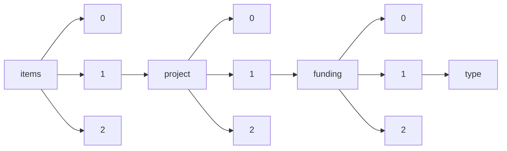

!!! warning "This document is not official Crossref documentation"
# Type
PATH = items/array/project/array/funding/array/type(1)  
Occurs 76 637 times  
Unique values: 10  
{ .annotate }

1. A route to an element, for example:  
   The route "items/array/project/array/funding/array/type" corresponds to navigating through the JSON indices as  
   ["items"][0]["project"][0]["funding"][0]["type"]  

| **Row** | **Value** `String` | **Count** `Int64` |
|--------:|----------------------:|---------------------:|
| **1**   | grant                 | 62 789               |
| **2**   | award                 | 11 660               |
| **3**   | training-grant        | 1 085                |
| **4**   | fellowship            | 868                  |
| **5**   | equipment             | 136                  |
| **6**   | contract              | 92                   |
| **7**   | prize                 | 4                    |
| **8**   | endowment             | 1                    |
| **9**   | salary-award          | 1                    |
| **10**  | other                 | 1                    |

