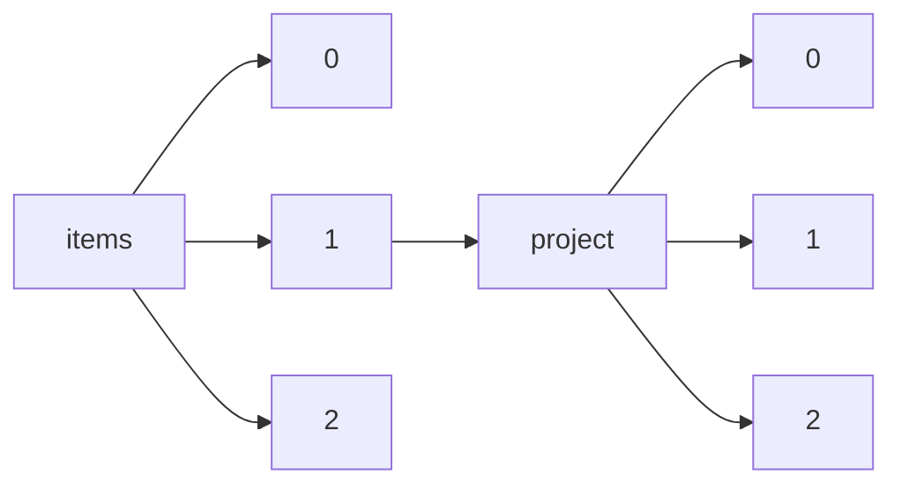

!!! warning "This document is not official Crossref documentation"
# Elements
PATH = items/array/project/array(1)  
Occurs 76 617 times  
{ .annotate }

1. A route to an element, for example:  
   The route "items/array/project/array" corresponds to navigating through the JSON indices as  
   ["items"][0]["project"][0]  

## Award-amount
See more information: [items/array/project/array/award-amount](award-amount/index.md)  
Occurs 52 198 timess  

## Award-end
See more information: [items/array/project/array/award-end](award-end/index.md)  
Occurs 60 828 timess  

## Award-planned-end
See more information: [items/array/project/array/award-planned-end](award-planned-end/index.md)  
Occurs 30 446 timess  

## Award-start
See more information: [items/array/project/array/award-start](award-start/index.md)  
Occurs 67 427 timess  

## Co-lead-investigator
See more information: [items/array/project/array/co-lead-investigator](co-lead-investigator/index.md)  
Occurs 2 652 timess  

| **Row** | **Length** `Any` | **Count** `Int64` |
|--------:|--------------------:|---------------------:|
| **1**   | 1                   | 1 987                |
| **2**   | 2                   | 343                  |
| **3**   | 3                   | 107                  |
| **4**   | 4                   | 70                   |
| **5**   | 5                   | 48                   |
| **6**   | 6                   | 27                   |
| **7**   | 7                   | 20                   |
| **8**   | 8                   | 10                   |
| **9**   | 9                   | 7                    |
| **10**  | 10                  | 7                    |
| ... | ... | ... |

## Funding
See more information: [items/array/project/array/funding](funding/index.md)  
Occurs 76 617 timess  

| **Row** | **Length** `Any` | **Count** `Int64` |
|--------:|--------------------:|---------------------:|
| **1**   | 1                   | 76 597               |
| **2**   | 2                   | 20                   |

## Investigator
See more information: [items/array/project/array/investigator](investigator/index.md)  
Occurs 20 975 timess  

| **Row** | **Length** `Any` | **Count** `Int64` |
|--------:|--------------------:|---------------------:|
| **1**   | 1                   | 14 793               |
| **2**   | 2                   | 1 751                |
| **3**   | 3                   | 1 178                |
| **4**   | 4                   | 796                  |
| **5**   | 5                   | 565                  |
| **6**   | 6                   | 444                  |
| **7**   | 7                   | 339                  |
| **8**   | 8                   | 232                  |
| **9**   | 9                   | 211                  |
| **10**  | 10                  | 135                  |
| ... | ... | ... |

## Lead-investigator
See more information: [items/array/project/array/lead-investigator](lead-investigator/index.md)  
Occurs 27 748 timess  

| **Row** | **Length** `Any` | **Count** `Int64` |
|--------:|--------------------:|---------------------:|
| **1**   | 1                   | 27 587               |
| **2**   | 2                   | 105                  |
| **3**   | 3                   | 22                   |
| **4**   | 4                   | 9                    |
| **5**   | 5                   | 7                    |
| **6**   | 6                   | 14                   |
| **7**   | 7                   | 2                    |
| **8**   | 10                  | 2                    |

## Project-description
See more information: [items/array/project/array/project-description](project-description/index.md)  
Occurs 57 015 timess  

| **Row** | **Length** `Any` | **Count** `Int64` |
|--------:|--------------------:|---------------------:|
| **1**   | 1                   | 55 092               |
| **2**   | 2                   | 1 923                |

## Project-title
See more information: [items/array/project/array/project-title](project-title/index.md)  
Occurs 76 617 timess  

| **Row** | **Length** `Any` | **Count** `Int64` |
|--------:|--------------------:|---------------------:|
| **1**   | 1                   | 40 625               |
| **2**   | 2                   | 35 991               |
| **3**   | 3                   | 1                    |

