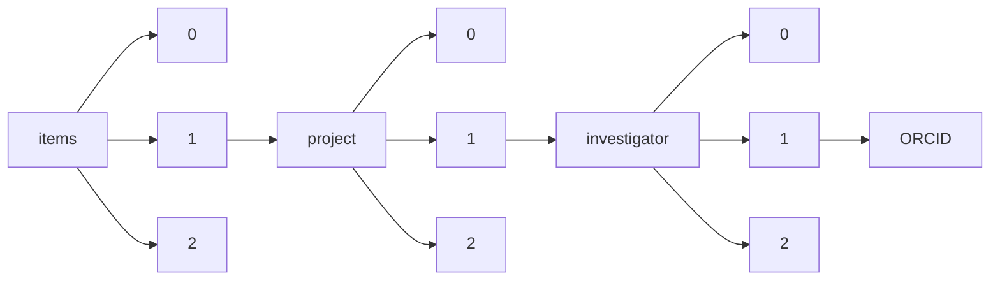

!!! warning "This document is not official Crossref documentation"
# ORCID
PATH = items/array/project/array/investigator/array/ORCID(1)  
Occurs 7 970 times  
Unique values: > 999  
{ .annotate }

1. A route to an element, for example:  
   The route "items/array/project/array/investigator/array/ORCID" corresponds to navigating through the JSON indices as  
   ["items"][0]["project"][0]["investigator"][0]["ORCID"]  

!!! note "Due to current limitations, only the first 1,000 unique values are counted."

| **Row** | **Value** `String`                | **Count** `Int64` |
|--------:|-------------------------------------:|---------------------:|
| **1**   | http://orcid.org/0000-0003-0900-9629 | 15                   |
| **2**   | http://orcid.org/0000-0002-1897-1978 | 15                   |
| **3**   | http://orcid.org/0000-0003-2309-1171 | 14                   |
| **4**   | http://orcid.org/0000-0002-1407-8314 | 13                   |
| **5**   | http://orcid.org/0000-0002-9795-0365 | 12                   |
| **6**   | http://orcid.org/0000-0001-6744-5061 | 12                   |
| **7**   | http://orcid.org/0000-0003-4760-8382 | 12                   |
| **8**   | http://orcid.org/0000-0002-2266-8891 | 11                   |
| **9**   | http://orcid.org/0000-0002-9427-4429 | 11                   |
| **10**  | http://orcid.org/0000-0002-7069-5958 | 11                   |
| **11**  | http://orcid.org/0000-0002-4866-2885 | 11                   |
| **12**  | http://orcid.org/0000-0002-2776-5850 | 10                   |
| **13**  | http://orcid.org/0000-0001-9383-1054 | 10                   |
| **14**  | http://orcid.org/0000-0002-0031-8276 | 10                   |
| **15**  | http://orcid.org/0000-0002-6484-2501 | 10                   |
| **16**  | http://orcid.org/0000-0003-4089-8460 | 10                   |
| **17**  | http://orcid.org/0000-0003-2199-4449 | 10                   |
| **18**  | http://orcid.org/0000-0002-9070-8349 | 9                    |
| **19**  | http://orcid.org/0000-0002-3079-8039 | 9                    |
| **20**  | http://orcid.org/0000-0003-4977-4683 | 9                    |
| **21**  | http://orcid.org/0000-0003-0708-2726 | 9                    |
| **22**  | http://orcid.org/0000-0001-6576-1116 | 9                    |
| **23**  | http://orcid.org/0000-0002-3248-2636 | 9                    |
| **24**  | http://orcid.org/0000-0002-3730-9955 | 9                    |
| **25**  | http://orcid.org/0000-0003-0309-9184 | 9                    |
| **26**  | http://orcid.org/0000-0003-1065-3008 | 9                    |
| **27**  | http://orcid.org/0000-0003-2740-8148 | 9                    |
| **28**  | http://orcid.org/0000-0001-6696-3545 | 8                    |
| **29**  | http://orcid.org/0000-0001-6360-7959 | 8                    |
| **30**  | http://orcid.org/0000-0001-5150-6624 | 8                    |
| **31**  | http://orcid.org/0000-0002-8600-0372 | 8                    |
| **32**  | http://orcid.org/0000-0001-5582-3301 | 8                    |
| **33**  | http://orcid.org/0000-0002-2126-5142 | 8                    |
| **34**  | http://orcid.org/0000-0001-6321-5138 | 8                    |
| **35**  | http://orcid.org/0000-0003-0824-4096 | 8                    |
| **36**  | http://orcid.org/0000-0001-9329-5028 | 8                    |
| **37**  | http://orcid.org/0000-0003-2818-9549 | 8                    |
| **38**  | http://orcid.org/0000-0002-2198-1958 | 8                    |
| **39**  | http://orcid.org/0000-0002-3897-7955 | 8                    |
| **40**  | http://orcid.org/0000-0002-9995-8096 | 8                    |
| **41**  | http://orcid.org/0000-0002-4134-9730 | 7                    |
| **42**  | http://orcid.org/0000-0002-6435-7266 | 7                    |
| **43**  | http://orcid.org/0000-0001-9495-3408 | 7                    |
| **44**  | http://orcid.org/0000-0002-9821-1003 | 7                    |
| **45**  | http://orcid.org/0000-0002-2416-1648 | 7                    |
| **46**  | http://orcid.org/0000-0003-0631-0053 | 7                    |
| **47**  | http://orcid.org/0000-0003-4402-5552 | 7                    |
| **48**  | http://orcid.org/0000-0001-9786-7038 | 7                    |
| **49**  | http://orcid.org/0000-0002-2673-8957 | 7                    |
| **50**  | http://orcid.org/0000-0002-0046-1363 | 7                    |
| **51**  | http://orcid.org/0000-0002-4132-7646 | 7                    |
| **52**  | http://orcid.org/0000-0003-0676-0927 | 7                    |
| **53**  | http://orcid.org/0000-0001-5574-3766 | 7                    |
| **54**  | http://orcid.org/0000-0002-6793-2262 | 7                    |
| **55**  | http://orcid.org/0000-0002-4938-1620 | 7                    |
| **56**  | http://orcid.org/0000-0002-6970-1767 | 7                    |
| **57**  | http://orcid.org/0000-0002-8557-5940 | 7                    |
| **58**  | http://orcid.org/0000-0002-5748-083X | 7                    |
| **59**  | http://orcid.org/0000-0002-9130-1006 | 7                    |
| **60**  | http://orcid.org/0000-0002-0287-5383 | 7                    |
| **61**  | http://orcid.org/0000-0002-0611-7272 | 7                    |
| **62**  | http://orcid.org/0000-0002-7427-0826 | 7                    |
| **63**  | http://orcid.org/0000-0003-3785-4934 | 7                    |
| **64**  | http://orcid.org/0000-0002-5218-6615 | 7                    |
| **65**  | http://orcid.org/0000-0003-1379-7146 | 7                    |
| **66**  | http://orcid.org/0000-0003-2331-3192 | 7                    |
| **67**  | http://orcid.org/0000-0001-5173-9284 | 7                    |
| **68**  | http://orcid.org/0000-0002-3549-4309 | 7                    |
| **69**  | http://orcid.org/0000-0003-3725-6088 | 7                    |
| **70**  | http://orcid.org/0000-0001-7428-7647 | 7                    |
| **71**  | http://orcid.org/0000-0002-8796-4755 | 7                    |
| **72**  | http://orcid.org/0000-0001-8066-4381 | 6                    |
| **73**  | http://orcid.org/0000-0001-5426-1984 | 6                    |
| **74**  | http://orcid.org/0000-0001-9317-5915 | 6                    |
| **75**  | http://orcid.org/0000-0002-2544-9117 | 6                    |
| **76**  | http://orcid.org/0000-0001-5955-9325 | 6                    |
| **77**  | http://orcid.org/0000-0001-7361-719X | 6                    |
| **78**  | http://orcid.org/0000-0002-3932-5502 | 6                    |
| **79**  | http://orcid.org/0000-0002-8640-4318 | 6                    |
| **80**  | http://orcid.org/0000-0002-6113-2109 | 6                    |
| **81**  | http://orcid.org/0000-0002-6415-4354 | 6                    |
| **82**  | http://orcid.org/0000-0003-0914-6164 | 6                    |
| **83**  | http://orcid.org/0000-0002-2972-5481 | 6                    |
| **84**  | http://orcid.org/0000-0002-1020-5240 | 6                    |
| **85**  | http://orcid.org/0000-0002-7707-0264 | 6                    |
| **86**  | http://orcid.org/0000-0002-9495-5793 | 6                    |
| **87**  | http://orcid.org/0000-0003-2624-3599 | 6                    |
| **88**  | http://orcid.org/0000-0001-6429-654X | 6                    |
| **89**  | http://orcid.org/0000-0002-3927-2084 | 6                    |
| **90**  | http://orcid.org/0000-0003-3765-8167 | 6                    |
| **91**  | http://orcid.org/0000-0001-7395-9552 | 6                    |
| **92**  | http://orcid.org/0000-0003-4059-431X | 6                    |
| **93**  | http://orcid.org/0000-0003-2894-2772 | 6                    |
| **94**  | http://orcid.org/0000-0003-4307-9161 | 6                    |
| **95**  | http://orcid.org/0000-0002-2135-7549 | 6                    |
| **96**  | http://orcid.org/0000-0002-6883-6168 | 6                    |
| **97**  | http://orcid.org/0000-0002-3273-0302 | 6                    |
| **98**  | http://orcid.org/0000-0003-4656-5536 | 6                    |
| **99**  | http://orcid.org/0000-0002-1395-7173 | 6                    |
| **100** | http://orcid.org/0000-0002-0397-245X | 6                    |
| **101** | http://orcid.org/0000-0001-6055-2067 | 6                    |
| **102** | http://orcid.org/0000-0002-5318-307X | 6                    |
| **103** | http://orcid.org/0000-0001-6908-1273 | 6                    |
| **104** | http://orcid.org/0000-0002-5480-6638 | 6                    |
| **105** | http://orcid.org/0000-0002-1154-8093 | 6                    |
| **106** | http://orcid.org/0000-0002-9483-510X | 6                    |
| **107** | http://orcid.org/0000-0003-3829-4326 | 6                    |
| **108** | http://orcid.org/0000-0002-2753-1800 | 6                    |
| **109** | http://orcid.org/0000-0002-6211-2775 | 6                    |
| **110** | http://orcid.org/0000-0001-7525-3350 | 6                    |
| **111** | http://orcid.org/0000-0002-5997-1683 | 6                    |
| **112** | http://orcid.org/0000-0002-4533-3816 | 6                    |
| **113** | http://orcid.org/0000-0002-2104-5430 | 6                    |
| **114** | http://orcid.org/0000-0002-1360-2751 | 6                    |
| **115** | http://orcid.org/0000-0001-5697-4881 | 6                    |
| **116** | http://orcid.org/0000-0002-3200-7173 | 6                    |
| **117** | http://orcid.org/0000-0002-1807-3123 | 6                    |
| **118** | http://orcid.org/0000-0003-4496-2984 | 5                    |
| **119** | http://orcid.org/0000-0002-6654-7346 | 5                    |
| **120** | http://orcid.org/0000-0001-8314-8497 | 5                    |
| **121** | http://orcid.org/0000-0003-2413-9392 | 5                    |
| **122** | http://orcid.org/0000-0002-3829-066X | 5                    |
| **123** | http://orcid.org/0000-0003-1872-9169 | 5                    |
| **124** | http://orcid.org/0000-0002-2678-1832 | 5                    |
| **125** | http://orcid.org/0000-0002-8546-9646 | 5                    |
| **126** | http://orcid.org/0000-0001-8185-4515 | 5                    |
| **127** | http://orcid.org/0000-0003-0434-5842 | 5                    |
| **128** | http://orcid.org/0000-0002-8373-7379 | 5                    |
| **129** | http://orcid.org/0000-0002-9166-8158 | 5                    |
| **130** | http://orcid.org/0000-0002-7220-2555 | 5                    |
| **131** | http://orcid.org/0000-0002-2804-7586 | 5                    |
| **132** | http://orcid.org/0000-0003-3932-5382 | 5                    |
| **133** | http://orcid.org/0000-0002-3589-7108 | 5                    |
| **134** | http://orcid.org/0000-0001-5485-0236 | 5                    |
| **135** | http://orcid.org/0000-0001-8663-6525 | 5                    |
| **136** | http://orcid.org/0000-0002-1555-8977 | 5                    |
| **137** | http://orcid.org/0000-0002-4501-9587 | 5                    |
| **138** | http://orcid.org/0000-0002-3834-1893 | 5                    |
| **139** | http://orcid.org/0000-0001-5799-9634 | 5                    |
| **140** | http://orcid.org/0000-0003-1321-8714 | 5                    |
| **141** | http://orcid.org/0000-0001-9151-5154 | 5                    |
| **142** | http://orcid.org/0000-0001-5559-9389 | 5                    |
| **143** | http://orcid.org/0000-0003-4007-5077 | 5                    |
| **144** | http://orcid.org/0000-0001-6204-6045 | 5                    |
| **145** | http://orcid.org/0000-0002-1236-849X | 5                    |
| **146** | http://orcid.org/0000-0002-7683-9422 | 5                    |
| **147** | http://orcid.org/0000-0002-1022-9330 | 5                    |
| **148** | http://orcid.org/0000-0002-2858-2087 | 5                    |
| **149** | http://orcid.org/0000-0001-7609-3504 | 5                    |
| **150** | http://orcid.org/0000-0002-8077-2101 | 5                    |
| **151** | http://orcid.org/0000-0002-9822-1586 | 5                    |
| **152** | http://orcid.org/0000-0002-2145-1615 | 5                    |
| **153** | http://orcid.org/0000-0003-3002-1251 | 5                    |
| **154** | http://orcid.org/0000-0002-8446-9150 | 5                    |
| **155** | http://orcid.org/0000-0003-4880-7682 | 5                    |
| **156** | http://orcid.org/0000-0002-1353-1092 | 5                    |
| **157** | http://orcid.org/0000-0001-7482-8722 | 5                    |
| **158** | http://orcid.org/0000-0002-4350-5354 | 5                    |
| **159** | http://orcid.org/0000-0001-6495-0329 | 5                    |
| **160** | http://orcid.org/0000-0001-5276-9645 | 5                    |
| **161** | http://orcid.org/0000-0001-8346-6671 | 5                    |
| **162** | http://orcid.org/0000-0003-4850-2360 | 5                    |
| **163** | http://orcid.org/0000-0002-5573-1308 | 5                    |
| **164** | http://orcid.org/0000-0002-4331-6967 | 5                    |
| **165** | http://orcid.org/0000-0002-2280-1170 | 5                    |
| **166** | http://orcid.org/0000-0001-5841-8176 | 5                    |
| **167** | http://orcid.org/0000-0003-2640-6925 | 5                    |
| **168** | http://orcid.org/0000-0003-4573-449X | 5                    |
| **169** | http://orcid.org/0000-0002-5490-8933 | 5                    |
| **170** | http://orcid.org/0000-0001-8571-4376 | 5                    |
| **171** | http://orcid.org/0000-0001-8362-2603 | 5                    |
| **172** | http://orcid.org/0000-0002-4393-0510 | 5                    |
| **173** | http://orcid.org/0000-0002-7141-8936 | 5                    |
| **174** | http://orcid.org/0000-0001-7680-2200 | 5                    |
| **175** | http://orcid.org/0000-0002-4739-6773 | 5                    |
| **176** | http://orcid.org/0000-0002-3748-0154 | 5                    |
| **177** | http://orcid.org/0000-0002-1487-4126 | 5                    |
| **178** | http://orcid.org/0000-0001-9733-2404 | 5                    |
| **179** | http://orcid.org/0000-0002-1153-0192 | 5                    |
| **180** | http://orcid.org/0000-0002-8878-9901 | 5                    |
| **181** | http://orcid.org/0000-0003-1623-2693 | 5                    |
| **182** | http://orcid.org/0000-0002-2708-8992 | 5                    |
| **183** | http://orcid.org/0000-0002-3931-0503 | 5                    |
| **184** | http://orcid.org/0000-0003-0117-2894 | 5                    |
| **185** | http://orcid.org/0000-0001-5696-0340 | 5                    |
| **186** | http://orcid.org/0000-0002-5385-3053 | 5                    |
| **187** | http://orcid.org/0000-0001-8558-2051 | 4                    |
| **188** | http://orcid.org/0000-0002-5802-1870 | 4                    |
| **189** | http://orcid.org/0000-0003-2000-2874 | 4                    |
| **190** | http://orcid.org/0000-0003-0791-3673 | 4                    |
| **191** | http://orcid.org/0000-0002-0213-3259 | 4                    |
| **192** | http://orcid.org/0000-0002-9267-2124 | 4                    |
| **193** | http://orcid.org/0000-0002-3654-3192 | 4                    |
| **194** | http://orcid.org/0000-0003-4337-3707 | 4                    |
| **195** | http://orcid.org/0000-0003-2147-5614 | 4                    |
| **196** | http://orcid.org/0000-0001-7438-8296 | 4                    |
| **197** | http://orcid.org/0000-0002-2418-6925 | 4                    |
| **198** | http://orcid.org/0000-0002-6999-5507 | 4                    |
| **199** | http://orcid.org/0000-0003-2444-3247 | 4                    |
| **200** | http://orcid.org/0000-0002-6462-1047 | 4                    |
| **201** | http://orcid.org/0000-0003-3312-5929 | 4                    |
| **202** | http://orcid.org/0000-0002-1470-8531 | 4                    |
| **203** | http://orcid.org/0000-0001-9691-9684 | 4                    |
| **204** | http://orcid.org/0000-0001-5762-2802 | 4                    |
| **205** | http://orcid.org/0000-0002-6788-3608 | 4                    |
| **206** | http://orcid.org/0000-0002-7476-4148 | 4                    |
| **207** | http://orcid.org/0000-0002-6639-188X | 4                    |
| **208** | http://orcid.org/0000-0002-3029-4682 | 4                    |
| **209** | http://orcid.org/0000-0002-4055-5161 | 4                    |
| **210** | http://orcid.org/0000-0001-9287-8053 | 4                    |
| **211** | http://orcid.org/0000-0002-9839-5279 | 4                    |
| **212** | http://orcid.org/0000-0002-7620-4822 | 4                    |
| **213** | http://orcid.org/0000-0003-1422-2993 | 4                    |
| **214** | http://orcid.org/0000-0002-7592-0085 | 4                    |
| **215** | http://orcid.org/0000-0002-2782-7169 | 4                    |
| **216** | http://orcid.org/0000-0002-9470-6324 | 4                    |
| **217** | http://orcid.org/0000-0002-7631-8352 | 4                    |
| **218** | http://orcid.org/0000-0003-3506-1287 | 4                    |
| **219** | http://orcid.org/0000-0002-6097-6115 | 4                    |
| **220** | http://orcid.org/0000-0001-8639-2663 | 4                    |
| **221** | http://orcid.org/0000-0002-4281-4630 | 4                    |
| **222** | http://orcid.org/0000-0002-7074-4051 | 4                    |
| **223** | http://orcid.org/0000-0002-2109-8081 | 4                    |
| **224** | http://orcid.org/0000-0003-1229-4619 | 4                    |
| **225** | http://orcid.org/0000-0002-0590-2850 | 4                    |
| **226** | http://orcid.org/0000-0003-3866-7110 | 4                    |
| **227** | http://orcid.org/0000-0002-0231-3073 | 4                    |
| **228** | http://orcid.org/0000-0001-7073-2379 | 4                    |
| **229** | http://orcid.org/0000-0002-0329-9613 | 4                    |
| **230** | http://orcid.org/0000-0002-8388-9073 | 4                    |
| **231** | http://orcid.org/0000-0001-7292-5430 | 4                    |
| **232** | http://orcid.org/0000-0001-7216-8679 | 4                    |
| **233** | http://orcid.org/0000-0002-3930-3821 | 4                    |
| **234** | http://orcid.org/0000-0001-8900-2982 | 4                    |
| **235** | http://orcid.org/0000-0003-4456-2382 | 4                    |
| **236** | http://orcid.org/0000-0001-9317-7937 | 4                    |
| **237** | http://orcid.org/0000-0001-9807-9148 | 4                    |
| **238** | http://orcid.org/0000-0002-5621-3799 | 4                    |
| **239** | http://orcid.org/0000-0003-0307-9343 | 4                    |
| **240** | http://orcid.org/0000-0001-6400-0227 | 4                    |
| **241** | http://orcid.org/0000-0002-1499-6908 | 4                    |
| **242** | http://orcid.org/0000-0003-1308-5755 | 4                    |
| **243** | http://orcid.org/0000-0003-2850-9936 | 4                    |
| **244** | http://orcid.org/0000-0002-7054-4711 | 4                    |
| **245** | http://orcid.org/0000-0002-6514-6911 | 4                    |
| **246** | http://orcid.org/0000-0003-3115-3061 | 4                    |
| **247** | http://orcid.org/0000-0002-7311-4725 | 4                    |
| **248** | http://orcid.org/0000-0002-5930-6456 | 4                    |
| **249** | http://orcid.org/0000-0002-0033-7514 | 4                    |
| **250** | http://orcid.org/0000-0003-3124-5169 | 4                    |
| **251** | http://orcid.org/0000-0002-2546-4616 | 4                    |
| **252** | http://orcid.org/0000-0002-4670-0331 | 4                    |
| **253** | http://orcid.org/0000-0002-8555-8219 | 4                    |
| **254** | http://orcid.org/0000-0002-2853-806X | 4                    |
| **255** | http://orcid.org/0000-0001-9384-2087 | 4                    |
| **256** | http://orcid.org/0000-0002-3488-2078 | 4                    |
| **257** | http://orcid.org/0000-0002-3948-0895 | 4                    |
| **258** | http://orcid.org/0000-0003-3983-9009 | 4                    |
| **259** | http://orcid.org/0000-0001-8288-8602 | 4                    |
| **260** | http://orcid.org/0000-0002-0650-4002 | 4                    |
| **261** | http://orcid.org/0000-0001-8764-1289 | 4                    |
| **262** | http://orcid.org/0000-0001-9466-4462 | 4                    |
| **263** | http://orcid.org/0000-0001-6122-1649 | 4                    |
| **264** | http://orcid.org/0000-0001-6360-0343 | 4                    |
| **265** | http://orcid.org/0000-0003-4658-2133 | 4                    |
| **266** | http://orcid.org/0000-0003-0693-910X | 4                    |
| **267** | http://orcid.org/0000-0001-7448-4835 | 4                    |
| **268** | http://orcid.org/0000-0002-3789-6168 | 4                    |
| **269** | http://orcid.org/0000-0002-0552-4140 | 4                    |
| **270** | http://orcid.org/0000-0003-1123-1464 | 4                    |
| **271** | http://orcid.org/0000-0003-2449-0983 | 4                    |
| **272** | http://orcid.org/0000-0003-2101-6653 | 4                    |
| **273** | http://orcid.org/0000-0001-5999-1310 | 4                    |
| **274** | http://orcid.org/0000-0003-0869-3465 | 4                    |
| **275** | http://orcid.org/0000-0002-6541-5915 | 4                    |
| **276** | http://orcid.org/0000-0001-5677-1806 | 4                    |
| **277** | http://orcid.org/0000-0003-2548-4294 | 4                    |
| **278** | http://orcid.org/0000-0002-5007-7896 | 4                    |
| **279** | http://orcid.org/0000-0001-9160-1941 | 4                    |
| **280** | http://orcid.org/0000-0003-0796-7209 | 4                    |
| **281** | http://orcid.org/0000-0003-4639-4765 | 4                    |
| **282** | http://orcid.org/0000-0001-7945-9620 | 4                    |
| **283** | http://orcid.org/0000-0002-7992-7719 | 4                    |
| **284** | http://orcid.org/0000-0001-9539-9947 | 4                    |
| **285** | http://orcid.org/0000-0002-2070-6073 | 4                    |
| **286** | http://orcid.org/0000-0003-4417-7329 | 4                    |
| **287** | http://orcid.org/0000-0002-0053-0154 | 3                    |
| **288** | http://orcid.org/0000-0003-0550-3400 | 3                    |
| **289** | http://orcid.org/0000-0002-1013-7815 | 3                    |
| **290** | http://orcid.org/0000-0002-3875-7071 | 3                    |
| **291** | http://orcid.org/0000-0002-4532-8152 | 3                    |
| **292** | http://orcid.org/0000-0002-2723-3512 | 3                    |
| **293** | http://orcid.org/0000-0002-2842-7861 | 3                    |
| **294** | http://orcid.org/0000-0002-9300-497X | 3                    |
| **295** | http://orcid.org/0000-0001-9842-5573 | 3                    |
| **296** | http://orcid.org/0000-0003-3068-491X | 3                    |
| **297** | http://orcid.org/0000-0002-7857-7032 | 3                    |
| **298** | http://orcid.org/0000-0001-6992-6870 | 3                    |
| **299** | http://orcid.org/0000-0003-2846-7860 | 3                    |
| **300** | http://orcid.org/0000-0002-2916-3802 | 3                    |
| **301** | http://orcid.org/0000-0001-7050-4317 | 3                    |
| **302** | http://orcid.org/0000-0002-7620-5526 | 3                    |
| **303** | http://orcid.org/0000-0002-9035-2039 | 3                    |
| **304** | http://orcid.org/0000-0003-1596-6054 | 3                    |
| **305** | http://orcid.org/0000-0002-8672-5349 | 3                    |
| **306** | http://orcid.org/0000-0002-1642-599X | 3                    |
| **307** | http://orcid.org/0000-0001-5190-2395 | 3                    |
| **308** | http://orcid.org/0000-0001-8938-5709 | 3                    |
| **309** | http://orcid.org/0000-0002-5337-5004 | 3                    |
| **310** | http://orcid.org/0000-0001-7261-2485 | 3                    |
| **311** | http://orcid.org/0000-0003-3683-8297 | 3                    |
| **312** | http://orcid.org/0000-0003-0312-3746 | 3                    |
| **313** | http://orcid.org/0000-0002-9886-5947 | 3                    |
| **314** | http://orcid.org/0000-0003-4178-1838 | 3                    |
| **315** | http://orcid.org/0000-0002-5310-1337 | 3                    |
| **316** | http://orcid.org/0000-0002-8705-2641 | 3                    |
| **317** | http://orcid.org/0000-0002-9862-7332 | 3                    |
| **318** | http://orcid.org/0000-0002-8369-5105 | 3                    |
| **319** | http://orcid.org/0000-0001-6746-5492 | 3                    |
| **320** | http://orcid.org/0000-0002-7996-6021 | 3                    |
| **321** | http://orcid.org/0000-0001-9755-1703 | 3                    |
| **322** | http://orcid.org/0000-0001-7829-5505 | 3                    |
| **323** | http://orcid.org/0000-0003-1360-4308 | 3                    |
| **324** | http://orcid.org/0000-0001-9028-8586 | 3                    |
| **325** | http://orcid.org/0000-0002-2782-4195 | 3                    |
| **326** | http://orcid.org/0000-0003-2721-7763 | 3                    |
| **327** | http://orcid.org/0000-0002-8955-8283 | 3                    |
| **328** | http://orcid.org/0000-0001-6538-9406 | 3                    |
| **329** | http://orcid.org/0000-0001-9674-9953 | 3                    |
| **330** | http://orcid.org/0000-0002-4652-0365 | 3                    |
| **331** | http://orcid.org/0000-0002-4270-8360 | 3                    |
| **332** | http://orcid.org/0000-0003-2961-2572 | 3                    |
| **333** | http://orcid.org/0000-0002-9164-9782 | 3                    |
| **334** | http://orcid.org/0000-0001-6539-3069 | 3                    |
| **335** | http://orcid.org/0000-0002-5240-2592 | 3                    |
| **336** | http://orcid.org/0000-0001-8781-336X | 3                    |
| **337** | http://orcid.org/0000-0002-8442-0525 | 3                    |
| **338** | http://orcid.org/0000-0001-8977-6726 | 3                    |
| **339** | http://orcid.org/0000-0002-9626-2069 | 3                    |
| **340** | http://orcid.org/0000-0002-5023-0176 | 3                    |
| **341** | http://orcid.org/0000-0003-3255-9135 | 3                    |
| **342** | http://orcid.org/0000-0001-5180-7179 | 3                    |
| **343** | http://orcid.org/0000-0002-9512-5337 | 3                    |
| **344** | http://orcid.org/0000-0002-0009-7653 | 3                    |
| **345** | http://orcid.org/0000-0003-1620-3761 | 3                    |
| **346** | http://orcid.org/0000-0002-5526-4578 | 3                    |
| **347** | http://orcid.org/0000-0002-0258-3188 | 3                    |
| **348** | http://orcid.org/0000-0001-7632-9492 | 3                    |
| **349** | http://orcid.org/0000-0001-7456-259X | 3                    |
| **350** | http://orcid.org/0000-0002-3651-6354 | 3                    |
| **351** | http://orcid.org/0000-0002-9623-7007 | 3                    |
| **352** | http://orcid.org/0000-0001-9751-1808 | 3                    |
| **353** | http://orcid.org/0000-0001-6010-394X | 3                    |
| **354** | http://orcid.org/0000-0002-3014-7148 | 3                    |
| **355** | http://orcid.org/0000-0002-1273-8956 | 3                    |
| **356** | http://orcid.org/0000-0001-6506-3115 | 3                    |
| **357** | http://orcid.org/0000-0002-9160-7929 | 3                    |
| **358** | http://orcid.org/0000-0003-1496-7020 | 3                    |
| **359** | http://orcid.org/0000-0001-7614-0403 | 3                    |
| **360** | http://orcid.org/0000-0001-5420-2183 | 3                    |
| **361** | http://orcid.org/0000-0001-8294-0642 | 3                    |
| **362** | http://orcid.org/0000-0002-8420-8583 | 3                    |
| **363** | http://orcid.org/0000-0003-1790-1641 | 3                    |
| **364** | http://orcid.org/0000-0002-8962-9897 | 3                    |
| **365** | http://orcid.org/0000-0001-8445-1375 | 3                    |
| **366** | http://orcid.org/0000-0001-7595-2514 | 3                    |
| **367** | http://orcid.org/0000-0001-9543-8360 | 3                    |
| **368** | http://orcid.org/0000-0001-5539-5757 | 3                    |
| **369** | http://orcid.org/0000-0002-5178-4250 | 3                    |
| **370** | http://orcid.org/0000-0003-1157-3608 | 3                    |
| **371** | http://orcid.org/0000-0002-7755-5683 | 3                    |
| **372** | http://orcid.org/0000-0001-9183-0373 | 3                    |
| **373** | http://orcid.org/0000-0002-1762-160X | 3                    |
| **374** | http://orcid.org/0000-0003-0066-0634 | 3                    |
| **375** | http://orcid.org/0000-0002-2154-6358 | 3                    |
| **376** | http://orcid.org/0000-0002-4232-2898 | 3                    |
| **377** | http://orcid.org/0000-0002-3007-6749 | 3                    |
| **378** | http://orcid.org/0000-0002-0616-6576 | 3                    |
| **379** | http://orcid.org/0000-0001-7193-8790 | 3                    |
| **380** | http://orcid.org/0000-0002-5185-9750 | 3                    |
| **381** | http://orcid.org/0000-0001-5277-6730 | 3                    |
| **382** | http://orcid.org/0000-0003-1934-5327 | 3                    |
| **383** | http://orcid.org/0000-0002-2315-3507 | 3                    |
| **384** | http://orcid.org/0000-0002-0813-7218 | 3                    |
| **385** | http://orcid.org/0000-0002-0629-0884 | 3                    |
| **386** | http://orcid.org/0000-0003-2173-7063 | 3                    |
| **387** | http://orcid.org/0000-0001-9092-0852 | 3                    |
| **388** | http://orcid.org/0000-0001-6302-5705 | 3                    |
| **389** | http://orcid.org/0000-0001-7748-1920 | 3                    |
| **390** | http://orcid.org/0000-0003-0166-1612 | 3                    |
| **391** | http://orcid.org/0000-0001-6959-6007 | 3                    |
| **392** | http://orcid.org/0000-0002-6660-9770 | 3                    |
| **393** | http://orcid.org/0000-0003-1336-7744 | 3                    |
| **394** | http://orcid.org/0000-0003-2716-2045 | 3                    |
| **395** | http://orcid.org/0000-0003-2796-7468 | 3                    |
| **396** | http://orcid.org/0000-0002-1307-2981 | 3                    |
| **397** | http://orcid.org/0000-0003-0767-0042 | 3                    |
| **398** | http://orcid.org/0000-0002-9843-8988 | 3                    |
| **399** | http://orcid.org/0000-0002-8294-8836 | 3                    |
| **400** | http://orcid.org/0000-0002-0150-5049 | 3                    |
| **401** | http://orcid.org/0000-0003-4629-684X | 3                    |
| **402** | http://orcid.org/0000-0002-9795-0218 | 3                    |
| **403** | http://orcid.org/0000-0003-1542-2348 | 3                    |
| **404** | http://orcid.org/0000-0003-4838-2653 | 3                    |
| **405** | http://orcid.org/0000-0003-3447-3570 | 3                    |
| **406** | http://orcid.org/0000-0002-9219-0387 | 3                    |
| **407** | http://orcid.org/0000-0002-5650-5361 | 3                    |
| **408** | http://orcid.org/0000-0001-5432-5271 | 3                    |
| **409** | http://orcid.org/0000-0001-8186-5708 | 3                    |
| **410** | http://orcid.org/0000-0001-7971-4628 | 3                    |
| **411** | http://orcid.org/0000-0002-9501-6165 | 3                    |
| **412** | http://orcid.org/0000-0002-3640-5275 | 3                    |
| **413** | http://orcid.org/0000-0001-9295-3594 | 3                    |
| **414** | http://orcid.org/0000-0002-5511-3454 | 3                    |
| **415** | http://orcid.org/0000-0001-6865-4519 | 3                    |
| **416** | http://orcid.org/0000-0003-0432-5067 | 3                    |
| **417** | http://orcid.org/0000-0003-0898-6081 | 3                    |
| **418** | http://orcid.org/0000-0003-0646-6584 | 3                    |
| **419** | http://orcid.org/0000-0002-5694-5340 | 3                    |
| **420** | http://orcid.org/0000-0003-1144-9877 | 3                    |
| **421** | http://orcid.org/0000-0002-9794-5996 | 3                    |
| **422** | http://orcid.org/0000-0001-8434-9549 | 3                    |
| **423** | http://orcid.org/0000-0003-4409-8049 | 3                    |
| **424** | http://orcid.org/0000-0002-6857-3441 | 3                    |
| **425** | http://orcid.org/0000-0003-4814-8293 | 3                    |
| **426** | http://orcid.org/0000-0003-3618-0843 | 3                    |
| **427** | http://orcid.org/0000-0003-3194-3127 | 3                    |
| **428** | http://orcid.org/0000-0002-7191-0621 | 3                    |
| **429** | http://orcid.org/0000-0003-3789-2500 | 3                    |
| **430** | http://orcid.org/0000-0003-0848-6044 | 3                    |
| **431** | http://orcid.org/0000-0003-2670-0024 | 3                    |
| **432** | http://orcid.org/0000-0001-5258-793X | 3                    |
| **433** | http://orcid.org/0000-0002-8650-1388 | 3                    |
| **434** | http://orcid.org/0000-0002-1281-0815 | 3                    |
| **435** | http://orcid.org/0000-0002-5605-0395 | 3                    |
| **436** | http://orcid.org/0000-0001-8626-2148 | 3                    |
| **437** | http://orcid.org/0000-0002-9842-4674 | 3                    |
| **438** | http://orcid.org/0000-0003-4027-9803 | 3                    |
| **439** | http://orcid.org/0000-0001-7297-7708 | 3                    |
| **440** | http://orcid.org/0000-0003-3076-0783 | 3                    |
| **441** | http://orcid.org/0000-0001-7433-8862 | 3                    |
| **442** | http://orcid.org/0000-0003-3103-9330 | 3                    |
| **443** | http://orcid.org/0000-0003-2731-5654 | 3                    |
| **444** | http://orcid.org/0000-0002-2034-9969 | 3                    |
| **445** | http://orcid.org/0000-0003-4305-5258 | 3                    |
| **446** | http://orcid.org/0000-0002-2064-3359 | 3                    |
| **447** | http://orcid.org/0000-0003-1813-5061 | 3                    |
| **448** | http://orcid.org/0000-0001-8781-571X | 3                    |
| **449** | http://orcid.org/0000-0001-6423-105X | 3                    |
| **450** | http://orcid.org/0000-0003-3781-2566 | 3                    |
| **451** | http://orcid.org/0000-0003-3598-7784 | 3                    |
| **452** | http://orcid.org/0000-0002-8351-6322 | 3                    |
| **453** | http://orcid.org/0000-0002-8393-8533 | 3                    |
| **454** | http://orcid.org/0000-0001-7030-4403 | 3                    |
| **455** | http://orcid.org/0000-0002-7660-9176 | 3                    |
| **456** | http://orcid.org/0000-0003-2220-7566 | 3                    |
| **457** | http://orcid.org/0000-0003-4381-0532 | 3                    |
| **458** | http://orcid.org/0000-0002-4650-7208 | 3                    |
| **459** | http://orcid.org/0000-0001-9675-2722 | 3                    |
| **460** | http://orcid.org/0000-0002-3877-7769 | 3                    |
| **461** | http://orcid.org/0000-0001-8273-0047 | 3                    |
| **462** | http://orcid.org/0000-0002-4623-7076 | 3                    |
| **463** | http://orcid.org/0000-0002-8035-4719 | 3                    |
| **464** | http://orcid.org/0000-0001-8257-1517 | 3                    |
| **465** | http://orcid.org/0000-0001-9747-1762 | 3                    |
| **466** | http://orcid.org/0000-0002-8711-3037 | 3                    |
| **467** | http://orcid.org/0000-0001-6290-1590 | 3                    |
| **468** | http://orcid.org/0000-0002-6817-5064 | 3                    |
| **469** | http://orcid.org/0000-0002-8770-7628 | 3                    |
| **470** | http://orcid.org/0000-0002-7400-0527 | 3                    |
| **471** | http://orcid.org/0000-0001-8366-3245 | 3                    |
| **472** | http://orcid.org/0000-0002-9282-9005 | 3                    |
| **473** | http://orcid.org/0000-0003-0542-0816 | 3                    |
| **474** | http://orcid.org/0000-0001-5135-2725 | 2                    |
| **475** | http://orcid.org/0000-0002-6120-1581 | 2                    |
| **476** | http://orcid.org/0000-0001-8509-1500 | 2                    |
| **477** | http://orcid.org/0000-0003-1406-4251 | 2                    |
| **478** | http://orcid.org/0000-0002-5097-6605 | 2                    |
| **479** | http://orcid.org/0000-0001-9815-4267 | 2                    |
| **480** | http://orcid.org/0000-0003-4419-8939 | 2                    |
| **481** | http://orcid.org/0000-0003-4566-4030 | 2                    |
| **482** | http://orcid.org/0000-0001-6966-2641 | 2                    |
| **483** | http://orcid.org/0000-0002-6982-4660 | 2                    |
| **484** | http://orcid.org/0000-0003-1233-668X | 2                    |
| **485** | http://orcid.org/0000-0002-0012-0614 | 2                    |
| **486** | http://orcid.org/0000-0002-6440-1167 | 2                    |
| **487** | http://orcid.org/0000-0003-4553-018X | 2                    |
| **488** | http://orcid.org/0000-0003-0410-5451 | 2                    |
| **489** | http://orcid.org/0000-0002-4046-9191 | 2                    |
| **490** | http://orcid.org/0000-0001-7193-2583 | 2                    |
| **491** | http://orcid.org/0000-0001-5894-7043 | 2                    |
| **492** | http://orcid.org/0000-0001-8854-8668 | 2                    |
| **493** | http://orcid.org/0000-0002-7528-4461 | 2                    |
| **494** | http://orcid.org/0000-0002-4432-8505 | 2                    |
| **495** | http://orcid.org/0000-0002-0815-5088 | 2                    |
| **496** | http://orcid.org/0000-0002-5410-7562 | 2                    |
| **497** | http://orcid.org/0000-0002-9446-3756 | 2                    |
| **498** | http://orcid.org/0000-0001-6864-2075 | 2                    |
| **499** | http://orcid.org/0000-0002-4457-7851 | 2                    |
| **500** | http://orcid.org/0000-0002-5541-0651 | 2                    |
| **501** | http://orcid.org/0000-0001-5847-5226 | 2                    |
| **502** | http://orcid.org/0000-0003-1869-9107 | 2                    |
| **503** | http://orcid.org/0000-0001-9706-2977 | 2                    |
| **504** | http://orcid.org/0000-0002-5196-3734 | 2                    |
| **505** | http://orcid.org/0000-0002-2876-0496 | 2                    |
| **506** | http://orcid.org/0000-0003-0165-8202 | 2                    |
| **507** | http://orcid.org/0000-0001-6004-9955 | 2                    |
| **508** | http://orcid.org/0000-0001-8111-2730 | 2                    |
| **509** | http://orcid.org/0000-0001-5361-5031 | 2                    |
| **510** | http://orcid.org/0000-0002-9305-5662 | 2                    |
| **511** | http://orcid.org/0000-0001-8129-4247 | 2                    |
| **512** | http://orcid.org/0000-0003-0202-7816 | 2                    |
| **513** | http://orcid.org/0000-0003-1993-8341 | 2                    |
| **514** | http://orcid.org/0000-0001-6151-2964 | 2                    |
| **515** | http://orcid.org/0000-0002-8125-0313 | 2                    |
| **516** | http://orcid.org/0000-0003-0920-5291 | 2                    |
| **517** | http://orcid.org/0000-0002-8283-1750 | 2                    |
| **518** | http://orcid.org/0000-0002-3596-7874 | 2                    |
| **519** | http://orcid.org/0000-0001-7954-3267 | 2                    |
| **520** | http://orcid.org/0000-0002-3978-0564 | 2                    |
| **521** | http://orcid.org/0000-0001-7154-9752 | 2                    |
| **522** | http://orcid.org/0000-0002-2870-1955 | 2                    |
| **523** | http://orcid.org/0000-0002-2753-3398 | 2                    |
| **524** | http://orcid.org/0000-0002-8625-1614 | 2                    |
| **525** | http://orcid.org/0000-0002-1862-6402 | 2                    |
| **526** | http://orcid.org/0000-0003-3231-6950 | 2                    |
| **527** | http://orcid.org/0000-0002-3579-0888 | 2                    |
| **528** | http://orcid.org/0000-0001-8476-0223 | 2                    |
| **529** | http://orcid.org/0000-0002-5674-8670 | 2                    |
| **530** | http://orcid.org/0000-0003-0028-3226 | 2                    |
| **531** | http://orcid.org/0000-0001-9403-409X | 2                    |
| **532** | http://orcid.org/0000-0002-9168-6022 | 2                    |
| **533** | http://orcid.org/0000-0003-0998-1581 | 2                    |
| **534** | http://orcid.org/0000-0003-1313-7922 | 2                    |
| **535** | http://orcid.org/0000-0002-1457-8327 | 2                    |
| **536** | http://orcid.org/0000-0003-0594-6543 | 2                    |
| **537** | http://orcid.org/0000-0001-9713-7107 | 2                    |
| **538** | http://orcid.org/0000-0002-3105-6555 | 2                    |
| **539** | http://orcid.org/0000-0001-5087-3465 | 2                    |
| **540** | http://orcid.org/0000-0002-5287-9614 | 2                    |
| **541** | http://orcid.org/0000-0002-7475-3932 | 2                    |
| **542** | http://orcid.org/0000-0002-2257-9733 | 2                    |
| **543** | http://orcid.org/0000-0003-1691-6403 | 2                    |
| **544** | http://orcid.org/0000-0001-5527-7910 | 2                    |
| **545** | http://orcid.org/0000-0002-3224-0207 | 2                    |
| **546** | http://orcid.org/0000-0002-2005-9726 | 2                    |
| **547** | http://orcid.org/0000-0002-1861-6757 | 2                    |
| **548** | http://orcid.org/0000-0002-8928-9888 | 2                    |
| **549** | http://orcid.org/0000-0002-8005-3625 | 2                    |
| **550** | http://orcid.org/0000-0003-1955-6490 | 2                    |
| **551** | http://orcid.org/0000-0001-8147-1127 | 2                    |
| **552** | http://orcid.org/0000-0003-1482-0889 | 2                    |
| **553** | http://orcid.org/0000-0003-1330-7100 | 2                    |
| **554** | http://orcid.org/0000-0002-4404-254X | 2                    |
| **555** | http://orcid.org/0000-0001-5094-5721 | 2                    |
| **556** | http://orcid.org/0000-0002-4254-8854 | 2                    |
| **557** | http://orcid.org/0000-0002-4347-8149 | 2                    |
| **558** | http://orcid.org/0000-0002-3596-9407 | 2                    |
| **559** | http://orcid.org/0000-0001-8246-0534 | 2                    |
| **560** | http://orcid.org/0000-0001-7509-2016 | 2                    |
| **561** | http://orcid.org/0000-0002-8958-7017 | 2                    |
| **562** | http://orcid.org/0000-0003-3893-1348 | 2                    |
| **563** | http://orcid.org/0000-0002-7141-9189 | 2                    |
| **564** | http://orcid.org/0000-0002-6916-2994 | 2                    |
| **565** | http://orcid.org/0000-0002-3009-1850 | 2                    |
| **566** | http://orcid.org/0000-0002-7712-6774 | 2                    |
| **567** | http://orcid.org/0000-0002-5461-7001 | 2                    |
| **568** | http://orcid.org/0000-0001-5691-7270 | 2                    |
| **569** | http://orcid.org/0000-0002-7841-353X | 2                    |
| **570** | http://orcid.org/0000-0002-0406-7072 | 2                    |
| **571** | http://orcid.org/0000-0002-2607-2219 | 2                    |
| **572** | http://orcid.org/0000-0002-3302-3984 | 2                    |
| **573** | http://orcid.org/0000-0001-7518-9045 | 2                    |
| **574** | http://orcid.org/0000-0002-2237-7744 | 2                    |
| **575** | http://orcid.org/0000-0002-1334-9258 | 2                    |
| **576** | http://orcid.org/0000-0002-1373-0681 | 2                    |
| **577** | http://orcid.org/0000-0003-2645-7191 | 2                    |
| **578** | http://orcid.org/0000-0001-6414-2479 | 2                    |
| **579** | http://orcid.org/0000-0003-4798-0862 | 2                    |
| **580** | http://orcid.org/0000-0003-0233-4891 | 2                    |
| **581** | http://orcid.org/0000-0002-3014-5636 | 2                    |
| **582** | http://orcid.org/0000-0001-6128-3372 | 2                    |
| **583** | http://orcid.org/0000-0002-4175-4760 | 2                    |
| **584** | http://orcid.org/0000-0003-3078-8081 | 2                    |
| **585** | http://orcid.org/0000-0002-8142-8708 | 2                    |
| **586** | http://orcid.org/0000-0002-8249-8476 | 2                    |
| **587** | http://orcid.org/0000-0003-1313-4262 | 2                    |
| **588** | http://orcid.org/0000-0002-2457-2869 | 2                    |
| **589** | http://orcid.org/0000-0001-9537-4045 | 2                    |
| **590** | http://orcid.org/0000-0001-5506-7278 | 2                    |
| **591** | http://orcid.org/0000-0002-5694-0398 | 2                    |
| **592** | http://orcid.org/0000-0001-8084-8324 | 2                    |
| **593** | http://orcid.org/0000-0003-0135-9317 | 2                    |
| **594** | http://orcid.org/0000-0003-2489-2624 | 2                    |
| **595** | http://orcid.org/0000-0001-5737-7173 | 2                    |
| **596** | http://orcid.org/0000-0003-0221-9527 | 2                    |
| **597** | http://orcid.org/0000-0002-1824-2003 | 2                    |
| **598** | http://orcid.org/0000-0002-1560-1955 | 2                    |
| **599** | http://orcid.org/0000-0002-6294-6366 | 2                    |
| **600** | http://orcid.org/0000-0002-9211-1722 | 2                    |
| **601** | http://orcid.org/0000-0003-1419-3344 | 2                    |
| **602** | http://orcid.org/0000-0002-3227-2620 | 2                    |
| **603** | http://orcid.org/0000-0003-3155-122X | 2                    |
| **604** | http://orcid.org/0000-0002-6109-6419 | 2                    |
| **605** | http://orcid.org/0000-0003-0094-5947 | 2                    |
| **606** | http://orcid.org/0000-0003-4671-2030 | 2                    |
| **607** | http://orcid.org/0000-0003-3318-4152 | 2                    |
| **608** | http://orcid.org/0000-0002-3144-8233 | 2                    |
| **609** | http://orcid.org/0000-0002-2134-7439 | 2                    |
| **610** | http://orcid.org/0000-0001-5108-2227 | 2                    |
| **611** | http://orcid.org/0000-0002-0637-0622 | 2                    |
| **612** | http://orcid.org/0000-0003-3691-1888 | 2                    |
| **613** | http://orcid.org/0000-0002-8745-8377 | 2                    |
| **614** | http://orcid.org/0000-0002-9596-0711 | 2                    |
| **615** | http://orcid.org/0000-0002-3558-6529 | 2                    |
| **616** | http://orcid.org/0000-0003-4503-6229 | 2                    |
| **617** | http://orcid.org/0000-0002-9504-4342 | 2                    |
| **618** | http://orcid.org/0000-0002-3227-0641 | 2                    |
| **619** | http://orcid.org/0000-0002-7706-8105 | 2                    |
| **620** | http://orcid.org/0000-0002-6170-1033 | 2                    |
| **621** | http://orcid.org/0000-0002-7699-2064 | 2                    |
| **622** | http://orcid.org/0000-0003-1719-0771 | 2                    |
| **623** | http://orcid.org/0000-0003-1969-9889 | 2                    |
| **624** | http://orcid.org/0000-0002-1512-7667 | 2                    |
| **625** | http://orcid.org/0000-0001-8787-6272 | 2                    |
| **626** | http://orcid.org/0000-0001-5490-1697 | 2                    |
| **627** | http://orcid.org/0000-0002-0275-352X | 2                    |
| **628** | http://orcid.org/0000-0003-1466-3545 | 2                    |
| **629** | http://orcid.org/0000-0002-7388-6645 | 2                    |
| **630** | http://orcid.org/0000-0002-5166-9332 | 2                    |
| **631** | http://orcid.org/0000-0002-8952-0023 | 2                    |
| **632** | http://orcid.org/0000-0002-2437-5195 | 2                    |
| **633** | http://orcid.org/0000-0003-1659-3034 | 2                    |
| **634** | http://orcid.org/0000-0002-0237-1070 | 2                    |
| **635** | http://orcid.org/0000-0001-8158-9440 | 2                    |
| **636** | http://orcid.org/0000-0002-9244-7787 | 2                    |
| **637** | http://orcid.org/0000-0002-1366-4805 | 2                    |
| **638** | http://orcid.org/0000-0003-3724-4132 | 2                    |
| **639** | http://orcid.org/0000-0002-2349-8839 | 2                    |
| **640** | http://orcid.org/0000-0002-5012-4162 | 2                    |
| **641** | http://orcid.org/0000-0001-9487-2333 | 2                    |
| **642** | http://orcid.org/0000-0001-9196-8516 | 2                    |
| **643** | http://orcid.org/0000-0003-2069-4743 | 2                    |
| **644** | http://orcid.org/0000-0002-7975-781X | 2                    |
| **645** | http://orcid.org/0000-0003-4036-1532 | 2                    |
| **646** | http://orcid.org/0000-0002-5581-6555 | 2                    |
| **647** | http://orcid.org/0000-0002-2647-9211 | 2                    |
| **648** | http://orcid.org/0000-0002-7987-4549 | 2                    |
| **649** | http://orcid.org/0000-0002-6875-6985 | 2                    |
| **650** | http://orcid.org/0000-0002-7924-2744 | 2                    |
| **651** | http://orcid.org/0000-0002-4903-9374 | 2                    |
| **652** | http://orcid.org/0000-0003-1426-7972 | 2                    |
| **653** | http://orcid.org/0000-0002-2020-7522 | 2                    |
| **654** | http://orcid.org/0000-0002-2569-071X | 2                    |
| **655** | http://orcid.org/0000-0002-7808-3593 | 2                    |
| **656** | http://orcid.org/0000-0001-5290-2151 | 2                    |
| **657** | http://orcid.org/0000-0003-1486-8233 | 2                    |
| **658** | http://orcid.org/0000-0003-0163-1421 | 2                    |
| **659** | http://orcid.org/0000-0002-2160-567X | 2                    |
| **660** | http://orcid.org/0000-0002-4699-2194 | 2                    |
| **661** | http://orcid.org/0000-0003-2873-8819 | 2                    |
| **662** | http://orcid.org/0000-0002-8379-7830 | 2                    |
| **663** | http://orcid.org/0000-0002-0729-6479 | 2                    |
| **664** | http://orcid.org/0000-0002-4008-6414 | 2                    |
| **665** | http://orcid.org/0000-0001-5392-6884 | 2                    |
| **666** | http://orcid.org/0000-0003-2702-1621 | 2                    |
| **667** | http://orcid.org/0000-0002-7603-4421 | 2                    |
| **668** | http://orcid.org/0000-0002-0156-2238 | 2                    |
| **669** | http://orcid.org/0000-0003-4406-9504 | 2                    |
| **670** | http://orcid.org/0000-0003-0216-9881 | 2                    |
| **671** | http://orcid.org/0000-0002-0377-5536 | 2                    |
| **672** | http://orcid.org/0000-0001-7432-5340 | 2                    |
| **673** | http://orcid.org/0000-0002-6637-844X | 2                    |
| **674** | http://orcid.org/0000-0001-5238-4462 | 2                    |
| **675** | http://orcid.org/0000-0001-8825-7158 | 2                    |
| **676** | http://orcid.org/0000-0001-7518-253X | 2                    |
| **677** | http://orcid.org/0000-0002-9989-8724 | 2                    |
| **678** | http://orcid.org/0000-0003-4152-2238 | 2                    |
| **679** | http://orcid.org/0000-0002-8033-6959 | 2                    |
| **680** | http://orcid.org/0000-0003-2526-8057 | 2                    |
| **681** | http://orcid.org/0000-0002-4696-7415 | 2                    |
| **682** | http://orcid.org/0000-0002-4805-621X | 2                    |
| **683** | http://orcid.org/0000-0001-8427-0507 | 2                    |
| **684** | http://orcid.org/0000-0002-6540-6701 | 2                    |
| **685** | http://orcid.org/0000-0003-4996-9990 | 2                    |
| **686** | http://orcid.org/0000-0002-3921-0510 | 2                    |
| **687** | http://orcid.org/0000-0002-4204-3602 | 2                    |
| **688** | http://orcid.org/0000-0002-6235-8687 | 2                    |
| **689** | http://orcid.org/0000-0002-8739-2646 | 2                    |
| **690** | http://orcid.org/0000-0002-1718-2782 | 2                    |
| **691** | http://orcid.org/0000-0002-2673-8412 | 2                    |
| **692** | http://orcid.org/0000-0001-9239-1704 | 2                    |
| **693** | http://orcid.org/0000-0002-3071-2338 | 2                    |
| **694** | http://orcid.org/0000-0002-8203-8867 | 2                    |
| **695** | http://orcid.org/0000-0001-6643-0562 | 2                    |
| **696** | http://orcid.org/0000-0002-0766-1886 | 2                    |
| **697** | http://orcid.org/0000-0002-7286-6503 | 2                    |
| **698** | http://orcid.org/0000-0002-9937-5050 | 2                    |
| **699** | http://orcid.org/0000-0001-5293-4778 | 2                    |
| **700** | http://orcid.org/0000-0002-6709-8773 | 2                    |
| **701** | http://orcid.org/0000-0001-6825-091X | 2                    |
| **702** | http://orcid.org/0000-0003-4743-0334 | 2                    |
| **703** | http://orcid.org/0000-0001-5390-7579 | 2                    |
| **704** | http://orcid.org/0000-0001-5088-6012 | 2                    |
| **705** | http://orcid.org/0000-0002-3712-415X | 2                    |
| **706** | http://orcid.org/0000-0003-0073-1578 | 2                    |
| **707** | http://orcid.org/0000-0002-2331-4729 | 2                    |
| **708** | http://orcid.org/0000-0002-3745-7317 | 2                    |
| **709** | http://orcid.org/0000-0001-5310-5162 | 2                    |
| **710** | http://orcid.org/0000-0002-9044-4611 | 2                    |
| **711** | http://orcid.org/0000-0002-9240-8104 | 2                    |
| **712** | http://orcid.org/0000-0002-6516-313X | 2                    |
| **713** | http://orcid.org/0000-0003-1586-2167 | 2                    |
| **714** | http://orcid.org/0000-0002-4266-963X | 2                    |
| **715** | http://orcid.org/0000-0001-8196-5565 | 2                    |
| **716** | http://orcid.org/0000-0002-8530-4518 | 2                    |
| **717** | http://orcid.org/0000-0002-4982-2609 | 2                    |
| **718** | http://orcid.org/0000-0001-8224-9958 | 2                    |
| **719** | http://orcid.org/0000-0002-7801-204X | 2                    |
| **720** | http://orcid.org/0000-0003-3392-1650 | 2                    |
| **721** | http://orcid.org/0000-0003-2461-9548 | 2                    |
| **722** | http://orcid.org/0000-0001-9694-0846 | 2                    |
| **723** | http://orcid.org/0000-0003-3037-1470 | 2                    |
| **724** | http://orcid.org/0000-0001-9698-0389 | 2                    |
| **725** | http://orcid.org/0000-0002-7728-0958 | 2                    |
| **726** | http://orcid.org/0000-0001-5986-5015 | 2                    |
| **727** | http://orcid.org/0000-0002-5571-0478 | 2                    |
| **728** | http://orcid.org/0000-0002-9812-6642 | 2                    |
| **729** | http://orcid.org/0000-0002-9188-5769 | 2                    |
| **730** | http://orcid.org/0000-0002-4612-7141 | 2                    |
| **731** | http://orcid.org/0000-0002-4803-7836 | 2                    |
| **732** | http://orcid.org/0000-0002-3122-0423 | 2                    |
| **733** | http://orcid.org/0000-0003-1023-0312 | 2                    |
| **734** | http://orcid.org/0000-0001-9649-5092 | 2                    |
| **735** | http://orcid.org/0000-0003-4299-1941 | 2                    |
| **736** | http://orcid.org/0000-0001-5269-8533 | 2                    |
| **737** | http://orcid.org/0000-0002-4569-4312 | 2                    |
| **738** | http://orcid.org/0000-0003-3749-0341 | 2                    |
| **739** | http://orcid.org/0000-0002-6140-9489 | 2                    |
| **740** | http://orcid.org/0000-0002-3436-6487 | 2                    |
| **741** | http://orcid.org/0000-0001-8186-7789 | 2                    |
| **742** | http://orcid.org/0000-0002-3552-3181 | 2                    |
| **743** | http://orcid.org/0000-0002-1418-4029 | 2                    |
| **744** | http://orcid.org/0000-0002-8946-7525 | 2                    |
| **745** | http://orcid.org/0000-0003-0790-5315 | 2                    |
| **746** | http://orcid.org/0000-0002-3689-737X | 2                    |
| **747** | http://orcid.org/0000-0002-0638-0804 | 2                    |
| **748** | http://orcid.org/0000-0002-4857-1238 | 2                    |
| **749** | http://orcid.org/0000-0003-0919-6401 | 2                    |
| **750** | http://orcid.org/0000-0003-4277-4584 | 2                    |
| **751** | http://orcid.org/0000-0002-7314-5097 | 2                    |
| **752** | http://orcid.org/0000-0003-3658-6720 | 2                    |
| **753** | http://orcid.org/0000-0001-6660-4032 | 2                    |
| **754** | http://orcid.org/0000-0003-3375-5154 | 2                    |
| **755** | http://orcid.org/0000-0002-9968-8700 | 2                    |
| **756** | http://orcid.org/0000-0002-6585-1610 | 2                    |
| **757** | http://orcid.org/0000-0003-2324-8001 | 2                    |
| **758** | http://orcid.org/0000-0002-0637-2265 | 2                    |
| **759** | http://orcid.org/0000-0002-6952-9338 | 2                    |
| **760** | http://orcid.org/0000-0001-6596-153X | 2                    |
| **761** | http://orcid.org/0000-0002-5238-1314 | 2                    |
| **762** | http://orcid.org/0000-0002-0372-5352 | 2                    |
| **763** | http://orcid.org/0000-0003-0048-1177 | 2                    |
| **764** | http://orcid.org/0000-0002-7442-3810 | 2                    |
| **765** | http://orcid.org/0000-0003-2865-4383 | 2                    |
| **766** | http://orcid.org/0000-0002-3212-9381 | 2                    |
| **767** | http://orcid.org/0000-0002-0135-480X | 2                    |
| **768** | http://orcid.org/0000-0003-0809-2977 | 2                    |
| **769** | http://orcid.org/0000-0002-1088-8029 | 2                    |
| **770** | http://orcid.org/0000-0003-4248-5491 | 2                    |
| **771** | http://orcid.org/0000-0001-9021-0172 | 2                    |
| **772** | http://orcid.org/0000-0003-0983-1532 | 2                    |
| **773** | http://orcid.org/0000-0002-9884-2614 | 2                    |
| **774** | http://orcid.org/0000-0001-5832-5236 | 2                    |
| **775** | http://orcid.org/0000-0001-5541-4305 | 2                    |
| **776** | http://orcid.org/0000-0001-8794-4677 | 2                    |
| **777** | http://orcid.org/0000-0003-2270-1871 | 2                    |
| **778** | http://orcid.org/0000-0003-3589-8335 | 2                    |
| **779** | http://orcid.org/0000-0002-2585-9626 | 2                    |
| **780** | http://orcid.org/0000-0003-2605-3592 | 2                    |
| **781** | http://orcid.org/0000-0001-8187-3732 | 2                    |
| **782** | http://orcid.org/0000-0002-3058-8322 | 2                    |
| **783** | http://orcid.org/0000-0002-3754-2028 | 2                    |
| **784** | http://orcid.org/0000-0002-7536-1666 | 2                    |
| **785** | http://orcid.org/0000-0002-0587-9355 | 2                    |
| **786** | http://orcid.org/0000-0002-3149-2250 | 2                    |
| **787** | http://orcid.org/0000-0002-6329-382X | 2                    |
| **788** | http://orcid.org/0000-0002-4363-7568 | 2                    |
| **789** | http://orcid.org/0000-0003-2959-9187 | 2                    |
| **790** | http://orcid.org/0000-0001-6341-5009 | 2                    |
| **791** | http://orcid.org/0000-0001-5541-0216 | 2                    |
| **792** | http://orcid.org/0000-0001-9526-4014 | 2                    |
| **793** | http://orcid.org/0000-0002-7951-0745 | 2                    |
| **794** | http://orcid.org/0000-0003-1688-5360 | 2                    |
| **795** | http://orcid.org/0000-0002-0831-3541 | 2                    |
| **796** | http://orcid.org/0000-0003-3401-0824 | 2                    |
| **797** | http://orcid.org/0000-0001-5975-6505 | 2                    |
| **798** | http://orcid.org/0000-0003-3025-1129 | 2                    |
| **799** | http://orcid.org/0000-0001-5802-5487 | 2                    |
| **800** | http://orcid.org/0000-0002-0188-6929 | 2                    |
| **801** | http://orcid.org/0000-0001-5411-4984 | 2                    |
| **802** | http://orcid.org/0000-0002-6850-9255 | 2                    |
| **803** | http://orcid.org/0000-0003-4181-2315 | 2                    |
| **804** | http://orcid.org/0000-0002-0756-3629 | 2                    |
| **805** | http://orcid.org/0000-0001-6372-3669 | 2                    |
| **806** | http://orcid.org/0000-0002-1879-5572 | 2                    |
| **807** | http://orcid.org/0000-0002-0606-8167 | 2                    |
| **808** | http://orcid.org/0000-0001-9907-9246 | 2                    |
| **809** | http://orcid.org/0000-0003-2174-5127 | 2                    |
| **810** | http://orcid.org/0000-0002-0786-6726 | 2                    |
| **811** | http://orcid.org/0000-0003-2940-3228 | 2                    |
| **812** | http://orcid.org/0000-0002-2665-5086 | 2                    |
| **813** | http://orcid.org/0000-0001-5200-2698 | 2                    |
| **814** | http://orcid.org/0000-0003-2645-0598 | 2                    |
| **815** | http://orcid.org/0000-0003-1992-3940 | 2                    |
| **816** | http://orcid.org/0000-0003-1332-3442 | 2                    |
| **817** | http://orcid.org/0000-0003-3454-0710 | 2                    |
| **818** | http://orcid.org/0000-0003-0662-6664 | 2                    |
| **819** | http://orcid.org/0000-0001-9649-5551 | 2                    |
| **820** | http://orcid.org/0000-0002-5122-4018 | 2                    |
| **821** | http://orcid.org/0000-0003-4489-3691 | 2                    |
| **822** | http://orcid.org/0000-0002-5713-6457 | 2                    |
| **823** | http://orcid.org/0000-0003-3164-2084 | 2                    |
| **824** | http://orcid.org/0000-0002-4106-9229 | 2                    |
| **825** | http://orcid.org/0000-0002-1884-5445 | 2                    |
| **826** | http://orcid.org/0000-0002-9061-879X | 2                    |
| **827** | http://orcid.org/0000-0002-9738-5490 | 2                    |
| **828** | http://orcid.org/0000-0002-9179-2917 | 2                    |
| **829** | http://orcid.org/0000-0002-5978-4693 | 2                    |
| **830** | http://orcid.org/0000-0002-5179-650X | 2                    |
| **831** | http://orcid.org/0000-0001-5296-4264 | 2                    |
| **832** | http://orcid.org/0000-0003-2962-3992 | 2                    |
| **833** | http://orcid.org/0000-0001-8439-9933 | 2                    |
| **834** | http://orcid.org/0000-0002-7580-4711 | 2                    |
| **835** | http://orcid.org/0000-0002-6310-5745 | 2                    |
| **836** | http://orcid.org/0000-0002-3220-3457 | 2                    |
| **837** | http://orcid.org/0000-0003-4951-1867 | 2                    |
| **838** | http://orcid.org/0000-0001-6924-6402 | 2                    |
| **839** | http://orcid.org/0000-0002-6019-3102 | 2                    |
| **840** | http://orcid.org/0000-0002-4173-1438 | 2                    |
| **841** | http://orcid.org/0000-0003-4660-593X | 2                    |
| **842** | http://orcid.org/0000-0003-1083-6744 | 2                    |
| **843** | http://orcid.org/0000-0003-0016-3531 | 2                    |
| **844** | http://orcid.org/0000-0002-7785-0340 | 2                    |
| **845** | http://orcid.org/0000-0002-4608-6431 | 2                    |
| **846** | http://orcid.org/0000-0002-8073-5888 | 2                    |
| **847** | http://orcid.org/0000-0001-7314-4978 | 2                    |
| **848** | http://orcid.org/0000-0002-3980-4466 | 2                    |
| **849** | http://orcid.org/0000-0002-2654-8854 | 2                    |
| **850** | http://orcid.org/0000-0001-8198-9663 | 2                    |
| **851** | http://orcid.org/0000-0002-0766-4147 | 2                    |
| **852** | http://orcid.org/0000-0002-1935-834X | 2                    |
| **853** | http://orcid.org/0000-0001-9920-836X | 2                    |
| **854** | http://orcid.org/0000-0001-7004-4111 | 2                    |
| **855** | http://orcid.org/0000-0003-0796-3136 | 2                    |
| **856** | http://orcid.org/0000-0001-7007-4070 | 2                    |
| **857** | http://orcid.org/0000-0001-9416-2737 | 2                    |
| **858** | http://orcid.org/0000-0001-5580-9104 | 2                    |
| **859** | http://orcid.org/0000-0002-6910-1809 | 2                    |
| **860** | http://orcid.org/0000-0003-0786-0188 | 2                    |
| **861** | http://orcid.org/0000-0001-7510-6297 | 2                    |
| **862** | http://orcid.org/0000-0003-3306-5831 | 2                    |
| **863** | http://orcid.org/0000-0003-0699-2373 | 2                    |
| **864** | http://orcid.org/0000-0003-4577-9479 | 2                    |
| **865** | http://orcid.org/0000-0002-1025-312X | 2                    |
| **866** | http://orcid.org/0000-0002-4539-1215 | 2                    |
| **867** | http://orcid.org/0000-0001-6299-1629 | 2                    |
| **868** | http://orcid.org/0000-0002-4011-3590 | 2                    |
| **869** | http://orcid.org/0000-0001-5034-9786 | 2                    |
| **870** | http://orcid.org/0000-0003-4756-3700 | 2                    |
| **871** | http://orcid.org/0000-0003-2305-5744 | 2                    |
| **872** | http://orcid.org/0000-0002-0109-9167 | 2                    |
| **873** | http://orcid.org/0000-0001-7631-0468 | 2                    |
| **874** | http://orcid.org/0000-0001-8742-5658 | 2                    |
| **875** | http://orcid.org/0000-0003-4921-8521 | 2                    |
| **876** | http://orcid.org/0000-0003-1161-5687 | 2                    |
| **877** | http://orcid.org/0000-0003-3147-3460 | 2                    |
| **878** | http://orcid.org/0000-0001-5599-3044 | 2                    |
| **879** | http://orcid.org/0000-0002-2924-0038 | 2                    |
| **880** | http://orcid.org/0000-0001-6437-7809 | 2                    |
| **881** | http://orcid.org/0000-0002-1791-3901 | 2                    |
| **882** | http://orcid.org/0000-0002-9828-9548 | 2                    |
| **883** | http://orcid.org/0000-0002-4932-7907 | 2                    |
| **884** | http://orcid.org/0000-0001-7989-2125 | 2                    |
| **885** | http://orcid.org/0000-0002-3985-6418 | 2                    |
| **886** | http://orcid.org/0000-0002-0007-0645 | 2                    |
| **887** | http://orcid.org/0000-0003-0116-9329 | 2                    |
| **888** | http://orcid.org/0000-0002-8454-5651 | 2                    |
| **889** | http://orcid.org/0000-0003-3234-4038 | 2                    |
| **890** | http://orcid.org/0000-0002-4623-6962 | 2                    |
| **891** | http://orcid.org/0000-0002-0492-6578 | 2                    |
| **892** | http://orcid.org/0000-0002-7725-7520 | 2                    |
| **893** | http://orcid.org/0000-0002-1403-3538 | 2                    |
| **894** | http://orcid.org/0000-0002-7255-1894 | 2                    |
| **895** | http://orcid.org/0000-0002-5578-9884 | 2                    |
| **896** | http://orcid.org/0000-0001-8859-7232 | 2                    |
| **897** | http://orcid.org/0000-0003-4226-1201 | 2                    |
| **898** | http://orcid.org/0000-0002-1968-5156 | 2                    |
| **899** | http://orcid.org/0000-0002-7065-6617 | 2                    |
| **900** | http://orcid.org/0000-0001-6808-0711 | 2                    |
| **901** | http://orcid.org/0000-0001-5659-6470 | 2                    |
| **902** | http://orcid.org/0000-0001-5944-0287 | 2                    |
| **903** | http://orcid.org/0000-0003-1646-4515 | 2                    |
| **904** | http://orcid.org/0000-0001-9399-0514 | 2                    |
| **905** | http://orcid.org/0000-0002-1438-3220 | 2                    |
| **906** | http://orcid.org/0000-0001-6303-8768 | 2                    |
| **907** | http://orcid.org/0000-0002-6166-501X | 2                    |
| **908** | http://orcid.org/0000-0002-5739-9134 | 2                    |
| **909** | http://orcid.org/0000-0001-8646-3222 | 2                    |
| **910** | http://orcid.org/0000-0003-1205-1844 | 2                    |
| **911** | http://orcid.org/0000-0003-2767-6919 | 2                    |
| **912** | http://orcid.org/0000-0001-7602-9043 | 2                    |
| **913** | http://orcid.org/0000-0001-6087-9393 | 2                    |
| **914** | http://orcid.org/0000-0003-3893-360X | 2                    |
| **915** | http://orcid.org/0000-0002-6977-9388 | 2                    |
| **916** | http://orcid.org/0000-0001-7785-3034 | 2                    |
| **917** | http://orcid.org/0000-0001-7771-1044 | 2                    |
| **918** | http://orcid.org/0000-0002-7887-3747 | 2                    |
| **919** | http://orcid.org/0000-0002-9865-420X | 2                    |
| **920** | http://orcid.org/0000-0001-6979-0440 | 2                    |
| **921** | http://orcid.org/0000-0003-0950-243X | 2                    |
| **922** | http://orcid.org/0000-0002-5396-7712 | 1                    |
| **923** | http://orcid.org/0000-0002-7238-0191 | 1                    |
| **924** | http://orcid.org/0000-0001-5903-203X | 1                    |
| **925** | http://orcid.org/0000-0003-1721-6169 | 1                    |
| **926** | http://orcid.org/0000-0002-1773-7645 | 1                    |
| **927** | http://orcid.org/0000-0002-7404-7691 | 1                    |
| **928** | http://orcid.org/0000-0003-3164-8849 | 1                    |
| **929** | http://orcid.org/0000-0003-4574-1761 | 1                    |
| **930** | http://orcid.org/0000-0003-1246-2627 | 1                    |
| **931** | http://orcid.org/0000-0002-4847-6273 | 1                    |
| **932** | http://orcid.org/0000-0002-5700-9570 | 1                    |
| **933** | http://orcid.org/0000-0002-2431-4296 | 1                    |
| **934** | http://orcid.org/0000-0002-7778-8794 | 1                    |
| **935** | http://orcid.org/0000-0001-7041-1292 | 1                    |
| **936** | http://orcid.org/0000-0002-2335-9361 | 1                    |
| **937** | http://orcid.org/0000-0001-9846-5372 | 1                    |
| **938** | http://orcid.org/0000-0003-4049-8053 | 1                    |
| **939** | http://orcid.org/0000-0003-0812-4019 | 1                    |
| **940** | http://orcid.org/0000-0003-3535-7627 | 1                    |
| **941** | http://orcid.org/0000-0002-8695-3499 | 1                    |
| **942** | http://orcid.org/0000-0002-9055-292X | 1                    |
| **943** | http://orcid.org/0000-0001-8225-6541 | 1                    |
| **944** | http://orcid.org/0000-0003-1534-1142 | 1                    |
| **945** | http://orcid.org/0000-0002-6897-5459 | 1                    |
| **946** | http://orcid.org/0000-0001-8681-2576 | 1                    |
| **947** | http://orcid.org/0000-0002-3225-6807 | 1                    |
| **948** | http://orcid.org/0000-0003-4811-0279 | 1                    |
| **949** | http://orcid.org/0000-0003-3411-3145 | 1                    |
| **950** | http://orcid.org/0000-0003-2433-9837 | 1                    |
| **951** | http://orcid.org/0000-0003-4902-5797 | 1                    |
| **952** | http://orcid.org/0000-0003-3251-3970 | 1                    |
| **953** | http://orcid.org/0000-0002-8816-7360 | 1                    |
| **954** | http://orcid.org/0000-0002-6043-7170 | 1                    |
| **955** | http://orcid.org/0000-0003-4083-1709 | 1                    |
| **956** | http://orcid.org/0000-0001-6153-8291 | 1                    |
| **957** | http://orcid.org/0000-0002-6194-4799 | 1                    |
| **958** | http://orcid.org/0000-0002-6856-7594 | 1                    |
| **959** | http://orcid.org/0000-0003-1610-0404 | 1                    |
| **960** | http://orcid.org/0000-0002-7495-518X | 1                    |
| **961** | http://orcid.org/0000-0002-6738-0066 | 1                    |
| **962** | http://orcid.org/0000-0002-0892-2224 | 1                    |
| **963** | http://orcid.org/0000-0002-3833-7595 | 1                    |
| **964** | http://orcid.org/0000-0003-4607-7356 | 1                    |
| **965** | http://orcid.org/0000-0003-0956-0103 | 1                    |
| **966** | http://orcid.org/0000-0003-4985-6785 | 1                    |
| **967** | http://orcid.org/0000-0003-3198-7808 | 1                    |
| **968** | http://orcid.org/0000-0002-8984-8723 | 1                    |
| **969** | http://orcid.org/0000-0002-8797-2667 | 1                    |
| **970** | http://orcid.org/0000-0002-9732-6677 | 1                    |
| **971** | http://orcid.org/0000-0002-1410-5589 | 1                    |
| **972** | http://orcid.org/0000-0001-7046-1580 | 1                    |
| **973** | http://orcid.org/0000-0003-2729-4961 | 1                    |
| **974** | http://orcid.org/0000-0002-5424-0291 | 1                    |
| **975** | http://orcid.org/0000-0001-5295-4904 | 1                    |
| **976** | http://orcid.org/0000-0001-9919-9141 | 1                    |
| **977** | http://orcid.org/0000-0001-9980-0515 | 1                    |
| **978** | http://orcid.org/0000-0002-8688-581X | 1                    |
| **979** | http://orcid.org/0000-0003-4105-8009 | 1                    |
| **980** | http://orcid.org/0000-0003-0238-766X | 1                    |
| **981** | http://orcid.org/0000-0002-0099-3597 | 1                    |
| **982** | http://orcid.org/0000-0002-3656-564X | 1                    |
| **983** | http://orcid.org/0000-0002-6600-1255 | 1                    |
| **984** | http://orcid.org/0000-0001-7626-6399 | 1                    |
| **985** | http://orcid.org/0000-0003-4687-6633 | 1                    |
| **986** | http://orcid.org/0000-0001-6951-2336 | 1                    |
| **987** | http://orcid.org/0000-0003-3304-7000 | 1                    |
| **988** | http://orcid.org/0000-0001-7609-6713 | 1                    |
| **989** | http://orcid.org/0000-0001-9773-0023 | 1                    |
| **990** | http://orcid.org/0000-0002-2789-0512 | 1                    |
| **991** | http://orcid.org/0000-0002-9033-7007 | 1                    |
| **992** | http://orcid.org/0000-0002-0011-5612 | 1                    |
| **993** | http://orcid.org/0000-0001-7499-3576 | 1                    |
| **994** | http://orcid.org/0000-0003-1577-735X | 1                    |
| **995** | http://orcid.org/0000-0002-7094-044X | 1                    |
| **996** | http://orcid.org/0000-0002-2769-0967 | 1                    |
| **997** | http://orcid.org/0000-0002-2971-2779 | 1                    |
| **998** | http://orcid.org/0000-0001-5364-8757 | 1                    |
| **999** | http://orcid.org/0000-0001-9481-1231 | 1                    |
| ... | ... | ... |

