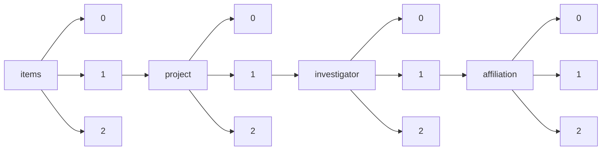

!!! warning "This document is not official Crossref documentation"
# Elements
PATH = items/array/project/array/investigator/array/affiliation/array(1)  
Occurs 20 492 times  
{ .annotate }

1. A route to an element, for example:  
   The route "items/array/project/array/investigator/array/affiliation/array" corresponds to navigating through the JSON indices as  
   ["items"][0]["project"][0]["investigator"][0]["affiliation"][0]  

## Country
See more information: [items/array/project/array/investigator/array/affiliation/array/country](country/index.md)  
Occurs 16 484 timess  
Unique values: 91  

| **Row** | **Value** `String` | **Count** `Int64` |
|--------:|----------------------:|---------------------:|
| **1**   | GB                    | 14 154               |
| **2**   | US                    | 798                  |
| **3**   | IE                    | 229                  |
| **4**   | AU                    | 195                  |
| **5**   | ZA                    | 139                  |
| **6**   | KE                    | 133                  |
| **7**   | IN                    | 96                   |
| **8**   | CH                    | 40                   |
| **9**   | TZ                    | 38                   |
| **10**  | CA                    | 34                   |
| ... | ... | ... |

## Id
See more information: [items/array/project/array/investigator/array/affiliation/array/id](id/index.md)  
Occurs 19 596 timess  

| **Row** | **Length** `Any` | **Count** `Int64` |
|--------:|--------------------:|---------------------:|
| **1**   | 1                   | 19 596               |

## Name
See more information: [items/array/project/array/investigator/array/affiliation/array/name](name/index.md)  
Occurs 20 492 timess  
Unique values: > 999  

!!! note "Due to current limitations, only the first 1,000 unique values are counted."

| **Row** | **Value** `String`                        | **Count** `Int64` |
|--------:|---------------------------------------------:|---------------------:|
| **1**   | University of Oxford                         | 1 728                |
| **2**   | University College London                    | 1 362                |
| **3**   | University of Cambridge                      | 1 341                |
| **4**   | Imperial College London                      | 915                  |
| **5**   | University of Edinburgh                      | 777                  |
| **6**   | King's College London                        | 634                  |
| **7**   | University of Manchester                     | 545                  |
| **8**   | University of Bristol                        | 494                  |
| **9**   | University of Glasgow                        | 416                  |
| **10**  | London School of Hygiene & Tropical Medicine | 411                  |
| ... | ... | ... |

