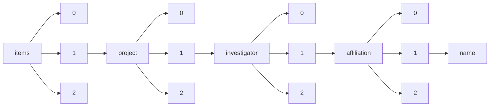

!!! warning "This document is not official Crossref documentation"
# Name
PATH = items/array/project/array/investigator/array/affiliation/array/name(1)  
Occurs 20 492 times  
Unique values: > 999  
{ .annotate }

1. A route to an element, for example:  
   The route "items/array/project/array/investigator/array/affiliation/array/name" corresponds to navigating through the JSON indices as  
   ["items"][0]["project"][0]["investigator"][0]["affiliation"][0]["name"]  

!!! note "Due to current limitations, only the first 1,000 unique values are counted."

| **Row** | **Value** `String`                                                                                | **Count** `Int64` |
|--------:|-----------------------------------------------------------------------------------------------------:|---------------------:|
| **1**   | University of Oxford                                                                                 | 1 728                |
| **2**   | University College London                                                                            | 1 362                |
| **3**   | University of Cambridge                                                                              | 1 341                |
| **4**   | Imperial College London                                                                              | 915                  |
| **5**   | University of Edinburgh                                                                              | 777                  |
| **6**   | King's College London                                                                                | 634                  |
| **7**   | University of Manchester                                                                             | 545                  |
| **8**   | University of Bristol                                                                                | 494                  |
| **9**   | University of Glasgow                                                                                | 416                  |
| **10**  | London School of Hygiene & Tropical Medicine                                                         | 411                  |
| **11**  | University of Liverpool                                                                              | 331                  |
| **12**  | University of Dundee                                                                                 | 330                  |
| **13**  | University of Leeds                                                                                  | 310                  |
| **14**  | Newcastle University                                                                                 | 309                  |
| **15**  | Pacific Northwest National Laboratory                                                                | 281                  |
| **16**  | University of Birmingham                                                                             | 271                  |
| **17**  | Cardiff University                                                                                   | 255                  |
| **18**  | University of Sheffield                                                                              | 204                  |
| **19**  | University of Nottingham                                                                             | 175                  |
| **20**  | University of Warwick                                                                                | 173                  |
| **21**  | Queen Mary University of London                                                                      | 171                  |
| **22**  | University of York                                                                                   | 162                  |
| **23**  | University of Leicester                                                                              | 158                  |
| **24**  | Liverpool School of Tropical Medicine                                                                | 144                  |
| **25**  | University of Exeter                                                                                 | 140                  |
| **26**  | University of Southampton                                                                            | 126                  |
| **27**  | University of Aberdeen                                                                               | 117                  |
| **28**  | Environmental Molecular Sciences Laboratory                                                          | 115                  |
| **29**  | The Regents of the University of California, Los Angeles                                             | 108                  |
| **30**  | St George's University of London                                                                     | 101                  |
| **31**  | Yale University                                                                                      | 95                   |
| **32**  | Birkbeck University of London                                                                        | 86                   |
| **33**  | Institute of Cancer Research                                                                         | 84                   |
| **34**  | University of Sussex                                                                                 | 84                   |
| **35**  | Massachusetts General Hospital (Mass General)                                                        | 83                   |
| **36**  | University College Dublin                                                                            | 78                   |
| **37**  | Medical Research Council                                                                             | 77                   |
| **38**  | Wellcome Trust Sanger Institute                                                                      | 74                   |
| **39**  | Kemri-Wellcome Trust Research Programme                                                              | 68                   |
| **40**  | University of St Andrews                                                                             | 67                   |
| **41**  | Queen's University Belfast                                                                           | 67                   |
| **42**  | University of Durham                                                                                 | 66                   |
| **43**  | University of Cape Town                                                                              | 65                   |
| **44**  | University of Bath                                                                                   | 60                   |
| **45**  | Dana-Farber Cancer Institute                                                                         | 60                   |
| **46**  | Johns Hopkins University School of Medicine                                                          | 60                   |
| **47**  | University of Pittsburgh                                                                             | 59                   |
| **48**  | European Bioinformatics Institute                                                                    | 59                   |
| **49**  | The Ohio State University                                                                            | 57                   |
| **50**  | University of Strathclyde                                                                            | 57                   |
| **51**  | Royal Veterinary College                                                                             | 55                   |
| **52**  | The Trustees of the University of Pennsylvania                                                       | 53                   |
| **53**  | Baylor College of Medicine                                                                           | 52                   |
| **54**  | Trinity College Dublin                                                                               | 52                   |
| **55**  | The Board of Trustees of the Leland Stanford Junior University                                       | 51                   |
| **56**  | University of East Anglia                                                                            | 51                   |
| **57**  | Oxford Brookes University                                                                            | 49                   |
| **58**  | The Regents of the University of Michigan                                                            | 48                   |
| **59**  | The Board of Trustees of the University of Illinois - University of Illinois at Chicago              | 45                   |
| **60**  | University of Melbourne                                                                              | 44                   |
| **61**  | University of Florida                                                                                | 44                   |
| **62**  | The Regents of the University of California (Irvine)                                                 | 43                   |
| **63**  | Emory University                                                                                     | 43                   |
| **64**  | Keele University                                                                                     | 41                   |
| **65**  | Regents of the University of Minnesota - Twin Cities                                                 | 40                   |
| **66**  | University of Kent                                                                                   | 39                   |
| **67**  | The Trustees of Columbia University in the City of New York                                          | 37                   |
| **68**  | University of Colorado Denver, AMC and DC                                                            | 36                   |
| **69**  | London School of Economics and Political Science (LSE)                                               | 35                   |
| **70**  | University of Rochester                                                                              | 35                   |
| **71**  | Washington University in St.Louis                                                                    | 35                   |
| **72**  | The Francis Crick Institute                                                                          | 35                   |
| **73**  | H. Lee Moffitt Cancer Center & Research Institute, Inc                                               | 34                   |
| **74**  | Boston Children's Hospital                                                                           | 33                   |
| **75**  | University of Alabama at Birmingham                                                                  | 33                   |
| **76**  | Oregon Health & Science University - OHSU                                                            | 33                   |
| **77**  | Lancaster University                                                                                 | 33                   |
| **78**  | University of Texas Health Science Center at San Antonio (UT Health San Antonio)                     | 33                   |
| **79**  | Weill Medical College of Cornell University                                                          | 32                   |
| **80**  | University College Cork                                                                              | 31                   |
| **81**  | University of Reading                                                                                | 31                   |
| **82**  | University of Essex                                                                                  | 31                   |
| **83**  | Misc England                                                                                         | 31                   |
| **84**  | National University of Ireland Galway                                                                | 30                   |
| **85**  | The University of North Carolina at Chapel Hill                                                      | 30                   |
| **86**  | The University of Utah                                                                               | 30                   |
| **87**  | University of Southern California  (USC)                                                             | 30                   |
| **88**  | The University of Texas Southwestern Medical Center (UT Southwestern)                                | 30                   |
| **89**  | Icahn School of Medicine at Mount Sinai                                                              | 29                   |
| **90**  | University of Washington                                                                             | 29                   |
| **91**  | Virginia Commonwealth University                                                                     | 29                   |
| **92**  | Columbia University Medical Center                                                                   | 28                   |
| **93**  | University of Texas M.D. Anderson Cancer Center                                                      | 28                   |
| **94**  | Kenya Medical Research Institute (KEMRI)                                                             | 28                   |
| **95**  | Babraham Institute                                                                                   | 28                   |
| **96**  | MRC Laboratory of Molecular Biology                                                                  | 25                   |
| **97**  | Monash University                                                                                    | 25                   |
| **98**  | Brigham and Women's Hospital, Inc.                                                                   | 25                   |
| **99**  | The Regents of the University of California, San Diego                                               | 24                   |
| **100** | University of Surrey                                                                                 | 24                   |
| **101** | School of Pharmacy, University of London                                                             | 23                   |
| **102** | University of Massachusetts Chan Medical School                                                      | 23                   |
| **103** | The Regents of the University of California, San Francisco                                           | 23                   |
| **104** | The Regents of the University of California (University of California Davis)                         | 21                   |
| **105** | St. Jude Children's Research Hospital, Inc.                                                          | 21                   |
| **106** | University of the Witwatersrand                                                                      | 21                   |
| **107** | Fred Hutchinson Cancer Center                                                                        | 20                   |
| **108** | Harvard University                                                                                   | 20                   |
| **109** | Glasgow Caledonian University                                                                        | 20                   |
| **110** | Thomas Jefferson University                                                                          | 20                   |
| **111** | Indiana University                                                                                   | 20                   |
| **112** | Mrc National Institute For Medical Research                                                          | 19                   |
| **113** | Arizona Board of Regents, University of Arizona                                                      | 19                   |
| **114** | University of KwaZulu Natal                                                                          | 19                   |
| **115** | University of Portsmouth                                                                             | 19                   |
| **116** | The Regents of the University of California, Berkeley                                                | 19                   |
| **117** | Aston University                                                                                     | 19                   |
| **118** | Ifakara Health Institute                                                                             | 19                   |
| **119** | Goldsmiths, University Of London                                                                     | 19                   |
| **120** | University of Miami                                                                                  | 19                   |
| **121** | The Regents of the University of California, San Francisco (Contracts & Grants)                      | 19                   |
| **122** | Royal Holloway, University of London                                                                 | 18                   |
| **123** | Miller School of Medicine of the University of Miami                                                 | 18                   |
| **124** | University of Ottawa                                                                                 | 18                   |
| **125** | Brunel University                                                                                    | 18                   |
| **126** | University of Auckland                                                                               | 18                   |
| **127** | Ulster University                                                                                    | 17                   |
| **128** | University of Plymouth                                                                               | 17                   |
| **129** | Open University (Milton Keynes)                                                                      | 17                   |
| **130** | University of British Columbia                                                                       | 17                   |
| **131** | ROYAL COLLEGE OF SURGEONS IN IRELAND                                                                 | 17                   |
| **132** | Columbia University                                                                                  | 17                   |
| **133** | University of Stirling                                                                               | 17                   |
| **134** | Swansea University                                                                                   | 17                   |
| **135** | Children's Hospital Medical Center                                                                   | 17                   |
| **136** | Sloan Kettering Institute for Cancer Research                                                        | 17                   |
| **137** | Children's Research Institute (CNMC)                                                                 | 17                   |
| **138** | Vanderbilt University                                                                                | 16                   |
| **139** | Johns Hopkins University                                                                             | 16                   |
| **140** | Vanderbilt University Medical Center (VUMC)                                                          | 16                   |
| **141** | University of Bradford                                                                               | 16                   |
| **142** | The Scripps Research Institute                                                                       | 16                   |
| **143** | Natural History Museum                                                                               | 16                   |
| **144** | Sanford Burnham Prebys Medical Discovery Institute                                                   | 16                   |
| **145** | The University of Chicago                                                                            | 16                   |
| **146** | Morehouse School of Medicine, Inc                                                                    | 15                   |
| **147** | Bangor University                                                                                    | 15                   |
| **148** | University of Maryland, Baltimore                                                                    | 15                   |
| **149** | Trustees of Boston University                                                                        | 15                   |
| **150** | Cleveland Clinic Foundation                                                                          | 15                   |
| **151** | The Salk Institute for Biological Studies                                                            | 15                   |
| **152** | The Howard University Inc.                                                                           | 15                   |
| **153** | City, University of London                                                                           | 15                   |
| **154** | University of Westminster                                                                            | 14                   |
| **155** | University of Hull                                                                                   | 14                   |
| **156** | Children's National Medical Center and Children's Research Institute                                 | 14                   |
| **157** | Massachusetts Institute of Technology                                                                | 14                   |
| **158** | The Research Institute at Nationwide Children's Hospital                                             | 14                   |
| **159** | No Organisation                                                                                      | 14                   |
| **160** | University of the West of England                                                                    | 14                   |
| **161** | The Hospital for Sick Children                                                                       | 13                   |
| **162** | Mahidol University                                                                                   | 13                   |
| **163** | Board of Regents of the University of Nebraska University of Nebraska Medical Center                 | 13                   |
| **164** | University of Arkansas for Medical Sciences                                                          | 13                   |
| **165** | VIBvzw                                                                                               | 13                   |
| **166** | University of Kansas Medical Center Research Institute, Inc.                                         | 13                   |
| **167** | Duke University School of Medicine                                                                   | 13                   |
| **168** | The University of Iowa                                                                               | 13                   |
| **169** | Washington State University                                                                          | 13                   |
| **170** | Diamond Light Source Ltd                                                                             | 13                   |
| **171** | Ottawa Hospital Research Institute                                                                   | 12                   |
| **172** | Duke University                                                                                      | 12                   |
| **173** | The Royal Institution for the Advancement of Learning/McGill University                              | 12                   |
| **174** | Indian Institute of Science                                                                          | 12                   |
| **175** | University of Stellenbosch                                                                           | 12                   |
| **176** | Northwestern University - Chicago Campus                                                             | 12                   |
| **177** | Stanford University School of Medicine                                                               | 12                   |
| **178** | Temple University – Of The Commonwealth System of Higher Education                                   | 12                   |
| **179** | Australian National University                                                                       | 12                   |
| **180** | University of California, San Francisco                                                              | 12                   |
| **181** | Brown University                                                                                     | 12                   |
| **182** | University of Malawi                                                                                 | 12                   |
| **183** | University of Kentucky Research Foundation                                                           | 12                   |
| **184** | Whitehead Institute for Biomedical Research                                                          | 12                   |
| **185** | University of Lincoln                                                                                | 12                   |
| **186** | San Raffaele Hospital (Ospedale San Raffaele)                                                        | 12                   |
| **187** | Johns Hopkins University, School of Medicine                                                         | 12                   |
| **188** | Ludwig Instituite for Cancer Research                                                                | 11                   |
| **189** | Universidad Peruana Cayetano Heredia                                                                 | 11                   |
| **190** | The Aga Khan University                                                                              | 11                   |
| **191** | New York University School of Medicine                                                               | 11                   |
| **192** | Loughborough University                                                                              | 11                   |
| **193** | Stanford University                                                                                  | 11                   |
| **194** | The Pennsylvania State University College of Medicine                                                | 11                   |
| **195** | Johns Hopkins University JHURA                                                                       | 11                   |
| **196** | University of California, Berkeley                                                                   | 11                   |
| **197** | New York University Grossman School of Medicine                                                      | 11                   |
| **198** | Indiana University (all campuses)                                                                    | 10                   |
| **199** | University of Queensland                                                                             | 10                   |
| **200** | University of Exeter Medical School                                                                  | 10                   |
| **201** | Perelman School of Medicine, University of Pennsylvania                                              | 10                   |
| **202** | The Cyprus Foundation for Muscular Dystrophy Research                                                | 10                   |
| **203** | MRC Centre                                                                                           | 10                   |
| **204** | University of Louisville Research Foundation, Inc.                                                   | 10                   |
| **205** | Walter and Eliza Hall Institute of Medical Research                                                  | 10                   |
| **206** | UT Southwestern Medical Center                                                                       | 10                   |
| **207** | Fundació Institut d’Investigació en Ciències de la Salut Germans Trias i Pujol                       | 10                   |
| **208** | University of Hertfordshire                                                                          | 9                    |
| **209** | Public Health England (PHE)                                                                          | 9                    |
| **210** | Cancer Research UK                                                                                   | 9                    |
| **211** | The Board of Trustees of the University of Illinois Urbana-Champaign                                 | 9                    |
| **212** | Wayne State University                                                                               | 9                    |
| **213** | Board of Regents, NSHE, obo University of Nevada, Reno                                               | 9                    |
| **214** | Columbia University in the City of New York                                                          | 9                    |
| **215** | The Pirbright Institute                                                                              | 9                    |
| **216** | The Children's Hospital of Philadelphia                                                              | 9                    |
| **217** | World Health Organization, Switzerland                                                               | 9                    |
| **218** | University of Brighton                                                                               | 9                    |
| **219** | Cambridge Institute for Medical Research                                                             | 9                    |
| **220** | The University of Sydney                                                                             | 9                    |
| **221** | University of California                                                                             | 9                    |
| **222** | University of Oregon                                                                                 | 9                    |
| **223** | University of Hong Kong                                                                              | 9                    |
| **224** | Medical Research Council Unit, The Gambia                                                            | 9                    |
| **225** | The University of Texas at Austin                                                                    | 9                    |
| **226** | Children's National Medical Center (WDC)                                                             | 9                    |
| **227** | Georgetown University                                                                                | 9                    |
| **228** | Fred Hutchinson Cancer Research Center                                                               | 9                    |
| **229** | Institut Pasteur                                                                                     | 9                    |
| **230** | Oswaldo Cruz Foundation                                                                              | 9                    |
| **231** | University of Sydney                                                                                 | 8                    |
| **232** | University of Colorado Anschutz Medical Campus                                                       | 8                    |
| **233** | International Centre for Diarrhoeal Disease Research, Bangladesh                                     | 8                    |
| **234** | Mayo Clinic Jacksonville                                                                             | 8                    |
| **235** | University of Salford                                                                                | 8                    |
| **236** | Institute of Experimental Medicine                                                                   | 8                    |
| **237** | University of Virginia                                                                               | 8                    |
| **238** | Wright State University                                                                              | 8                    |
| **239** | Peninsula College of Medicine & Dentistry                                                            | 8                    |
| **240** | Quadram Institute Bioscience                                                                         | 8                    |
| **241** | University of Ghana                                                                                  | 8                    |
| **242** | Makerere University                                                                                  | 8                    |
| **243** | Hungarian Academy of Sciences                                                                        | 8                    |
| **244** | Board of Regents of the University of Oklahoma, Health Sciences Center                               | 8                    |
| **245** | University of Wisconsin-Madison (Board of Regents University of Wisconsin System)                    | 8                    |
| **246** | Johns Hopkins University - Krieger School of Arts & Sciences                                         | 8                    |
| **247** | Center for Cancer Research, NCI, NIH                                                                 | 8                    |
| **248** | Marine Biological Laboratory                                                                         | 8                    |
| **249** | University of Ibadan                                                                                 | 8                    |
| **250** | Heriot-Watt University                                                                               | 8                    |
| **251** | University of Melbourne (Melbourne University)                                                       | 8                    |
| **252** | University of Illinois at Chicago                                                                    | 8                    |
| **253** | Indian Institute of Technology Delhi                                                                 | 8                    |
| **254** | The Arizona Board of Regents for and on behalf of Northern Arizona University                        | 8                    |
| **255** | International Centre of Insect Physiology and Ecology                                                | 8                    |
| **256** | Memorial Sloan-Kettering Cancer Center                                                               | 8                    |
| **257** | University of Copenhagen                                                                             | 7                    |
| **258** | Uganda Virus Research Institute                                                                      | 7                    |
| **259** | Nottingham Trent University                                                                          | 7                    |
| **260** | Health Protection Agency                                                                             | 7                    |
| **261** | John Innes Centre                                                                                    | 7                    |
| **262** | Sage Bionetworks                                                                                     | 7                    |
| **263** | African Academy of Sciences                                                                          | 7                    |
| **264** | The University of North Carolina at Chapel Hill, Chapel Hill, NC                                     | 7                    |
| **265** | Massachusetts Institute of Technology - MIT                                                          | 7                    |
| **266** | University of Maryland                                                                               | 7                    |
| **267** | University of Limerick                                                                               | 7                    |
| **268** | Rutgers, The State University of New Jersey                                                          | 7                    |
| **269** | The Medical College of Wisconsin, Inc.                                                               | 7                    |
| **270** | Anglia Ruskin University                                                                             | 7                    |
| **271** | CA - 166/205 - Stanford University                                                                   | 7                    |
| **272** | National Centre for Biological Sciences, India                                                       | 7                    |
| **273** | Universidade Federal De Pelotas                                                                      | 7                    |
| **274** | University of Mississippi                                                                            | 7                    |
| **275** | Roehampton University                                                                                | 7                    |
| **276** | Université du Québec à Chicoutimi                                                                    | 7                    |
| **277** | Weizmann Institute of Science                                                                        | 7                    |
| **278** | University of New South Wales                                                                        | 7                    |
| **279** | Mitochondria in Motion, Inc.                                                                         | 7                    |
| **280** | University of London                                                                                 | 7                    |
| **281** | University of Tartu                                                                                  | 7                    |
| **282** | Saint Alphonsus Regional Medical Center Research Institute                                           | 7                    |
| **283** | The Rector and Visitors of the University of Virginia                                                | 7                    |
| **284** | International Centre for Diarrhoeal Disease Research                                                 | 7                    |
| **285** | FL - 109/109 - University of Florida                                                                 | 7                    |
| **286** | Misc Australia                                                                                       | 7                    |
| **287** | Paris-Est Créteil University (Université Paris-Est Créteil Val-de-Marne, Université Paris XII-Val-de | 7                    |
| **288** | Public Health Foundation of India                                                                    | 7                    |
| **289** | Queensland Institute of Medical Research                                                             | 7                    |
| **290** | University of Central Lancashire                                                                     | 7                    |
| **291** | KATHOLIEKE UNIVERSITEIT LEUVEN                                                                       | 7                    |
| **292** | University Of Washington                                                                             | 7                    |
| **293** | Yale University School of Medicine                                                                   | 7                    |
| **294** | Manchester Metropolitan University                                                                   | 7                    |
| **295** | University of California, Davis                                                                      | 7                    |
| **296** | University of Minesota                                                                               | 7                    |
| **297** | AL - 32/250 - University of Alabama at Birmingham                                                    | 6                    |
| **298** | Beckman Research Institute of the City of Hope                                                       | 6                    |
| **299** | Human Sciences Research Council, South Africa                                                        | 6                    |
| **300** | National University of Singapore                                                                     | 6                    |
| **301** | The Research Foundation of SUNY- SUNY at Stony Brook                                                 | 6                    |
| **302** | Royal Melbourne Hospital                                                                             | 6                    |
| **303** | McMaster University, Faculty of Health Sciences                                                      | 6                    |
| **304** | The Curators of the University of Missouri                                                           | 6                    |
| **305** | The University of Texas Health Science Center at Houston                                             | 6                    |
| **306** | Indepth Network                                                                                      | 6                    |
| **307** | Van Andel Research Institute                                                                         | 6                    |
| **308** | Auburn University                                                                                    | 6                    |
| **309** | University Health Network                                                                            | 6                    |
| **310** | Case Western Reserve University                                                                      | 6                    |
| **311** | Harvard Medical School                                                                               | 6                    |
| **312** | Charles R. Drew University of Medicine and Science                                                   | 6                    |
| **313** | African Population & Health Research Centre, Kenya                                                   | 6                    |
| **314** | Dublin City University                                                                               | 6                    |
| **315** | Kwame Nkrumah University of Science and Technology                                                   | 6                    |
| **316** | Wake Forest University Health Sciences                                                               | 6                    |
| **317** | Lawrence Livermore National Laboratory                                                               | 6                    |
| **318** | Aberystwyth University                                                                               | 6                    |
| **319** | Trustees of Dartmouth College                                                                        | 6                    |
| **320** | HudsonAlpha Institute for Biotechnology                                                              | 6                    |
| **321** | Clemson University                                                                                   | 6                    |
| **322** | University of Newcastle, Australia                                                                   | 6                    |
| **323** | Health Research Incorporated, Roswell Park Cancer Institute Division                                 | 6                    |
| **324** | Peter MacCallum Cancer Institute                                                                     | 6                    |
| **325** | Broad Institute (Eli and Edythe L. Broad Institute of MIT and Harvard )                              | 6                    |
| **326** | University of Toronto                                                                                | 6                    |
| **327** | Howard Hughes Medical Institute                                                                      | 6                    |
| **328** | Novartis Institute For Tropical Diseases                                                             | 6                    |
| **329** | Mahidol Oxford Tropical Medicine Research Unit                                                       | 6                    |
| **330** | University of East London                                                                            | 6                    |
| **331** | Boston University                                                                                    | 6                    |
| **332** | Université de Sherbrooke                                                                             | 6                    |
| **333** | De Montfort University                                                                               | 6                    |
| **334** | Institute of Tropical Medicine (ITM)                                                                 | 6                    |
| **335** | Morgridge Institute for Research, Inc                                                                | 6                    |
| **336** | Misc France                                                                                          | 6                    |
| **337** | European Molecular Biology Laboratory                                                                | 5                    |
| **338** | Institut Pasteur de Dakar                                                                            | 5                    |
| **339** | ABRASCO                                                                                              | 5                    |
| **340** | University of the West Indies, Trinidad and Tobago                                                   | 5                    |
| **341** | Misc United States                                                                                   | 5                    |
| **342** | Northwestern University Feinberg School of Medicine                                                  | 5                    |
| **343** | University of Huddersfield                                                                           | 5                    |
| **344** | University of Amsterdam                                                                              | 5                    |
| **345** | McGill University                                                                                    | 5                    |
| **346** | American University of Beirut                                                                        | 5                    |
| **347** | University of Leiden                                                                                 | 5                    |
| **348** | Research Foundation of CUNY on behalf of Brooklyn College                                            | 5                    |
| **349** | Univeristy of Washington                                                                             | 5                    |
| **350** | International Livestock Research Institute, Kenya                                                    | 5                    |
| **351** | Bournemouth University                                                                               | 5                    |
| **352** | The University of Saskatchewan                                                                       | 5                    |
| **353** | Henry Ford Health System                                                                             | 5                    |
| **354** | No Institution Available                                                                             | 5                    |
| **355** | University of Michigan                                                                               | 5                    |
| **356** | Radboud University Nijmegen Medical Centre                                                           | 5                    |
| **357** | California Institute of Technology                                                                   | 5                    |
| **358** | UK Biobank Ltd                                                                                       | 5                    |
| **359** | Massachusetts General Hospital                                                                       | 5                    |
| **360** | The Hospital for Special Surgery                                                                     | 5                    |
| **361** | Misc South Africa                                                                                    | 5                    |
| **362** | Washington University, School of Medicine                                                            | 5                    |
| **363** | Seattle Children's Hospital                                                                          | 5                    |
| **364** | Scripps Research Institute                                                                           | 5                    |
| **365** | Semmelweis University                                                                                | 5                    |
| **366** | NEW YORK UNIVERSITY                                                                                  | 5                    |
| **367** | University of California, Los Angeles                                                                | 5                    |
| **368** | Maynooth University                                                                                  | 5                    |
| **369** | NYU Langone Health                                                                                   | 5                    |
| **370** | Princeton University                                                                                 | 5                    |
| **371** | Drugs for Neglected Diseases Initiative                                                              | 5                    |
| **372** | Tata Institute of Fundamental Research, Mumbai                                                       | 5                    |
| **373** | International Centre for Genetic Engineering & Biotechnology                                         | 5                    |
| **374** | Illinois Institute of Technology                                                                     | 5                    |
| **375** | Victoria University                                                                                  | 5                    |
| **376** | University of Alberta                                                                                | 5                    |
| **377** | University of New Mexico HSC                                                                         | 5                    |
| **378** | Northumbria University                                                                               | 5                    |
| **379** | Guy's & St Thomas' Hospital Trust                                                                    | 5                    |
| **380** | University of Colorado Boulder                                                                       | 4                    |
| **381** | Université de Montréal                                                                               | 4                    |
| **382** | Radboud University Medical Centre                                                                    | 4                    |
| **383** | Rutgers, The State University of New Jersey-RBHS-NJMS                                                | 4                    |
| **384** | The Jackson Laboratory                                                                               | 4                    |
| **385** | Appalachian State University                                                                         | 4                    |
| **386** | Laval University (Université Laval, Québec)                                                          | 4                    |
| **387** | The Research Institute of Fox Chase Cancer Center                                                    | 4                    |
| **388** | Ohio State University                                                                                | 4                    |
| **389** | University of Maryland-College Park                                                                  | 4                    |
| **390** | Centre for Integrative Biology - University of Trento                                                | 4                    |
| **391** | University Of North Carolina At Chapel Hill                                                          | 4                    |
| **392** | Jagiellonian university                                                                              | 4                    |
| **393** | QurAlis Corporation                                                                                  | 4                    |
| **394** | University of Otago                                                                                  | 4                    |
| **395** | Addis Ababa University                                                                               | 4                    |
| **396** | Hospital For Tropical Diseases                                                                       | 4                    |
| **397** | London Research Institute                                                                            | 4                    |
| **398** | Institut Pasteur Cambodia                                                                            | 4                    |
| **399** | University Of Northampton                                                                            | 4                    |
| **400** | Academy of Science of the Czech Republic                                                             | 4                    |
| **401** | Biomedical Neuroscience Institute                                                                    | 4                    |
| **402** | University of Geneva                                                                                 | 4                    |
| **403** | Brigham and Women's Hospital , Inc                                                                   | 4                    |
| **404** | Michigan State University                                                                            | 4                    |
| **405** | Southern Methodist University                                                                        | 4                    |
| **406** | University Of Winchester                                                                             | 4                    |
| **407** | University of Trento                                                                                 | 4                    |
| **408** | University of Padua (Università degli Studi di Padova)                                               | 4                    |
| **409** | University of California, San Diego - Health Sciences                                                | 4                    |
| **410** | The Trustees of Stevens Institute of Technology, Inc.                                                | 4                    |
| **411** | Universidad del Valle de Guatemala                                                                   | 4                    |
| **412** | Lawrence Berkeley National Laboratory                                                                | 4                    |
| **413** | University of Western Australia                                                                      | 4                    |
| **414** | Institute of Neurology, University College London                                                    | 4                    |
| **415** | University of Arizona                                                                                | 4                    |
| **416** | New York University                                                                                  | 4                    |
| **417** | M.A. SANTE                                                                                           | 4                    |
| **418** | The George Washington University                                                                     | 4                    |
| **419** | Washington State University Tri-Cities                                                               | 4                    |
| **420** | Queen's University at Kingston                                                                       | 4                    |
| **421** | Children's Hospital of Eastern Ontario Research Institute Inc                                        | 4                    |
| **422** | Meharry Medical College                                                                              | 4                    |
| **423** | University of Texas Medical Branch                                                                   | 4                    |
| **424** | Sheffield Hallam University                                                                          | 4                    |
| **425** | Kew Royal Botanic Gardens                                                                            | 4                    |
| **426** | National Institute for Biological Standards and Control                                              | 4                    |
| **427** | Misc Ireland                                                                                         | 4                    |
| **428** | Christian Medical College, India                                                                     | 4                    |
| **429** | Purdue University                                                                                    | 4                    |
| **430** | Misc New Zealand                                                                                     | 4                    |
| **431** | Tufts Medical Center                                                                                 | 4                    |
| **432** | Brighton and Sussex Medical School                                                                   | 4                    |
| **433** | McMaster University                                                                                  | 4                    |
| **434** | University of Gothenburg                                                                             | 4                    |
| **435** | University of Queensland (UQ)                                                                        | 4                    |
| **436** | FL - 143/275 - University of Miami                                                                   | 4                    |
| **437** | Drexel University                                                                                    | 4                    |
| **438** | Fondazione per la Ricerca Biomedica Avanzata Onlus - Venetian Institute of Molecular Medicine        | 4                    |
| **439** | Sloan-Kettering Institute for Cancer Research                                                        | 4                    |
| **440** | Brandeis University                                                                                  | 4                    |
| **441** | University of California, San Francisco ( Reagents UCSF Contracts and Grants)                        | 4                    |
| **442** | Misc Greater London                                                                                  | 4                    |
| **443** | Helmholtz Zentrum München                                                                            | 4                    |
| **444** | The Ohio State University College of Medicine                                                        | 4                    |
| **445** | Centre for infectious disease research in Zambia                                                     | 4                    |
| **446** | Liverpool John Moores University                                                                     | 4                    |
| **447** | William Marsh Rice University                                                                        | 4                    |
| **448** | Institut Pasteur de Madagascar                                                                       | 4                    |
| **449** | Baylor College Of Medicine                                                                           | 4                    |
| **450** | MAYO CLINIC, ROCHESTER, MN                                                                           | 4                    |
| **451** | Middlesex University                                                                                 | 3                    |
| **452** | Centre de Recherche du Centre hospitalier de l'Universite de Montreal                                | 3                    |
| **453** | Centre for Cellular & Molecular Biology, India                                                       | 3                    |
| **454** | Radboud Universiteit Nijmegen                                                                        | 3                    |
| **455** | Veterinary Laboratories Agency                                                                       | 3                    |
| **456** | Universidad San Francisco de Quito                                                                   | 3                    |
| **457** | The Rockefeller University                                                                           | 3                    |
| **458** | Target ALS Foundation                                                                                | 3                    |
| **459** | University of Minnesota                                                                              | 3                    |
| **460** | Deakin University                                                                                    | 3                    |
| **461** | Massey University                                                                                    | 3                    |
| **462** | University Of Georgia                                                                                | 3                    |
| **463** | London South Bank University                                                                         | 3                    |
| **464** | University of Verona (Università degli Studi di Verona)                                              | 3                    |
| **465** | International AIDS Vaccine Initiative                                                                | 3                    |
| **466** | Murdoch Children's Research Institute                                                                | 3                    |
| **467** | Centre Suisse De Recherches Scientifiques - Cote D'ivoire                                            | 3                    |
| **468** | CA - 29/29 - The Regents of the University of California, San Francisco                              | 3                    |
| **469** | University of Colorado at Boulder                                                                    | 3                    |
| **470** | Victor Chang Cardiac Research Institute                                                              | 3                    |
| **471** | University of Szeged                                                                                 | 3                    |
| **472** | The Regents of the University of California, Santa Cruz                                              | 3                    |
| **473** | University Of Virginia                                                                               | 3                    |
| **474** | Bioversity International                                                                             | 3                    |
| **475** | David Geffen School of Medicne at UCLA                                                               | 3                    |
| **476** | University of Costa Rica                                                                             | 3                    |
| **477** | CT - 19/19 - Yale University School of Medicine                                                      | 3                    |
| **478** | University of North Carolina at Chapel Hill                                                          | 3                    |
| **479** | MyoGene Bio LLC                                                                                      | 3                    |
| **480** | Memorial Sloan Kettering Cancer Center (MSK)                                                         | 3                    |
| **481** | ThinkSono Ltd                                                                                        | 3                    |
| **482** | Cambridge University Hospitals NHS Foundation Trust                                                  | 3                    |
| **483** | Peking University Health Science Center                                                              | 3                    |
| **484** | University of Botswana                                                                               | 3                    |
| **485** | University of Northumbria at Newcastle                                                               | 3                    |
| **486** | University of Zimbabwe                                                                               | 3                    |
| **487** | Cold Spring Harbor Laboratory                                                                        | 3                    |
| **488** | The Regents of the University of California, San Francisco (Contracts and Grants)                    | 3                    |
| **489** | Oregon State University                                                                              | 3                    |
| **490** | Kaiser Foundation Research Institute, a Division of Kaiser Foundation Hospitals                      | 3                    |
| **491** | Burnet Institute                                                                                     | 3                    |
| **492** | Florida International University                                                                     | 3                    |
| **493** | University of Wisconsin-Milwaukee                                                                    | 3                    |
| **494** | University of California, Irvine                                                                     | 3                    |
| **495** | Montana State University                                                                             | 3                    |
| **496** | Institute for Genomic Research                                                                       | 3                    |
| **497** | University of Heidelberg                                                                             | 3                    |
| **498** | York University (Canada)                                                                             | 3                    |
| **499** | Masarykova Univerzita                                                                                | 3                    |
| **500** | Center for Cancer Research, National Cancer Institute, NIH.                                          | 3                    |
| **501** | Argonne National Laboratory                                                                          | 3                    |
| **502** | University of California - San Diego                                                                 | 3                    |
| **503** | National Cancer Institute, Center for Cancer Research                                                | 3                    |
| **504** | President & Fellows of Harvard College                                                               | 3                    |
| **505** | University of Michigan–Ann Arbor                                                                     | 3                    |
| **506** | Tallinna Tehnikaulikool                                                                              | 3                    |
| **507** | Oxford University Clinical Research Unit – Nepal                                                     | 3                    |
| **508** | Royal Children's Hospital                                                                            | 3                    |
| **509** | University of Malaya                                                                                 | 3                    |
| **510** | The Methodist Hospital Research Institute                                                            | 3                    |
| **511** | Cedars-Sinai Medical Center                                                                          | 3                    |
| **512** | Natural Resources Defense Council, Inc.                                                              | 3                    |
| **513** | The Regents of the University of California (Davis)                                                  | 3                    |
| **514** | Foundation for the National Institutes of Health, Inc                                                | 3                    |
| **515** | International Institute Of Molecular & Cell Biology, Poland                                          | 3                    |
| **516** | Moredun Research Inst Edinburgh                                                                      | 3                    |
| **517** | University College London (UCL)                                                                      | 3                    |
| **518** | Texas Tech University Health Sciences Center at El Paso                                              | 3                    |
| **519** | Board of Trustees of the University of Illinois at Chicago                                           | 3                    |
| **520** | Malawi Liverpool Wellcome Trust Clinical Research Programme                                          | 3                    |
| **521** | Centro Internacional de Entrenamiento e Investigaciones Medicas                                      | 3                    |
| **522** | Yale University, School of Medicine                                                                  | 3                    |
| **523** | The University of California, Irvine                                                                 | 3                    |
| **524** | Academy of Medical Sciences                                                                          | 3                    |
| **525** | University of Basel (Universität Basel)                                                              | 3                    |
| **526** | Utrecht University                                                                                   | 3                    |
| **527** | Royal Papworth Hospital NHS Foundation Trust, Cambridge                                              | 3                    |
| **528** | Robert Gordon University                                                                             | 3                    |
| **529** | Anusandhan Trust                                                                                     | 3                    |
| **530** | Nova Southeastern University                                                                         | 3                    |
| **531** | University of Central Florida                                                                        | 3                    |
| **532** | Barts Health NHS Trust                                                                               | 3                    |
| **533** | Karolinska Institute                                                                                 | 3                    |
| **534** | University of the West Indies, Jamaica                                                               | 3                    |
| **535** | Mayo Clinic Arizona                                                                                  | 3                    |
| **536** | Vrije Universiteit Amsterdam                                                                         | 3                    |
| **537** | The Regents of the University of Colorado, Boulder, CO                                               | 3                    |
| **538** | University of Pennsylvania                                                                           | 3                    |
| **539** | QIMR Berghofer Medical Research Institute                                                            | 3                    |
| **540** | Joan & Sanford I. Weill Medical College of Cornell University                                        | 3                    |
| **541** | Origent Data Sciences, Inc.                                                                          | 3                    |
| **542** | Cure CMD                                                                                             | 3                    |
| **543** | President and Fellows of Harvard College, Harvard Medical School                                     | 3                    |
| **544** | Centre Hospitalier Universitaire Sainte-Justine                                                      | 3                    |
| **545** | Kaiser Permanente Southern California Permanente Medical Group                                       | 3                    |
| **546** | Institute of Genetics and Molecular and Cellular Biology (IGBMC/CERBM)                               | 3                    |
| **547** | Misc India                                                                                           | 3                    |
| **548** | Instituto De Medicina Tropical Pedro Kouri                                                           | 3                    |
| **549** | University of Nebraska–Lincoln                                                                       | 3                    |
| **550** | Carnegie Mellon University                                                                           | 3                    |
| **551** | National Institute for Communicable Diseases                                                         | 3                    |
| **552** | National Renewable Energy Laboratory                                                                 | 3                    |
| **553** | Y Touring Theatre Company                                                                            | 2                    |
| **554** | University of Zurich                                                                                 | 2                    |
| **555** | Louisiana State University A&M College (LSU)                                                         | 2                    |
| **556** | Hannover Medical School                                                                              | 2                    |
| **557** | University of Kentucky college of medicine                                                           | 2                    |
| **558** | Birmingham Children's Hospital                                                                       | 2                    |
| **559** | AR - 37/211 - University of Arkansas for Medical Sciences                                            | 2                    |
| **560** | Sokoine University of Agriculture                                                                    | 2                    |
| **561** | Canbex Therapeutics Ltd                                                                              | 2                    |
| **562** | St Vincent's Institute                                                                               | 2                    |
| **563** | Kaiser Foundation Research Institute                                                                 | 2                    |
| **564** | Thermofluidics Ltd.                                                                                  | 2                    |
| **565** | Institute of Education                                                                               | 2                    |
| **566** | Oxitec Limited                                                                                       | 2                    |
| **567** | All India Institute of Medical Sciences Bhopal                                                       | 2                    |
| **568** | University of Modena and Reggio Emilia (Università degli Studi di Modena e Reggio Emilia)            | 2                    |
| **569** | University of Texas Health Science Center at San Antonio                                             | 2                    |
| **570** | Charles University                                                                                   | 2                    |
| **571** | South African Institute for Medical Research                                                         | 2                    |
| **572** | University of North Carolina, Charlotte                                                              | 2                    |
| **573** | Summit Corporation Plc                                                                               | 2                    |
| **574** | The Pennsylvania State University                                                                    | 2                    |
| **575** | Roslin Institute                                                                                     | 2                    |
| **576** | National Institute of Neurological Disorders and Stroke, NIH NINDS                                   | 2                    |
| **577** | Warsaw University                                                                                    | 2                    |
| **578** | Cambridge Optromics Limited                                                                          | 2                    |
| **579** | Oxford University Hospitals NHS Foundation Trust                                                     | 2                    |
| **580** | Case Western Reserve University - School of Medicine                                                 | 2                    |
| **581** | Oxford University Clinical Research Unit                                                             | 2                    |
| **582** | Russian Academy of Medical Sciences                                                                  | 2                    |
| **583** | University of Pecs                                                                                   | 2                    |
| **584** | Misc Romania                                                                                         | 2                    |
| **585** | University of Pennsylvania, Perelman School of Medicine                                              | 2                    |
| **586** | Garvan Institute                                                                                     | 2                    |
| **587** | Columbia University in the City of New York, New York, NY                                            | 2                    |
| **588** | Rutgers New Jersey Medical School                                                                    | 2                    |
| **589** | Brigham & Women's Hospital                                                                           | 2                    |
| **590** | Fred Hutchinson Cancer Research Centre                                                               | 2                    |
| **591** | Achaogen Inc                                                                                         | 2                    |
| **592** | National Institutes of Health                                                                        | 2                    |
| **593** | Orthox Limited                                                                                       | 2                    |
| **594** | Rutgers, the State University                                                                        | 2                    |
| **595** | Centre National De La Recherche Scientifique (CNRS)                                                  | 2                    |
| **596** | Strathmore University                                                                                | 2                    |
| **597** | Kintampo Health Research Centre                                                                      | 2                    |
| **598** | Dundalk Institute of Technology                                                                      | 2                    |
| **599** | University of Nairobi                                                                                | 2                    |
| **600** | School District of Philadelphia                                                                      | 2                    |
| **601** | Texas A&M AgriLife Research                                                                          | 2                    |
| **602** | Weill Cornell Medical College                                                                        | 2                    |
| **603** | Nhs Lothian - Lothian University Hospitals Division                                                  | 2                    |
| **604** | Orygen                                                                                               | 2                    |
| **605** | Universidade de São Paulo                                                                            | 2                    |
| **606** | Gordon Research Conferences                                                                          | 2                    |
| **607** | NIOZ Royal Netherlands Institute for Sea Research                                                    | 2                    |
| **608** | Medecins Sans Frontieres                                                                             | 2                    |
| **609** | MicroPharm Limited                                                                                   | 2                    |
| **610** | Wageningen UR                                                                                        | 2                    |
| **611** | Universidad Nacional Autonoma de Mexico                                                              | 2                    |
| **612** | Locana                                                                                               | 2                    |
| **613** | University of the Highlands and Islands                                                              | 2                    |
| **614** | Wellcome Trust - OFFICE USE ONLY                                                                     | 2                    |
| **615** | University of Adelaide                                                                               | 2                    |
| **616** | European Neuro Muscular Centre                                                                       | 2                    |
| **617** | Translational Health Science and Technology Institute                                                | 2                    |
| **618** | Marie Curie Research Institute                                                                       | 2                    |
| **619** | Flinders University                                                                                  | 2                    |
| **620** | Sylvester Comprehensive Cancer Center/University of Miami Health Systems                             | 2                    |
| **621** | Institute of Development Studies                                                                     | 2                    |
| **622** | University of Tennessee at Knoxville                                                                 | 2                    |
| **623** | University of Namibia                                                                                | 2                    |
| **624** | Astrazeneca Pharmaceuticals (India)                                                                  | 2                    |
| **625** | Northwestern University                                                                              | 2                    |
| **626** | Alexander Fleming Biomedical Sciences Research Center                                                | 2                    |
| **627** | Sola Biosciences                                                                                     | 2                    |
| **628** | Mater Medical Research Institute                                                                     | 2                    |
| **629** | The RYR-1 Foundation                                                                                 | 2                    |
| **630** | Leiden University (Universiteit Leiden)                                                              | 2                    |
| **631** | University of Wolverhampton                                                                          | 2                    |
| **632** | Alliant International University                                                                     | 2                    |
| **633** | Children's National Health System                                                                    | 2                    |
| **634** | Northern Illinois University                                                                         | 2                    |
| **635** | UCL Institute of Child Health                                                                        | 2                    |
| **636** | Cranfield University                                                                                 | 2                    |
| **637** | IA - 191/191 - University of Iowa Hospital                                                           | 2                    |
| **638** | Dignity Health dba St. Joseph's Hospital & Medical Center, Phoenix, AZ                               | 2                    |
| **639** | International Union for the Scientific Study of Population                                           | 2                    |
| **640** | School Of Oriental & African Studies                                                                 | 2                    |
| **641** | University of Illinois, Champaign-Urbana                                                             | 2                    |
| **642** | Seattle Institute for Biomedical and Clinical Research                                               | 2                    |
| **643** | Perelman School of Medicine at The University of Pennsylvania                                        | 2                    |
| **644** | Cardiff Metropolitan University                                                                      | 2                    |
| **645** | Northwestern University - Evanston Campus                                                            | 2                    |
| **646** | University of Sunderland                                                                             | 2                    |
| **647** | Biotechnology and Biological Sciences Research Council (BBSRC)                                       | 2                    |
| **648** | VU University Medical Center Amsterdam                                                               | 2                    |
| **649** | Instituto Evandro Chagas                                                                             | 2                    |
| **650** | MRC/UVRI Uganda Research Unit on AIDS                                                                | 2                    |
| **651** | TERC                                                                                                 | 2                    |
| **652** | Federation of American Societies for Experimental Biology                                            | 2                    |
| **653** | Papua New Guinea Institute of Medical Research                                                       | 2                    |
| **654** | University of Neuchâtel                                                                              | 2                    |
| **655** | National Centre for Cell Science                                                                     | 2                    |
| **656** | Arizona Board of Regents for and on behalf of Arizona State University                               | 2                    |
| **657** | Texas Tech University Health Sciences Center El Paso Paul L. Foster School of Medicine               | 2                    |
| **658** | Johns Hopkins Bloomberg School of Public Health                                                      | 2                    |
| **659** | Instituto Nacional de Salud Publica                                                                  | 2                    |
| **660** | Mayo Clinic Arizona., Phoenix, AZ                                                                    | 2                    |
| **661** | President and Fellows of Harvard College, Harvard T. H. Chan School of Public Health                 | 2                    |
| **662** | Iowa State University of Science and Technology                                                      | 2                    |
| **663** | University of Colorado, Boulder                                                                      | 2                    |
| **664** | Wellcome Library                                                                                     | 2                    |
| **665** | Universty of Rochester                                                                               | 2                    |
| **666** | Milken Institute                                                                                     | 2                    |
| **667** | Muhimbili University Of Health And Allied Sciences                                                   | 2                    |
| **668** | The Board of Trustees of University of Illinois-Chicago                                              | 2                    |
| **669** | National Institute of Immunology, India                                                              | 2                    |
| **670** | Joint Genome Institute                                                                               | 2                    |
| **671** | Trustees of Tufts College                                                                            | 2                    |
| **672** | Ann Arbor Public Schools                                                                             | 2                    |
| **673** | Federal University of Pernambuco                                                                     | 2                    |
| **674** | Achilles Vaccines Srl                                                                                | 2                    |
| **675** | William Harvey Research Institute, Barts and the London                                              | 2                    |
| **676** | Paxvac Inc.                                                                                          | 2                    |
| **677** | Centre for Dna Fingerprinting & Diagnosis, India                                                     | 2                    |
| **678** | Cell Medica                                                                                          | 2                    |
| **679** | National Writing Project                                                                             | 2                    |
| **680** | Griffith University                                                                                  | 2                    |
| **681** | Eotvos Lorand University                                                                             | 2                    |
| **682** | National Brain Research Centre, India                                                                | 2                    |
| **683** | Nottingham University Hospitals NHS Trust                                                            | 2                    |
| **684** | Royal Institution of Great Britain                                                                   | 2                    |
| **685** | The General Hospital Corporation                                                                     | 2                    |
| **686** | Rare Partners                                                                                        | 2                    |
| **687** | Centre National de Recherche et de Formation sur le Paludisme                                        | 2                    |
| **688** | Natural Product Research and Infection Biology – Hans Knöll Institute                                | 2                    |
| **689** | Iowa State University                                                                                | 2                    |
| **690** | Indiana University - Purdue University Indianapolis                                                  | 2                    |
| **691** | Genomics Institute Of The Novartis Research Foundation                                               | 2                    |
| **692** | Ptc Therapeutics Inc                                                                                 | 2                    |
| **693** | University of Wisconsin-River Falls                                                                  | 2                    |
| **694** | Shriners Hospitals for Children - Canada                                                             | 2                    |
| **695** | American University in Cairo                                                                         | 2                    |
| **696** | South African Medical Research Council                                                               | 2                    |
| **697** | Medical University of South Carolina                                                                 | 2                    |
| **698** | California Institute for Biomedical Research                                                         | 2                    |
| **699** | Universidade Federal de Minas Gerais                                                                 | 2                    |
| **700** | Teesside University                                                                                  | 2                    |
| **701** | Diagnostics for the Real World Ltd                                                                   | 2                    |
| **702** | The Research Foundation of SUNY at Binghamton University                                             | 2                    |
| **703** | Children's Medical Research Institute                                                                | 2                    |
| **704** | The Royal Institution for the Advancement of Learning/McGill\n                University             | 2                    |
| **705** | University Of Lund                                                                                   | 2                    |
| **706** | Thackray Museum                                                                                      | 2                    |
| **707** | Haemostatix Ltd                                                                                      | 2                    |
| **708** | Nationwide Children's Hospital.                                                                      | 2                    |
| **709** | University of Iowa Carver College of Medicine                                                        | 2                    |
| **710** | The Weizmann Institute of Science                                                                    | 2                    |
| **711** | University of Amsterdam, Academic Medical Center                                                     | 2                    |
| **712** | OPPILOTECH LTD                                                                                       | 2                    |
| **713** | Jawaharlal Nehru University                                                                          | 2                    |
| **714** | University of Massachusetts Medical School                                                           | 2                    |
| **715** | Childrens Hospital Medical Center-Cincinnati                                                         | 2                    |
| **716** | University of Delaware                                                                               | 2                    |
| **717** | Johns Jopkins University                                                                             | 2                    |
| **718** | Misc Nigeria                                                                                         | 2                    |
| **719** | Temple University                                                                                    | 2                    |
| **720** | Novacta Biosystems Ltd                                                                               | 2                    |
| **721** | Nuffield Foundation                                                                                  | 2                    |
| **722** | GlaxoSmithKline I+D, S.L.                                                                            | 2                    |
| **723** | University of Connecticut Health Center                                                              | 2                    |
| **724** | Africa Health Research Institute                                                                     | 2                    |
| **725** | Animal Health Trust                                                                                  | 2                    |
| **726** | Aquilus Pharmaceuticals, Inc.                                                                        | 2                    |
| **727** | University of Maryland Baltimore Foundation                                                          | 2                    |
| **728** | Justus-Liebig-Universitat Giessen                                                                    | 2                    |
| **729** | GSK Vaccines Institute for Global Health                                                             | 2                    |
| **730** | Royal College of Surgeons of England                                                                 | 2                    |
| **731** | Universite Cheikh Anta Diop de Dakar                                                                 | 2                    |
| **732** | Cardiodigital Ltd                                                                                    | 2                    |
| **733** | Hebrew University of Jerusalem                                                                       | 2                    |
| **734** | NYU Langone Medical Center                                                                           | 2                    |
| **735** | University Of Glamorgan                                                                              | 2                    |
| **736** | Rehabilitation Institute of Chicago dba Shirley Ryan AbilityLab                                      | 2                    |
| **737** | Misc Colombia                                                                                        | 2                    |
| **738** | Georgetown University School of Medicine                                                             | 2                    |
| **739** | University of Montreal (Université de Montréal)                                                      | 2                    |
| **740** | London Health Sciences Centre Research Inc. (Lawson Health Research Institute)                       | 2                    |
| **741** | Instituto de Neurociencia Biomedica (BNI)                                                            | 2                    |
| **742** | Armed Forces Research Institute of Medical Science                                                   | 2                    |
| **743** | Scarlett Middle School                                                                               | 2                    |
| **744** | East Carolina University                                                                             | 2                    |
| **745** | Regents of the University of California (Irvine Campus)                                              | 2                    |
| **746** | University of Lausanne                                                                               | 2                    |
| **747** | Noguchi Memorial Institute for Medical Research                                                      | 2                    |
| **748** | Salk Institute                                                                                       | 2                    |
| **749** | University of Perugia                                                                                | 2                    |
| **750** | Department of Biology and Biotechnology - University of Pavia                                        | 2                    |
| **751** | Sheffield Children's Hospital                                                                        | 2                    |
| **752** | Stockholm University                                                                                 | 2                    |
| **753** | Global Diagnostic Corp                                                                               | 2                    |
| **754** | University of Illinois Urbana-Champaign                                                              | 2                    |
| **755** | CA - 61/259 - Kaiser Foundation Research Institute, a Division of Kaiser Foundation Hospitals        | 2                    |
| **756** | Barrow Neurological Institute - St. Joseph Med. Ctr.                                                 | 2                    |
| **757** | Antabio                                                                                              | 2                    |
| **758** | The Foundation for Scientific and Technological Development in Health                                | 2                    |
| **759** | Academy of Ideas                                                                                     | 2                    |
| **760** | Erasmus University Medical Center (Erasmus MC)                                                       | 2                    |
| **761** | Ministry of Health (Malawi)                                                                          | 2                    |
| **762** | Robert Koch Institut                                                                                 | 2                    |
| **763** | Tulane University                                                                                    | 2                    |
| **764** | GlaxoSmithKline                                                                                      | 2                    |
| **765** | Central Manchester Healthcare Trust                                                                  | 2                    |
| **766** | Crossref                                                                                             | 2                    |
| **767** | George Washington University                                                                         | 2                    |
| **768** | Birmingham Women's NHS Foundation Trust                                                              | 2                    |
| **769** | Potsdam Institute for Climate Impact Research                                                        | 1                    |
| **770** | Instituto Gulbenkian De Ciencia                                                                      | 1                    |
| **771** | UCL Institute of Neurology                                                                           | 1                    |
| **772** | Peking University                                                                                    | 1                    |
| **773** | CA - 29/248 - University of California at San Francisco                                              | 1                    |
| **774** | Emory University School of Medicine                                                                  | 1                    |
| **775** | University Hospitals of Derby and Burton NHS Foundation Trust                                        | 1                    |
| **776** | United Nations University International Institute for Global Health                                  | 1                    |
| **777** | Berkshire Record Office                                                                              | 1                    |
| **778** | The Regents of the Univ Calif.  UC San Diego                                                         | 1                    |
| **779** | The Corpse Project                                                                                   | 1                    |
| **780** | British Columbia Cancer Agency                                                                       | 1                    |
| **781** | Indiana University (do not use this entry)                                                           | 1                    |
| **782** | Institute of Molecular and Cell Biology                                                              | 1                    |
| **783** | New York University Medical Center                                                                   | 1                    |
| **784** | PHG Foundation                                                                                       | 1                    |
| **785** | Hamilton Health Sciences Corporation                                                                 | 1                    |
| **786** | The University of Michigan                                                                           | 1                    |
| **787** | University of Maryland at Baltimore                                                                  | 1                    |
| **788** | Oregon Health & Science University                                                                   | 1                    |
| **789** | University Clinic Essen                                                                              | 1                    |
| **790** | Institut de Recherche en Sciences de la Santé Direction Régionale de l'Ouest                         | 1                    |
| **791** | Zoological Society                                                                                   | 1                    |
| **792** | Hugo W. Moser Research Institute at Kennedy Krieger, Inc.                                            | 1                    |
| **793** | Vlaams Instituut voor Biotechnologie/ Katholieke Universiteit Leuven                                 | 1                    |
| **794** | Development Media International CIC                                                                  | 1                    |
| **795** | Universidade NOVA de Lisboa                                                                          | 1                    |
| **796** | Research on Poverty Alleviation                                                                      | 1                    |
| **797** | Intelesens Ltd                                                                                       | 1                    |
| **798** | UCLA, David Geffen School of Medicine at UCLA                                                        | 1                    |
| **799** | Africa Rice Center                                                                                   | 1                    |
| **800** | St John's Medical College                                                                            | 1                    |
| **801** | Ludwig-Maximilians-Universität München                                                               | 1                    |
| **802** | Health Research Inc. and Roswell Park Comprehensive Cancer Center                                    | 1                    |
| **803** | Université Laval                                                                                     | 1                    |
| **804** | Sapiens                                                                                              | 1                    |
| **805** | Intermountain Healthcare Foundation                                                                  | 1                    |
| **806** | IRESSEF                                                                                              | 1                    |
| **807** | Phoenix Medical Systems Ltd                                                                          | 1                    |
| **808** | IInstitut National de la Santé et de la Recherche Médicale                                           | 1                    |
| **809** | College of Charleston                                                                                | 1                    |
| **810** | Stanmore Implants                                                                                    | 1                    |
| **811** | University of Calcutta                                                                               | 1                    |
| **812** | CA - 14/99 - Kaiser Permanente Southern California CF Center                                         | 1                    |
| **813** | LexiGraph                                                                                            | 1                    |
| **814** | Helmholtz Centre for Infection Research                                                              | 1                    |
| **815** | The University of Alabama at Birmingham                                                              | 1                    |
| **816** | State University of New York Downstate Medical Center                                                | 1                    |
| **817** | Institut National De La Sante Et Recherche Medicale (INSERM)                                         | 1                    |
| **818** | National Institute for Communicable Diseases, South Africa                                           | 1                    |
| **819** | Dartmouth College                                                                                    | 1                    |
| **820** | EMBL-EBI                                                                                             | 1                    |
| **821** | Cincinnati Children's Hospital Medical Center                                                        | 1                    |
| **822** | Institute For Research And Development                                                               | 1                    |
| **823** | Icahn School Of Medicine At Mount Sinai                                                              | 1                    |
| **824** | Universitat Munchen                                                                                  | 1                    |
| **825** | Cork Institute of Technology                                                                         | 1                    |
| **826** | Centre d'Infectiologie Charles Mérieux                                                               | 1                    |
| **827** | Boston Public Schools                                                                                | 1                    |
| **828** | Broad Institute                                                                                      | 1                    |
| **829** | University College London Hospitals NHS Foundation Trust                                             | 1                    |
| **830** | Navrongo Health Research Center                                                                      | 1                    |
| **831** | Nhs Manchester                                                                                       | 1                    |
| **832** | Western University, Canada                                                                           | 1                    |
| **833** | King Edward Memorial Hospital                                                                        | 1                    |
| **834** | Institute for Population and Social Research                                                         | 1                    |
| **835** | Albert-Ludwigs University                                                                            | 1                    |
| **836** | Harvard University, Cambridge                                                                        | 1                    |
| **837** | Group Health Research Institute                                                                      | 1                    |
| **838** | Orphazyme Aps                                                                                        | 1                    |
| **839** | Charles Darwin Trust                                                                                 | 1                    |
| **840** | Centre for Sexual Health and HIV AIDS Research Zimbabwe                                              | 1                    |
| **841** | Jimma University                                                                                     | 1                    |
| **842** | Ontario Institute For Cancer Research                                                                | 1                    |
| **843** | University of Brussels                                                                               | 1                    |
| **844** | Edge Hill University                                                                                 | 1                    |
| **845** | York University                                                                                      | 1                    |
| **846** | University of Western Australia (UWA)                                                                | 1                    |
| **847** | Institute of Medical Ethics                                                                          | 1                    |
| **848** | University of Wales Institute Cardiff                                                                | 1                    |
| **849** | CA - 166/166 - Stanford University Medical Center                                                    | 1                    |
| **850** | Columbia University College of Physicians and Surgeons                                               | 1                    |
| **851** | Indian Institute of Chemical Technology                                                              | 1                    |
| **852** | Royal Botanic Garden Edinburgh                                                                       | 1                    |
| **853** | Centre Of Oncology                                                                                   | 1                    |
| **854** | Newcastle University, Newcastle upon Tyne, UK                                                        | 1                    |
| **855** | University of Alabama at Birmingham (Archived)                                                       | 1                    |
| **856** | Denver Writing Project                                                                               | 1                    |
| **857** | Panos London                                                                                         | 1                    |
| **858** | Treventis Corporation                                                                                | 1                    |
| **859** | Finlay Institute (Cuba)                                                                              | 1                    |
| **860** | Spanish National Research Council                                                                    | 1                    |
| **861** | Alan Brundle Medical Systems Ltd                                                                     | 1                    |
| **862** | Howard University                                                                                    | 1                    |
| **863** | Vaatsalya Healthcare                                                                                 | 1                    |
| **864** | Institute of Medicine                                                                                | 1                    |
| **865** | Trino Therapeutics Ltd                                                                               | 1                    |
| **866** | Ohio State University Medical Center                                                                 | 1                    |
| **867** | University of Khartoum                                                                               | 1                    |
| **868** | Universidad Autonoma de Madrid                                                                       | 1                    |
| **869** | International Institute for Population Sciences                                                      | 1                    |
| **870** | Gladstone Institutes                                                                                 | 1                    |
| **871** | Policy Cures                                                                                         | 1                    |
| **872** | Keck Graduate Institute                                                                              | 1                    |
| **873** | New York University, Biology Dept.                                                                   | 1                    |
| **874** | Stony Brook University Health Sciences Center                                                        | 1                    |
| **875** | Philadelphia Writing Project                                                                         | 1                    |
| **876** | University of New South Wales (UNSW)                                                                 | 1                    |
| **877** | The Trustees of Columbia University in New York                                                      | 1                    |
| **878** | National Physical Laboratory                                                                         | 1                    |
| **879** | Arizona Board of Reagents, University of Arizona                                                     | 1                    |
| **880** | Guilin University of Technology                                                                      | 1                    |
| **881** | Vietnamese Academy of Sci & Tech                                                                     | 1                    |
| **882** | University of Pennsylvania, Philadelphia, PA                                                         | 1                    |
| **883** | Population Genetics Technologies Ltd                                                                 | 1                    |
| **884** | Emergent Europe Limited                                                                              | 1                    |
| **885** | Massachusetts Institute of Technology-Koch Institute for Integrative Cancer Research                 | 1                    |
| **886** | Stichting Radboud Universiteit                                                                       | 1                    |
| **887** | Armauer Hansen Research Institute                                                                    | 1                    |
| **888** | Postgraduate Institute of Medical Education and Research, Chandigarh                                 | 1                    |
| **889** | Pharmatrin Ltd                                                                                       | 1                    |
| **890** | Ludwig Institute for Cancer Research (Australia)                                                     | 1                    |
| **891** | Cafe Scientifique                                                                                    | 1                    |
| **892** | Sentinel Oncology Ltd                                                                                | 1                    |
| **893** | Telethon Kids Institute                                                                              | 1                    |
| **894** | US Army Medical Research Unit Kenya                                                                  | 1                    |
| **895** | Birmingham Women's Hospital                                                                          | 1                    |
| **896** | Norwegian University of Science and Technology                                                       | 1                    |
| **897** | Mayo Clinic Rochester                                                                                | 1                    |
| **898** | St. Jude Children’s Research Hospital                                                                | 1                    |
| **899** | Holt High School                                                                                     | 1                    |
| **900** | M Squared Lasers Ltd                                                                                 | 1                    |
| **901** | National Health Laboratory Service                                                                   | 1                    |
| **902** | Wits Health Consortium (PTY) LTD                                                                     | 1                    |
| **903** | Image Metrics Limited                                                                                | 1                    |
| **904** | SLAC National Accelerator Laboratory                                                                 | 1                    |
| **905** | Civic Hospital, Pakistan                                                                             | 1                    |
| **906** | Providence Health & Services Oregon dba Providence Portland Medical Center                           | 1                    |
| **907** | The Research Foundation of State University of New York on behalf of University at Buffalo (SUNY @ B | 1                    |
| **908** | University of Verona                                                                                 | 1                    |
| **909** | University of Wales, College of Medicine                                                             | 1                    |
| **910** | London First                                                                                         | 1                    |
| **911** | University of Georgia                                                                                | 1                    |
| **912** | Medicine Unboxed                                                                                     | 1                    |
| **913** | Ministry of Public Health (Thailand)                                                                 | 1                    |
| **914** | Mologic Ltd                                                                                          | 1                    |
| **915** | Misc Scotland                                                                                        | 1                    |
| **916** | University Hospitals Bristol NHS Foundation Trust                                                    | 1                    |
| **917** | University of Medicine and Dentistry of New Jersey                                                   | 1                    |
| **918** | Avipep Pty Ltd                                                                                       | 1                    |
| **919** | Auroch Digital                                                                                       | 1                    |
| **920** | Drishti Discoveries Ltd                                                                              | 1                    |
| **921** | Fife Primary Care                                                                                    | 1                    |
| **922** | Grefsad                                                                                              | 1                    |
| **923** | Central And North West London Nhs Trust                                                              | 1                    |
| **924** | Athletes of the Heart                                                                                | 1                    |
| **925** | Coastal Carolina University                                                                          | 1                    |
| **926** | Binghamton University                                                                                | 1                    |
| **927** | The Rockefeller University-Office of Development                                                     | 1                    |
| **928** | British Library                                                                                      | 1                    |
| **929** | University of Louisville                                                                             | 1                    |
| **930** | University of Missouri-Columbia                                                                      | 1                    |
| **931** | International Crops Research Institute for the Semi-Arid Tropics                                     | 1                    |
| **932** | General Hospital/Lady Davis Institute for Medical Research                                           | 1                    |
| **933** | Brookhaven National Laboratory                                                                       | 1                    |
| **934** | Wellcome Trust/dbt India Alliance                                                                    | 1                    |
| **935** | University of Texas Southwestern                                                                     | 1                    |
| **936** | Prolysis Ltd                                                                                         | 1                    |
| **937** | Denver Public Schools                                                                                | 1                    |
| **938** | University of California, Santa Barbara                                                              | 1                    |
| **939** | Birmingham Repertory Theatre                                                                         | 1                    |
| **940** | Maison Francaise D'oxford                                                                            | 1                    |
| **941** | Washington University                                                                                | 1                    |
| **942** | University of Oslo                                                                                   | 1                    |
| **943** | North Carolina Agricultural and Technical State University                                           | 1                    |
| **944** | Misc Russia                                                                                          | 1                    |
| **945** | University of Leiden Medical Center                                                                  | 1                    |
| **946** | City of Hope                                                                                         | 1                    |
| **947** | Sorbonne Université-Inserm UMRS974                                                                   | 1                    |
| **948** | Greater Manchester West Mental Health NHS Foundation Trust                                           | 1                    |
| **949** | Research Institute of Molecular Pathology (IMP)                                                      | 1                    |
| **950** | Seneca Productions                                                                                   | 1                    |
| **951** | Anis Instituto de Bioética                                                                           | 1                    |
| **952** | Colorado State University                                                                            | 1                    |
| **953** | Kombo Farms Company                                                                                  | 1                    |
| **954** | International Nutrition Foundation                                                                   | 1                    |
| **955** | Plymouth Hospital Nhs Trust                                                                          | 1                    |
| **956** | African Malaria Network Trust                                                                        | 1                    |
| **957** | Ministry Of Health (Uganda)                                                                          | 1                    |
| **958** | University of Oklahoma Health Sciences Center (OUHSC)                                                | 1                    |
| **959** | Ge Healthcare USA                                                                                    | 1                    |
| **960** | Concordia University                                                                                 | 1                    |
| **961** | Addenbrooke's Hospital                                                                               | 1                    |
| **962** | CorInnova                                                                                            | 1                    |
| **963** | Curatio International Foundation                                                                     | 1                    |
| **964** | Janssen                                                                                              | 1                    |
| **965** | University Of Teesside                                                                               | 1                    |
| **966** | Faculty of Pharmacy University of Sarajevo                                                           | 1                    |
| **967** | Texas A&M University                                                                                 | 1                    |
| **968** | Holland Bloorview Kids Rehabilitation Hospital                                                       | 1                    |
| **969** | University Of California, San Francisco                                                              | 1                    |
| **970** | CFF Adult Program University of Washington (Seattle, WA)                                             | 1                    |
| **971** | Ludwig-Maximilians-Universitaet Muenchen (LMU Munich)                                                | 1                    |
| **972** | Edmund Mach Foundation                                                                               | 1                    |
| **973** | Glaxosmithkline Usa                                                                                  | 1                    |
| **974** | Saccade Diagnostics Ltd                                                                              | 1                    |
| **975** | MRC Mitochondrial Biology Unit                                                                       | 1                    |
| **976** | College of Medicine, University of Ibadan                                                            | 1                    |
| **977** | University Of Pennsylvania                                                                           | 1                    |
| **978** | Stanford Center for Assessment, Learning, and Equity (SCALE)                                         | 1                    |
| **979** | Pragma Therapeutics                                                                                  | 1                    |
| **980** | Saskatoon Health Region                                                                              | 1                    |
| **981** | Sheffield Teaching Hospitals                                                                         | 1                    |
| **982** | Monash University Malaysia                                                                           | 1                    |
| **983** | Program for Appropriate Technology in Health                                                         | 1                    |
| **984** | Prince Henry's Institute of Medical Research                                                         | 1                    |
| **985** | University of the West of Scotland                                                                   | 1                    |
| **986** | University of Virginia School of Medicine                                                            | 1                    |
| **987** | University of Sierra Leone                                                                           | 1                    |
| **988** | Health Research Unit - Ghana                                                                         | 1                    |
| **989** | CMT Research Foundation                                                                              | 1                    |
| **990** | University of Luebeck                                                                                | 1                    |
| **991** | Misc Spain                                                                                           | 1                    |
| **992** | Center for Molecular Dynamics Nepal                                                                  | 1                    |
| **993** | Battersea Arts Centre                                                                                | 1                    |
| **994** | Dignitas International                                                                               | 1                    |
| **995** | APEPTICO GmbH                                                                                        | 1                    |
| **996** | Institut Pasteur of Algeria                                                                          | 1                    |
| **997** | Coppetec Foundation                                                                                  | 1                    |
| **998** | Chinhoyi University of Technology                                                                    | 1                    |
| **999** | University Of Iowa                                                                                   | 1                    |
| ... | ... | ... |

